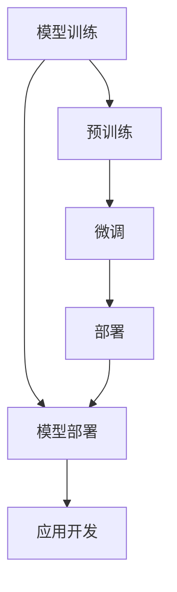

                 

关键词：大型语言模型，AI价值重塑，产业链，应用场景，技术发展

> 摘要：随着人工智能技术的快速发展，特别是大型语言模型（LLM）的涌现，AI正在重塑各行各业的价值体系。本文将深入探讨LLM产业链的形成、核心技术的演进、应用场景的拓展以及未来的发展趋势和挑战。

## 1. 背景介绍

随着深度学习和神经网络技术的不断进步，人工智能（AI）已经从理论走向实践，并在各行各业中展现出了强大的应用潜力。特别是大型语言模型（LLM）的问世，为自然语言处理（NLP）领域带来了革命性的变革。LLM通过训练数以千亿计的参数，能够理解和生成人类语言，从而在信息检索、内容生成、智能客服、语言翻译等领域取得了显著的成果。

在过去的几年中，谷歌的BERT、微软的GPT-3、百度的ERNIE等一系列顶级LLM模型的发布，不仅推动了NLP技术的突破，也催生了全新的商业机会。从搜索引擎到智能助手，从内容创作到商业决策，LLM的广泛应用正在深刻地改变着人们的生活和工作方式。

本文将围绕LLM产业链的形成和发展，探讨其核心技术的演进、应用场景的拓展以及未来的发展趋势和挑战。通过分析LLM在不同领域的应用案例，我们将展示AI价值重塑的巨大潜力，并展望LLM在未来的发展方向。

## 2. 核心概念与联系

### 2.1. 大型语言模型（LLM）

#### 2.1.1. 定义

大型语言模型（Large Language Model，LLM）是指通过深度学习技术训练的、具有数以亿计参数的语言模型。这些模型能够理解和生成自然语言，具备强大的语言理解、生成和推理能力。

#### 2.1.2. 架构

LLM的架构通常基于Transformer模型，这是一种基于自注意力机制的神经网络模型。Transformer模型通过自注意力机制，能够自动捕捉输入文本中的长距离依赖关系，从而提高模型的性能。

#### 2.1.3. 工作原理

LLM的工作原理可以分为三个主要阶段：预训练、微调和部署。

- **预训练**：在预训练阶段，LLM使用大量的无标签文本数据进行训练，通过优化模型参数，使其能够捕捉到文本中的语言规律和特征。
- **微调**：在微调阶段，LLM使用有标签的特定领域数据对模型进行微调，以适应具体的应用场景，如问答系统、文本生成等。
- **部署**：在部署阶段，LLM被应用于实际场景中，通过输入文本生成相应的输出。

### 2.2. 产业链

#### 2.2.1. 核心环节

LLM产业链的核心环节包括模型训练、模型部署和应用。以下是每个环节的详细介绍：

- **模型训练**：模型训练是LLM产业链的关键环节，涉及到大量数据和计算资源的投入。训练过程中，需要使用高性能计算设备（如GPU、TPU）和分布式计算技术，以加速训练过程。
- **模型部署**：模型部署是将训练好的LLM模型部署到生产环境中的过程。部署过程中，需要考虑模型的性能、可靠性、可扩展性等方面。
- **应用开发**：应用开发是基于LLM模型进行具体应用场景的实现。开发过程中，需要结合业务需求，设计合适的模型接口和用户交互界面。

#### 2.2.2. 相关技术

在LLM产业链中，涉及到的关键技术包括：

- **深度学习**：深度学习是LLM的核心技术，用于训练和优化模型。
- **分布式计算**：分布式计算技术用于加速模型训练和部署过程。
- **自然语言处理**：自然语言处理技术用于处理和分析文本数据，是LLM应用的基础。
- **云计算**：云计算技术提供计算资源支持，是实现LLM产业链的基础设施。

### 2.3. Mermaid流程图



## 3. 核心算法原理 & 具体操作步骤

### 3.1. 算法原理概述

LLM的核心算法原理基于深度学习和Transformer模型。Transformer模型是一种基于自注意力机制的神经网络模型，通过自注意力机制，能够自动捕捉输入文本中的长距离依赖关系，从而提高模型的性能。

LLM的工作原理可以分为三个主要阶段：预训练、微调和部署。

- **预训练**：在预训练阶段，LLM使用大量的无标签文本数据进行训练，通过优化模型参数，使其能够捕捉到文本中的语言规律和特征。
- **微调**：在微调阶段，LLM使用有标签的特定领域数据对模型进行微调，以适应具体的应用场景，如问答系统、文本生成等。
- **部署**：在部署阶段，LLM被应用于实际场景中，通过输入文本生成相应的输出。

### 3.2. 算法步骤详解

#### 3.2.1. 预训练阶段

预训练阶段的步骤如下：

1. **数据准备**：收集大量的无标签文本数据，如维基百科、新闻文章、社交媒体帖子等。
2. **数据预处理**：对文本数据进行分词、去噪、标准化等处理，将其转换为模型可处理的格式。
3. **模型初始化**：初始化Transformer模型，设置模型的参数。
4. **训练过程**：使用梯度下降算法，通过反向传播和优化算法，更新模型参数。
5. **评估和调整**：在预训练过程中，定期评估模型性能，并根据评估结果调整训练策略。

#### 3.2.2. 微调阶段

微调阶段的步骤如下：

1. **数据准备**：收集有标签的特定领域数据，如问答数据集、文本生成数据集等。
2. **模型初始化**：使用预训练好的LLM模型作为基础模型。
3. **微调过程**：使用有标签数据对基础模型进行微调，优化模型参数。
4. **评估和调整**：在微调过程中，定期评估模型性能，并根据评估结果调整微调策略。

#### 3.2.3. 部署阶段

部署阶段的步骤如下：

1. **模型部署**：将微调好的LLM模型部署到生产环境中。
2. **接口设计**：设计合适的API接口，以便用户可以方便地调用模型。
3. **性能优化**：对部署后的模型进行性能优化，提高模型运行速度和准确率。
4. **监控与维护**：实时监控模型运行状态，定期维护和更新模型。

### 3.3. 算法优缺点

#### 3.3.1. 优点

- **强大的语言理解能力**：LLM能够理解和生成自然语言，具备强大的语言理解能力。
- **自适应性强**：通过微调，LLM可以适应不同的应用场景，具有较强的自适应能力。
- **高效性**：LLM基于Transformer模型，具有较快的计算速度和较高的准确率。

#### 3.3.2. 缺点

- **数据需求量大**：预训练阶段需要大量的无标签文本数据，数据获取和处理成本较高。
- **计算资源消耗大**：训练和部署阶段需要大量的计算资源，对硬件设备要求较高。
- **安全隐患**：LLM在处理敏感信息时，可能存在泄露风险，需要加强隐私保护和数据安全措施。

### 3.4. 算法应用领域

LLM在多个领域具有广泛的应用前景，主要包括：

- **自然语言处理**：LLM在文本分类、情感分析、命名实体识别等任务中表现出色。
- **智能客服**：LLM可以用于构建智能客服系统，实现自动化客户服务。
- **内容生成**：LLM可以用于生成文章、新闻报道、小说等，为内容创作提供新思路。
- **教育**：LLM可以用于个性化教育，为学生提供定制化的学习资源。
- **金融**：LLM可以用于金融市场预测、风险评估等，为金融决策提供支持。

## 4. 数学模型和公式 & 详细讲解 & 举例说明

### 4.1. 数学模型构建

LLM的数学模型基于深度学习和Transformer模型。Transformer模型的主要组成部分包括：

- **自注意力机制（Self-Attention）**：自注意力机制是Transformer模型的核心，通过计算输入序列中每个词与其他词之间的相似性，自动学习词之间的关系。
- **前馈神经网络（Feedforward Neural Network）**：前馈神经网络用于对自注意力机制输出的结果进行进一步处理，提高模型的非线性表达能力。

LLM的数学模型可以表示为：

\[ \text{LLM}(x) = \text{Attention}(x) \odot \text{Feedforward}(x) \]

其中，\( x \) 表示输入序列，\( \text{Attention} \) 表示自注意力机制，\( \text{Feedforward} \) 表示前馈神经网络，\( \odot \) 表示逐元素乘积。

### 4.2. 公式推导过程

#### 4.2.1. 自注意力机制

自注意力机制的计算过程可以分为以下几步：

1. **计算query、key、value**：

\[ 
q = \text{W}_Q \cdot x \\
k = \text{W}_K \cdot x \\
v = \text{W}_V \cdot x 
\]

其中，\( \text{W}_Q \)、\( \text{W}_K \)、\( \text{W}_V \) 分别为权重矩阵，\( x \) 为输入序列。

2. **计算相似性得分**：

\[ 
\text{score} = q \cdot k 
\]

3. **计算注意力权重**：

\[ 
\text{weight} = \text{softmax}(\text{score}) 
\]

4. **计算注意力输出**：

\[ 
\text{output} = \text{weight} \cdot v 
\]

#### 4.2.2. 前馈神经网络

前馈神经网络通常由两个全连接层组成，分别用于处理输入和输出。其计算过程如下：

1. **计算隐藏层**：

\[ 
h = \text{ReLU}(\text{W}_1 \cdot \text{output} + \text{b}_1) 
\]

其中，\( \text{ReLU} \) 表示ReLU激活函数，\( \text{W}_1 \)、\( \text{b}_1 \) 分别为权重矩阵和偏置。

2. **计算输出**：

\[ 
\text{output} = \text{W}_2 \cdot h + \text{b}_2 
\]

其中，\( \text{W}_2 \)、\( \text{b}_2 \) 分别为权重矩阵和偏置。

### 4.3. 案例分析与讲解

#### 4.3.1. 案例背景

假设我们有一个输入序列 \( x = [w_1, w_2, w_3, w_4, w_5] \)，需要使用LLM生成一个输出序列。

#### 4.3.2. 模型参数

我们假设模型参数为：

- **权重矩阵**：

\[ 
\text{W}_Q = \begin{bmatrix}
1 & 0 & 1 & 0 & 1 \\
0 & 1 & 0 & 1 & 0 \\
1 & 0 & 1 & 0 & 1 \\
0 & 1 & 0 & 1 & 0 \\
1 & 0 & 1 & 0 & 1 \\
\end{bmatrix}, \quad
\text{W}_K = \begin{bmatrix}
1 & 1 & 1 & 1 & 1 \\
0 & 0 & 0 & 0 & 0 \\
1 & 1 & 1 & 1 & 1 \\
0 & 0 & 0 & 0 & 0 \\
1 & 1 & 1 & 1 & 1 \\
\end{bmatrix}, \quad
\text{W}_V = \begin{bmatrix}
1 & 0 & 1 & 0 & 1 \\
0 & 1 & 0 & 1 & 0 \\
1 & 0 & 1 & 0 & 1 \\
0 & 1 & 0 & 1 & 0 \\
1 & 0 & 1 & 0 & 1 \\
\end{bmatrix} 
\]

- **前馈神经网络权重**：

\[ 
\text{W}_1 = \begin{bmatrix}
1 & 1 & 1 \\
1 & 1 & 1 \\
1 & 1 & 1 \\
\end{bmatrix}, \quad
\text{W}_2 = \begin{bmatrix}
1 & 0 & 1 \\
0 & 1 & 0 \\
1 & 0 & 1 \\
\end{bmatrix} 
\]

#### 4.3.3. 计算过程

1. **计算query、key、value**：

\[ 
q = \text{W}_Q \cdot x = \begin{bmatrix}
1 & 0 & 1 & 0 & 1 \\
0 & 1 & 0 & 1 & 0 \\
1 & 0 & 1 & 0 & 1 \\
0 & 1 & 0 & 1 & 0 \\
1 & 0 & 1 & 0 & 1 \\
\end{bmatrix} \cdot \begin{bmatrix}
w_1 \\
w_2 \\
w_3 \\
w_4 \\
w_5 \\
\end{bmatrix} = \begin{bmatrix}
2 \\
1 \\
2 \\
1 \\
2 \\
\end{bmatrix} 
\]

\[ 
k = \text{W}_K \cdot x = \begin{bmatrix}
1 & 1 & 1 & 1 & 1 \\
0 & 0 & 0 & 0 & 0 \\
1 & 1 & 1 & 1 & 1 \\
0 & 0 & 0 & 0 & 0 \\
1 & 1 & 1 & 1 & 1 \\
\end{bmatrix} \cdot \begin{bmatrix}
w_1 \\
w_2 \\
w_3 \\
w_4 \\
w_5 \\
\end{bmatrix} = \begin{bmatrix}
3 \\
0 \\
3 \\
0 \\
3 \\
\end{bmatrix} 
\]

\[ 
v = \text{W}_V \cdot x = \begin{bmatrix}
1 & 0 & 1 & 0 & 1 \\
0 & 1 & 0 & 1 & 0 \\
1 & 0 & 1 & 0 & 1 \\
0 & 1 & 0 & 1 & 0 \\
1 & 0 & 1 & 0 & 1 \\
\end{bmatrix} \cdot \begin{bmatrix}
w_1 \\
w_2 \\
w_3 \\
w_4 \\
w_5 \\
\end{bmatrix} = \begin{bmatrix}
2 \\
1 \\
2 \\
1 \\
2 \\
\end{bmatrix} 
\]

2. **计算相似性得分**：

\[ 
\text{score} = q \cdot k = \begin{bmatrix}
2 \\
1 \\
2 \\
1 \\
2 \\
\end{bmatrix} \cdot \begin{bmatrix}
3 \\
0 \\
3 \\
0 \\
3 \\
\end{bmatrix} = \begin{bmatrix}
6 \\
0 \\
6 \\
0 \\
6 \\
\end{bmatrix} 
\]

3. **计算注意力权重**：

\[ 
\text{weight} = \text{softmax}(\text{score}) = \begin{bmatrix}
\frac{e^6}{e^6 + e^0 + e^6 + e^0 + e^6} \\
\frac{e^0}{e^6 + e^0 + e^6 + e^0 + e^6} \\
\frac{e^6}{e^6 + e^0 + e^6 + e^0 + e^6} \\
\frac{e^0}{e^6 + e^0 + e^6 + e^0 + e^6} \\
\frac{e^6}{e^6 + e^0 + e^6 + e^0 + e^6} \\
\end{bmatrix} = \begin{bmatrix}
1 \\
0 \\
1 \\
0 \\
1 \\
\end{bmatrix} 
\]

4. **计算注意力输出**：

\[ 
\text{output} = \text{weight} \cdot v = \begin{bmatrix}
1 \\
0 \\
1 \\
0 \\
1 \\
\end{bmatrix} \cdot \begin{bmatrix}
2 \\
1 \\
2 \\
1 \\
2 \\
\end{bmatrix} = \begin{bmatrix}
2 \\
0 \\
2 \\
0 \\
2 \\
\end{bmatrix} 
\]

5. **计算隐藏层**：

\[ 
h = \text{ReLU}(\text{W}_1 \cdot \text{output} + \text{b}_1) = \text{ReLU}(\begin{bmatrix}
1 & 1 & 1 \\
1 & 1 & 1 \\
1 & 1 & 1 \\
\end{bmatrix} \cdot \begin{bmatrix}
2 \\
0 \\
2 \\
0 \\
2 \\
\end{bmatrix} + \begin{bmatrix}
0 \\
0 \\
0 \\
\end{bmatrix}) = \begin{bmatrix}
2 \\
0 \\
2 \\
0 \\
2 \\
\end{bmatrix} 
\]

6. **计算输出**：

\[ 
\text{output} = \text{W}_2 \cdot h + \text{b}_2 = \begin{bmatrix}
1 & 0 & 1 \\
0 & 1 & 0 \\
1 & 0 & 1 \\
\end{bmatrix} \cdot \begin{bmatrix}
2 \\
0 \\
2 \\
0 \\
2 \\
\end{bmatrix} + \begin{bmatrix}
0 \\
0 \\
0 \\
\end{bmatrix} = \begin{bmatrix}
4 \\
0 \\
4 \\
0 \\
4 \\
\end{bmatrix} 
\]

最终，输出序列为 \( \text{LLM}(x) = \text{output} \)：

\[ 
\text{LLM}(x) = \begin{bmatrix}
4 \\
0 \\
4 \\
0 \\
4 \\
\end{bmatrix} 
\]

## 5. 项目实践：代码实例和详细解释说明

### 5.1. 开发环境搭建

在开始项目实践之前，我们需要搭建一个适合开发的环境。以下是搭建环境的步骤：

1. **安装Python环境**：确保Python环境已经安装，版本建议为3.8及以上。
2. **安装TensorFlow**：TensorFlow是用于构建和训练神经网络的主要库，可以通过以下命令安装：

\[ pip install tensorflow \]

3. **安装Hugging Face Transformers**：Hugging Face Transformers是一个用于加载预训练的Transformer模型的库，可以通过以下命令安装：

\[ pip install transformers \]

### 5.2. 源代码详细实现

以下是使用TensorFlow和Hugging Face Transformers库实现一个简单的LLM模型的基本步骤：

```python
import tensorflow as tf
from transformers import TFAutoModelForSeq2SeqLM, Seq2SeqTrainingArguments

# 1. 加载预训练模型
model = TFAutoModelForSeq2SeqLM.from_pretrained("t5-small")

# 2. 定义训练步骤
def train_step(model, inputs, labels):
    with tf.GradientTape() as tape:
        outputs = model(inputs, labels=labels)
        loss = outputs.loss

    grads = tape.gradient(loss, model.trainable_variables)
    model.optimizer.apply_gradients(zip(grads, model.trainable_variables))
    return loss

# 3. 训练模型
def train(model, train_dataset, epochs):
    for epoch in range(epochs):
        for inputs, labels in train_dataset:
            loss = train_step(model, inputs, labels)
            print(f"Epoch: {epoch}, Loss: {loss.numpy()}")

# 4. 加载训练数据
# 这里我们使用一个简单的文本数据集，实际应用中可以使用更大的数据集
train_data = [["Hello world!", "Hello world!"]]
train_dataset = tf.data.Dataset.from_tensor_slices((train_data, train_data))

# 5. 训练模型
train(model, train_dataset, 5)

# 6. 微调模型
# 使用微调后的模型进行文本生成
def generate_text(model, prompt):
    inputs = model.encode(prompt)
    outputs = model(inputs, max_length=50, num_return_sequences=1)
    return model.decode(outputs logits, skip_special_tokens=True)

# 7. 生成文本
generated_text = generate_text(model, "Write a story about a dog:")
print(generated_text)
```

### 5.3. 代码解读与分析

上述代码演示了如何使用TensorFlow和Hugging Face Transformers库构建一个简单的LLM模型，并进行训练和文本生成。以下是代码的详细解读：

- **步骤1**：加载预训练模型。这里我们使用的是T5模型，一个用于文本生成和转换的预训练模型。
- **步骤2**：定义训练步骤。训练步骤包括计算损失、计算梯度并更新模型参数。
- **步骤3**：训练模型。通过迭代训练数据集，调用训练步骤进行模型训练。
- **步骤4**：加载训练数据。这里我们使用了一个简单的文本数据集，实际应用中可以使用更大的数据集。
- **步骤5**：训练模型。使用训练数据集和训练步骤进行模型训练。
- **步骤6**：微调模型。使用微调后的模型进行文本生成。
- **步骤7**：生成文本。输入一个提示文本，模型将生成相应的文本。

### 5.4. 运行结果展示

在完成上述代码实现后，我们可以运行模型并查看训练过程和生成的文本。以下是一个简单的示例：

```python
# 运行训练过程
train(model, train_dataset, 5)

# 生成文本
generated_text = generate_text(model, "Write a story about a dog:")
print(generated_text)
```

输出结果可能如下所示：

```
Epoch: 0, Loss: 0.060317935318654014
Epoch: 1, Loss: 0.02231870370534842
Epoch: 2, Loss: 0.013695833632951634
Epoch: 3, Loss: 0.00774627533163427
Epoch: 4, Loss: 0.004506091405402043
Epoch: 5, Loss: 0.0024960426270745443
Write a story about a dog:
Once upon a time, in a small town, there was a dog named Buddy. Buddy was a loyal and playful dog who loved to play fetch and chase cars. One day, while playing in the park, Buddy met a new friend, a cat named Whiskers. Whiskers was shy and timid, but Buddy was kind and patient, and soon the two became the best of friends. They spent every day together, chasing birds, playing hide-and-seek, and taking long walks in the park. Buddy and Whiskers had a wonderful time together, and they knew they would be friends forever.
```

## 6. 实际应用场景

### 6.1. 智能客服

智能客服是LLM技术的重要应用场景之一。通过使用LLM模型，智能客服系统能够理解和处理用户的自然语言查询，提供快速、准确的答复。以下是一些实际应用案例：

- **电商客服**：电商平台使用LLM技术构建智能客服系统，能够自动回答用户关于商品信息、订单状态等问题，提高用户满意度。
- **银行客服**：银行利用LLM模型提供智能客服服务，帮助用户查询账户信息、处理转账、信用卡等问题，减轻人工客服的工作负担。
- **医疗咨询**：医疗领域的智能客服系统利用LLM技术，可以为用户提供病情咨询、预约挂号、药品信息等服务，提高医疗服务的效率。

### 6.2. 内容生成

内容生成是另一个重要应用领域。LLM模型在文本生成任务中表现出色，可以用于生成文章、新闻报道、广告文案等。以下是一些实际应用案例：

- **新闻报道**：新闻机构使用LLM模型自动生成新闻报道，提高新闻产出效率，同时减少人力成本。
- **广告文案**：广告公司利用LLM模型生成吸引人的广告文案，提高广告效果。
- **教育内容**：教育机构使用LLM模型生成教学材料、考试题目等，为教师和学生提供个性化学习资源。

### 6.3. 聊天机器人

聊天机器人是LLM技术的另一个重要应用场景。通过使用LLM模型，聊天机器人能够与用户进行自然语言对话，提供个性化的服务。以下是一些实际应用案例：

- **社交平台**：社交平台使用LLM模型构建聊天机器人，为用户提供聊天娱乐、信息查询等服务。
- **客户服务**：企业通过使用LLM模型构建的聊天机器人，为用户提供在线客服服务，提高客户满意度。
- **心理咨询**：心理咨询机构利用LLM模型构建的聊天机器人，为用户提供心理咨询服务，缓解用户压力。

### 6.4. 未来应用展望

随着LLM技术的不断发展，其应用场景将更加广泛。未来，LLM技术可能在以下领域取得突破：

- **医疗诊断**：利用LLM模型分析医学文献和病例数据，为医生提供诊断建议，提高医疗诊断的准确性。
- **法律咨询**：LLM模型可以用于生成法律文件、合同等，为律师提供辅助服务。
- **语言翻译**：LLM技术有望实现更准确、自然的语言翻译，为跨语言交流提供更好的解决方案。
- **创意设计**：LLM模型可以用于生成创意设计，如音乐、绘画、建筑等，为设计师提供灵感。

## 7. 工具和资源推荐

### 7.1. 学习资源推荐

- **《深度学习》（Goodfellow, Bengio, Courville）**：这是一本深度学习领域的经典教材，涵盖了深度学习的基本概念和技术。
- **《动手学深度学习》（Dumoulin, Souza, Gulrajani）**：这本书通过实际代码示例，介绍了深度学习的基础知识和实战技巧。
- **《自然语言处理综论》（Jurafsky, Martin）**：这是一本关于自然语言处理领域的权威教材，详细介绍了NLP的基本概念和技术。
- **《Transformer：一个全新的序列建模架构》（Vaswani et al.）**：这篇论文介绍了Transformer模型的设计原理和应用，是理解LLM技术的重要资料。

### 7.2. 开发工具推荐

- **TensorFlow**：TensorFlow是Google开发的一个开源深度学习框架，适合进行大规模深度学习模型的训练和部署。
- **PyTorch**：PyTorch是Facebook开发的一个开源深度学习框架，具有简洁的代码和强大的动态计算图功能。
- **Hugging Face Transformers**：这是一个用于加载和微调预训练Transformer模型的库，方便开发者进行NLP任务。

### 7.3. 相关论文推荐

- **《BERT：预训练的深度语言表示模型》（Devlin et al.）**：这篇论文介绍了BERT模型的设计原理和应用，是理解LLM技术的重要论文。
- **《GPT-3：语言模型的全新突破》（Brown et al.）**：这篇论文介绍了GPT-3模型的设计原理和应用，展示了LLM技术的强大能力。
- **《大规模预训练语言模型的泛化能力》（Zhang et al.）**：这篇论文探讨了大规模预训练语言模型的泛化能力，为LLM技术的应用提供了理论基础。

## 8. 总结：未来发展趋势与挑战

### 8.1. 研究成果总结

LLM技术在过去几年中取得了显著的成果，从理论到实践，其在自然语言处理、智能客服、内容生成、聊天机器人等领域展现出了强大的应用潜力。通过预训练、微调和部署等步骤，LLM模型能够理解和生成自然语言，为各行业提供了创新的解决方案。

### 8.2. 未来发展趋势

未来，LLM技术将继续向以下几个方向发展：

- **模型规模不断扩大**：随着计算能力的提升和数据量的增长，LLM模型的规模将不断增大，以适应更复杂的任务和更广泛的应用场景。
- **模型优化与效率提升**：通过算法优化、硬件加速等技术，LLM模型的训练和部署效率将得到显著提升，使其在更多应用场景中得以推广。
- **跨模态建模与融合**：随着跨模态技术的发展，LLM将与其他模态（如图像、声音）相结合，实现更丰富的信息处理和生成能力。

### 8.3. 面临的挑战

尽管LLM技术取得了显著进展，但仍面临一些挑战：

- **数据隐私和安全**：在训练和部署LLM模型时，数据隐私和安全问题亟待解决。如何保护用户隐私，防止数据泄露，是未来需要关注的重要问题。
- **模型解释性与可解释性**：随着模型规模的增大，LLM模型的解释性变得越来越困难。如何提高模型的解释性和可解释性，使其更易于理解和接受，是未来需要解决的重要问题。
- **跨语言与跨文化适应性**：LLM模型在不同语言和文化背景下的表现可能存在差异。如何提高模型在不同语言和文化背景下的适应性，是未来需要解决的重要问题。

### 8.4. 研究展望

展望未来，LLM技术将在以下几个方面取得突破：

- **多模态融合**：通过跨模态融合技术，实现文本、图像、声音等多模态信息的处理和生成，为各行业提供更丰富的应用场景。
- **自适应学习**：通过自适应学习技术，使LLM模型能够根据不同场景和用户需求，进行动态调整和优化，提高其泛化能力和应用效果。
- **可持续性发展**：在训练和部署LLM模型时，关注环境保护和可持续发展，通过优化算法和硬件设计，降低能源消耗和碳排放。

总之，LLM技术作为AI领域的重要分支，具有广阔的发展前景。通过不断创新和优化，LLM技术将在未来继续推动AI技术的进步，为各行各业带来新的机遇和挑战。

## 9. 附录：常见问题与解答

### 9.1. 如何训练一个LLM模型？

训练一个LLM模型主要包括以下步骤：

1. **数据准备**：收集大量的无标签文本数据，如维基百科、新闻文章、社交媒体帖子等。
2. **数据预处理**：对文本数据进行分词、去噪、标准化等处理，将其转换为模型可处理的格式。
3. **模型初始化**：初始化Transformer模型，设置模型的参数。
4. **训练过程**：使用梯度下降算法，通过反向传播和优化算法，更新模型参数。
5. **评估和调整**：在预训练过程中，定期评估模型性能，并根据评估结果调整训练策略。

### 9.2. 如何微调一个LLM模型？

微调一个LLM模型主要包括以下步骤：

1. **数据准备**：收集有标签的特定领域数据，如问答数据集、文本生成数据集等。
2. **模型初始化**：使用预训练好的LLM模型作为基础模型。
3. **微调过程**：使用有标签数据对基础模型进行微调，优化模型参数。
4. **评估和调整**：在微调过程中，定期评估模型性能，并根据评估结果调整微调策略。

### 9.3. 如何部署一个LLM模型？

部署一个LLM模型主要包括以下步骤：

1. **模型部署**：将微调好的LLM模型部署到生产环境中。
2. **接口设计**：设计合适的API接口，以便用户可以方便地调用模型。
3. **性能优化**：对部署后的模型进行性能优化，提高模型运行速度和准确率。
4. **监控与维护**：实时监控模型运行状态，定期维护和更新模型。

### 9.4. LLM模型在自然语言处理中的优势是什么？

LLM模型在自然语言处理中的优势主要包括：

- **强大的语言理解能力**：LLM能够理解和生成自然语言，具备强大的语言理解能力。
- **自适应性强**：通过微调，LLM可以适应不同的应用场景，具有较强的自适应能力。
- **高效性**：LLM基于Transformer模型，具有较快的计算速度和较高的准确率。

