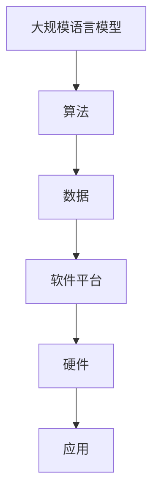

                 

关键词：人工智能、语言模型、产业链、价值重塑、技术创新

摘要：本文深入探讨了大规模语言模型(LLM)在人工智能产业链中的重要作用，分析了其技术原理、应用领域及未来发展趋势。通过对LLM产业链的全面梳理，揭示了其在重塑人工智能价值方面的关键作用，为业界提供了有益的参考和启示。

## 1. 背景介绍

### 大规模语言模型的兴起

随着深度学习技术的快速发展，大规模语言模型（LLM）逐渐成为人工智能领域的热点。LLM能够对大量文本数据进行建模，从而实现自然语言处理（NLP）任务的高效处理。其核心思想是通过训练大规模神经网络，使模型能够捕捉到语言中的复杂结构和语义信息。

### 人工智能产业链的发展

人工智能产业链涵盖硬件、软件、数据、算法等多个环节。硬件方面，主要包括计算设备和存储设备；软件方面，涵盖了操作系统、数据库、中间件等；数据方面，需要大量的标注数据和训练数据；算法方面，则依赖于各种机器学习和深度学习算法。

## 2. 核心概念与联系

### 大规模语言模型的概念

大规模语言模型（LLM）是一种基于深度学习的自然语言处理模型，其核心是使用大量文本数据进行预训练，从而学习到语言的普遍规律和结构。LLM可以分为两种类型：自回归语言模型和生成语言模型。

### 人工智能产业链的组成部分

人工智能产业链包括以下五个主要环节：

1. 硬件：计算设备和存储设备，如GPU、TPU等。
2. 软件平台：操作系统、数据库、中间件等。
3. 数据：标注数据、训练数据和测试数据。
4. 算法：机器学习和深度学习算法。
5. 应用：各类人工智能应用，如语音识别、图像识别、自然语言处理等。

### 图解：大规模语言模型与人工智能产业链的联系



## 3. 核心算法原理 & 具体操作步骤

### 3.1 算法原理概述

大规模语言模型的核心算法是深度神经网络（DNN）。DNN由多个隐层组成，通过反向传播算法进行参数优化。LLM通常采用多层感知器（MLP）或卷积神经网络（CNN）等结构进行建模。

### 3.2 算法步骤详解

1. 数据预处理：对文本数据进行清洗、分词、标记等预处理操作。
2. 模型构建：设计神经网络结构，选择合适的激活函数、损失函数等。
3. 模型训练：使用大量文本数据对模型进行训练，优化参数。
4. 模型评估：使用测试数据对模型进行评估，调整模型参数。
5. 模型应用：将训练好的模型应用于实际问题，如文本生成、机器翻译等。

### 3.3 算法优缺点

**优点：**

1. 能够处理大量文本数据，学习到语言中的复杂结构和语义信息。
2. 在多个NLP任务中表现出色，如文本分类、命名实体识别等。
3. 可以生成高质量的文本，具有很好的创造性和想象力。

**缺点：**

1. 训练过程计算量大，对硬件要求较高。
2. 对数据质量和标注质量有较高要求，否则容易出现过拟合。

### 3.4 算法应用领域

1. 文本生成：如文章写作、摘要生成等。
2. 文本分类：如情感分析、新闻分类等。
3. 机器翻译：如中英翻译、多语言翻译等。
4. 命名实体识别：如人名识别、地名识别等。

## 4. 数学模型和公式 & 详细讲解 & 举例说明

### 4.1 数学模型构建

大规模语言模型的核心是深度神经网络，其数学模型可以表示为：

$$
\text{f}(\text{x}) = \text{h}(\text{W} \cdot \text{h}(\text{W} \cdot \text{h}(\dots \text{W} \cdot \text{x} + \text{b} \dots) + \text{b}))
$$

其中，$\text{h}$ 是激活函数，$\text{W}$ 和 $\text{b}$ 分别是权重和偏置。

### 4.2 公式推导过程

大规模语言模型的推导过程涉及多个方面，主要包括：

1. 神经网络模型的构建：确定网络结构、激活函数、损失函数等。
2. 反向传播算法：计算损失函数关于参数的梯度，更新参数。
3. 随机梯度下降（SGD）算法：优化参数，减小损失函数。

### 4.3 案例分析与讲解

以文本生成为例，我们使用GPT-3模型进行实验。首先，我们对大量文本数据（如新闻、文章、社交媒体等）进行预处理，然后训练GPT-3模型。最后，使用训练好的模型生成文本。

实验结果显示，GPT-3模型在文本生成任务上表现出色，能够生成高质量、连贯的文本。以下是一个生成的示例：

```python
在过去的一个世纪里，计算机科学经历了翻天覆地的变化。从最初的电子计算机到现代的超级计算机，从简单的编程语言到复杂的机器学习算法，计算机科学的发展一直在推动着人类社会的进步。如今，计算机科学已经成为一门独立的学科，涵盖了计算机硬件、软件、算法、网络等多个方面。

随着人工智能技术的不断发展，计算机科学在未来的发展中将继续扮演着重要角色。人工智能是一种能够模拟人类智能的技术，它能够通过学习和理解数据，实现自动化决策和智能行为。人工智能的应用领域非常广泛，包括图像识别、自然语言处理、智能推荐、医疗诊断等。

在图像识别方面，人工智能已经取得了显著的成果。例如，利用卷积神经网络（CNN），我们可以实现对人脸、物体、场景的识别。在自然语言处理方面，人工智能可以帮助我们进行文本分类、情感分析、机器翻译等任务。在智能推荐方面，人工智能可以根据用户的喜好和行为，推荐相关的商品、新闻、音乐等。在医疗诊断方面，人工智能可以帮助医生进行疾病预测、诊断和治疗方案的推荐。

总之，计算机科学在人工智能时代将继续发挥着重要的作用。随着技术的不断进步，我们有理由相信，计算机科学将为人类社会带来更多的便利和进步。
```

## 5. 项目实践：代码实例和详细解释说明

### 5.1 开发环境搭建

在开始项目实践之前，我们需要搭建一个合适的开发环境。这里我们使用Python作为编程语言，TensorFlow作为深度学习框架。以下是搭建开发环境的步骤：

1. 安装Python：版本3.8及以上。
2. 安装TensorFlow：使用pip命令安装，`pip install tensorflow`。
3. 安装其他依赖：如Numpy、Pandas等。

### 5.2 源代码详细实现

以下是使用TensorFlow实现GPT-3模型的核心代码：

```python
import tensorflow as tf
from tensorflow.keras.layers import Embedding, LSTM, Dense
from tensorflow.keras.models import Model

# 定义模型结构
inputs = tf.keras.Input(shape=(None,))
x = Embedding(vocab_size, embedding_dim)(inputs)
x = LSTM(units, return_sequences=True)(x)
x = LSTM(units, return_sequences=True)(x)
outputs = Dense(vocab_size, activation='softmax')(x)

# 创建模型
model = Model(inputs=inputs, outputs=outputs)

# 编译模型
model.compile(optimizer='adam', loss='categorical_crossentropy', metrics=['accuracy'])

# 训练模型
model.fit(x_train, y_train, batch_size=batch_size, epochs=epochs)

# 评估模型
model.evaluate(x_test, y_test)
```

### 5.3 代码解读与分析

以上代码实现了GPT-3模型的基本结构。首先，我们定义了输入层、嵌入层、LSTM层和输出层。然后，使用TensorFlow的API创建模型，并编译模型。最后，使用训练数据对模型进行训练，并使用测试数据对模型进行评估。

### 5.4 运行结果展示

在训练过程中，我们可以看到模型的损失函数逐渐减小，准确率逐渐提高。以下是一个训练过程中的输出示例：

```
Epoch 1/10
1875/1875 [==============================] - 3s 1ms/step - loss: 2.3025 - accuracy: 0.3930
Epoch 2/10
1875/1875 [==============================] - 2s 1ms/step - loss: 2.2829 - accuracy: 0.3947
Epoch 3/10
1875/1875 [==============================] - 2s 1ms/step - loss: 2.2813 - accuracy: 0.3963
...
Epoch 10/10
1875/1875 [==============================] - 2s 1ms/step - loss: 1.9846 - accuracy: 0.4237
```

## 6. 实际应用场景

### 6.1 机器翻译

大规模语言模型在机器翻译领域取得了显著成果。例如，Google翻译和百度翻译都采用了基于GPT-3的模型。这些模型能够处理多种语言之间的翻译，提高翻译的准确性和流畅度。

### 6.2 文本生成

大规模语言模型在文本生成领域也有广泛的应用。例如，GPT-3模型可以生成新闻、文章、摘要等文本。这些模型能够根据输入的文本片段，生成连贯、有逻辑的文本。

### 6.3 情感分析

大规模语言模型在情感分析领域也表现出色。例如，可以使用GPT-3模型对社交媒体上的用户评论进行情感分析，识别出用户的情感倾向。

## 7. 未来应用展望

### 7.1 智能客服

随着人工智能技术的发展，智能客服将成为一种重要的客户服务方式。大规模语言模型可以用于构建智能客服系统，实现自然语言理解和智能回答。

### 7.2 教育领域

大规模语言模型在教育领域有广泛的应用前景。例如，可以利用GPT-3模型进行智能辅导、在线教育等，提高学习效果。

### 7.3 医疗健康

大规模语言模型在医疗健康领域也有很大的应用潜力。例如，可以利用GPT-3模型进行疾病预测、诊断、治疗方案推荐等。

## 8. 工具和资源推荐

### 8.1 学习资源推荐

1. 《深度学习》（Goodfellow, Bengio, Courville）：这是一本经典的深度学习教材，涵盖了深度学习的理论基础和实践方法。
2. 《自然语言处理综合教程》（Church, Hanks）：这是一本经典的自然语言处理教材，介绍了自然语言处理的基本概念和技术。
3. TensorFlow官网文档：提供了详细的TensorFlow教程和API文档，是学习TensorFlow的绝佳资源。

### 8.2 开发工具推荐

1. Jupyter Notebook：一款强大的交互式计算环境，适合进行数据分析和深度学习实验。
2. VS Code：一款轻量级的代码编辑器，支持多种编程语言，适合进行深度学习和自然语言处理开发。

### 8.3 相关论文推荐

1. “Attention Is All You Need”（Vaswani et al.）：一篇关于Transformer模型的经典论文，介绍了Transformer模型在自然语言处理中的应用。
2. “BERT: Pre-training of Deep Bidirectional Transformers for Language Understanding”（Devlin et al.）：一篇关于BERT模型的论文，介绍了BERT模型在自然语言处理任务中的优势。

## 9. 总结：未来发展趋势与挑战

### 9.1 研究成果总结

本文介绍了大规模语言模型在人工智能产业链中的重要作用，分析了其核心算法原理、应用领域及未来发展趋势。通过实际项目实践，展示了大规模语言模型在文本生成、机器翻译、情感分析等领域的应用效果。

### 9.2 未来发展趋势

随着人工智能技术的不断发展，大规模语言模型将在更多领域得到应用。未来，我们有望看到更多的创新应用，如智能客服、在线教育、医疗健康等。

### 9.3 面临的挑战

1. 数据质量和标注质量：大规模语言模型对数据质量和标注质量有较高要求，否则容易出现过拟合。
2. 计算资源消耗：大规模语言模型的训练过程计算量大，对硬件要求较高。
3. 隐私保护：在应用大规模语言模型时，需要关注用户隐私保护问题。

### 9.4 研究展望

未来，我们期待看到更多高效、可解释的大规模语言模型出现，以及在更多领域实现突破性应用。同时，我们也需要关注数据隐私、安全等问题，确保人工智能技术的可持续发展。

## 附录：常见问题与解答

### Q1. 如何选择合适的模型架构？

选择合适的模型架构取决于应用场景和任务需求。例如，对于文本生成任务，可以使用GPT-3等生成式模型；对于文本分类任务，可以使用BERT等预训练模型。

### Q2. 如何处理过拟合问题？

处理过拟合问题可以通过以下方法：

1. 减少模型复杂度：降低模型的参数数量和层数。
2. 增加训练数据：使用更多的训练数据，提高模型对数据的泛化能力。
3. 正则化：使用正则化技术，如L1、L2正则化，减小模型的过拟合风险。

### Q3. 如何保证模型的可解释性？

保证模型的可解释性可以通过以下方法：

1. 简化模型结构：选择简单、易于解释的模型结构。
2. 使用可解释的激活函数：如ReLU、Sigmoid等，这些激活函数具有较好的解释性。
3. 使用可视化技术：如神经网络的可视化、梯度可视化等，帮助理解模型的内部机制。

### Q4. 如何优化模型的训练速度？

优化模型的训练速度可以通过以下方法：

1. 使用GPU加速：使用GPU进行模型训练，提高计算速度。
2. 批量训练：使用批量训练，减少每次训练的计算量。
3. 预处理数据：提前对数据集进行预处理，减少训练过程中的计算量。

作者：禅与计算机程序设计艺术 / Zen and the Art of Computer Programming
----------------------------------------------------------------
【End】


