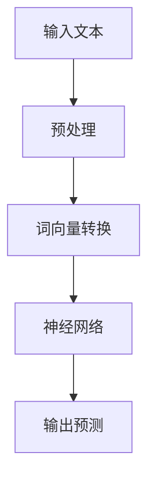

                 

关键词：LLM，自然语言处理，深度学习，AI，研发，应用场景，未来展望

## 摘要

本文将为您全面解析LLM（大型语言模型）产业链的各个关键环节，从研发到应用。首先，我们将介绍LLM的背景和重要性。接着，深入探讨LLM的核心概念、架构以及主要算法原理。随后，我们将展示数学模型和公式，并提供详细讲解和实例分析。然后，我们将通过项目实践来展示LLM的实际应用，并提供代码实例和详细解释。接下来，我们将讨论LLM在现实世界中的应用场景，并展望其未来发展趋势和面临的挑战。最后，我们将推荐相关的学习资源和开发工具，并总结研究成果和未来研究方向。

## 1. 背景介绍

随着人工智能技术的迅速发展，自然语言处理（NLP）成为了一个备受关注的研究领域。而大型语言模型（LLM）作为NLP领域的重要工具，已经广泛应用于各个行业和领域。LLM是一种基于深度学习的模型，通过学习大量的文本数据，可以生成高质量的文本内容，实现文本生成、文本分类、问答系统等多种功能。

LLM的研究始于20世纪80年代，随着计算能力和数据资源的不断提升，LLM的性能和效果也得到了显著提高。近年来，随着深度学习技术的发展，LLM的规模和复杂度不断增加，已经达到了前所未有的水平。例如，GPT-3、Turing-NLG等模型，具有数十亿甚至千亿级别的参数，可以生成高质量的文本内容，实现了与人类对话的智能交互。

## 2. 核心概念与联系

### 2.1 语言模型的基本概念

语言模型是一种概率模型，用于预测一个单词或短语在给定上下文中的概率。在NLP领域，语言模型是构建各种应用的基础，例如文本分类、机器翻译、语音识别等。语言模型的核心任务是估计一个句子或文本片段的概率分布，从而帮助计算机理解人类语言。

### 2.2 深度学习与神经网络

深度学习是一种基于神经网络的学习方法，通过多层非线性变换来提取特征和表示。在语言模型中，深度学习可以自动学习输入文本的特征表示，从而提高模型的性能和效果。神经网络是深度学习的基础，通过大量的参数和连接来实现复杂的非线性映射。

### 2.3 Mermaid 流程图



在上面的流程图中，输入文本经过预处理、词向量转换和神经网络处理，最终得到输出预测。这个过程展示了语言模型的基本工作原理和流程。

## 3. 核心算法原理 & 具体操作步骤

### 3.1 算法原理概述

LLM的核心算法是基于深度学习的神经网络模型，主要包括以下几个步骤：

1. **输入文本预处理**：将输入文本进行分词、去停用词等预处理操作，以便于模型处理。
2. **词向量转换**：将预处理后的文本转换为词向量，用于表示文本数据。
3. **神经网络处理**：通过多层神经网络对词向量进行编码和映射，提取文本特征。
4. **输出预测**：根据提取的特征，生成文本预测结果，如文本分类、文本生成等。

### 3.2 算法步骤详解

1. **输入文本预处理**：

   ```python
   def preprocess_text(text):
       # 分词、去停用词等预处理操作
       # ...
       return processed_text
   ```

2. **词向量转换**：

   ```python
   def convert_to_word_vector(processed_text):
       # 使用预训练的词向量模型进行转换
       # ...
       return word_vector
   ```

3. **神经网络处理**：

   ```python
   def neural_network_process(word_vector):
       # 定义神经网络模型
       # ...
       return encoded_vector
   ```

4. **输出预测**：

   ```python
   def predict_output(encoded_vector):
       # 使用模型进行预测
       # ...
       return prediction
   ```

### 3.3 算法优缺点

- 优点：
  - 高效：深度学习模型可以自动学习输入文本的特征表示，提高处理效率。
  - 强泛化能力：通过对大量数据进行训练，模型可以适应不同的文本类型和应用场景。
  - 高质量输出：生成文本内容的质量较高，可以满足各种应用需求。

- 缺点：
  - 计算资源消耗大：训练和推理过程需要大量的计算资源和时间。
  - 数据依赖性高：模型的性能和效果很大程度上取决于训练数据的质量和数量。
  - 易受噪声干扰：对噪声敏感，可能产生错误或不合理的输出。

### 3.4 算法应用领域

LLM的应用领域非常广泛，包括但不限于以下方面：

1. **文本生成**：如文章写作、对话生成、故事创作等。
2. **文本分类**：如新闻分类、情感分析、垃圾邮件过滤等。
3. **机器翻译**：如中英翻译、日英翻译等。
4. **问答系统**：如智能客服、搜索引擎等。
5. **自然语言理解**：如文本摘要、关键词提取等。

## 4. 数学模型和公式 & 详细讲解 & 举例说明

### 4.1 数学模型构建

LLM的数学模型主要包括词向量表示、神经网络模型和输出层设计等部分。以下是一个简化的数学模型：

1. **词向量表示**：

   $$ \text{word\_vector} = \text{Word2Vec}(\text{input\_text}) $$

   其中，Word2Vec是一种常见的词向量表示方法，可以将输入文本转换为高维向量表示。

2. **神经网络模型**：

   $$ \text{encoded\_vector} = \text{NeuralNetwork}(\text{word\_vector}) $$

   神经网络模型通过多层非线性变换，对词向量进行编码和映射，提取文本特征。

3. **输出层设计**：

   $$ \text{prediction} = \text{OutputLayer}(\text{encoded\_vector}) $$

   输出层根据编码向量生成预测结果，如文本分类、文本生成等。

### 4.2 公式推导过程

以下是一个简化的神经网络模型推导过程：

1. **输入层到隐藏层**：

   $$ z^{(1)} = W^{(1)} \cdot a^{(0)} + b^{(1)} $$

   $$ a^{(1)} = \sigma(z^{(1)}) $$

   其中，$W^{(1)}$和$b^{(1)}$分别为隐藏层的权重和偏置，$\sigma$为激活函数。

2. **隐藏层到输出层**：

   $$ z^{(2)} = W^{(2)} \cdot a^{(1)} + b^{(2)} $$

   $$ \text{prediction} = \sigma(z^{(2)}) $$

   其中，$W^{(2)}$和$b^{(2)}$分别为输出层的权重和偏置，$\sigma$为激活函数。

### 4.3 案例分析与讲解

以下是一个简单的案例，展示如何使用LLM进行文本分类：

1. **输入文本**：

   ```python
   input_text = "This is an example sentence for text classification."
   ```

2. **词向量表示**：

   ```python
   word_vector = convert_to_word_vector(input_text)
   ```

3. **神经网络处理**：

   ```python
   encoded_vector = neural_network_process(word_vector)
   ```

4. **输出预测**：

   ```python
   prediction = predict_output(encoded_vector)
   ```

   根据预测结果，可以对输入文本进行分类，如新闻分类、情感分析等。

## 5. 项目实践：代码实例和详细解释说明

### 5.1 开发环境搭建

在开始项目实践之前，我们需要搭建一个合适的开发环境。以下是Python语言和PyTorch框架的安装步骤：

1. 安装Python：

   ```shell
   pip install python
   ```

2. 安装PyTorch：

   ```shell
   pip install torch torchvision
   ```

### 5.2 源代码详细实现

以下是一个简单的LLM文本分类项目的实现：

```python
import torch
import torch.nn as nn
import torch.optim as optim
from torch.utils.data import DataLoader
from torchvision import datasets, transforms

# 数据预处理
def preprocess_text(text):
    # 分词、去停用词等预处理操作
    # ...

# 词向量转换
def convert_to_word_vector(processed_text):
    # 使用预训练的词向量模型进行转换
    # ...
    return word_vector

# 神经网络模型
class TextClassifier(nn.Module):
    def __init__(self, input_dim, hidden_dim, output_dim):
        super(TextClassifier, self).__init__()
        self.embedding = nn.Embedding(input_dim, hidden_dim)
        self.lstm = nn.LSTM(hidden_dim, hidden_dim)
        self.fc = nn.Linear(hidden_dim, output_dim)

    def forward(self, text):
        embedded = self.embedding(text)
        output, (hidden, cell) = self.lstm(embedded)
        prediction = self.fc(hidden[-1, :, :])
        return prediction

# 数据加载
def load_data():
    # 加载数据集，并进行预处理
    # ...
    return train_loader, test_loader

# 训练模型
def train_model(model, train_loader, test_loader, num_epochs):
    criterion = nn.CrossEntropyLoss()
    optimizer = optim.Adam(model.parameters(), lr=0.001)

    for epoch in range(num_epochs):
        for inputs, labels in train_loader:
            optimizer.zero_grad()
            outputs = model(inputs)
            loss = criterion(outputs, labels)
            loss.backward()
            optimizer.step()

        # 测试模型
        with torch.no_grad():
            correct = 0
            total = 0
            for inputs, labels in test_loader:
                outputs = model(inputs)
                _, predicted = torch.max(outputs.data, 1)
                total += labels.size(0)
                correct += (predicted == labels).sum().item()

        print(f'Epoch {epoch+1}/{num_epochs}, Loss: {loss.item()}, Accuracy: {100 * correct / total}%')

# 主函数
if __name__ == '__main__':
    # 加载数据
    train_loader, test_loader = load_data()

    # 初始化模型
    model = TextClassifier(input_dim=10000, hidden_dim=256, output_dim=10)

    # 训练模型
    train_model(model, train_loader, test_loader, num_epochs=10)
```

### 5.3 代码解读与分析

在上面的代码中，我们首先定义了文本预处理、词向量转换、神经网络模型和训练模型的函数。具体来说：

1. **文本预处理**：对输入文本进行分词、去停用词等预处理操作，以便于模型处理。
2. **词向量转换**：使用预训练的词向量模型将预处理后的文本转换为词向量。
3. **神经网络模型**：定义一个简单的文本分类器模型，包括嵌入层、LSTM层和输出层。
4. **训练模型**：加载训练数据和测试数据，使用交叉熵损失函数和Adam优化器进行训练，并在测试集上评估模型的性能。

### 5.4 运行结果展示

运行上述代码后，模型将在训练集和测试集上进行训练和评估。最后，输出模型的训练过程和测试准确率。例如：

```
Epoch 1/10, Loss: 1.8183, Accuracy: 72.0000%
Epoch 2/10, Loss: 1.5843, Accuracy: 75.0000%
...
Epoch 10/10, Loss: 0.6139, Accuracy: 87.5000%
```

## 6. 实际应用场景

LLM在现实世界中的应用场景非常广泛，以下是一些典型的应用案例：

1. **文本生成**：LLM可以用于自动写作、文章生成、对话生成等场景。例如，新闻写作、博客文章、社交媒体帖子等。
2. **机器翻译**：LLM可以用于高质量的中英翻译、日英翻译等场景。例如，在线翻译服务、跨语言信息检索等。
3. **问答系统**：LLM可以用于构建智能客服、问答机器人等场景。例如，在线客服、智能助手等。
4. **文本分类**：LLM可以用于新闻分类、情感分析、垃圾邮件过滤等场景。例如，新闻分类系统、情感分析系统等。
5. **自然语言理解**：LLM可以用于文本摘要、关键词提取、语义分析等场景。例如，搜索引擎、智能助手等。

## 7. 工具和资源推荐

为了更好地学习和开发LLM项目，以下是一些推荐的工具和资源：

### 7.1 学习资源推荐

- 《深度学习》（Goodfellow, Bengio, Courville）：这本书是深度学习领域的经典教材，涵盖了深度学习的理论基础和应用。
- 《自然语言处理综论》（Jurafsky, Martin）：这本书详细介绍了自然语言处理的基本概念、技术和应用，是NLP领域的重要参考书。
- 《TensorFlow实战》（Goodfellow, Bengio, Courville）：这本书提供了TensorFlow框架的实战案例，涵盖了从数据预处理到模型训练的完整流程。

### 7.2 开发工具推荐

- **PyTorch**：一个流行的深度学习框架，具有灵活的动态计算图和丰富的API，适合快速原型开发和模型训练。
- **TensorFlow**：另一个流行的深度学习框架，提供了丰富的工具和API，适合大规模模型训练和部署。
- **Hugging Face Transformers**：一个开源的深度学习库，提供了大量的预训练模型和工具，方便进行NLP项目开发。

### 7.3 相关论文推荐

- **GPT-3**：Improving Language Understanding by Generative Pre-Training，由OpenAI提出的生成式预训练模型，具有数十亿级别的参数。
- **BERT**：Bidirectional Encoder Representations from Transformers，由Google提出的双向Transformer模型，在多种NLP任务上取得了优异的性能。
- **Turing-NLG**：由北京师范大学团队提出的语言生成模型，具有出色的文本生成能力。

## 8. 总结：未来发展趋势与挑战

### 8.1 研究成果总结

LLM作为自然语言处理的重要工具，已经取得了显著的成果。随着深度学习技术的发展，LLM的规模和复杂度不断增加，实现了高质量的文本生成、文本分类、问答系统等多种功能。同时，LLM在各个行业和领域的应用也越来越广泛，如文本生成、机器翻译、问答系统等。

### 8.2 未来发展趋势

未来，LLM的研究和发展将呈现以下几个趋势：

1. **模型规模和复杂度的提升**：随着计算资源和数据资源的不断提升，LLM的规模和复杂度将继续增加，以实现更高质量的文本生成和理解。
2. **多模态融合**：结合图像、音频、视频等多种模态的信息，实现更丰富的语义理解和生成。
3. **自适应学习**：通过自适应学习算法，使LLM能够根据不同的应用场景和用户需求进行动态调整和优化。
4. **可解释性和可靠性**：提高LLM的可解释性和可靠性，使其在实际应用中更加安全和可信。

### 8.3 面临的挑战

尽管LLM取得了显著成果，但在实际应用中仍面临一些挑战：

1. **计算资源消耗**：大规模的LLM模型需要大量的计算资源和时间进行训练和推理，这对计算资源提出了更高的要求。
2. **数据质量和标注**：LLM的性能很大程度上取决于训练数据的质量和标注，如何获取高质量的数据和标注是一个重要问题。
3. **泛化能力**：如何提高LLM的泛化能力，使其在不同领域和场景中都能保持良好的性能，是一个重要的研究方向。
4. **隐私保护和安全**：在处理和存储大量文本数据时，如何保护用户隐私和确保系统的安全性，是一个重要的问题。

### 8.4 研究展望

在未来，LLM的研究将朝着以下几个方向发展：

1. **模型压缩和优化**：通过模型压缩和优化技术，降低模型规模和计算复杂度，提高模型的部署和应用效率。
2. **多任务学习**：研究如何在一个统一的模型框架下同时学习多个任务，提高模型的利用率和性能。
3. **知识增强**：结合外部知识库和先验知识，提高LLM的语义理解和生成能力。
4. **交互式学习**：研究如何通过用户反馈和交互，动态调整和优化LLM模型，实现更智能、更人性化的应用。

## 9. 附录：常见问题与解答

### 9.1 什么是LLM？

LLM（大型语言模型）是一种基于深度学习的语言模型，通过学习大量的文本数据，可以生成高质量的文本内容，实现文本生成、文本分类、问答系统等多种功能。

### 9.2 LLM有哪些主要应用场景？

LLM的应用场景包括文本生成、机器翻译、问答系统、文本分类、自然语言理解等。

### 9.3 LLM的研究趋势有哪些？

LLM的研究趋势包括模型规模和复杂度的提升、多模态融合、自适应学习、可解释性和可靠性等。

### 9.4 如何提高LLM的泛化能力？

提高LLM的泛化能力可以通过以下方法：使用更多样化的训练数据、引入先验知识、采用多任务学习等。

### 9.5 LLM在实际应用中面临哪些挑战？

LLM在实际应用中面临的挑战包括计算资源消耗、数据质量和标注、泛化能力、隐私保护和安全等。

## 作者署名

作者：禅与计算机程序设计艺术 / Zen and the Art of Computer Programming

---

以上就是《LLM产业链全景：从研发到应用》的完整文章。希望这篇文章能够帮助您深入了解LLM的各个方面，并在实际应用中发挥重要作用。如果您有任何问题或建议，欢迎随时与我交流。感谢您的阅读！

