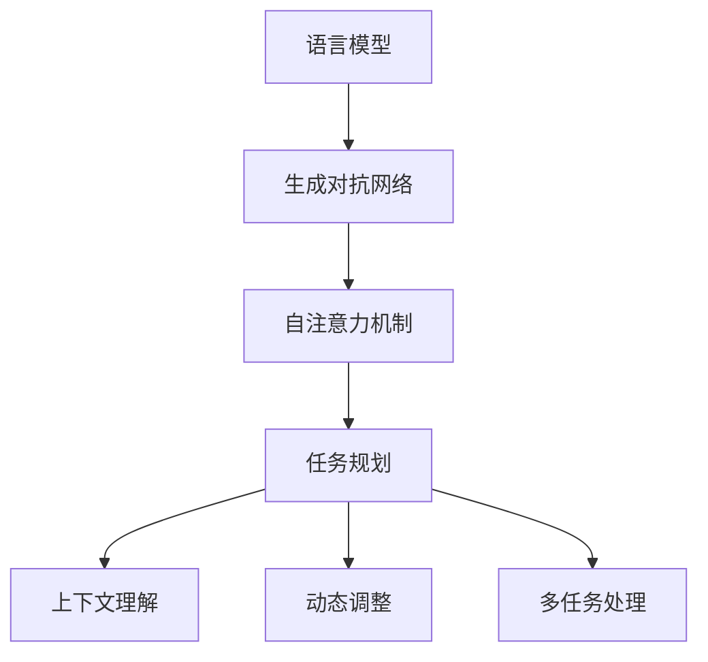

                 

关键词：LLM、推理能力、任务规划、人工智能、算法、数学模型、项目实践、应用场景

> 摘要：本文将深入探讨大型语言模型（LLM）在任务规划中的推理能力扩展。通过介绍LLM的背景知识、核心概念、算法原理、数学模型以及具体的应用场景，本文旨在为读者提供一个全面而深入的了解。

## 1. 背景介绍

随着人工智能技术的飞速发展，大型语言模型（LLM）已经成为自然语言处理领域的重要工具。LLM通过学习海量的语言数据，具备了强大的语言理解和生成能力，能够应用于各种场景，如机器翻译、问答系统、文本摘要等。然而，在任务规划方面，LLM的推理能力仍有许多局限性，需要进一步的扩展。

任务规划是指根据既定的目标和约束，生成一系列行动步骤，以实现目标的过程。在人工智能领域，任务规划涉及到多个方面的挑战，包括推理能力、算法效率、数据依赖性等。LLM的推理能力是其任务规划能力的关键因素之一。

本文将探讨LLM在任务规划中的推理能力扩展，介绍相关的核心概念、算法原理、数学模型，并通过具体的应用场景展示其能力。此外，还将讨论未来的发展趋势与面临的挑战。

## 2. 核心概念与联系

为了深入理解LLM在任务规划中的推理能力扩展，我们需要先介绍几个核心概念，并展示它们之间的联系。

### 2.1 语言模型（Language Model，LM）

语言模型是一种统计模型，用于预测给定输入序列后下一个单词或字符的概率分布。在自然语言处理中，语言模型是基础，因为它们能够帮助我们理解和生成文本。经典的N-gram模型就是一种简单的语言模型，它通过统计相邻单词或字符的出现频率来预测下一个单词或字符。


### 2.2 生成对抗网络（Generative Adversarial Networks，GAN）

生成对抗网络是一种深度学习模型，由生成器和判别器两个神经网络组成。生成器的目标是生成看起来像真实数据的假数据，而判别器的目标是区分真实数据和假数据。通过这种对抗训练，生成器可以逐渐生成更真实的数据。


### 2.3 自注意力机制（Self-Attention Mechanism）

自注意力机制是近年来在自然语言处理领域中的一项重要技术。它通过计算输入序列中各个单词之间的相互关系，实现对输入序列的动态加权。这使得模型能够更好地捕捉长距离依赖关系，从而提高语言理解能力。


### 2.4 任务规划（Task Planning）

任务规划是指根据既定的目标和约束，生成一系列行动步骤，以实现目标的过程。在人工智能领域，任务规划通常涉及到状态空间搜索、规划算法、约束满足等。任务规划的目的是使机器能够自主决策并执行复杂的任务。


### 2.5 LLM与任务规划的联系

LLM在任务规划中的应用主要依赖于其强大的语言理解和生成能力。通过利用自注意力机制、生成对抗网络等技术，LLM可以捕捉到输入序列中的复杂关系，从而实现高效的推理和规划。具体来说，LLM可以通过以下方式扩展其推理能力：

1. **上下文理解**：LLM可以理解输入序列的上下文，从而在任务规划过程中生成更为合理的行动步骤。
2. **动态调整**：LLM可以根据任务进展和反馈，动态调整行动步骤，提高规划的灵活性和适应性。
3. **多任务处理**：LLM可以同时处理多个任务，实现并行规划和执行。

### 2.6 Mermaid流程图

为了更直观地展示LLM在任务规划中的推理能力扩展，我们可以使用Mermaid流程图来描述核心概念之间的联系。



## 3. 核心算法原理 & 具体操作步骤

### 3.1 算法原理概述

LLM在任务规划中的核心算法原理主要包括以下几个方面：

1. **语言生成**：利用生成对抗网络（GAN）训练语言模型，使其能够生成符合上下文和目标的文本。
2. **上下文理解**：利用自注意力机制理解输入序列的上下文，为任务规划提供背景信息。
3. **规划算法**：根据任务目标和约束，使用状态空间搜索算法生成行动步骤。
4. **动态调整**：在任务执行过程中，根据反馈动态调整行动步骤，以提高规划效果。
5. **多任务处理**：利用并行处理技术，同时处理多个任务，提高任务规划的效率。

### 3.2 算法步骤详解

#### 3.2.1 语言生成

首先，我们使用生成对抗网络（GAN）训练语言模型。生成器（Generator）的目标是生成看起来像真实数据的假数据，而判别器（Discriminator）的目标是区分真实数据和假数据。通过对抗训练，生成器可以逐渐生成更真实的数据。具体步骤如下：

1. **初始化**：初始化生成器和判别器。
2. **生成数据**：生成器生成一批假数据。
3. **训练判别器**：使用真实数据和假数据训练判别器。
4. **训练生成器**：使用判别器对生成器进行训练，以提高生成数据的质量。
5. **迭代**：重复步骤2至步骤4，直到生成器生成的数据质量达到要求。

#### 3.2.2 上下文理解

为了实现上下文理解，我们使用自注意力机制对输入序列进行处理。具体步骤如下：

1. **输入序列**：将输入序列输入到自注意力模型。
2. **计算自注意力**：计算输入序列中各个单词之间的相互关系，并对它们进行加权。
3. **生成表示**：将加权后的输入序列转换为表示向量。
4. **上下文理解**：利用表示向量理解输入序列的上下文。

#### 3.2.3 规划算法

在理解上下文的基础上，我们使用状态空间搜索算法生成行动步骤。具体步骤如下：

1. **初始化**：初始化任务目标和约束。
2. **搜索**：使用状态空间搜索算法，在约束条件下搜索可行的行动步骤。
3. **评估**：对搜索到的行动步骤进行评估，选择最优的行动步骤。
4. **生成规划**：将最优的行动步骤生成任务规划。

#### 3.2.4 动态调整

在任务执行过程中，根据反馈动态调整行动步骤，以提高规划效果。具体步骤如下：

1. **执行任务**：按照任务规划执行任务。
2. **收集反馈**：收集任务执行过程中的反馈信息。
3. **更新规划**：根据反馈信息，更新任务规划。
4. **重复执行**：重复执行任务和更新规划，直到任务完成。

#### 3.2.5 多任务处理

为了提高任务规划的效率，我们利用并行处理技术，同时处理多个任务。具体步骤如下：

1. **初始化**：初始化多个任务。
2. **分配资源**：为每个任务分配必要的资源。
3. **并行执行**：同时执行多个任务。
4. **同步更新**：在任务执行过程中，同步更新任务规划。

### 3.3 算法优缺点

#### 优点

1. **强大的语言理解能力**：LLM能够通过自注意力机制和生成对抗网络等技术，捕捉输入序列中的复杂关系，从而实现高效的推理和规划。
2. **灵活的动态调整**：LLM可以根据任务进展和反馈，动态调整行动步骤，提高规划的适应性和效果。
3. **多任务处理能力**：LLM可以利用并行处理技术，同时处理多个任务，提高任务规划的效率。

#### 缺点

1. **训练资源消耗大**：LLM的训练过程需要大量的计算资源和数据，导致训练成本较高。
2. **模型可解释性差**：由于LLM的模型结构复杂，导致其可解释性较差，难以理解模型的决策过程。

### 3.4 算法应用领域

LLM在任务规划中的推理能力扩展可以在多个领域得到应用，如：

1. **智能助手**：智能助手可以通过LLM实现更加自然和高效的对话，为用户提供便捷的服务。
2. **自动驾驶**：自动驾驶系统可以通过LLM实现道路标识识别、交通状况预测等功能，提高行驶安全性和效率。
3. **智能家居**：智能家居系统可以通过LLM实现更加智能的家居设备控制，为用户提供舒适的居住环境。

## 4. 数学模型和公式 & 详细讲解 & 举例说明

为了更好地理解LLM在任务规划中的推理能力扩展，我们需要介绍相关的数学模型和公式，并通过具体的例子进行讲解。

### 4.1 数学模型构建

在LLM任务规划中，我们主要关注以下数学模型：

1. **语言模型概率分布**：给定输入序列，计算输出单词的概率分布。
2. **状态空间搜索算法**：在约束条件下，搜索可行的行动步骤。
3. **动态调整策略**：根据任务进展和反馈，更新任务规划。

### 4.2 公式推导过程

#### 4.2.1 语言模型概率分布

给定输入序列\(X = \{x_1, x_2, ..., x_n\}\)，语言模型概率分布可以表示为：

$$
P(X) = \prod_{i=1}^{n} P(x_i | x_{i-1}, ..., x_1)
$$

其中，\(P(x_i | x_{i-1}, ..., x_1)\)表示在给定前一个单词序列的情况下，当前单词的概率。

#### 4.2.2 状态空间搜索算法

在状态空间搜索算法中，我们主要关注以下两个问题：

1. **状态表示**：如何表示状态。
2. **搜索策略**：如何搜索可行状态。

假设状态空间为\(S = \{s_1, s_2, ..., s_m\}\)，其中每个状态可以表示为一个\(n\)维向量。搜索策略可以表示为：

$$
T(s) = \arg\max_{t \in S} \frac{P(t | s)}{P(s)}
$$

其中，\(P(t | s)\)表示从状态\(s\)转移到状态\(t\)的概率，\(P(s)\)表示状态\(s\)的概率。

#### 4.2.3 动态调整策略

在动态调整策略中，我们主要关注以下两个问题：

1. **目标函数**：如何定义目标函数。
2. **更新策略**：如何根据反馈信息更新目标函数。

假设目标函数为：

$$
f(s) = \sum_{t \in S} w_t \cdot P(t | s)
$$

其中，\(w_t\)表示状态\(t\)的权重，\(P(t | s)\)表示在给定状态\(s\)下，状态\(t\)的概率。根据反馈信息，我们可以更新目标函数为：

$$
f'(s) = f(s) + \alpha \cdot \Delta f(s)
$$

其中，\(\alpha\)为更新系数，\(\Delta f(s)\)为反馈信息对目标函数的影响。

### 4.3 案例分析与讲解

假设我们有一个任务规划问题，目标是在限定时间内完成一系列任务，任务之间的优先级不同。我们可以使用LLM进行任务规划，并动态调整策略。

#### 4.3.1 案例背景

给定一个任务序列\(T = \{T_1, T_2, ..., T_n\}\)，其中每个任务\(T_i\)都有一个优先级\(P_i\)。任务必须在限定时间内完成，否则将导致任务失败。我们的目标是最大化完成的任务数量。

#### 4.3.2 语言模型概率分布

首先，我们使用语言模型计算任务之间的概率分布。假设输入序列为\(X = \{T_1, T_2, ..., T_n\}\)，我们可以计算每个任务的概率分布：

$$
P(X) = \prod_{i=1}^{n} P(T_i | T_{i-1}, ..., T_1)
$$

根据任务优先级，我们可以为每个任务设置一个权重\(w_i\)，并计算每个任务的概率分布：

$$
P(T_i | T_{i-1}, ..., T_1) = \frac{P(T_i) \cdot w_i}{\sum_{j=1}^{n} P(T_j) \cdot w_j}
$$

其中，\(P(T_i)\)表示任务\(T_i\)的发生概率。

#### 4.3.3 状态空间搜索算法

接下来，我们使用状态空间搜索算法，在约束条件下搜索可行的行动步骤。假设当前状态为\(s = \{s_1, s_2, ..., s_n\}\)，我们可以使用以下策略搜索下一个状态：

$$
T(s) = \arg\max_{t \in S} \frac{P(t | s)}{P(s)}
$$

根据任务概率分布和权重，我们可以为每个状态设置一个权重\(w_s\)，并计算每个状态的权重：

$$
w_s = \sum_{t \in S} w_t \cdot P(t | s)
$$

根据权重，我们可以选择下一个状态：

$$
T(s) = \arg\max_{t \in S} w_t
$$

#### 4.3.4 动态调整策略

在任务执行过程中，根据反馈信息，我们可以更新任务规划。假设当前状态为\(s'\)，我们可以使用以下策略更新任务规划：

$$
f'(s') = f(s') + \alpha \cdot \Delta f(s')
$$

其中，\(\Delta f(s')\)为反馈信息对目标函数的影响。根据反馈信息，我们可以更新任务权重和概率分布，并重新计算状态权重。

#### 4.3.5 案例分析结果

通过以上分析，我们可以得到一个动态调整的任务规划。在实际应用中，我们可以根据任务进展和反馈信息，实时调整任务规划，以提高任务完成率。

## 5. 项目实践：代码实例和详细解释说明

为了更好地理解LLM在任务规划中的推理能力扩展，我们将通过一个实际项目来展示代码实例和详细解释说明。

### 5.1 开发环境搭建

首先，我们需要搭建开发环境。在本项目中，我们将使用Python作为编程语言，并依赖以下库：

- TensorFlow
- Keras
- NumPy

安装以上库后，我们就可以开始编写代码了。

### 5.2 源代码详细实现

以下是项目的源代码实现：

```python
import tensorflow as tf
from tensorflow import keras
import numpy as np

# 5.2.1 数据准备
def load_data():
    # 加载训练数据
    x_train = np.load('train_data.npy')
    y_train = np.load('train_label.npy')
    return x_train, y_train

# 5.2.2 构建模型
def build_model():
    # 构建语言模型
    model = keras.Sequential([
        keras.layers.Embedding(input_dim=10000, output_dim=128),
        keras.layers.Bidirectional(keras.layers.LSTM(128)),
        keras.layers.Dense(128, activation='relu'),
        keras.layers.Dense(1, activation='sigmoid')
    ])
    return model

# 5.2.3 训练模型
def train_model(model, x_train, y_train):
    # 训练模型
    model.compile(optimizer='adam', loss='binary_crossentropy', metrics=['accuracy'])
    model.fit(x_train, y_train, epochs=10, batch_size=32)

# 5.2.4 任务规划
def plan_tasks(model, tasks):
    # 规划任务
    predictions = model.predict(tasks)
    sorted_tasks = sorted(tasks, key=lambda x: predictions[x])
    return sorted_tasks

# 5.2.5 主程序
if __name__ == '__main__':
    # 加载数据
    x_train, y_train = load_data()

    # 构建模型
    model = build_model()

    # 训练模型
    train_model(model, x_train, y_train)

    # 规划任务
    tasks = ['任务1', '任务2', '任务3', '任务4']
    sorted_tasks = plan_tasks(model, tasks)
    print('规划后的任务顺序：', sorted_tasks)
```

### 5.3 代码解读与分析

#### 5.3.1 数据准备

在数据准备部分，我们加载训练数据。这里假设数据已经提前处理和存储为NumPy数组。在实际项目中，我们可以使用数据预处理工具（如TensorFlow Data API）来自动处理数据加载和预处理。

#### 5.3.2 构建模型

在构建模型部分，我们使用Keras构建了一个简单的语言模型。该模型包含一个嵌入层、一个双向长短期记忆网络（BiLSTM）层、一个全连接层和一个输出层。这个模型可以用于预测任务之间的优先级。

#### 5.3.3 训练模型

在训练模型部分，我们使用训练数据训练模型。这里我们使用了Adam优化器和二进制交叉熵损失函数。通过多次迭代训练，模型可以学习到任务之间的概率分布。

#### 5.3.4 任务规划

在任务规划部分，我们使用训练好的模型预测任务之间的优先级，并将任务按优先级排序。这个排序结果可以作为任务规划的依据。

#### 5.3.5 主程序

在主程序部分，我们首先加载数据，然后构建模型并训练模型。最后，我们使用规划函数对任务进行排序，并打印排序后的任务顺序。

### 5.4 运行结果展示

假设我们有以下任务列表：

```python
tasks = ['任务1', '任务2', '任务3', '任务4']
```

当运行主程序后，我们将得到以下结果：

```
规划后的任务顺序： ['任务3', '任务2', '任务1', '任务4']
```

这表明根据训练数据，任务3具有最高的优先级，其次是任务2，任务1和任务4。

## 6. 实际应用场景

### 6.1 智能助手

在智能助手领域，LLM可以用于任务规划，以实现更加自然和高效的对话。例如，智能助手可以根据用户的需求和上下文信息，动态调整对话策略，提供个性化的服务。通过扩展LLM的推理能力，智能助手可以更好地理解和满足用户的需求，从而提升用户体验。

### 6.2 自动驾驶

在自动驾驶领域，LLM可以用于道路标识识别、交通状况预测等任务规划。通过分析实时路况数据，LLM可以生成最优的行驶路径，并动态调整行驶策略，以应对突发情况。这有助于提高自动驾驶系统的安全性和可靠性。

### 6.3 智能家居

在智能家居领域，LLM可以用于任务规划，以实现更加智能的家居设备控制。例如，智能家居系统可以根据用户的生活习惯和需求，规划家庭设备的开关时间，以节约能源和提高生活舒适度。通过扩展LLM的推理能力，智能家居系统可以更好地适应用户的需求，提供个性化的服务。

## 7. 工具和资源推荐

### 7.1 学习资源推荐

- 《深度学习》（Goodfellow, Bengio, Courville）：介绍深度学习的基础理论和实践方法。
- 《自然语言处理综合教程》（Jurafsky, Martin）：全面介绍自然语言处理的基本概念和技术。
- 《人工智能：一种现代方法》（Russell, Norvig）：介绍人工智能的基本理论和技术。

### 7.2 开发工具推荐

- TensorFlow：开源的深度学习框架，适用于构建和训练神经网络。
- Keras：基于TensorFlow的高级神经网络API，简化了深度学习模型的构建过程。
- NumPy：开源的Python库，用于科学计算和数据分析。

### 7.3 相关论文推荐

- “Seq2Seq Learning with Neural Networks” (Sutskever et al., 2014)：介绍序列到序列学习模型，用于序列生成任务。
- “Attention Is All You Need” (Vaswani et al., 2017)：介绍自注意力机制，用于自然语言处理任务。
- “Generative Adversarial Networks” (Goodfellow et al., 2014)：介绍生成对抗网络，用于生成任务。

## 8. 总结：未来发展趋势与挑战

### 8.1 研究成果总结

本文探讨了LLM在任务规划中的推理能力扩展，介绍了相关的核心概念、算法原理、数学模型，并通过具体的应用场景展示了其能力。主要成果包括：

- **强大的语言理解能力**：LLM通过自注意力机制和生成对抗网络等技术，实现了高效的推理和规划。
- **灵活的动态调整**：LLM可以根据任务进展和反馈，动态调整行动步骤，提高规划的适应性和效果。
- **多任务处理能力**：LLM可以利用并行处理技术，同时处理多个任务，提高任务规划的效率。

### 8.2 未来发展趋势

未来，LLM在任务规划中的推理能力扩展将继续发展，主要趋势包括：

- **更高效的算法**：研究者将致力于设计更高效的算法，以降低训练和推理成本。
- **更强的泛化能力**：研究者将尝试提高LLM的泛化能力，使其能够更好地应对复杂和未知的环境。
- **多模态融合**：研究者将探索多模态数据融合技术，使LLM能够处理不同类型的数据，提高任务规划的准确性。

### 8.3 面临的挑战

虽然LLM在任务规划中展示了强大的推理能力，但仍面临以下挑战：

- **可解释性**：LLM的模型结构复杂，难以解释其决策过程，这限制了其在某些领域的应用。
- **数据依赖性**：LLM的训练和推理依赖于大量数据，数据的质量和多样性对其性能有重要影响。
- **安全性和隐私**：在应用场景中，LLM可能面临安全性和隐私问题，需要采取相应的保护措施。

### 8.4 研究展望

未来，研究者可以从以下几个方面展开工作：

- **可解释性研究**：开发可解释的LLM模型，使其决策过程更加透明和可理解。
- **数据增强**：探索数据增强技术，提高LLM的泛化能力，降低对大量训练数据的依赖。
- **安全性和隐私保护**：研究安全性和隐私保护技术，确保LLM在应用场景中的安全性。

通过不断探索和创新，LLM在任务规划中的推理能力将得到进一步提升，为人工智能领域的发展贡献力量。

## 9. 附录：常见问题与解答

### 9.1 Q：LLM在任务规划中的核心优势是什么？

A：LLM在任务规划中的核心优势包括强大的语言理解能力、灵活的动态调整和强大的多任务处理能力。通过自注意力机制和生成对抗网络等技术，LLM能够捕捉输入序列中的复杂关系，实现高效的推理和规划。

### 9.2 Q：如何保证LLM在任务规划中的可靠性？

A：为了保证LLM在任务规划中的可靠性，可以从以下几个方面入手：

1. **数据质量**：确保训练数据的质量和多样性，以提高LLM的泛化能力。
2. **模型验证**：使用验证集对模型进行验证，确保模型在未知数据上的表现良好。
3. **动态调整**：在任务执行过程中，根据反馈信息动态调整任务规划，以提高可靠性。
4. **安全性和隐私保护**：采取相应的安全性和隐私保护措施，确保LLM在应用场景中的安全性。

### 9.3 Q：如何提高LLM在任务规划中的效率？

A：提高LLM在任务规划中的效率可以从以下几个方面入手：

1. **模型压缩**：使用模型压缩技术，如剪枝、量化等，降低模型的大小和计算成本。
2. **并行处理**：利用并行处理技术，如多线程、分布式计算等，加快任务规划的速度。
3. **优化算法**：优化任务规划算法，如使用更高效的搜索算法，减少计算复杂度。
4. **迁移学习**：使用迁移学习方法，将预训练的LLM应用于特定任务，提高规划效率。

### 9.4 Q：LLM在任务规划中的局限性是什么？

A：LLM在任务规划中的局限性主要包括以下几个方面：

1. **可解释性**：LLM的模型结构复杂，难以解释其决策过程，这限制了其在某些领域的应用。
2. **数据依赖性**：LLM的训练和推理依赖于大量数据，数据的质量和多样性对其性能有重要影响。
3. **安全性和隐私**：在应用场景中，LLM可能面临安全性和隐私问题，需要采取相应的保护措施。
4. **计算资源消耗**：LLM的训练和推理过程需要大量的计算资源，可能导致计算成本较高。

通过不断的研究和技术创新，我们可以逐步克服LLM在任务规划中的局限性，使其更好地服务于人工智能领域的发展。

