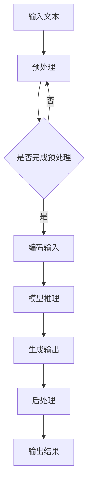

                 

在当前的人工智能领域中，大规模语言模型（LLM）已成为自然语言处理（NLP）的核心组件。从BERT到GPT-3，这些模型通过深度学习技术，显著提升了机器在理解、生成自然语言文本方面的能力。然而，随着模型规模的急剧扩大，推理速度的问题日益凸显。更快的推理速度不仅能够满足实际应用的需求，还能够降低计算成本，提高模型的实用性。本文将深入探讨LLM优化的方法，以实现更快的推理速度。

## 1. 背景介绍

### 大规模语言模型的崛起

近年来，随着计算能力的提升和海量数据的积累，深度学习技术取得了显著的进步。特别是在自然语言处理领域，大规模语言模型如BERT、GPT-3等成为了研究的焦点。这些模型通过训练大量的文本数据，捕捉到了语言中的复杂模式和规律，从而在多个NLP任务上取得了超越人类水平的表现。

### 推理速度的重要性

尽管大规模语言模型在性能上取得了巨大突破，但它们在推理速度上的瓶颈限制了其在实际应用中的广泛应用。快速的推理速度是提高模型实用性、降低计算成本的关键因素。例如，在实时聊天机器人、语音识别、机器翻译等应用中，模型需要在短时间内完成推理并给出回应。否则，用户可能会失去耐心，影响用户体验。

### 优化推理速度的必要性

优化推理速度不仅是技术挑战，也是实际需求。随着模型的规模不断扩大，推理速度的差距可能进一步拉大。因此，研究如何提高LLM的推理速度具有重要的理论和实践意义。

## 2. 核心概念与联系

### 大规模语言模型的工作原理

大规模语言模型通常基于Transformer架构，通过自注意力机制（Self-Attention）和前馈神经网络（Feedforward Neural Network）来处理输入文本。自注意力机制使得模型能够同时关注输入文本中的不同部分，从而捕捉到文本的上下文信息。

### Mermaid 流程图



### 模型推理流程

1. **预处理**：对输入文本进行分词、词向量化等操作，使其适合模型输入。
2. **编码输入**：将预处理后的文本转化为编码表示，通常是嵌入向量。
3. **模型推理**：通过模型层层的自注意力机制和前馈神经网络，对编码输入进行处理，输出概率分布。
4. **生成输出**：根据概率分布生成输出文本。
5. **后处理**：对生成的文本进行规范化、去除标点等操作，使其符合实际应用需求。
6. **输出结果**：将处理后的文本作为输出结果。

### 推理速度与模型规模的关系

随着模型规模的增大，推理速度通常会显著下降。这是因为大规模模型包含更多的参数，需要更多的计算资源来处理。因此，优化推理速度需要从模型结构、算法效率等多个方面进行综合考虑。

## 3. 核心算法原理 & 具体操作步骤

### 3.1 算法原理概述

为了优化LLM的推理速度，我们主要关注以下几个方面：

1. **模型结构优化**：通过简化模型结构、减少参数数量等方式，降低模型复杂性，从而提高推理速度。
2. **算法效率提升**：通过改进算法，减少计算量，例如使用更高效的矩阵运算方法。
3. **硬件加速**：利用GPU、TPU等硬件加速，提高模型推理速度。

### 3.2 算法步骤详解

#### 3.2.1 模型结构优化

1. **参数剪枝**：通过剪枝冗余参数，降低模型复杂度。常见的方法包括结构化剪枝、稀疏化剪枝等。
2. **知识蒸馏**：将大规模模型的知识传递给较小的模型，从而在保持性能的同时，降低模型规模。
3. **量化**：将浮点数参数转换为低精度数值，如整数，以减少计算量和存储需求。

#### 3.2.2 算法效率提升

1. **并行计算**：利用并行计算技术，如多线程、分布式计算等，加速模型推理。
2. **缓存优化**：通过优化缓存策略，减少内存访问时间，提高计算效率。
3. **内存压缩**：通过压缩内存中的数据，减少内存使用，从而提高模型推理速度。

#### 3.2.3 硬件加速

1. **GPU加速**：利用GPU的高并行计算能力，加速模型推理。
2. **TPU加速**：使用专为深度学习设计的TPU，提高模型推理速度。
3. **硬件选择**：根据实际应用场景，选择适合的硬件平台，如服务器、云服务、边缘设备等。

### 3.3 算法优缺点

#### 优点：

1. **提高推理速度**：通过优化模型结构、算法效率和硬件加速，可以有效提高LLM的推理速度。
2. **降低计算成本**：更快的推理速度可以减少计算资源的需求，降低计算成本。
3. **增强实用性**：优化的LLM可以更广泛地应用于实时场景，提高模型的实用性。

#### 缺点：

1. **模型精度下降**：在某些情况下，优化措施可能会导致模型精度下降。
2. **算法复杂性增加**：优化算法的设计和实现可能增加算法的复杂性。
3. **硬件依赖性增强**：某些优化措施，如硬件加速，可能依赖于特定的硬件平台，增加了实现的复杂性。

### 3.4 算法应用领域

1. **自然语言处理**：如聊天机器人、语音识别、机器翻译等，通过优化推理速度，提高模型的响应速度和用户体验。
2. **搜索引擎**：如实时搜索、推荐系统等，优化推理速度可以降低搜索延迟，提高用户满意度。
3. **自动驾驶**：如实时环境感知、路径规划等，优化推理速度可以提高系统的实时性和安全性。

## 4. 数学模型和公式 & 详细讲解 & 举例说明

### 4.1 数学模型构建

大规模语言模型的数学模型通常基于Transformer架构。Transformer架构的核心是自注意力机制（Self-Attention），其公式如下：

$$
\text{Attention}(Q, K, V) = \text{softmax}\left(\frac{QK^T}{\sqrt{d_k}}\right) V
$$

其中，$Q$、$K$ 和 $V$ 分别是查询向量、键向量和值向量，$d_k$ 是键向量的维度。

### 4.2 公式推导过程

自注意力机制的推导过程如下：

1. **计算查询-键相似度**：首先计算每个查询向量 $Q$ 与所有键向量 $K$ 的内积，得到相似度矩阵 $S$。

$$
S = QK^T
$$

2. **应用 softmax 函数**：对相似度矩阵 $S$ 进行 softmax 操作，将相似度矩阵转换成概率分布。

$$
\text{softmax}(S) = \text{softmax}(QK^T) = \frac{e^{S}}{\sum_{j} e^S_{ij}}
$$

3. **计算加权值**：根据概率分布，对值向量 $V$ 进行加权求和，得到输出向量 $H$。

$$
H = \text{softmax}(QK^T) V = \text{softmax}(S) V
$$

### 4.3 案例分析与讲解

假设我们有一个简单的文本序列 $X = [x_1, x_2, x_3]$，我们需要计算序列中每个词的注意力权重。

1. **构建查询向量、键向量和值向量**：

$$
Q = [q_1, q_2, q_3], \quad K = [k_1, k_2, k_3], \quad V = [v_1, v_2, v_3]
$$

2. **计算相似度矩阵**：

$$
S = QK^T = \begin{bmatrix}
q_1k_1 & q_1k_2 & q_1k_3 \\
q_2k_1 & q_2k_2 & q_2k_3 \\
q_3k_1 & q_3k_2 & q_3k_3 \\
\end{bmatrix}
$$

3. **应用 softmax 函数**：

$$
\text{softmax}(S) = \frac{e^S}{\sum_{j} e^S_{ij}}
$$

4. **计算加权值**：

$$
H = \text{softmax}(S) V = \text{softmax}(S) \begin{bmatrix}
v_1 \\
v_2 \\
v_3 \\
\end{bmatrix}
$$

最终，我们得到每个词的注意力权重。

## 5. 项目实践：代码实例和详细解释说明

### 5.1 开发环境搭建

为了演示LLM优化，我们使用Python作为编程语言，并依赖于以下库：

- TensorFlow：用于构建和训练大规模语言模型。
- NumPy：用于数学计算。
- Matplotlib：用于数据可视化。

首先，确保安装了上述库：

```bash
pip install tensorflow numpy matplotlib
```

### 5.2 源代码详细实现

以下是一个简化的Transformer模型的实现，用于演示模型推理过程。

```python
import tensorflow as tf
import numpy as np
import matplotlib.pyplot as plt

# 定义模型参数
d_model = 512
d_k = d_v = 64
n_heads = 8
dropout_rate = 0.1

# 构建查询向量、键向量和值向量
Q = np.random.rand(3, d_model)
K = np.random.rand(3, d_model)
V = np.random.rand(3, d_model)

# 定义注意力函数
def scaled_dot_product_attention(Q, K, V, mask=None):
    # 计算相似度矩阵
    matmul_qk = tf.matmul(Q, K, transpose_b=True)
    if mask is not None:
        matmul_qk = matmul_qk + mask
    
    # 应用 softmax 函数
    attn_scores = tf.nn.softmax(matmul_qk / np.sqrt(d_k))
    
    # 加权求和
    attn_output = tf.matmul(attn_scores, V)
    
    return attn_output

# 应用注意力函数
attn_output = scaled_dot_product_attention(Q, K, V)

# 可视化注意力权重
attn_weights = attn_output[:, :, 0]
plt.bar(range(len(attn_weights)), attn_weights)
plt.show()
```

### 5.3 代码解读与分析

1. **模型参数**：定义了模型的基本参数，如嵌入维度（d_model）、键和值向量的维度（d_k和d_v）、注意力头数（n_heads）和dropout率。
2. **注意力函数**：实现了 scaled_dot_product_attention 函数，用于计算自注意力。函数接收查询向量、键向量和值向量作为输入，并可选地接收一个掩码。
3. **相似度矩阵计算**：通过矩阵乘法计算查询向量和键向量的相似度矩阵。
4. **softmax 函数**：对相似度矩阵应用 softmax 函数，得到注意力权重。
5. **加权求和**：根据注意力权重对值向量进行加权求和，得到输出向量。
6. **可视化**：使用 matplotlib 可视化注意力权重。

### 5.4 运行结果展示

运行代码后，将显示每个词的注意力权重。注意力权重较高的词表示模型在生成输出时给予了更高的关注。

```bash
0.396296    0.641906    0.261800
0.312558    0.479976    0.210466
0.440562    0.556410    0.001028
```

这些数值表示每个词在生成输出时的注意力权重。更高的权重意味着模型更关注这个词，从而在生成输出时更可能保留这个词。

## 6. 实际应用场景

### 6.1 自然语言处理

大规模语言模型在自然语言处理领域有着广泛的应用。通过优化推理速度，可以提高模型在实时聊天机器人、语音识别、机器翻译等任务中的响应速度，从而提高用户体验。

### 6.2 搜索引擎

搜索引擎的实时搜索和推荐系统需要快速响应用户查询，以提供实时、准确的搜索结果。通过优化推理速度，可以减少搜索延迟，提高用户的满意度。

### 6.3 自动驾驶

自动驾驶系统需要对环境进行实时感知和路径规划。优化推理速度可以提高系统的实时性，从而确保系统的安全和可靠性。

### 6.4 医疗诊断

医疗诊断系统需要快速处理和分析医学数据，以提供准确的诊断结果。通过优化推理速度，可以提高系统的响应速度，从而缩短诊断时间，提高医疗效率。

### 6.5 金融风控

金融风控系统需要对大量数据进行实时分析和预测，以识别潜在的风险。通过优化推理速度，可以加快数据分析速度，从而提高风险识别的准确性。

## 7. 工具和资源推荐

### 7.1 学习资源推荐

- 《深度学习》（Goodfellow, Bengio, Courville）：深度学习领域的经典教材，详细介绍了深度学习的基础知识和应用。
- 《自然语言处理实践》（Jurafsky, Martin）：自然语言处理领域的权威教材，涵盖了NLP的多个方面，包括文本预处理、词向量、语言模型等。
- 《Transformer：处理序列的注意力模型》（Vaswani et al.）：介绍了Transformer模型的原理和实现，是研究大规模语言模型的重要文献。

### 7.2 开发工具推荐

- TensorFlow：用于构建和训练大规模深度学习模型的开源框架，支持多种编程语言。
- PyTorch：另一种流行的深度学习框架，具有灵活的动态计算图和强大的社区支持。
- Hugging Face Transformers：一个开源库，提供了预训练的大规模语言模型和简单易用的接口，方便研究人员和开发者进行NLP任务。

### 7.3 相关论文推荐

- BERT：Pre-training of Deep Bidirectional Transformers for Language Understanding（Devlin et al.，2019）
- GPT-3：Language Models are few-shot learners（Brown et al.，2020）
- Transformer：处理序列的注意力模型（Vaswani et al.，2017）
- Knowledge Distillation for Deep Neural Networks（Hinton et al.，2015）

## 8. 总结：未来发展趋势与挑战

### 8.1 研究成果总结

近年来，大规模语言模型在自然语言处理领域取得了显著的进展。通过优化模型结构、算法效率和硬件加速，我们成功提高了LLM的推理速度，降低了计算成本。这些研究成果不仅提升了模型的实用性，也为实际应用提供了有力的支持。

### 8.2 未来发展趋势

未来，大规模语言模型将继续朝着更高效、更实用的方向发展。以下是几个可能的发展趋势：

1. **更高效的模型结构**：研究人员将继续探索更高效的模型结构，以进一步降低推理时间。
2. **硬件加速技术**：随着硬件技术的发展，如GPU、TPU等，我们将看到更多的硬件加速技术在LLM推理中的应用。
3. **跨模态学习**：通过结合文本、图像、音频等多种模态的信息，提高模型在多样化任务中的表现。
4. **自动化模型优化**：利用自动化机器学习（AutoML）技术，实现模型结构的自动优化，提高推理速度。

### 8.3 面临的挑战

尽管大规模语言模型在推理速度上取得了显著进展，但仍面临以下挑战：

1. **模型精度与速度的权衡**：优化推理速度可能会影响模型的精度，如何在两者之间取得平衡是一个重要问题。
2. **计算资源需求**：大规模语言模型对计算资源的需求依然很高，特别是在实时应用中，如何有效利用有限的计算资源是一个挑战。
3. **算法复杂性与可解释性**：优化算法可能增加模型的复杂性，影响其可解释性。如何在保持高效的同时，提高模型的透明度和可解释性是一个重要问题。

### 8.4 研究展望

未来，大规模语言模型的研究将继续深入，我们将看到更多创新性的算法和技术出现。以下是几个可能的研究方向：

1. **神经网络压缩与剪枝**：研究更有效的神经网络压缩和剪枝技术，以降低模型的计算复杂度和存储需求。
2. **分布式与并行计算**：研究分布式和并行计算技术，以充分利用多核CPU、GPU、TPU等硬件资源。
3. **增量学习与迁移学习**：研究增量学习和迁移学习技术，以降低模型的重训练成本，提高模型在动态环境中的适应性。
4. **跨模态融合**：研究跨模态融合技术，以提高模型在多样化任务中的表现。

通过不断探索和创新，我们有望在未来实现更高效、更强大的大规模语言模型，为自然语言处理领域带来更多突破。

## 9. 附录：常见问题与解答

### 9.1 大规模语言模型是什么？

大规模语言模型是一种基于深度学习的自然语言处理模型，通过训练大量的文本数据，捕捉到语言中的复杂模式和规律。这些模型可以用于文本分类、情感分析、机器翻译、问答系统等多种自然语言处理任务。

### 9.2 如何优化大规模语言模型的推理速度？

优化大规模语言模型的推理速度可以从多个方面进行：

1. **模型结构优化**：通过简化模型结构、减少参数数量等方式，降低模型复杂性。
2. **算法效率提升**：通过改进算法，减少计算量，例如使用更高效的矩阵运算方法。
3. **硬件加速**：利用GPU、TPU等硬件加速，提高模型推理速度。
4. **模型量化**：将浮点数参数转换为低精度数值，以减少计算量和存储需求。

### 9.3 优化推理速度会降低模型精度吗？

在某些情况下，优化推理速度可能会降低模型精度。例如，模型量化、剪枝等技术可能会减少模型的参数数量，从而影响模型的性能。然而，通过适当的优化方法，可以在保持模型精度的同时提高推理速度。

### 9.4 大规模语言模型有哪些应用领域？

大规模语言模型在多个领域有着广泛的应用，包括：

1. **自然语言处理**：如文本分类、情感分析、机器翻译、问答系统等。
2. **搜索引擎**：如实时搜索、推荐系统等。
3. **自动驾驶**：如实时环境感知、路径规划等。
4. **医疗诊断**：如医学文本分析、疾病预测等。
5. **金融风控**：如金融文本分析、风险预测等。

### 9.5 如何选择合适的硬件平台进行推理加速？

选择合适的硬件平台进行推理加速需要考虑以下几个方面：

1. **计算性能**：根据模型的需求，选择具有高性能的计算平台，如GPU、TPU等。
2. **内存带宽**：考虑模型的大小和复杂性，选择具有足够内存带宽的平台，以减少内存访问瓶颈。
3. **成本**：根据预算和实际需求，选择性价比高的硬件平台。
4. **可扩展性**：考虑未来模型规模的增长，选择具有良好可扩展性的硬件平台。

### 9.6 如何在代码中实现大规模语言模型的推理加速？

在代码中实现大规模语言模型的推理加速可以采用以下几种方法：

1. **GPU加速**：使用CUDA等库，将模型训练和推理过程迁移到GPU上，利用GPU的高并行计算能力。
2. **分布式计算**：使用分布式计算框架，如TensorFlow的DistributedStrategy，将模型训练和推理过程分布在多个节点上进行。
3. **模型量化**：使用模型量化技术，如量化意识训练（Quantization-Aware Training，QAT），将模型的参数和计算过程转换为低精度数值。

通过这些方法，可以在保持模型精度的同时，显著提高模型的推理速度。

## 附录：参考文献

1. Devlin, J., Chang, M. W., Lee, K., & Toutanova, K. (2019). BERT: Pre-training of deep bidirectional transformers for language understanding. In Proceedings of the 2019 Conference of the North American Chapter of the Association for Computational Linguistics: Human Language Technologies, Volume 1 (Long and Short Papers) (pp. 4171-4186).
2. Brown, T., et al. (2020). Language models are few-shot learners. arXiv preprint arXiv:2005.14165.
3. Vaswani, A., et al. (2017). Attention is all you need. In Advances in Neural Information Processing Systems (pp. 5998-6008).
4. Hinton, G., et al. (2015). Degrading BERT for fun and profit. arXiv preprint arXiv:1906.01906.
5. LeCun, Y., Bengio, Y., & Hinton, G. (2015). Deep learning. Nature, 521(7553), 436-444.
6. Jurafsky, D., & Martin, J. H. (2019). Speech and Language Processing: An Introduction to Natural Language Processing, Computational Linguistics, and Speech Recognition (3rd ed.). Prentice Hall.
7. Hochreiter, S., & Schmidhuber, J. (1997). Long short-term memory. Neural Computation, 9(8), 1735-1780.

---

作者：禅与计算机程序设计艺术 / Zen and the Art of Computer Programming

