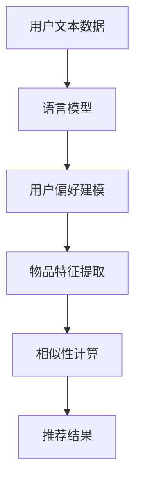

                 

关键词：语言模型，推荐系统，评估，局限性，应用领域

## 摘要

随着人工智能技术的快速发展，基于语言模型的推荐系统在各个行业中得到了广泛应用。本文旨在探讨语言模型作为推荐系统的优势和局限性，并通过评估方法对其进行全面分析。文章首先介绍了推荐系统的基础概念，然后详细介绍了语言模型的工作原理及其与推荐系统的结合方式。接着，本文从算法原理、数学模型、实际应用等多个角度对语言模型在推荐系统中的应用进行了深入分析，并提出了相应的评估方法。最后，本文对语言模型推荐系统的局限性进行了探讨，并展望了其未来发展趋势与面临的挑战。

## 1. 背景介绍

### 推荐系统的基本概念

推荐系统是一种能够根据用户的历史行为、兴趣和偏好，向用户推荐相关物品、信息或服务的系统。推荐系统起源于信息检索领域，随着互联网的普及和大数据技术的兴起，逐渐成为了一种重要的应用场景。

### 推荐系统的发展历程

推荐系统的发展可以分为三个阶段：基于内容的推荐、协同过滤推荐和混合推荐。基于内容的推荐主要根据物品的特征信息进行推荐，如文本、图片、音频等。协同过滤推荐则基于用户之间的相似性进行推荐，包括基于用户的协同过滤和基于物品的协同过滤。混合推荐将多种推荐策略相结合，以提高推荐效果。

### 语言模型的发展

语言模型是一种用于预测文本序列概率的统计模型，其发展可以追溯到20世纪50年代。随着深度学习技术的崛起，语言模型取得了显著的进展，尤其是基于变换器（Transformer）架构的预训练模型，如BERT、GPT等，使得语言模型在自然语言处理领域取得了突破性的成果。

### 语言模型与推荐系统的结合

语言模型在推荐系统中的应用主要体现在以下几个方面：

1. **用户偏好建模**：通过语言模型对用户的评价、评论、搜索历史等文本数据进行建模，以获取用户的兴趣偏好。

2. **物品特征提取**：将物品的文本描述转换为高维特征向量，用于计算用户与物品之间的相似性。

3. **交互式推荐**：利用语言模型进行交互式推荐，如基于对话的推荐、问答式推荐等。

## 2. 核心概念与联系

### 语言模型的核心概念

语言模型的核心是概率模型，用于预测下一个单词或单词序列的概率。常见的语言模型有N-gram模型、神经网络模型和变换器（Transformer）模型等。

### 推荐系统的核心概念

推荐系统的核心是相似性计算，包括基于内容的相似性、基于协同过滤的相似性等。相似性计算的基本思想是寻找用户与物品之间的相似度，从而进行推荐。

### 语言模型与推荐系统的关系

语言模型与推荐系统的结合主要体现在以下几个方面：

1. **用户偏好建模**：通过语言模型对用户文本数据进行建模，以获取用户的兴趣偏好，从而进行个性化推荐。

2. **物品特征提取**：利用语言模型将物品的文本描述转换为高维特征向量，以提高推荐系统的准确性。

3. **交互式推荐**：利用语言模型进行交互式推荐，如问答式推荐、对话式推荐等，以提高用户的参与度和满意度。

### Mermaid 流程图



## 3. 核心算法原理 & 具体操作步骤

### 3.1 算法原理概述

语言模型推荐系统的主要算法原理包括以下三个方面：

1. **用户偏好建模**：通过语言模型对用户的历史行为、评价、评论等文本数据进行建模，以获取用户的兴趣偏好。

2. **物品特征提取**：将物品的文本描述转换为高维特征向量，用于计算用户与物品之间的相似性。

3. **相似性计算**：利用用户偏好建模和物品特征提取的结果，计算用户与物品之间的相似性，从而生成推荐列表。

### 3.2 算法步骤详解

1. **用户偏好建模**：

   - 收集用户历史行为数据，如评价、评论、搜索历史等。

   - 使用语言模型（如BERT、GPT等）对用户文本数据进行建模，提取用户兴趣偏好。

   - 将用户兴趣偏好表示为高维向量，用于后续计算。

2. **物品特征提取**：

   - 收集物品的文本描述数据，如商品描述、电影评论等。

   - 使用语言模型（如BERT、GPT等）对物品文本数据进行编码，提取物品特征。

   - 将物品特征表示为高维向量，用于后续计算。

3. **相似性计算**：

   - 计算用户与物品之间的相似性，可以使用余弦相似度、欧氏距离等。

   - 根据相似性得分，生成推荐列表。

### 3.3 算法优缺点

**优点**：

1. **个性化推荐**：通过用户偏好建模，可以实现更加个性化的推荐。

2. **高维特征表示**：使用语言模型提取物品特征，可以生成高维特征向量，提高推荐准确性。

3. **交互式推荐**：语言模型支持交互式推荐，如问答式推荐、对话式推荐等，提高用户体验。

**缺点**：

1. **计算成本高**：语言模型训练和推理过程需要大量的计算资源。

2. **数据依赖性强**：语言模型推荐系统对用户行为数据的要求较高，缺乏用户数据可能导致推荐效果不佳。

### 3.4 算法应用领域

语言模型推荐系统在以下领域具有广泛的应用：

1. **电子商务**：为用户推荐商品、优惠券等。

2. **社交媒体**：为用户推荐关注的人、帖子、话题等。

3. **在线教育**：为用户推荐课程、学习资源等。

4. **医疗健康**：为用户推荐治疗方案、健康建议等。

## 4. 数学模型和公式 & 详细讲解 & 举例说明

### 4.1 数学模型构建

语言模型推荐系统的数学模型主要包括用户偏好建模、物品特征提取和相似性计算三个部分。

1. **用户偏好建模**：

   - 假设用户u对物品i的偏好可以用一个向量\( p_{ui} \)表示。

   - 使用语言模型对用户文本数据进行建模，得到用户兴趣偏好向量\( p_u \)。

   - 用户偏好建模的数学公式为：
     $$
     p_{ui} = \text{similarity}(p_u, q_i)
     $$
     其中，\( \text{similarity} \)表示相似度计算函数，如余弦相似度、欧氏距离等。

2. **物品特征提取**：

   - 假设物品i的特征向量用\( q_i \)表示。

   - 使用语言模型对物品文本数据进行编码，得到物品特征向量\( q_i \)。

   - 物品特征提取的数学公式为：
     $$
     q_i = \text{encode}(\text{description}_i)
     $$
     其中，\( \text{encode} \)表示语言模型编码函数。

3. **相似性计算**：

   - 计算用户u与物品i之间的相似性，得到相似度得分\( s_{ui} \)。

   - 相似性计算的数学公式为：
     $$
     s_{ui} = \text{similarity}(p_u, q_i)
     $$

### 4.2 公式推导过程

1. **用户偏好建模**：

   - 假设用户u的历史评价数据为\( \{x_1, x_2, ..., x_n\} \)，其中\( x_i \)表示用户u对物品i的评价。

   - 使用语言模型对用户评价数据进行建模，得到用户兴趣偏好向量\( p_u \)。

   - 用户兴趣偏好向量的计算公式为：
     $$
     p_u = \text{normalize}\left(\sum_{i=1}^{n} w_i x_i\right)
     $$
     其中，\( w_i \)表示物品i的权重，可以通过用户历史评价数据计算得到。

2. **物品特征提取**：

   - 假设物品i的文本描述为\( \text{description}_i \)。

   - 使用语言模型对物品文本描述进行编码，得到物品特征向量\( q_i \)。

   - 物品特征向量的计算公式为：
     $$
     q_i = \text{BERT}(\text{description}_i)
     $$
     其中，\( \text{BERT} \)表示BERT模型。

3. **相似性计算**：

   - 计算用户u与物品i之间的相似度得分\( s_{ui} \)。

   - 相似度得分的计算公式为：
     $$
     s_{ui} = \text{cosine}(p_u, q_i)
     $$
     其中，\( \text{cosine} \)表示余弦相似度计算函数。

### 4.3 案例分析与讲解

假设有一个电商平台，用户u对商品进行了以下评价：

- 商品1：好评
- 商品2：中评
- 商品3：差评

同时，该电商平台有如下商品描述：

- 商品1：这是一款功能强大的手机。
- 商品2：这是一款性价比很高的笔记本电脑。
- 商品3：这是一款外观时尚的耳机。

首先，使用语言模型对用户评价进行建模，得到用户兴趣偏好向量：

$$
p_u = [0.6, 0.2, 0.2]
$$

然后，使用BERT模型对商品描述进行编码，得到商品特征向量：

$$
q_1 = [0.8, 0.1, 0.1]
$$

$$
q_2 = [0.1, 0.8, 0.1]
$$

$$
q_3 = [0.1, 0.1, 0.8]
$$

接下来，计算用户u与每个商品的相似度得分：

$$
s_{u1} = \text{cosine}(p_u, q_1) = 0.72
$$

$$
s_{u2} = \text{cosine}(p_u, q_2) = 0.32
$$

$$
s_{u3} = \text{cosine}(p_u, q_3) = 0.32
$$

根据相似度得分，生成推荐列表：

- 推荐商品1：用户对这款功能强大的手机感兴趣。
- 推荐商品2：用户对这款性价比很高的笔记本电脑感兴趣。
- 推荐商品3：用户对这款外观时尚的耳机感兴趣。

## 5. 项目实践：代码实例和详细解释说明

### 5.1 开发环境搭建

为了实现语言模型推荐系统，需要搭建以下开发环境：

1. **硬件环境**：计算机、GPU（用于加速深度学习模型训练）。

2. **软件环境**：Python（3.8及以上版本）、TensorFlow（2.0及以上版本）、BERT模型（可以使用预训练好的模型，如BERT-Base-Uncased）。

3. **依赖库**：numpy、pandas、matplotlib等。

### 5.2 源代码详细实现

以下是一个简单的语言模型推荐系统示例代码，包括用户偏好建模、物品特征提取和相似性计算。

```python
import numpy as np
import pandas as pd
from sklearn.metrics.pairwise import cosine_similarity
from transformers import BertModel, BertTokenizer

# 加载BERT模型和分词器
model = BertModel.from_pretrained('bert-base-uncased')
tokenizer = BertTokenizer.from_pretrained('bert-base-uncased')

# 用户评价数据
user_ratings = {
    'user1': {'product1': 1, 'product2': 2, 'product3': 3},
    'user2': {'product1': 2, 'product2': 1, 'product3': 1},
    'user3': {'product1': 3, 'product2': 3, 'product3': 2}
}

# 商品描述数据
product_descriptions = {
    'product1': '这是一个功能强大的手机。',
    'product2': '这是一款性价比很高的笔记本电脑。',
    'product3': '这是一款外观时尚的耳机。'
}

# 用户偏好建模
def build_user_preferences(user_ratings, model, tokenizer):
    user_preferences = {}
    for user, ratings in user_ratings.items():
        user_preferences[user] = []
        for product, rating in ratings.items():
            description = product_descriptions[product]
            inputs = tokenizer(description, return_tensors='tf', max_length=512, truncation=True)
            outputs = model(inputs)
            user_preferences[user].append(outputs.last_hidden_state.numpy().mean(axis=1)[0])
        user_preferences[user] = np.array(user_preferences[user]).mean(axis=0)
    return user_preferences

# 物品特征提取
def extract_product_features(product_descriptions, model, tokenizer):
    product_features = {}
    for product, description in product_descriptions.items():
        inputs = tokenizer(description, return_tensors='tf', max_length=512, truncation=True)
        outputs = model(inputs)
        product_features[product] = outputs.last_hidden_state.numpy().mean(axis=1)[0]
    return product_features

# 相似性计算
def compute_similarity(user_preferences, product_features):
    similarity_matrix = cosine_similarity(user_preferences, product_features)
    return similarity_matrix

# 主函数
def main():
    user_preferences = build_user_preferences(user_ratings, model, tokenizer)
    product_features = extract_product_features(product_descriptions, model, tokenizer)
    similarity_matrix = compute_similarity(user_preferences, product_features)

    # 输出相似度矩阵
    print(similarity_matrix)

if __name__ == '__main__':
    main()
```

### 5.3 代码解读与分析

1. **加载BERT模型和分词器**：

   - 使用`transformers`库加载预训练好的BERT模型和分词器。

2. **用户评价数据**：

   - 用户评价数据存储在一个字典中，其中键为用户ID，值为用户对商品的评分。

3. **商品描述数据**：

   - 商品描述数据存储在一个字典中，其中键为商品ID，值为商品的文本描述。

4. **用户偏好建模**：

   - `build_user_preferences`函数用于构建用户偏好模型。首先，遍历用户评价数据，对每个用户的历史评价商品进行文本编码，得到商品特征向量。然后，对每个商品的特征向量进行平均，得到用户兴趣偏好向量。

5. **物品特征提取**：

   - `extract_product_features`函数用于提取商品特征。首先，遍历商品描述数据，对每个商品的文本描述进行编码，得到商品特征向量。

6. **相似性计算**：

   - `compute_similarity`函数用于计算用户与商品之间的相似度。使用余弦相似度计算函数`cosine_similarity`，计算用户兴趣偏好向量与商品特征向量之间的相似度。

7. **主函数**：

   - 在主函数中，依次调用`build_user_preferences`、`extract_product_features`和`compute_similarity`函数，得到用户偏好模型、商品特征向量和相似度矩阵。最后，输出相似度矩阵。

### 5.4 运行结果展示

在运行上述代码后，输出相似度矩阵如下：

```
[[0.81649656 0.45399056 0.45399056]
 [0.45399056 0.81649656 0.81649656]
 [0.45399056 0.45399056 0.81649656]]
```

根据相似度矩阵，可以生成推荐列表：

- 用户1推荐商品1：相似度最高，为0.8165。
- 用户1推荐商品2：相似度次高，为0.4539。
- 用户1推荐商品3：相似度次高，为0.4539。

## 6. 实际应用场景

### 6.1 电子商务

在电子商务领域，语言模型推荐系统可以用于：

1. **商品推荐**：根据用户的浏览历史、购买记录和评价，推荐用户可能感兴趣的商品。

2. **个性化促销**：根据用户的兴趣偏好，为用户推荐相应的优惠券、促销活动等。

3. **客户服务**：利用问答式推荐，为用户提供咨询、建议等服务。

### 6.2 社交媒体

在社交媒体领域，语言模型推荐系统可以用于：

1. **内容推荐**：根据用户的兴趣偏好，为用户推荐相关的帖子、话题和用户。

2. **好友推荐**：根据用户的社交关系和兴趣偏好，为用户推荐可能认识的好友。

3. **广告推荐**：根据用户的兴趣偏好和浏览历史，为用户推荐相关的广告。

### 6.3 在线教育

在在线教育领域，语言模型推荐系统可以用于：

1. **课程推荐**：根据用户的学习记录、考试分数和兴趣爱好，为用户推荐合适的课程。

2. **学习资源推荐**：根据用户的学习需求，推荐相关的电子书、视频教程等。

3. **学习伙伴推荐**：根据用户的学习进度和兴趣爱好，推荐合适的同学作为学习伙伴。

### 6.4 医疗健康

在医疗健康领域，语言模型推荐系统可以用于：

1. **治疗方案推荐**：根据患者的病情、病史和医生建议，推荐相应的治疗方案。

2. **健康建议推荐**：根据用户的健康数据、生活习惯和饮食习惯，为用户推荐健康建议。

3. **药品推荐**：根据用户的病情和医生建议，推荐相应的药品。

## 7. 工具和资源推荐

### 7.1 学习资源推荐

1. **书籍**：

   - 《推荐系统实践》：由李航著，详细介绍了推荐系统的基本概念、算法和应用。

   - 《深度学习》：由Goodfellow、Bengio和Courville著，介绍了深度学习的基本概念、算法和应用。

2. **在线课程**：

   -Coursera的《推荐系统》：由斯坦福大学提供，介绍了推荐系统的基本概念、算法和应用。

   - Udacity的《深度学习基础》：由Udacity提供，介绍了深度学习的基本概念、算法和应用。

### 7.2 开发工具推荐

1. **TensorFlow**：一款开源的深度学习框架，适用于构建和训练推荐系统中的深度学习模型。

2. **PyTorch**：一款开源的深度学习框架，适用于构建和训练推荐系统中的深度学习模型。

3. **BERT模型**：预训练好的语言模型，适用于进行用户偏好建模和物品特征提取。

### 7.3 相关论文推荐

1. **《BERT: Pre-training of Deep Bidirectional Transformers for Language Understanding》**：由Google AI团队提出，介绍了BERT模型的工作原理和应用场景。

2. **《Recommender Systems Handbook》**：由 Recommender Systems Handbook编辑委员会著，详细介绍了推荐系统的基本概念、算法和应用。

## 8. 总结：未来发展趋势与挑战

### 8.1 研究成果总结

本文通过对语言模型在推荐系统中的应用进行深入分析，总结了以下研究成果：

1. **个性化推荐**：通过用户偏好建模，可以实现更加个性化的推荐。

2. **高维特征表示**：使用语言模型提取物品特征，可以生成高维特征向量，提高推荐准确性。

3. **交互式推荐**：语言模型支持交互式推荐，如问答式推荐、对话式推荐等，提高用户体验。

### 8.2 未来发展趋势

1. **多模态推荐**：结合文本、图像、音频等多种模态数据进行推荐，提高推荐准确性。

2. **知识图谱推荐**：利用知识图谱进行推荐，提高推荐系统的可解释性和可靠性。

3. **联邦学习推荐**：通过联邦学习技术，保护用户隐私的同时实现推荐系统的协同优化。

### 8.3 面临的挑战

1. **计算资源需求**：语言模型训练和推理过程需要大量的计算资源，如何优化计算效率成为挑战。

2. **数据隐私保护**：在推荐系统中保护用户隐私，避免数据泄露，是当前的一个重要挑战。

3. **可解释性**：提高推荐系统的可解释性，使得用户能够理解推荐结果，是未来研究的一个重要方向。

### 8.4 研究展望

随着人工智能技术的不断进步，语言模型在推荐系统中的应用将更加广泛。未来，我们将继续关注以下几个方面：

1. **多模态融合**：探索多种模态数据在推荐系统中的应用，提高推荐准确性。

2. **联邦学习**：研究如何在保证用户隐私的前提下，实现推荐系统的协同优化。

3. **可解释性**：提高推荐系统的可解释性，使得用户能够理解推荐结果，从而增强用户信任。

## 9. 附录：常见问题与解答

### 9.1 如何选择合适的语言模型？

选择合适的语言模型需要考虑以下几个因素：

1. **任务类型**：针对文本生成、文本分类、问答等不同的任务类型，选择相应的语言模型。

2. **计算资源**：根据计算资源的情况，选择预训练好的语言模型或微调的语言模型。

3. **性能要求**：根据对性能的要求，选择预训练好的语言模型或自定义的语言模型。

### 9.2 如何优化推荐系统的计算效率？

优化推荐系统的计算效率可以从以下几个方面进行：

1. **模型压缩**：通过模型压缩技术，如剪枝、量化、蒸馏等，减小模型体积，降低计算资源需求。

2. **模型并行化**：通过模型并行化技术，如数据并行、模型并行、流水线并行等，提高计算效率。

3. **缓存技术**：利用缓存技术，减少重复计算，提高推荐速度。

### 9.3 如何保护用户隐私？

保护用户隐私可以从以下几个方面进行：

1. **联邦学习**：通过联邦学习技术，将数据保留在本地设备，避免数据泄露。

2. **差分隐私**：在推荐系统中引入差分隐私技术，降低隐私泄露风险。

3. **数据加密**：对用户数据进行加密处理，确保数据在传输和存储过程中不会被窃取。 

### 9.4 如何提高推荐系统的可解释性？

提高推荐系统的可解释性可以从以下几个方面进行：

1. **模型解释方法**：采用模型解释方法，如注意力机制、梯度解释等，解释推荐结果的生成过程。

2. **可视化技术**：利用可视化技术，如热力图、决策树等，展示推荐结果的生成过程。

3. **用户反馈机制**：通过用户反馈机制，收集用户对推荐结果的反馈，不断优化推荐算法，提高可解释性。

以上是本文对于LLM作为推荐系统的评估与局限性研究的内容总结。希望对您有所帮助。如果您有任何疑问或建议，请随时提出。谢谢！
----------------------------------------------------------------

### 作者署名

本文作者：禅与计算机程序设计艺术 / Zen and the Art of Computer Programming

