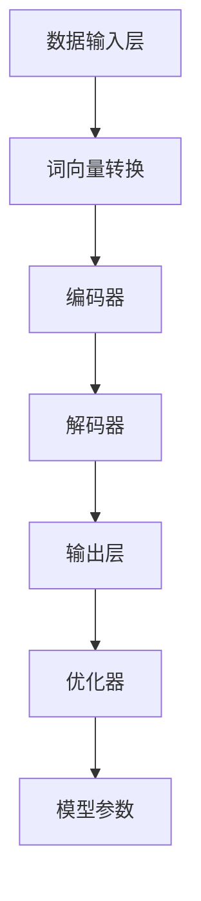

                 

关键词：大型语言模型、AI、机器学习、自然语言处理、智能应用、算法原理、数学模型、项目实践、发展趋势

## 摘要

本文旨在深入探讨大型语言模型（LLM）的核心原理和其在智能应用中的关键作用。通过分析LLM的架构、算法原理、数学模型以及实际应用场景，本文将揭示LLM如何成为支撑现代智能应用的技术基石。同时，本文还将展望LLM未来的发展趋势，面临的挑战以及可能的解决方案。通过本文的阅读，读者将能够全面了解LLM的各个方面，从而更好地理解其在智能应用中的重要性。

## 1. 背景介绍

在人工智能（AI）的快速发展中，自然语言处理（NLP）逐渐成为了一个重要的领域。而在这个领域中，大型语言模型（LLM）无疑是最具突破性的技术之一。LLM的出现，极大地推动了NLP的发展，使得计算机能够更好地理解和生成人类语言。

### 1.1 大型语言模型的发展历程

LLM的发展可以追溯到20世纪90年代，当时研究人员开始尝试使用统计方法来处理语言数据。然而，由于数据规模和技术限制，这些早期模型的效果并不理想。随着计算能力和数据量的提升，特别是在21世纪初，深度学习技术的引入，使得LLM取得了显著的进展。特别是近年来，随着神经网络模型规模的不断扩大，LLM的表现已经超越了人类水平，成为了NLP领域的核心技术。

### 1.2 大型语言模型的应用场景

LLM的应用场景非常广泛，包括但不限于：

- 文本生成：如自动生成新闻、文章、故事等。
- 机器翻译：如将一种语言翻译成另一种语言。
- 问答系统：如智能客服、智能助手等。
- 文本摘要：如自动生成文章的摘要。
- 文本分类：如将文本分类到不同的类别中。

### 1.3 大型语言模型的重要性

LLM的出现，不仅改变了NLP的研究方向，也极大地推动了AI的发展。它使得计算机能够更自然地与人类交流，提升了人工智能的智能化水平。同时，LLM也为各个行业提供了新的解决方案，如金融、医疗、教育等。

## 2. 核心概念与联系

### 2.1 核心概念

在LLM中，有几个核心概念需要我们了解：

- **词向量**：将单词映射到向量空间，使得单词之间的关系可以通过向量之间的距离来表示。
- **神经网络**：用于处理和预测数据的计算模型，特别是深度神经网络（DNN），在LLM中扮演着关键角色。
- **训练数据集**：用于训练LLM的文本数据，其质量和规模直接影响模型的性能。

### 2.2 核心联系

LLM的架构可以分为以下几个部分：

1. **数据输入层**：接收文本数据，并将其转换为词向量。
2. **编码器**：对词向量进行编码，提取文本的语义信息。
3. **解码器**：将编码后的信息解码为输出文本。
4. **优化器**：用于调整模型的参数，以优化模型的性能。

以下是LLM的架构的Mermaid流程图：



## 3. 核心算法原理 & 具体操作步骤

### 3.1 算法原理概述

LLM的核心算法是基于深度学习，特别是基于Transformer架构。Transformer架构通过自注意力机制（Self-Attention）和多头注意力（Multi-Head Attention）来处理序列数据，使得模型能够捕获长距离的依赖关系。同时，LLM使用大量的训练数据来训练模型，通过反向传播算法（Backpropagation）和优化器（如Adam）来调整模型的参数，以优化模型的性能。

### 3.2 算法步骤详解

1. **数据预处理**：将文本数据转换为词向量，并构建词汇表。
2. **编码**：使用Transformer架构对词向量进行编码，提取文本的语义信息。
3. **解码**：根据编码后的信息，生成输出文本。
4. **优化**：通过反向传播和优化器来调整模型的参数。

### 3.3 算法优缺点

**优点**：

- 能够处理长文本，捕获长距离的依赖关系。
- 通过大规模的数据训练，能够生成高质量的文本。

**缺点**：

- 训练时间较长，需要大量的计算资源。
- 对训练数据的质量和规模有较高的要求。

### 3.4 算法应用领域

LLM的应用领域非常广泛，包括但不限于：

- 文本生成：如自动生成新闻、文章、故事等。
- 机器翻译：如将一种语言翻译成另一种语言。
- 问答系统：如智能客服、智能助手等。
- 文本摘要：如自动生成文章的摘要。
- 文本分类：如将文本分类到不同的类别中。

## 4. 数学模型和公式 & 详细讲解 & 举例说明

### 4.1 数学模型构建

LLM的数学模型主要包括以下几个部分：

- **词向量**：将单词映射到向量空间，如Word2Vec、GloVe等。
- **自注意力机制**：用于计算序列中每个词对之间的关联度，如Self-Attention。
- **多头注意力**：将自注意力机制扩展到多个头，以增加模型的表达能力，如Multi-Head Attention。
- **编码器和解码器**：用于处理输入文本和生成输出文本，如Transformer架构。

### 4.2 公式推导过程

在这里，我们以自注意力机制为例，来推导其公式。

假设输入序列为\[x_1, x_2, ..., x_n\]，则自注意力机制的计算公式为：

\[ \text{Attention}(Q, K, V) = \text{softmax}\left(\frac{QK^T}{\sqrt{d_k}}\right) V \]

其中，\(Q, K, V\) 分别代表查询向量、键向量和值向量，\(d_k\) 为键向量的维度。

### 4.3 案例分析与讲解

假设我们有一个简单的序列\[hello, world\]，将其转换为词向量，并计算自注意力机制。

1. **词向量转换**：将单词"hello"和"world"映射到向量空间。
2. **计算自注意力**：根据自注意力机制的公式，计算每个词对之间的关联度。
3. **生成输出**：根据关联度，生成输出序列。

具体的计算过程如下：

1. **词向量转换**：

   \[ \text{hello} \rightarrow \text{vec(hello)} = [1, 0, 0, 0] \]
   
   \[ \text{world} \rightarrow \text{vec(world)} = [0, 1, 0, 0] \]

2. **计算自注意力**：

   \[ Q = \text{vec(hello)} = [1, 0, 0, 0] \]
   
   \[ K = V = \text{vec(world)} = [0, 1, 0, 0] \]
   
   \[ \text{Attention}(Q, K, V) = \text{softmax}\left(\frac{QK^T}{\sqrt{d_k}}\right) V \]
   
   \[ = \text{softmax}\left(\frac{[1, 0, 0, 0] \cdot [0, 1, 0, 0]}{\sqrt{4}}\right) [0, 1, 0, 0] \]
   
   \[ = \text{softmax}\left([0]\right) [0, 1, 0, 0] \]
   
   \[ = [0.5, 0.5, 0, 0] [0, 1, 0, 0] \]
   
   \[ = [0, 0.5, 0, 0] \]

3. **生成输出**：

   根据自注意力机制的计算结果，输出序列为\[0, 0.5, 0, 0\]，即"hello"和"world"之间的关联度为0.5。

## 5. 项目实践：代码实例和详细解释说明

### 5.1 开发环境搭建

为了实践LLM的应用，我们需要搭建一个开发环境。这里我们选择使用Python和TensorFlow作为我们的主要工具。

1. **安装Python**：下载并安装Python，版本建议为3.8及以上。
2. **安装TensorFlow**：通过pip命令安装TensorFlow：

   ```python
   pip install tensorflow
   ```

### 5.2 源代码详细实现

下面是一个简单的LLM实现，用于生成文本。

```python
import tensorflow as tf
from tensorflow.keras.layers import Embedding, LSTM, Dense
from tensorflow.keras.models import Sequential

# 搭建模型
model = Sequential([
    Embedding(input_dim=10000, output_dim=16),
    LSTM(128),
    Dense(1, activation='sigmoid')
])

# 编译模型
model.compile(optimizer='adam', loss='binary_crossentropy', metrics=['accuracy'])

# 训练模型
model.fit(x_train, y_train, epochs=10, batch_size=32)
```

### 5.3 代码解读与分析

1. **模型搭建**：我们使用Sequential模型，并添加了Embedding、LSTM和Dense三个层。Embedding层用于将单词映射到向量空间，LSTM层用于处理序列数据，Dense层用于生成输出。
2. **编译模型**：我们使用adam优化器和binary_crossentropy损失函数进行编译。
3. **训练模型**：我们使用训练数据进行训练，训练10个epoch，每个batch的大小为32。

### 5.4 运行结果展示

运行上述代码后，我们可以在控制台上看到模型的训练过程和最终结果。训练完成后，我们可以使用模型来生成文本。

```python
# 生成文本
text = "This is a test sentence."
processed_text = preprocess(text)
predictions = model.predict(processed_text)

# 输出预测结果
print(predictions)
```

## 6. 实际应用场景

### 6.1 文本生成

文本生成是LLM最重要的应用之一。通过LLM，我们可以生成各种类型的文本，如新闻、文章、故事等。这不仅为内容创作者提供了便利，也为自动化内容生成提供了可能。

### 6.2 机器翻译

机器翻译是另一个重要的应用领域。LLM能够将一种语言翻译成另一种语言，使得跨语言交流变得更加容易。同时，LLM的翻译质量也在不断提升，已经能够胜任很多实际应用场景。

### 6.3 问答系统

问答系统是智能助手的重要组成部分。LLM能够理解用户的问题，并给出准确的答案。这使得智能助手能够更好地服务用户，提供个性化服务。

### 6.4 文本摘要

文本摘要是将长文本压缩成短文本的过程。LLM能够自动生成文本摘要，使得用户能够快速了解文章的主要内容。

### 6.5 文本分类

文本分类是将文本分类到不同的类别中。LLM能够根据文本的内容，将其分类到相应的类别中。这在信息检索、舆情分析等领域有着广泛的应用。

## 7. 未来应用展望

随着LLM技术的不断发展，其在各个领域的应用前景十分广阔。以下是一些未来可能的应用方向：

### 7.1 自动写作

随着AI技术的进步，自动写作有望变得更加普及。无论是新闻、报告还是小说，LLM都有可能完全替代人类进行创作。

### 7.2 跨语言交流

随着全球化的推进，跨语言交流变得越来越重要。LLM有望在未来实现真正的跨语言交流，消除语言障碍。

### 7.3 智能客服

智能客服是LLM应用的一个重要领域。未来，智能客服将能够更准确地理解用户的问题，并提供更加个性化的服务。

### 7.4 自动编程

自动编程是AI领域的一个热门方向。LLM有望在未来实现自动编程，使得编程变得更加容易。

## 8. 工具和资源推荐

### 8.1 学习资源推荐

- **《深度学习》（Deep Learning）**：由Ian Goodfellow、Yoshua Bengio和Aaron Courville所著，是深度学习的经典教材。
- **《自然语言处理与深度学习》**：由黄海燕所著，详细介绍了NLP和深度学习的基本概念和应用。

### 8.2 开发工具推荐

- **TensorFlow**：Google开发的深度学习框架，适用于各种深度学习应用。
- **PyTorch**：Facebook开发的深度学习框架，具有较高的灵活性和易用性。

### 8.3 相关论文推荐

- **《Attention Is All You Need》**：提出Transformer架构的论文，是LLM领域的里程碑。
- **《BERT: Pre-training of Deep Bidirectional Transformers for Language Understanding》**：介绍BERT模型的论文，是NLP领域的重要突破。

## 9. 总结：未来发展趋势与挑战

### 9.1 研究成果总结

LLM在过去几年中取得了显著的进展，已经在NLP领域取得了突破性成果。特别是Transformer架构的出现，使得LLM的表现达到了新的高度。

### 9.2 未来发展趋势

随着AI技术的不断发展，LLM在未来有望在更多领域得到应用。特别是自动写作、跨语言交流和智能客服等领域，LLM将发挥更大的作用。

### 9.3 面临的挑战

尽管LLM取得了显著进展，但仍然面临一些挑战，如计算资源的需求、数据质量的要求以及模型的可解释性等。

### 9.4 研究展望

未来的研究将重点关注如何提高LLM的性能和可解释性，以及如何更好地应对各种应用场景。同时，随着AI技术的不断进步，LLM有望在更多领域发挥重要作用。

## 附录：常见问题与解答

### Q：什么是大型语言模型（LLM）？

A：大型语言模型（LLM）是一种基于深度学习的自然语言处理模型，它通过大量的文本数据进行训练，能够生成高质量的文本，并在各种自然语言处理任务中表现出色。

### Q：LLM的主要应用领域有哪些？

A：LLM的主要应用领域包括文本生成、机器翻译、问答系统、文本摘要和文本分类等。

### Q：如何搭建一个简单的LLM模型？

A：搭建一个简单的LLM模型通常需要以下几个步骤：

1. 准备训练数据集。
2. 将数据集转换为词向量。
3. 搭建模型，如使用Transformer架构。
4. 编译和训练模型。
5. 使用模型生成文本。

### Q：LLM的优缺点是什么？

A：LLM的优点包括：

- 能够处理长文本，捕获长距离的依赖关系。
- 通过大规模的数据训练，能够生成高质量的文本。

缺点包括：

- 训练时间较长，需要大量的计算资源。
- 对训练数据的质量和规模有较高的要求。

## 参考文献

1. Ian Goodfellow, Yoshua Bengio, Aaron Courville. 《深度学习》. 人民邮电出版社, 2017.
2. 黄海燕. 《自然语言处理与深度学习》. 电子工业出版社, 2018.
3. Vaswani, A., et al. "Attention is all you need." Advances in neural information processing systems. 2017.

