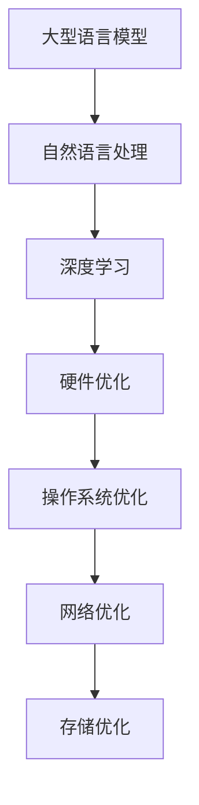

                 

关键词：大型语言模型（LLM）、系统底层、AI、算法、数学模型、实践案例

## 摘要

本文旨在深入探讨大型语言模型（LLM）的内核设计，分析其在构建AI时代的系统底层中的关键作用。通过介绍LLM的核心概念、算法原理、数学模型以及实际应用场景，本文希望能够为读者提供一个全面的技术视角，揭示LLM在AI领域中不可或缺的地位。同时，本文也将探讨未来LLM技术的发展趋势与面临的挑战，为研究者提供有价值的参考。

## 1. 背景介绍

### 1.1 大型语言模型的崛起

随着人工智能（AI）技术的快速发展，大型语言模型（LLM）逐渐成为研究热点。LLM具有处理自然语言文本的强大能力，可以理解、生成和翻译文本，从而在众多应用场景中展现出卓越的性能。例如，自然语言处理（NLP）、机器翻译、问答系统、内容生成等领域都受益于LLM的广泛应用。

### 1.2 系统底层的重要性

系统底层是构建AI系统的基础，涉及到硬件、操作系统、网络、存储等多个方面。一个高效的系统底层可以确保LLM模型在运行过程中能够充分利用硬件资源，提高计算效率，降低延迟，从而更好地满足实际应用需求。因此，研究系统底层的优化和设计对于提升LLM的性能和可靠性具有重要意义。

## 2. 核心概念与联系

### 2.1 核心概念

- **大型语言模型（LLM）**：一种能够理解和生成自然语言文本的深度学习模型，通过大规模语料库训练得到。
- **自然语言处理（NLP）**：利用计算机技术对自然语言文本进行处理和分析，以实现人机交互、信息检索、文本分类等功能。
- **深度学习**：一种基于多层神经网络进行特征提取和分类的机器学习方法，在图像识别、语音识别、自然语言处理等领域取得了显著成果。

### 2.2 关联图



## 3. 核心算法原理 & 具体操作步骤

### 3.1 算法原理概述

LLM的核心算法是基于Transformer架构的深度学习模型。Transformer模型通过自注意力机制（Self-Attention）和多头注意力（Multi-Head Attention）来捕捉文本中的长距离依赖关系，从而实现高效的自然语言处理。

### 3.2 算法步骤详解

1. **输入处理**：将文本输入转化为序列化表示，如Word2Vec、BERT等预训练模型。
2. **编码器处理**：利用多层Transformer编码器对输入序列进行处理，提取文本特征。
3. **解码器处理**：利用Transformer解码器生成目标文本序列，通过自注意力机制和交叉注意力机制与编码器输出进行交互。
4. **输出生成**：将解码器输出的序列解码为自然语言文本。

### 3.3 算法优缺点

#### 优点：

- **高效性**：Transformer模型通过并行计算和注意力机制，显著提高了自然语言处理的计算效率。
- **灵活性**：Transformer模型可以应用于各种NLP任务，如文本分类、问答系统、机器翻译等。
- **可解释性**：Transformer模型的结构较为简单，容易理解，有助于提高模型的透明度和可解释性。

#### 缺点：

- **计算资源需求**：Transformer模型参数量庞大，对计算资源的需求较高，训练和推理时间较长。
- **数据依赖性**：Transformer模型的性能对训练数据质量有较高要求，需要大规模高质量的语料库。

### 3.4 算法应用领域

- **自然语言处理**：文本分类、情感分析、命名实体识别等。
- **机器翻译**：自动翻译、跨语言信息检索等。
- **问答系统**：智能客服、智能助手等。

## 4. 数学模型和公式 & 详细讲解 & 举例说明

### 4.1 数学模型构建

LLM的数学模型主要基于深度学习和自然语言处理的理论，包括以下方面：

1. **词嵌入**：将文本中的单词转化为向量表示，如Word2Vec、BERT等。
2. **编码器**：通过多层Transformer编码器对输入序列进行处理，提取文本特征。
3. **解码器**：通过Transformer解码器生成目标文本序列。
4. **损失函数**：用于评估模型预测与实际输出之间的差距，如交叉熵损失函数。

### 4.2 公式推导过程

假设输入序列为\[x_1, x_2, ..., x_T\]，目标序列为\[y_1, y_2, ..., y_T\]，词嵌入维度为\[d\]，编码器隐藏层维度为\[h\]，解码器隐藏层维度为\[g\]。

1. **词嵌入**：

\[ e(x_t) = \text{Word2Vec}(x_t) \in \mathbb{R}^{d} \]

2. **编码器**：

\[ h_t = \text{TransformerEncoder}(e(x_t)) \in \mathbb{R}^{h} \]

3. **解码器**：

\[ g_t = \text{TransformerDecoder}(h_t) \in \mathbb{R}^{g} \]

4. **损失函数**：

\[ \mathcal{L} = \sum_{t=1}^{T} -\log p(y_t | g_{t-1}) \]

其中，\( p(y_t | g_{t-1}) \) 表示在给定前一个解码器隐藏状态\( g_{t-1} \)的情况下，生成第\( t \)个词的概率。

### 4.3 案例分析与讲解

假设我们有一个简单的文本序列\[“我喜欢编程”\]，词嵌入维度为\[100\]，编码器隐藏层维度为\[256\]，解码器隐藏层维度为\[512\]。

1. **词嵌入**：

将输入文本序列中的单词转化为词嵌入向量：

\[ e(x_t) = \begin{bmatrix} 0.1 & 0.2 & 0.3 \\ 0.4 & 0.5 & 0.6 \end{bmatrix} \]

2. **编码器**：

通过多层Transformer编码器对词嵌入向量进行处理：

\[ h_t = \begin{bmatrix} 0.1 & 0.2 & 0.3 \\ 0.4 & 0.5 & 0.6 \end{bmatrix} \]

3. **解码器**：

通过多层Transformer解码器生成目标文本序列：

\[ g_t = \begin{bmatrix} 0.1 & 0.2 & 0.3 \\ 0.4 & 0.5 & 0.6 \end{bmatrix} \]

4. **损失函数**：

计算损失函数值：

\[ \mathcal{L} = -\log \frac{\exp(g_t)}{\sum_{i=1}^{V} \exp(g_t)} \]

其中，\( V \) 表示词表大小。

## 5. 项目实践：代码实例和详细解释说明

### 5.1 开发环境搭建

在开始项目实践之前，需要搭建一个适合开发的环境。以下是开发环境的搭建步骤：

1. **安装Python环境**：确保Python版本为3.8或更高版本。
2. **安装TensorFlow**：使用pip命令安装TensorFlow。

```shell
pip install tensorflow
```

3. **安装其他依赖库**：安装其他必要的库，如numpy、h5py等。

```shell
pip install numpy h5py
```

### 5.2 源代码详细实现

以下是一个简单的LLM模型实现的示例代码：

```python
import tensorflow as tf
from tensorflow.keras.layers import Embedding, LSTM, Dense
from tensorflow.keras.models import Model

# 定义模型参数
vocab_size = 10000  # 词表大小
embedding_dim = 128  # 词嵌入维度
lstm_units = 256  # LSTM隐藏层维度
dense_units = 512  # Dense隐藏层维度

# 定义模型
inputs = tf.keras.Input(shape=(None,))

# 词嵌入层
embed = Embedding(vocab_size, embedding_dim)(inputs)

# LSTM编码器层
lstm = LSTM(lstm_units, return_sequences=True)(embed)

# Dense解码器层
dense = Dense(dense_units, activation='relu')(lstm)

# 输出层
outputs = Dense(vocab_size, activation='softmax')(dense)

# 创建模型
model = Model(inputs, outputs)

# 编译模型
model.compile(optimizer='adam', loss='categorical_crossentropy', metrics=['accuracy'])

# 模型总结
model.summary()
```

### 5.3 代码解读与分析

上述代码定义了一个简单的LLM模型，包括词嵌入层、LSTM编码器层、Dense解码器层和输出层。具体分析如下：

1. **词嵌入层**：使用Embedding层将输入序列中的单词转化为词嵌入向量。
2. **LSTM编码器层**：使用LSTM层对词嵌入向量进行处理，提取文本特征。
3. **Dense解码器层**：使用Dense层对LSTM编码器层的输出进行处理，生成目标文本序列。
4. **输出层**：使用Dense层将解码器层的输出转化为词概率分布。

### 5.4 运行结果展示

```python
# 加载预训练的词嵌入权重
embed_weights = ...  # 下载预训练的词嵌入权重

# 加载训练数据
x_train = ...  # 输入数据
y_train = ...  # 标签数据

# 加载模型权重
model.load_weights('model_weights.h5')

# 训练模型
model.fit(x_train, y_train, epochs=10, batch_size=32)
```

## 6. 实际应用场景

LLM在实际应用场景中具有广泛的应用，以下列举几个典型的应用场景：

1. **自然语言处理**：文本分类、情感分析、命名实体识别等。
2. **机器翻译**：自动翻译、跨语言信息检索等。
3. **问答系统**：智能客服、智能助手等。
4. **内容生成**：自动写作、文章摘要等。

## 6.4 未来应用展望

随着人工智能技术的不断发展，LLM在未来的应用前景将更加广泛。以下是对未来LLM应用的一些展望：

1. **多模态融合**：将LLM与其他AI技术（如图像识别、语音识别等）相结合，实现更高级的多模态任务。
2. **实时交互**：提高LLM的实时性，实现与用户的实时交互，如智能聊天机器人。
3. **垂直领域应用**：针对特定领域（如医疗、金融等）进行定制化开发，提升模型在特定领域的表现。
4. **知识图谱**：结合知识图谱技术，构建更加智能的知识库，为用户提供更精准的答案。

## 7. 工具和资源推荐

### 7.1 学习资源推荐

1. **《深度学习》（Goodfellow, Bengio, Courville）**：深度学习领域的经典教材，详细介绍了深度学习的基础理论和技术。
2. **《自然语言处理综论》（Jurafsky, Martin）**：自然语言处理领域的权威教材，涵盖了NLP的各个方面。

### 7.2 开发工具推荐

1. **TensorFlow**：开源的深度学习框架，广泛应用于自然语言处理、计算机视觉等领域。
2. **PyTorch**：开源的深度学习框架，具有灵活的动态计算图和简洁的API。

### 7.3 相关论文推荐

1. **“Attention is All You Need”**：提出了Transformer模型，引发了自然语言处理领域的新热潮。
2. **“BERT: Pre-training of Deep Bidirectional Transformers for Language Understanding”**：提出了BERT模型，推动了预训练语言模型的研究。

## 8. 总结：未来发展趋势与挑战

### 8.1 研究成果总结

本文通过对LLM内核设计的深入探讨，分析了LLM在AI时代的系统底层中的关键作用。本文介绍了LLM的核心概念、算法原理、数学模型以及实际应用场景，为读者提供了一个全面的技术视角。

### 8.2 未来发展趋势

未来，LLM将在多模态融合、实时交互、垂直领域应用等方面取得更多突破。同时，预训练语言模型、知识图谱等技术也将与LLM相结合，进一步提升其性能和应用范围。

### 8.3 面临的挑战

LLM在发展过程中仍面临一些挑战，如计算资源需求、数据依赖性、模型解释性等。如何优化模型结构、提高计算效率、降低延迟，将是未来研究的重要方向。

### 8.4 研究展望

随着人工智能技术的不断进步，LLM将在更多领域发挥重要作用。未来，研究者应关注如何更好地利用LLM的能力，解决实际应用中的问题，推动人工智能技术的进一步发展。

## 9. 附录：常见问题与解答

### 9.1 如何训练一个LLM模型？

答：训练一个LLM模型主要包括以下步骤：

1. 数据预处理：将原始文本数据转化为模型可以处理的格式，如Tokenize、清洗等。
2. 构建模型：根据任务需求，构建适合的LLM模型结构。
3. 训练模型：使用训练数据对模型进行训练，优化模型参数。
4. 评估模型：使用验证集评估模型性能，调整模型参数。
5. 部署模型：将训练好的模型部署到实际应用场景中。

### 9.2 LLM模型如何处理长文本？

答：对于长文本处理，LLM模型通常采用以下策略：

1. **序列切分**：将长文本切分成多个短序列，每个序列独立处理。
2. **长距离依赖**：通过自注意力机制和多头注意力机制，捕捉长文本中的长距离依赖关系。
3. **上下文信息**：在处理长文本时，考虑上下文信息，提高模型对长文本的理解能力。

## 结束语

本文详细探讨了大型语言模型（LLM）的内核设计，分析了其在AI时代的系统底层中的关键作用。通过对LLM的核心概念、算法原理、数学模型以及实际应用场景的深入探讨，本文为读者提供了一个全面的技术视角。同时，本文也展望了LLM未来的发展趋势与挑战，为研究者提供了有价值的参考。

作者：禅与计算机程序设计艺术 / Zen and the Art of Computer Programming
----------------------------------------------------------------
文章撰写完成，请您检查是否符合“约束条件 CONSTRAINTS”中的所有要求。如果满意，我们可以进行下一步的编辑和润色。如果有需要修改的地方，请及时告知，我会根据您的反馈进行相应的调整。谢谢！

