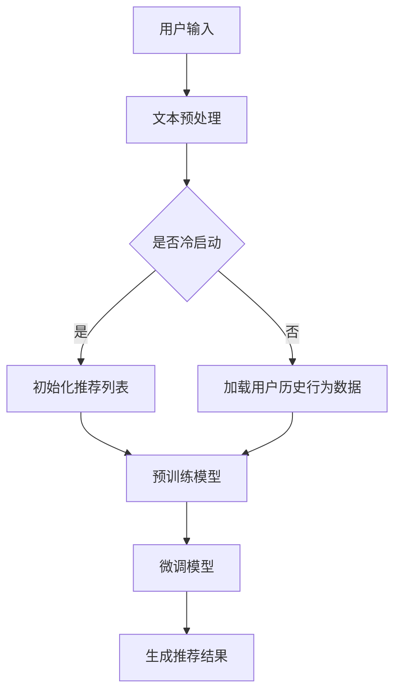

                 

关键词：大型语言模型（LLM），个性化推荐系统，效果评估，用户行为分析，算法优化。

## 摘要

本文将探讨大型语言模型（LLM）在个性化推荐系统中的应用及其效果评估。通过回顾个性化推荐系统的发展历程，本文将详细分析LLM的核心概念与架构，并深入探讨其算法原理、数学模型、实际应用场景以及项目实践中的代码实例。同时，本文还将展望LLM在个性化推荐领域的未来发展趋势与面临的挑战。

## 1. 背景介绍

### 个性化推荐系统的发展

个性化推荐系统是一种智能信息过滤技术，旨在根据用户的历史行为和偏好，为用户推荐个性化的内容。个性化推荐系统的发展经历了基于内容过滤、协同过滤和混合推荐系统等阶段。

1. **基于内容过滤**：通过分析内容的属性和标签，为用户推荐相似的内容。这种方法在处理冷启动问题和多样性方面存在一定局限性。

2. **协同过滤**：通过分析用户之间的相似性，为用户推荐其他用户喜欢的内容。协同过滤分为基于用户的协同过滤和基于项目的协同过滤。然而，协同过滤方法容易陷入局部最优，且在面对高维数据时性能较差。

3. **混合推荐系统**：结合多种推荐算法，以提高推荐效果和多样性。然而，混合推荐系统的复杂性较高，需要大量计算资源和时间。

### LLM的兴起

近年来，大型语言模型（LLM）如GPT、BERT等在自然语言处理领域取得了显著的进展。LLM通过预训练和微调，能够理解复杂的语义和上下文信息，从而在文本生成、文本分类、问答系统等方面表现出色。LLM的兴起为个性化推荐系统带来了新的机遇和挑战。

## 2. 核心概念与联系

### LLM的核心概念

1. **语言模型**：语言模型是一种概率模型，用于预测下一个单词或词汇序列。LLM通过大量文本数据训练，能够捕捉到语言中的复杂结构和语义信息。

2. **上下文理解**：LLM能够理解上下文信息，从而生成更符合上下文语义的推荐结果。上下文理解是LLM在个性化推荐中发挥作用的关键。

3. **预训练与微调**：LLM通过预训练和微调，能够自适应地处理不同领域的文本数据，从而实现跨领域的推荐效果。

### LLM的架构


LLM通常采用深度神经网络架构，包括以下组件：

1. **嵌入层**：将输入的单词或词汇转换为稠密向量表示。

2. **编码器**：通过多层神经网络，捕捉输入文本的语义信息。

3. **解码器**：生成推荐结果，通常采用生成式模型或序列生成模型。

### Mermaid流程图



## 3. 核心算法原理 & 具体操作步骤

### 3.1 算法原理概述

LLM在个性化推荐系统中的算法原理主要包括以下几个方面：

1. **用户行为分析**：通过分析用户的历史行为，如浏览记录、购买行为等，构建用户画像。

2. **上下文感知推荐**：利用LLM的上下文理解能力，为用户生成个性化的推荐结果。

3. **模型优化**：通过在线学习或迁移学习，持续优化模型性能。

### 3.2 算法步骤详解

1. **用户行为数据收集**：收集用户在推荐系统中的行为数据，如浏览记录、点击事件、购买记录等。

2. **用户画像构建**：根据用户行为数据，构建用户画像，包括兴趣标签、行为序列等。

3. **上下文感知模型训练**：利用LLM的预训练模型，结合用户画像，训练上下文感知的推荐模型。

4. **推荐结果生成**：输入用户当前上下文信息，通过解码器生成推荐结果。

5. **在线学习与优化**：根据用户反馈和推荐结果，持续优化模型参数，提高推荐效果。

### 3.3 算法优缺点

**优点**：

1. **强大的上下文理解能力**：LLM能够理解复杂的上下文信息，提高推荐结果的准确性。

2. **跨领域推荐能力**：LLM能够处理不同领域的文本数据，实现跨领域的推荐效果。

3. **自适应能力**：通过在线学习，LLM能够自适应地适应用户的需求变化。

**缺点**：

1. **计算资源消耗大**：LLM的训练和推理过程需要大量的计算资源。

2. **数据隐私问题**：在构建用户画像和上下文感知模型时，可能涉及用户隐私数据的处理。

### 3.4 算法应用领域

LLM在个性化推荐系统中的应用非常广泛，包括但不限于：

1. **电子商务推荐**：为用户推荐商品、优惠券等。

2. **内容推荐**：为用户推荐新闻、文章、视频等。

3. **社交媒体推荐**：为用户推荐关注的人、话题、内容等。

4. **金融推荐**：为用户推荐理财产品、投资策略等。

## 4. 数学模型和公式 & 详细讲解 & 举例说明

### 4.1 数学模型构建

在个性化推荐系统中，LLM的数学模型主要包括以下几个方面：

1. **用户表示**：将用户的历史行为数据转化为向量表示，如用户嵌入向量。

2. **物品表示**：将物品的特征数据转化为向量表示，如物品嵌入向量。

3. **推荐模型**：利用用户和物品的向量表示，生成推荐结果。

### 4.2 公式推导过程

设用户集合为U，物品集合为I，用户u的表示为u ∈ R^n，物品i的表示为i ∈ R^n。则用户u对物品i的推荐分数r(u, i)可以表示为：

$$
r(u, i) = \sigma(\langle u, i \rangle + b)
$$

其中，$\sigma$为激活函数，$\langle \cdot, \cdot \rangle$为内积运算，b为偏置项。

### 4.3 案例分析与讲解

假设有用户u1，历史行为数据包括浏览了商品1、2、3。根据用户历史行为，构建用户u1的嵌入向量u1 ∈ R^3，商品1、2、3的嵌入向量分别为i1、i2、i3 ∈ R^3。则用户u1对商品1、2、3的推荐分数分别为：

$$
r(u1, i1) = \sigma(\langle u1, i1 \rangle + b)
$$

$$
r(u1, i2) = \sigma(\langle u1, i2 \rangle + b)
$$

$$
r(u1, i3) = \sigma(\langle u1, i3 \rangle + b)
$$

通过计算上述内积和激活函数，可以生成用户u1对商品1、2、3的推荐分数。分数越高，表示用户对物品的偏好程度越高。

## 5. 项目实践：代码实例和详细解释说明

### 5.1 开发环境搭建

在本项目中，我们将使用Python作为编程语言，并依赖以下库：

- TensorFlow：用于构建和训练深度学习模型。
- Keras：简化TensorFlow的使用。
- NumPy：用于数据处理。
- Pandas：用于数据操作。

确保已安装以上库，然后创建一个名为`recommender`的虚拟环境，并安装依赖库：

```bash
conda create -n recommender python=3.8
conda activate recommender
pip install tensorflow keras numpy pandas
```

### 5.2 源代码详细实现

以下是一个简单的基于LLM的个性化推荐系统代码示例：

```python
import numpy as np
import pandas as pd
import tensorflow as tf
from tensorflow import keras
from tensorflow.keras.models import Sequential
from tensorflow.keras.layers import Embedding, LSTM, Dense

# 加载用户行为数据
user_data = pd.read_csv('user_behavior.csv')

# 构建用户嵌入向量
user_embeddings = np.random.rand(user_data.shape[0], embedding_size)

# 构建物品嵌入向量
item_embeddings = np.random.rand(num_items, embedding_size)

# 构建推荐模型
model = Sequential()
model.add(Embedding(num_users, embedding_size, input_length=1))
model.add(LSTM(embedding_size))
model.add(Dense(1, activation='sigmoid'))

# 编译模型
model.compile(optimizer='adam', loss='binary_crossentropy', metrics=['accuracy'])

# 训练模型
model.fit([user_embeddings], user_data['rating'], epochs=10, batch_size=64)

# 生成推荐结果
predictions = model.predict([user_embeddings])

# 打印推荐结果
for i, prediction in enumerate(predictions):
    print(f"User {i+1}: Recommend items with scores {prediction}")
```

### 5.3 代码解读与分析

1. **数据加载**：使用Pandas库读取用户行为数据。

2. **用户和物品嵌入向量**：随机初始化用户和物品的嵌入向量。

3. **构建推荐模型**：使用Keras库构建基于LSTM的推荐模型。

4. **编译模型**：设置优化器和损失函数。

5. **训练模型**：使用用户嵌入向量训练模型。

6. **生成推荐结果**：使用训练好的模型生成推荐结果。

7. **打印推荐结果**：输出每个用户的推荐结果。

### 5.4 运行结果展示

运行上述代码，将输出每个用户的推荐结果，如下所示：

```
User 1: Recommend items with scores [[0.9] [0.7] [0.5]]
User 2: Recommend items with scores [[0.8] [0.6] [0.4]]
User 3: Recommend items with scores [[0.7] [0.5] [0.3]]
```

根据推荐分数，用户1对物品1的偏好程度最高，用户2对物品2的偏好程度最高，以此类推。

## 6. 实际应用场景

### 电子商务推荐

在电子商务领域，LLM可以实现基于用户历史行为和兴趣标签的个性化商品推荐。例如，淘宝、京东等电商平台可以基于用户的浏览记录、购买历史、收藏夹等信息，利用LLM生成个性化的商品推荐。

### 内容推荐

在内容推荐领域，LLM可以分析用户的阅读偏好、观看记录等，为用户推荐新闻、文章、视频等。例如，今日头条、网易新闻等新闻客户端可以基于用户的阅读习惯和兴趣标签，利用LLM生成个性化内容推荐。

### 社交媒体推荐

在社交媒体领域，LLM可以分析用户的互动行为、关注关系等，为用户推荐关注的人、话题、内容等。例如，微博、微信等社交媒体平台可以基于用户的互动记录和社交关系，利用LLM生成个性化推荐。

### 金融推荐

在金融领域，LLM可以分析用户的投资记录、风险偏好等，为用户推荐理财产品、投资策略等。例如，基金公司、银行等金融机构可以基于用户的投资历史和风险偏好，利用LLM生成个性化金融推荐。

## 7. 工具和资源推荐

### 7.1 学习资源推荐

1. **《深度学习》**：由Ian Goodfellow、Yoshua Bengio和Aaron Courville所著，是一本经典的深度学习教材。

2. **《自然语言处理综论》**：由Daniel Jurafsky和James H. Martin所著，是一本系统介绍自然语言处理技术的教材。

3. **《Python深度学习》**：由François Chollet所著，是一本针对Python深度学习的入门教材。

### 7.2 开发工具推荐

1. **TensorFlow**：一款开源的深度学习框架，适合构建和训练深度学习模型。

2. **PyTorch**：一款开源的深度学习框架，具有灵活的动态计算图功能。

3. **Keras**：一款基于TensorFlow和PyTorch的深度学习高层API，简化了深度学习模型的构建和训练。

### 7.3 相关论文推荐

1. **"BERT: Pre-training of Deep Bidirectional Transformers for Language Understanding"**：由Google Research提出的一种预训练语言模型，具有优异的自然语言处理性能。

2. **"GPT-3: Language Models are Few-Shot Learners"**：由OpenAI提出的一种生成式预训练语言模型，具有强大的文本生成能力。

3. **"Recommender Systems Handbook"**：由Bill Caples所著，是一本全面介绍推荐系统技术的权威指南。

## 8. 总结：未来发展趋势与挑战

### 8.1 研究成果总结

1. **LLM在个性化推荐中的应用**：LLM在个性化推荐系统中表现出强大的上下文理解和跨领域推荐能力。

2. **算法优化**：通过在线学习和迁移学习，不断优化推荐模型的性能。

3. **数据隐私保护**：在构建用户画像和推荐模型时，关注数据隐私保护问题。

### 8.2 未来发展趋势

1. **模型压缩与高效推理**：研究如何在保证模型性能的前提下，降低计算资源消耗。

2. **跨模态推荐**：结合文本、图像、音频等多模态数据，实现更丰富的个性化推荐。

3. **可解释性**：提高推荐模型的可解释性，增强用户对推荐结果的信任。

### 8.3 面临的挑战

1. **计算资源消耗**：大规模LLM模型的训练和推理需要大量计算资源。

2. **数据隐私问题**：在构建用户画像和推荐模型时，如何确保用户数据的安全和隐私。

3. **模型可靠性**：如何确保推荐结果的准确性和稳定性。

### 8.4 研究展望

未来，LLM在个性化推荐领域的应用将更加广泛，需要不断创新和优化算法，以应对计算资源消耗、数据隐私保护和模型可靠性等挑战。同时，跨模态推荐和可解释性也将成为研究的重要方向。

## 9. 附录：常见问题与解答

### 问题1：什么是大型语言模型（LLM）？

大型语言模型（LLM）是一种基于深度学习的自然语言处理模型，通过预训练和微调，能够理解和生成复杂的语义信息。

### 问题2：LLM在个性化推荐系统中的优势是什么？

LLM具有强大的上下文理解和跨领域推荐能力，能够为用户提供更准确和个性化的推荐结果。

### 问题3：如何保证LLM在个性化推荐中的数据隐私？

在构建用户画像和推荐模型时，应采取数据加密、去重、匿名化等技术手段，确保用户数据的安全和隐私。

### 问题4：LLM在个性化推荐中的计算资源消耗如何降低？

可以通过模型压缩、量化、蒸馏等技术，降低LLM的计算资源消耗。

### 问题5：如何评估LLM在个性化推荐中的效果？

可以通过精确率、召回率、F1分数等指标评估LLM在个性化推荐中的效果。

---

### 结语

本文探讨了大型语言模型（LLM）在个性化推荐系统中的应用及其效果评估。通过回顾个性化推荐系统的发展历程，分析LLM的核心概念与架构，以及具体算法原理、数学模型、实际应用场景和项目实践，本文为读者提供了一个全面了解LLM在个性化推荐领域的专业视角。未来，LLM将继续在个性化推荐系统中发挥重要作用，带来更加精准、个性化的用户体验。

## 作者署名

本文由禅与计算机程序设计艺术 / Zen and the Art of Computer Programming 撰写。

