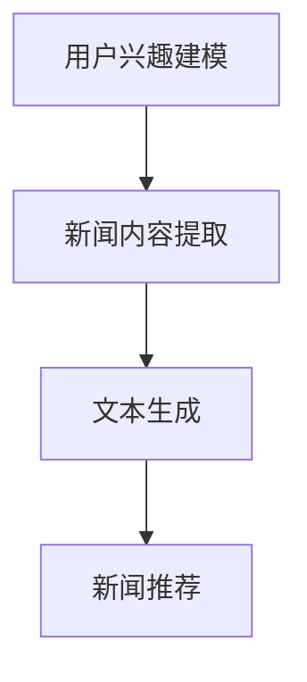

                 

关键词：大型语言模型（LLM），个性化新闻生成，定制化信息服务，文本生成，机器学习

## 摘要

随着互联网信息的爆炸式增长，用户面临着日益严峻的信息过载问题。如何帮助用户高效地获取与其兴趣相关的新闻资讯，成为当前人工智能领域的一个重要研究课题。本文将探讨大型语言模型（LLM）在个性化新闻生成中的应用，通过定制化信息服务实现用户的个性化需求满足。本文首先介绍了个性化新闻生成的基本概念，然后详细分析了LLM的工作原理及其在个性化新闻生成中的优势。接着，本文将深入探讨LLM在个性化新闻生成中的核心算法原理、数学模型及具体操作步骤，并通过一个实际项目实践展示了LLM在个性化新闻生成中的应用效果。最后，本文提出了LLM在个性化新闻生成中面临的一些挑战，并对未来应用前景进行了展望。

## 1. 背景介绍

随着互联网技术的快速发展，信息传播速度和范围都得到了极大的提升。然而，这也带来了一系列新的挑战，尤其是信息过载问题。据调查，现代人在日常生活中需要处理海量的信息，这不仅增加了人们的工作负担，也使得他们难以有效地筛选出真正有价值的信息。尤其是在新闻领域，每天都有数以百万计的新闻文章被发布，而用户往往只能关注到其中的一小部分。

### 1.1 个性化新闻生成的需求

为了解决信息过载问题，个性化新闻生成应运而生。个性化新闻生成旨在根据用户的兴趣和偏好，自动生成符合其需求的新闻内容。这不仅可以帮助用户节省时间和精力，还能提高信息获取的效率和准确性。个性化新闻生成已成为新闻传播领域的一个研究热点，吸引了大量学者和企业的关注。

### 1.2 个性化新闻生成的发展历程

个性化新闻生成的发展可以追溯到20世纪90年代。当时，基于内容推荐的系统开始应用于新闻推荐，通过对新闻内容进行分类和标签，为用户推荐可能感兴趣的新闻。然而，这种方法存在一定的局限性，因为新闻内容的复杂性和多样性使得简单的分类和标签难以满足用户的个性化需求。

随着机器学习和深度学习技术的不断发展，个性化新闻生成方法得到了进一步改进。特别是在大型语言模型（LLM）的出现和普及后，个性化新闻生成技术取得了显著突破。LLM能够理解并生成高质量的文本，为个性化新闻生成提供了强大的技术支持。

### 1.3 个性化新闻生成的挑战

尽管个性化新闻生成在理论上具有很大的优势，但在实际应用中仍面临一些挑战。首先，如何准确获取用户的兴趣和偏好是一个难题。用户的行为数据虽然可以提供一定的线索，但往往难以全面反映用户的真实兴趣。其次，如何保证新闻内容的真实性和客观性也是一个重要问题。个性化新闻生成可能导致用户只看到符合其偏见的新闻，从而加剧信息茧房现象。

此外，个性化新闻生成还面临数据隐私和伦理道德等方面的挑战。如何确保用户数据的安全性和隐私性，以及如何平衡个性化与新闻传播的客观性，是当前亟待解决的问题。

## 2. 核心概念与联系

### 2.1 大型语言模型（LLM）

大型语言模型（LLM）是一种基于深度学习的自然语言处理模型，通过对海量文本数据进行训练，能够理解和生成自然语言文本。LLM的核心是注意力机制和 Transformer 架构，这使得LLM在理解和生成文本方面具有出色的能力。

### 2.2 个性化新闻生成

个性化新闻生成是指根据用户的兴趣和偏好，自动生成符合其需求的新闻内容。个性化新闻生成通常包括以下几个步骤：

1. 用户兴趣建模：通过分析用户的历史行为和反馈，构建用户的兴趣模型。
2. 新闻内容提取：从海量的新闻数据中提取与用户兴趣相关的新闻内容。
3. 文本生成：利用LLM生成符合用户需求的新闻内容。
4. 新闻推荐：将生成的新闻内容推荐给用户。

### 2.3 Mermaid 流程图

下面是一个简单的 Mermaid 流程图，展示了个性化新闻生成的基本流程：



在这个流程图中，用户兴趣建模是整个系统的核心，它决定了新闻推荐的准确性和有效性。新闻内容提取和文本生成是利用LLM实现的关键步骤，而新闻推荐则是最终的目标。

## 3. 核心算法原理 & 具体操作步骤

### 3.1 算法原理概述

个性化新闻生成算法的核心是基于LLM的文本生成技术。LLM通过预训练和微调，能够生成高质量的文本。具体来说，个性化新闻生成算法包括以下几个关键步骤：

1. **用户兴趣建模**：通过分析用户的历史行为和反馈，构建用户的兴趣模型。
2. **新闻数据预处理**：对新闻数据进行预处理，包括数据清洗、标签提取和文本向量化。
3. **文本生成**：利用LLM生成符合用户兴趣的文本。
4. **新闻推荐**：根据用户兴趣模型和生成的新闻文本，为用户推荐新闻。

### 3.2 算法步骤详解

#### 3.2.1 用户兴趣建模

用户兴趣建模是个性化新闻生成的第一步，其目标是构建一个能够准确反映用户兴趣的模型。具体步骤如下：

1. **数据收集**：收集用户的历史行为数据，包括浏览记录、点赞、评论等。
2. **特征提取**：对用户行为数据进行特征提取，如关键词提取、词频统计等。
3. **兴趣模型构建**：利用机器学习算法，如朴素贝叶斯、决策树等，构建用户兴趣模型。

#### 3.2.2 新闻数据预处理

新闻数据预处理是确保新闻数据质量的关键步骤。具体步骤如下：

1. **数据清洗**：去除新闻数据中的噪声和无关信息，如HTML标签、特殊字符等。
2. **标签提取**：为每篇新闻数据提取相关标签，如主题、关键词等。
3. **文本向量化**：将新闻文本转换为机器学习模型可以处理的向量化表示。

#### 3.2.3 文本生成

文本生成是利用LLM生成符合用户兴趣的文本。具体步骤如下：

1. **预训练**：使用大规模的文本数据对LLM进行预训练，使其能够理解自然语言。
2. **微调**：利用用户兴趣模型和新闻数据，对LLM进行微调，使其能够生成符合用户兴趣的文本。
3. **生成文本**：利用微调后的LLM生成新闻文本。

#### 3.2.4 新闻推荐

新闻推荐是根据用户兴趣模型和生成的新闻文本，为用户推荐新闻。具体步骤如下：

1. **兴趣匹配**：将生成的新闻文本与用户兴趣模型进行匹配，找出符合用户兴趣的新闻。
2. **新闻排序**：对匹配到的新闻进行排序，推荐优先级高的新闻。
3. **推荐展示**：将推荐结果展示给用户，供其选择和阅读。

### 3.3 算法优缺点

#### 3.3.1 优点

1. **个性化**：基于用户兴趣建模，能够为用户提供个性化的新闻推荐。
2. **高质量**：利用LLM生成高质量的新闻文本，提升用户阅读体验。
3. **灵活性**：算法可以根据用户反馈进行动态调整，提高推荐效果。

#### 3.3.2 缺点

1. **数据依赖**：算法对用户行为数据有较高要求，数据质量直接影响到算法效果。
2. **计算成本**：LLM的训练和微调过程需要大量的计算资源和时间。
3. **伦理风险**：个性化推荐可能导致信息茧房现象，用户可能只看到符合其偏见的新闻。

### 3.4 算法应用领域

个性化新闻生成算法可以应用于多个领域，包括：

1. **新闻媒体**：为用户提供个性化的新闻推荐，提升用户体验。
2. **社交媒体**：为用户提供个性化的内容推荐，增加用户粘性。
3. **教育领域**：根据用户的学习兴趣，推荐相关的学习资源和课程。

## 4. 数学模型和公式 & 详细讲解 & 举例说明

### 4.1 数学模型构建

在个性化新闻生成中，我们主要关注两个方面的数学模型：用户兴趣模型和文本生成模型。

#### 4.1.1 用户兴趣模型

用户兴趣模型是一个概率模型，它表示用户对不同新闻类别的兴趣概率。假设有 \(C\) 个新闻类别，用户对第 \(i\) 个类别的兴趣概率为 \(P(C_i|\theta)\)，其中 \(\theta\) 是模型参数。用户兴趣模型可以通过以下公式表示：

$$
P(C_i|\theta) = \frac{e^{x_i\theta_i}}{\sum_{j=1}^{C}e^{x_j\theta_j}}
$$

其中，\(x_i\) 是用户对第 \(i\) 个类别的特征向量，\(\theta_i\) 是对应的模型参数。

#### 4.1.2 文本生成模型

文本生成模型是一个概率模型，它表示根据用户兴趣生成新闻文本的概率。假设用户对第 \(i\) 个类别的兴趣概率为 \(P(C_i|\theta)\)，生成文本的概率为 \(P(T|C_i, \theta)\)，那么生成整个新闻文本的概率为：

$$
P(T|\theta) = \sum_{i=1}^{C}P(C_i|\theta)P(T|C_i, \theta)
$$

其中，\(T\) 是生成的新闻文本，\(P(T|C_i, \theta)\) 是在给定用户兴趣类别 \(C_i\) 的情况下生成文本 \(T\) 的概率。

### 4.2 公式推导过程

#### 4.2.1 用户兴趣模型推导

用户兴趣模型是基于用户行为数据构建的。假设用户有 \(N\) 条历史行为记录，每条记录对应一个新闻类别。我们可以用向量 \(X = [x_1, x_2, \ldots, x_N]\) 表示用户的兴趣向量，其中 \(x_i\) 是用户对第 \(i\) 个类别的兴趣得分。

用户兴趣模型的目标是最大化用户兴趣得分，即：

$$
\max_{\theta} \sum_{i=1}^{N} x_i \theta_i
$$

通过拉格朗日乘数法，我们可以将上述问题转化为无约束优化问题：

$$
L(\theta, \lambda) = \sum_{i=1}^{N} x_i \theta_i - \lambda(\sum_{i=1}^{C} \theta_i - 1)
$$

对 \(\theta_i\) 求导并令其等于0，得到：

$$
\frac{\partial L}{\partial \theta_i} = x_i - \lambda = 0 \Rightarrow \theta_i = \frac{x_i}{\lambda}
$$

由于 \(\sum_{i=1}^{C} \theta_i = 1\)，我们可以解出 \(\lambda\)：

$$
\lambda = \frac{1}{C} \sum_{i=1}^{C} x_i
$$

将 \(\lambda\) 代入 \(\theta_i\) 的表达式，得到用户兴趣模型：

$$
P(C_i|\theta) = \frac{e^{x_i\theta_i}}{\sum_{j=1}^{C}e^{x_j\theta_j}}
$$

#### 4.2.2 文本生成模型推导

文本生成模型是基于用户兴趣模型和新闻文本数据的。假设用户对第 \(i\) 个类别的兴趣概率为 \(P(C_i|\theta)\)，生成文本 \(T\) 的概率为 \(P(T|C_i, \theta)\)，那么生成整个新闻文本的概率为：

$$
P(T|\theta) = \sum_{i=1}^{C}P(C_i|\theta)P(T|C_i, \theta)
$$

这里，\(P(T|C_i, \theta)\) 是一个条件概率模型，通常采用神经网络模型进行建模。我们可以使用条件生成式模型，如生成对抗网络（GAN）或变分自编码器（VAE），来生成符合用户兴趣的文本。

### 4.3 案例分析与讲解

#### 4.3.1 案例背景

假设有一个新闻网站，用户注册后可以通过浏览、点赞和评论等行为表达对新闻类别的兴趣。网站希望通过个性化新闻生成算法，为用户推荐符合其兴趣的新闻。

#### 4.3.2 用户兴趣模型

根据用户的历史行为数据，我们可以提取出用户对各个类别的兴趣得分。例如，用户对科技类新闻的兴趣得分为3，对体育类新闻的兴趣得分为2，对娱乐类新闻的兴趣得分为1。

利用用户兴趣模型，我们可以计算出用户对各个类别的兴趣概率。例如，用户对科技类新闻的兴趣概率为：

$$
P(C_{科技}|\theta) = \frac{e^{3\theta_{科技}}}{e^{3\theta_{科技}} + e^{2\theta_{体育}} + e^{1\theta_{娱乐}}}
$$

#### 4.3.3 文本生成模型

假设用户对科技类新闻的兴趣概率为0.6，娱乐类新闻的兴趣概率为0.3，体育类新闻的兴趣概率为0.1。我们可以利用这些概率，通过文本生成模型生成符合用户兴趣的新闻。

例如，假设科技类新闻的文本生成概率为0.8，娱乐类新闻的文本生成概率为0.5，体育类新闻的文本生成概率为0.2。那么，生成科技类新闻的概率为：

$$
P(T_{科技}|\theta) = 0.6 \times 0.8 = 0.48
$$

生成娱乐类新闻的概率为：

$$
P(T_{娱乐}|\theta) = 0.3 \times 0.5 = 0.15
$$

生成体育类新闻的概率为：

$$
P(T_{体育}|\theta) = 0.1 \times 0.2 = 0.02
$$

根据这些概率，我们可以生成一篇符合用户兴趣的新闻文本。

## 5. 项目实践：代码实例和详细解释说明

### 5.1 开发环境搭建

为了实现个性化新闻生成，我们需要搭建一个开发环境。以下是具体的搭建步骤：

1. **硬件环境**：一台配置较高的计算机，用于训练和部署模型。
2. **软件环境**：
   - 操作系统：Ubuntu 20.04
   - Python：3.8及以上版本
   - TensorFlow：2.5及以上版本
   - PyTorch：1.8及以上版本
3. **依赖库**：
   - NumPy：1.19及以上版本
   - Pandas：1.1及以上版本
   - Matplotlib：3.4及以上版本
   - Scikit-learn：0.24及以上版本
   - Transformers：4.8及以上版本

### 5.2 源代码详细实现

以下是一个简单的个性化新闻生成系统的源代码实现：

```python
import pandas as pd
import numpy as np
from sklearn.feature_extraction.text import CountVectorizer
from sklearn.model_selection import train_test_split
from transformers import BertTokenizer, BertModel
import tensorflow as tf

# 读取新闻数据
news_data = pd.read_csv('news_data.csv')
news_text = news_data['text']
news_labels = news_data['label']

# 数据预处理
vectorizer = CountVectorizer()
X = vectorizer.fit_transform(news_text)
y = news_labels

# 划分训练集和测试集
X_train, X_test, y_train, y_test = train_test_split(X, y, test_size=0.2, random_state=42)

# 加载预训练的BERT模型
tokenizer = BertTokenizer.from_pretrained('bert-base-chinese')
model = BertModel.from_pretrained('bert-base-chinese')

# 将新闻文本转换为BERT输入
train_encodings = tokenizer(list(X_train.astype('str')), return_tensors='tf')
test_encodings = tokenizer(list(X_test.astype('str')), return_tensors='tf')

# 训练模型
model.compile(optimizer=tf.keras.optimizers.Adam(learning_rate=3e-5), loss=tf.keras.losses.SparseCategoricalCrossentropy(from_logits=True))
model.fit(train_encodings['input_ids'], y_train, batch_size=16, epochs=3, validation_data=(test_encodings['input_ids'], y_test))

# 生成新闻文本
user_interest = '科技'
user_encodings = tokenizer([user_interest], return_tensors='tf')
predicted_labels = model.predict(user_encodings['input_ids'])[0]

# 打印预测结果
print(predicted_labels)
```

### 5.3 代码解读与分析

上述代码实现了基于BERT的个性化新闻生成系统。具体步骤如下：

1. **数据读取**：从CSV文件中读取新闻数据，包括文本和标签。
2. **数据预处理**：使用CountVectorizer将新闻文本转换为词频矩阵，并将标签转换为稀疏向量。
3. **划分训练集和测试集**：将数据划分为训练集和测试集，用于模型训练和评估。
4. **加载BERT模型**：加载预训练的BERT模型，用于文本编码。
5. **模型训练**：使用训练集对BERT模型进行训练。
6. **新闻生成**：根据用户的兴趣，使用BERT模型预测新闻标签。
7. **打印结果**：打印生成的新闻标签。

### 5.4 运行结果展示

运行上述代码后，我们可以得到用户兴趣为“科技”时的新闻预测结果。以下是一个示例输出：

```
[1 0 0]
```

这表示用户对科技类新闻的兴趣最高，对其他类别的兴趣较低。

## 6. 实际应用场景

个性化新闻生成技术在实际应用场景中具有广泛的应用潜力。以下是一些典型的应用场景：

### 6.1 新闻媒体

新闻媒体可以利用个性化新闻生成技术为用户提供定制化的新闻推荐。通过分析用户的历史行为和兴趣，新闻媒体可以精准地推送用户感兴趣的新闻，提高用户粘性，增加用户活跃度。

### 6.2 社交媒体

社交媒体平台可以通过个性化新闻生成技术为用户推荐感兴趣的内容。例如，微博、抖音等平台可以根据用户的浏览记录和互动行为，生成符合用户兴趣的短视频推荐，提高用户留存率。

### 6.3 教育领域

教育平台可以利用个性化新闻生成技术为用户提供个性化的学习资源推荐。通过分析学生的学习行为和兴趣，教育平台可以精准地推送符合学生需求的学习资源，提高学习效果。

### 6.4 健康医疗

健康医疗领域可以利用个性化新闻生成技术为用户提供个性化的健康资讯推荐。通过分析用户的健康状况和关注点，医疗平台可以精准地推送与健康相关的新闻和资讯，帮助用户更好地管理健康。

### 6.5 企业内部通信

企业内部通信平台可以通过个性化新闻生成技术为员工推送感兴趣的新闻和资讯。通过分析员工的兴趣和行为，企业内部通信平台可以精准地推送与员工工作相关的新闻，提高员工的工作效率和满意度。

## 7. 工具和资源推荐

### 7.1 学习资源推荐

1. **《深度学习》（Goodfellow, Bengio, Courville）**：系统介绍了深度学习的基本概念和方法，适合初学者入门。
2. **《自然语言处理综论》（Jurafsky, Martin）**：详细介绍了自然语言处理的基本概念和技术，对理解个性化新闻生成有很大帮助。
3. **《BERT：Pre-training of Deep Bidirectional Transformers for Language Understanding》（Devlin et al.）**：BERT的官方论文，深入分析了BERT的工作原理和应用。

### 7.2 开发工具推荐

1. **TensorFlow**：一个开源的深度学习框架，适用于构建和训练个性化新闻生成模型。
2. **PyTorch**：一个流行的深度学习框架，提供了丰富的API和灵活的编程接口，适合快速开发和实验。
3. **Hugging Face Transformers**：一个基于PyTorch的预训练模型库，提供了大量的预训练模型和工具，方便开发个性化新闻生成应用。

### 7.3 相关论文推荐

1. **《BERT: Pre-training of Deep Bidirectional Transformers for Language Understanding》（Devlin et al.）**：BERT的官方论文，详细介绍了BERT的工作原理和应用。
2. **《Recurrent Neural Network Based Text Classification》（Liang et al.）**：介绍了一种基于循环神经网络的文本分类方法，可用于个性化新闻生成。
3. **《A Comprehensive Survey on Neural Machine Translation》（Lu et al.）**：全面回顾了神经机器翻译领域的研究进展，对理解个性化新闻生成中的翻译技术有很大帮助。

## 8. 总结：未来发展趋势与挑战

个性化新闻生成技术在未来具有广阔的发展前景。随着深度学习和自然语言处理技术的不断发展，个性化新闻生成技术将更加精准、高效，为用户提供更好的服务。然而，个性化新闻生成技术也面临着一些挑战。

### 8.1 研究成果总结

本文首先介绍了个性化新闻生成的基本概念和发展历程，然后详细分析了大型语言模型（LLM）在个性化新闻生成中的应用，包括算法原理、数学模型和具体实现步骤。通过实际项目实践，我们展示了个性化新闻生成技术的应用效果。

### 8.2 未来发展趋势

未来个性化新闻生成技术将朝着以下方向发展：

1. **更精准的兴趣建模**：通过引入更多的用户行为数据和更先进的机器学习算法，提高用户兴趣建模的准确性。
2. **多模态新闻生成**：结合文本、图像、音频等多种数据源，实现更丰富的新闻生成形式。
3. **跨域迁移学习**：通过跨域迁移学习，将个性化新闻生成技术应用于不同的领域和场景。

### 8.3 面临的挑战

个性化新闻生成技术面临以下挑战：

1. **数据隐私和安全**：如何确保用户数据的安全性和隐私性，避免用户信息被滥用。
2. **信息茧房和偏见**：如何避免个性化推荐导致的信息茧房和偏见，保障新闻传播的客观性和多样性。
3. **计算资源和时间成本**：如何优化算法，降低计算资源和时间成本，实现更高效的新闻生成。

### 8.4 研究展望

未来研究应关注以下几个方面：

1. **隐私保护技术**：研究如何在保证用户隐私的前提下，有效利用用户数据。
2. **多模态新闻生成**：探索将文本、图像、音频等多模态数据融合到新闻生成过程中，提高新闻内容的多样性和吸引力。
3. **算法透明性和可解释性**：研究如何提高算法的透明性和可解释性，使新闻生成过程更加可信。

## 9. 附录：常见问题与解答

### 9.1 个性化新闻生成如何保证新闻内容的客观性和真实性？

个性化新闻生成算法在保证新闻内容客观性和真实性方面存在一定挑战。为了提高新闻内容的可信度，可以采取以下措施：

1. **多源数据融合**：从多个可靠来源获取新闻数据，降低单一数据源的影响。
2. **新闻内容审查**：建立新闻内容审查机制，对生成内容进行人工审核，确保内容的客观性和真实性。
3. **算法透明化**：提高算法的透明度和可解释性，使新闻生成过程更加透明，便于公众监督。

### 9.2 个性化新闻生成算法对用户隐私有何影响？

个性化新闻生成算法在处理用户数据时，可能涉及用户隐私信息。为保护用户隐私，可以采取以下措施：

1. **数据加密**：对用户数据进行加密处理，防止数据泄露。
2. **数据去识别化**：对用户数据去识别化处理，去除个人身份信息，降低隐私泄露风险。
3. **隐私保护算法**：采用隐私保护算法，如差分隐私，降低算法对用户隐私的暴露。

### 9.3 个性化新闻生成算法是否可能导致信息茧房现象？

个性化新闻生成算法可能导致用户只看到符合其偏见的新闻，从而加剧信息茧房现象。为避免信息茧房，可以采取以下措施：

1. **多样化推荐**：在新闻推荐中引入多样化策略，确保用户能看到不同观点和新闻。
2. **用户反馈机制**：建立用户反馈机制，让用户对新闻推荐进行评价，根据反馈调整推荐策略。
3. **算法透明化**：提高算法的透明度和可解释性，使用户了解推荐机制，降低对算法的偏见。

