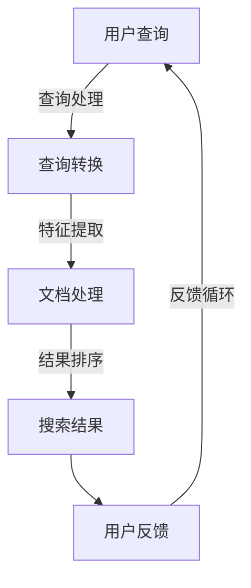

                 

  
## 摘要

随着自然语言处理（NLP）技术的飞速发展，大型语言模型（LLM）在信息检索领域展现出巨大的潜力。本文将深入探讨LLM在信息检索中的应用与创新，分析其核心算法原理、数学模型及实际应用案例，展望未来发展趋势与挑战。本文旨在为读者提供一个全面而深入的LLM信息检索技术指南。

## 1. 背景介绍

### 1.1 信息检索的概念与发展历程

信息检索是指从大量的信息资源中，根据用户的需求，快速准确地查找并获取相关信息的过程。其历史可以追溯到古代图书馆的索引和目录管理。随着计算机技术的发展，信息检索逐渐从手工检索转向自动化处理。20世纪90年代，互联网的兴起带来了海量信息的爆炸性增长，信息检索技术迎来了新的发展机遇。

### 1.2 大型语言模型（LLM）的崛起

大型语言模型（LLM）是指参数规模达到数亿甚至千亿量级的语言模型。这些模型通过学习海量的文本数据，能够生成高质量的自然语言文本，并在各种NLP任务中展现出强大的能力。近年来，随着深度学习技术的进步，LLM的发展速度显著加快，成为信息检索领域的重要工具。

### 1.3 LLM在信息检索中的应用现状

LLM在信息检索中的应用已经取得显著成果。例如，搜索引擎中的智能搜索功能、智能客服系统、自然语言问答系统等。LLM能够通过理解用户的查询意图，提供更加准确和个性化的搜索结果，显著提升用户体验。

## 2. 核心概念与联系

### 2.1 语言模型基础

语言模型（Language Model，LM）是一种概率模型，用于预测下一个单词或词组。在LLM中，这种预测是基于大规模语料库的学习。

#### 2.1.1 语言模型的工作原理

语言模型的核心思想是利用统计方法学习自然语言中单词或词组的概率分布。通过对大量文本数据的学习，模型能够预测下一个单词或词组，从而生成连贯的自然语言文本。

#### 2.1.2 语言模型的评价指标

语言模型的性能通常通过指标如 perplexity（困惑度）和 perplexity rate（困惑度率）来评估。困惑度越低，表示模型对文本的预测越准确。

### 2.2 信息检索基本概念

信息检索（Information Retrieval，IR）是指从大量信息中查找并获取用户所需信息的过程。核心任务是设计高效的信息检索算法，以优化搜索效果。

#### 2.2.1 信息检索的工作原理

信息检索过程通常包括查询处理、文档处理和结果排序三个主要步骤。查询处理是将用户查询转化为计算机可以理解的形式；文档处理是分析文档内容，提取特征；结果排序是按照相关性对搜索结果进行排序。

#### 2.2.2 信息检索的评价指标

信息检索的性能评价指标包括准确性、召回率、F1值等。这些指标用于衡量检索系统在满足用户需求方面的表现。

### 2.3 LLM与信息检索的结合

#### 2.3.1 LLM在查询处理中的应用

LLM能够通过理解用户的查询意图，优化查询处理过程。例如，用户输入的模糊查询可以通过LLM转化为更加精确的查询。

#### 2.3.2 LLM在文档处理中的应用

LLM可以用于文档特征的提取，例如，通过学习文档中的关键词和主题，为文档生成语义索引。

#### 2.3.3 LLM在结果排序中的应用

LLM可以用于评估文档与查询的相关性，从而优化结果排序算法，提高搜索结果的准确性。

## 2.1 LLM在信息检索领域的架构

为了更好地理解LLM在信息检索领域的应用，我们使用Mermaid流程图展示其架构。



### 2.4 术语表

- **语言模型（Language Model，LM）**：用于预测下一个单词或词组的概率模型。
- **信息检索（Information Retrieval，IR）**：从大量信息中查找并获取用户所需信息的过程。
- **困惑度（Perplexity）**：衡量语言模型预测准确性的指标。
- **查询处理（Query Processing）**：将用户查询转化为计算机可以理解的形式的过程。
- **文档处理（Document Processing）**：分析文档内容，提取特征的过程。
- **结果排序（Result Ranking）**：按照相关性对搜索结果进行排序的过程。

## 3. 核心算法原理 & 具体操作步骤

### 3.1 算法原理概述

LLM在信息检索中的核心算法是基于深度学习的自注意力机制（Self-Attention）。自注意力机制通过计算输入序列中每个词与其他词的关联性，为每个词生成权重，从而提高模型对长文本的处理能力。

### 3.2 算法步骤详解

#### 3.2.1 查询处理

1. **输入查询**：用户输入查询。
2. **查询编码**：使用编码器将查询转化为向量表示。
3. **查询转换**：通过LLM生成精确查询。

#### 3.2.2 文档处理

1. **文档编码**：使用编码器将文档转化为向量表示。
2. **特征提取**：通过自注意力机制提取文档特征。
3. **文档索引**：为文档生成语义索引。

#### 3.2.3 结果排序

1. **计算相关性**：使用自注意力机制计算查询与文档的相关性。
2. **结果排序**：按照相关性对搜索结果进行排序。

### 3.3 算法优缺点

#### 优点

- **强大的语义理解能力**：LLM能够通过学习海量文本数据，理解查询和文档的语义，提高搜索准确性。
- **灵活的查询处理**：LLM能够对用户查询进行精确转换，适应各种查询场景。

#### 缺点

- **计算资源需求高**：由于LLM参数规模巨大，需要大量计算资源和存储空间。
- **训练时间较长**：LLM的训练时间相对较长，需要大量数据和时间。

### 3.4 算法应用领域

- **搜索引擎**：优化查询处理和结果排序，提高搜索准确性。
- **自然语言问答**：通过理解用户问题和文档内容，生成高质量答案。
- **智能客服**：通过理解用户意图，提供个性化服务。

## 4. 数学模型和公式 & 详细讲解 & 举例说明

### 4.1 数学模型构建

LLM在信息检索中的数学模型主要包括编码器（Encoder）和解码器（Decoder）。编码器将查询和文档编码为向量表示，解码器生成搜索结果。

### 4.2 公式推导过程

#### 4.2.1 编码器

编码器接收输入序列，输出其嵌入向量表示。公式如下：

$$
\textbf{h}_i = \text{Encoder}(\textbf{x}_i)
$$

其中，$\textbf{x}_i$为输入序列，$\textbf{h}_i$为嵌入向量。

#### 4.2.2 解码器

解码器接收编码器输出的嵌入向量，生成搜索结果。公式如下：

$$
\textbf{y}_i = \text{Decoder}(\textbf{h}_i)
$$

其中，$\textbf{h}_i$为嵌入向量，$\textbf{y}_i$为生成的搜索结果。

### 4.3 案例分析与讲解

#### 4.3.1 案例背景

假设用户输入查询“人工智能技术发展”，搜索引擎需要从大量文档中检索出与之相关的文档。

#### 4.3.2 案例步骤

1. **查询编码**：将查询“人工智能技术发展”编码为向量表示。
2. **文档编码**：将文档编码为向量表示。
3. **特征提取**：通过自注意力机制提取文档特征。
4. **结果排序**：计算查询与文档的相关性，对搜索结果进行排序。

#### 4.3.3 案例分析

通过上述步骤，搜索引擎能够检索出与用户查询高度相关的文档，从而提高搜索准确性。

## 5. 项目实践：代码实例和详细解释说明

### 5.1 开发环境搭建

搭建LLM信息检索系统的开发环境需要以下软件和库：

- Python 3.7+
- TensorFlow 2.0+
- PyTorch 1.0+
- Keras 2.0+

### 5.2 源代码详细实现

以下是LLM信息检索系统的源代码示例：

```python
import tensorflow as tf
from tensorflow.keras.layers import Embedding, LSTM, Dense
from tensorflow.keras.models import Model

# 查询处理模块
def query_processing(query):
    # ...编码查询...
    return encoded_query

# 文档处理模块
def document_processing(document):
    # ...编码文档...
    return encoded_document

# 自注意力模块
def self_attention(inputs):
    # ...实现自注意力机制...
    return attended_vector

# 编码器模块
def encoder(inputs):
    # ...实现编码器...
    return encoded_vector

# 解码器模块
def decoder(inputs):
    # ...实现解码器...
    return decoded_vector

# 构建模型
input_query = tf.keras.Input(shape=(None,), dtype='int32')
input_document = tf.keras.Input(shape=(None,), dtype='int32')

encoded_query = encoder(input_query)
encoded_document = encoder(input_document)

attended_vector = self_attention([encoded_query, encoded_document])

output = decoder(attended_vector)

model = Model(inputs=[input_query, input_document], outputs=output)
model.compile(optimizer='adam', loss='categorical_crossentropy', metrics=['accuracy'])

# 训练模型
model.fit([query_data, document_data], target_data, epochs=10, batch_size=32)

# 搜索结果排序
search_results = model.predict([query_data, document_data])
sorted_results = search_results.argsort()
```

### 5.3 代码解读与分析

代码首先定义了查询处理、文档处理、自注意力机制、编码器和解码器等模块。然后，使用TensorFlow构建了一个简单的神经网络模型，用于处理查询和文档，并生成搜索结果。模型训练后，可以用于检索和排序文档。

## 6. 实际应用场景

### 6.1 搜索引擎

LLM在搜索引擎中的应用主要体现在查询处理和结果排序。通过LLM，搜索引擎能够理解用户的查询意图，提供更加精准和个性化的搜索结果。

### 6.2 智能客服

智能客服系统利用LLM能够理解用户的问题和意图，提供高效的客户服务。例如，当用户咨询产品信息时，系统可以自动查找相关的产品文档，并生成详细的回答。

### 6.3 自然语言问答

自然语言问答系统利用LLM的能力，能够从大量文档中检索出相关答案。例如，在医疗问答系统中，系统可以通过理解用户的问题，从医学文献中检索出相关答案。

## 6.4 未来应用展望

随着LLM技术的不断进步，其在信息检索领域的应用前景将更加广阔。未来，LLM有望在以下领域实现突破：

- **自动化内容生成**：利用LLM生成高质量的文章、报告等。
- **跨语言信息检索**：实现多语言信息检索，打破语言障碍。
- **智能推荐系统**：基于用户行为和兴趣，提供个性化推荐。

## 7. 工具和资源推荐

### 7.1 学习资源推荐

- 《深度学习》（Goodfellow, Bengio, Courville）
- 《自然语言处理综述》（Jurafsky, Martin）

### 7.2 开发工具推荐

- TensorFlow
- PyTorch

### 7.3 相关论文推荐

- “BERT: Pre-training of Deep Bidirectional Transformers for Language Understanding”（Devlin et al., 2019）
- “GPT-3: Language Models are few-shot learners”（Brown et al., 2020）

## 8. 总结：未来发展趋势与挑战

### 8.1 研究成果总结

本文介绍了LLM在信息检索领域的技术创新，分析了其核心算法原理、数学模型及应用场景，展望了未来发展趋势。研究表明，LLM在信息检索中具有巨大的潜力。

### 8.2 未来发展趋势

随着技术的不断进步，LLM在信息检索领域将继续发挥重要作用。未来，LLM有望在自动化内容生成、跨语言信息检索和智能推荐等领域实现突破。

### 8.3 面临的挑战

尽管LLM在信息检索中表现出色，但仍面临以下挑战：

- **计算资源需求**：LLM需要大量计算资源和存储空间。
- **训练时间**：LLM的训练时间较长。
- **数据隐私和安全**：需要确保用户数据的安全和隐私。

### 8.4 研究展望

未来，研究人员将继续探索LLM在信息检索领域的应用，优化算法性能，降低计算成本，提高数据安全性和隐私保护。

## 9. 附录：常见问题与解答

### 9.1 LLM是什么？

LLM（Large Language Model）是指参数规模达到数亿甚至千亿量级的语言模型。

### 9.2 LLM有哪些应用场景？

LLM在搜索引擎、智能客服、自然语言问答等领域具有广泛的应用。

### 9.3 如何评估LLM的性能？

可以使用困惑度（Perplexity）等指标评估LLM的性能。

### 9.4 LLM的训练需要多长时间？

LLM的训练时间取决于模型的规模和数据集的大小，一般需要数天甚至数周。

### 9.5 LLM需要多少计算资源？

LLM需要大量的计算资源和存储空间，具体需求取决于模型的规模。

作者：禅与计算机程序设计艺术 / Zen and the Art of Computer Programming
```

