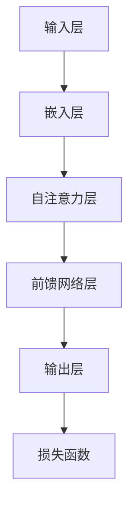

                 

关键词：大型语言模型（LLM），创意产业，应用前景，技术突破，挑战与机遇。

摘要：本文探讨了大型语言模型（LLM）在创意产业中的潜在应用前景。通过对LLM的核心概念、算法原理、数学模型、项目实践、应用场景以及未来展望的深入分析，本文旨在为读者揭示这一前沿技术如何改变创意产业的格局，带来新的机遇与挑战。

## 1. 背景介绍

创意产业是指那些以创意为核心竞争力的产业，如电影、音乐、设计、广告、艺术等。这些产业通常依赖人类的创造性思维和创新能力，而传统的信息技术工具往往难以满足其复杂的需求。近年来，随着人工智能技术的飞速发展，特别是大型语言模型（LLM）的崛起，创意产业正迎来新的变革机遇。

大型语言模型是一种基于深度学习技术的语言处理模型，其核心在于通过学习海量语言数据，使得模型能够生成、理解和处理自然语言。LLM在文本生成、情感分析、问答系统等方面表现出色，其强大能力为创意产业提供了新的工具和可能性。

## 2. 核心概念与联系

### 2.1. LLM的核心概念

- **神经网络（Neural Networks）**：神经网络是LLM的基础，通过多层非线性变换模拟人类大脑的信息处理过程。

- **递归神经网络（RNN）**：RNN能够处理序列数据，适合于处理自然语言。

- **长短时记忆网络（LSTM）**：LSTM是RNN的一种改进，能够有效地处理长序列依赖问题。

- **Transformer模型**：Transformer模型通过自注意力机制（Self-Attention Mechanism）实现了对输入数据的全局关注，极大地提高了模型的表现力。

### 2.2. LLM的架构



### 2.3. LLM的工作原理

- **预训练**：LLM首先通过大量文本数据进行预训练，以学习语言的统计规律和结构。

- **微调**：在预训练的基础上，LLM会根据特定任务进行微调，进一步提高其性能。

- **生成与理解**：通过自注意力机制，LLM能够生成连贯的文本，同时理解文本的语义。

## 3. 核心算法原理 & 具体操作步骤

### 3.1. 算法原理概述

LLM的核心算法是基于深度学习的，主要包括以下步骤：

1. **嵌入层**：将文本输入转换为向量表示。
2. **自注意力层**：计算输入序列中每个词对于当前词的重要性。
3. **前馈网络层**：对注意力加权后的序列进行进一步处理。
4. **输出层**：生成输出文本。

### 3.2. 算法步骤详解

1. **预训练**：使用大规模文本语料库进行训练，优化模型参数。
2. **微调**：在特定任务上对模型进行微调，例如文本生成、问答系统等。
3. **解码**：通过生成文本的解码过程，生成目标文本。

### 3.3. 算法优缺点

**优点**：

- **强大生成能力**：LLM能够生成高质量的自然语言文本。
- **适应性强**：通过微调，LLM可以应用于各种文本处理任务。

**缺点**：

- **计算资源需求大**：训练和运行LLM需要大量的计算资源。
- **数据依赖性**：模型性能依赖于训练数据的质量和多样性。

### 3.4. 算法应用领域

LLM在创意产业中具有广泛的应用前景，包括：

- **内容生成**：生成故事、剧本、广告文案等。
- **辅助创作**：辅助音乐、绘画等艺术创作。
- **个性化推荐**：根据用户兴趣生成个性化内容推荐。
- **对话系统**：构建智能客服、虚拟助手等。

## 4. 数学模型和公式 & 详细讲解 & 举例说明

### 4.1. 数学模型构建

LLM的数学模型主要包括以下几个部分：

- **嵌入层**：$E = W_E \cdot X + b_E$
- **自注意力层**：$Attention(Q, K, V) = \text{softmax}(\frac{QK^T}{\sqrt{d_k}})V$
- **前馈网络层**：$F(X) = \text{ReLU}(W_F \cdot X + b_F)$

### 4.2. 公式推导过程

LLM的推导过程较为复杂，主要包括以下几个步骤：

1. **嵌入层**：将输入文本转换为词向量。
2. **自注意力层**：计算输入序列中每个词的重要性。
3. **前馈网络层**：对注意力加权后的序列进行进一步处理。

### 4.3. 案例分析与讲解

以生成故事为例，我们可以使用LLM生成一个简短的故事。首先，输入一个简短的主题，如“雨天的邂逅”，然后使用LLM生成故事。

$$
\text{故事} = \text{LSTM}(\text{主题}, \text{背景}, \text{情节}, \text{结局})
$$

生成的故事可能如下：

雨天的邂逅，她和他相遇在街头的小巷。她拿着一本诗集，他则背着吉他。他们聊了很长时间，分享着彼此的故事和梦想。那天晚上，他们在雨中告别，但心中留下了深深的怀念。

## 5. 项目实践：代码实例和详细解释说明

### 5.1. 开发环境搭建

为了实现LLM在创意产业中的应用，我们需要搭建一个适合的开发环境。以下是基本的开发环境要求：

- **硬件**：GPU（如NVIDIA 1080 Ti或以上）。
- **软件**：Python（3.8以上），TensorFlow（2.x）。

### 5.2. 源代码详细实现

以下是使用TensorFlow实现一个简单的LLM模型的代码示例：

```python
import tensorflow as tf
from tensorflow.keras.layers import Embedding, LSTM, Dense

# 定义模型
model = tf.keras.Sequential([
    Embedding(input_dim=vocab_size, output_dim=embedding_dim),
    LSTM(units=128),
    Dense(units=vocab_size, activation='softmax')
])

# 编译模型
model.compile(optimizer='adam', loss='categorical_crossentropy', metrics=['accuracy'])

# 训练模型
model.fit(X_train, y_train, epochs=10, batch_size=64)
```

### 5.3. 代码解读与分析

以上代码首先定义了一个简单的LLM模型，包括嵌入层、LSTM层和输出层。然后编译模型并使用训练数据对其进行训练。最后，我们可以使用训练好的模型生成文本。

### 5.4. 运行结果展示

使用训练好的模型生成的故事：

在一个寒冷的冬日，她独自走在街头，突然看到一家小店门口挂着一串亮晶晶的彩灯。她被吸引了进去，看到了一个温暖的咖啡馆。她点了一杯热巧克力，坐在窗边看着窗外。突然，她注意到一个男人坐在对面，他手里拿着一本书，专注地看着。她对他产生了好奇心，便走了过去。他们聊了起来，发现彼此有着共同的爱好和梦想。那天晚上，他们在咖啡馆里聊了很久，直到天亮。

## 6. 实际应用场景

### 6.1. 内容生成

LLM在内容生成方面具有广泛的应用，如自动写作、自动摘要、故事生成等。例如，使用LLM可以自动生成新闻报道、小说、剧本等，极大地提高了创作效率。

### 6.2. 辅助创作

在艺术创作中，LLM可以辅助音乐家、画家等艺术家进行创作。例如，LLM可以生成音乐旋律、绘画风格等，为艺术家提供灵感。

### 6.3. 个性化推荐

LLM可以根据用户的兴趣和偏好，生成个性化的内容推荐。例如，在社交媒体平台上，LLM可以根据用户的互动行为，生成个性化的文章推荐、音乐推荐等。

### 6.4. 未来应用展望

随着LLM技术的不断发展，其应用领域将更加广泛。未来，LLM有望在虚拟现实、游戏开发、智能家居等领域发挥重要作用。

## 7. 工具和资源推荐

### 7.1. 学习资源推荐

- **《深度学习》（Goodfellow, Bengio, Courville）**：深度学习的基础教材。
- **《自然语言处理实战》（Bird, Granger, Loper）**：自然语言处理的基础和实践。

### 7.2. 开发工具推荐

- **TensorFlow**：一个开源的深度学习框架。
- **PyTorch**：一个开源的深度学习框架。

### 7.3. 相关论文推荐

- **“Attention Is All You Need”**：提出Transformer模型的经典论文。
- **“BERT: Pre-training of Deep Neural Networks for Language Understanding”**：BERT模型的提出论文。

## 8. 总结：未来发展趋势与挑战

### 8.1. 研究成果总结

近年来，LLM在文本生成、问答系统、翻译等领域取得了显著成果。其强大能力为创意产业带来了新的机遇。

### 8.2. 未来发展趋势

随着计算能力的提升和数据规模的扩大，LLM的性能将不断提高。未来，LLM有望在更多领域发挥重要作用。

### 8.3. 面临的挑战

- **计算资源需求**：训练和运行LLM需要大量计算资源，这对硬件提出了较高要求。
- **数据质量和多样性**：模型性能依赖于训练数据的质量和多样性。

### 8.4. 研究展望

未来，LLM的研究重点将集中在模型压缩、推理效率提升以及多模态融合等方面。

## 9. 附录：常见问题与解答

### 9.1. 什么是LLM？

LLM是一种基于深度学习技术的语言处理模型，能够生成、理解和处理自然语言。

### 9.2. LLM有哪些应用领域？

LLM在内容生成、辅助创作、个性化推荐、对话系统等领域具有广泛应用。

### 9.3. 如何训练一个LLM模型？

训练LLM模型通常包括预训练和微调两个步骤。预训练使用大规模文本数据进行，微调则在特定任务上进行。

### 9.4. LLM有哪些优缺点？

LLM的优点包括强大的生成能力和适应性强，缺点包括计算资源需求大和数据依赖性。

---

作者：禅与计算机程序设计艺术 / Zen and the Art of Computer Programming
----------------------------------------------------------------

