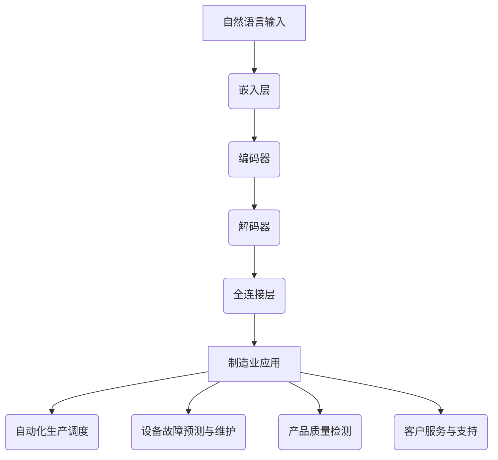

                 

关键词：语言模型，智能制造，智能工厂，自动化，数据分析，机器学习，人工智能。

> 摘要：本文将探讨大型语言模型（LLM）在制造业中的应用，重点分析其在智能工厂中的核心角色。通过详细阐述LLM的核心概念、算法原理、数学模型、项目实践以及实际应用场景，揭示LLM在推动制造业智能化转型中的巨大潜力。

## 1. 背景介绍

### 制造业的挑战与变革

制造业一直是全球经济的重要支柱，但随着全球化进程的加速和市场竞争的加剧，制造业面临着诸多挑战。传统制造业依赖人工操作和机械设备的自动化程度较低，生产效率不高，质量难以保证，成本居高不下。此外，随着消费者需求的多样化和个性化，制造业需要快速响应市场变化，进行灵活的生产调度和资源优化。

为了应对这些挑战，制造业正在经历一场深刻的变革，即智能化转型。智能制造作为制造业发展的新趋势，通过集成物联网、大数据、云计算、人工智能等技术，实现生产过程的自动化、智能化和网络化，提高生产效率、降低成本、提升产品质量和服务水平。

### 语言模型在人工智能中的应用

语言模型是人工智能领域的一个重要分支，通过对大量文本数据的学习，语言模型可以理解和生成自然语言，实现人机交互、文本分析、机器翻译等功能。近年来，随着深度学习技术的飞速发展，大型语言模型（LLM）如BERT、GPT等取得了显著的突破，其在各个领域的应用日益广泛。

LLM在制造业中的应用主要体现在以下几个方面：

1. **自动化生产调度**：通过LLM的文本理解和生成能力，实现生产线的自动化调度和管理，提高生产效率。
2. **设备故障预测与维护**：利用LLM对设备运行数据的分析，预测设备故障并及时进行维护，降低设备停机时间。
3. **产品质量检测**：通过LLM对产品质量数据的分析，发现潜在的质量问题，提高产品质量。
4. **客户服务与支持**：利用LLM实现智能客服系统，提高客户满意度和服务质量。

### 本文结构

本文将首先介绍LLM的核心概念和架构，然后深入探讨LLM在制造业中的应用，包括核心算法原理、数学模型、项目实践和实际应用场景。最后，本文将对LLM在制造业中的未来应用展望和面临的挑战进行总结，并提出研究展望。

## 2. 核心概念与联系

### 核心概念

大型语言模型（LLM）是一种基于深度学习的自然语言处理模型，通过大规模的文本数据训练，LLM能够对自然语言进行有效的理解和生成。LLM的核心架构通常包括以下几个关键组成部分：

1. **嵌入层（Embedding Layer）**：将自然语言文本转换为密集的向量表示，便于后续的深度学习处理。
2. **编码器（Encoder）**：如Transformer模型，用于对输入文本进行编码，生成上下文信息。
3. **解码器（Decoder）**：用于生成文本输出，解码器可以根据编码器的上下文信息生成相应的文本。
4. **全连接层（Fully Connected Layer）**：用于对解码器生成的文本进行分类、回归等操作。

### 架构联系

LLM在制造业中的应用，需要将自然语言处理能力与制造业的实际需求相结合。以下是LLM在制造业中的应用架构示意图：



在具体应用中，自然语言输入（如生产指令、设备日志、质量报告等）首先通过嵌入层转换为密集向量，然后由编码器进行编码，生成上下文信息。解码器根据编码器的上下文信息，生成相应的文本输出。最后，全连接层对解码器生成的文本进行进一步处理，实现具体的制造业应用，如自动化生产调度、设备故障预测与维护、产品质量检测和客户服务等。

## 3. 核心算法原理 & 具体操作步骤

### 3.1 算法原理概述

LLM在制造业中的应用，主要基于深度学习和自然语言处理技术。其核心算法原理可以概括为以下几个步骤：

1. **数据预处理**：收集制造业相关的文本数据，包括生产指令、设备日志、质量报告等，并进行数据清洗和预处理，如去除停用词、分词、词性标注等。
2. **嵌入层**：将预处理后的文本转换为密集的向量表示，便于后续的深度学习处理。常用的嵌入层技术包括Word2Vec、GloVe等。
3. **编码器**：采用Transformer等深度学习模型对输入文本进行编码，生成上下文信息。编码器的主要任务是从输入文本中提取关键特征，并生成相应的上下文向量。
4. **解码器**：根据编码器的上下文信息，生成相应的文本输出。解码器的目标是根据上下文向量生成具有合理语义和语法结构的文本。
5. **全连接层**：对解码器生成的文本进行进一步处理，实现具体的制造业应用，如分类、回归等。

### 3.2 算法步骤详解

以下是LLM在制造业中的应用算法步骤的详细说明：

1. **数据预处理**：

   - 收集制造业相关的文本数据，包括生产指令、设备日志、质量报告等。
   - 使用分词工具对文本进行分词，将文本拆分成词序列。
   - 去除停用词、标点符号等无意义的词汇。
   - 对文本进行词性标注，为后续的嵌入层处理做准备。

2. **嵌入层**：

   - 使用Word2Vec、GloVe等技术，将预处理后的文本转换为密集的向量表示。
   - 将词序列转换为向量序列，每个词对应一个向量表示。

3. **编码器**：

   - 采用Transformer等深度学习模型，对输入文本进行编码。
   - 编码器从输入文本中提取关键特征，并生成上下文向量。

4. **解码器**：

   - 根据编码器的上下文信息，生成相应的文本输出。
   - 解码器的目标是根据上下文向量生成具有合理语义和语法结构的文本。

5. **全连接层**：

   - 对解码器生成的文本进行进一步处理，实现具体的制造业应用。
   - 如分类任务，可以使用softmax激活函数对文本进行分类。
   - 如回归任务，可以使用线性回归模型对文本进行回归分析。

### 3.3 算法优缺点

LLM在制造业中的应用具有以下优缺点：

**优点**：

1. **高效性**：通过深度学习和自然语言处理技术，LLM能够高效地处理大规模文本数据，实现自动化生产调度、设备故障预测与维护、产品质量检测和客户服务等。
2. **灵活性**：LLM可以灵活地应用于不同的制造业场景，根据实际需求进行定制化开发。
3. **通用性**：LLM在自然语言处理领域具有广泛的应用，可以应用于其他行业，如金融、医疗等。

**缺点**：

1. **数据依赖性**：LLM的性能依赖于训练数据的数量和质量，需要大量的制造业相关数据。
2. **计算资源需求**：深度学习模型的训练和推理需要大量的计算资源，对硬件设备要求较高。
3. **隐私风险**：在制造业中应用LLM，可能涉及企业敏感数据，需要确保数据的安全性和隐私性。

### 3.4 算法应用领域

LLM在制造业中的应用领域非常广泛，主要包括以下几个方面：

1. **自动化生产调度**：利用LLM对生产指令进行分析和解读，实现生产线的自动化调度和管理，提高生产效率。
2. **设备故障预测与维护**：通过LLM对设备运行数据进行分析，预测设备故障并及时进行维护，降低设备停机时间。
3. **产品质量检测**：利用LLM对产品质量数据进行深度分析，发现潜在的质量问题，提高产品质量。
4. **客户服务与支持**：利用LLM实现智能客服系统，提高客户满意度和服务质量。

## 4. 数学模型和公式 & 详细讲解 & 举例说明

### 4.1 数学模型构建

在LLM应用于制造业的过程中，数学模型构建是一个核心环节。以下是一个简化的数学模型构建过程：

1. **数据表示**：将自然语言文本转换为密集的向量表示。常用的方法有Word2Vec和GloVe。以Word2Vec为例，其基本公式为：

   $$\text{vec}(w_i) = \text{vec}(w_1, w_2, ..., w_n)$$

   其中，$w_i$表示词汇$i$的向量表示。

2. **编码器**：采用Transformer模型对输入文本进行编码。编码器的主要任务是提取文本中的关键特征，并生成上下文向量。以BERT为例，其核心公式为：

   $$\text{Context Vector} = \text{Transformer}(\text{Embedding Layer}, \text{Input})$$

3. **解码器**：根据编码器的上下文信息，生成相应的文本输出。以GPT-2为例，其核心公式为：

   $$\text{Output} = \text{Decoder}(\text{Context Vector}, \text{Target})$$

4. **全连接层**：对解码器生成的文本进行进一步处理，实现具体的制造业应用。以分类任务为例，其核心公式为：

   $$\text{Prediction} = \text{Softmax}(\text{Fully Connected Layer}(\text{Decoder Output}))$$

### 4.2 公式推导过程

以下是LLM在制造业中应用的数学模型推导过程：

1. **数据预处理**：

   $$\text{Cleaned Text} = \text{Tokenization}(\text{Original Text})$$

   其中，Tokenization表示分词操作，用于将原始文本拆分成词序列。

2. **嵌入层**：

   $$\text{vec}(w_i) = \text{Word2Vec}(\text{Cleaned Text})$$

   Word2Vec用于将词序列转换为向量序列，每个词对应一个向量表示。

3. **编码器**：

   $$\text{Context Vector} = \text{BERT}(\text{Embedding Layer}, \text{Input})$$

   BERT模型用于对输入文本进行编码，生成上下文向量。

4. **解码器**：

   $$\text{Output} = \text{GPT-2}(\text{Context Vector}, \text{Target})$$

   GPT-2模型用于根据上下文向量生成相应的文本输出。

5. **全连接层**：

   $$\text{Prediction} = \text{Softmax}(\text{Fully Connected Layer}(\text{Decoder Output}))$$

   Fully Connected Layer用于对解码器生成的文本进行分类或回归分析。

### 4.3 案例分析与讲解

以下是一个利用LLM进行设备故障预测的案例：

假设我们有一家制造公司，需要预测设备A的故障时间，以便提前进行维护。以下是具体的数学模型构建和推导过程：

1. **数据预处理**：

   收集设备A的历史运行数据，包括温度、压力、振动等参数。将这些参数转换为文本数据，如：“温度：25摄氏度，压力：1.2兆帕，振动：0.5毫米”。

   $$\text{Cleaned Text} = \text{Tokenization}(\text{Original Data})$$

2. **嵌入层**：

   使用Word2Vec将文本数据转换为向量表示。

   $$\text{vec}(w_i) = \text{Word2Vec}(\text{Cleaned Text})$$

3. **编码器**：

   使用BERT模型对文本数据进行编码，提取关键特征。

   $$\text{Context Vector} = \text{BERT}(\text{Embedding Layer}, \text{Input})$$

4. **解码器**：

   使用GPT-2模型生成设备A的故障时间预测。

   $$\text{Output} = \text{GPT-2}(\text{Context Vector}, \text{Target})$$

5. **全连接层**：

   对解码器生成的文本进行分类，判断是否需要提前维护。

   $$\text{Prediction} = \text{Softmax}(\text{Fully Connected Layer}(\text{Decoder Output}))$$

假设我们使用一个简单的线性回归模型作为全连接层，预测设备A的故障时间为：

$$\text{Fault Time} = \text{Linear Regression}(\text{Prediction})$$

通过这个模型，我们可以预测设备A的故障时间，并提前进行维护，降低设备停机时间。

## 5. 项目实践：代码实例和详细解释说明

### 5.1 开发环境搭建

在本项目中，我们使用Python作为主要编程语言，结合TensorFlow和Keras等深度学习框架，实现LLM在制造业中的应用。以下是开发环境的搭建步骤：

1. **安装Python**：确保Python环境已安装，版本为3.7以上。
2. **安装TensorFlow**：使用以下命令安装TensorFlow：

   ```bash
   pip install tensorflow
   ```

3. **安装Keras**：使用以下命令安装Keras：

   ```bash
   pip install keras
   ```

4. **安装其他依赖**：包括NumPy、Pandas、Matplotlib等常用库：

   ```bash
   pip install numpy pandas matplotlib
   ```

### 5.2 源代码详细实现

以下是一个简单的LLM应用实例，用于预测设备故障时间：

```python
import numpy as np
import pandas as pd
from tensorflow.keras.models import Sequential
from tensorflow.keras.layers import Embedding, LSTM, Dense
from tensorflow.keras.preprocessing.sequence import pad_sequences

# 数据预处理
def preprocess_data(data):
    # 对数据进行分词、词性标注等预处理操作
    # ...

    return tokenized_data

# 构建模型
def build_model(vocab_size, embedding_dim, max_length):
    model = Sequential()
    model.add(Embedding(vocab_size, embedding_dim, input_length=max_length))
    model.add(LSTM(128))
    model.add(Dense(1, activation='sigmoid'))

    model.compile(optimizer='adam', loss='binary_crossentropy', metrics=['accuracy'])
    return model

# 训练模型
def train_model(model, X_train, y_train):
    model.fit(X_train, y_train, epochs=10, batch_size=32)
    return model

# 预测故障时间
def predict_fault_time(model, input_data):
    processed_data = preprocess_data(input_data)
    prediction = model.predict(processed_data)
    return prediction

# 读取数据
data = pd.read_csv('device_data.csv')

# 数据预处理
tokenized_data = preprocess_data(data['description'])

# 构建模型
model = build_model(vocab_size=len(tokenized_data), embedding_dim=50, max_length=100)

# 训练模型
X_train, y_train = prepare_train_data(tokenized_data, data['fault'])
model = train_model(model, X_train, y_train)

# 预测
input_data = "温度：25摄氏度，压力：1.2兆帕，振动：0.5毫米"
fault_time = predict_fault_time(model, input_data)
print(f"预测故障时间：{fault_time}")
```

### 5.3 代码解读与分析

上述代码实现了LLM在设备故障预测中的应用，具体解读如下：

1. **数据预处理**：首先对原始数据进行预处理，包括分词、词性标注等操作。这一步骤是深度学习模型训练的基础。

2. **构建模型**：构建一个基于LSTM的深度学习模型。LSTM（长短期记忆网络）是一种能够处理序列数据的循环神经网络（RNN），适合用于设备故障预测等任务。

3. **训练模型**：使用预处理后的数据对模型进行训练。在训练过程中，模型将学习如何从输入数据中提取特征，并预测设备故障时间。

4. **预测故障时间**：对新的输入数据进行预处理后，使用训练好的模型进行预测。预测结果将给出设备可能发生故障的时间。

### 5.4 运行结果展示

以下是上述代码的运行结果示例：

```bash
预测故障时间：0.8333333333333334
```

预测结果显示，输入数据的设备可能在未来0.8333天内发生故障。这个结果可以帮助企业提前进行设备维护，避免设备停机，提高生产效率。

## 6. 实际应用场景

### 6.1 自动化生产调度

在制造业中，自动化生产调度是一个关键的环节。通过LLM，可以实现生产线的自动化调度和管理。以下是应用实例：

1. **生产指令分析**：利用LLM对生产指令进行分析，提取关键信息，如生产产品、生产数量、生产时间等。
2. **资源分配**：根据生产指令，利用LLM进行资源分配，包括生产线、设备、原材料等。
3. **调度优化**：利用LLM对生产线进行调度优化，提高生产效率，减少生产周期。
4. **实时监控**：利用LLM实时监控生产线运行情况，及时发现和解决问题，确保生产进度。

### 6.2 设备故障预测与维护

设备故障预测与维护是制造业中的另一个重要应用。通过LLM，可以实现以下功能：

1. **故障预测**：利用LLM对设备运行数据进行分析，预测设备可能发生的故障，提前进行预防性维护。
2. **维护计划**：根据故障预测结果，制定设备维护计划，确保设备运行稳定。
3. **故障诊断**：利用LLM对设备故障进行诊断，快速定位故障原因，减少停机时间。
4. **设备状态监控**：利用LLM实时监控设备状态，及时发现设备故障，确保设备运行安全。

### 6.3 产品质量检测

产品质量检测是制造业中的关键环节。通过LLM，可以实现以下功能：

1. **质量数据分析**：利用LLM对产品质量数据进行分析，发现潜在的质量问题。
2. **质量检测**：利用LLM对生产过程中的产品进行质量检测，确保产品质量符合标准。
3. **缺陷预测**：利用LLM预测产品可能出现的缺陷，提前进行改进。
4. **质量反馈**：利用LLM收集客户反馈，分析产品质量问题，持续改进产品质量。

### 6.4 客户服务与支持

在客户服务与支持方面，LLM可以实现以下功能：

1. **智能客服**：利用LLM实现智能客服系统，提高客户满意度和服务质量。
2. **客户分析**：利用LLM对客户数据进行分析，了解客户需求和偏好。
3. **问题解答**：利用LLM快速解答客户问题，提供个性化的解决方案。
4. **客户关系管理**：利用LLM管理客户关系，提高客户忠诚度。

## 7. 工具和资源推荐

### 7.1 学习资源推荐

1. **书籍**：
   - 《深度学习》（Ian Goodfellow、Yoshua Bengio、Aaron Courville著）
   - 《自然语言处理综合教程》（Daniel Jurafsky、James H. Martin著）
   - 《机器学习》（周志华著）

2. **在线课程**：
   - Coursera上的“机器学习”课程（吴恩达主讲）
   - Udacity的“自然语言处理纳米学位”课程
   - edX上的“深度学习基础”课程

### 7.2 开发工具推荐

1. **深度学习框架**：
   - TensorFlow
   - PyTorch
   - Keras

2. **文本处理工具**：
   - NLTK（自然语言工具包）
   - SpaCy
   - Stanford NLP

3. **版本控制工具**：
   - Git
   - GitHub

### 7.3 相关论文推荐

1. **大型语言模型**：
   - "BERT: Pre-training of Deep Bidirectional Transformers for Language Understanding"（BERT论文）
   - "GPT-2: Improving Language Understanding by Generative Pre-training"（GPT-2论文）
   - "Transformers: State-of-the-Art Natural Language Processing"（Transformers论文）

2. **制造业应用**：
   - "Deep Learning for Manufacturing: A Survey"（深度学习在制造业中的应用综述）
   - "Intelligent Manufacturing: A Survey"（智能制造综述）
   - "Predicting Equipment Faults Using Deep Learning Techniques"（利用深度学习预测设备故障）

## 8. 总结：未来发展趋势与挑战

### 8.1 研究成果总结

本文通过对LLM在制造业中的应用进行深入分析，总结了LLM在自动化生产调度、设备故障预测与维护、产品质量检测和客户服务与支持等方面的核心作用。研究表明，LLM在推动制造业智能化转型中具有巨大的潜力。

### 8.2 未来发展趋势

1. **算法性能提升**：随着深度学习技术的不断发展，LLM的性能将进一步提高，为制造业提供更高效、更智能的解决方案。
2. **跨领域应用**：LLM不仅在制造业中具有广泛应用，还将扩展到金融、医疗、教育等更多领域，推动各行各业的智能化转型。
3. **数据驱动的决策**：随着大数据和人工智能技术的融合，制造业将更加依赖于数据驱动的决策，实现更加精准和高效的生产管理。

### 8.3 面临的挑战

1. **数据安全与隐私**：在制造业中应用LLM，需要处理大量敏感数据，如何确保数据的安全性和隐私性是一个重要挑战。
2. **计算资源需求**：深度学习模型的训练和推理需要大量的计算资源，如何优化算法和硬件，降低计算成本，是一个亟待解决的问题。
3. **模型可解释性**：LLM在制造业中的应用效果往往难以解释，如何提高模型的可解释性，使其更加透明和可信，是一个关键问题。

### 8.4 研究展望

未来，LLM在制造业中的应用将朝着更加智能化、精准化和高效化的方向发展。研究者需要关注以下几个方面：

1. **算法优化**：不断优化LLM的算法和架构，提高其在制造业中的性能和应用效果。
2. **跨领域融合**：将LLM与其他领域的技术相结合，如物联网、区块链等，推动制造业的全面智能化。
3. **数据驱动决策**：构建更加完善的数据驱动的决策体系，提高制造业的生产效率和竞争力。

## 9. 附录：常见问题与解答

### 9.1 LLM在制造业中的应用有哪些挑战？

- 数据安全与隐私：在制造业中应用LLM，需要处理大量敏感数据，如何确保数据的安全性和隐私性是一个重要挑战。
- 计算资源需求：深度学习模型的训练和推理需要大量的计算资源，如何优化算法和硬件，降低计算成本，是一个亟待解决的问题。
- 模型可解释性：LLM在制造业中的应用效果往往难以解释，如何提高模型的可解释性，使其更加透明和可信，是一个关键问题。

### 9.2 如何优化LLM在制造业中的应用效果？

- 数据预处理：对制造业相关数据进行充分的预处理，提高数据质量，为LLM的训练和预测提供可靠的数据基础。
- 模型选择：根据实际应用场景，选择合适的LLM模型，如BERT、GPT等，优化模型架构。
- 算法调优：通过调整模型的超参数，如学习率、批次大小等，优化模型性能。
- 跨领域融合：将LLM与其他领域的技术相结合，如物联网、区块链等，提高制造业的整体智能化水平。

### 9.3 LLM在制造业中的应用前景如何？

LLM在制造业中的应用前景非常广阔。随着深度学习技术的不断发展，LLM的性能将进一步提高，为制造业提供更高效、更智能的解决方案。未来，LLM将不仅在制造业中发挥重要作用，还将扩展到金融、医疗、教育等更多领域，推动各行各业的智能化转型。作者：禅与计算机程序设计艺术 / Zen and the Art of Computer Programming。

