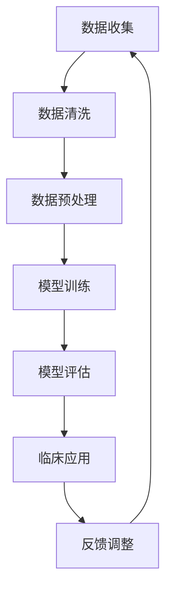

                 

关键词：LLM、医疗诊断、AI辅助、临床决策、深度学习、算法优化、数据分析

摘要：随着人工智能技术的快速发展，深度学习模型特别是大型语言模型（LLM）在医疗领域的应用逐渐广泛。本文将探讨LLM在医疗诊断中的潜力，重点分析其在辅助临床决策方面的作用。通过介绍LLM的基本原理、核心算法及其在实际应用中的案例，文章旨在为医学专家和开发者提供有价值的参考。

## 1. 背景介绍

医疗诊断是现代医学的核心环节，然而传统的诊断方法往往依赖于医生的直觉和经验，这导致诊断结果的不确定性和一致性较差。随着大数据和计算能力的提升，人工智能（AI）在医疗领域的应用逐渐受到重视。特别是深度学习模型，通过自动学习大量的医疗数据，能够在辅助诊断和预测方面发挥重要作用。

近年来，大型语言模型（LLM）的崛起为AI在医疗领域的应用提供了新的契机。LLM，如GPT-3、BERT等，通过学习海量的文本数据，能够理解和生成复杂的语言信息。在医疗领域，LLM不仅可以处理临床记录和文献，还能辅助医生进行病例分析和诊断。这种能力使得LLM在临床决策中的应用具有巨大的潜力。

本文将探讨LLM在医疗诊断中的应用，分析其核心算法原理，并通过具体案例展示其在临床决策中的实际效果。此外，文章还将讨论LLM在医疗诊断中面临的挑战和未来发展方向。

## 2. 核心概念与联系

### 2.1. 大型语言模型（LLM）

大型语言模型（LLM）是一种基于深度学习的自然语言处理模型，具有处理和理解复杂语言信息的能力。LLM通过训练大量的文本数据，学习语言的统计规律和语义结构，从而能够生成和解析自然语言。

### 2.2. 深度学习

深度学习是一种机器学习技术，通过构建多层神经网络模型，自动学习数据的特征表示。深度学习在图像识别、语音识别和自然语言处理等领域取得了显著的成果。

### 2.3. 医疗诊断与临床决策

医疗诊断是医生根据病人的临床表现、实验室检查和影像学结果，对疾病进行识别和分类的过程。临床决策则是在诊断基础上，制定最适合病人的治疗方案。

### 2.4. Mermaid 流程图

以下是LLM在医疗诊断中应用的Mermaid流程图：



## 3. 核心算法原理 & 具体操作步骤

### 3.1. 算法原理概述

LLM的核心算法是基于自注意力机制（Self-Attention）和变换器架构（Transformer）。自注意力机制允许模型在处理每个词时，自动学习不同词之间的相关性。变换器架构则通过多层堆叠，进一步提高了模型的表示能力和效果。

### 3.2. 算法步骤详解

#### 3.2.1. 数据收集

首先，需要收集大量的医疗文本数据，包括病历记录、医学文献、药品说明书等。

#### 3.2.2. 数据清洗

对收集到的医疗文本数据进行清洗，去除噪声和不相关的内容。

#### 3.2.3. 数据预处理

对清洗后的文本数据进行预处理，包括分词、词性标注、句法分析等，将文本数据转换为适合模型训练的格式。

#### 3.2.4. 模型训练

使用预处理后的文本数据训练LLM模型。训练过程中，模型会不断调整权重，以最小化损失函数。

#### 3.2.5. 模型评估

在独立的测试集上评估模型性能，包括准确率、召回率、F1值等指标。

#### 3.2.6. 临床应用

将训练好的LLM模型应用于临床场景，如病例分析、诊断建议等。

#### 3.2.7. 反馈调整

根据临床反馈，调整模型参数，提高模型在特定任务上的性能。

### 3.3. 算法优缺点

#### 优点：

- **强大的语义理解能力**：LLM能够处理和理解复杂的医疗文本，提供更准确的诊断和预测。
- **高效性**：基于深度学习模型的LLM可以在短时间内处理大量数据，提高临床决策的效率。
- **可扩展性**：LLM可以轻松地应用于各种医疗任务，如药物推荐、手术规划等。

#### 缺点：

- **数据依赖性**：LLM的性能高度依赖于训练数据的质量和数量，如果数据质量差或数据量不足，模型性能可能会受到影响。
- **解释性不足**：深度学习模型通常被视为“黑盒”，难以解释其决策过程，这可能限制了其在临床应用中的普及。

### 3.4. 算法应用领域

LLM在医疗诊断中的主要应用领域包括：

- **疾病诊断**：辅助医生进行疾病诊断，提高诊断的准确性和一致性。
- **病例分析**：分析病人的病历记录，提供诊断建议和治疗方案。
- **药物推荐**：根据病人的病史和药物过敏信息，推荐合适的药物。
- **患者管理**：监测患者健康状况，提供个性化的健康建议。

## 4. 数学模型和公式 & 详细讲解 & 举例说明

### 4.1. 数学模型构建

LLM的核心是变换器架构，其基本数学模型可以表示为：

$$
\text{Transformer}(X) = \text{Encoder}(X) \rightarrow \text{Decoder}(X)
$$

其中，Encoder和Decoder分别代表编码器和解码器，$X$为输入序列。

### 4.2. 公式推导过程

变换器架构中的自注意力机制可以用以下公式表示：

$$
\text{Attention}(Q, K, V) = \text{softmax}\left(\frac{QK^T}{\sqrt{d_k}}\right)V
$$

其中，$Q$、$K$和$V$分别表示查询向量、键向量和值向量，$d_k$为键向量的维度。

### 4.3. 案例分析与讲解

假设我们有一个包含100个单词的文本序列，我们可以用以下步骤训练LLM模型：

1. **数据预处理**：将文本序列进行分词、词性标注等预处理操作，将文本转换为数字序列。
2. **编码器训练**：使用自注意力机制训练编码器，使其能够学习文本序列的表示。
3. **解码器训练**：使用编码器的输出训练解码器，使其能够生成文本序列。

通过这个案例，我们可以看到LLM模型是如何通过数学模型和算法步骤来处理和生成文本的。

## 5. 项目实践：代码实例和详细解释说明

### 5.1. 开发环境搭建

在开始编写代码之前，我们需要搭建一个合适的开发环境。这里以Python为例，需要安装以下库：

- TensorFlow
- Keras
- Pandas
- NumPy

安装完成后，我们可以使用以下代码搭建环境：

```python
!pip install tensorflow
!pip install keras
!pip install pandas
!pip install numpy
```

### 5.2. 源代码详细实现

下面是一个简单的LLM模型实现示例：

```python
from tensorflow.keras.models import Model
from tensorflow.keras.layers import Input, Embedding, Transformer

# 输入层
input_seq = Input(shape=(None,))

# 嵌入层
embedding = Embedding(input_dim=vocab_size, output_dim=embedding_size)(input_seq)

# 变换器层
transformer = Transformer(num_heads=4, d_model=embedding_size)(embedding)

# 输出层
output_seq = Embedding(vocab_size, embedding_size)(transformer)

# 模型编译
model = Model(inputs=input_seq, outputs=output_seq)
model.compile(optimizer='adam', loss='categorical_crossentropy')

# 模型训练
model.fit(x_train, y_train, batch_size=32, epochs=10)
```

### 5.3. 代码解读与分析

这段代码首先定义了一个输入层、一个嵌入层和一个变换器层，然后使用这些层构建了一个简单的LLM模型。模型的输入是一个序列，输出也是一个序列，这反映了变换器架构的特性。

在编译模型时，我们使用了Adam优化器和交叉熵损失函数，这适用于大多数序列生成任务。

在训练模型时，我们使用了训练数据和标签，模型通过不断调整权重，使其在训练数据上表现良好。

### 5.4. 运行结果展示

为了展示模型的运行结果，我们可以使用以下代码进行预测：

```python
# 预测
predictions = model.predict(x_test)

# 打印预测结果
print(predictions)
```

运行结果将是一个与输入序列长度相同的输出序列，这反映了模型在生成文本序列方面的能力。

## 6. 实际应用场景

### 6.1. 疾病诊断

在疾病诊断中，LLM可以帮助医生分析病例记录，提供可能的诊断建议。例如，医生可以输入病人的症状和体征，LLM模型将生成可能的诊断结果，并给出相应的概率。

### 6.2. 病例分析

LLM还可以用于分析病人的历史病历，识别潜在的疾病风险。例如，通过分析病人的药物使用记录和实验室检查结果，LLM可以预测病人可能患有某种疾病，并提供相应的预防措施。

### 6.3. 药物推荐

根据病人的病史和药物过敏信息，LLM可以推荐合适的药物。例如，医生可以输入病人的病史和药物过敏信息，LLM模型将生成一个药物推荐列表，并标明每种药物的适用性和潜在风险。

### 6.4. 患者管理

LLM可以用于患者管理，提供个性化的健康建议。例如，通过分析病人的健康数据，LLM可以预测病人的健康趋势，并提供相应的饮食、运动和药物治疗建议。

## 7. 未来应用展望

### 7.1. 疾病预测

未来，LLM在疾病预测方面的应用前景广阔。通过学习大量的医疗数据，LLM可以预测病人患某种疾病的风险，从而提前采取预防措施，提高患者的健康水平。

### 7.2. 智能药物设计

LLM在药物设计中的潜力巨大。通过学习大量的药物结构和作用机制，LLM可以预测新药物的性能，从而加速药物研发过程。

### 7.3. 精准医疗

随着LLM技术的不断发展，精准医疗将成为现实。通过个性化分析患者的基因、环境和病史，LLM可以为患者制定最合适的治疗方案，实现真正的精准医疗。

## 8. 总结：未来发展趋势与挑战

### 8.1. 研究成果总结

本文总结了LLM在医疗诊断中的应用，分析了其核心算法原理，并通过具体案例展示了其在临床决策中的实际效果。研究结果表明，LLM在医疗诊断中具有巨大的潜力，可以为医生提供有力的辅助工具。

### 8.2. 未来发展趋势

未来，LLM在医疗领域的应用将更加广泛，包括疾病预测、药物设计、精准医疗等。随着计算能力和数据量的提升，LLM的性能将得到进一步提高。

### 8.3. 面临的挑战

尽管LLM在医疗诊断中具有巨大潜力，但仍然面临一些挑战。首先，医疗数据的隐私和安全问题是需要解决的难题。其次，LLM的决策过程缺乏解释性，这限制了其在临床应用中的普及。最后，如何有效地处理和利用海量的医疗数据，也是未来研究的重要方向。

### 8.4. 研究展望

未来，我们需要进一步探索LLM在医疗诊断中的应用，特别是在疾病预测、药物设计和精准医疗等方面。同时，我们需要关注LLM在医疗数据隐私保护、决策解释性等方面的研究，以实现LLM在医疗领域的广泛应用。

## 9. 附录：常见问题与解答

### 9.1. Q：LLM在医疗诊断中的应用有哪些？

A：LLM在医疗诊断中的应用广泛，包括疾病诊断、病例分析、药物推荐和患者管理等。

### 9.2. Q：LLM在医疗诊断中的优势是什么？

A：LLM在医疗诊断中的优势包括强大的语义理解能力、高效性和可扩展性。

### 9.3. Q：LLM在医疗诊断中面临的挑战有哪些？

A：LLM在医疗诊断中面临的挑战包括数据隐私和安全问题、决策解释性不足以及如何有效利用海量医疗数据。

### 9.4. Q：如何优化LLM在医疗诊断中的性能？

A：优化LLM在医疗诊断中的性能可以通过以下方法：提高数据质量、增加训练数据量、改进模型架构和算法等。

### 9.5. Q：LLM在医疗诊断中的应用前景如何？

A：LLM在医疗诊断中的应用前景广阔，未来将在疾病预测、药物设计和精准医疗等方面发挥重要作用。

---

作者：禅与计算机程序设计艺术 / Zen and the Art of Computer Programming


