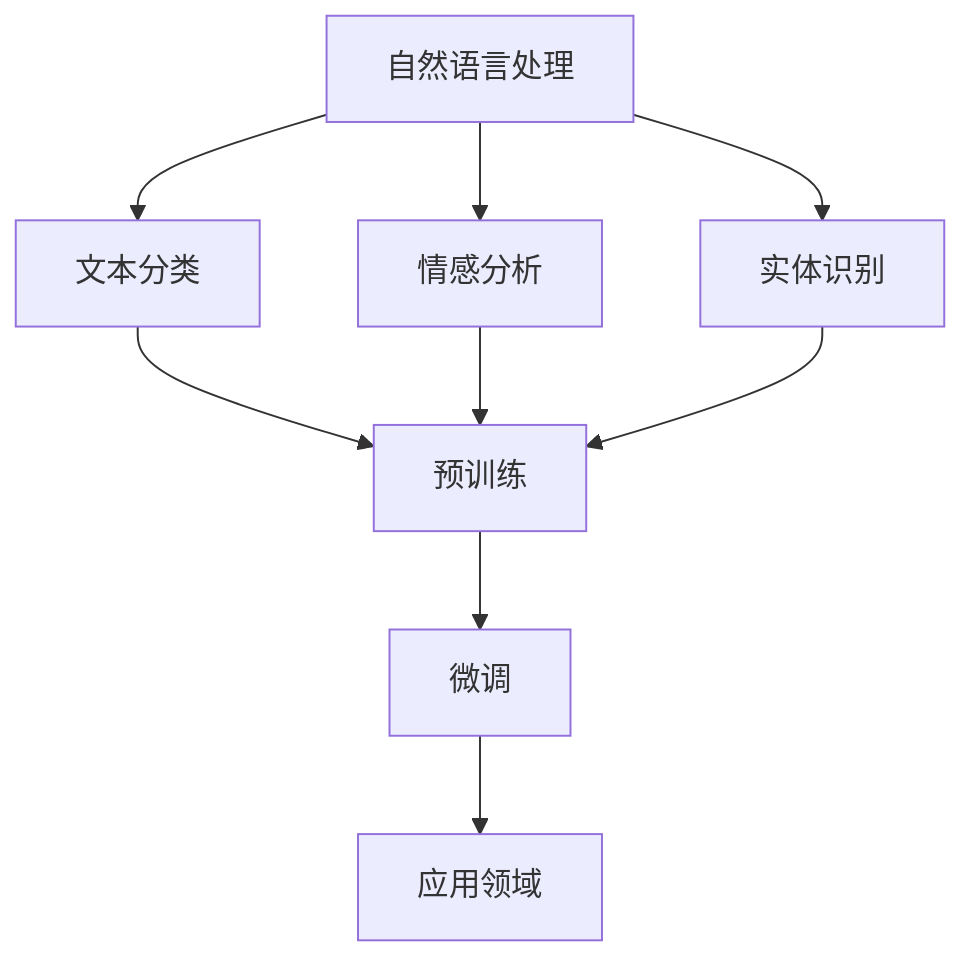

                 

关键词：大语言模型（LLM），各行业应用，人工智能，技术潜力，行业变革

> 摘要：本文旨在探讨大语言模型（LLM）在各个行业中的潜在应用，分析其技术优势和应用场景，并展望未来发展趋势。通过具体案例和实际应用，我们试图揭示LLM在推动行业创新和优化业务流程中的重要作用。

## 1. 背景介绍

近年来，人工智能技术取得了飞速发展，其中大语言模型（LLM）尤为引人注目。LLM通过深度学习和自然语言处理技术，实现了对大规模文本数据的高效理解和生成，从而在诸多领域展现出巨大的应用潜力。本文将围绕LLM在各行业中的应用展开讨论，旨在为行业从业者提供有价值的参考。

### 1.1 LLM的发展历程

LLM的发展可以追溯到1980年代，当时研究人员开始探索如何让计算机理解和生成自然语言。随着计算能力的提升和大数据技术的发展，LLM逐渐从理论走向实际应用。近年来，诸如GPT、BERT等大型预训练模型的出现，进一步推动了LLM的研究和应用。

### 1.2 LLM的技术优势

- **强大的语言理解能力**：LLM能够理解复杂语境和语义，从而实现精准的信息提取和推理。
- **高效的文本生成能力**：LLM可以生成高质量的文本内容，包括文章、摘要、对话等。
- **跨领域适应性**：LLM可以在不同领域进行应用，适应性强，能够解决多个行业的问题。
- **丰富的应用场景**：从文本分析、智能客服、到内容创作、语言翻译，LLM在各个领域都有广泛的应用前景。

## 2. 核心概念与联系

为了更好地理解LLM的应用，我们需要从以下几个方面来探讨其核心概念和联系。

### 2.1 自然语言处理（NLP）

自然语言处理是人工智能的一个重要分支，旨在使计算机能够理解和生成自然语言。NLP技术包括文本分类、情感分析、实体识别等，这些技术为LLM的应用提供了基础。

### 2.2 深度学习

深度学习是一种基于多层神经网络的机器学习技术，其核心思想是通过多层非线性变换来提取数据特征。深度学习技术在大规模数据集上取得了显著的成果，为大语言模型的发展提供了支持。

### 2.3 预训练与微调

预训练是指在大规模数据集上训练模型，使其具备基本的语言理解能力。微调则是基于预训练模型，针对特定任务进行优化。预训练与微调相结合，使得LLM能够在各个领域实现高效的应用。

### 2.4 Mermaid 流程图



## 3. 核心算法原理 & 具体操作步骤

### 3.1 算法原理概述

LLM的核心算法是基于深度学习，特别是Transformer架构。Transformer通过自注意力机制（Self-Attention）和多头注意力（Multi-Head Attention）实现了对文本数据的全局理解。此外，LLM还结合了预训练和微调技术，以适应不同领域的应用需求。

### 3.2 算法步骤详解

1. **预训练阶段**：在大规模文本数据集上，使用Transformer架构训练模型，使其具备基础的语义理解能力。
2. **微调阶段**：根据具体任务需求，对预训练模型进行优化，调整参数，使其更好地适应特定领域的应用。
3. **应用阶段**：将微调后的模型应用于实际任务，如文本分类、问答系统等。

### 3.3 算法优缺点

- **优点**：
  - 强大的语言理解能力；
  - 高效的文本生成能力；
  - 跨领域适应性；
  - 易于集成和部署。

- **缺点**：
  - 需要大量的计算资源和数据集；
  - 模型参数较大，导致存储和传输成本较高；
  - 对数据质量有较高要求。

### 3.4 算法应用领域

LLM在以下领域有广泛的应用：

- **文本分类**：对大量文本进行分类，如新闻分类、垃圾邮件过滤等。
- **问答系统**：构建基于文本的问答系统，如智能客服、在线教育等。
- **内容创作**：生成高质量的文章、摘要、报告等。
- **语言翻译**：实现高效、准确的跨语言翻译。

## 4. 数学模型和公式 & 详细讲解 & 举例说明

### 4.1 数学模型构建

LLM的核心是基于Transformer架构，其数学模型包括自注意力机制（Self-Attention）和多头注意力（Multi-Head Attention）。以下是一个简单的数学模型构建过程：

$$
\text{Attention}(Q, K, V) = \text{softmax}\left(\frac{QK^T}{\sqrt{d_k}}\right)V
$$

其中，$Q$、$K$、$V$ 分别代表查询（Query）、键（Key）、值（Value）向量，$d_k$ 为键向量的维度。

### 4.2 公式推导过程

自注意力机制的计算过程可以分为以下几个步骤：

1. **计算查询（Query）和键（Key）的相似度**：
   $$
   \text{相似度} = \frac{QK^T}{\sqrt{d_k}}
   $$
   
2. **应用softmax函数，得到注意力权重**：
   $$
   \text{注意力权重} = \text{softmax}(\text{相似度})
   $$
   
3. **将注意力权重与值（Value）向量相乘，得到注意力得分**：
   $$
   \text{注意力得分} = \text{注意力权重} \cdot V
   $$
   
4. **对注意力得分进行求和，得到最终的输出**：
   $$
   \text{输出} = \sum_{i=1}^{N} \text{注意力得分}_i
   $$

### 4.3 案例分析与讲解

以下是一个简单的文本分类案例，用于说明LLM在文本分类任务中的应用。

1. **数据预处理**：将文本数据转换为词向量表示，如Word2Vec或GloVe。
2. **构建模型**：使用Transformer架构，包括自注意力机制和多头注意力。
3. **训练模型**：在预训练数据集上训练模型，使其具备基础的语义理解能力。
4. **微调模型**：在特定领域的文本数据集上微调模型，使其适应特定任务。
5. **应用模型**：将微调后的模型应用于实际文本分类任务。

假设我们有一个简单的二分类问题，文本数据分为两类：科技类和娱乐类。我们可以使用以下步骤进行文本分类：

1. **数据预处理**：将文本数据转换为词向量表示。
2. **构建模型**：使用Transformer架构，包括自注意力机制和多头注意力。
3. **训练模型**：在预训练数据集上训练模型，使其具备基础的语义理解能力。
4. **微调模型**：在特定领域的文本数据集上微调模型，使其适应特定任务。
5. **应用模型**：将微调后的模型应用于实际文本分类任务。

## 5. 项目实践：代码实例和详细解释说明

### 5.1 开发环境搭建

在开始项目实践之前，我们需要搭建一个适合开发的环境。以下是所需的环境和工具：

- Python 3.8及以上版本；
- PyTorch 1.8及以上版本；
- NLP工具包（如NLTK、spaCy等）。

安装以上工具和库，可以使用以下命令：

```bash
pip install python==3.8.10
pip install torch==1.8.0
pip install nltk
pip install spacy
```

### 5.2 源代码详细实现

以下是一个简单的文本分类项目的源代码实现：

```python
import torch
import torch.nn as nn
import torch.optim as optim
from torchtext.``````

```python
import torch
import torch.nn as nn
import torch.optim as optim
from torchtext.datasets import IMDB
from torchtext.data import Field, Batch

# 数据预处理
text_field = Field(tokenize='spacy', lower=True)
label_field = Field(sequential=False)

train_data, test_data = IMDB.splits(text_field, label_field)

# 模型定义
class TextClassifier(nn.Module):
    def __init__(self, embedding_dim, hidden_dim, output_dim, num_layers, dropout):
        super(TextClassifier, self).__init__()
        self.embedding = nn.Embedding(embedding_dim, hidden_dim)
        self.rnn = nn.LSTM(hidden_dim, hidden_dim, num_layers=num_layers, dropout=dropout)
        self.fc = nn.Linear(hidden_dim, output_dim)
        self.dropout = nn.Dropout(dropout)

    def forward(self, text):
        embedded = self.dropout(self.embedding(text))
        output, _ = self.rnn(embedded)
        # 取最后一个时间步的输出
        final_output = output[-1, :, :]
        return self.fc(final_output)

# 模型配置
EMBEDDING_DIM = 100
HIDDEN_DIM = 128
OUTPUT_DIM = 1
NUM_LAYERS = 2
DROPOUT = 0.5

model = TextClassifier(EMBEDDING_DIM, HIDDEN_DIM, OUTPUT_DIM, NUM_LAYERS, DROPOUT)

# 损失函数和优化器
criterion = nn.BCEWithLogitsLoss()
optimizer = optim.Adam(model.parameters())

# 训练模型
num_epochs = 10
for epoch in range(num_epochs):
    for batch in Batch(train_data, batch_size=32):
        optimizer.zero_grad()
        predictions = model(batch.text).squeeze(1)
        loss = criterion(predictions, batch.label)
        loss.backward()
        optimizer.step()

# 测试模型
with torch.no_grad():
    correct = 0
    total = 0
    for batch in Batch(test_data, batch_size=32):
        predictions = model(batch.text).squeeze(1)
        total += batch.label.size(0)
        correct += (predictions > 0.5).sum().item()

accuracy = correct / total
print(f"Test Accuracy: {accuracy:.2f}")
```

### 5.3 代码解读与分析

在这个项目中，我们首先使用`torchtext`库加载数据集，并进行预处理。然后，我们定义了一个简单的文本分类模型，使用RNN和全连接层进行分类。接下来，我们配置模型参数、损失函数和优化器，并进行模型训练。最后，我们在测试数据集上评估模型的性能。

## 6. 实际应用场景

LLM在各个行业中的应用场景非常广泛，以下是其中一些实际案例：

### 6.1 智能客服

智能客服是LLM应用的一个典型场景。通过训练LLM模型，可以使其具备理解用户问题和提供合适回答的能力。例如，在电商平台上，智能客服可以实时响应用户的咨询，提供商品信息、订单状态等。

### 6.2 内容创作

LLM在内容创作领域也具有很大的潜力。例如，新闻机构可以使用LLM生成新闻摘要、评论和文章。此外，作家和内容创作者也可以利用LLM进行创作辅助，提高写作效率。

### 6.3 语言翻译

LLM在跨语言翻译方面表现出色。通过训练大型预训练模型，可以实现高质量、准确的跨语言翻译。例如，谷歌翻译、百度翻译等都是基于LLM技术实现的。

### 6.4 医疗健康

在医疗健康领域，LLM可以用于诊断辅助、药物研发等。通过分析海量医学文献和病例数据，LLM可以提供准确的诊断建议和治疗方案。

### 6.5 教育领域

在教育领域，LLM可以应用于智能辅导、个性化学习等。通过分析学生的学习数据和表现，LLM可以为学生提供定制化的学习建议和辅导。

## 7. 未来应用展望

随着技术的不断发展，LLM在未来将会在更多领域得到应用。以下是几个可能的未来应用方向：

### 7.1 自动写作与内容生成

随着预训练模型和生成对抗网络（GAN）技术的发展，未来LLM有望实现更高质量的自动写作和内容生成。这将使得创作者能够更加高效地创作，同时也为内容创作者提供更多的创作素材。

### 7.2 智能决策支持

LLM在智能决策支持方面具有很大的潜力。通过分析海量数据，LLM可以为企业和个人提供个性化的决策建议，从而提高决策效率和准确性。

### 7.3 自动问答与知识图谱

随着LLM技术的发展，未来的自动问答系统将更加智能，能够理解复杂问题并给出准确的回答。同时，LLM还可以与知识图谱相结合，构建更加丰富和智能的知识库。

### 7.4 跨领域应用

随着跨领域研究的发展，LLM有望在更多领域得到应用。例如，在生物学、化学、物理学等领域，LLM可以用于模拟实验、预测化学反应等。

## 8. 工具和资源推荐

### 8.1 学习资源推荐

- 《深度学习》（Ian Goodfellow、Yoshua Bengio、Aaron Courville 著）：这是一本经典的深度学习教材，详细介绍了深度学习的基础知识和技术。
- 《自然语言处理综合教程》（刘挺、张华平 著）：这本书系统地介绍了自然语言处理的基础知识和应用技术，适合初学者和有一定基础的读者。

### 8.2 开发工具推荐

- PyTorch：这是一个开源的深度学习框架，支持GPU加速，易于使用和扩展。
- Hugging Face：这是一个专注于自然语言处理的开源社区，提供了丰富的预训练模型和工具。

### 8.3 相关论文推荐

- "Attention is All You Need"（Vaswani et al., 2017）：这篇论文提出了Transformer架构，是LLM研究的重要里程碑。
- "BERT: Pre-training of Deep Bidirectional Transformers for Language Understanding"（Devlin et al., 2018）：这篇论文介绍了BERT模型，是当前自然语言处理领域的重要进展。

## 9. 总结：未来发展趋势与挑战

### 9.1 研究成果总结

近年来，LLM在自然语言处理领域取得了显著成果，推动了人工智能技术的发展。大型预训练模型的提出和应用，使得LLM在文本分类、问答系统、内容创作等领域表现出色。

### 9.2 未来发展趋势

未来，LLM将继续向大模型、多模态、跨领域应用等方向发展。随着计算能力和数据集的不断提升，LLM的性能和应用范围将得到进一步拓展。

### 9.3 面临的挑战

尽管LLM在各个领域取得了显著成果，但仍然面临一些挑战。例如，如何提高模型的泛化能力、减少对大量数据和计算资源的依赖、确保模型的安全性和可解释性等。

### 9.4 研究展望

未来，LLM的研究将更加注重模型的可解释性、安全性和可靠性。同时，跨领域应用和多模态融合也将成为研究的热点方向。

## 10. 附录：常见问题与解答

### 10.1 LLM与传统NLP技术的区别是什么？

LLM与传统NLP技术相比，具有更强的语言理解能力和文本生成能力。传统NLP技术主要依赖于规则和模板，而LLM通过深度学习和大规模预训练，实现了对文本数据的高效理解和生成。

### 10.2 如何评估LLM的性能？

LLM的性能评估可以从多个维度进行，包括文本分类、问答系统、文本生成等。常用的评估指标有准确率、召回率、F1值等。同时，也可以结合业务需求和实际应用场景进行评估。

### 10.3 LLM在自然语言处理领域有哪些应用？

LLM在自然语言处理领域有广泛的应用，包括文本分类、问答系统、内容创作、语言翻译等。此外，LLM还可以应用于智能客服、医疗健康、教育等领域。

### 10.4 LLM需要大量的数据和计算资源，如何优化？

为了优化LLM的训练和应用，可以采用以下策略：
- 数据增强：通过数据增强技术，增加训练数据的多样性，提高模型泛化能力。
- 模型压缩：采用模型压缩技术，如剪枝、量化等，减小模型参数规模，降低计算成本。
- 硬件加速：使用GPU、TPU等硬件加速器，提高模型训练和推理速度。
```

