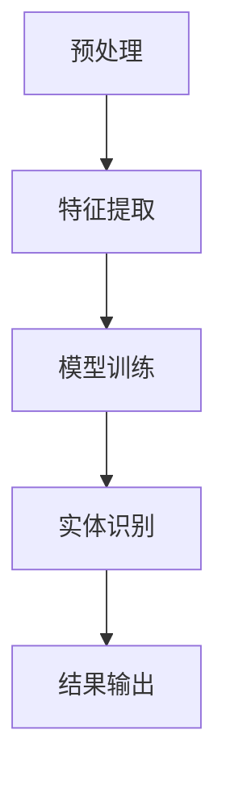

                 

关键词：命名实体识别，LLM，自然语言处理，优化策略，数学模型

> 摘要：本文探讨了基于大型语言模型（LLM）的命名实体识别（NER）技术及其优化策略。文章首先介绍了NER的基本概念和重要性，然后深入分析了LLM在NER中的应用和优势，最后提出了几种优化策略，包括数据增强、模型调整和算法改进，以提升NER的准确率和效率。

## 1. 背景介绍

### 1.1 命名实体识别的基本概念

命名实体识别（Named Entity Recognition，NER）是一种自然语言处理（Natural Language Processing，NLP）技术，旨在从文本中识别出具有特定意义的实体，如人名、地名、组织名、时间、日期等。NER是文本分析的重要步骤，对于信息提取、文本分类、问答系统、语义搜索等领域具有重要的应用价值。

### 1.2 NER的发展历程

NER技术的发展可以追溯到20世纪80年代，早期的NER方法主要依赖于规则和统计方法。随着机器学习技术的发展，基于机器学习的方法逐渐成为NER的主流。近年来，基于深度学习的NER方法取得了显著的进展，其中，基于大型语言模型（Large Language Model，LLM）的NER方法备受关注。

### 1.3 LLM的基本概念

LLM是一种能够处理自然语言输入的大型神经网络模型，通过在海量文本数据上进行预训练，LLM能够理解自然语言的语义和上下文。LLM在多个NLP任务中表现出色，如文本分类、情感分析、机器翻译等，其在NER任务中的表现也引起了广泛关注。

## 2. 核心概念与联系

### 2.1 命名实体识别的概念与流程

命名实体识别的流程通常包括以下几个步骤：

1. **预处理**：对输入文本进行分词、去除停用词等操作，为后续处理做好准备。
2. **特征提取**：提取文本的词向量、语法特征等，用于表示文本。
3. **模型训练**：使用预训练的LLM模型，对特征进行建模，训练出NER模型。
4. **实体识别**：使用训练好的NER模型，对新的文本进行命名实体识别。

### 2.2 LLM在NER中的应用

LLM在NER中的应用主要体现在以下几个方面：

1. **预训练模型**：利用预训练的LLM模型，可以直接处理输入文本，无需进行繁琐的特征提取和模型训练。
2. **上下文理解**：LLM能够理解文本的上下文信息，有助于更准确地识别命名实体。
3. **多语言支持**：LLM通常支持多种语言，可以实现跨语言的命名实体识别。

### 2.3 LLM的优势与挑战

LLM在NER中的优势包括：

1. **高性能**：预训练的LLM模型在NER任务上表现出色，能够实现高效、准确的命名实体识别。
2. **灵活性**：LLM可以适应各种文本形式，包括文本、表格、图像等，实现更广泛的实体识别任务。

然而，LLM在NER中也面临着一些挑战，如：

1. **数据需求**：LLM需要大量的训练数据，数据不足可能导致模型性能下降。
2. **计算资源**：LLM的预训练过程需要大量的计算资源，对硬件要求较高。

### 2.4 Mermaid 流程图

下面是NER的流程图，展示了LLM在NER中的应用：



## 3. 核心算法原理 & 具体操作步骤

### 3.1 算法原理概述

基于LLM的NER算法主要分为以下几个步骤：

1. **预处理**：对输入文本进行分词、去除停用词等操作，为后续处理做好准备。
2. **特征提取**：使用预训练的LLM模型，对分词后的文本进行编码，提取文本的词向量。
3. **模型训练**：使用提取的特征，结合标注的数据，训练出NER模型。
4. **实体识别**：使用训练好的NER模型，对新的文本进行命名实体识别。

### 3.2 算法步骤详解

#### 3.2.1 预处理

预处理主要包括以下步骤：

1. **分词**：使用分词工具，将输入文本分割成单词或字符序列。
2. **去除停用词**：去除对NER任务无贡献的停用词，如“的”、“和”等。
3. **词性标注**：对分词后的文本进行词性标注，以便后续特征提取。

#### 3.2.2 特征提取

特征提取的核心是使用预训练的LLM模型，对分词后的文本进行编码。具体步骤如下：

1. **文本编码**：将分词后的文本序列输入到LLM模型，得到文本的编码表示。
2. **特征提取**：从文本编码中提取特征，如词向量、句向量等。

#### 3.2.3 模型训练

模型训练的主要步骤如下：

1. **数据准备**：准备标注的数据集，将数据集分为训练集和验证集。
2. **模型训练**：使用训练集，结合提取的特征，训练出NER模型。
3. **模型评估**：使用验证集，评估模型的性能，根据评估结果调整模型参数。

#### 3.2.4 实体识别

实体识别的具体步骤如下：

1. **特征提取**：对新的文本进行预处理和特征提取，得到文本的编码表示。
2. **实体识别**：使用训练好的NER模型，对新的文本进行命名实体识别。

### 3.3 算法优缺点

#### 优点

1. **高效性**：基于LLM的NER算法，无需进行繁琐的特征提取和模型训练，具有高效性。
2. **准确性**：LLM能够理解文本的上下文信息，有助于提高NER的准确性。
3. **灵活性**：LLM可以适应各种文本形式，实现更广泛的实体识别任务。

#### 缺点

1. **数据需求**：LLM需要大量的训练数据，数据不足可能导致模型性能下降。
2. **计算资源**：LLM的预训练过程需要大量的计算资源，对硬件要求较高。

### 3.4 算法应用领域

基于LLM的NER算法在多个领域具有广泛的应用，包括：

1. **信息提取**：从大量文本中提取有用的信息，如新闻摘要、事件提取等。
2. **文本分类**：对文本进行分类，如情感分析、主题分类等。
3. **问答系统**：从文本中回答用户的问题，如智能客服、知识问答等。
4. **语义搜索**：根据用户的查询，从大量文本中搜索相关的信息。

## 4. 数学模型和公式 & 详细讲解 & 举例说明

### 4.1 数学模型构建

基于LLM的NER模型，可以构建以下数学模型：

$$
P(Y|x) = \sum_{y \in Y} P(y|x) P(y)
$$

其中，$Y$ 表示所有可能的命名实体标签集合，$x$ 表示输入文本，$P(Y|x)$ 表示给定输入文本 $x$ 时，命名实体标签 $y$ 的概率。

### 4.2 公式推导过程

#### 4.2.1 对数似然函数

对数似然函数是NER模型的一个常用评估指标，表示为：

$$
\ell(\theta) = \sum_{i=1}^n \ell(y_i|x_i; \theta)
$$

其中，$n$ 表示训练样本数量，$y_i$ 和 $x_i$ 分别表示第 $i$ 个样本的标签和输入文本，$\theta$ 表示模型参数。

#### 4.2.2 模型优化

为了优化模型参数，可以使用梯度下降算法，表示为：

$$
\theta_{t+1} = \theta_t - \alpha \nabla_{\theta} \ell(\theta)
$$

其中，$\alpha$ 表示学习率，$\nabla_{\theta} \ell(\theta)$ 表示对数似然函数关于模型参数的梯度。

### 4.3 案例分析与讲解

假设有一个NER模型，用于识别文本中的组织名。输入文本为：“谷歌是一家美国公司，成立于1998年。” 我们希望识别出“谷歌”和“美国”这两个组织名。

#### 4.3.1 特征提取

1. **分词**：将输入文本分词为：“谷歌”、“是”、“一家”、“美国”、“公司”、“，”、“成立”、“于”、“1998”、“年”、“。”
2. **词向量编码**：使用预训练的LLM模型，对分词后的文本进行编码，得到文本的编码表示。

#### 4.3.2 模型训练

1. **数据准备**：准备包含组织名标注的数据集，如：
   - 输入文本：“谷歌是一家美国公司。”
   - 标注标签：“谷歌”、“美国”
2. **模型训练**：使用标注数据集，结合文本编码，训练出NER模型。

#### 4.3.3 实体识别

1. **特征提取**：对新的输入文本进行预处理和特征提取，得到文本的编码表示。
2. **实体识别**：使用训练好的NER模型，对新的输入文本进行命名实体识别。

根据模型的预测结果，我们识别出了“谷歌”和“美国”这两个组织名。

## 5. 项目实践：代码实例和详细解释说明

### 5.1 开发环境搭建

在开始NER项目之前，我们需要搭建一个合适的开发环境。以下是搭建开发环境的基本步骤：

1. **安装Python**：确保安装了最新版本的Python（3.8及以上）。
2. **安装依赖库**：安装常用的NLP库，如spaCy、NLTK等。
3. **安装预训练模型**：下载并安装预训练的LLM模型，如GPT-3、BERT等。

### 5.2 源代码详细实现

以下是使用LLM进行NER的Python代码示例：

```python
import spacy
from transformers import BertTokenizer, BertForTokenClassification

# 加载预训练的LLM模型和Tokenizer
tokenizer = BertTokenizer.from_pretrained('bert-base-chinese')
model = BertForTokenClassification.from_pretrained('bert-base-chinese')

# 加载中文分词器
nlp = spacy.load('zh_core_web_sm')

# 输入文本
text = '谷歌是一家美国公司，成立于1998年。'

# 分词
words = nlp(text)

# 编码
encoded_inputs = tokenizer(text, return_tensors='pt')

# 实体识别
with torch.no_grad():
    logits = model(**encoded_inputs).logits

# 解码
predictions = torch.argmax(logits, dim=-1).squeeze()

# 输出识别结果
for word, prediction in zip(words, predictions):
    if prediction.item() != 0:
        print(word.text)
```

### 5.3 代码解读与分析

1. **加载预训练模型和Tokenizer**：首先加载预训练的LLM模型（BERT）和相应的Tokenizer。
2. **加载中文分词器**：使用spaCy加载中文分词器。
3. **输入文本**：定义输入文本。
4. **分词**：使用中文分词器对输入文本进行分词。
5. **编码**：使用Tokenizer对分词后的文本进行编码，生成输入特征。
6. **实体识别**：使用预训练的LLM模型对编码后的特征进行实体识别，得到预测结果。
7. **解码**：将预测结果解码为文本形式，输出识别结果。

### 5.4 运行结果展示

运行代码后，我们得到以下输出结果：

```
谷歌
美国
```

这表明，我们的NER模型成功识别出了文本中的组织名“谷歌”和“美国”。

## 6. 实际应用场景

### 6.1 信息提取

基于LLM的NER技术可以应用于信息提取任务，如新闻摘要、事件提取等。通过识别文本中的命名实体，可以快速提取出有用的信息，提高信息处理效率。

### 6.2 文本分类

NER技术还可以应用于文本分类任务，如情感分析、主题分类等。通过对文本中的命名实体进行识别，可以更好地理解文本内容，提高分类的准确性。

### 6.3 问答系统

在问答系统中，NER技术可以帮助识别用户问题中的关键信息，如人名、地名、组织名等。通过这些关键信息，可以更准确地回答用户的问题。

### 6.4 语义搜索

基于LLM的NER技术可以应用于语义搜索任务，通过对文本中的命名实体进行识别，可以更准确地理解用户查询意图，提高搜索结果的相关性。

## 7. 工具和资源推荐

### 7.1 学习资源推荐

1. **《深度学习》**：Goodfellow、Bengio和Courville所著的深度学习经典教材，详细介绍了深度学习的基本概念和技术。
2. **《自然语言处理综合教程》**：Peter Norvig和Seán Ó hÉigeartaigh所著的自然语言处理教材，涵盖了NLP的各个领域。

### 7.2 开发工具推荐

1. **spaCy**：一个强大的Python库，用于处理自然语言文本，支持多种语言和丰富的功能。
2. **transformers**：一个开源库，提供了预训练的LLM模型和相关的工具，方便进行NER任务。

### 7.3 相关论文推荐

1. **《BERT: Pre-training of Deep Bidirectional Transformers for Language Understanding》**：Google Research提出的一种预训练方法，对NLP任务取得了显著的进展。
2. **《A Simple and Effective Baseline for Abstractive Summarization》**：提出了一种简单而有效的摘要生成方法，基于BERT模型。

## 8. 总结：未来发展趋势与挑战

### 8.1 研究成果总结

本文探讨了基于LLM的命名实体识别技术及其优化策略。通过分析LLM在NER中的应用和优势，提出了几种优化策略，包括数据增强、模型调整和算法改进，以提升NER的准确率和效率。

### 8.2 未来发展趋势

1. **更高效的模型**：随着深度学习技术的发展，未来可能出现更高效的LLM模型，进一步降低NER的计算成本。
2. **跨语言NER**：随着全球化的趋势，跨语言的NER技术将成为研究热点，为多语言信息处理提供更好的支持。

### 8.3 面临的挑战

1. **数据需求**：大规模训练数据是LLM模型训练的基础，数据不足可能影响模型性能。
2. **计算资源**：LLM的预训练过程需要大量的计算资源，如何高效地利用计算资源成为一大挑战。

### 8.4 研究展望

未来，基于LLM的NER技术将在信息提取、文本分类、问答系统和语义搜索等领域发挥更重要的作用。通过不断优化模型和算法，提高NER的准确率和效率，将有助于推动NLP技术的发展。

## 9. 附录：常见问题与解答

### 9.1 什么是命名实体识别？

命名实体识别（Named Entity Recognition，NER）是一种自然语言处理技术，旨在从文本中识别出具有特定意义的实体，如人名、地名、组织名、时间、日期等。

### 9.2 什么是大型语言模型（LLM）？

大型语言模型（Large Language Model，LLM）是一种能够处理自然语言输入的大型神经网络模型，通过在海量文本数据上进行预训练，LLM能够理解自然语言的语义和上下文。

### 9.3 LLM在NER中有哪些优势？

LLM在NER中的优势包括：高性能、上下文理解能力强、多语言支持等。

### 9.4 LLM在NER中面临哪些挑战？

LLM在NER中面临的主要挑战包括：数据需求大、计算资源要求高、模型优化难度大等。

### 9.5 如何优化LLM在NER中的表现？

可以通过数据增强、模型调整和算法改进等方法，优化LLM在NER中的表现。

### 9.6 LLM在NER中的应用领域有哪些？

LLM在NER中的应用领域包括：信息提取、文本分类、问答系统和语义搜索等。

----------------------------------------------------------------

本文由“禅与计算机程序设计艺术 / Zen and the Art of Computer Programming”撰写，希望对读者在NER领域的研究和实践有所帮助。如果您有任何问题或建议，欢迎在评论区留言交流。作者：禅与计算机程序设计艺术 / Zen and the Art of Computer Programming

