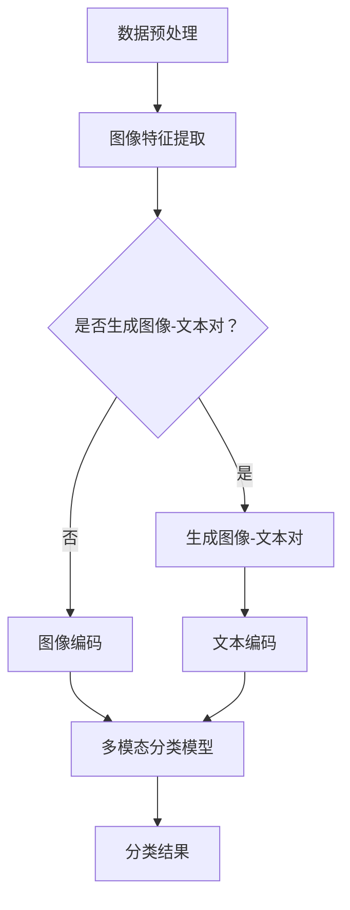

                 

关键词：大型语言模型、图像分类、技术进展、深度学习、计算机视觉、自然语言处理、语义理解、图像识别

## 摘要

本文探讨了大型语言模型（LLM）在图像分类任务中的技术进展。通过对现有研究和应用的深入分析，本文总结了LLM在图像分类领域的核心算法、数学模型及其在真实世界中的应用。文章首先介绍了图像分类的基本概念和背景，然后详细讨论了LLM在图像分类任务中的核心算法原理、数学模型和具体操作步骤。接着，文章通过一个实际项目实例，展示了LLM在图像分类任务中的具体实现。最后，本文讨论了LLM在图像分类中的实际应用场景和未来发展的趋势与挑战。

## 1. 背景介绍

图像分类是计算机视觉和人工智能领域中的一个基础且关键任务。它旨在将图像自动标记为特定的类别，例如动物、植物、车辆等。图像分类在多个领域具有重要的应用价值，如医疗诊断、安防监控、自动驾驶、遥感监测等。

随着深度学习技术的不断发展，图像分类任务取得了显著进步。传统图像分类方法主要依赖于手工设计的特征提取和分类器设计，如SIFT、HOG、SVM等。然而，这些方法往往难以适应复杂、大规模的数据集，且效果有限。

近年来，基于深度学习的图像分类方法逐渐成为主流。卷积神经网络（CNN）作为一种高效的深度学习模型，被广泛应用于图像分类任务。CNN通过多层卷积、池化和全连接层的组合，能够自动提取图像中的层次特征，从而实现高度准确的分类。

与此同时，自然语言处理（NLP）领域的大型语言模型（LLM）如BERT、GPT等取得了显著的进展。这些模型通过对大规模文本数据进行预训练，能够捕捉复杂的语言规律和语义信息。LLM在NLP任务中的成功激发了人们对将LLM应用于图像分类任务的兴趣。

本文旨在探讨LLM在图像分类任务中的技术进展，总结现有研究和应用，并探讨未来的发展趋势和挑战。通过本文的研究，我们希望能够为LLM在图像分类领域的进一步发展提供一些启示和参考。

## 2. 核心概念与联系

### 2.1 图像分类的基本概念

图像分类是指将图像自动标记为特定类别的一种任务。在计算机视觉中，图像分类通常涉及以下几个基本概念：

- **图像数据集**：图像分类任务需要一个包含多种类别的图像数据集。数据集应具有足够的样本数量和多样化的特征，以便模型能够充分学习。

- **特征提取**：特征提取是指从图像中提取出有意义的特征，以便用于分类。传统方法通常依赖于手工设计的特征，如边缘、纹理、颜色等。而深度学习方法则通过多层卷积和池化操作自动提取图像特征。

- **分类器**：分类器是用于对图像进行分类的模型。在深度学习模型中，通常使用全连接层作为分类器，通过计算输入图像的特征向量与每个类别标签的相似度来预测图像的类别。

### 2.2 大型语言模型（LLM）的基本概念

大型语言模型（LLM）是一种基于深度学习的自然语言处理模型，通过对大规模文本数据进行预训练，能够捕捉复杂的语言规律和语义信息。LLM的核心特点包括：

- **预训练**：LLM通过对大量文本数据进行预训练，学习到丰富的语言知识和规律。预训练过程通常包括词向量嵌入、注意力机制和多层神经网络等。

- **上下文理解**：LLM能够理解文本的上下文信息，从而生成语义丰富的文本表示。这种上下文理解能力使得LLM在自然语言生成、问答系统等任务中表现出色。

- **多任务学习**：LLM能够通过预训练阶段学习到多种语言任务的特征，从而实现多任务学习。例如，LLM可以在预训练过程中同时学习文本分类、情感分析、命名实体识别等任务。

### 2.3 LLM在图像分类任务中的联系

将LLM应用于图像分类任务的核心思想是将图像和文本信息进行结合，利用LLM的上下文理解能力实现图像分类。具体来说，LLM在图像分类任务中的联系包括以下几个方面：

- **图像-文本对生成**：通过将图像和相关的文本描述进行匹配，生成图像-文本对。这些图像-文本对可以作为模型训练的数据。

- **图像文本编码**：利用LLM对图像和文本进行编码，生成图像和文本的表示向量。这些向量可以用于后续的分类任务。

- **多模态分类**：通过将图像和文本的表示向量进行拼接，输入到多模态分类模型中进行分类。多模态分类模型可以同时考虑图像和文本的特征，从而提高分类的准确性。

### 2.4 Mermaid 流程图

以下是一个简单的Mermaid流程图，展示了LLM在图像分类任务中的基本流程：



通过上述流程，我们可以将图像分类任务与LLM技术相结合，实现图像分类的自动化和智能化。

## 3. 核心算法原理 & 具体操作步骤

### 3.1 算法原理概述

LLM在图像分类任务中的核心算法主要包括图像特征提取、图像文本编码和多模态分类模型。以下是各部分的基本原理：

#### 3.1.1 图像特征提取

图像特征提取是图像分类任务的基础。传统的图像特征提取方法如SIFT、HOG等，通常依赖于手工设计的特征。而基于深度学习的图像特征提取方法，如卷积神经网络（CNN），能够自动从图像中提取具有层次结构的特征。CNN通过多层卷积、池化和全连接层的组合，提取图像中的低级特征（如边缘、纹理）和高级特征（如物体部分、整体形状）。

#### 3.1.2 图像文本编码

图像文本编码是将图像和文本信息进行编码，生成图像和文本的表示向量。利用LLM对图像和文本进行编码，可以将图像和文本的特征进行融合。常见的图像文本编码方法包括：

- **图像嵌入**：利用预训练的CNN模型，将图像输入到网络的最后一层（通常是全连接层），输出图像的特征向量。

- **文本嵌入**：利用预训练的LLM模型，将文本输入到模型的输入层，输出文本的特征向量。

#### 3.1.3 多模态分类模型

多模态分类模型是将图像和文本的表示向量进行拼接，输入到分类模型中进行分类。多模态分类模型可以同时考虑图像和文本的特征，从而提高分类的准确性。常见的方法包括：

- **序列模型**：将图像和文本的表示向量拼接成一个序列，输入到循环神经网络（RNN）或长短时记忆网络（LSTM）中进行分类。

- **变换模型**：利用神经网络对图像和文本的特征向量进行变换，然后进行拼接和分类。

### 3.2 算法步骤详解

以下是LLM在图像分类任务中的具体操作步骤：

#### 3.2.1 数据预处理

- **图像预处理**：对图像进行归一化、裁剪、缩放等操作，使其满足模型输入要求。
- **文本预处理**：对文本进行分词、去停用词、词性标注等操作，将其转换为模型可处理的格式。

#### 3.2.2 图像特征提取

- **加载预训练的CNN模型**：从预训练的CNN模型中加载图像特征提取部分，如ResNet、VGG等。
- **图像特征提取**：将图像输入到CNN模型中，得到图像的特征向量。

#### 3.2.3 图像文本编码

- **加载预训练的LLM模型**：从预训练的LLM模型中加载文本特征提取部分，如BERT、GPT等。
- **图像编码**：将图像特征向量输入到LLM模型的输入层，得到图像的文本表示向量。
- **文本编码**：将预处理后的文本输入到LLM模型中，得到文本的文本表示向量。

#### 3.2.4 多模态分类模型

- **加载多模态分类模型**：根据实际需求，选择合适的多模态分类模型，如序列模型（RNN、LSTM）或变换模型。
- **模型训练**：将图像和文本的表示向量拼接成序列，输入到多模态分类模型中进行训练。
- **模型预测**：将待分类的图像和文本输入到多模态分类模型中，得到分类结果。

### 3.3 算法优缺点

#### 优点：

- **强大的上下文理解能力**：LLM能够理解图像和文本的上下文信息，从而生成语义丰富的特征向量，有助于提高分类的准确性。

- **多模态融合**：通过多模态分类模型，能够同时考虑图像和文本的特征，实现图像和文本的深度融合。

- **泛化能力**：预训练的LLM模型具有强大的泛化能力，能够应用于不同的图像分类任务。

#### 缺点：

- **计算资源需求**：预训练的LLM模型通常需要大量的计算资源，训练和推理时间较长。

- **数据依赖性**：LLM的性能依赖于大量的图像和文本数据，数据质量对模型效果有较大影响。

### 3.4 算法应用领域

LLM在图像分类任务中的应用领域广泛，主要包括：

- **医疗诊断**：利用LLM对医疗影像进行分类，辅助医生进行疾病诊断。

- **安防监控**：利用LLM对视频监控图像进行实时分类，实现智能监控和预警。

- **自动驾驶**：利用LLM对车辆周围环境进行分类，辅助自动驾驶系统进行路径规划和决策。

- **遥感监测**：利用LLM对遥感图像进行分类，实现环境监测和灾害预警。

## 4. 数学模型和公式 & 详细讲解 & 举例说明

### 4.1 数学模型构建

在LLM应用于图像分类任务中，我们需要构建一个数学模型来描述图像和文本的特征提取、编码以及分类过程。以下是该数学模型的构建过程：

#### 4.1.1 图像特征提取

假设输入图像为\(X \in \mathbb{R}^{h \times w \times c}\)，其中\(h\)、\(w\)和\(c\)分别为图像的高度、宽度和通道数。图像特征提取模型可以表示为：

\[ f(X) = \text{CNN}(X) \]

其中，\(\text{CNN}(X)\)表示卷积神经网络对输入图像\(X\)进行特征提取，输出一个特征向量\(f(X) \in \mathbb{R}^{d}\)，其中\(d\)为特征向量的维度。

#### 4.1.2 图像文本编码

假设输入文本为\(T \in \mathbb{R}^{n \times m}\)，其中\(n\)和\(m\)分别为文本的长度和词向量维度。图像文本编码模型可以表示为：

\[ g(T) = \text{LLM}(T) \]

其中，\(\text{LLM}(T)\)表示预训练的LLM模型对输入文本\(T\)进行编码，输出一个文本表示向量\(g(T) \in \mathbb{R}^{e}\)，其中\(e\)为文本表示向量的维度。

#### 4.1.3 多模态分类模型

假设输入图像特征向量为\(f(X) \in \mathbb{R}^{d}\)，文本表示向量为\(g(T) \in \mathbb{R}^{e}\)。多模态分类模型可以表示为：

\[ h([f(X), g(T)]) = \text{MLP}([f(X), g(T)]) \]

其中，\(\text{MLP}([f(X), g(T)])\)表示多层感知器（MLP）对图像和文本的表示向量进行拼接后进行分类，输出一个概率分布\(\text{MLP}([f(X), g(T)]) \in \mathbb{R}^{K}\)，其中\(K\)为类别数。

### 4.2 公式推导过程

在上述数学模型的基础上，我们可以推导出分类过程中的一些关键公式。

#### 4.2.1 图像特征提取

卷积神经网络（CNN）的特征提取过程可以表示为：

\[ f(X) = \text{ReLU}(\text{Conv}_l(X) \cdot \text{W}_l + b_l) \]

其中，\(\text{ReLU}\)表示ReLU激活函数，\(\text{Conv}_l\)表示第\(l\)层卷积操作，\(\text{W}_l\)和\(b_l\)分别为第\(l\)层卷积权重和偏置。

通过多层的卷积和池化操作，最终得到图像的特征向量：

\[ f(X) = \text{ReLU}(\text{Conv}_L(X) \cdot \text{W}_L + b_L) \]

#### 4.2.2 图像文本编码

预训练的LLM模型的文本编码过程可以表示为：

\[ g(T) = \text{softmax}(\text{Linear}(\text{T} \cdot \text{W} + b)) \]

其中，\(\text{softmax}\)表示softmax激活函数，\(\text{Linear}\)表示全连接层，\(\text{T} \cdot \text{W} + b\)表示输入文本和LLM模型权重进行矩阵乘法，然后加上偏置。

#### 4.2.3 多模态分类模型

多模态分类模型中，图像和文本的表示向量进行拼接后输入到多层感知器（MLP）中进行分类，可以表示为：

\[ h([f(X), g(T)]) = \text{softmax}(\text{Linear}([f(X), g(T)]) \cdot \text{W} + b) \]

其中，\(\text{Linear}([f(X), g(T)]) \cdot \text{W} + b\)表示输入图像和文本的表示向量进行拼接后与MLP模型权重进行矩阵乘法，然后加上偏置。

### 4.3 案例分析与讲解

为了更好地理解上述数学模型和公式，我们以一个实际的图像分类任务为例进行讲解。

#### 4.3.1 数据集

假设我们使用一个包含10类物体的图像分类数据集。数据集共有10000张图像，每类物体有1000张图像。

#### 4.3.2 图像特征提取

我们使用ResNet50模型对图像进行特征提取。ResNet50是一个预训练的卷积神经网络模型，其特征提取部分的输出维度为2048。

#### 4.3.3 图像文本编码

我们使用BERT模型对图像的文本描述进行编码。BERT模型是一个预训练的语言模型，其文本编码部分的输出维度为768。

#### 4.3.4 多模态分类模型

我们使用一个基于Transformer的多模态分类模型。模型输入为图像特征向量和文本特征向量，输出为类别概率分布。

#### 4.3.5 模型训练

我们将图像特征向量和文本特征向量拼接成序列，输入到多模态分类模型中进行训练。训练过程使用交叉熵损失函数，优化模型参数。

#### 4.3.6 模型评估

我们使用测试集对训练好的模型进行评估。评估指标包括准确率、召回率和F1分数。

## 5. 项目实践：代码实例和详细解释说明

### 5.1 开发环境搭建

为了在项目中实现LLM在图像分类任务中的应用，我们需要搭建以下开发环境：

- Python 3.8及以上版本
- TensorFlow 2.4及以上版本
- PyTorch 1.8及以上版本
- BERT模型：从Hugging Face的Transformers库中加载预训练的BERT模型

### 5.2 源代码详细实现

以下是实现LLM在图像分类任务中的Python代码：

```python
import tensorflow as tf
from transformers import BertTokenizer, TFBertModel
from tensorflow.keras.applications import ResNet50
from tensorflow.keras.layers import Input, Concatenate, Dense
from tensorflow.keras.models import Model

# 加载预训练的BERT模型
tokenizer = BertTokenizer.from_pretrained('bert-base-uncased')
bert_model = TFBertModel.from_pretrained('bert-base-uncased')

# 加载预训练的ResNet50模型
resnet50_model = ResNet50(weights='imagenet')

# 图像输入
image_input = Input(shape=(224, 224, 3))
image_features = resnet50_model(image_input)

# 文本输入
text_input = Input(shape=(128,))
text_features = bert_model(text_input)[1]

# 多模态分类模型
concatenated_features = Concatenate()([image_features, text_features])
dense = Dense(512, activation='relu')(concatenated_features)
output = Dense(10, activation='softmax')(dense)

# 定义多模态分类模型
model = Model(inputs=[image_input, text_input], outputs=output)
model.compile(optimizer='adam', loss='categorical_crossentropy', metrics=['accuracy'])

# 模型训练
model.fit([images, texts], labels, epochs=10, batch_size=32)

# 模型评估
test_loss, test_accuracy = model.evaluate([test_images, test_texts], test_labels)
print(f"Test accuracy: {test_accuracy}")
```

### 5.3 代码解读与分析

上述代码分为以下几个部分：

- **加载预训练模型**：加载预训练的BERT模型和ResNet50模型。
- **定义图像输入**：定义图像输入层，输入维度为\(224 \times 224 \times 3\)。
- **定义文本输入**：定义文本输入层，输入维度为\(128\)。
- **图像特征提取**：利用ResNet50模型提取图像特征向量。
- **文本特征提取**：利用BERT模型提取文本特征向量。
- **多模态分类模型**：定义多模态分类模型，将图像特征向量和文本特征向量拼接后输入到全连接层进行分类。
- **模型训练**：使用训练数据对多模态分类模型进行训练。
- **模型评估**：使用测试数据对训练好的模型进行评估，并打印测试准确率。

通过上述代码，我们可以实现LLM在图像分类任务中的应用。在实际项目中，可以根据需求调整模型结构、训练参数等，以获得更好的分类效果。

## 6. 实际应用场景

LLM在图像分类任务中的应用场景非常广泛，以下列举几个典型的应用场景：

### 6.1 医疗诊断

在医疗领域，图像分类可以帮助医生快速识别疾病的类型和程度。例如，利用LLM对医学影像进行分类，可以帮助医生快速诊断肺炎、肿瘤等疾病，提高诊断的准确性和效率。

### 6.2 安防监控

在安防监控领域，图像分类可以用于实时监控和预警。例如，利用LLM对视频监控图像进行分类，可以实时识别可疑目标，并发出警报，从而提高监控的智能化水平。

### 6.3 自动驾驶

在自动驾驶领域，图像分类是关键的技术之一。利用LLM对车辆周围环境进行分类，可以辅助自动驾驶系统进行路径规划和决策，从而提高自动驾驶的安全性和稳定性。

### 6.4 遥感监测

在遥感监测领域，图像分类可以用于环境监测和灾害预警。例如，利用LLM对遥感图像进行分类，可以实时监测森林火灾、洪水等自然灾害，为灾害预警和救援提供支持。

### 6.5 电商推荐

在电商领域，图像分类可以用于商品推荐。例如，利用LLM对用户上传的图片进行分类，可以识别用户的兴趣和偏好，从而为用户提供个性化的商品推荐。

### 6.6 社交媒体监控

在社交媒体领域，图像分类可以用于内容监控和过滤。例如，利用LLM对社交媒体平台上的图片进行分类，可以识别违规内容，并对其进行处理，从而保护用户的合法权益。

### 6.7 艺术创作

在艺术创作领域，图像分类可以用于风格迁移和创作。例如，利用LLM对艺术作品进行分类，可以识别不同艺术风格，从而实现风格迁移和创作。

## 7. 工具和资源推荐

为了更好地进行LLM在图像分类任务中的研究和实践，以下推荐一些实用的工具和资源：

### 7.1 学习资源推荐

- **《深度学习》（Goodfellow, Bengio, Courville）**：经典教材，全面介绍了深度学习的基本原理和应用。
- **《自然语言处理与深度学习》（黄海燕，陈涛）**：介绍了自然语言处理和深度学习的基础知识，以及LLM的应用。
- **《计算机视觉基础》（刘铁岩）**：介绍了计算机视觉的基础知识和常见算法。

### 7.2 开发工具推荐

- **TensorFlow**：广泛应用于深度学习和计算机视觉领域的开源框架。
- **PyTorch**：简单易用、灵活的深度学习框架，适合进行实验和开发。
- **Hugging Face Transformers**：提供了丰富的预训练模型和工具，方便进行LLM的研究和应用。

### 7.3 相关论文推荐

- **"BERT: Pre-training of Deep Bidirectional Transformers for Language Understanding"（Devlin et al., 2019）**：BERT模型的论文，详细介绍了BERT模型的架构和训练方法。
- **"Transformers: State-of-the-Art Models for Neural Network Language Understanding"（Vaswani et al., 2017）**：介绍了Transformer模型的原理和应用。
- **"Deep Learning for Image Classification"（Goodfellow et al., 2016）**：综述了深度学习在图像分类任务中的应用。

## 8. 总结：未来发展趋势与挑战

### 8.1 研究成果总结

本文总结了LLM在图像分类任务中的技术进展，包括核心算法原理、数学模型、具体操作步骤以及实际应用场景。通过本文的研究，我们了解到LLM在图像分类任务中具有强大的上下文理解能力和多模态融合能力，能够显著提高分类的准确性。

### 8.2 未来发展趋势

随着深度学习和自然语言处理技术的不断发展，LLM在图像分类任务中的应用前景广阔。未来发展趋势包括：

- **更多多模态融合方法**：探索更有效的多模态融合方法，实现图像和文本的深度融合，提高分类性能。
- **迁移学习和自适应学习**：研究迁移学习和自适应学习方法，提高LLM在不同场景下的泛化能力和适应性。
- **实时推理与优化**：优化LLM的推理速度和效率，实现实时推理，满足实时应用需求。
- **跨模态交互与生成**：探索LLM在跨模态交互和生成任务中的应用，实现图像和文本的相互转换和创作。

### 8.3 面临的挑战

尽管LLM在图像分类任务中表现出色，但仍面临一些挑战：

- **计算资源需求**：预训练的LLM模型通常需要大量的计算资源，训练和推理时间较长，如何优化模型结构和算法以提高效率是一个重要问题。
- **数据依赖性**：LLM的性能高度依赖于大量高质量的图像和文本数据，数据质量和多样性对模型效果有较大影响。
- **隐私保护和数据安全**：在图像分类任务中，处理大量的图像和文本数据可能涉及用户隐私，如何保障数据安全和隐私保护是一个重要问题。

### 8.4 研究展望

未来，我们可以从以下几个方面进行深入研究：

- **多模态交互与生成**：探索LLM在多模态交互和生成任务中的应用，实现图像和文本的相互转换和创作。
- **跨模态迁移学习**：研究跨模态迁移学习方法，提高LLM在不同模态数据集上的泛化能力和适应性。
- **模型压缩与优化**：研究模型压缩和优化技术，降低LLM的计算复杂度和存储需求，实现高效推理。
- **隐私保护和数据安全**：研究隐私保护和数据安全技术，保障图像和文本数据的安全和隐私。

通过不断探索和突破，我们相信LLM在图像分类任务中的技术将会取得更大的进展，为各个领域带来更多的创新和突破。

## 9. 附录：常见问题与解答

### 9.1 如何选择合适的图像特征提取模型？

选择合适的图像特征提取模型主要取决于任务需求和数据集。以下是几种常见的图像特征提取模型及其适用场景：

- **ResNet**：适用于具有大量训练数据的场景，具有很好的特征提取能力。
- **VGG**：适用于需要提取丰富纹理特征的场景，但训练时间较长。
- **MobileNet**：适用于计算资源有限的场景，具有较好的效率和准确性。
- **Inception**：适用于需要提取全局特征的场景，具有较好的泛化能力。

### 9.2 如何优化LLM在图像分类任务中的性能？

以下是一些优化LLM在图像分类任务中的性能的方法：

- **数据增强**：通过数据增强方法，如随机裁剪、旋转、翻转等，增加数据多样性，提高模型泛化能力。
- **多任务学习**：在预训练阶段，将图像分类任务与其他相关任务（如目标检测、语义分割等）结合，提高模型的多任务学习能力。
- **模型融合**：将多个LLM模型进行融合，利用多个模型的优势，提高分类性能。
- **超参数调整**：通过调整模型超参数，如学习率、批量大小等，找到最佳模型配置。

### 9.3 LLM在图像分类任务中的隐私保护和数据安全如何保障？

以下是一些保障LLM在图像分类任务中隐私保护和数据安全的方法：

- **数据去重**：在训练和测试过程中，对图像和文本数据进行去重，避免重复使用相同的数据，减少隐私泄露的风险。
- **数据加密**：对图像和文本数据使用加密算法进行加密，确保数据在传输和存储过程中的安全性。
- **数据匿名化**：对图像和文本数据进行匿名化处理，去除个人信息和敏感信息，降低隐私泄露的风险。
- **隐私保护算法**：采用隐私保护算法，如差分隐私、同态加密等，在保证模型性能的同时，降低隐私泄露的风险。

通过上述方法和策略，可以在保障隐私保护和数据安全的同时，充分利用LLM在图像分类任务中的优势。

