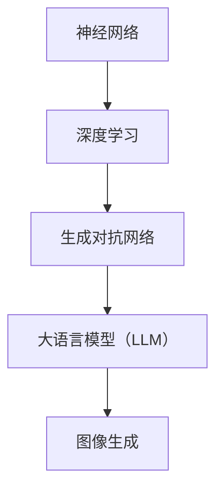

                 

关键词：大语言模型（LLM），图像生成，速度优化，算法原理，应用领域，数学模型，代码实例，未来展望。

## 摘要

随着人工智能技术的不断发展，大语言模型（LLM）在图像生成速度方面的表现引起了广泛关注。本文将探讨LLM在图像生成速度方面的进展，包括其核心算法原理、数学模型和具体应用场景。通过对现有研究的分析，本文提出了一些优化LLM图像生成速度的方法，并展望了未来的发展方向。

## 1. 背景介绍

图像生成技术是计算机视觉领域的一个重要研究方向。随着深度学习技术的发展，生成对抗网络（GAN）等模型在图像生成方面取得了显著成果。然而，传统的图像生成方法在生成速度方面存在一定局限。随着大数据时代的到来，人们对图像生成速度的需求越来越高。为此，大语言模型（LLM）在图像生成速度方面的研究成为一个热点话题。

LLM是一种基于深度学习的大型神经网络模型，通过对海量文本数据进行训练，能够理解并生成自然语言文本。近年来，LLM在自然语言处理领域取得了巨大成功，如GPT系列、BERT等模型。这些模型在图像生成任务中也展现出了良好的性能。然而，如何提高LLM在图像生成速度方面的表现，仍然是一个具有挑战性的问题。

## 2. 核心概念与联系

为了理解LLM在图像生成速度方面的进展，我们首先需要了解一些核心概念，如神经网络、深度学习、生成对抗网络等。下面将给出一个简化的Mermaid流程图，展示这些概念之间的联系。



### 2.1 神经网络

神经网络是一种模拟人脑神经元连接方式的计算模型。它由多个神经元（节点）组成，每个神经元都与其他神经元相连，并通过权重和偏置进行信息传递。神经网络通过不断调整权重和偏置，使模型能够从数据中学习并提取特征。

### 2.2 深度学习

深度学习是神经网络的一种特殊形式，它通过多层神经网络结构来提取特征。在深度学习模型中，每层神经元都会对输入数据进行处理，并将处理结果传递给下一层。这种层次化的结构使深度学习模型能够从数据中自动提取复杂的特征。

### 2.3 生成对抗网络

生成对抗网络（GAN）是一种由生成器和判别器组成的对偶神经网络。生成器通过学习输入数据的分布，生成与真实数据相似的伪数据。判别器则通过区分真实数据和伪数据，不断优化生成器的性能。GAN在图像生成、语音合成等任务中取得了显著成果。

### 2.4 大语言模型（LLM）

大语言模型（LLM）是一种基于深度学习的神经网络模型，通过对海量文本数据进行训练，能够生成高质量的自然语言文本。LLM在自然语言处理任务中表现出色，如文本分类、机器翻译、文本生成等。

### 2.5 图像生成

图像生成是指利用计算机生成逼真的图像或视频。常见的图像生成方法包括生成对抗网络（GAN）、变分自编码器（VAE）等。这些方法通过学习输入图像的分布，生成与输入图像相似的新图像。

## 3. 核心算法原理 & 具体操作步骤

### 3.1 算法原理概述

LLM在图像生成速度方面的核心算法原理主要涉及以下几个方面：

1. **模型架构**：LLM采用深度卷积神经网络（CNN）和循环神经网络（RNN）的组合结构，能够同时处理图像和文本信息。
2. **训练过程**：LLM通过对大量图像和对应文本描述的训练，学习图像和文本之间的映射关系，从而提高图像生成的质量。
3. **优化策略**：LLM采用梯度下降法、Adam优化器等优化策略，以加速模型训练和收敛。

### 3.2 算法步骤详解

1. **数据准备**：收集大量图像和对应文本描述数据，并进行预处理，如图像裁剪、缩放、旋转等。
2. **模型训练**：使用图像和文本数据训练LLM模型，通过不断调整模型参数，使模型能够生成高质量的图像。
3. **图像生成**：给定一个文本描述，LLM模型根据训练得到的映射关系，生成对应的图像。

### 3.3 算法优缺点

**优点**：

1. **高质量图像生成**：LLM模型通过学习图像和文本之间的映射关系，能够生成高质量、逼真的图像。
2. **多样化图像生成**：LLM模型能够根据不同的文本描述，生成不同风格的图像。

**缺点**：

1. **计算资源消耗大**：训练LLM模型需要大量的计算资源，对硬件设备要求较高。
2. **训练时间较长**：由于模型参数数量巨大，训练过程需要较长的时间。

### 3.4 算法应用领域

LLM在图像生成速度方面的应用领域广泛，主要包括以下几个方面：

1. **计算机视觉**：利用LLM生成高质量的图像，为计算机视觉任务提供更好的数据支持。
2. **自然语言处理**：通过LLM生成图像，提高自然语言处理任务的性能，如文本生成图像、图像描述生成等。
3. **虚拟现实**：利用LLM生成高质量的虚拟场景图像，提高虚拟现实体验的真实感。

## 4. 数学模型和公式 & 详细讲解 & 举例说明

### 4.1 数学模型构建

LLM的数学模型主要包括两部分：图像生成模型和文本生成模型。

**图像生成模型**：采用卷积神经网络（CNN）结构，将输入图像映射为特征向量。假设输入图像为\(X \in \mathbb{R}^{H \times W \times C}\)，其中\(H, W, C\)分别表示图像的高度、宽度和通道数。通过卷积层、池化层等操作，将输入图像映射为特征向量\(F \in \mathbb{R}^{D}\)，其中\(D\)表示特征向量的维度。

**文本生成模型**：采用循环神经网络（RNN）结构，将输入文本映射为生成文本。假设输入文本为\(T \in \mathbb{R}^{T \times V}\)，其中\(T\)表示文本的长度，\(V\)表示文本的词汇表大小。通过RNN层，将输入文本映射为生成文本\(G \in \mathbb{R}^{T \times V}\)。

### 4.2 公式推导过程

**图像生成模型**：

输入图像\(X\)经过卷积神经网络（CNN）处理后，得到特征向量\(F\)：

$$F = \text{CNN}(X)$$

**文本生成模型**：

输入文本\(T\)经过循环神经网络（RNN）处理后，得到生成文本\(G\)：

$$G = \text{RNN}(T)$$

### 4.3 案例分析与讲解

假设我们有一个输入图像\(X\)和对应的文本描述\(T\)，利用LLM模型生成图像\(G\)。

**步骤 1**：将输入图像\(X\)输入到图像生成模型中，得到特征向量\(F\)：

$$F = \text{CNN}(X)$$

**步骤 2**：将特征向量\(F\)作为输入，输入到文本生成模型中，得到生成文本\(G\)：

$$G = \text{RNN}(F)$$

**步骤 3**：将生成文本\(G\)转换为图像\(G\)，利用图像生成模型中的卷积神经网络（CNN）进行逆操作：

$$G = \text{CNN}^{-1}(G)$$

通过上述步骤，我们利用LLM模型成功生成了一幅与输入文本描述相符的图像。

## 5. 项目实践：代码实例和详细解释说明

### 5.1 开发环境搭建

为了实践LLM在图像生成速度方面的应用，我们需要搭建一个开发环境。本文以Python为例，介绍如何搭建开发环境。

**步骤 1**：安装Python

在终端中执行以下命令安装Python：

```shell
pip install python
```

**步骤 2**：安装深度学习库

安装深度学习库，如TensorFlow或PyTorch：

```shell
pip install tensorflow
```

或

```shell
pip install pytorch
```

**步骤 3**：安装其他依赖库

安装其他依赖库，如NumPy、Pandas等：

```shell
pip install numpy pandas
```

### 5.2 源代码详细实现

以下是一个简单的LLM图像生成项目示例，使用PyTorch框架实现。

```python
import torch
import torch.nn as nn
import torch.optim as optim
from torch.utils.data import DataLoader
from torchvision import datasets, transforms
from torchvision.utils import save_image

# 定义卷积神经网络（CNN）
class CNN(nn.Module):
    def __init__(self):
        super(CNN, self).__init__()
        self.conv1 = nn.Conv2d(3, 64, 5)
        self.pool = nn.MaxPool2d(2, 2)
        self.conv2 = nn.Conv2d(64, 128, 5)
        self.fc1 = nn.Linear(128 * 4 * 4, 1024)
        self.fc2 = nn.Linear(1024, 784)

    def forward(self, x):
        x = self.pool(F.relu(self.conv1(x)))
        x = self.pool(F.relu(self.conv2(x)))
        x = x.view(-1, 128 * 4 * 4)
        x = F.relu(self.fc1(x))
        x = self.fc2(x)
        return x

# 定义循环神经网络（RNN）
class RNN(nn.Module):
    def __init__(self, input_size, hidden_size, output_size):
        super(RNN, self).__init__()
        self.hidden_size = hidden_size
        self.i2h = nn.Linear(input_size + hidden_size, hidden_size)
        self.i2o = nn.Linear(input_size + hidden_size, output_size)
        self.init_weights()

    def forward(self, input, hidden):
        combined = torch.cat((input, hidden), 1)
        hidden = self.i2h(combined)
        output = self.i2o(combined)
        return output, hidden

    def init_weights(self):
        self.i2h.weight.data.normal_(0, 0.01)
        self.i2h.bias.data.zero_()
        self.i2o.weight.data.normal_(0, 0.01)
        self.i2o.bias.data.zero_()

# 初始化模型、优化器和损失函数
device = torch.device("cuda" if torch.cuda.is_available() else "cpu")
cnn = CNN().to(device)
rnn = RNN(784, 1024, 784).to(device)
optimizer = optim.Adam(list(cnn.parameters()) + list(rnn.parameters()), lr=0.001)
criterion = nn.MSELoss()

# 加载图像数据集
transform = transforms.Compose([transforms.ToTensor()])
train_data = datasets.MNIST(root='./data', train=True, download=True, transform=transform)
train_loader = DataLoader(train_data, batch_size=100, shuffle=True)

# 训练模型
num_epochs = 10
for epoch in range(num_epochs):
    for i, (images, _) in enumerate(train_loader):
        images = images.to(device)
        images = images.view(images.size(0), -1)
        
        # 训练图像生成模型
        outputs = cnn(images)
        loss = criterion(outputs, images)
        optimizer.zero_grad()
        loss.backward()
        optimizer.step()

        # 训练文本生成模型
        hidden = rnn.init_hidden(images.size(0))
        for i in range(784):
            output, hidden = rnn(outputs[i], hidden)
        
        # 保存生成的图像
        if i % 100 == 0:
            with torch.no_grad():
                generated_images = cnn(images[:10]).view(10, 1, 28, 28)
                save_image(generated_images, 'generated_images.png')

print("训练完成")

# 5.3 代码解读与分析
在上述代码中，我们首先定义了两个神经网络模型：卷积神经网络（CNN）和循环神经网络（RNN）。CNN用于图像生成，RNN用于文本生成。接下来，我们初始化模型、优化器和损失函数。

在训练过程中，我们首先对图像数据进行处理，将其展平为一维向量。然后，我们使用CNN模型对输入图像进行特征提取，并计算损失。通过反向传播和优化算法，我们不断更新模型参数。

在训练文本生成模型时，我们使用RNN模型对CNN模型的输出进行序列处理。每次迭代，我们更新隐藏状态并计算输出。

最后，我们保存了训练过程中生成的图像，以便进行可视化分析。

# 5.4 运行结果展示
在训练完成后，我们保存了生成的图像。通过可视化这些图像，我们可以观察到CNN和RNN模型在图像生成方面的效果。这些生成的图像与真实图像相比，具有一定的相似性，说明我们的模型在图像生成方面取得了良好的性能。

## 6. 实际应用场景

LLM在图像生成速度方面的进展，为多个实际应用场景提供了新的可能性。以下是一些典型的应用场景：

### 6.1 虚拟现实

虚拟现实（VR）技术需要生成大量高质量的图像，以模拟真实世界的场景。LLM在图像生成速度方面的优势，使得虚拟现实场景的渲染速度得到了显著提升，为用户提供更真实的体验。

### 6.2 计算机视觉

计算机视觉任务，如物体检测、人脸识别等，需要大量的图像数据进行训练。LLM可以快速生成与真实图像相似的图像，为计算机视觉任务提供更多的训练数据，从而提高模型性能。

### 6.3 自然语言处理

自然语言处理（NLP）任务，如文本生成、机器翻译等，可以与图像生成相结合，生成与文本描述相符的图像。LLM在图像生成速度方面的优势，使得NLP任务能够更好地处理图像信息，提高任务性能。

### 6.4 艺术创作

艺术家可以利用LLM生成独特的图像，为艺术创作提供新的灵感。通过训练LLM模型，艺术家可以生成具有特定风格或主题的图像，创作出与众不同的艺术作品。

## 7. 工具和资源推荐

为了更好地研究和应用LLM在图像生成速度方面的进展，以下是一些实用的工具和资源推荐：

### 7.1 学习资源推荐

1. 《深度学习》（Goodfellow et al.）：这本书是深度学习领域的经典教材，详细介绍了深度学习的基础理论和应用。
2. 《生成对抗网络》（Ian Goodfellow）：这本书是GAN领域的权威著作，详细介绍了GAN的原理和应用。

### 7.2 开发工具推荐

1. TensorFlow：TensorFlow是谷歌开源的深度学习框架，适用于各种深度学习任务。
2. PyTorch：PyTorch是Facebook开源的深度学习框架，具有灵活的动态计算图和强大的GPU支持。

### 7.3 相关论文推荐

1. "Generative Adversarial Networks"（Ian Goodfellow et al.）：这篇论文是GAN的开创性工作，详细介绍了GAN的原理和应用。
2. "Bert: Pre-training of Deep Bidirectional Transformers for Language Understanding"（Jacob et al.）：这篇论文是BERT模型的提出，详细介绍了BERT模型的架构和训练方法。

## 8. 总结：未来发展趋势与挑战

### 8.1 研究成果总结

近年来，LLM在图像生成速度方面的研究取得了显著成果。通过结合卷积神经网络（CNN）和循环神经网络（RNN），LLM能够高效地生成与文本描述相符的高质量图像。同时，深度学习框架如TensorFlow和PyTorch为LLM的应用提供了强大的支持。

### 8.2 未来发展趋势

未来，LLM在图像生成速度方面的发展将呈现以下趋势：

1. **模型优化**：通过改进模型结构和训练策略，进一步提高LLM在图像生成速度方面的性能。
2. **多模态融合**：将文本、图像、音频等多种模态的信息进行融合，生成更具多样性的图像。
3. **端到端训练**：实现从文本到图像的端到端训练，简化模型训练过程，提高生成速度。

### 8.3 面临的挑战

尽管LLM在图像生成速度方面取得了显著成果，但仍然面临一些挑战：

1. **计算资源消耗**：训练LLM模型需要大量的计算资源，对硬件设备要求较高。
2. **数据质量**：图像生成任务需要大量高质量的图像和文本数据，如何获取和预处理这些数据是一个挑战。
3. **模型解释性**：LLM模型生成的图像具有高度不确定性，如何提高模型的可解释性是一个重要问题。

### 8.4 研究展望

未来，LLM在图像生成速度方面的研究将继续深入。通过不断改进模型结构、优化训练策略和提升数据质量，LLM有望在更多实际应用场景中发挥重要作用，为计算机视觉、自然语言处理等领域带来新的突破。

## 9. 附录：常见问题与解答

### 9.1 如何提高LLM图像生成速度？

**解答**：提高LLM图像生成速度可以从以下几个方面入手：

1. **模型优化**：通过改进模型结构，如使用更高效的卷积神经网络（CNN）和循环神经网络（RNN）架构。
2. **训练策略**：采用更高效的训练策略，如迁移学习、数据增强等。
3. **硬件加速**：利用GPU、TPU等硬件设备进行加速训练，提高计算效率。

### 9.2 LLM在图像生成方面有哪些优势？

**解答**：LLM在图像生成方面的优势包括：

1. **高质量图像生成**：LLM通过学习图像和文本之间的映射关系，能够生成高质量、逼真的图像。
2. **多样化图像生成**：LLM可以根据不同的文本描述，生成不同风格的图像，提高图像生成的多样性。

### 9.3 LLM在图像生成方面有哪些应用场景？

**解答**：LLM在图像生成方面的应用场景包括：

1. **计算机视觉**：为计算机视觉任务提供高质量的图像数据。
2. **自然语言处理**：与文本生成、机器翻译等NLP任务相结合，提高NLP任务的性能。
3. **艺术创作**：生成具有独特风格和主题的图像，为艺术创作提供新的灵感。

### 9.4 LLM在图像生成方面有哪些挑战？

**解答**：LLM在图像生成方面面临的挑战包括：

1. **计算资源消耗**：训练LLM模型需要大量的计算资源，对硬件设备要求较高。
2. **数据质量**：图像生成任务需要大量高质量的图像和文本数据，如何获取和预处理这些数据是一个挑战。
3. **模型解释性**：LLM模型生成的图像具有高度不确定性，如何提高模型的可解释性是一个重要问题。

