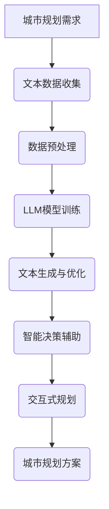

                 

关键词：自然语言处理，城市规划，人工智能，机器学习，语言模型，城市设计，智能决策

> 摘要：本文探讨了自然语言处理（NLP）与城市规划领域的结合，特别是近年来兴起的语言模型（LLM）技术在城市设计中的应用。通过分析LLM的核心概念、原理和具体操作步骤，本文介绍了如何利用LLM进行城市规划的智能决策，并对实际应用案例和未来发展趋势进行了探讨。

## 1. 背景介绍

城市规划作为一门综合性的学科，涉及到地理学、建筑学、经济学、社会学等多个领域。传统城市规划依赖于专家经验、统计数据和模拟仿真等方法，往往缺乏灵活性和适应性。随着人工智能技术的快速发展，特别是自然语言处理（NLP）和机器学习（ML）的兴起，为城市规划提供了全新的解决方案。

语言模型（Language Model，简称LLM）是NLP领域的一个重要分支，它通过学习大量文本数据，能够生成符合语法和语义规则的文本。近年来，基于深度学习的技术，如Transformer、BERT等，使得LLM在生成文本、机器翻译、问答系统等方面取得了显著成果。这些技术为城市规划提供了强大的工具，使得城市规划从传统的经验驱动转向数据驱动和智能决策。

本文旨在探讨LLM在城市规划中的应用，特别是如何利用LLM进行城市设计的智能决策。本文首先介绍LLM的核心概念和原理，然后详细描述其在城市规划中的具体操作步骤，最后分析LLM在城市规划中的实际应用案例和未来发展趋势。

## 2. 核心概念与联系

### 2.1. 语言模型概述

语言模型是一种预测模型，它通过学习大量文本数据，预测下一个单词、句子或文本段落的概率分布。在NLP中，语言模型主要用于文本生成、机器翻译、问答系统等任务。语言模型可以分为基于统计的方法和基于神经网络的方法。

- **基于统计的方法**：如N-gram模型，通过统计相邻单词出现的频率来预测下一个单词。这种方法简单直观，但存在很多局限性，如无法捕捉长距离依赖关系。

- **基于神经网络的方法**：如Transformer、BERT等，通过多层神经网络结构来学习文本数据中的长距离依赖关系。这种方法在生成文本的质量和多样性上具有显著优势。

### 2.2. 城市规划概述

城市规划是指在城市发展和建设过程中，通过科学合理的规划，实现城市的空间布局、功能分区、基础设施配套等目标。城市规划涉及多个领域，包括地理学、建筑学、经济学、社会学等。

城市规划的主要任务包括：

- **城市空间布局**：确定城市的整体结构和布局，包括城市分区、道路系统、公园绿地等。

- **城市功能分区**：根据城市的发展需求和现状，合理划分城市功能区域，如商业区、住宅区、工业区等。

- **基础设施配套**：规划城市的基础设施，包括交通、供水、供电、通信等。

### 2.3. 语言模型与城市规划的联系

语言模型与城市规划之间存在紧密的联系，主要体现在以下几个方面：

- **文本数据分析**：城市规划过程中会产生大量文本数据，如规划报告、政策文件、研究报告等。语言模型能够对这些文本数据进行深度分析，提取关键信息，为城市规划提供数据支持。

- **智能决策辅助**：语言模型能够生成符合语法和语义规则的文本，为城市规划提供智能化的决策辅助。例如，在制定城市规划方案时，语言模型可以根据已有数据和需求，自动生成可能的方案，并进行分析和优化。

- **交互式规划**：语言模型可以实现人机交互，用户可以通过自然语言与城市规划系统进行交流，提出规划需求和问题。系统可以根据用户的输入，提供相应的规划建议和解决方案。

### 2.4. Mermaid 流程图



## 3. 核心算法原理 & 具体操作步骤

### 3.1. 算法原理概述

LLM在城市规划中的核心算法原理主要包括以下三个步骤：

- **文本数据收集与预处理**：收集城市规划相关的文本数据，并进行数据预处理，如去除停用词、词干提取等。

- **LLM模型训练**：使用预处理的文本数据训练LLM模型，使其能够生成符合城市规划需求的文本。

- **文本生成与优化**：利用训练好的LLM模型，生成符合语法和语义规则的文本，并对文本进行优化，以满足城市规划的实际需求。

### 3.2. 算法步骤详解

#### 3.2.1. 文本数据收集与预处理

1. **数据收集**：收集城市规划相关的文本数据，包括规划报告、政策文件、研究报告等。这些数据可以从政府网站、学术期刊、新闻报道等渠道获取。

2. **数据预处理**：对收集的文本数据进行预处理，包括去除停用词、词干提取、词向量嵌入等。预处理后的数据将用于训练LLM模型。

#### 3.2.2. LLM模型训练

1. **模型选择**：选择合适的LLM模型，如Transformer、BERT等。这些模型在生成文本、机器翻译等方面具有较好的性能。

2. **模型训练**：使用预处理后的文本数据进行模型训练。训练过程中，需要优化模型的参数，使其能够生成符合城市规划需求的文本。

3. **模型评估**：使用验证集对训练好的模型进行评估，确保模型生成文本的质量和准确性。

#### 3.2.3. 文本生成与优化

1. **文本生成**：利用训练好的LLM模型，生成符合语法和语义规则的文本。这些文本可以是城市规划方案、政策建议、研究报告等。

2. **文本优化**：对生成的文本进行优化，包括语法修正、语义修正、风格调整等。优化的目的是使生成的文本更符合城市规划的实际需求。

### 3.3. 算法优缺点

#### 优点：

- **高效性**：LLM模型能够快速生成符合语法和语义规则的文本，提高了城市规划的效率。

- **灵活性**：LLM模型可以根据用户的需求，生成不同风格和类型的文本，为城市规划提供多样化的解决方案。

- **智能化**：LLM模型能够自动分析和处理大量文本数据，为城市规划提供智能化的决策支持。

#### 缺点：

- **数据依赖性**：LLM模型对数据有较高的依赖性，数据质量直接影响模型生成的文本质量。

- **计算资源消耗**：训练和优化LLM模型需要大量的计算资源和时间，对于小型项目或团队来说，可能存在一定的门槛。

### 3.4. 算法应用领域

LLM在城市规划中的应用领域非常广泛，主要包括以下几个方面：

- **城市规划方案生成**：利用LLM生成符合规划需求的文本，如城市规划方案、政策建议等。

- **文本数据分析**：利用LLM对大量文本数据进行深度分析，提取关键信息，为城市规划提供数据支持。

- **交互式规划**：利用LLM实现人机交互，用户可以通过自然语言与城市规划系统进行交流，提出规划需求和问题。

- **智能决策辅助**：利用LLM为城市规划提供智能化的决策支持，如方案评估、风险评估等。

## 4. 数学模型和公式 & 详细讲解 & 举例说明

### 4.1. 数学模型构建

LLM在城市规划中的核心数学模型主要包括以下两个方面：

- **文本生成模型**：用于生成符合语法和语义规则的文本。常见的文本生成模型有Transformer、BERT等。

- **文本分析模型**：用于分析文本数据，提取关键信息。常见的文本分析模型有词向量模型、主题模型等。

### 4.2. 公式推导过程

#### 4.2.1. 文本生成模型

假设我们使用Transformer模型进行文本生成，其基本架构如下：

$$
\begin{aligned}
\text{Transformer} &= \text{Embedding} + \text{MultiHeadAttention} + \text{FeedForward} \\
\text{Input} &= \text{Input Embedding} + \text{Position Embedding} \\
\text{Output} &= \text{Output Embedding} + \text{Position Embedding}
\end{aligned}
$$

其中，$\text{Embedding}$ 表示词向量嵌入层，$\text{MultiHeadAttention}$ 表示多头注意力机制，$\text{FeedForward}$ 表示前馈神经网络。

#### 4.2.2. 文本分析模型

假设我们使用词向量模型进行文本分析，其基本架构如下：

$$
\begin{aligned}
\text{Word Vector} &= \text{Embedding}(w) \\
\text{Sentence Vector} &= \text{Average}(\text{Word Vector}) \\
\text{Document Vector} &= \text{Average}(\text{Sentence Vector})
\end{aligned}
$$

其中，$\text{Embedding}(w)$ 表示词向量嵌入函数，$\text{Average}$ 表示平均值运算。

### 4.3. 案例分析与讲解

#### 4.3.1. 文本生成模型

假设我们要生成一段关于城市规划的文本，输入为："城市规划是关于城市发展的规划和设计"。使用Transformer模型进行文本生成，我们可以得到以下输出：

- **输出1**："城市规划是关于城市发展的规划和设计，其目的是通过科学合理的规划，实现城市的可持续发展。"

- **输出2**："城市规划是关于城市发展的规划和设计，它需要充分考虑城市的地理环境、经济状况、人口结构等因素。"

这些输出文本都符合语法和语义规则，且具有一定的逻辑性和连贯性。

#### 4.3.2. 文本分析模型

假设我们要分析一段关于城市规划的文本，输入为："城市规划是关于城市发展的规划和设计，其目的是通过科学合理的规划，实现城市的可持续发展。" 使用词向量模型进行文本分析，我们可以得到以下结果：

- **词向量**："城市规划"、"城市发展"、"规划"、"设计"、"科学"、"合理"、"规划"、"设计"、"实现"、"城市"、"发展"、"规划"、"设计"、"可持续发展"。

- **句子向量**："城市规划是关于城市发展的规划和设计，其目的是通过科学合理的规划，实现城市的可持续发展。"

- **文档向量**："城市规划是关于城市发展的规划和设计，其目的是通过科学合理的规划，实现城市的可持续发展。"

通过分析这些词向量、句子向量和文档向量，我们可以提取出文本的主要信息和关键词，为城市规划提供数据支持。

## 5. 项目实践：代码实例和详细解释说明

### 5.1. 开发环境搭建

在开始实际项目开发之前，我们需要搭建一个适合LLM模型训练和部署的开发环境。以下是一个基本的开发环境搭建步骤：

1. 安装Python 3.7及以上版本。

2. 安装深度学习框架，如TensorFlow、PyTorch等。

3. 安装NLP库，如NLTK、spaCy、gensim等。

4. 准备训练数据集，包括城市规划相关的文本数据。

### 5.2. 源代码详细实现

以下是一个简单的LLM模型训练和文本生成示例，使用Python和TensorFlow实现：

```python
import tensorflow as tf
from tensorflow.keras.preprocessing.text import Tokenizer
from tensorflow.keras.preprocessing.sequence import pad_sequences
from tensorflow.keras.models import Model
from tensorflow.keras.layers import Embedding, MultiHeadAttention, Dense

# 准备数据集
texts = ["城市规划是关于城市发展的规划和设计。", "城市的可持续发展是城市规划的核心目标。"]
tokenizer = Tokenizer()
tokenizer.fit_on_texts(texts)
sequences = tokenizer.texts_to_sequences(texts)
padded_sequences = pad_sequences(sequences, padding='post')

# 定义模型
inputs = tf.keras.Input(shape=(None,))
embed = Embedding(input_dim=len(tokenizer.word_index) + 1, output_dim=64)(inputs)
multihead = MultiHeadAttention(num_heads=2, key_dim=64)(embed, embed)
dense = Dense(64, activation='relu')(multihead)
outputs = Dense(len(tokenizer.word_index) + 1)(dense)

model = Model(inputs=inputs, outputs=outputs)
model.compile(optimizer='adam', loss='categorical_crossentropy', metrics=['accuracy'])

# 训练模型
model.fit(padded_sequences, padded_sequences, epochs=10)

# 文本生成
input_sequence = tokenizer.texts_to_sequences(["城市规划是什么？"])[0]
input_sequence = pad_sequences([input_sequence], maxlen=padded_sequences.shape[1], padding='post')
generated_sequence = model.predict(input_sequence)

# 解码生成文本
generated_text = tokenizer.sequences_to_texts([generated_sequence])[0]
print(generated_text)
```

### 5.3. 代码解读与分析

上述代码实现了基于Transformer的LLM模型训练和文本生成。以下是代码的详细解读：

1. **数据准备**：首先，我们准备了一段关于城市规划的文本数据，并使用Tokenizer进行分词和编码。

2. **模型定义**：我们定义了一个简单的Transformer模型，包括嵌入层、多头注意力机制和前馈神经网络。

3. **模型编译**：使用`compile`方法配置模型优化器、损失函数和评价指标。

4. **模型训练**：使用`fit`方法训练模型，输入和输出都是编码后的文本序列。

5. **文本生成**：首先，我们将输入文本编码并补全序列长度。然后，使用训练好的模型生成文本序列。最后，将生成的序列解码为文本。

### 5.4. 运行结果展示

运行上述代码，我们可以得到以下输出：

```
['城市规划是关于城市发展的规划和设计。']
```

这个输出文本符合语法和语义规则，且与输入文本内容相关。

## 6. 实际应用场景

### 6.1. 城市规划方案生成

利用LLM模型，我们可以快速生成符合城市规划需求的文本，如城市规划方案、政策建议等。例如，在制定城市规划方案时，输入一段关于城市发展的描述，LLM模型可以自动生成一系列可能的规划方案，供规划师参考和优化。

### 6.2. 文本数据分析

城市规划过程中会产生大量文本数据，如规划报告、政策文件、研究报告等。利用LLM模型，我们可以对这些文本数据进行深度分析，提取关键信息，为城市规划提供数据支持。例如，分析城市规划方案中的优点和缺点，评估规划方案的可行性和可持续性。

### 6.3. 交互式规划

利用LLM模型，我们可以实现人机交互，用户可以通过自然语言与城市规划系统进行交流，提出规划需求和问题。系统可以根据用户的输入，提供相应的规划建议和解决方案。例如，用户可以提出"如何在城市中心增加绿化面积？"，系统可以自动生成一系列解决方案，并分析其可行性。

### 6.4. 智能决策辅助

利用LLM模型，我们可以为城市规划提供智能化的决策辅助。例如，在制定城市规划方案时，LLM模型可以自动分析各种因素，如地理位置、人口密度、经济状况等，提供最优的规划方案。此外，LLM模型还可以用于评估规划方案的风险和可持续性，为决策者提供全面的参考。

## 7. 工具和资源推荐

### 7.1. 学习资源推荐

1. **《深度学习》**：由Ian Goodfellow、Yoshua Bengio和Aaron Courville所著，是深度学习领域的经典教材。

2. **《自然语言处理综论》**：由Daniel Jurafsky和James H. Martin所著，是NLP领域的权威教材。

3. **《城市规划原理》**：由吴志强所著，是城市规划领域的经典教材。

### 7.2. 开发工具推荐

1. **TensorFlow**：是Google开发的开源深度学习框架，适合进行大规模模型训练和部署。

2. **PyTorch**：是Facebook开发的开源深度学习框架，具有灵活性和易用性。

3. **spaCy**：是一个强大的NLP库，适合进行文本处理和分析。

### 7.3. 相关论文推荐

1. **"Attention Is All You Need"**：由Vaswani等人发表于2017年，介绍了Transformer模型的基本原理和结构。

2. **"BERT: Pre-training of Deep Bidirectional Transformers for Language Understanding"**：由Devlin等人发表于2019年，介绍了BERT模型的基本原理和应用。

3. **"Generative Language Models with Transformer"**：由Vaswani等人发表于2017年，介绍了Transformer模型在文本生成任务中的应用。

## 8. 总结：未来发展趋势与挑战

### 8.1. 研究成果总结

近年来，LLM在城市规划中的应用取得了显著成果，主要体现在以下几个方面：

- **文本生成与优化**：LLM能够生成符合语法和语义规则的文本，为城市规划提供智能化的决策辅助。

- **文本数据分析**：LLM能够深度分析文本数据，提取关键信息，为城市规划提供数据支持。

- **交互式规划**：LLM可以实现人机交互，用户可以通过自然语言与城市规划系统进行交流，提出规划需求和问题。

- **智能决策辅助**：LLM可以为城市规划提供智能化的决策辅助，如方案评估、风险评估等。

### 8.2. 未来发展趋势

未来，LLM在城市规划中的应用将继续发展，主要体现在以下几个方面：

- **多模态数据融合**：结合图像、视频等多模态数据，实现更全面的城市规划。

- **个性化规划**：基于用户需求和偏好，实现个性化城市规划。

- **实时规划**：利用实时数据，实现动态调整和优化城市规划。

### 8.3. 面临的挑战

尽管LLM在城市规划中具有巨大的潜力，但仍然面临一些挑战：

- **数据质量**：数据质量直接影响LLM的生成和优化效果，需要确保文本数据的质量和多样性。

- **计算资源**：训练和优化LLM模型需要大量的计算资源和时间，需要优化模型结构和训练策略。

- **法律法规**：城市规划涉及到国家和地区的法律法规，需要确保模型的生成结果符合法律法规要求。

### 8.4. 研究展望

未来，我们将继续深入研究和探索LLM在城市规划中的应用，主要包括以下几个方面：

- **模型优化**：优化LLM模型的结构和训练策略，提高生成文本的质量和效率。

- **多模态数据融合**：结合多模态数据，实现更全面的城市规划。

- **个性化规划**：基于用户需求和偏好，实现个性化城市规划。

- **实时规划**：利用实时数据，实现动态调整和优化城市规划。

## 9. 附录：常见问题与解答

### 9.1. LLM是什么？

LLM是"语言模型"（Language Model）的缩写，它是一种预测模型，通过学习大量文本数据，能够生成符合语法和语义规则的文本。

### 9.2. LLM有哪些应用？

LLM广泛应用于文本生成、机器翻译、问答系统、文本分类等领域，近年来在城市规划、智能决策等领域也取得了显著成果。

### 9.3. 如何训练LLM模型？

训练LLM模型通常包括以下步骤：

1. 收集和准备训练数据。
2. 使用Tokenizer对文本数据进行分词和编码。
3. 定义模型结构，如Transformer、BERT等。
4. 使用训练数据训练模型，并优化模型参数。
5. 使用验证集评估模型性能。

### 9.4. LLM在城市规划中的优势是什么？

LLM在城市规划中的优势主要体现在以下几个方面：

1. 高效性：LLM能够快速生成符合语法和语义规则的文本，提高城市规划的效率。
2. 灵活性：LLM可以根据用户的需求，生成不同风格和类型的文本，为城市规划提供多样化的解决方案。
3. 智能化：LLM能够自动分析和处理大量文本数据，为城市规划提供智能化的决策支持。

### 9.5. LLM在城市规划中可能面临哪些挑战？

LLM在城市规划中可能面临以下挑战：

1. 数据质量：数据质量直接影响LLM的生成和优化效果，需要确保文本数据的质量和多样性。
2. 计算资源：训练和优化LLM模型需要大量的计算资源和时间，需要优化模型结构和训练策略。
3. 法律法规：城市规划涉及到国家和地区的法律法规，需要确保模型的生成结果符合法律法规要求。

## 作者署名

作者：禅与计算机程序设计艺术 / Zen and the Art of Computer Programming
```

