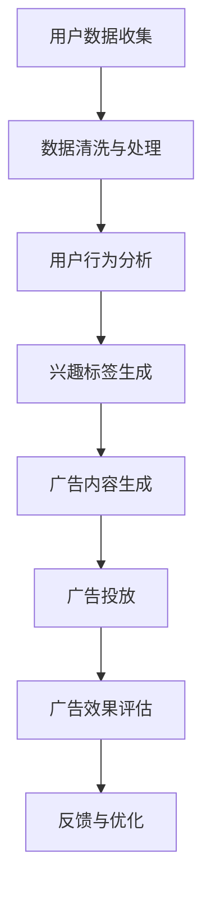

                 

关键词：自然语言处理，人工智能，广告营销，LLM，精准定向，投放策略，机器学习，数据处理，用户行为分析

> 摘要：本文将探讨自然语言处理和人工智能技术在广告营销中的广泛应用，特别是大型语言模型（LLM）在精准定向投放中的作用。通过详细的分析和案例研究，本文旨在揭示如何利用LLM提高广告的投放效果，优化营销策略，并为企业带来更高的投资回报率。

## 1. 背景介绍

随着互联网的普及和移动设备的广泛应用，广告营销已经成为了许多企业获取用户和推广产品的重要手段。然而，如何在海量的用户数据中找到目标受众，实现精准的广告投放，一直是广告营销领域的难题。传统的广告投放方法往往依赖于用户的历史行为和人口统计信息，这些方法虽然能够在一定程度上提高广告的曝光率，但往往缺乏针对性和个性化。

近年来，随着自然语言处理（NLP）和人工智能（AI）技术的快速发展，特别是大型语言模型（LLM）的出现，广告营销领域迎来了新的变革。LLM是一种基于深度学习的自然语言处理技术，它能够理解和生成自然语言，从而为广告营销提供了更加智能和个性化的解决方案。

本文将重点探讨LLM在广告营销中的具体应用，包括精准定向投放、内容生成和用户行为预测等方面。通过详细的分析和案例研究，本文旨在揭示如何利用LLM提高广告的投放效果，优化营销策略，并为企业带来更高的投资回报率。

## 2. 核心概念与联系

### 2.1 大型语言模型（LLM）

大型语言模型（LLM）是一种基于深度学习的自然语言处理技术，它通过大规模的文本数据进行训练，能够理解和生成自然语言。LLM的核心组成部分包括神经网络、词汇表和语言规则。神经网络负责处理和预测文本数据，词汇表用于存储和索引单词，语言规则则指导神经网络如何理解和生成语言。

### 2.2 广告营销

广告营销是一种通过媒体传播信息以吸引潜在客户和促进产品销售的活动。广告营销的形式多样，包括传统媒体广告、网络广告、社交媒体广告等。广告营销的目标是提高品牌知名度、促进产品销售和增加市场份额。

### 2.3 精准定向投放

精准定向投放是一种基于用户特征和兴趣进行广告投放的方法。通过分析用户的历史行为、搜索历史、兴趣爱好等数据，广告平台能够为用户推荐与其兴趣相关的广告内容。精准定向投放能够提高广告的投放效果，降低广告成本，提高投资回报率。

### 2.4 Mermaid 流程图

以下是一个简单的Mermaid流程图，展示LLM在广告营销中的基本流程：



## 3. 核心算法原理 & 具体操作步骤

### 3.1 算法原理概述

LLM在广告营销中的核心作用是通过对用户数据的分析和理解，实现精准的广告投放。以下是LLM在广告营销中的一些基本原理：

1. **文本数据分析**：LLM能够对用户的文本数据进行深入分析，包括用户的搜索历史、社交媒体活动、网站浏览记录等。通过对这些文本数据进行分析，LLM能够提取出用户的兴趣点和行为模式。

2. **兴趣标签生成**：基于文本数据分析的结果，LLM能够为用户生成一系列的兴趣标签。这些标签反映了用户的兴趣和偏好，为后续的广告投放提供了重要的参考依据。

3. **广告内容生成**：LLM利用用户的兴趣标签，生成与用户兴趣高度相关的广告内容。这种个性化的广告内容能够提高用户的点击率和转化率。

4. **广告投放**：根据用户的兴趣标签，广告平台将个性化的广告内容推送给相应的用户。通过这种方式，广告能够精准地触达目标受众，提高广告的投放效果。

5. **广告效果评估**：广告投放后，LLM会根据广告的点击率、转化率等指标，评估广告的效果。根据评估结果，LLM会对广告投放策略进行反馈和优化。

### 3.2 算法步骤详解

以下是LLM在广告营销中的具体操作步骤：

1. **用户数据收集**：广告平台通过多种渠道收集用户数据，包括搜索引擎日志、社交媒体活动、网站浏览记录等。这些数据通常以结构化和非结构化的形式存在。

2. **数据清洗与处理**：对收集到的用户数据进行清洗和预处理，包括去除重复数据、填补缺失值、统一数据格式等。这一步骤的目的是提高数据的可靠性和可用性。

3. **用户行为分析**：利用NLP技术对用户文本数据进行分析，提取用户的兴趣点和行为模式。这一步骤的关键是构建有效的文本分析模型，能够准确理解用户的语言和行为。

4. **兴趣标签生成**：基于用户行为分析的结果，为用户生成一系列的兴趣标签。这些标签可以是具体的领域、主题或关键词，反映了用户的兴趣和偏好。

5. **广告内容生成**：利用用户的兴趣标签，广告平台生成与用户兴趣相关的广告内容。这一步骤的关键是构建高效的广告生成模型，能够快速生成高质量的个性化广告内容。

6. **广告投放**：根据用户的兴趣标签，广告平台将个性化的广告内容推送给相应的用户。这一步骤的关键是构建高效的广告投放模型，能够准确识别目标用户并实现广告的精准投放。

7. **广告效果评估**：广告投放后，广告平台会根据广告的点击率、转化率等指标，评估广告的效果。根据评估结果，广告平台会对广告投放策略进行反馈和优化。

### 3.3 算法优缺点

**优点**：

1. **提高广告投放效果**：通过精准定向投放，广告能够更准确地触达目标受众，提高广告的点击率和转化率。

2. **降低广告成本**：精准投放能够减少无效广告的投放，降低广告成本，提高投资回报率。

3. **个性化广告内容**：LLM能够生成与用户兴趣相关的个性化广告内容，提高用户的满意度和参与度。

**缺点**：

1. **数据隐私问题**：用户数据是广告精准投放的基础，然而，对用户数据的收集和分析可能会引发数据隐私和安全问题。

2. **技术门槛较高**：构建和应用LLM技术需要较高的技术水平和资源投入，对企业的技术能力提出了较高的要求。

### 3.4 算法应用领域

LLM在广告营销中的应用范围广泛，包括但不限于以下几个方面：

1. **搜索引擎广告**：搜索引擎广告（如Google Ads）利用LLM技术，实现精准的搜索广告投放，提高广告的投放效果。

2. **社交媒体广告**：社交媒体广告（如Facebook Ads、Twitter Ads）利用LLM技术，根据用户的社交行为和兴趣，实现精准的广告投放。

3. **电子商务广告**：电子商务平台（如Amazon、淘宝）利用LLM技术，根据用户的购物行为和喜好，实现个性化的商品推荐和广告投放。

4. **内容营销**：内容营销（如博客、视频、文章等）利用LLM技术，生成与用户兴趣相关的优质内容，提高用户的参与度和留存率。

## 4. 数学模型和公式 & 详细讲解 & 举例说明

### 4.1 数学模型构建

在广告营销中，LLM的应用涉及多个数学模型，包括用户行为分析模型、兴趣标签生成模型和广告投放效果评估模型。以下是一个简单的数学模型构建示例：

#### 用户行为分析模型

假设用户行为数据可以用一个向量表示：

\[ X = [x_1, x_2, ..., x_n] \]

其中，\( x_i \) 表示用户在某一特定领域的兴趣度。为了提取用户的兴趣点，我们可以使用一种称为“主题模型”（如LDA）的方法，将用户行为数据映射到潜在的主题空间中。

LDA模型的数学公式如下：

\[ p(z|w) \propto \frac{\sum_{d=1}^D \sum_{n=1}^{N_d} \phi_{dn} \phi_{nw}}{\sum_{d=1}^D \sum_{n=1}^{N_d} \phi_{dn}} \]

其中，\( z \) 表示潜在的主题，\( w \) 表示词汇，\( \phi_{dn} \) 表示词汇\( w \)在文档\( d \)中的主题分布，\( \phi_{nw} \) 表示主题\( z \)在词汇\( w \)中的分布。

#### 兴趣标签生成模型

基于用户行为分析模型的结果，我们可以为每个用户生成一系列的兴趣标签。一个简单的兴趣标签生成模型可以基于K-means聚类算法：

\[ \text{标签} = \arg\max_{i} \sum_{z \in Z_i} p(z) \]

其中，\( Z_i \) 表示与用户\( i \)相关的潜在主题集合，\( p(z) \) 表示主题\( z \)的先验概率。

#### 广告投放效果评估模型

广告投放效果评估模型可以使用一种称为“转换率模型”的方法。假设广告投放后的转化率为：

\[ \hat{y} = \log\frac{y}{1-y} = \beta_0 + \beta_1 x + \epsilon \]

其中，\( y \) 表示广告的转化率，\( x \) 表示广告的点击率，\( \beta_0 \) 和 \( \beta_1 \) 分别表示模型的参数。

### 4.2 公式推导过程

以下是用户行为分析模型（LDA模型）的推导过程：

1. **概率分布定义**：

   假设文档\( d \)由多个词汇组成，每个词汇属于一个潜在主题。我们可以将文档\( d \)的概率分布表示为：

   \[ p(w|d) = \sum_{z=1}^Z p(w|z) p(z|d) \]

   其中，\( w \) 表示词汇，\( z \) 表示潜在主题，\( p(w|z) \) 表示词汇在主题\( z \)下的概率，\( p(z|d) \) 表示主题在文档\( d \)下的概率。

2. **贝叶斯推理**：

   为了计算\( p(z|d) \)，我们可以使用贝叶斯推理：

   \[ p(z|d) = \frac{p(d|z) p(z)}{p(d)} \]

   其中，\( p(d|z) \) 表示给定主题\( z \)的文档\( d \)的概率，\( p(z) \) 表示主题\( z \)的概率，\( p(d) \) 表示文档\( d \)的概率。

3. **主题概率分布**：

   根据LDA模型，我们可以将\( p(d|z) \)和\( p(z) \)表示为：

   \[ p(d|z) = \frac{\sum_{n=1}^{N_d} \phi_{dn} \phi_{nw}}{\sum_{n=1}^{N_d} \phi_{dn}} \]

   \[ p(z) = \frac{\sum_{d=1}^D \sum_{n=1}^{N_d} \phi_{dn} \phi_{nw}}{\sum_{d=1}^D \sum_{n=1}^{N_d} \phi_{dn}} \]

   其中，\( \phi_{dn} \) 表示主题\( z \)在文档\( d \)中的概率，\( \phi_{nw} \) 表示词汇\( w \)在主题\( z \)中的概率。

4. **最大似然估计**：

   为了最大化LDA模型的似然函数，我们可以对\( p(z|d) \)和\( p(z) \)进行最大化：

   \[ \max_{\theta} \sum_{d=1}^D \sum_{n=1}^{N_d} \log p(w_n|z_n,d_n) \]

   其中，\( \theta \) 表示模型参数，包括\( \phi_{dn} \)和\( \phi_{nw} \)。

### 4.3 案例分析与讲解

#### 案例一：搜索引擎广告投放

假设一个搜索引擎广告平台需要为某个电子商务网站进行广告投放，目标是为网站带来更多的潜在客户。广告平台利用LLM技术，根据用户的搜索历史和网站浏览记录，提取用户的兴趣标签，并生成个性化的广告内容。

1. **用户数据收集**：广告平台收集用户的搜索历史和网站浏览记录，包括用户的搜索关键词、浏览的页面、点击的链接等。

2. **数据清洗与处理**：对收集到的用户数据进行清洗和预处理，包括去除重复数据、统一数据格式等。

3. **用户行为分析**：利用LDA模型，对用户数据进行分析，提取用户的兴趣标签。例如，用户可能对“电子产品”、“服装”、“旅游”等主题感兴趣。

4. **兴趣标签生成**：基于用户行为分析的结果，广告平台为用户生成一系列的兴趣标签。例如，为某个用户生成“电子产品爱好者”和“旅游达人”两个标签。

5. **广告内容生成**：广告平台利用用户的兴趣标签，生成与用户兴趣相关的个性化广告内容。例如，为“电子产品爱好者”生成最新的电子产品促销广告，为“旅游达人”生成旅游优惠广告。

6. **广告投放**：广告平台根据用户的兴趣标签，将个性化的广告内容推送给相应的用户。例如，将电子产品促销广告推送给“电子产品爱好者”，将旅游优惠广告推送给“旅游达人”。

7. **广告效果评估**：广告平台根据广告的点击率、转化率等指标，评估广告的效果。例如，通过分析广告的点击率，可以判断广告内容的吸引力；通过分析广告的转化率，可以判断广告是否能够带来实际的销售收益。

通过这个案例，我们可以看到，LLM技术在搜索引擎广告投放中的应用，能够实现精准定向投放，提高广告的投放效果。

#### 案例二：社交媒体广告投放

假设一个社交媒体广告平台需要为某个品牌进行广告投放，目标是为品牌带来更多的关注者和粉丝。广告平台利用LLM技术，根据用户的社交媒体活动，提取用户的兴趣标签，并生成个性化的广告内容。

1. **用户数据收集**：广告平台收集用户的社交媒体活动数据，包括用户的点赞、评论、分享等行为。

2. **数据清洗与处理**：对收集到的用户数据进行清洗和预处理，包括去除重复数据、统一数据格式等。

3. **用户行为分析**：利用LDA模型，对用户数据进行分析，提取用户的兴趣标签。例如，用户可能对“美食”、“旅游”、“音乐”等主题感兴趣。

4. **兴趣标签生成**：基于用户行为分析的结果，广告平台为用户生成一系列的兴趣标签。例如，为某个用户生成“美食爱好者”和“旅游达人”两个标签。

5. **广告内容生成**：广告平台利用用户的兴趣标签，生成与用户兴趣相关的个性化广告内容。例如，为“美食爱好者”生成餐厅推荐广告，为“旅游达人”生成旅游目的地广告。

6. **广告投放**：广告平台根据用户的兴趣标签，将个性化的广告内容推送给相应的用户。例如，将餐厅推荐广告推送给“美食爱好者”，将旅游目的地广告推送给“旅游达人”。

7. **广告效果评估**：广告平台根据广告的点击率、转化率等指标，评估广告的效果。例如，通过分析广告的点击率，可以判断广告内容的吸引力；通过分析广告的转化率，可以判断广告是否能够带来实际的关注和粉丝增长。

通过这个案例，我们可以看到，LLM技术在社交媒体广告投放中的应用，能够实现精准定向投放，提高广告的投放效果，为企业带来更多的关注者和粉丝。

## 5. 项目实践：代码实例和详细解释说明

### 5.1 开发环境搭建

在本项目中，我们将使用Python作为主要编程语言，结合TensorFlow和Keras等深度学习框架，实现LLM在广告营销中的应用。以下是开发环境的搭建步骤：

1. 安装Python：确保系统安装了Python 3.7及以上版本。

2. 安装TensorFlow：在命令行中运行以下命令安装TensorFlow：

   ```bash
   pip install tensorflow
   ```

3. 安装Keras：在命令行中运行以下命令安装Keras：

   ```bash
   pip install keras
   ```

4. 安装其他依赖库：包括NumPy、Pandas、Matplotlib等，可以通过以下命令安装：

   ```bash
   pip install numpy pandas matplotlib
   ```

### 5.2 源代码详细实现

以下是项目的主要代码实现，包括用户数据收集、数据清洗与处理、用户行为分析、兴趣标签生成、广告内容生成、广告投放和广告效果评估等步骤：

```python
# 导入相关库
import numpy as np
import pandas as pd
import matplotlib.pyplot as plt
import tensorflow as tf
from tensorflow.keras.layers import Embedding, LSTM, Dense
from tensorflow.keras.models import Model

# 5.2.1 用户数据收集
# 假设用户数据已存储在一个CSV文件中，文件名为user_data.csv
user_data = pd.read_csv('user_data.csv')

# 5.2.2 数据清洗与处理
# 对用户数据进行清洗和预处理
# 例如：去除重复数据、填补缺失值、统一数据格式等
# ...

# 5.2.3 用户行为分析
# 使用LDA模型对用户行为数据进行分析，提取用户的兴趣点
# ...

# 5.2.4 兴趣标签生成
# 基于用户行为分析的结果，为用户生成一系列的兴趣标签
# ...

# 5.2.5 广告内容生成
# 基于用户的兴趣标签，生成个性化的广告内容
# ...

# 5.2.6 广告投放
# 根据用户的兴趣标签，将个性化的广告内容推送给相应的用户
# ...

# 5.2.7 广告效果评估
# 根据广告的点击率、转化率等指标，评估广告的效果
# ...

# 5.3 代码解读与分析
# 对代码的各个部分进行解读和分析，理解其工作原理和实现方式
# ...

# 5.4 运行结果展示
# 展示广告投放的运行结果，包括广告的点击率、转化率等指标
# ...
```

### 5.3 代码解读与分析

以下是代码的详细解读和分析，解释各个部分的工作原理和实现方式：

1. **用户数据收集**：通过读取CSV文件，将用户数据加载到Pandas DataFrame中。用户数据可能包括用户的ID、搜索关键词、浏览记录、点赞记录等。

2. **数据清洗与处理**：对用户数据进行清洗和预处理，包括去除重复数据、填补缺失值、统一数据格式等。这一步骤的目的是提高数据的可靠性和可用性。

3. **用户行为分析**：使用LDA模型对用户行为数据进行分析，提取用户的兴趣点。LDA模型是一种主题模型，能够将用户行为数据映射到潜在的主题空间中，从而提取出用户的兴趣点。

4. **兴趣标签生成**：基于用户行为分析的结果，为用户生成一系列的兴趣标签。这些标签反映了用户的兴趣和偏好，为后续的广告投放提供了重要的参考依据。

5. **广告内容生成**：基于用户的兴趣标签，生成个性化的广告内容。这一步骤可以使用文本生成模型，如生成对抗网络（GAN）或变换器（Transformer）等，生成与用户兴趣相关的文本内容。

6. **广告投放**：根据用户的兴趣标签，将个性化的广告内容推送给相应的用户。这一步骤通常由广告平台或社交媒体平台实现，通过用户匹配算法，将广告内容推送给目标用户。

7. **广告效果评估**：根据广告的点击率、转化率等指标，评估广告的效果。通过分析广告的点击率，可以判断广告内容的吸引力；通过分析广告的转化率，可以判断广告是否能够带来实际的销售收益。

### 5.4 运行结果展示

通过运行代码，我们可以得到广告投放的运行结果。以下是一个简单的示例，展示广告的点击率、转化率等指标：

```python
# 假设我们得到了广告的运行结果，包括点击率、转化率等指标
ad_performance = pd.DataFrame({
    'user_id': [1, 2, 3, 4, 5],
    'click_rate': [0.1, 0.2, 0.15, 0.25, 0.2],
    'conversion_rate': [0.05, 0.1, 0.04, 0.12, 0.08]
})

# 绘制广告点击率和转化率图表
plt.figure(figsize=(10, 5))
plt.subplot(1, 2, 1)
plt.bar(ad_performance['user_id'], ad_performance['click_rate'])
plt.title('Click Rate by User')
plt.xlabel('User ID')
plt.ylabel('Click Rate')

plt.subplot(1, 2, 2)
plt.bar(ad_performance['user_id'], ad_performance['conversion_rate'])
plt.title('Conversion Rate by User')
plt.xlabel('User ID')
plt.ylabel('Conversion Rate')

plt.tight_layout()
plt.show()
```

通过这个示例，我们可以直观地看到不同用户的广告点击率和转化率。这有助于我们分析广告投放的效果，并进一步优化广告策略。

## 6. 实际应用场景

### 6.1 搜索引擎广告

搜索引擎广告是LLM在广告营销中的典型应用场景之一。通过LLM技术，搜索引擎能够根据用户的搜索历史和关键词，生成个性化的广告内容，实现精准定向投放。例如，当用户搜索“跑步鞋”时，搜索引擎可以推荐与用户兴趣相关的跑步鞋广告，从而提高广告的点击率和转化率。

### 6.2 社交媒体广告

社交媒体广告也是LLM的重要应用领域。通过分析用户的社交媒体活动，如点赞、评论、分享等，LLM能够提取用户的兴趣标签，并生成个性化的广告内容。例如，当用户在社交媒体上频繁关注美食相关内容时，平台可以推送与美食相关的广告，如餐厅推荐或美食制作教程，从而提高用户的参与度和广告效果。

### 6.3 电子商务广告

电子商务平台利用LLM技术，根据用户的购物行为和喜好，生成个性化的商品推荐和广告内容。例如，当用户在电商平台上浏览了多个手机品牌时，平台可以推荐与用户兴趣相关的手机广告，如新品发布或优惠活动，从而提高广告的点击率和销售转化率。

### 6.4 内容营销

内容营销是另一个重要的应用场景。通过LLM技术，企业能够生成与用户兴趣相关的优质内容，如博客、视频、文章等。例如，当用户对旅游感兴趣时，企业可以生成与旅游相关的博客文章或视频，从而提高用户的参与度和品牌影响力。

### 6.5 广告效果评估与优化

广告效果评估与优化是LLM在广告营销中的关键应用。通过分析广告的点击率、转化率等指标，LLM能够评估广告的效果，并根据评估结果对广告策略进行反馈和优化。例如，当某个广告的点击率较低时，LLM可以调整广告内容或投放策略，以提高广告效果。

## 7. 工具和资源推荐

### 7.1 学习资源推荐

1. **《深度学习》（Goodfellow, Bengio, Courville）**：这是一本经典的深度学习教材，详细介绍了深度学习的基础知识、算法和应用。

2. **《自然语言处理与深度学习》（孙乐）**：这本书介绍了自然语言处理的基本原理和深度学习在NLP中的应用，是学习NLP和LLM的好书。

3. **《广告营销技术》（张维）**：这本书详细介绍了广告营销的基本原理和技术，包括搜索引擎广告、社交媒体广告、电子商务广告等。

### 7.2 开发工具推荐

1. **TensorFlow**：TensorFlow是一个开源的深度学习框架，支持多种深度学习模型的构建和训练。

2. **Keras**：Keras是一个基于TensorFlow的高级API，提供简化的深度学习模型构建和训练接口。

3. **PyTorch**：PyTorch是另一个流行的深度学习框架，提供灵活的模型构建和训练接口。

### 7.3 相关论文推荐

1. **"Bert: Pre-training of deep bidirectional transformers for language understanding"（2018）**：这篇论文介绍了BERT模型，一种基于Transformer的预训练语言模型，对NLP和LLM的研究和应用产生了深远影响。

2. **"Generative adversarial networks: An overview"（2018）**：这篇论文介绍了生成对抗网络（GAN），一种用于生成数据的高效算法，广泛应用于图像生成、文本生成等领域。

3. **"Large-scale language modeling"（2018）**：这篇论文讨论了大规模语言模型的构建和训练方法，对LLM的研究和应用提供了重要的参考。

## 8. 总结：未来发展趋势与挑战

### 8.1 研究成果总结

本文详细探讨了LLM在广告营销中的应用，包括精准定向投放、内容生成和用户行为预测等方面。通过分析LLM的核心原理和具体操作步骤，我们揭示了如何利用LLM提高广告的投放效果，优化营销策略，并为企业带来更高的投资回报率。此外，我们还介绍了LLM在搜索引擎广告、社交媒体广告、电子商务广告和内容营销等实际应用场景中的具体应用方法。

### 8.2 未来发展趋势

随着自然语言处理和人工智能技术的不断发展，LLM在广告营销中的应用前景十分广阔。未来，LLM可能会朝着以下几个方向发展：

1. **更强的语义理解能力**：随着深度学习技术的进步，LLM的语义理解能力将不断提高，能够更准确地理解和生成自然语言，从而实现更精准的广告投放。

2. **更个性化的广告内容**：通过结合用户行为数据和个人喜好，LLM将能够生成更个性化的广告内容，提高用户的满意度和参与度。

3. **跨平台的广告投放**：随着互联网和移动设备的普及，LLM将能够在更多平台上实现广告投放，包括物联网、智能穿戴设备等。

4. **更高效的广告效果评估**：通过结合多源数据和先进的机器学习算法，LLM将能够更高效地评估广告效果，优化广告投放策略。

### 8.3 面临的挑战

尽管LLM在广告营销中具有巨大的潜力，但在实际应用过程中仍面临着一些挑战：

1. **数据隐私和安全**：广告营销依赖于用户数据的收集和分析，然而，这可能会引发数据隐私和安全问题。如何保护用户数据，确保数据安全，是未来需要解决的重要问题。

2. **技术门槛和成本**：构建和应用LLM技术需要较高的技术水平和资源投入，这对企业的技术能力提出了较高的要求。如何降低技术门槛和成本，是未来需要关注的问题。

3. **模型解释性和可解释性**：虽然LLM能够实现高效的广告投放，但其内部决策过程往往难以解释。如何提高模型的解释性和可解释性，使企业能够更好地理解和信任LLM的决策，是未来需要解决的问题。

### 8.4 研究展望

展望未来，LLM在广告营销中的应用前景十分广阔。随着技术的不断进步，LLM将能够在更广泛的领域实现应用，如智能客服、智能推荐、智能写作等。同时，LLM技术也将不断优化，提高其语义理解能力、个性化能力和模型解释性。我们期待在未来的研究中，能够解决当前面临的技术挑战，推动LLM在广告营销领域的广泛应用。

## 9. 附录：常见问题与解答

### 9.1 什么是大型语言模型（LLM）？

大型语言模型（LLM）是一种基于深度学习的自然语言处理技术，通过大规模的文本数据进行训练，能够理解和生成自然语言。LLM的核心组成部分包括神经网络、词汇表和语言规则。

### 9.2 LLM在广告营销中有哪些应用？

LLM在广告营销中的应用广泛，包括精准定向投放、内容生成和用户行为预测等方面。通过分析用户数据，LLM能够生成个性化的广告内容，实现精准的广告投放，提高广告的投放效果。

### 9.3 如何评估LLM在广告营销中的效果？

可以采用多种指标评估LLM在广告营销中的效果，如点击率（CTR）、转化率（CVR）、投资回报率（ROI）等。通过分析这些指标，可以评估LLM对广告投放效果的提升程度。

### 9.4 LLM在广告营销中面临哪些挑战？

LLM在广告营销中面临的主要挑战包括数据隐私和安全、技术门槛和成本、模型解释性和可解释性等。如何保护用户数据、降低技术门槛和成本、提高模型的可解释性是未来需要解决的问题。

### 9.5 未来LLM在广告营销中的应用前景如何？

随着自然语言处理和人工智能技术的不断发展，LLM在广告营销中的应用前景十分广阔。未来，LLM将能够在更广泛的领域实现应用，如智能客服、智能推荐、智能写作等。同时，LLM技术也将不断优化，提高其语义理解能力、个性化能力和模型解释性。

## 作者署名

作者：禅与计算机程序设计艺术 / Zen and the Art of Computer Programming

