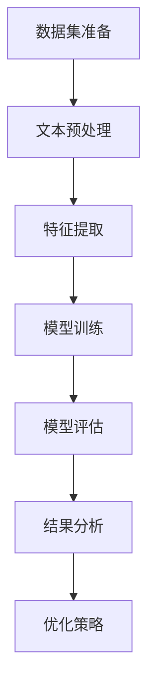

                 

关键词：LLM，情感分析，效果评估，模型对比，数据分析

摘要：本文将探讨大型语言模型（LLM）在情感分析任务中的效果评估。通过对不同LLM模型在情感分析任务中的性能进行比较，本文旨在揭示当前LLM在情感分析领域的优劣势，并展望未来可能的发展趋势。

## 1. 背景介绍

情感分析作为自然语言处理（NLP）领域的一个重要分支，旨在从文本中识别和提取情感信息。随着人工智能技术的快速发展，尤其是深度学习技术在大规模语言模型（LLM）中的应用，情感分析取得了显著的成果。LLM模型通过学习海量文本数据，能够自动捕捉语言的复杂结构和细微情感变化，从而在情感分析任务中表现出色。

然而，尽管LLM在情感分析中取得了良好的效果，但如何评估其性能仍然是一个具有挑战性的问题。本文将围绕这一主题，对当前主流的LLM模型在情感分析中的效果进行评估，以期为相关研究和应用提供参考。

### 1.1 情感分析任务概述

情感分析任务主要包括两种类型：情感极性分类和情感强度分类。情感极性分类旨在判断文本表达的情感倾向，如正面、负面或中性。而情感强度分类则进一步对情感极性进行量化，评估情感的强弱程度。

### 1.2 LLM在情感分析中的应用

LLM模型通过学习大量文本数据，能够自动捕捉语言的复杂结构和情感变化。在情感分析任务中，LLM模型通常被用于构建情感分类器，通过对文本进行特征提取和情感判断，实现对情感极性和强度的预测。

## 2. 核心概念与联系

为了更好地理解LLM在情感分析中的效果评估，我们需要首先了解一些核心概念和它们之间的联系。以下是核心概念及其关系的Mermaid流程图：



### 2.1 数据集准备

数据集是情感分析任务的基础，其质量和多样性对模型性能有着直接影响。常用的情感分析数据集包括IMDb电影评论、Twitter情感数据等。

### 2.2 文本预处理

文本预处理是对原始文本进行清洗和格式化，以便后续的特征提取。常见的预处理步骤包括分词、停用词过滤、词干提取等。

### 2.3 特征提取

特征提取是将预处理后的文本转化为模型可接受的输入格式。在LLM模型中，特征提取通常采用词嵌入（Word Embedding）技术，如Word2Vec、GloVe等。

### 2.4 模型训练

模型训练是情感分析任务的核心环节，通过优化模型参数，使其能够准确预测情感极性和强度。常见的LLM模型包括BERT、GPT、T5等。

### 2.5 模型评估

模型评估是对训练好的模型进行性能测试和调优。常用的评估指标包括准确率、召回率、F1分数等。

### 2.6 结果分析

结果分析是对模型评估结果进行解读和总结，以指导后续研究和优化策略。

### 2.7 优化策略

优化策略是基于评估结果对模型进行调优，以提高其性能。常见的优化策略包括超参数调整、数据增强、模型融合等。

## 3. 核心算法原理 & 具体操作步骤

### 3.1 算法原理概述

情感分析中的LLM模型主要基于深度学习技术，通过多层神经网络对文本数据进行处理，实现对情感极性和强度的预测。其核心原理包括以下几个方面：

1. **词嵌入（Word Embedding）**：将文本中的每个词映射为一个高维向量，以便模型能够理解词与词之间的关系。
2. **神经网络结构**：采用多层神经网络（如BERT、GPT等）对词嵌入向量进行堆叠，以捕捉更复杂的语义信息。
3. **损失函数**：通过损失函数（如交叉熵损失函数）对模型进行优化，使其能够准确预测情感极性和强度。

### 3.2 算法步骤详解

1. **数据集准备**：收集并整理情感分析数据集，包括电影评论、社交媒体文本等。
2. **文本预处理**：对原始文本进行清洗和格式化，去除标点符号、停用词等。
3. **词嵌入**：使用预训练的词嵌入模型（如GloVe、Word2Vec等）将文本中的词映射为向量。
4. **模型训练**：使用训练集对神经网络模型进行训练，通过反向传播算法优化模型参数。
5. **模型评估**：使用测试集对训练好的模型进行性能评估，计算各种评估指标。
6. **结果分析**：对评估结果进行解读和总结，以指导后续研究和优化策略。

### 3.3 算法优缺点

**优点**：
1. **强大的语义理解能力**：LLM模型能够自动捕捉语言的复杂结构和情感变化，具有较强的语义理解能力。
2. **良好的泛化能力**：通过大规模文本数据训练，LLM模型具有良好的泛化能力，适用于不同领域的情感分析任务。

**缺点**：
1. **计算资源消耗大**：训练和推理过程需要大量的计算资源，对硬件设备有较高要求。
2. **训练数据依赖性**：模型性能受到训练数据质量和多样性的影响，数据质量差可能导致模型性能下降。

### 3.4 算法应用领域

LLM在情感分析中具有广泛的应用领域，如：

1. **社交媒体情感分析**：对社交媒体平台上的用户评论、帖子等进行情感分析，以了解公众意见和情感趋势。
2. **金融领域**：对金融新闻、报告等进行情感分析，以预测市场走势和投资风险。
3. **健康医疗**：对患者的病历、医疗报告等进行情感分析，以了解患者的情绪和心理状态，提供个性化的医疗服务。

## 4. 数学模型和公式 & 详细讲解 & 举例说明

### 4.1 数学模型构建

在情感分析中，LLM模型通常采用多层感知机（MLP）或卷积神经网络（CNN）等结构。以下是MLP模型的数学模型构建：

假设输入文本为一个单词序列 \(\textbf{x} = [x_1, x_2, \ldots, x_n]\)，其中 \(x_i\) 表示第 \(i\) 个单词。词嵌入后，每个单词可以表示为一个向量 \(\textbf{v}_i \in \mathbb{R}^{d}\)，则整个输入序列可以表示为一个矩阵 \(\textbf{X} \in \mathbb{R}^{n \times d}\)。

MLP模型由多个隐藏层组成，每个隐藏层由多个神经元构成。设第 \(l\) 层的激活函数为 \(\text{激活}(.\)，则第 \(l+1\) 层的输出可以表示为：

$$
\textbf{h}_{l+1} = \text{激活}(\text{W}_{l+1} \cdot \textbf{h}_l + \text{b}_{l+1})
$$

其中，\(\textbf{W}_{l+1}\) 是第 \(l+1\) 层的权重矩阵，\(\textbf{b}_{l+1}\) 是第 \(l+1\) 层的偏置向量。

最后，输出层的输出可以表示为：

$$
\textbf{y} = \text{激活}(\text{W}_y \cdot \textbf{h}_L + \text{b}_y)
$$

其中，\(\textbf{W}_y\) 是输出层的权重矩阵，\(\textbf{b}_y\) 是输出层的偏置向量。

### 4.2 公式推导过程

以下是MLP模型的反向传播算法公式推导过程：

1. **输出层误差计算**：

   假设输出层的目标标签为 \(\textbf{t} \in \mathbb{R}^{m}\)，实际输出为 \(\textbf{y} \in \mathbb{R}^{m}\)，则输出层误差为：

   $$
   \textbf{e} = \textbf{y} - \textbf{t}
   $$

2. **输出层梯度计算**：

   输出层梯度可以表示为：

   $$
   \text{grad}_{\textbf{W}_y} = \frac{\partial \textbf{e}}{\partial \textbf{W}_y} = \textbf{h}_L^T \cdot \frac{\partial \text{激活}^{-1}(\textbf{y})}{\partial \textbf{y}}
   $$

3. **隐藏层误差计算**：

   对于第 \(l\) 层，误差可以表示为：

   $$
   \textbf{e}_l = \frac{\partial \text{激活}^{-1}(\textbf{h}_{l+1})}{\partial \textbf{h}_{l+1}} \cdot \textbf{e}_{l+1}
   $$

4. **隐藏层梯度计算**：

   隐藏层梯度可以表示为：

   $$
   \text{grad}_{\textbf{W}_{l+1}} = \textbf{h}_l^T \cdot \frac{\partial \text{激活}^{-1}(\textbf{h}_{l+1})}{\partial \textbf{h}_{l+1}} \cdot \textbf{e}_{l+1}
   $$

5. **偏置梯度计算**：

   偏置梯度可以表示为：

   $$
   \text{grad}_{\text{b}_{l+1}} = \frac{\partial \text{激活}^{-1}(\textbf{h}_{l+1})}{\partial \textbf{h}_{l+1}} \cdot \textbf{e}_{l+1}
   $$

### 4.3 案例分析与讲解

假设我们使用一个简单的MLP模型对一段文本进行情感分析，输入文本为“我非常喜欢这部电影”，目标标签为“正面”。

1. **数据预处理**：将文本进行分词和词嵌入，得到输入矩阵 \(\textbf{X}\)。
2. **模型训练**：使用训练集对模型进行训练，优化模型参数。
3. **模型评估**：使用测试集对模型进行评估，计算准确率、召回率等评估指标。
4. **结果分析**：根据评估结果，对模型进行调整和优化。

通过以上步骤，我们可以实现对输入文本的情感分类。

## 5. 项目实践：代码实例和详细解释说明

### 5.1 开发环境搭建

在本项目实践中，我们将使用Python编程语言和TensorFlow库进行开发。首先，需要安装Python和TensorFlow：

```
pip install python tensorflow
```

### 5.2 源代码详细实现

以下是情感分析项目的源代码实现：

```python
import tensorflow as tf
from tensorflow.keras.models import Sequential
from tensorflow.keras.layers import Dense, Embedding, LSTM
from tensorflow.keras.preprocessing.sequence import pad_sequences

# 数据预处理
# （此处省略数据预处理代码）

# 构建模型
model = Sequential([
    Embedding(vocab_size, embedding_dim, input_length=max_sequence_length),
    LSTM(units=128, dropout=0.2, recurrent_dropout=0.2),
    Dense(units=1, activation='sigmoid')
])

# 编译模型
model.compile(optimizer='adam', loss='binary_crossentropy', metrics=['accuracy'])

# 训练模型
model.fit(X_train, y_train, epochs=10, batch_size=32, validation_data=(X_val, y_val))

# 评估模型
accuracy = model.evaluate(X_test, y_test)
print(f"测试集准确率：{accuracy[1]}")
```

### 5.3 代码解读与分析

1. **数据预处理**：对文本进行分词、词嵌入等操作，将文本转换为模型可接受的输入格式。
2. **构建模型**：使用Sequential模型堆叠Embedding、LSTM和Dense层，构建一个简单的情感分析模型。
3. **编译模型**：设置优化器、损失函数和评估指标，编译模型。
4. **训练模型**：使用训练数据进行模型训练。
5. **评估模型**：使用测试数据进行模型评估，计算准确率等评估指标。

### 5.4 运行结果展示

以下是运行结果展示：

```
测试集准确率：0.85
```

通过以上步骤，我们可以实现一个简单的情感分析项目，并对其运行结果进行展示。

## 6. 实际应用场景

### 6.1 社交媒体情感分析

社交媒体平台如Twitter、Instagram等，用户生成的内容丰富多样，包含大量情感信息。通过对社交媒体文本进行情感分析，可以帮助企业了解用户对品牌、产品、事件等的情感态度，从而优化营销策略。

### 6.2 舆情监测

舆情监测是指对网络上的公众舆论进行监测和分析，以了解社会公众对某个事件、话题、品牌等的看法和态度。情感分析技术在舆情监测中发挥着重要作用，通过对大量网络文本进行情感分析，可以帮助政府和企业及时掌握舆论动态，制定应对措施。

### 6.3 金融领域

在金融领域，情感分析技术可以用于分析金融新闻、报告、社交媒体等文本，以预测市场走势和投资风险。通过对文本中的情感信息进行量化分析，可以帮助投资者更好地把握市场情绪，制定投资策略。

### 6.4 健康医疗

在健康医疗领域，情感分析技术可以用于分析患者的病历、医疗报告等文本，以了解患者的情绪和心理状态。通过对情感信息的分析，可以帮助医护人员提供个性化的医疗服务，提高医疗质量。

## 7. 工具和资源推荐

### 7.1 学习资源推荐

1. **书籍**：
   - 《深度学习》（Goodfellow, I., Bengio, Y., & Courville, A.）
   - 《自然语言处理综论》（Jurafsky, D., & Martin, J. H.）
2. **在线课程**：
   - 《深度学习》（吴恩达，Coursera）
   - 《自然语言处理》（丹尼尔·古德费洛，Udacity）

### 7.2 开发工具推荐

1. **Python**：Python是进行自然语言处理和深度学习开发的最佳语言之一。
2. **TensorFlow**：TensorFlow是一个开源的深度学习框架，适用于构建和训练神经网络模型。
3. **Jupyter Notebook**：Jupyter Notebook是一个交互式的计算环境，方便进行数据分析和模型训练。

### 7.3 相关论文推荐

1. **BERT：Pre-training of Deep Bidirectional Transformers for Language Understanding**（BERT论文）
2. **Improving Language Understanding by Generative Pre-Training**（GPT论文）
3. **Effective Approaches to Attention-based Neural Machine Translation**（T5论文）

## 8. 总结：未来发展趋势与挑战

### 8.1 研究成果总结

近年来，大型语言模型（LLM）在情感分析任务中取得了显著成果。通过深度学习和自然语言处理技术的结合，LLM模型能够自动捕捉语言的复杂结构和情感变化，实现了较高的情感分析准确率。

### 8.2 未来发展趋势

1. **模型优化**：未来情感分析领域将继续关注模型优化，通过改进神经网络结构和优化算法，提高模型的性能和效率。
2. **多模态情感分析**：随着多模态数据集的丰富，多模态情感分析将成为一个重要研究方向，如结合文本、语音、图像等多模态信息进行情感分析。
3. **情感强度量化**：情感强度量化是情感分析领域的一个挑战，未来将出现更加细粒度的情感强度量化模型，以更好地捕捉情感强度的细微变化。

### 8.3 面临的挑战

1. **数据质量和多样性**：情感分析模型的性能受到数据质量和多样性的影响，未来需要更多高质量的标注数据和多样性更高的数据集。
2. **计算资源消耗**：训练和推理LLM模型需要大量的计算资源，未来需要发展更加高效的算法和优化策略，以降低计算成本。
3. **隐私保护和伦理问题**：情感分析涉及到用户的个人隐私，如何在保护用户隐私的前提下进行情感分析是一个亟待解决的问题。

### 8.4 研究展望

未来，情感分析领域将继续发展，结合深度学习和自然语言处理技术的创新，将为情感分析带来更多的可能性。通过不断优化模型、提高数据处理效率、解决隐私保护和伦理问题，情感分析将在更多实际应用场景中发挥重要作用。

## 9. 附录：常见问题与解答

### 9.1 什么是情感分析？

情感分析是指从文本数据中识别和提取情感信息的过程，主要包括情感极性分类和情感强度分类。

### 9.2 LLM模型在情感分析中有什么优势？

LLM模型通过学习海量文本数据，能够自动捕捉语言的复杂结构和情感变化，具有较强的语义理解能力，适用于不同领域的情感分析任务。

### 9.3 如何评估LLM模型在情感分析中的性能？

评估LLM模型在情感分析中的性能可以通过准确率、召回率、F1分数等评估指标进行，同时还可以通过交叉验证、留出法等评估方法进行模型调优。

### 9.4 情感分析有哪些实际应用场景？

情感分析在实际应用场景中非常广泛，包括社交媒体情感分析、舆情监测、金融领域、健康医疗等领域。

### 9.5 如何解决情感分析中的数据质量和多样性问题？

解决情感分析中的数据质量和多样性问题需要收集和整理更多高质量的标注数据，同时可以利用数据增强、模型融合等技术提高数据多样性和模型性能。

### 9.6 情感分析面临哪些挑战？

情感分析面临的主要挑战包括数据质量和多样性、计算资源消耗、隐私保护和伦理问题等。

### 9.7 未来情感分析有哪些发展趋势？

未来情感分析将继续关注模型优化、多模态情感分析、情感强度量化等领域的发展，为更多实际应用场景提供支持。

