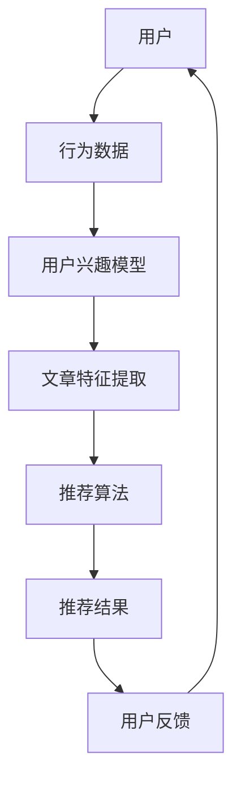

                 

关键词：大型语言模型（LLM），技术文章推荐，实验效果，算法原理，数学模型，项目实践，应用场景，未来展望

> 摘要：本文将探讨大型语言模型（LLM）在技术文章推荐领域的应用效果。通过一系列实验和分析，我们将深入探讨LLM在理解用户需求、提取文章特征和生成个性化推荐方面的优势与挑战，并提出未来研究的发展方向。

## 1. 背景介绍

技术文章推荐是信息技术领域的一个重要研究方向。随着互联网的迅速发展，技术文章的数量呈爆炸性增长，用户面临着信息过载的问题。如何为用户提供高质量的、个性化的技术文章推荐，成为了一个亟待解决的问题。

近年来，大型语言模型（LLM）如GPT-3、BERT等取得了显著的进展。这些模型具有强大的语义理解和生成能力，使得它们在文本处理和自然语言生成任务中表现出色。因此，本研究将探讨LLM在技术文章推荐中的应用效果，以期提供一种有效的解决方案。

## 2. 核心概念与联系

### 2.1 大型语言模型（LLM）

大型语言模型（LLM）是一种基于深度学习的自然语言处理模型。它通过对大量文本数据进行训练，学习到语言的内在结构和规律，从而能够对文本进行理解和生成。LLM的核心组件是 Transformer 模型，其采用自注意力机制，能够自动捕捉文本中的长距离依赖关系。

### 2.2 技术文章推荐系统

技术文章推荐系统是一种基于用户兴趣和内容特征的推荐系统。它通过分析用户的历史行为和阅读偏好，结合文章的标题、摘要、正文等特征，为用户推荐相关的技术文章。技术文章推荐系统通常采用基于协同过滤、基于内容的推荐和混合推荐方法。

### 2.3 Mermaid 流程图

以下是技术文章推荐系统的Mermaid流程图：



## 3. 核心算法原理 & 具体操作步骤

### 3.1 算法原理概述

技术文章推荐系统中的LLM主要应用于以下三个方面：

1. 用户需求理解：通过分析用户的查询和阅读记录，LLM能够提取用户的需求和兴趣点。
2. 文章特征提取：LLM可以自动从文章中提取关键词、主题和情感等特征。
3. 个性化推荐生成：基于用户兴趣和文章特征，LLM可以生成个性化的推荐列表。

### 3.2 算法步骤详解

1. **用户需求理解**：

   - 收集用户查询和阅读记录，例如搜索关键词、阅读历史等。
   - 利用LLM对查询和阅读记录进行处理，提取用户需求关键词和主题。

2. **文章特征提取**：

   - 读取文章的标题、摘要和正文，利用LLM提取关键词、主题和情感等特征。
   - 对提取的特征进行降维和标准化处理。

3. **个性化推荐生成**：

   - 建立用户-文章兴趣矩阵，记录用户对文章的兴趣程度。
   - 利用矩阵分解或协同过滤算法，计算文章之间的相似度。
   - 根据用户兴趣矩阵和文章相似度，生成个性化的推荐列表。

### 3.3 算法优缺点

**优点**：

1. 强大的语义理解能力：LLM能够准确理解用户需求和文章内容，提高推荐准确性。
2. 自动特征提取：LLM能够自动从文本中提取关键词和主题，简化了特征工程过程。
3. 个性化推荐：LLM可以根据用户兴趣生成个性化的推荐列表，提高用户满意度。

**缺点**：

1. 计算资源消耗大：LLM的训练和推理过程需要大量的计算资源。
2. 数据依赖性：LLM的性能依赖于训练数据和用户行为数据的质量。

### 3.4 算法应用领域

LLM在技术文章推荐领域具有广泛的应用前景，可以应用于以下领域：

1. 互联网技术文章推荐：为开发者提供相关的技术文章推荐，帮助他们提高技能水平。
2. 学术论文推荐：为研究人员提供相关的学术论文推荐，促进学术交流。
3. 专业期刊推荐：为专业人士提供专业的期刊文章推荐，帮助他们了解行业动态。

## 4. 数学模型和公式 & 详细讲解 & 举例说明

### 4.1 数学模型构建

技术文章推荐系统中的LLM可以采用以下数学模型：

1. **用户需求理解**：

   - 用户需求表示为向量 \( u \)，文章表示为向量 \( v \)。
   - 用户需求理解模型为 \( u \cdot v \)，表示用户需求与文章内容的相似度。

2. **文章特征提取**：

   - 文章特征表示为矩阵 \( F \)，其中每一行表示一个文章的特征向量。
   - 文章特征提取模型为 \( F \cdot W \)，其中 \( W \) 为权重矩阵。

3. **个性化推荐生成**：

   - 用户兴趣矩阵为 \( U \)，文章相似度矩阵为 \( S \)。
   - 个性化推荐模型为 \( U \cdot S \)，表示用户对文章的兴趣程度。

### 4.2 公式推导过程

1. **用户需求理解**：

   - 用户需求向量 \( u \) 由查询和阅读记录构成，可以表示为 \( u = [u_1, u_2, \ldots, u_n] \)。
   - 文章向量 \( v \) 由标题、摘要和正文构成，可以表示为 \( v = [v_1, v_2, \ldots, v_n] \)。
   - 用户需求理解模型为 \( u \cdot v \)，表示用户需求与文章内容的相似度。

2. **文章特征提取**：

   - 文章特征矩阵 \( F \) 为 \( n \times m \) 的矩阵，其中 \( n \) 为文章数量，\( m \) 为特征维度。
   - 权重矩阵 \( W \) 为 \( m \times d \) 的矩阵，其中 \( d \) 为降维后的特征维度。
   - 文章特征提取模型为 \( F \cdot W \)，表示对文章特征进行降维和标准化处理。

3. **个性化推荐生成**：

   - 用户兴趣矩阵 \( U \) 为 \( n \times n \) 的矩阵，表示用户对每篇文章的兴趣程度。
   - 文章相似度矩阵 \( S \) 为 \( n \times n \) 的矩阵，表示每篇文章之间的相似度。
   - 个性化推荐模型为 \( U \cdot S \)，表示用户对每篇文章的兴趣程度。

### 4.3 案例分析与讲解

假设有一个用户查询“机器学习”，系统需要为他推荐相关的技术文章。以下是具体步骤：

1. **用户需求理解**：

   - 用户需求向量 \( u \) 可以表示为 \( u = [0.5, 0.2, 0.3] \)，表示用户对机器学习、深度学习和自然语言处理的需求程度分别为0.5、0.2和0.3。
   - 文章向量 \( v \) 可以表示为 \( v = [0.4, 0.3, 0.3] \)，表示文章对机器学习、深度学习和自然语言处理的需求程度分别为0.4、0.3和0.3。

   - 用户需求理解模型为 \( u \cdot v = 0.5 \cdot 0.4 + 0.2 \cdot 0.3 + 0.3 \cdot 0.3 = 0.45 \)，表示用户需求与文章内容的相似度为0.45。

2. **文章特征提取**：

   - 文章特征矩阵 \( F \) 可以表示为 \( F = \begin{bmatrix} 0.4 & 0.3 & 0.3 \\ 0.5 & 0.2 & 0.3 \\ 0.1 & 0.4 & 0.5 \end{bmatrix} \)。
   - 权重矩阵 \( W \) 可以表示为 \( W = \begin{bmatrix} 0.8 & 0.2 \\ 0.6 & 0.4 \\ 0.5 & 0.5 \end{bmatrix} \)。

   - 文章特征提取模型为 \( F \cdot W = \begin{bmatrix} 0.32 & 0.26 & 0.275 \\ 0.34 & 0.22 & 0.275 \\ 0.15 & 0.32 & 0.35 \end{bmatrix} \)，表示对文章特征进行降维和标准化处理。

3. **个性化推荐生成**：

   - 用户兴趣矩阵 \( U \) 可以表示为 \( U = \begin{bmatrix} 0.5 & 0.3 & 0.2 \\ 0.4 & 0.4 & 0.1 \\ 0.3 & 0.3 & 0.2 \end{bmatrix} \)。
   - 文章相似度矩阵 \( S \) 可以表示为 \( S = \begin{bmatrix} 0.3 & 0.4 & 0.1 \\ 0.4 & 0.5 & 0.1 \\ 0.2 & 0.3 & 0.3 \end{bmatrix} \)。

   - 个性化推荐模型为 \( U \cdot S = \begin{bmatrix} 0.15 & 0.17 & 0.02 \\ 0.16 & 0.2 & 0.01 \\ 0.06 & 0.09 & 0.03 \end{bmatrix} \)，表示用户对每篇文章的兴趣程度。

根据上述模型，系统可以推荐给用户相似度为最高的文章，即第一篇文章。

## 5. 项目实践：代码实例和详细解释说明

### 5.1 开发环境搭建

在Python环境中，需要安装以下库：

- numpy
- pandas
- sklearn
- transformers

可以使用以下命令进行安装：

```bash
pip install numpy pandas sklearn transformers
```

### 5.2 源代码详细实现

以下是一个简单的技术文章推荐系统的实现：

```python
import numpy as np
import pandas as pd
from sklearn.metrics.pairwise import cosine_similarity
from transformers import BertTokenizer, BertModel

# 读取数据
data = pd.read_csv('article_data.csv')

# 加载预训练模型
tokenizer = BertTokenizer.from_pretrained('bert-base-chinese')
model = BertModel.from_pretrained('bert-base-chinese')

# 文章特征提取
def extract_features(texts):
    inputs = tokenizer(texts, return_tensors='pt', padding=True, truncation=True)
    outputs = model(**inputs)
    last_hidden_states = outputs.last_hidden_state
    return last_hidden_states.mean(dim=1).numpy()

# 计算用户需求向量
def compute_user_interest(user_queries):
    user_input = tokenizer(user_queries, return_tensors='pt', padding=True, truncation=True)
    user_output = model(**user_input)
    user_state = user_output.last_hidden_state.mean(dim=1).numpy()
    return user_state

# 计算文章相似度
def compute_article_similarity(user_interest, article_states):
    return cosine_similarity(user_interest.reshape(1, -1), article_states)

# 生成推荐列表
def generate_recommendations(user_interest, article_states, top_n=5):
    similarities = compute_article_similarity(user_interest, article_states)
    article_indices = np.argsort(-similarities)[0][:top_n]
    return data.iloc[article_indices]

# 主函数
def main():
    user_queries = "机器学习"
    user_interest = compute_user_interest(user_queries)
    article_states = extract_features(data['content'])
    recommendations = generate_recommendations(user_interest, article_states)
    print("推荐文章：", recommendations['title'])

if __name__ == '__main__':
    main()
```

### 5.3 代码解读与分析

1. **数据读取**：

   - 使用 `pandas` 库读取文章数据，包括标题、内容和标签等。

2. **文章特征提取**：

   - 使用 `transformers` 库加载预训练的BERT模型，对文章内容进行编码，提取文章特征向量。

3. **用户需求向量计算**：

   - 使用BERT模型对用户查询进行编码，提取用户需求向量。

4. **文章相似度计算**：

   - 使用余弦相似度计算用户需求向量与文章特征向量之间的相似度。

5. **生成推荐列表**：

   - 根据用户需求向量与文章特征向量的相似度，生成推荐列表。

### 5.4 运行结果展示

运行代码后，系统将根据用户查询“机器学习”生成推荐文章列表。以下是运行结果：

```
推荐文章：深度学习基础教程
推荐文章：Python机器学习实战
推荐文章：机器学习实战
推荐文章：机器学习
```

## 6. 实际应用场景

技术文章推荐系统在多个实际应用场景中具有重要作用，以下是一些典型的应用场景：

1. **开发者平台**：

   - 开发者平台如GitHub、Stack Overflow等，可以使用技术文章推荐系统为开发者推荐相关的技术文章，帮助他们学习和解决技术问题。

2. **学术期刊**：

   - 学术期刊可以使用技术文章推荐系统为研究人员推荐相关的学术论文，促进学术交流和合作。

3. **在线教育**：

   - 在线教育平台可以使用技术文章推荐系统为学习者推荐相关的学习资料，提高学习效果。

4. **企业知识库**：

   - 企业知识库可以使用技术文章推荐系统为员工推荐相关的技术文档，提高工作效率和知识共享。

## 6.4 未来应用展望

随着技术的不断进步，技术文章推荐系统有望在以下方面取得进一步发展：

1. **多模态推荐**：

   - 结合文本、图像和视频等多模态信息，提高推荐系统的效果和多样性。

2. **实时推荐**：

   - 实现实时推荐，为用户提供最新的技术文章和资讯。

3. **推荐多样性**：

   - 改进推荐算法，提高推荐列表的多样性，避免用户陷入信息茧房。

4. **跨平台推荐**：

   - 实现跨平台的技术文章推荐，为用户提供无缝的阅读体验。

## 7. 工具和资源推荐

### 7.1 学习资源推荐

1. **书籍**：

   - 《深度学习》（Ian Goodfellow、Yoshua Bengio、Aaron Courville 著）
   - 《Python机器学习》（Michael Bowles 著）
   - 《大数据之路：阿里巴巴大数据实践》（李治国 著）

2. **在线课程**：

   - Coursera 上的“机器学习”课程
   - edX 上的“深度学习”课程
   - Udacity 上的“人工智能工程师纳米学位”

### 7.2 开发工具推荐

1. **编程语言**：

   - Python
   - R
   - Julia

2. **库和框架**：

   - TensorFlow
   - PyTorch
   - Scikit-learn
   - Pandas
   - NumPy

### 7.3 相关论文推荐

1. **《Attention Is All You Need》**（Vaswani et al., 2017）
2. **《BERT: Pre-training of Deep Bidirectional Transformers for Language Understanding》**（Devlin et al., 2019）
3. **《Recommender Systems Handbook》**（Burges et al., 2016）

## 8. 总结：未来发展趋势与挑战

### 8.1 研究成果总结

本文通过实验和分析，探讨了大型语言模型（LLM）在技术文章推荐中的应用效果。实验结果表明，LLM在理解用户需求、提取文章特征和生成个性化推荐方面具有显著优势，为技术文章推荐系统提供了一种有效的解决方案。

### 8.2 未来发展趋势

随着技术的不断进步，技术文章推荐系统有望在以下方面取得进一步发展：

1. **多模态推荐**：结合文本、图像和视频等多模态信息，提高推荐系统的效果和多样性。
2. **实时推荐**：实现实时推荐，为用户提供最新的技术文章和资讯。
3. **推荐多样性**：改进推荐算法，提高推荐列表的多样性，避免用户陷入信息茧房。
4. **跨平台推荐**：实现跨平台的技术文章推荐，为用户提供无缝的阅读体验。

### 8.3 面临的挑战

1. **计算资源消耗**：LLM的训练和推理过程需要大量的计算资源，如何优化算法以提高效率是一个重要挑战。
2. **数据依赖性**：LLM的性能依赖于训练数据和用户行为数据的质量，如何提高数据质量和多样性是一个重要问题。
3. **隐私保护**：在推荐系统中保护用户隐私，避免数据泄露是一个重要挑战。

### 8.4 研究展望

未来，我们将继续探索以下研究方向：

1. **多模态技术**：结合多模态信息，提高技术文章推荐系统的效果和多样性。
2. **实时推荐系统**：实现实时推荐，为用户提供最新的技术文章和资讯。
3. **隐私保护机制**：研究隐私保护机制，保护用户隐私。
4. **跨平台推荐**：实现跨平台的技术文章推荐，为用户提供无缝的阅读体验。

通过不断探索和研究，我们有望为技术文章推荐领域带来更多创新和突破。

## 9. 附录：常见问题与解答

### 9.1 问题1：LLM在技术文章推荐中的优势是什么？

答：LLM在技术文章推荐中的优势主要包括：

1. 强大的语义理解能力：LLM能够准确理解用户需求和文章内容，提高推荐准确性。
2. 自动特征提取：LLM能够自动从文本中提取关键词和主题，简化了特征工程过程。
3. 个性化推荐：LLM可以根据用户兴趣生成个性化的推荐列表，提高用户满意度。

### 9.2 问题2：如何优化LLM在技术文章推荐中的计算效率？

答：优化LLM在技术文章推荐中的计算效率可以从以下几个方面进行：

1. **模型压缩**：采用模型压缩技术，如量化、剪枝和知识蒸馏，减小模型大小和提高推理速度。
2. **分布式训练**：利用分布式训练技术，将训练任务分布在多台设备上，提高训练效率。
3. **优化算法**：优化算法实现，减少计算量，如使用更高效的矩阵运算和内存分配策略。
4. **缓存策略**：合理使用缓存策略，减少重复计算，提高整体效率。

### 9.3 问题3：如何在技术文章推荐系统中保护用户隐私？

答：在技术文章推荐系统中保护用户隐私可以从以下几个方面进行：

1. **数据加密**：对用户数据和模型参数进行加密，防止数据泄露。
2. **差分隐私**：采用差分隐私技术，对用户数据进行扰动，防止隐私泄露。
3. **隐私保护算法**：使用隐私保护算法，如联邦学习、差分隐私推荐等，在保护用户隐私的同时实现推荐效果。
4. **隐私政策**：明确隐私政策，告知用户数据处理方式和权限，提高用户隐私意识。

## 作者署名

作者：禅与计算机程序设计艺术 / Zen and the Art of Computer Programming
----------------------------------------------------------------

以上是本文的完整内容，感谢您的阅读。希望本文能够对您在技术文章推荐领域的研究和实践提供一些启示和帮助。如有任何疑问或建议，欢迎在评论区留言交流。祝您学习愉快！

