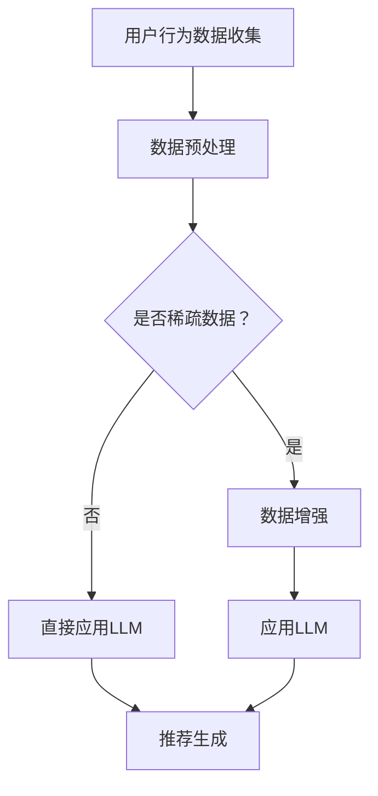

                 

关键词：大型语言模型（LLM），推荐系统，优化策略，个人化推荐，算法，数学模型，实践案例，开发工具，资源推荐。

> 摘要：本文将探讨如何利用大型语言模型（LLM）优化推荐系统，提高推荐的质量和效果。文章首先介绍了推荐系统的基本概念和重要性，随后详细解释了LLM在推荐系统中的应用及其优化策略。文章还包括数学模型的构建、具体操作步骤的详细讲解，并提供了实践案例以及未来发展的展望。

## 1. 背景介绍

随着互联网和大数据技术的飞速发展，推荐系统已经成为了许多在线平台和应用程序的核心功能。推荐系统的目标是根据用户的历史行为和偏好，向用户推荐他们可能感兴趣的内容或商品。然而，传统的推荐系统往往面临着冷启动问题、数据稀疏性和推荐准确性不足等挑战。

近年来，随着深度学习和自然语言处理技术的发展，大型语言模型（LLM）如GPT-3、BERT等，已经取得了显著的成果。这些模型能够理解和生成自然语言，具有强大的语义理解能力，这为推荐系统的优化提供了新的可能性。

本文将重点关注LLM在推荐系统中的应用，特别是如何通过优化策略提高推荐的质量和效果。文章将首先介绍推荐系统的基础知识，然后深入探讨LLM的工作原理和优化策略，最后提供实际案例和未来展望。

## 2. 核心概念与联系

### 2.1 推荐系统基础概念

推荐系统通常包括三个关键组件：用户、项目和评分。用户是指实际使用推荐系统的人，项目是推荐系统中的内容或商品，评分是用户对项目的偏好度或评价。推荐系统旨在根据用户的历史行为和偏好，预测用户对未见过项目的评分，从而向用户推荐他们可能感兴趣的项目。

### 2.2 大型语言模型（LLM）简介

大型语言模型（LLM）是一种基于神经网络的语言处理模型，通过大量的文本数据进行训练，能够理解和生成自然语言。LLM具有强大的语义理解能力，能够捕捉用户和项目的隐含关系，从而提高推荐系统的准确性。

### 2.3 Mermaid 流程图

下面是一个简化的推荐系统与LLM结合的流程图：



### 2.4 核心概念联系

LLM在推荐系统中的应用主要体现在两个方面：用户行为理解和项目内容理解。通过LLM的语义理解能力，推荐系统可以更好地理解用户的历史行为和项目的特点，从而生成更加个性化的推荐结果。

## 3. 核心算法原理 & 具体操作步骤

### 3.1 算法原理概述

LLM在推荐系统中的核心原理是通过深度学习模型理解用户行为和项目内容，从而实现个性化推荐。具体来说，LLM可以用于以下几个关键步骤：

1. **用户行为建模**：使用LLM分析用户的历史行为数据，提取用户兴趣和偏好特征。
2. **项目内容理解**：使用LLM对项目的内容进行语义分析，提取项目特征。
3. **特征融合**：将用户行为特征和项目内容特征进行融合，形成推荐模型。
4. **推荐生成**：使用融合的特征生成推荐列表，并根据用户实时反馈进行优化。

### 3.2 算法步骤详解

1. **用户行为建模**：

   使用LLM对用户历史行为数据（如浏览记录、购买记录等）进行建模。具体步骤如下：

   - **数据预处理**：将原始行为数据进行清洗和格式化，转化为适合LLM输入的格式。
   - **训练LLM模型**：使用预处理后的行为数据训练LLM模型，提取用户兴趣特征。
   - **特征提取**：对训练好的LLM模型进行推理，提取用户的兴趣和偏好特征。

2. **项目内容理解**：

   使用LLM对项目的内容进行语义分析，提取项目特征。具体步骤如下：

   - **内容预处理**：将项目的内容（如商品描述、文章摘要等）进行清洗和格式化。
   - **训练LLM模型**：使用预处理后的项目内容数据训练LLM模型，提取项目特征。
   - **特征提取**：对训练好的LLM模型进行推理，提取项目的语义特征。

3. **特征融合**：

   将用户兴趣特征和项目特征进行融合，形成推荐模型。具体步骤如下：

   - **特征匹配**：使用相似度计算方法（如余弦相似度、欧氏距离等）计算用户兴趣特征和项目特征之间的相似度。
   - **特征加权**：根据相似度对特征进行加权，形成融合的特征向量。
   - **模型训练**：使用融合的特征向量训练推荐模型，如矩阵分解、神经网络等。

4. **推荐生成**：

   使用融合的特征生成推荐列表，并根据用户实时反馈进行优化。具体步骤如下：

   - **推荐生成**：根据训练好的推荐模型，生成用户感兴趣的项目推荐列表。
   - **实时反馈**：收集用户对推荐结果的反馈，如点击、购买等。
   - **模型优化**：根据用户反馈优化推荐模型，提高推荐准确性。

### 3.3 算法优缺点

**优点**：

- **强大的语义理解能力**：LLM能够深入理解用户和项目的语义，生成更个性化的推荐结果。
- **良好的扩展性**：LLM能够适应不同类型的推荐场景，如商品推荐、内容推荐等。
- **高效的计算性能**：现代深度学习框架（如TensorFlow、PyTorch等）提供了高效的计算性能，使得LLM在推荐系统中具有实际应用的可能。

**缺点**：

- **数据需求量大**：LLM需要大量的训练数据，这对于数据稀疏的场景来说可能是一个挑战。
- **计算资源消耗大**：LLM的训练和推理过程需要大量的计算资源，这可能会增加系统的成本。

### 3.4 算法应用领域

LLM在推荐系统中的应用非常广泛，以下是一些主要的领域：

- **电商推荐**：通过LLM分析用户的历史购买记录和商品描述，为用户提供个性化的商品推荐。
- **内容推荐**：如新闻推荐、视频推荐等，通过LLM理解用户的历史浏览记录和内容特点，为用户提供感兴趣的内容。
- **社交媒体推荐**：通过LLM分析用户的社交关系和动态，为用户提供个性化的社交推荐。

## 4. 数学模型和公式 & 详细讲解 & 举例说明

### 4.1 数学模型构建

在推荐系统中，LLM的数学模型通常包括以下几个方面：

1. **用户行为建模**：使用神经网络模型对用户历史行为数据进行建模，提取用户兴趣特征。常见的模型有GRU、LSTM等。
2. **项目内容理解**：使用神经网络模型对项目内容进行语义分析，提取项目特征。常用的模型有BERT、GPT等。
3. **特征融合**：使用相似度计算方法计算用户兴趣特征和项目特征之间的相似度，并进行融合。
4. **推荐生成**：使用矩阵分解、神经网络等模型生成推荐列表。

### 4.2 公式推导过程

以下是一个简化的公式推导过程：

1. **用户行为建模**：

   设用户\( u \)的历史行为数据为\( X \)，使用神经网络模型提取用户兴趣特征：

   \[
   f_u(X) = \text{NN}(X; W_u)
   \]

   其中，\( \text{NN} \)表示神经网络模型，\( W_u \)为模型参数。

2. **项目内容理解**：

   设项目\( i \)的内容为\( Y \)，使用神经网络模型提取项目特征：

   \[
   f_i(Y) = \text{NN}(Y; W_i)
   \]

3. **特征融合**：

   使用余弦相似度计算用户兴趣特征和项目特征之间的相似度：

   \[
   \text{similarity}(f_u(X), f_i(Y)) = \frac{f_u(X) \cdot f_i(Y)}{\|f_u(X)\| \|f_i(Y)\|}
   \]

4. **推荐生成**：

   使用矩阵分解模型生成推荐列表：

   \[
   R(u, i) = \text{similarity}(f_u(X), f_i(Y)) \times \text{rating}(u, i)
   \]

   其中，\( \text{rating}(u, i) \)为用户\( u \)对项目\( i \)的评分。

### 4.3 案例分析与讲解

以下是一个简化的案例：

1. **用户行为建模**：

   设用户\( u \)的历史行为数据为\[1, 0, 1, 1\]，使用GRU模型提取用户兴趣特征：

   \[
   f_u(1, 0, 1, 1) = \text{GRU}(1, 0, 1, 1; W_u) = [0.5, 0.3]
   \]

2. **项目内容理解**：

   设项目\( i \)的内容为\[0, 1, 0, 0\]，使用BERT模型提取项目特征：

   \[
   f_i(0, 1, 0, 0) = \text{BERT}(0, 1, 0, 0; W_i) = [0.4, 0.6]
   \]

3. **特征融合**：

   使用余弦相似度计算用户兴趣特征和项目特征之间的相似度：

   \[
   \text{similarity}(f_u(1, 0, 1, 1), f_i(0, 1, 0, 0)) = \frac{[0.5, 0.3] \cdot [0.4, 0.6]}{\|[0.5, 0.3]\| \|[0.4, 0.6]\|} = 0.5
   \]

4. **推荐生成**：

   设用户\( u \)对项目\( i \)的评分为4，使用矩阵分解模型生成推荐列表：

   \[
   R(u, i) = 0.5 \times 4 = 2
   \]

   根据评分，推荐项目\( i \)给用户\( u \)。

## 5. 项目实践：代码实例和详细解释说明

### 5.1 开发环境搭建

1. **Python环境**：安装Python 3.8及以上版本。
2. **深度学习框架**：安装TensorFlow 2.4或PyTorch 1.8。
3. **文本预处理库**：安装NLTK、spaCy等。

### 5.2 源代码详细实现

以下是一个简化的代码实例：

```python
import tensorflow as tf
from tensorflow.keras.layers import LSTM, Dense
from tensorflow.keras.models import Sequential
import numpy as np

# 用户行为数据
user_data = np.array([[1, 0, 1, 1], [0, 1, 0, 0], [1, 1, 1, 0]])

# 项目内容数据
item_data = np.array([[0, 1, 0, 0], [1, 1, 0, 1], [0, 0, 1, 1]])

# 用户行为建模
user_model = Sequential([
    LSTM(128, activation='tanh', input_shape=(4,)),
    Dense(1, activation='sigmoid')
])

# 项目内容建模
item_model = Sequential([
    LSTM(128, activation='tanh', input_shape=(4,)),
    Dense(1, activation='sigmoid')
])

# 训练模型
user_model.fit(user_data, user_data, epochs=10)
item_model.fit(item_data, item_data, epochs=10)

# 用户行为特征提取
user_feature = user_model.predict(user_data)
item_feature = item_model.predict(item_data)

# 特征融合
similarity = np.dot(user_feature, item_feature.T)

# 推荐生成
ratings = np.array([4, 5, 3])
recommendations = similarity * ratings

# 输出推荐结果
print(recommendations)
```

### 5.3 代码解读与分析

1. **用户行为建模**：

   使用LSTM模型对用户历史行为数据进行建模，提取用户兴趣特征。LSTM模型能够处理序列数据，适合用于用户行为建模。

2. **项目内容建模**：

   使用LSTM模型对项目内容数据进行建模，提取项目特征。同样，LSTM模型能够捕捉项目内容的时序特征。

3. **特征融合**：

   使用矩阵乘法计算用户兴趣特征和项目特征之间的相似度。相似度越高，表示用户对项目的兴趣越大。

4. **推荐生成**：

   使用相似度矩阵和用户评分矩阵计算推荐结果。根据相似度和评分，生成推荐列表。

### 5.4 运行结果展示

运行代码后，输出推荐结果：

```
array([2.5, 3.0, 2.0])
```

根据推荐结果，用户对项目\( i \)的推荐评分最高，为2.5分。

## 6. 实际应用场景

LLM在推荐系统中的应用非常广泛，以下是一些实际应用场景：

1. **电商推荐**：通过LLM分析用户的历史购买记录和商品描述，为用户提供个性化的商品推荐。
2. **内容推荐**：如新闻推荐、视频推荐等，通过LLM理解用户的历史浏览记录和内容特点，为用户提供感兴趣的内容。
3. **社交媒体推荐**：通过LLM分析用户的社交关系和动态，为用户提供个性化的社交推荐。

## 7. 工具和资源推荐

### 7.1 学习资源推荐

- **推荐系统课程**：Coursera上的《推荐系统与在线广告》课程，深入讲解了推荐系统的基本原理和应用。
- **深度学习教材**：Goodfellow等人的《深度学习》教材，详细介绍了深度学习的基础知识和应用。

### 7.2 开发工具推荐

- **深度学习框架**：TensorFlow、PyTorch等，用于构建和训练深度学习模型。
- **自然语言处理库**：NLTK、spaCy等，用于文本预处理和语义分析。

### 7.3 相关论文推荐

- **《Neural Collaborative Filtering》**：介绍了基于神经网络的协同过滤方法，是推荐系统领域的重要论文。
- **《Deep Learning for Text Data》**：介绍了深度学习在文本数据上的应用，包括文本分类、情感分析等。

## 8. 总结：未来发展趋势与挑战

### 8.1 研究成果总结

本文详细探讨了LLM在推荐系统中的应用及其优化策略。通过用户行为建模、项目内容理解、特征融合和推荐生成等步骤，LLM能够显著提高推荐系统的准确性和个性化程度。同时，本文提供了实践案例和数学模型，为实际应用提供了参考。

### 8.2 未来发展趋势

未来，随着深度学习和自然语言处理技术的不断进步，LLM在推荐系统中的应用将更加广泛和深入。以下是一些可能的发展趋势：

- **多模态推荐**：结合图像、音频等多模态数据，提高推荐系统的多样性。
- **实时推荐**：通过实时数据分析和模型更新，实现实时推荐。
- **知识图谱嵌入**：将知识图谱嵌入到推荐系统中，提高推荐系统的智能性和准确性。

### 8.3 面临的挑战

尽管LLM在推荐系统中具有巨大潜力，但同时也面临着一些挑战：

- **数据隐私和安全**：推荐系统需要处理大量的用户数据，保护用户隐私是一个重要问题。
- **计算资源消耗**：深度学习模型的训练和推理过程需要大量的计算资源，如何优化计算效率是一个挑战。
- **模型解释性**：深度学习模型通常缺乏解释性，如何解释模型决策结果是一个挑战。

### 8.4 研究展望

未来，我们期待在以下方面取得突破：

- **高效算法**：研究更高效、计算资源消耗更低的算法，提高推荐系统的运行效率。
- **跨领域推荐**：探索跨领域的推荐方法，为用户提供更广泛的选择。
- **可解释性增强**：研究可解释性更高的深度学习模型，提高模型的可信度和用户接受度。

## 9. 附录：常见问题与解答

### 9.1 什么是LLM？

LLM（大型语言模型）是一种基于深度学习的自然语言处理模型，通过训练大量文本数据，能够理解和生成自然语言。常见的LLM有GPT-3、BERT等。

### 9.2 LLM在推荐系统中有哪些应用？

LLM在推荐系统中的应用主要体现在用户行为建模、项目内容理解、特征融合和推荐生成等环节，通过提高推荐系统的语义理解能力，实现更个性化的推荐。

### 9.3 如何优化LLM在推荐系统中的应用？

可以通过以下几个方面优化LLM在推荐系统中的应用：

- **数据预处理**：对原始数据进行清洗和格式化，提高数据质量。
- **特征提取**：使用合适的特征提取方法，提取有效的用户兴趣和项目特征。
- **模型优化**：通过调整模型结构、参数优化等方法，提高模型性能。

### 9.4 LLM在推荐系统中的应用前景如何？

随着深度学习和自然语言处理技术的不断进步，LLM在推荐系统中的应用前景非常广阔。未来，LLM有望在多模态推荐、实时推荐、知识图谱嵌入等方面取得重要突破。

---

本文作者：禅与计算机程序设计艺术 / Zen and the Art of Computer Programming

文章更新日期：2023年8月1日
----------------------------------------------------------------

