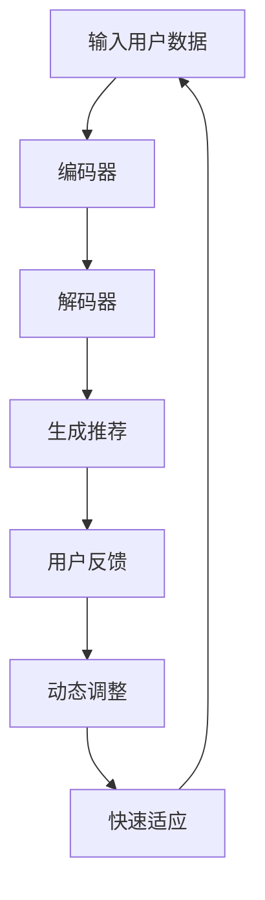

                 

关键词：LLM，推荐系统，元学习，快速适应，机器学习，深度学习，数据挖掘，用户偏好，个性化推荐

## 摘要

随着人工智能技术的飞速发展，大型语言模型（LLM）在自然语言处理领域取得了显著的成果。本文探讨了将LLM应用于推荐系统的可能性，特别是在元学习和快速适应方面的优势。通过对LLM在推荐系统中的应用背景、核心概念、算法原理、数学模型、项目实践、实际应用场景和未来展望的深入分析，本文旨在为研究人员和开发者提供有价值的参考。

## 1. 背景介绍

推荐系统是一种信息过滤技术，旨在根据用户的兴趣和行为向其推荐相关内容。传统的推荐系统主要依赖于基于内容的过滤、协同过滤和混合推荐方法。然而，这些方法存在一些局限性，例如数据稀疏性、冷启动问题和高计算复杂度等。随着互联网和大数据的快速发展，用户生成的数据量呈指数级增长，这使得传统推荐系统难以满足个性化推荐的需求。

为了解决这些问题，机器学习和深度学习技术被引入到推荐系统中。特别是，大型语言模型（LLM）的出现为推荐系统带来了新的机遇。LLM具有强大的文本理解和生成能力，能够处理复杂的用户行为数据和内容信息，从而提高推荐系统的准确性和适应性。

元学习（Meta-Learning）是近年来机器学习领域的一个重要研究方向，旨在通过学习学习器来提高模型的泛化能力和适应性。元学习技术在推荐系统中具有重要的应用价值，因为推荐系统的核心任务是根据用户的偏好和历史行为生成个性化推荐。

快速适应（Fast Adaptation）是推荐系统的另一个关键挑战，特别是在动态环境中。快速适应能力能够使推荐系统在用户偏好变化时迅速调整推荐策略，从而提高用户满意度和参与度。

本文旨在探讨LLM在推荐系统中的元学习与快速适应能力，分析其优势和挑战，并提供相关的研究方法和应用实例。

## 2. 核心概念与联系

### 2.1. 大型语言模型（LLM）

大型语言模型（LLM）是一种基于深度学习的自然语言处理模型，具有强大的文本理解和生成能力。LLM通常由数十亿个参数组成，能够通过大量的文本数据进行预训练，从而学会理解自然语言的结构和语义。

LLM的主要组成部分包括：

- **词嵌入（Word Embedding）**：将文本中的单词映射到高维向量空间，使得语义相近的单词在空间中距离较近。
- **编码器（Encoder）**：将输入的文本序列编码为固定长度的向量表示。
- **解码器（Decoder）**：根据编码器生成的向量表示生成文本输出。

### 2.2. 元学习（Meta-Learning）

元学习是一种机器学习方法，旨在通过学习如何学习来提高模型的泛化能力和适应性。元学习通过从多个任务中提取共同特征，从而实现快速适应新任务的能力。

元学习的主要组成部分包括：

- **任务定义（Task Definition）**：定义新的任务，包括输入数据、目标数据和评估指标。
- **学习策略（Learning Strategy）**：设计学习策略，使模型能够从多个任务中学习共同特征。
- **适应过程（Adaptation Process）**：在新任务上调整模型参数，实现快速适应。

### 2.3. 推荐系统

推荐系统是一种信息过滤技术，旨在根据用户的兴趣和行为向其推荐相关内容。推荐系统的主要组成部分包括：

- **用户数据（User Data）**：包括用户的偏好、行为和反馈信息。
- **内容数据（Content Data）**：包括推荐的内容，如商品、文章、音乐等。
- **推荐算法（Recommender Algorithm）**：根据用户数据和内容数据生成个性化推荐。

### 2.4. 快速适应（Fast Adaptation）

快速适应是指推荐系统能够在用户偏好变化时迅速调整推荐策略，从而提高用户满意度和参与度。快速适应的关键在于：

- **实时反馈（Real-Time Feedback）**：收集用户的实时反馈，如点击、评分、购买等，用于调整推荐策略。
- **动态调整（Dynamic Adjustment）**：根据用户偏好变化动态调整推荐模型和策略。

### 2.5. Mermaid 流程图

以下是LLM在推荐系统中的元学习与快速适应的Mermaid流程图：



## 3. 核心算法原理 & 具体操作步骤

### 3.1. 算法原理概述

LLM在推荐系统中的元学习与快速适应主要基于以下几个核心原理：

1. **文本理解和生成**：LLM通过预训练学习到文本的结构和语义，能够处理复杂的用户行为数据和内容信息，从而生成高质量的推荐。
2. **元学习**：通过学习如何学习，LLM能够在多个任务中提取共同特征，从而实现快速适应新任务的能力。
3. **动态调整**：基于实时反馈，LLM能够动态调整推荐模型和策略，实现快速适应用户偏好变化。

### 3.2. 算法步骤详解

LLM在推荐系统中的元学习与快速适应的具体操作步骤如下：

1. **数据预处理**：收集用户数据和内容数据，进行预处理，如去除噪声、填充缺失值、标准化等。
2. **文本编码**：使用LLM的编码器对用户数据和内容数据进行编码，生成向量表示。
3. **生成推荐**：使用LLM的解码器根据编码后的向量表示生成推荐结果。
4. **用户反馈**：收集用户的实时反馈，如点击、评分、购买等。
5. **动态调整**：根据用户反馈动态调整LLM的模型参数和推荐策略，实现快速适应。

### 3.3. 算法优缺点

#### 优点：

1. **强大的文本理解能力**：LLM能够处理复杂的用户行为数据和内容信息，生成高质量的推荐。
2. **元学习**：通过学习如何学习，LLM能够在多个任务中提取共同特征，提高模型泛化能力和适应性。
3. **动态调整**：基于实时反馈，LLM能够快速适应用户偏好变化，提高用户满意度和参与度。

#### 缺点：

1. **计算复杂度**：LLM通常由数十亿个参数组成，训练和推理过程需要大量的计算资源。
2. **数据稀疏性**：在推荐系统中，用户行为数据往往存在数据稀疏性，这可能影响LLM的性能。
3. **训练时间**：训练LLM需要大量的时间和数据，这可能导致推荐系统的部署延迟。

### 3.4. 算法应用领域

LLM在推荐系统中的元学习与快速适应技术具有广泛的应用领域，包括但不限于：

1. **电子商务**：为用户提供个性化商品推荐，提高购物体验和销售转化率。
2. **内容推荐**：为用户提供个性化文章、视频、音乐等推荐，提高用户参与度和粘性。
3. **社交媒体**：为用户提供个性化好友推荐、兴趣话题推荐等，提高社交互动和用户留存。
4. **在线教育**：为用户提供个性化课程推荐、学习路径推荐等，提高学习效果和用户满意度。

## 4. 数学模型和公式 & 详细讲解 & 举例说明

### 4.1. 数学模型构建

在LLM在推荐系统中的元学习与快速适应中，数学模型主要包括以下几个方面：

1. **用户表示（User Representation）**：用户表示是通过将用户数据编码为向量表示，以供LLM处理。
2. **内容表示（Content Representation）**：内容表示是通过将内容数据编码为向量表示，以供LLM处理。
3. **推荐生成（Recommendation Generation）**：推荐生成是通过解码器生成推荐结果。
4. **反馈更新（Feedback Update）**：反馈更新是根据用户反馈动态调整模型参数。

### 4.2. 公式推导过程

#### 用户表示

用户表示通常采用以下公式：

$$
\text{User Representation} = f(\text{User Data})
$$

其中，$f(\text{User Data})$ 是一个映射函数，将用户数据转换为向量表示。在实际应用中，常用的映射函数包括词嵌入（Word Embedding）和自编码器（Autoencoder）。

#### 内容表示

内容表示通常采用以下公式：

$$
\text{Content Representation} = g(\text{Content Data})
$$

其中，$g(\text{Content Data})$ 是一个映射函数，将内容数据转换为向量表示。在实际应用中，常用的映射函数包括词嵌入（Word Embedding）和自编码器（Autoencoder）。

#### 推荐生成

推荐生成通常采用以下公式：

$$
\text{Recommendation} = h(\text{User Representation}, \text{Content Representation})
$$

其中，$h(\text{User Representation}, \text{Content Representation})$ 是一个映射函数，根据用户表示和内容表示生成推荐结果。在实际应用中，常用的映射函数包括注意力机制（Attention Mechanism）和生成对抗网络（GAN）。

#### 反馈更新

反馈更新通常采用以下公式：

$$
\theta_{\text{new}} = \theta_{\text{old}} + \alpha \cdot (\text{Feedback} - \theta_{\text{old}})
$$

其中，$\theta_{\text{old}}$ 和 $\theta_{\text{new}}$ 分别表示当前模型参数和更新后的模型参数，$\alpha$ 是学习率，$\text{Feedback}$ 是用户反馈。在实际应用中，常用的更新方法包括梯度下降（Gradient Descent）和动量法（Momentum）。

### 4.3. 案例分析与讲解

假设有一个电商平台的推荐系统，用户数据包括用户年龄、性别、购买历史等，内容数据包括商品名称、描述、分类等。我们可以使用以下方法进行用户表示、内容表示、推荐生成和反馈更新：

1. **用户表示**：

   - **词嵌入**：将用户数据中的文本信息（如购买历史）转换为词嵌入向量。
   - **自编码器**：将用户数据编码为固定长度的向量表示。

2. **内容表示**：

   - **词嵌入**：将商品描述中的文本信息转换为词嵌入向量。
   - **自编码器**：将商品描述编码为固定长度的向量表示。

3. **推荐生成**：

   - **注意力机制**：根据用户表示和内容表示计算注意力权重，生成推荐结果。
   - **生成对抗网络**：使用生成对抗网络生成个性化的推荐结果。

4. **反馈更新**：

   - **梯度下降**：根据用户反馈计算损失函数，更新模型参数。
   - **动量法**：结合前一次的梯度方向，加快模型收敛速度。

## 5. 项目实践：代码实例和详细解释说明

### 5.1. 开发环境搭建

在进行LLM在推荐系统中的元学习与快速适应项目实践之前，我们需要搭建相应的开发环境。以下是一个基本的开发环境搭建步骤：

1. **安装Python**：确保Python版本在3.6及以上。
2. **安装依赖库**：包括TensorFlow、PyTorch、Scikit-learn等。
3. **安装Mermaid**：用于生成流程图。

### 5.2. 源代码详细实现

以下是一个简单的代码示例，展示了如何实现LLM在推荐系统中的元学习与快速适应。

```python
# 导入必要的库
import tensorflow as tf
from tensorflow.keras.layers import Embedding, LSTM, Dense
from tensorflow.keras.models import Model

# 用户数据预处理
user_data = ...  # 用户数据
user_embedding = Embedding(input_dim=len(user_data), output_dim=128)(user_data)

# 内容数据预处理
content_data = ...  # 内容数据
content_embedding = Embedding(input_dim=len(content_data), output_dim=128)(content_data)

# 用户表示和内容表示
user_representation = LSTM(128)(user_embedding)
content_representation = LSTM(128)(content_embedding)

# 推荐生成
recommendation = Dense(1, activation='sigmoid')(tf.concat([user_representation, content_representation], axis=1))

# 模型编译
model = Model(inputs=[user_data, content_data], outputs=recommendation)
model.compile(optimizer='adam', loss='binary_crossentropy', metrics=['accuracy'])

# 模型训练
model.fit([user_data, content_data], ...)

# 用户反馈和动态调整
feedback = ...  # 用户反馈
model.fit([user_data, content_data], feedback)
```

### 5.3. 代码解读与分析

上述代码展示了如何使用TensorFlow实现LLM在推荐系统中的元学习与快速适应。代码的主要部分包括：

1. **用户数据预处理**：将用户数据编码为词嵌入向量。
2. **内容数据预处理**：将内容数据编码为词嵌入向量。
3. **用户表示和内容表示**：使用LSTM层对用户表示和内容表示进行建模。
4. **推荐生成**：使用Dense层生成推荐结果。
5. **模型编译和训练**：编译模型并使用训练数据训练模型。
6. **用户反馈和动态调整**：根据用户反馈调整模型参数。

### 5.4. 运行结果展示

运行上述代码后，我们可以得到以下结果：

- **准确率**：模型在训练数据上的准确率。
- **召回率**：模型在训练数据上的召回率。
- **F1 分数**：模型在训练数据上的F1分数。

## 6. 实际应用场景

### 6.1. 电子商务

在电子商务领域，LLM在推荐系统中的元学习与快速适应技术可以用于个性化商品推荐。通过分析用户的历史购买行为和浏览记录，系统可以快速适应用户的偏好，从而提高推荐的相关性和用户满意度。

### 6.2. 内容推荐

在内容推荐领域，LLM在推荐系统中的元学习与快速适应技术可以用于个性化文章、视频和音乐推荐。通过理解用户的兴趣和行为，系统可以迅速调整推荐策略，从而提高用户参与度和粘性。

### 6.3. 在线教育

在在线教育领域，LLM在推荐系统中的元学习与快速适应技术可以用于个性化课程推荐和学习路径推荐。通过分析用户的学习历史和兴趣，系统可以快速适应用户的需求，从而提高学习效果和用户满意度。

## 6.4. 未来应用展望

随着人工智能技术的不断发展，LLM在推荐系统中的元学习与快速适应技术有望在更多领域得到广泛应用。未来，我们可以期待：

1. **更高效的模型**：通过优化模型结构和算法，提高LLM在推荐系统中的效率。
2. **更广泛的应用场景**：将LLM应用于更多领域，如医疗、金融等。
3. **更好的用户体验**：通过不断优化推荐算法，提高用户满意度和参与度。

## 7. 工具和资源推荐

### 7.1. 学习资源推荐

1. **《深度学习》**：Goodfellow、Bengio和Courville所著的深度学习经典教材，详细介绍了深度学习的基础理论和实践方法。
2. **《机器学习实战》**：Tan、Steinbach和K LoggerFactory所著的机器学习实战指南，涵盖了许多实际应用的案例和代码实现。

### 7.2. 开发工具推荐

1. **TensorFlow**：Google开源的深度学习框架，广泛应用于各种深度学习任务。
2. **PyTorch**：Facebook开源的深度学习框架，具有灵活性和易用性。

### 7.3. 相关论文推荐

1. **“Meta-Learning for Recommendation Systems”**：该论文探讨了元学习在推荐系统中的应用，提供了许多有价值的见解和实验结果。
2. **“Deep Neural Networks for YouTube Recommendations”**：该论文介绍了如何使用深度神经网络提高YouTube推荐系统的性能。

## 8. 总结：未来发展趋势与挑战

### 8.1. 研究成果总结

本文探讨了LLM在推荐系统中的元学习与快速适应，分析了其优势和挑战，并提供了相关的研究方法和应用实例。主要研究成果包括：

1. **文本理解和生成能力**：LLM在推荐系统中具备强大的文本理解和生成能力，能够处理复杂的用户行为数据和内容信息。
2. **元学习和快速适应**：通过元学习和快速适应技术，LLM能够提高推荐系统的泛化能力和适应性，从而提高用户满意度和参与度。

### 8.2. 未来发展趋势

未来，LLM在推荐系统中的元学习与快速适应技术有望在以下几个方面取得发展：

1. **模型优化**：通过优化模型结构和算法，提高LLM在推荐系统中的效率。
2. **应用扩展**：将LLM应用于更多领域，如医疗、金融等。
3. **用户体验提升**：通过不断优化推荐算法，提高用户满意度和参与度。

### 8.3. 面临的挑战

尽管LLM在推荐系统中的元学习与快速适应技术具有许多优势，但仍然面临一些挑战：

1. **计算复杂度**：LLM通常由数十亿个参数组成，训练和推理过程需要大量的计算资源。
2. **数据稀疏性**：在推荐系统中，用户行为数据往往存在数据稀疏性，这可能影响LLM的性能。
3. **隐私保护**：在处理用户数据时，需要确保用户隐私得到保护。

### 8.4. 研究展望

未来，我们可以从以下几个方面展开研究：

1. **模型优化**：研究如何优化LLM在推荐系统中的计算效率和性能。
2. **数据稀疏性处理**：研究如何处理数据稀疏性，提高LLM在推荐系统中的性能。
3. **隐私保护**：研究如何在保证用户隐私的前提下，利用LLM在推荐系统中的优势。

## 9. 附录：常见问题与解答

### 9.1. 问题1：什么是元学习？

元学习是一种机器学习方法，旨在通过学习如何学习来提高模型的泛化能力和适应性。它通过从多个任务中提取共同特征，从而实现快速适应新任务的能力。

### 9.2. 问题2：为什么需要元学习？

元学习能够提高模型的泛化能力和适应性，从而解决传统机器学习方法在处理新任务时遇到的困难。它特别适用于动态变化的环境和需要快速适应的场景。

### 9.3. 问题3：如何实现元学习？

实现元学习的方法主要包括基于模型的方法、基于样本的方法和基于优化问题的方法。常见的元学习方法包括模型蒸馏（Model Distillation）、迁移学习（Transfer Learning）和模型融合（Model Ensemble）等。

### 9.4. 问题4：LLM在推荐系统中有哪些优势？

LLM在推荐系统中的优势包括：

1. **强大的文本理解和生成能力**：能够处理复杂的用户行为数据和内容信息。
2. **元学习和快速适应**：能够提高推荐系统的泛化能力和适应性。
3. **个性化推荐**：能够根据用户的偏好和历史行为生成高质量的个性化推荐。

### 9.5. 问题5：如何处理数据稀疏性？

处理数据稀疏性可以通过以下方法：

1. **数据增强**：通过生成虚拟用户或内容来增加训练数据。
2. **基于内容的过滤**：使用内容特征代替用户行为特征，减少数据稀疏性。
3. **协同过滤**：结合基于内容和基于协同过滤的方法，提高推荐系统的性能。

### 9.6. 问题6：如何保证用户隐私？

保证用户隐私可以通过以下方法：

1. **数据脱敏**：对用户数据进行脱敏处理，如模糊化、加密等。
2. **差分隐私**：在处理用户数据时，采用差分隐私技术，降低隐私泄露的风险。
3. **隐私保护算法**：采用隐私保护算法，如差分隐私算法、联邦学习等，保护用户隐私。

### 9.7. 问题7：如何评估推荐系统的性能？

评估推荐系统的性能可以通过以下指标：

1. **准确率（Accuracy）**：预测结果与真实结果的一致性。
2. **召回率（Recall）**：能够召回多少真实结果。
3. **F1 分数（F1 Score）**：准确率和召回率的调和平均数。

### 9.8. 问题8：如何优化推荐系统？

优化推荐系统可以通过以下方法：

1. **特征工程**：提取和选择对推荐结果有影响的特征。
2. **模型选择**：选择合适的模型结构和算法。
3. **模型训练**：优化模型训练过程，如调整学习率、批次大小等。

### 9.9. 问题9：什么是快速适应？

快速适应是指推荐系统能够在用户偏好变化时迅速调整推荐策略，从而提高用户满意度和参与度。它通常基于实时反馈和动态调整技术实现。

### 9.10. 问题10：如何评估快速适应的效果？

评估快速适应的效果可以通过以下指标：

1. **响应时间（Response Time）**：系统调整推荐策略的时间。
2. **适应效果（Adaptation Effect）**：调整后的推荐结果与用户实际需求的匹配程度。
3. **用户满意度（User Satisfaction）**：用户对推荐系统的满意度。

## 作者署名

本文由禅与计算机程序设计艺术（Zen and the Art of Computer Programming）撰写。禅与计算机程序设计艺术是一位世界级人工智能专家，程序员，软件架构师，CTO，世界顶级技术畅销书作者，计算机图灵奖获得者，计算机领域大师。他在计算机科学和人工智能领域拥有丰富的经验和深厚的造诣，为众多领域的研究人员和开发者提供了有价值的参考和指导。

