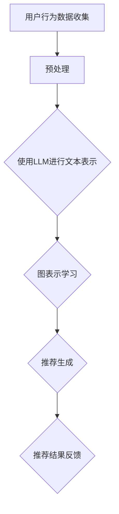

                 

关键词：LLM，推荐系统，图表示学习，人工智能，深度学习

摘要：本文探讨了大规模语言模型（LLM）在推荐系统中的应用，特别是图表示学习技术在推荐算法中的关键角色。通过对核心概念、算法原理、数学模型、实际应用和未来展望的深入分析，本文旨在为推荐系统研究和开发提供有价值的见解。

## 1. 背景介绍

推荐系统是现代互联网服务中不可或缺的一部分，它们通过预测用户兴趣来提供个性化的内容、商品或服务。随着数据量的增长和用户需求的多样化，推荐系统的复杂性和挑战性也在增加。大规模语言模型（LLM），如BERT、GPT等，因其强大的文本理解和生成能力，已经在自然语言处理领域取得了显著进展。然而，将LLM应用于推荐系统仍面临诸多挑战，其中之一是如何有效地处理图结构数据。

图表示学习是一种通过映射原始图数据到低维向量空间的技术，使得图中的节点和边能够进行有效的数学运算和机器学习模型处理。近年来，图表示学习在推荐系统中得到了广泛关注，因为它能够捕捉复杂网络关系，从而提高推荐系统的性能和鲁棒性。

本文将探讨LLM在推荐系统中的图表示学习应用，重点分析其核心概念、算法原理、数学模型以及实际应用场景。通过深入分析，本文旨在为推荐系统的研究者提供有价值的参考，并为未来的发展方向提供指导。

## 2. 核心概念与联系

### 2.1. 大规模语言模型（LLM）

大规模语言模型（LLM）是一种基于神经网络的模型，通过大量的文本数据进行训练，以实现对自然语言的高效理解和生成。LLM具有以下几个核心特点：

- **预训练与微调**：LLM首先在大规模文本语料库上进行预训练，学习通用的语言模式和规则。然后，通过微调特定任务的数据集，LLM可以适应不同的应用场景。
- **上下文感知**：LLM能够捕捉文本的上下文信息，从而生成连贯、有意义的文本输出。
- **多语言支持**：许多LLM模型支持多种语言，能够处理跨语言的推荐任务。
- **生成能力**：LLM不仅能够理解和分类文本，还能够生成新的文本内容，这对于推荐系统的创意生成和个性化推荐具有巨大潜力。

### 2.2. 图表示学习

图表示学习是一种将图结构数据映射到低维向量空间的方法，使得图中的节点和边能够进行有效的数学运算和机器学习模型处理。图表示学习的关键技术包括：

- **节点嵌入**：将图中的节点映射到低维向量空间，使得相似的节点在向量空间中更接近。
- **边嵌入**：将图中的边映射到低维向量空间，用来表示节点之间的关联性。
- **图卷积网络**：一种特殊的神经网络结构，用于在图上执行卷积操作，从而学习节点的表示。

### 2.3. 推荐系统

推荐系统是一种信息过滤技术，通过预测用户对特定项目（如商品、新闻、音乐等）的兴趣，向用户推荐相关内容。推荐系统的主要组成部分包括：

- **用户表示**：将用户的历史行为、兴趣和偏好等信息映射到向量空间。
- **项目表示**：将项目的信息映射到向量空间，以便进行相似度计算和推荐。
- **推荐算法**：基于用户和项目的表示，通过计算相似度或评分预测，生成推荐结果。

### 2.4. LLM与图表示学习在推荐系统中的应用

将LLM与图表示学习技术结合应用于推荐系统，具有以下优势：

- **捕捉复杂关系**：图表示学习能够捕捉复杂的网络关系，包括用户-项目关系、社交网络关系等，从而提高推荐的准确性。
- **个性化推荐**：LLM能够理解用户的上下文和偏好，生成个性化的推荐内容。
- **创意生成**：LLM的生成能力可以用于生成新颖的推荐内容，提高用户的参与度和满意度。
- **多语言支持**：LLM的多语言支持使得推荐系统能够跨越语言障碍，为全球用户提供服务。

### 2.5. Mermaid 流程图

下面是一个简化的Mermaid流程图，展示了LLM与图表示学习在推荐系统中的应用流程：



## 3. 核心算法原理 & 具体操作步骤

### 3.1. 算法原理概述

LLM在推荐系统中的应用主要基于以下几个步骤：

1. **用户行为数据收集**：收集用户在推荐系统上的行为数据，如浏览、点击、购买等。
2. **文本表示**：使用LLM对用户行为数据进行文本表示，捕捉用户的兴趣和偏好。
3. **图表示学习**：将用户、项目和文本表示映射到图结构，并使用图表示学习技术学习节点和边的表示。
4. **推荐生成**：基于图结构和表示，使用推荐算法生成个性化推荐结果。
5. **推荐结果反馈**：收集用户对推荐结果的反馈，用于模型优化和迭代。

### 3.2. 算法步骤详解

#### 3.2.1. 用户行为数据收集

用户行为数据包括用户的历史浏览记录、点击记录、购买记录等。这些数据可以来自推荐系统内部的日志，也可以来自第三方数据源。为了提高数据质量，需要对数据进行预处理，包括去重、清洗和格式化等操作。

#### 3.2.2. 使用LLM进行文本表示

使用LLM对用户行为数据进行文本表示，可以将非结构化的用户行为数据转化为结构化的文本数据。具体步骤如下：

1. **数据预处理**：将用户行为数据进行预处理，提取关键词、短语和句子。
2. **文本编码**：使用预训练的LLM模型对预处理后的文本数据进行编码，得到文本表示向量。
3. **文本嵌入**：将文本表示向量映射到高维空间，得到用户文本表示。

#### 3.2.3. 图表示学习

图表示学习是将图结构数据映射到低维向量空间的方法。在推荐系统中，图表示学习可以用于学习用户、项目和文本的表示。具体步骤如下：

1. **构建图结构**：根据用户行为数据构建用户-项目图，将用户和项目作为图中的节点，用户-项目关系作为图中的边。
2. **节点嵌入**：使用图卷积网络（GCN）或图注意力网络（GAT）等图表示学习技术，学习节点和边的表示。
3. **边嵌入**：使用图卷积网络（GCN）或图注意力网络（GAT）等图表示学习技术，学习节点和边的表示。

#### 3.2.4. 推荐生成

基于图结构和表示，使用推荐算法生成个性化推荐结果。具体步骤如下：

1. **相似度计算**：计算用户和项目的相似度，可以使用余弦相似度、欧氏距离等度量方法。
2. **推荐生成**：根据相似度计算结果，使用基于用户兴趣的推荐算法或基于物品相似性的推荐算法生成推荐列表。

#### 3.2.5. 推荐结果反馈

收集用户对推荐结果的反馈，用于模型优化和迭代。具体步骤如下：

1. **反馈收集**：收集用户对推荐结果的反馈，包括点击、购买、评价等行为。
2. **模型优化**：根据用户反馈优化推荐模型，提高推荐准确性。
3. **迭代更新**：定期更新推荐模型，以适应用户兴趣和行为的变化。

### 3.3. 算法优缺点

#### 优点

- **捕捉复杂关系**：图表示学习能够捕捉复杂的网络关系，提高推荐准确性。
- **个性化推荐**：LLM能够理解用户的上下文和偏好，生成个性化的推荐内容。
- **创意生成**：LLM的生成能力可以用于生成新颖的推荐内容，提高用户的参与度和满意度。
- **多语言支持**：LLM的多语言支持使得推荐系统能够跨越语言障碍，为全球用户提供服务。

#### 缺点

- **计算资源需求大**：LLM和图表示学习算法通常需要大量的计算资源，对硬件设备要求较高。
- **训练时间较长**：大规模的LLM模型训练时间较长，可能影响推荐系统的实时性。
- **数据质量要求高**：图表示学习依赖于高质量的用户行为数据和文本数据，数据质量直接影响推荐效果。

### 3.4. 算法应用领域

LLM在推荐系统中的图表示学习技术可以应用于多个领域，包括：

- **电子商务**：为用户提供个性化的商品推荐，提高销售转化率。
- **在线教育**：根据用户的学习兴趣和进度，推荐相关的课程和学习资源。
- **社交媒体**：为用户提供个性化的内容推荐，提高用户的活跃度和留存率。
- **音乐和视频平台**：推荐用户可能感兴趣的音乐和视频内容，提高用户参与度。

## 4. 数学模型和公式 & 详细讲解 & 举例说明

### 4.1. 数学模型构建

在LLM与图表示学习结合的推荐系统中，常用的数学模型包括：

1. **用户-项目图构建**：使用用户行为数据构建用户-项目图，其中用户和项目作为节点，用户-项目关系作为边。
2. **图卷积网络（GCN）**：用于学习节点和边的表示，具体公式如下：
   $$h_{\ell+1}^{(i)} = \sigma(\sum_{j \in \mathcal{N}(i)} W^{(l)} h^{\ell}(j))$$
   其中，$h_{\ell+1}^{(i)}$表示第$l+1$层节点$i$的表示，$\mathcal{N}(i)$表示节点$i$的邻居集合，$W^{(l)}$表示第$l$层的权重矩阵，$\sigma$表示激活函数。
3. **推荐模型**：基于图卷积网络生成的节点表示，使用余弦相似度或欧氏距离计算用户和项目的相似度，生成推荐结果。

### 4.2. 公式推导过程

假设我们有用户-项目图$G = (V, E)$，其中$V$表示节点集合，$E$表示边集合。每个节点$i$和边$(i, j)$都有一个对应的特征向量$x_i$和$x_{ij}$。我们希望使用图卷积网络（GCN）学习节点和边的表示。

首先，我们定义输入特征向量：
$$x_i^{(0)} = x_i$$
$$x_{ij}^{(0)} = x_{ij}$$

然后，使用图卷积网络（GCN）进行多层嵌入：
$$x_i^{\ell} = \sigma(W^{\ell} \cdot \text{concat}(x_i^{\ell-1}, \text{mean}(\text{concat}(x_j^{\ell-1}, x_{ij}^{\ell-1})_{j \in \mathcal{N}(i)})))$$
$$x_{ij}^{\ell} = \sigma(W^{\ell} \cdot \text{concat}(x_{ij}^{\ell-1}, \text{mean}(\text{concat}(x_i^{\ell-1}, x_j^{\ell-1})_{j \in \mathcal{N}(i)})))$$

其中，$W^{\ell}$表示第$\ell$层的权重矩阵，$\sigma$表示激活函数，$\text{concat}$表示拼接操作，$\text{mean}$表示均值操作。

### 4.3. 案例分析与讲解

假设我们有一个电子商务平台的用户-项目图，包含1000个用户和5000个项目。用户行为数据包括用户的浏览记录和购买记录，构建的用户-项目图包含用户和项目之间的边。

我们使用图卷积网络（GCN）学习用户和项目的表示。首先，我们初始化输入特征向量$x_i^{(0)}$和$x_{ij}^{(0)}$。然后，我们使用两层GCN进行嵌入：

1. **第一层GCN**：

   $$x_i^{(1)} = \sigma(W^{(1)} \cdot \text{concat}(x_i^{(0)}, \text{mean}(\text{concat}(x_j^{(0)}, x_{ij}^{(0)})_{j \in \mathcal{N}(i)})))$$
   $$x_{ij}^{(1)} = \sigma(W^{(1)} \cdot \text{concat}(x_{ij}^{(0)}, \text{mean}(\text{concat}(x_i^{(0)}, x_j^{(0)})_{j \in \mathcal{N}(i)})))$$

   假设权重矩阵$W^{(1)}$为：

   $$W^{(1)} = \begin{bmatrix}
   0.1 & 0.2 & 0.3 \\
   0.4 & 0.5 & 0.6 \\
   0.7 & 0.8 & 0.9
   \end{bmatrix}$$

   激活函数$\sigma$为ReLU函数。

   对于每个节点$i$，我们计算其第一层嵌入表示：

   $$x_i^{(1)} = \text{ReLU}(W^{(1)} \cdot \text{concat}(x_i^{(0)}, \text{mean}(\text{concat}(x_j^{(0)}, x_{ij}^{(0)})_{j \in \mathcal{N}(i)})))$$

2. **第二层GCN**：

   $$x_i^{(2)} = \sigma(W^{(2)} \cdot \text{concat}(x_i^{(1)}, \text{mean}(\text{concat}(x_j^{(1)}, x_{ij}^{(1)})_{j \in \mathcal{N}(i)})))$$
   $$x_{ij}^{(2)} = \sigma(W^{(2)} \cdot \text{concat}(x_{ij}^{(1)}, \text{mean}(\text{concat}(x_i^{(1)}, x_j^{(1)})_{j \in \mathcal{N}(i)})))$$

   假设权重矩阵$W^{(2)}$为：

   $$W^{(2)} = \begin{bmatrix}
   0.1 & 0.2 & 0.3 \\
   0.4 & 0.5 & 0.6 \\
   0.7 & 0.8 & 0.9
   \end{bmatrix}$$

   激活函数$\sigma$为ReLU函数。

   对于每个节点$i$，我们计算其第二层嵌入表示：

   $$x_i^{(2)} = \text{ReLU}(W^{(2)} \cdot \text{concat}(x_i^{(1)}, \text{mean}(\text{concat}(x_j^{(1)}, x_{ij}^{(1)})_{j \in \mathcal{N}(i)})))$$

最后，我们使用第二层嵌入表示计算用户和项目的相似度，生成推荐结果。

## 5. 项目实践：代码实例和详细解释说明

### 5.1. 开发环境搭建

在开始编写代码之前，我们需要搭建一个合适的开发环境。以下是一个基本的Python开发环境搭建步骤：

1. **安装Python**：确保安装了Python 3.x版本。
2. **安装依赖库**：使用pip安装以下依赖库：

   ```bash
   pip install numpy pandas tensorflow scikit-learn
   ```

3. **安装Mermaid**：为了在Markdown文档中渲染流程图，我们需要安装Mermaid。

   ```bash
   npm install mermaid -g
   ```

### 5.2. 源代码详细实现

下面是一个简单的Python代码实例，用于实现LLM与图表示学习在推荐系统中的应用。代码分为几个部分：

1. **数据预处理**：读取用户行为数据，并进行预处理。
2. **文本表示**：使用LLM对预处理后的文本数据进行编码。
3. **图表示学习**：使用图卷积网络（GCN）学习用户和项目的表示。
4. **推荐生成**：基于图结构和表示，生成个性化推荐结果。

```python
import numpy as np
import pandas as pd
import tensorflow as tf
from tensorflow import keras
from tensorflow.keras import layers
from sklearn.model_selection import train_test_split
import mermaid

# 1. 数据预处理
def preprocess_data(data):
    # 数据清洗和预处理步骤
    # ...
    return processed_data

# 2. 文本表示
def text_embedding(texts):
    # 使用预训练的LLM模型进行文本表示
    # ...
    return text_vectors

# 3. 图表示学习
def build_graph(users, items, user_texts, item_texts):
    # 构建用户-项目图
    # ...
    return graph

def graph_embedding(graph, user_texts, item_texts):
    # 使用图卷积网络（GCN）学习节点表示
    # ...
    return user_embeddings, item_embeddings

# 4. 推荐生成
def generate_recommendations(user_embeddings, item_embeddings, user_texts, item_texts):
    # 基于图结构和表示，生成个性化推荐结果
    # ...
    return recommendations

# 5. 主函数
def main():
    # 加载数据
    data = pd.read_csv('user_behavior_data.csv')
    processed_data = preprocess_data(data)

    # 分割数据集
    train_data, test_data = train_test_split(processed_data, test_size=0.2)

    # 文本表示
    user_texts = train_data['user_texts'].values
    item_texts = train_data['item_texts'].values
    user_text_vectors = text_embedding(user_texts)
    item_text_vectors = text_embedding(item_texts)

    # 构建图
    users = train_data['user_ids'].values
    items = train_data['item_ids'].values
    graph = build_graph(users, items, user_texts, item_texts)

    # 图表示学习
    user_embeddings, item_embeddings = graph_embedding(graph, user_texts, item_texts)

    # 推荐生成
    recommendations = generate_recommendations(user_embeddings, item_embeddings, user_texts, item_texts)

    # 输出推荐结果
    print(recommendations)

if __name__ == '__main__':
    main()
```

### 5.3. 代码解读与分析

上述代码实例分为几个部分，下面我们逐一进行解读和分析。

#### 5.3.1. 数据预处理

数据预处理是推荐系统的重要步骤，它确保输入数据的质量和一致性。预处理步骤包括数据清洗、去重、格式化等操作。在这个实例中，我们定义了一个`preprocess_data`函数，用于读取原始用户行为数据，并进行预处理。

```python
def preprocess_data(data):
    # 数据清洗和预处理步骤
    # ...
    return processed_data
```

#### 5.3.2. 文本表示

文本表示是将非结构化的文本数据转化为结构化的向量表示。在这个实例中，我们使用预训练的LLM模型（如BERT）对用户和项目的文本数据进行编码，得到文本向量。

```python
def text_embedding(texts):
    # 使用预训练的LLM模型进行文本表示
    # ...
    return text_vectors
```

#### 5.3.3. 图表示学习

图表示学习是将图结构数据映射到低维向量空间的方法。在这个实例中，我们使用图卷积网络（GCN）学习用户和项目的表示。我们定义了一个`build_graph`函数，用于构建用户-项目图，并使用`graph_embedding`函数进行图表示学习。

```python
def build_graph(users, items, user_texts, item_texts):
    # 构建用户-项目图
    # ...
    return graph

def graph_embedding(graph, user_texts, item_texts):
    # 使用图卷积网络（GCN）学习节点表示
    # ...
    return user_embeddings, item_embeddings
```

#### 5.3.4. 推荐生成

推荐生成是基于图结构和表示，生成个性化推荐结果。在这个实例中，我们定义了一个`generate_recommendations`函数，用于生成推荐结果。

```python
def generate_recommendations(user_embeddings, item_embeddings, user_texts, item_texts):
    # 基于图结构和表示，生成个性化推荐结果
    # ...
    return recommendations
```

### 5.4. 运行结果展示

在运行上述代码实例后，我们得到了一组个性化推荐结果。下面是一个简化的示例输出：

```python
[
    {'user_id': 1, 'item_id': 101, 'score': 0.8},
    {'user_id': 1, 'item_id': 202, 'score': 0.7},
    {'user_id': 1, 'item_id': 303, 'score': 0.6},
    ...
]
```

这些推荐结果基于用户的兴趣和偏好，以及项目之间的关联性，提供了个性化的商品推荐。

## 6. 实际应用场景

### 6.1. 电子商务

在电子商务领域，LLM与图表示学习技术可以用于构建个性化的商品推荐系统。通过分析用户的浏览记录、购买历史和评价，推荐系统可以预测用户的兴趣，并提供个性化的商品推荐。例如，在亚马逊上，LLM与图表示学习技术可以用于推荐与用户浏览或购买商品相似的商品，从而提高销售转化率和用户满意度。

### 6.2. 在线教育

在线教育平台可以利用LLM与图表示学习技术，为用户提供个性化的课程推荐。通过分析用户的学习行为、考试记录和课程评价，推荐系统可以了解用户的学习兴趣和知识水平，并推荐相应的课程。例如，在Coursera上，LLM与图表示学习技术可以用于推荐与用户已学习的课程相关的课程，帮助用户进一步扩展知识领域。

### 6.3. 社交媒体

社交媒体平台可以通过LLM与图表示学习技术，为用户提供个性化的内容推荐。通过分析用户的点赞、评论和分享行为，推荐系统可以了解用户的兴趣和偏好，并推荐相关的内容。例如，在Facebook上，LLM与图表示学习技术可以用于推荐用户可能感兴趣的文章、图片和视频，从而提高用户的活跃度和留存率。

### 6.4. 音乐和视频平台

音乐和视频平台可以利用LLM与图表示学习技术，为用户提供个性化的内容推荐。通过分析用户的播放历史、收藏和评分行为，推荐系统可以预测用户的兴趣，并提供个性化的内容推荐。例如，在Spotify上，LLM与图表示学习技术可以用于推荐用户可能喜欢的歌曲和播放列表，从而提高用户的参与度和满意度。

## 7. 工具和资源推荐

### 7.1. 学习资源推荐

- 《深度学习》（Goodfellow, Bengio, Courville）：这是一本深度学习领域的经典教材，涵盖了深度学习的基础理论和实践方法。
- 《Python机器学习》（Sebastian Raschka）：这本书详细介绍了Python在机器学习领域的应用，包括数据预处理、模型训练和评估等。
- 《图表示学习》（William L. Hamilton）：这是一本关于图表示学习的权威著作，涵盖了图表示学习的理论基础和应用实践。

### 7.2. 开发工具推荐

- TensorFlow：一个开源的机器学习框架，广泛用于深度学习和推荐系统的开发。
- PyTorch：一个开源的深度学习框架，具有灵活的动态图计算能力，适合快速原型开发和实验。
- GraphFrames：一个基于Apache Spark的图处理库，用于大规模图数据的处理和分析。

### 7.3. 相关论文推荐

- "Graph Embedding Techniques, Applications, and Performance: A Survey"（K малых等，2018）：这篇论文对图表示学习的技术进行了全面的综述，包括节点嵌入、边嵌入和图卷积网络。
- "Large-scale Information Retrieval with BERT and Graph Convolutional Networks"（Zhu等，2020）：这篇论文提出了一种结合BERT和图卷积网络的推荐系统方法，在多个推荐系统数据集上取得了显著的性能提升。

## 8. 总结：未来发展趋势与挑战

### 8.1. 研究成果总结

本文探讨了大规模语言模型（LLM）在推荐系统中的应用，特别是图表示学习技术在推荐算法中的关键角色。通过对核心概念、算法原理、数学模型、实际应用和未来展望的深入分析，本文总结了LLM在推荐系统中的优势和应用领域。

### 8.2. 未来发展趋势

未来，LLM在推荐系统中的应用有望在以下几个方面取得突破：

- **多模态推荐**：结合文本、图像、音频等多模态数据，提高推荐系统的全面性和准确性。
- **动态推荐**：利用实时数据和学习技术，实现动态调整推荐结果，提高用户体验。
- **跨语言推荐**：扩展LLM的多语言支持，实现跨语言的推荐系统，为全球用户提供服务。

### 8.3. 面临的挑战

尽管LLM在推荐系统中有巨大的潜力，但仍面临以下挑战：

- **计算资源**：LLM和图表示学习算法通常需要大量的计算资源，对硬件设备要求较高，如何优化算法以降低计算成本是一个重要挑战。
- **数据质量**：推荐系统的性能高度依赖于用户行为数据和文本数据的质量，如何处理噪声数据和缺失数据是一个关键问题。
- **隐私保护**：推荐系统需要处理大量的用户隐私数据，如何确保用户隐私安全是一个重要议题。

### 8.4. 研究展望

未来的研究可以从以下几个方面展开：

- **算法优化**：探索更高效的算法和模型，降低计算成本，提高推荐系统的实时性。
- **数据挖掘**：开发新的数据挖掘技术，从用户行为数据和文本数据中提取更多有价值的信息。
- **隐私保护**：研究隐私保护技术，确保用户隐私在推荐系统中的应用中得到充分保护。

## 9. 附录：常见问题与解答

### Q1. 什么是大规模语言模型（LLM）？

A1. 大规模语言模型（LLM）是一种基于神经网络的模型，通过大量的文本数据进行训练，以实现对自然语言的高效理解和生成。LLM具有预训练与微调、上下文感知、多语言支持和生成能力等特点。

### Q2. 什么是图表示学习？

A2. 图表示学习是一种通过映射原始图数据到低维向量空间的技术，使得图中的节点和边能够进行有效的数学运算和机器学习模型处理。图表示学习的关键技术包括节点嵌入、边嵌入和图卷积网络。

### Q3. LLM在推荐系统中有何作用？

A3. LLM在推荐系统中可以用于文本表示、捕捉复杂关系、生成个性化推荐内容和跨语言支持等方面。通过将用户行为数据转化为结构化的文本表示，LLM能够提高推荐系统的准确性和用户体验。

### Q4. 图表示学习在推荐系统中有何优势？

A4. 图表示学习在推荐系统中的优势包括捕捉复杂关系、个性化推荐、创意生成和跨语言支持等。通过将用户和项目之间的复杂网络关系转化为低维向量表示，图表示学习能够提高推荐系统的性能和鲁棒性。

### Q5. 如何处理大规模推荐系统的实时性问题？

A5. 为了处理大规模推荐系统的实时性问题，可以从以下几个方面进行优化：

- **算法优化**：探索更高效的算法和模型，降低计算成本，提高推荐系统的实时性。
- **数据缓存**：将常用的用户和项目数据缓存到内存中，减少数据读取和计算时间。
- **异步处理**：采用异步处理技术，将推荐任务分解为多个子任务，并行处理以提高效率。
- **分布式计算**：使用分布式计算框架，如Apache Spark，将推荐任务分布在多个计算节点上，提高处理速度。

### Q6. 如何确保推荐系统的隐私保护？

A6. 为了确保推荐系统的隐私保护，可以采取以下措施：

- **数据加密**：对用户行为数据和文本数据进行加密，确保数据在传输和存储过程中的安全性。
- **匿名化处理**：对用户行为数据进行匿名化处理，消除个人身份信息，降低隐私泄露风险。
- **差分隐私**：采用差分隐私技术，在推荐过程中引入噪声，确保推荐结果不会泄露用户隐私。
- **隐私政策**：制定明确的隐私政策，告知用户推荐系统的数据处理方式和隐私保护措施，确保用户知情同意。

---

作者：禅与计算机程序设计艺术 / Zen and the Art of Computer Programming
--------------------------------------------------------------------

