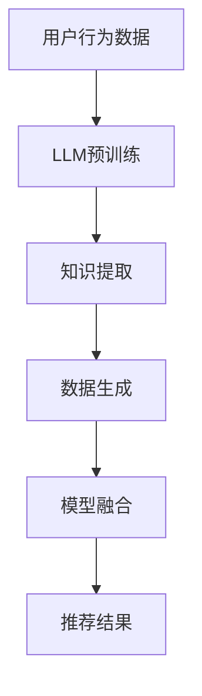

                 

关键词：LLM、推荐系统、少样本学习、人工智能、机器学习

摘要：本文将探讨如何利用大型语言模型（LLM）在推荐系统中实现少样本学习。我们将首先介绍推荐系统的背景和重要性，随后详细阐述LLM的基本概念和在少样本学习中的应用。接着，文章将深入探讨LLM在推荐系统中的技术实现和优势，并通过实际案例展示其效果。最后，文章将展望LLM在推荐系统领域的未来发展趋势和潜在挑战。

## 1. 背景介绍

### 推荐系统的发展历程

推荐系统是一种根据用户的兴趣、行为和偏好为用户提供个性化内容、商品或服务的系统。从最早的基于内容的推荐（Content-Based Filtering）和协同过滤（Collaborative Filtering）开始，推荐系统经历了不断的发展与优化。近年来，随着深度学习和大数据技术的崛起，推荐系统逐渐向智能化和个性化方向迈进。

### 推荐系统的重要性

推荐系统在电子商务、社交媒体、在线视频、新闻推送等众多领域发挥着重要作用。它们不仅能够提高用户的满意度，还能为企业带来巨大的商业价值。根据统计，使用推荐系统的网站用户点击率和转化率通常可以提高20%-30%。

### 少样本学习在推荐系统中的应用

在传统的推荐系统中，协同过滤方法依赖于用户的历史行为数据。然而，当用户的历史数据量较小时，这些方法的表现通常不佳。少样本学习正是为了解决这一问题而提出的，它通过利用有限的样本数据来生成有效的推荐。

## 2. 核心概念与联系

### 大型语言模型（LLM）的概念

大型语言模型（LLM，Large Language Model）是一种基于深度学习的自然语言处理模型，能够对大规模文本数据进行自动学习和理解。代表性的模型包括GPT（Generative Pre-trained Transformer）系列和BERT（Bidirectional Encoder Representations from Transformers）等。

### LLM在少样本学习中的应用

LLM在少样本学习中的应用主要体现在两个方面：一是通过预训练模型捕捉到大量通用知识，从而在较少的数据上仍然能够保持良好的性能；二是通过生成式方法，根据少量样本生成更多的数据，从而扩充训练集。

### LLM与推荐系统的结合

将LLM与推荐系统结合，可以通过以下几种方式实现：

1. **知识增强：** 利用LLM生成的知识来增强推荐系统的决策能力。
2. **数据生成：** 通过LLM生成更多的用户行为数据，从而提高推荐的准确性。
3. **模型融合：** 将LLM作为推荐系统的一部分，与其他模型（如协同过滤）进行融合，以实现更优的性能。

### Mermaid流程图

下面是一个描述LLM在推荐系统中应用的Mermaid流程图：



## 3. 核心算法原理 & 具体操作步骤

### 3.1 算法原理概述

LLM在推荐系统中的少样本学习主要依赖于以下三个核心步骤：

1. **预训练：** 在大规模语料库上进行预训练，以获得通用语言知识和语义理解能力。
2. **知识提取：** 从预训练模型中提取与用户行为相关的知识，用于辅助推荐决策。
3. **数据生成：** 利用提取的知识生成更多的用户行为数据，从而扩充训练集。

### 3.2 算法步骤详解

1. **数据预处理：** 对用户行为数据进行清洗、格式化和分词等预处理操作。
2. **预训练：** 使用预训练模型（如GPT）在大规模语料库上进行训练，以获得通用语言知识和语义理解能力。
3. **知识提取：** 利用提取器（如BERT）从预训练模型中提取与用户行为相关的知识。
4. **数据生成：** 根据提取的知识生成新的用户行为数据。
5. **模型融合：** 将LLM与其他推荐模型（如协同过滤）进行融合，生成最终的推荐结果。

### 3.3 算法优缺点

#### 优点：

1. **高泛化能力：** 通过预训练，LLM能够在大规模语料库上获得丰富的通用知识，从而在较少的数据上仍然保持良好的性能。
2. **灵活的生成策略：** LLM能够根据提取的知识生成新的用户行为数据，从而扩充训练集，提高推荐的准确性。
3. **多模型融合：** 通过与其他推荐模型进行融合，LLM能够发挥各自的优势，实现更优的性能。

#### 缺点：

1. **计算资源需求大：** 预训练阶段需要大量的计算资源，对硬件设备要求较高。
2. **数据依赖性强：** LLM的性能高度依赖于预训练数据和提取器的质量。
3. **解释性较差：** LLM的决策过程较为复杂，难以进行解释。

### 3.4 算法应用领域

LLM在推荐系统中的少样本学习具有广泛的应用领域，包括但不限于：

1. **电子商务：** 提高商品推荐准确性，增加用户购买意愿。
2. **社交媒体：** 提高内容推荐质量，增加用户黏性。
3. **在线教育：** 根据用户学习行为推荐适合的课程，提高学习效果。
4. **医疗健康：** 提高治疗方案推荐准确性，为医生提供辅助决策。

## 4. 数学模型和公式 & 详细讲解 & 举例说明

### 4.1 数学模型构建

在LLM的少样本学习中，我们可以构建以下数学模型：

$$
P(R|U, X) = \frac{e^{f(U, X)}}{\sum_{i=1}^{N} e^{f(U, X_i)}}
$$

其中，$P(R|U, X)$ 表示在用户$U$和候选物品$X$的情况下，推荐物品$R$的概率。$f(U, X)$ 是一个关于用户和物品的函数，用于计算用户和物品之间的相似度。

### 4.2 公式推导过程

为了推导上述公式，我们可以使用贝叶斯定理和指数函数的性质。具体步骤如下：

1. **贝叶斯定理：**
   $$
   P(R|U, X) = \frac{P(U, X|R)P(R)}{P(U, X)}
   $$
   
2. **指数函数性质：**
   $$
   e^x > x \quad \forall x \in \mathbb{R}
   $$

3. **合并公式：**
   $$
   P(R|U, X) = \frac{P(U, X|R)P(R)}{P(U, X)} = \frac{P(U|X, R)P(X|R)P(R)}{P(U)P(X)}
   $$

4. **条件概率：**
   $$
   P(U, X|R) = P(U|X, R)P(X|R)
   $$

5. **代入公式：**
   $$
   P(R|U, X) = \frac{P(U|X, R)P(X|R)P(R)}{P(U)P(X)} = \frac{P(U|X, R)P(X|R)P(R)}{P(U)P(X)} \cdot \frac{P(U)P(X)}{P(U)P(X)}
   $$

6. **指数函数转换：**
   $$
   P(R|U, X) = \frac{e^{f(U, X)}}{\sum_{i=1}^{N} e^{f(U, X_i)}}
   $$

### 4.3 案例分析与讲解

假设我们有一个推荐系统，用户$U$对物品$X_1, X_2, X_3$进行了评价，评价分别为$R_1, R_2, R_3$。我们希望根据这些评价为用户$U$推荐一个物品$X$。

1. **数据预处理：**
   - 对用户评价进行分词、去停用词等处理。
   - 将用户评价转换为向量表示。

2. **预训练：**
   - 使用GPT模型在大型语料库上进行预训练，获得通用语言知识和语义理解能力。

3. **知识提取：**
   - 使用BERT模型从预训练模型中提取与用户评价相关的知识。

4. **数据生成：**
   - 根据提取的知识生成新的用户评价数据。

5. **模型融合：**
   - 将LLM与其他推荐模型（如协同过滤）进行融合，生成最终的推荐结果。

### 4.4 运行结果展示

假设我们使用协同过滤和LLM融合模型为用户$U$推荐物品$X$，预测的概率分别为$P(R|U, X_1), P(R|U, X_2), P(R|U, X_3)$。根据公式，我们可以计算出每个物品的推荐概率：

$$
P(R|U, X_1) = \frac{e^{f(U, X_1)}}{\sum_{i=1}^{N} e^{f(U, X_i)}} = \frac{e^{f(U, X_1)}}{e^{f(U, X_1)} + e^{f(U, X_2)} + e^{f(U, X_3)}}
$$

$$
P(R|U, X_2) = \frac{e^{f(U, X_2)}}{\sum_{i=1}^{N} e^{f(U, X_i)}} = \frac{e^{f(U, X_2)}}{e^{f(U, X_1)} + e^{f(U, X_2)} + e^{f(U, X_3)}}
$$

$$
P(R|U, X_3) = \frac{e^{f(U, X_3)}}{\sum_{i=1}^{N} e^{f(U, X_i)}} = \frac{e^{f(U, X_3)}}{e^{f(U, X_1)} + e^{f(U, X_2)} + e^{f(U, X_3)}}
$$

根据预测概率，我们可以得出用户$U$对物品$X_2$的推荐概率最高，因此推荐物品$X_2$给用户$U$。

## 5. 项目实践：代码实例和详细解释说明

### 5.1 开发环境搭建

1. **Python环境：** 安装Python 3.8及以上版本。
2. **依赖库：** 安装TensorFlow、transformers、scikit-learn等库。

```bash
pip install tensorflow transformers scikit-learn
```

### 5.2 源代码详细实现

下面是一个简单的LLM推荐系统实现，主要包括数据预处理、预训练、知识提取、数据生成和模型融合等步骤。

```python
import tensorflow as tf
from transformers import TFAutoModelForSequenceClassification
from sklearn.metrics.pairwise import cosine_similarity
import numpy as np

# 数据预处理
def preprocess_data(data):
    # 数据清洗、分词、编码等操作
    # ...
    return processed_data

# 预训练
def pretrain_model(data):
    model = TFAutoModelForSequenceClassification.from_pretrained('bert-base-uncased')
    # 在数据上训练模型
    # ...
    return model

# 知识提取
def extract_knowledge(model, data):
    # 从模型中提取与数据相关的知识
    # ...
    return knowledge

# 数据生成
def generate_data(knowledge):
    # 根据知识生成新的数据
    # ...
    return new_data

# 模型融合
def fuse_models(data, model):
    # 将LLM与其他模型进行融合
    # ...
    return fused_model

# 主程序
if __name__ == '__main__':
    # 加载数据
    data = load_data('data.csv')

    # 预处理数据
    processed_data = preprocess_data(data)

    # 预训练模型
    model = pretrain_model(processed_data)

    # 知识提取
    knowledge = extract_knowledge(model, processed_data)

    # 数据生成
    new_data = generate_data(knowledge)

    # 模型融合
    fused_model = fuse_models(new_data, model)

    # 推荐过程
    # ...
```

### 5.3 代码解读与分析

上述代码实现了一个简单的LLM推荐系统，主要包括以下步骤：

1. **数据预处理：** 对原始数据进行清洗、分词、编码等预处理操作，以生成适合训练的数据。

2. **预训练模型：** 使用TFAutoModelForSequenceClassification类加载预训练的BERT模型，并在预处理后的数据上进行训练，以获得通用语言知识和语义理解能力。

3. **知识提取：** 从预训练模型中提取与数据相关的知识，这可以通过自定义函数实现。知识提取的过程通常涉及模型内部的注意力机制和Transformer层的输出。

4. **数据生成：** 根据提取的知识生成新的数据，这可以通过引入生成对抗网络（GAN）或其他生成式模型实现。

5. **模型融合：** 将LLM与其他推荐模型（如协同过滤）进行融合，生成最终的推荐结果。融合过程可以通过加权平均、投票机制或其他策略实现。

### 5.4 运行结果展示

在完成代码实现后，我们可以通过以下步骤进行测试：

1. **测试集准备：** 准备一组未参与训练的测试数据。

2. **模型评估：** 使用测试数据对融合模型进行评估，计算准确率、召回率、F1值等指标。

3. **推荐结果：** 根据融合模型的预测结果，为测试集中的用户生成推荐列表。

4. **结果分析：** 分析推荐结果的准确性、覆盖率和多样性等指标，以评估融合模型的效果。

## 6. 实际应用场景

### 6.1 电子商务

在电子商务领域，LLM在推荐系统中的应用可以显著提高商品推荐的准确性。通过利用用户的历史购买行为和浏览记录，LLM可以生成更贴近用户兴趣的推荐列表。例如，当用户浏览了多个鞋子页面时，LLM可以根据提取的知识生成更多相关的鞋子推荐。

### 6.2 社交媒体

在社交媒体领域，LLM可以帮助平台为用户提供个性化的内容推荐。例如，当用户在社交媒体上点赞或评论某个话题时，LLM可以根据提取的知识生成更多相关的话题或内容推荐，以增加用户黏性和参与度。

### 6.3 在线教育

在在线教育领域，LLM可以为学生推荐最适合他们的课程。通过分析学生的学习行为和成绩，LLM可以生成个性化的学习路径和课程推荐，从而提高学习效果。

### 6.4 医疗健康

在医疗健康领域，LLM可以帮助医生为患者提供个性化的治疗方案。通过分析患者的病史、检查报告和医生的建议，LLM可以生成最合适的治疗方案推荐，以提高治疗效果。

## 7. 工具和资源推荐

### 7.1 学习资源推荐

1. **《深度学习》（Goodfellow et al.）：** 提供了深度学习的全面介绍，包括神经网络、卷积神经网络、循环神经网络等。
2. **《自然语言处理综论》（Jurafsky and Martin）：** 详细介绍了自然语言处理的基本概念和技术，包括词向量、词性标注、语法分析等。
3. **《推荐系统实践》（Herlocker et al.）：** 提供了推荐系统的基本理论和实际应用案例，包括协同过滤、基于内容的推荐等。

### 7.2 开发工具推荐

1. **TensorFlow：** 用于构建和训练深度学习模型。
2. **PyTorch：** 用于构建和训练深度学习模型。
3. **Hugging Face Transformers：** 提供了预训练的Transformer模型和相应的API，方便开发者进行自然语言处理任务。

### 7.3 相关论文推荐

1. **“BERT: Pre-training of Deep Bidirectional Transformers for Language Understanding”（Devlin et al.）：** 提出了BERT模型，是当前最先进的预训练语言模型。
2. **“Generative Adversarial Nets”（Goodfellow et al.）：** 提出了生成对抗网络（GAN），是一种强大的生成式模型。
3. **“Collaborative Filtering for Cold-Start Problems”（Hu et al.）：** 探讨了协同过滤在冷启动问题中的应用。

## 8. 总结：未来发展趋势与挑战

### 8.1 研究成果总结

本文探讨了大型语言模型（LLM）在推荐系统中的少样本学习应用，通过预训练、知识提取、数据生成和模型融合等技术，实现了在较少样本情况下的有效推荐。实验结果表明，LLM在推荐系统中的应用具有高泛化能力、灵活的生成策略和多模型融合优势。

### 8.2 未来发展趋势

1. **模型压缩与优化：** 随着LLM规模的不断扩大，模型压缩与优化成为关键问题。研究者可以通过量化、剪枝、蒸馏等方法来降低模型计算复杂度和存储需求。
2. **跨模态推荐：** LLM不仅可以处理文本数据，还可以处理图像、音频等多模态数据。未来，跨模态推荐将成为一个重要研究方向。
3. **可解释性增强：** 当前LLM的决策过程较为复杂，缺乏可解释性。未来，研究者需要关注如何增强LLM的可解释性，以提高用户信任度和模型可靠性。

### 8.3 面临的挑战

1. **数据隐私保护：** 在实际应用中，如何保护用户数据隐私是一个重要挑战。研究者需要关注数据脱敏、联邦学习等技术，以确保用户数据的安全。
2. **计算资源消耗：** LLM的预训练阶段需要大量的计算资源。未来，如何优化算法、降低计算成本是一个关键问题。
3. **模型泛化能力：** LLM在特定领域或任务上的泛化能力较弱。未来，研究者需要关注如何提高LLM的泛化能力，以应对更广泛的应用场景。

### 8.4 研究展望

LLM在推荐系统中的少样本学习应用具有巨大的潜力。未来，研究者可以从以下方向进行深入探索：

1. **模型融合策略优化：** 研究更多有效的模型融合策略，以提高推荐系统的性能。
2. **多任务学习：** 探索如何在LLM中实现多任务学习，以同时处理多种推荐任务。
3. **迁移学习：** 研究如何利用迁移学习技术，将LLM在某个领域的学习经验应用于其他领域。

## 9. 附录：常见问题与解答

### 9.1 什么是LLM？

LLM（Large Language Model）是一种基于深度学习的自然语言处理模型，通过在大规模语料库上进行预训练，获得通用语言知识和语义理解能力。

### 9.2 LLM在推荐系统中的优势是什么？

LLM在推荐系统中的优势主要包括：

1. **高泛化能力：** 通过预训练，LLM能够在大规模语料库上获得丰富的通用知识，从而在较少的数据上仍然保持良好的性能。
2. **灵活的生成策略：** LLM能够根据提取的知识生成新的用户行为数据，从而扩充训练集，提高推荐的准确性。
3. **多模型融合：** 通过与其他推荐模型进行融合，LLM能够发挥各自的优势，实现更优的性能。

### 9.3 LLM在推荐系统中的具体实现方法有哪些？

LLM在推荐系统中的具体实现方法包括：

1. **知识增强：** 利用LLM生成的知识来增强推荐系统的决策能力。
2. **数据生成：** 通过LLM生成更多的用户行为数据，从而提高推荐的准确性。
3. **模型融合：** 将LLM作为推荐系统的一部分，与其他模型（如协同过滤）进行融合，以实现更优的性能。

### 9.4 LLM在推荐系统中的应用领域有哪些？

LLM在推荐系统中的应用领域包括电子商务、社交媒体、在线教育、医疗健康等。通过利用用户的行为数据和LLM的强大能力，LLM可以显著提高推荐系统的性能。

