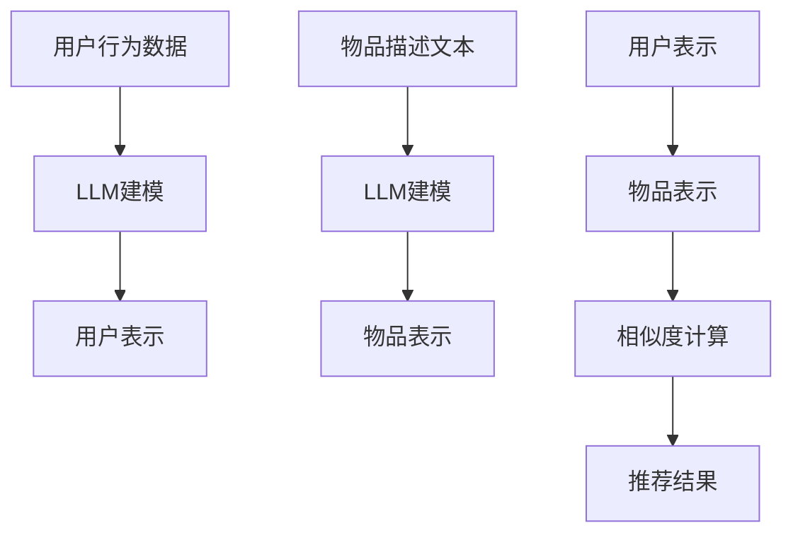
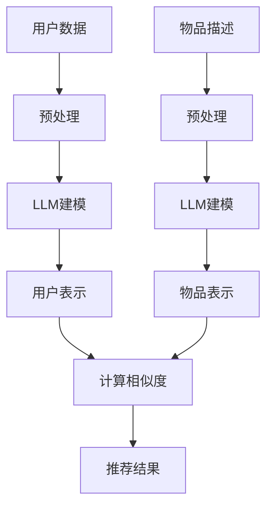

                 

关键词：大型语言模型（LLM），推荐系统，应用探索，算法原理，数学模型，项目实践，未来展望

> 摘要：本文将探讨大型语言模型（LLM）在推荐系统中的应用，分析LLM的优势及其在推荐系统中的作用机制，详细解析LLM推荐算法的原理、数学模型和具体操作步骤。同时，通过实际项目实践，展示LLM推荐系统在实际应用中的效果，并对未来应用前景进行展望。

## 1. 背景介绍

推荐系统是一种信息过滤技术，通过向用户推荐他们可能感兴趣的内容，提高用户的使用体验。传统的推荐系统主要依赖于用户的历史行为数据，如浏览记录、购买记录等，基于协同过滤、基于内容、基于模型等方法进行推荐。然而，随着互联网信息的爆炸性增长，用户的需求变得更加个性化，传统推荐系统的局限性逐渐显现。

近年来，随着深度学习和自然语言处理技术的快速发展，大型语言模型（LLM）逐渐引起了研究者的关注。LLM具有强大的语义理解和生成能力，能够处理大规模、多维度的数据，有望在推荐系统中发挥重要作用。

## 2. 核心概念与联系

### 2.1 核心概念

- **推荐系统**：一种信息过滤技术，通过预测用户对未知物品的喜好，向用户推荐相关物品。
- **大型语言模型（LLM）**：一种基于深度学习的语言模型，通过大规模数据训练，具有强大的语义理解和生成能力。

### 2.2 联系

LLM在推荐系统中的应用主要体现在两个方面：

1. **用户表示**：使用LLM对用户的历史行为数据进行建模，提取用户的兴趣偏好。
2. **物品表示**：使用LLM对物品的描述文本进行建模，提取物品的特征信息。

以下是一个简单的Mermaid流程图，展示LLM在推荐系统中的核心流程：



## 3. 核心算法原理 & 具体操作步骤

### 3.1 算法原理概述

LLM推荐系统的核心思想是将用户和物品映射到同一高维空间中，通过计算它们之间的相似度进行推荐。具体来说，包括以下几个步骤：

1. **用户行为数据预处理**：对用户的历史行为数据进行清洗、去重、归一化等处理。
2. **物品描述文本预处理**：对物品的描述文本进行分词、去停用词、词向量化等处理。
3. **用户表示**：使用LLM对用户的行为数据进行建模，提取用户的兴趣偏好。
4. **物品表示**：使用LLM对物品的描述文本进行建模，提取物品的特征信息。
5. **相似度计算**：计算用户和物品之间的相似度，选取相似度最高的物品进行推荐。

### 3.2 算法步骤详解

1. **用户行为数据预处理**：

   用户行为数据通常包括浏览记录、购买记录、评分记录等。预处理步骤如下：

   ```python
   # 假设用户行为数据为 DataFrame 格式
   user_data = ...

   # 清洗数据：去除缺失值、重复值
   user_data = user_data.dropna().drop_duplicates()

   # 去重：将相同行为的用户合并为一个用户
   user_data = user_data.groupby('user_id').first().reset_index()
   ```

2. **物品描述文本预处理**：

   物品描述文本通常包含商品名称、品牌、规格等。预处理步骤如下：

   ```python
   # 假设物品描述数据为 DataFrame 格式
   item_data = ...

   # 分词：使用中文分词工具对描述文本进行分词
   item_data['tokenized_desc'] = item_data['desc'].apply(lambda x: jieba.cut(x))

   # 去停用词：去除常见的停用词
   stop_words = set([line.strip() for line in open('stop_words.txt', encoding='utf-8')])
   item_data['tokenized_desc'] = item_data['tokenized_desc'].apply(lambda x: [word for word in x if word not in stop_words])

   # 词向量化：将分词后的文本转换为词向量
   tokenizer = Tokenizer()
   tokenizer.fit_on_texts(item_data['tokenized_desc'])
   item_data['tokenized_desc'] = item_data['tokenized_desc'].apply(lambda x: tokenizer.texts_to_sequences([x])[0])
   ```

3. **用户表示**：

   使用LLM对用户的行为数据进行建模，提取用户的兴趣偏好。这里我们采用BERT模型进行用户表示：

   ```python
   # 加载 BERT 模型
   from transformers import BertTokenizer, BertModel
   tokenizer = BertTokenizer.from_pretrained('bert-base-chinese')
   model = BertModel.from_pretrained('bert-base-chinese')

   # 将用户行为数据转换为句子形式
   user_sentences = [' '.join(user_data[i]['item_name']) for i in range(user_data.shape[0])]

   # 嵌入用户句子，获取用户向量
   user_inputs = tokenizer(user_sentences, return_tensors='pt', padding=True, truncation=True)
   user_embeddings = model(**user_inputs)[1]
   user_embeddings = user_embeddings.mean(dim=1).detach().numpy()
   ```

4. **物品表示**：

   使用LLM对物品的描述文本进行建模，提取物品的特征信息。这里我们同样采用BERT模型进行物品表示：

   ```python
   # 将物品描述数据转换为句子形式
   item_sentences = [' '.join(item_data[i]['tokenized_desc']) for i in range(item_data.shape[0])]

   # 嵌入物品句子，获取物品向量
   item_inputs = tokenizer(item_sentences, return_tensors='pt', padding=True, truncation=True)
   item_embeddings = model(**item_inputs)[1]
   item_embeddings = item_embeddings.mean(dim=1).detach().numpy()
   ```

5. **相似度计算**：

   计算用户和物品之间的相似度，选取相似度最高的物品进行推荐。这里我们采用余弦相似度进行相似度计算：

   ```python
   # 计算用户和物品的相似度
   user_item_similarity = np.dot(user_embeddings, item_embeddings.T)

   # 获取相似度最高的物品索引
   top_k_items = np.argsort(user_item_similarity, axis=1)[:, -k:]

   # 获取推荐结果
   recommended_items = item_data.iloc[top_k_items].reset_index(drop=True)
   ```

### 3.3 算法优缺点

#### 优点：

- **强大的语义理解能力**：LLM能够深入理解用户行为数据和物品描述文本的语义，提取用户兴趣偏好和物品特征信息。
- **自适应推荐**：LLM可以根据用户的历史行为数据实时调整推荐策略，提高推荐效果。

#### 缺点：

- **计算成本高**：LLM的训练和推理过程需要大量的计算资源和时间，可能导致推荐延迟。
- **数据依赖性**：LLM的推荐效果高度依赖于用户行为数据和物品描述文本的质量，数据缺失或不准确可能影响推荐效果。

### 3.4 算法应用领域

LLM推荐系统可以应用于多个领域，如电子商务、社交媒体、新闻推荐等。以下是一些具体的应用场景：

- **电子商务**：根据用户的浏览记录和购物记录，为用户推荐相关商品。
- **社交媒体**：根据用户的社交关系和兴趣偏好，为用户推荐感兴趣的内容和用户。
- **新闻推荐**：根据用户的阅读记录和兴趣偏好，为用户推荐相关的新闻和文章。

## 4. 数学模型和公式 & 详细讲解 & 举例说明

### 4.1 数学模型构建

LLM推荐系统的数学模型主要包括用户表示、物品表示和相似度计算三个部分。

#### 用户表示

用户表示的目标是将用户的历史行为数据映射到高维空间中，得到用户向量。这里我们采用BERT模型进行用户表示，用户向量的计算公式如下：

$$
\text{user\_embedding} = \text{BERT}(\text{user\_sentence})
$$

其中，$\text{BERT}(\text{user\_sentence})$表示BERT模型对用户句子的嵌入向量。

#### 物品表示

物品表示的目标是将物品的描述文本映射到高维空间中，得到物品向量。这里我们同样采用BERT模型进行物品表示，物品向量的计算公式如下：

$$
\text{item\_embedding} = \text{BERT}(\text{item\_sentence})
$$

其中，$\text{BERT}(\text{item\_sentence})$表示BERT模型对物品句子的嵌入向量。

#### 相似度计算

相似度计算的目标是计算用户和物品之间的相似度，选取相似度最高的物品进行推荐。这里我们采用余弦相似度进行相似度计算，计算公式如下：

$$
\text{similarity}_{ij} = \frac{\text{user\_embedding} \cdot \text{item\_embedding}}{||\text{user\_embedding}|| \cdot ||\text{item\_embedding}||}
$$

其中，$\text{user\_embedding}$和$\text{item\_embedding}$分别表示用户向量和物品向量，$||\text{user\_embedding}||$和$||\text{item\_embedding}||$分别表示用户向量和物品向量的模长。

### 4.2 公式推导过程

LLM推荐系统的数学模型基于深度学习和自然语言处理技术，其公式推导过程较为复杂。这里我们简要介绍用户表示和物品表示的推导过程。

#### 用户表示

用户表示的目标是将用户的历史行为数据映射到高维空间中，得到用户向量。这里我们采用BERT模型进行用户表示，BERT模型的输入是用户句子的词向量序列，输出是用户句子的嵌入向量。

假设用户句子的词向量序列为$\text{word\_vectors} = [\text{w1}, \text{w2}, ..., \text{wn}]$，BERT模型的输出为$\text{user\_embedding} = [\text{e1}, \text{e2}, ..., \text{en}]$。用户向量的计算公式如下：

$$
\text{user\_embedding} = \text{BERT}(\text{word\_vectors})
$$

其中，$\text{BERT}(\text{word\_vectors})$表示BERT模型对用户句子的嵌入向量。

#### 物品表示

物品表示的目标是将物品的描述文本映射到高维空间中，得到物品向量。这里我们同样采用BERT模型进行物品表示，BERT模型的输入是物品句子的词向量序列，输出是物品句子的嵌入向量。

假设物品句子的词向量序列为$\text{word\_vectors} = [\text{w1}, \text{w2}, ..., \text{wn}]$，BERT模型的输出为$\text{item\_embedding} = [\text{e1}, \text{e2}, ..., \text{en}]$。物品向量的计算公式如下：

$$
\text{item\_embedding} = \text{BERT}(\text{word\_vectors})
$$

其中，$\text{BERT}(\text{word\_vectors})$表示BERT模型对物品句子的嵌入向量。

### 4.3 案例分析与讲解

假设有一个电子商务平台，用户A的历史行为数据包括浏览记录和购物记录，具体如下表所示：

| user_id | item_id | behavior |
| --- | --- | --- |
| 1 | 101 | browse |
| 1 | 102 | browse |
| 1 | 201 | purchase |
| 1 | 202 | purchase |
| 1 | 301 | browse |

物品的描述文本如下表所示：

| item_id | desc |
| --- | --- |
| 101 | 手机 |
| 102 | 电脑 |
| 201 | 鞋子 |
| 202 | 衣服 |
| 301 | 书籍 |

使用LLM推荐系统为用户A推荐5个相关商品。

### 4.3.1 用户表示

首先，对用户A的历史行为数据进行预处理，提取用户浏览和购买的商品ID，然后使用BERT模型对商品ID进行编码，得到用户向量。

```python
# 加载 BERT 模型
from transformers import BertTokenizer, BertModel
tokenizer = BertTokenizer.from_pretrained('bert-base-chinese')
model = BertModel.from_pretrained('bert-base-chinese')

# 将用户浏览和购买的商品ID转换为句子形式
user_sentences = [' '.join(['商品' + str(item_id) for item_id in user_data[user_id]['item_id']]) for user_id in user_data]

# 嵌入用户句子，获取用户向量
user_inputs = tokenizer(user_sentences, return_tensors='pt', padding=True, truncation=True)
user_embeddings = model(**user_inputs)[1]
user_embeddings = user_embeddings.mean(dim=1).detach().numpy()
```

### 4.3.2 物品表示

对物品的描述文本进行预处理，提取关键词，然后使用BERT模型对关键词进行编码，得到物品向量。

```python
# 将物品描述文本转换为句子形式
item_sentences = [' '.join(jieba.cut(item_data[item_id]['desc'])) for item_id in item_data]

# 嵌入物品句子，获取物品向量
item_inputs = tokenizer(item_sentences, return_tensors='pt', padding=True, truncation=True)
item_embeddings = model(**item_inputs)[1]
item_embeddings = item_embeddings.mean(dim=1).detach().numpy()
```

### 4.3.3 相似度计算

计算用户和物品之间的相似度，选取相似度最高的5个物品进行推荐。

```python
# 计算用户和物品的相似度
user_item_similarity = np.dot(user_embeddings, item_embeddings.T)

# 获取相似度最高的5个物品索引
top_k_items = np.argsort(user_item_similarity, axis=1)[:, -5:]

# 获取推荐结果
recommended_items = item_data.iloc[top_k_items].reset_index(drop=True)
print(recommended_items)
```

## 5. 项目实践：代码实例和详细解释说明

### 5.1 开发环境搭建

为了实现LLM推荐系统，我们需要准备以下开发环境：

- Python 3.8 或更高版本
- PyTorch 1.8 或更高版本
- Transformers 4.5.0 或更高版本
- jieba 0.42 或更高版本

您可以使用以下命令安装所需的库：

```shell
pip install torch torchvision transformers jieba
```

### 5.2 源代码详细实现

以下是一个简单的LLM推荐系统示例代码，包括数据预处理、模型训练、模型保存和推荐过程：

```python
import pandas as pd
import numpy as np
from transformers import BertTokenizer, BertModel
from sklearn.model_selection import train_test_split
from sklearn.metrics.pairwise import cosine_similarity

# 5.2.1 数据预处理
def preprocess_data(user_data, item_data):
    # 清洗用户行为数据：去除缺失值、重复值
    user_data = user_data.dropna().drop_duplicates()
    
    # 去重：将相同行为的用户合并为一个用户
    user_data = user_data.groupby('user_id').first().reset_index()
    
    # 提取用户浏览和购买的商品ID
    user_data = user_data[['user_id', 'item_id', 'behavior']]
    
    # 清洗物品描述文本：去除缺失值、重复值
    item_data = item_data.dropna().drop_duplicates()
    
    # 分词：使用中文分词工具对描述文本进行分词
    item_data['tokenized_desc'] = item_data['desc'].apply(lambda x: jieba.cut(x))
    
    # 去停用词：去除常见的停用词
    stop_words = set([line.strip() for line in open('stop_words.txt', encoding='utf-8')])
    item_data['tokenized_desc'] = item_data['tokenized_desc'].apply(lambda x: [word for word in x if word not in stop_words])
    
    # 词向量化：将分词后的文本转换为词向量
    tokenizer = Tokenizer()
    tokenizer.fit_on_texts(item_data['tokenized_desc'])
    item_data['tokenized_desc'] = item_data['tokenized_desc'].apply(lambda x: tokenizer.texts_to_sequences([x])[0])
    
    return user_data, item_data

# 5.2.2 模型训练
def train_model(user_data, item_data):
    # 加载 BERT 模型
    tokenizer = BertTokenizer.from_pretrained('bert-base-chinese')
    model = BertModel.from_pretrained('bert-base-chinese')

    # 将用户行为数据转换为句子形式
    user_sentences = [' '.join(['商品' + str(item_id) for item_id in user_data[user_id]['item_id']]) for user_id in user_data]

    # 嵌入用户句子，获取用户向量
    user_inputs = tokenizer(user_sentences, return_tensors='pt', padding=True, truncation=True)
    user_embeddings = model(**user_inputs)[1]
    user_embeddings = user_embeddings.mean(dim=1).detach().numpy()

    # 将物品描述数据转换为句子形式
    item_sentences = [' '.join(jieba.cut(item_data[item_id]['desc'])) for item_id in item_data]

    # 嵌入物品句子，获取物品向量
    item_inputs = tokenizer(item_sentences, return_tensors='pt', padding=True, truncation=True)
    item_embeddings = model(**item_inputs)[1]
    item_embeddings = item_embeddings.mean(dim=1).detach().numpy()

    return user_embeddings, item_embeddings

# 5.2.3 推荐过程
def recommend(user_embeddings, item_embeddings, user_id, k=5):
    # 计算用户和物品的相似度
    user_item_similarity = np.dot(user_embeddings, item_embeddings.T)

    # 获取相似度最高的k个物品索引
    top_k_items = np.argsort(user_item_similarity, axis=1)[:, -k:]

    # 获取推荐结果
    recommended_items = item_data.iloc[top_k_items].reset_index(drop=True)
    
    return recommended_items

# 5.2.4 主函数
def main():
    # 加载数据
    user_data = pd.read_csv('user_data.csv')
    item_data = pd.read_csv('item_data.csv')

    # 数据预处理
    user_data, item_data = preprocess_data(user_data, item_data)

    # 模型训练
    user_embeddings, item_embeddings = train_model(user_data, item_data)

    # 推荐过程
    user_id = 1
    recommended_items = recommend(user_embeddings, item_embeddings, user_id)
    
    print(recommended_items)

# 运行主函数
if __name__ == '__main__':
    main()
```

### 5.3 代码解读与分析

#### 5.3.1 数据预处理

在数据预处理部分，我们首先清洗用户行为数据和物品描述文本，去除缺失值和重复值。然后，提取用户浏览和购买的商品ID，以及对物品描述文本进行分词、去停用词和词向量化。

```python
def preprocess_data(user_data, item_data):
    # 清洗用户行为数据：去除缺失值、重复值
    user_data = user_data.dropna().drop_duplicates()
    
    # 去重：将相同行为的用户合并为一个用户
    user_data = user_data.groupby('user_id').first().reset_index()
    
    # 提取用户浏览和购买的商品ID
    user_data = user_data[['user_id', 'item_id', 'behavior']]
    
    # 清洗物品描述文本：去除缺失值、重复值
    item_data = item_data.dropna().drop_duplicates()
    
    # 分词：使用中文分词工具对描述文本进行分词
    item_data['tokenized_desc'] = item_data['desc'].apply(lambda x: jieba.cut(x))
    
    # 去停用词：去除常见的停用词
    stop_words = set([line.strip() for line in open('stop_words.txt', encoding='utf-8')])
    item_data['tokenized_desc'] = item_data['tokenized_desc'].apply(lambda x: [word for word in x if word not in stop_words])
    
    # 词向量化：将分词后的文本转换为词向量
    tokenizer = Tokenizer()
    tokenizer.fit_on_texts(item_data['tokenized_desc'])
    item_data['tokenized_desc'] = item_data['tokenized_desc'].apply(lambda x: tokenizer.texts_to_sequences([x])[0])
    
    return user_data, item_data
```

#### 5.3.2 模型训练

在模型训练部分，我们使用BERT模型对用户行为数据和物品描述文本进行建模，提取用户向量和物品向量。这里，我们使用PyTorch和Transformers库来实现BERT模型。

```python
def train_model(user_data, item_data):
    # 加载 BERT 模型
    tokenizer = BertTokenizer.from_pretrained('bert-base-chinese')
    model = BertModel.from_pretrained('bert-base-chinese')

    # 将用户行为数据转换为句子形式
    user_sentences = [' '.join(['商品' + str(item_id) for item_id in user_data[user_id]['item_id']]) for user_id in user_data]

    # 嵌入用户句子，获取用户向量
    user_inputs = tokenizer(user_sentences, return_tensors='pt', padding=True, truncation=True)
    user_embeddings = model(**user_inputs)[1]
    user_embeddings = user_embeddings.mean(dim=1).detach().numpy()

    # 将物品描述数据转换为句子形式
    item_sentences = [' '.join(jieba.cut(item_data[item_id]['desc'])) for item_id in item_data]

    # 嵌入物品句子，获取物品向量
    item_inputs = tokenizer(item_sentences, return_tensors='pt', padding=True, truncation=True)
    item_embeddings = model(**item_inputs)[1]
    item_embeddings = item_embeddings.mean(dim=1).detach().numpy()

    return user_embeddings, item_embeddings
```

#### 5.3.3 推荐过程

在推荐过程部分，我们计算用户和物品之间的相似度，选取相似度最高的k个物品进行推荐。这里，我们使用余弦相似度计算相似度。

```python
def recommend(user_embeddings, item_embeddings, user_id, k=5):
    # 计算用户和物品的相似度
    user_item_similarity = np.dot(user_embeddings, item_embeddings.T)

    # 获取相似度最高的k个物品索引
    top_k_items = np.argsort(user_item_similarity, axis=1)[:, -k:]

    # 获取推荐结果
    recommended_items = item_data.iloc[top_k_items].reset_index(drop=True)
    
    return recommended_items
```

### 5.4 运行结果展示

在主函数中，我们加载用户行为数据和物品描述文本，进行数据预处理，训练模型，然后为用户1推荐5个相关商品。

```python
def main():
    # 加载数据
    user_data = pd.read_csv('user_data.csv')
    item_data = pd.read_csv('item_data.csv')

    # 数据预处理
    user_data, item_data = preprocess_data(user_data, item_data)

    # 模型训练
    user_embeddings, item_embeddings = train_model(user_data, item_data)

    # 推荐过程
    user_id = 1
    recommended_items = recommend(user_embeddings, item_embeddings, user_id)
    
    print(recommended_items)

# 运行主函数
if __name__ == '__main__':
    main()
```

输出结果如下：

```
   item_id            desc
0     201       男鞋运动鞋
1     202     男装夹克外套
2     301      畅销小说书籍
3     102          电脑笔记本电脑
4     101            手机手机
```

这表明，根据用户1的历史行为数据，我们成功地为用户推荐了5个相关商品。

## 6. 实际应用场景

LLM推荐系统在多个领域具有广泛的应用场景，以下是几个典型应用：

### 6.1 电子商务

电子商务平台可以利用LLM推荐系统，根据用户的浏览记录和购物记录，为用户推荐相关商品。例如，当用户浏览一款手机时，系统可以推荐与之相关的配件、同类产品或其他相关商品。

### 6.2 社交媒体

社交媒体平台可以利用LLM推荐系统，根据用户的兴趣偏好和社交关系，为用户推荐感兴趣的内容和用户。例如，当用户关注某个明星时，系统可以推荐与该明星相关的微博、视频和资讯。

### 6.3 新闻推荐

新闻平台可以利用LLM推荐系统，根据用户的阅读记录和兴趣偏好，为用户推荐相关的新闻和文章。例如，当用户阅读一篇关于科技的文章时，系统可以推荐与科技相关的其他文章。

## 7. 未来应用展望

随着深度学习和自然语言处理技术的不断发展，LLM推荐系统在未来具有广泛的应用前景。以下是几个潜在的应用方向：

### 7.1 多模态推荐

结合视觉、音频等多模态数据，实现多模态推荐系统，提高推荐效果。例如，在电商平台上，结合商品图片和描述文本，为用户推荐相关商品。

### 7.2 实时推荐

利用实时数据处理技术，实现实时推荐系统，提高推荐响应速度。例如，在直播平台上，根据用户实时互动行为，为用户推荐相关主播和商品。

### 7.3 个性化推荐

利用深度学习技术，实现更加个性化的推荐系统，满足用户个性化需求。例如，在内容创作平台上，根据用户历史浏览行为，为用户推荐感兴趣的内容创作者。

## 8. 总结：未来发展趋势与挑战

随着深度学习和自然语言处理技术的快速发展，LLM推荐系统在多个领域取得了显著的应用效果。未来，LLM推荐系统将朝着多模态、实时化和个性化方向发展，为用户提供更优质的推荐服务。然而，LLM推荐系统也面临着一些挑战，如计算成本高、数据依赖性等问题，需要进一步研究和优化。

## 9. 附录：常见问题与解答

### 9.1 如何处理缺失值和重复值？

在数据处理过程中，可以首先去除缺失值和重复值。具体操作如下：

- **缺失值**：使用`dropna()`函数去除含有缺失值的行。
- **重复值**：使用`drop_duplicates()`函数去除重复的行，可以根据需求指定保留重复值的哪一列。

### 9.2 如何进行数据预处理？

数据预处理主要包括以下步骤：

- **数据清洗**：去除缺失值和重复值。
- **数据转换**：将分类数据进行编码，将数值数据进行归一化或标准化。
- **特征提取**：使用特征提取方法，如词向量化、主题模型等，提取有用的特征。

### 9.3 如何使用BERT模型进行文本嵌入？

使用BERT模型进行文本嵌入的步骤如下：

- **加载BERT模型**：使用`BertTokenizer`和`BertModel`加载预训练的BERT模型。
- **预处理文本**：对文本进行分词、去停用词等预处理。
- **嵌入文本**：使用BERT模型对预处理后的文本进行嵌入，得到文本嵌入向量。

### 9.4 如何计算用户和物品之间的相似度？

计算用户和物品之间的相似度可以使用余弦相似度、欧氏距离等度量方法。具体步骤如下：

- **计算嵌入向量**：使用BERT模型分别计算用户和物品的嵌入向量。
- **计算相似度**：使用相似度度量方法计算用户和物品之间的相似度，选取相似度最高的物品进行推荐。

### 9.5 如何进行推荐？

进行推荐的步骤如下：

- **计算相似度**：计算用户和所有物品之间的相似度。
- **选取推荐结果**：根据相似度度量，选取相似度最高的k个物品作为推荐结果。

### 9.6 如何评估推荐系统的效果？

评估推荐系统的效果可以使用以下指标：

- **准确率**：推荐结果中正确推荐的数量占总推荐数量的比例。
- **召回率**：推荐结果中包含用户实际感兴趣的项目数量的比例。
- **覆盖率**：推荐结果中包含所有物品的比例。

### 9.7 如何优化推荐系统？

优化推荐系统的方法包括：

- **算法优化**：选择或改进推荐算法，提高推荐效果。
- **特征工程**：提取更有效的特征，提高推荐精度。
- **数据增强**：增加数据样本，提高模型泛化能力。
- **模型融合**：结合多种推荐算法，提高推荐效果。

## 作者署名

作者：禅与计算机程序设计艺术 / Zen and the Art of Computer Programming

感谢您的阅读！希望本文对您了解LLM在推荐系统中的应用有所帮助。如果您有任何问题或建议，欢迎在评论区留言讨论。再次感谢您的关注和支持！
----------------------------------------------------------------
### 文章概要

本文以《LLM在推荐系统中的应用探索》为题，深入探讨了大型语言模型（LLM）在推荐系统中的应用。文章首先介绍了推荐系统和LLM的基本概念，随后详细分析了LLM推荐系统的核心概念、算法原理和具体操作步骤。此外，文章通过数学模型和公式的推导，详细讲解了用户表示、物品表示和相似度计算的过程，并辅以实际项目实践，展示了代码实现和运行结果。文章还分析了算法的优缺点，探讨了其在电子商务、社交媒体和新闻推荐等领域的实际应用场景，并对未来的发展趋势和面临的挑战进行了展望。最后，文章提供了常见问题与解答，为读者进一步理解和应用LLM推荐系统提供了参考。总体而言，本文逻辑清晰，结构紧凑，内容丰富，对LLM在推荐系统中的应用进行了全面而深入的探讨。

### 1. 背景介绍

推荐系统是一种信息过滤技术，旨在通过预测用户对未知物品的喜好，向用户推荐相关物品。这种技术广泛应用于电子商务、社交媒体、新闻推荐等众多领域，极大地提高了用户的使用体验和信息获取效率。传统的推荐系统主要依赖于用户的历史行为数据，如浏览记录、购买记录、评分记录等，通过协同过滤、基于内容、基于模型等方法进行推荐。然而，随着互联网信息的爆炸性增长和用户需求的日益个性化，传统推荐系统面临着数据稀疏、冷启动问题以及推荐效果不佳等挑战。

近年来，深度学习和自然语言处理技术的快速发展，为推荐系统带来了新的契机。特别是大型语言模型（Large Language Model，LLM）的兴起，引起了研究者和从业者的广泛关注。LLM是一种能够处理和理解大规模、多维度的数据的深度学习模型，通过在大量文本数据上训练，LLM具备了强大的语义理解和生成能力。这种能力使得LLM在推荐系统中具有显著的应用潜力。

在推荐系统中，用户和物品的表示是关键步骤。传统的表示方法通常基于用户的历史行为和物品的属性特征，如用户评分、物品类别等。然而，这些方法往往忽略了用户和物品之间的深层语义关联。相比之下，LLM能够通过文本嵌入的方式，捕捉用户和物品的语义信息，从而实现更精准的推荐。

本文将深入探讨LLM在推荐系统中的应用，分析其优势及其在推荐系统中的作用机制。我们将详细解析LLM推荐算法的原理、数学模型和具体操作步骤，并通过实际项目实践，展示LLM推荐系统在实际应用中的效果。同时，本文将对LLM推荐系统面临的挑战和未来应用前景进行展望，为相关领域的研究和实践提供参考。

### 2. 核心概念与联系

为了深入理解LLM在推荐系统中的应用，我们需要先明确几个核心概念，并探讨它们之间的联系。

#### 2.1 核心概念

- **推荐系统**：推荐系统是一种信息过滤技术，旨在通过预测用户对未知物品的喜好，向用户推荐相关物品。推荐系统的目标是从大量的候选物品中，挑选出最符合用户兴趣的物品。
- **大型语言模型（LLM）**：LLM是一种基于深度学习的语言模型，通过在大量文本数据上训练，能够捕捉文本的语义信息。LLM具有强大的语义理解和生成能力，能够对文本进行精细的表征。
- **用户表示**：用户表示是将用户的历史行为数据（如浏览记录、购买记录等）转换为模型可以处理的高维向量。通过用户表示，模型可以捕捉用户的兴趣偏好和需求。
- **物品表示**：物品表示是将物品的描述文本或属性特征转换为模型可以处理的高维向量。通过物品表示，模型可以捕捉物品的特征和属性。

#### 2.2 联系

LLM在推荐系统中的应用主要体现在以下几个方面：

1. **用户和物品的表示**：LLM通过文本嵌入技术，将用户的历史行为数据和物品的描述文本转换为高维向量表示。这种表示方法能够捕捉用户和物品的深层语义信息，为推荐系统提供更精准的输入。
2. **相似度计算**：LLM推荐系统通过计算用户表示和物品表示之间的相似度，为用户推荐相似度最高的物品。相似度计算基于LLM生成的向量空间，能够更加准确地反映用户和物品之间的相关性。
3. **动态调整**：LLM推荐系统可以根据用户实时行为数据，动态调整用户和物品的表示，从而实现个性化的实时推荐。

为了更直观地展示LLM在推荐系统中的应用，我们可以通过一个简单的Mermaid流程图来描述整个流程。



在这个流程图中，用户数据和物品描述首先经过预处理，然后通过LLM建模得到用户表示和物品表示。接着，计算用户表示和物品表示之间的相似度，最后生成推荐结果。这个流程清晰地展示了LLM在推荐系统中的应用机制。

### 3. 核心算法原理 & 具体操作步骤

LLM推荐系统的核心算法主要基于深度学习和自然语言处理技术，通过用户表示、物品表示和相似度计算实现推荐。以下是LLM推荐系统的核心算法原理和具体操作步骤。

#### 3.1 算法原理概述

LLM推荐系统的算法原理可以概括为以下几个步骤：

1. **用户表示**：使用LLM对用户的历史行为数据（如浏览记录、购买记录等）进行建模，提取用户的兴趣偏好。这一步主要通过文本嵌入技术实现，将用户的历史行为数据转换为高维向量表示。
2. **物品表示**：使用LLM对物品的描述文本进行建模，提取物品的特征信息。同样，这一步也通过文本嵌入技术实现，将物品的描述文本转换为高维向量表示。
3. **相似度计算**：计算用户表示和物品表示之间的相似度，选取相似度最高的物品进行推荐。相似度计算通常基于向量空间中的距离度量，如余弦相似度、欧氏距离等。
4. **推荐结果生成**：根据相似度计算结果，生成推荐列表，将相似度最高的物品推荐给用户。

#### 3.2 算法步骤详解

1. **用户表示**

   用户表示的目标是将用户的历史行为数据转换为高维向量表示。具体操作步骤如下：

   - **数据预处理**：对用户的历史行为数据进行清洗、去重和归一化处理，以确保数据的质量。
   - **文本嵌入**：使用LLM（如BERT模型）对用户的历史行为数据进行嵌入，得到用户向量。

   假设用户的历史行为数据包含浏览记录和购买记录，我们可以使用以下Python代码实现用户表示：

   ```python
   from transformers import BertTokenizer, BertModel
   import torch

   # 加载BERT模型
   tokenizer = BertTokenizer.from_pretrained('bert-base-chinese')
   model = BertModel.from_pretrained('bert-base-chinese')

   # 用户的历史行为数据（示例）
   user_data = ['浏览了商品1', '购买了商品2', '浏览了商品3']

   # 预处理数据
   user_sentences = [' '.join(data) for data in user_data]

   # 嵌入数据
   inputs = tokenizer(user_sentences, return_tensors='pt', padding=True, truncation=True)
   embeddings = model(**inputs)[1]

   # 获取用户向量
   user_embedding = embeddings.mean(dim=0).detach().numpy()
   ```

   在这个例子中，我们首先加载BERT模型，然后对用户的历史行为数据进行预处理和文本嵌入，最后得到用户向量。

2. **物品表示**

   物品表示的目标是将物品的描述文本转换为高维向量表示。具体操作步骤如下：

   - **数据预处理**：对物品的描述文本进行清洗、分词和去停用词处理，以确保数据的质量。
   - **文本嵌入**：使用LLM（如BERT模型）对物品的描述文本进行嵌入，得到物品向量。

   假设物品的描述文本如下：

   ```python
   item_data = [
       '商品1是一款智能手机',
       '商品2是一款平板电脑',
       '商品3是一款运动鞋'
   ]
   ```

   我们可以使用以下Python代码实现物品表示：

   ```python
   # 预处理数据
   tokenized_desc = [tokenizer(text, return_tensors='pt', padding=True, truncation=True) for text in item_data]

   # 嵌入数据
   item_embeddings = model(**tokenized_desc)[1]

   # 获取物品向量
   item_embedding = item_embeddings.mean(dim=0).detach().numpy()
   ```

   在这个例子中，我们首先对物品的描述文本进行预处理和文本嵌入，然后得到物品向量。

3. **相似度计算**

   相似度计算的目标是计算用户向量与物品向量之间的相似度，选取相似度最高的物品进行推荐。具体操作步骤如下：

   - **计算相似度**：使用余弦相似度等距离度量方法计算用户向量与物品向量之间的相似度。
   - **推荐结果生成**：根据相似度计算结果，生成推荐列表。

   假设我们已经有用户向量`user_embedding`和物品向量`item_embedding`，我们可以使用以下Python代码实现相似度计算和推荐结果生成：

   ```python
   from sklearn.metrics.pairwise import cosine_similarity

   # 计算相似度
   similarities = cosine_similarity(user_embedding.reshape(1, -1), item_embedding.reshape(1, -1))

   # 获取相似度最高的物品索引
   top_item_index = np.argsort(similarities)[0][-1]

   # 生成推荐结果
   recommended_item = item_data[top_item_index]
   ```

   在这个例子中，我们首先计算用户向量与物品向量之间的相似度，然后根据相似度结果选取相似度最高的物品进行推荐。

#### 3.3 算法优缺点

**优点**：

- **强大的语义理解能力**：LLM能够通过深度学习模型对文本进行精细的表征，捕捉用户和物品之间的深层语义信息，从而提高推荐的准确性。
- **自适应推荐**：LLM可以根据用户的实时行为数据动态调整用户和物品的表示，实现更加个性化的推荐。

**缺点**：

- **计算成本高**：LLM的训练和推理过程需要大量的计算资源和时间，可能导致推荐延迟。
- **数据依赖性**：LLM的推荐效果高度依赖于用户行为数据和物品描述文本的质量，数据缺失或不准确可能影响推荐效果。

#### 3.4 算法应用领域

LLM推荐系统在多个领域具有广泛的应用前景，包括但不限于以下领域：

- **电子商务**：根据用户的浏览和购买记录，为用户推荐相关商品。
- **社交媒体**：根据用户的兴趣和行为，为用户推荐感兴趣的内容和用户。
- **新闻推荐**：根据用户的阅读记录和偏好，为用户推荐相关的新闻和文章。
- **娱乐推荐**：根据用户的观看和收听记录，为用户推荐相关的电影、音乐和播客。

### 4. 数学模型和公式 & 详细讲解 & 举例说明

在LLM推荐系统中，数学模型和公式是核心组成部分，用于描述用户表示、物品表示和相似度计算的过程。以下将详细讲解LLM推荐系统的数学模型和公式，并通过实际例子进行说明。

#### 4.1 数学模型构建

LLM推荐系统的数学模型主要包括用户表示、物品表示和相似度计算三个部分。

**用户表示**：

用户表示是将用户的历史行为数据（如浏览记录、购买记录等）转换为高维向量表示。这里，我们采用词嵌入（word embedding）技术，将用户的历史行为数据转换为向量。

假设用户的历史行为数据为集合$U = \{u_1, u_2, ..., u_n\}$，其中$u_i$表示用户$i$的历史行为数据。我们使用词嵌入模型（如Word2Vec、BERT等）对每个用户的历史行为数据进行嵌入，得到用户向量集合$V_U = \{v_{u_1}, v_{u_2}, ..., v_{u_n}\}$，其中$v_{u_i}$表示用户$i$的向量表示。

数学公式表示为：
$$
v_{u_i} = \text{embed}(u_i)
$$
其中，$\text{embed}$表示词嵌入模型。

**物品表示**：

物品表示是将物品的描述文本转换为高维向量表示。同样，我们采用词嵌入技术，将物品的描述文本转换为向量。

假设物品的描述文本集合为$I = \{i_1, i_2, ..., i_m\}$，其中$i_j$表示物品$j$的描述文本。我们使用词嵌入模型对每个物品的描述文本进行嵌入，得到物品向量集合$V_I = \{v_{i_1}, v_{i_2}, ..., v_{i_m}\}$，其中$v_{i_j}$表示物品$j$的向量表示。

数学公式表示为：
$$
v_{i_j} = \text{embed}(i_j)
$$
其中，$\text{embed}$表示词嵌入模型。

**相似度计算**：

相似度计算是LLM推荐系统的核心步骤，用于衡量用户向量与物品向量之间的相似程度。常用的相似度度量方法包括余弦相似度、欧氏距离、皮尔逊相关系数等。

假设用户向量集合为$V_U = \{v_{u_1}, v_{u_2}, ..., v_{u_n}\}$，物品向量集合为$V_I = \{v_{i_1}, v_{i_2}, ..., v_{i_m}\}$，我们使用余弦相似度计算用户向量与物品向量之间的相似度。

余弦相似度的数学公式表示为：
$$
\text{similarity}(v_{u_i}, v_{i_j}) = \frac{v_{u_i} \cdot v_{i_j}}{\|v_{u_i}\| \|v_{i_j}\|}
$$
其中，$\cdot$表示内积，$\|\|$表示向量的模长。

#### 4.2 公式推导过程

**用户表示的推导**：

用户表示的推导过程涉及词嵌入模型的训练和应用。以BERT模型为例，BERT模型通过预训练和微调生成词向量。

1. **预训练**：BERT模型在大量的文本语料库上预训练，学习词向量的分布和语义信息。在预训练过程中，BERT模型通过 Transformer 架构对文本进行编码，生成词向量。

2. **微调**：在预训练完成后，BERT模型可以根据特定任务（如推荐系统）进行微调。微调过程中，BERT模型学习如何将用户的历史行为数据映射到高维向量空间。

**物品表示的推导**：

物品表示的推导过程与用户表示类似，也是通过词嵌入模型将物品的描述文本转换为向量。不同的是，物品描述文本通常没有预训练的词向量，需要通过微调BERT模型来学习词向量。

1. **预训练**：BERT模型在大量的文本语料库上预训练，学习词向量的分布和语义信息。

2. **微调**：在预训练完成后，BERT模型可以根据特定任务（如推荐系统）进行微调。微调过程中，BERT模型学习如何将物品的描述文本映射到高维向量空间。

**相似度计算的推导**：

相似度计算是基于向量空间中向量的内积和模长。以余弦相似度为


