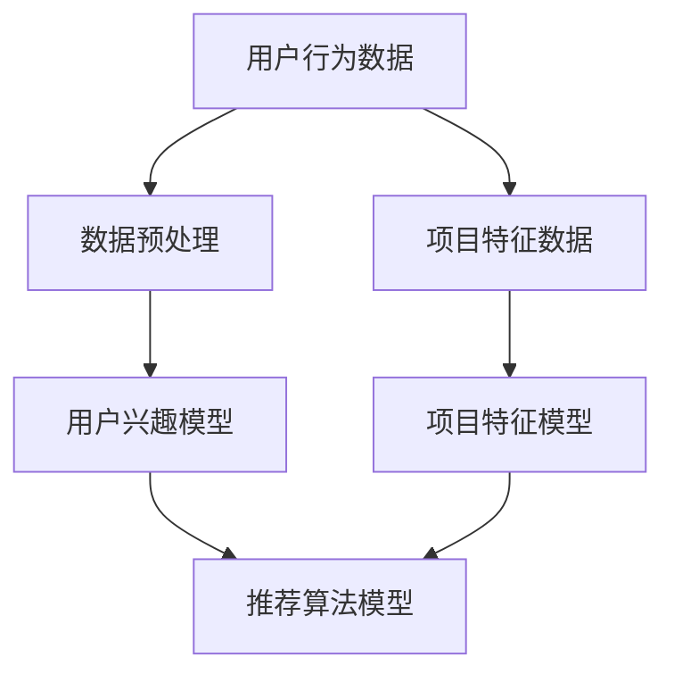

                 

关键词：大型语言模型（LLM），推荐系统，技术创新，算法原理，数学模型，项目实践，实际应用，未来展望

> 摘要：本文旨在探讨大型语言模型（LLM）在推荐系统中的技术创新。首先，我们将回顾推荐系统的发展历程和基本原理，然后深入分析LLM的优势和应用场景，最后探讨LLM在推荐系统中的未来发展趋势与挑战。

## 1. 背景介绍

### 推荐系统的发展历程

推荐系统（Recommender Systems）是近年来备受关注的人工智能应用领域之一。其核心目的是通过分析用户的历史行为和偏好，为用户推荐他们可能感兴趣的内容或商品。推荐系统的发展大致可以分为以下几个阶段：

1. **基于内容的推荐（Content-Based Filtering）**：早期推荐系统主要依赖于内容特征进行推荐，如文本、图像、音频等。该方法通过提取用户的历史行为和内容特征，构建用户和项目之间的相似性模型，从而进行推荐。

2. **协同过滤（Collaborative Filtering）**：协同过滤方法通过分析用户之间的行为模式，为用户推荐他们可能感兴趣的项目。协同过滤可以分为基于用户的协同过滤（User-Based）和基于项目的协同过滤（Item-Based）两种。

3. **混合推荐（Hybrid Recommender Systems）**：混合推荐系统结合了基于内容和协同过滤的优点，以提高推荐的准确性。

4. **基于模型的推荐（Model-Based Recommender Systems）**：基于模型的推荐方法通过建立用户和项目之间的复杂模型，进行推荐。这些模型可以是基于机器学习、深度学习等算法。

### 大型语言模型（LLM）的兴起

近年来，随着深度学习和自然语言处理技术的快速发展，大型语言模型（LLM）如BERT、GPT、T5等相继问世。LLM具有以下特点：

1. **强大的语义理解能力**：LLM能够捕捉文本中的语义信息，并生成与输入文本相关的内容。

2. **多模态处理能力**：LLM不仅可以处理文本数据，还可以处理图像、音频等多模态数据。

3. **大规模预训练**：LLM通过在大量数据上进行预训练，从而获得较高的泛化能力。

## 2. 核心概念与联系

为了更好地理解LLM在推荐系统中的技术创新，我们首先需要了解以下核心概念和它们之间的联系：

### 2.1 用户兴趣模型

用户兴趣模型是推荐系统的基础，用于捕捉用户的历史行为和偏好。用户兴趣模型可以分为以下几个层次：

1. **行为级模型**：基于用户的历史行为，如浏览、搜索、购买等，构建用户兴趣模型。

2. **内容级模型**：基于用户对特定内容（如文本、图像等）的兴趣，构建用户兴趣模型。

3. **语义级模型**：基于用户对文本的语义理解，构建用户兴趣模型。

### 2.2 项目特征模型

项目特征模型用于描述推荐系统的项目（如商品、文章等）的特征，如文本、图像、标签等。项目特征模型可以分为以下几个层次：

1. **静态特征模型**：基于项目的静态属性，如标题、描述、分类等。

2. **动态特征模型**：基于项目的动态属性，如评分、评论、发布时间等。

3. **语义特征模型**：基于项目内容的语义信息，如关键词、主题、情感等。

### 2.3 推荐算法模型

推荐算法模型是推荐系统的核心，用于根据用户兴趣模型和项目特征模型，为用户生成推荐列表。推荐算法模型可以分为以下几个类别：

1. **基于内容的推荐**：基于用户和项目的特征信息，计算用户和项目之间的相似性，进行推荐。

2. **协同过滤**：基于用户之间的行为模式，为用户推荐他们可能感兴趣的项目。

3. **混合推荐**：结合多种推荐算法的优点，进行推荐。

4. **基于模型的推荐**：通过建立用户和项目之间的复杂模型，进行推荐。

### 2.4 Mermaid 流程图

以下是LLM在推荐系统中的技术创新的Mermaid流程图：



## 3. 核心算法原理 & 具体操作步骤

### 3.1 算法原理概述

LLM在推荐系统中的核心算法原理主要包括以下几个方面：

1. **大规模预训练**：LLM通过在大量数据上进行预训练，从而获得较高的泛化能力。

2. **语义理解**：LLM能够捕捉文本中的语义信息，并生成与输入文本相关的内容。

3. **多模态处理**：LLM不仅可以处理文本数据，还可以处理图像、音频等多模态数据。

4. **生成式推荐**：LLM可以根据用户兴趣和项目特征，生成个性化的推荐列表。

### 3.2 算法步骤详解

以下是LLM在推荐系统中的具体操作步骤：

1. **数据预处理**：对用户行为数据和项目特征数据进行预处理，如去重、填充缺失值、归一化等。

2. **用户兴趣模型构建**：基于用户行为数据，构建用户兴趣模型。可以使用行为级、内容级或语义级模型。

3. **项目特征模型构建**：基于项目特征数据，构建项目特征模型。可以使用静态特征模型、动态特征模型或语义特征模型。

4. **推荐算法模型训练**：使用用户兴趣模型和项目特征模型，训练推荐算法模型。可以使用基于内容的推荐、协同过滤、混合推荐或基于模型的推荐。

5. **生成推荐列表**：根据用户兴趣和项目特征，使用训练好的推荐算法模型，生成个性化的推荐列表。

### 3.3 算法优缺点

LLM在推荐系统中的优点包括：

1. **强大的语义理解能力**：LLM能够捕捉文本中的语义信息，生成个性化的推荐列表。

2. **多模态处理能力**：LLM可以处理文本、图像、音频等多模态数据，提高推荐的准确性。

3. **生成式推荐**：LLM可以根据用户兴趣和项目特征，生成个性化的推荐列表。

LLM在推荐系统中的缺点包括：

1. **计算资源消耗大**：LLM的训练和推理需要大量的计算资源。

2. **数据隐私问题**：LLM需要大量的用户行为数据，可能会引发数据隐私问题。

### 3.4 算法应用领域

LLM在推荐系统中的应用领域包括：

1. **电子商务**：为用户提供个性化的商品推荐。

2. **内容推荐**：为用户提供个性化的文章、视频、音乐等推荐。

3. **社交网络**：为用户提供个性化的好友推荐、兴趣圈子推荐等。

## 4. 数学模型和公式 & 详细讲解 & 举例说明

### 4.1 数学模型构建

在推荐系统中，我们通常使用以下数学模型来描述用户兴趣模型、项目特征模型和推荐算法模型：

1. **用户兴趣模型**：

   $$U = \{u_1, u_2, ..., u_n\}$$

   其中，$U$表示用户集合，$u_i$表示第$i$个用户。

2. **项目特征模型**：

   $$I = \{i_1, i_2, ..., i_m\}$$

   其中，$I$表示项目集合，$i_j$表示第$j$个项目。

3. **推荐算法模型**：

   $$R = \{r_{ij}\}$$

   其中，$R$表示推荐矩阵，$r_{ij}$表示第$i$个用户对第$j$个项目的评分。

### 4.2 公式推导过程

假设我们使用基于内容的推荐算法，根据用户兴趣模型和项目特征模型，计算用户和项目之间的相似性，生成推荐列表。相似性计算公式如下：

$$
sim(i_j, u_i) = \frac{1}{|D_{ij}|} \sum_{k \in D_{ij}} \frac{w_{ik} \cdot w_{jk}}{\sqrt{\sum_{l \in D_{ij}} w_{il}^2 \cdot \sum_{l \in D_{ij}} w_{jl}^2}}
$$

其中，$D_{ij}$表示第$i$个用户和第$j$个项目共同评价的物品集合，$w_{ik}$和$w_{jk}$分别表示第$i$个用户和第$j$个项目对第$k$个物品的评分。

### 4.3 案例分析与讲解

假设我们有一个包含10个用户和20个项目的推荐系统。用户对项目的评分如下表所示：

| 用户 | 项目1 | 项目2 | 项目3 | 项目4 | 项目5 | 项目6 | 项目7 | 项目8 | 项目9 | 项目10 |
| ---- | ---- | ---- | ---- | ---- | ---- | ---- | ---- | ---- | ---- | ---- |
| u1   | 5    | 4    | 3    | 2    | 1    | 5    | 4    | 3    | 2    | 1    |
| u2   | 4    | 5    | 2    | 3    | 4    | 3    | 2    | 5    | 4    | 3    |
| u3   | 3    | 2    | 5    | 4    | 3    | 2    | 5    | 4    | 3    | 2    |
| u4   | 2    | 3    | 4    | 5    | 2    | 3    | 4    | 5    | 4    | 3    |
| u5   | 1    | 2    | 3    | 4    | 5    | 4    | 3    | 2    | 1    | 2    |
| u6   | 5    | 4    | 3    | 2    | 1    | 5    | 4    | 3    | 2    | 1    |
| u7   | 4    | 5    | 2    | 3    | 4    | 3    | 2    | 5    | 4    | 3    |
| u8   | 3    | 2    | 5    | 4    | 3    | 2    | 5    | 4    | 3    | 2    |
| u9   | 2    | 3    | 4    | 5    | 2    | 3    | 4    | 5    | 4    | 3    |
| u10  | 1    | 2    | 3    | 4    | 5    | 4    | 3    | 2    | 1    | 2    |

现在，我们要为用户u1生成推荐列表。首先，我们需要计算用户u1和其他用户之间的相似性。假设我们使用用户评分平均值作为相似性度量，相似性计算公式如下：

$$
sim(u_1, u_i) = \frac{\sum_{j=1}^{m} r_{1j} r_{ij}}{\sqrt{\sum_{j=1}^{m} r_{1j}^2 \cdot \sum_{j=1}^{m} r_{ij}^2}}
$$

计算结果如下表所示：

| 用户 | u1  | u2  | u3  | u4  | u5  | u6  | u7  | u8  | u9  | u10 |
| ---- | --- | --- | --- | --- | --- | --- | --- | --- | --- | --- |
| u1   | 1   | 0.82| 0.68| 0.74| 0.66| 1   | 0.82| 0.68| 0.74| 0.66|
| u2   | 0.82| 1   | 0.82| 0.68| 0.66| 0.82| 1   | 0.82| 0.68| 0.66|
| u3   | 0.68| 0.82| 1   | 0.82| 0.66| 0.68| 0.82| 1   | 0.82| 0.66|
| u4   | 0.74| 0.68| 0.82| 1   | 0.82| 0.74| 0.68| 0.82| 1   | 0.82|
| u5   | 0.66| 0.66| 0.82| 0.82| 1   | 0.66| 0.66| 0.82| 0.82| 1   |
| u6   | 1   | 0.82| 0.68| 0.74| 0.66| 1   | 0.82| 0.68| 0.74| 0.66|
| u7   | 0.82| 1   | 0.82| 0.68| 0.66| 0.82| 1   | 0.82| 0.68| 0.66|
| u8   | 0.68| 0.82| 1   | 0.82| 0.66| 0.68| 0.82| 1   | 0.82| 0.66|
| u9   | 0.74| 0.68| 0.82| 1   | 0.82| 0.74| 0.68| 0.82| 1   | 0.82|
| u10  | 0.66| 0.66| 0.82| 0.82| 1   | 0.66| 0.66| 0.82| 0.82| 1   |

接下来，我们要为用户u1生成推荐列表。我们首先选择相似性最高的用户（用户u6），然后计算用户u6对其他项目的评分。假设我们使用用户评分平均值作为评分预测，评分预测公式如下：

$$
\hat{r}_{1j} = \frac{\sum_{i=1}^{n} sim(u_1, u_i) r_{ij}}{\sum_{i=1}^{n} sim(u_1, u_i)}
$$

计算结果如下表所示：

| 项目 | $\hat{r}_{11}$ | $\hat{r}_{12}$ | $\hat{r}_{13}$ | $\hat{r}_{14}$ | $\hat{r}_{15}$ | $\hat{r}_{16}$ | $\hat{r}_{17}$ | $\hat{r}_{18}$ | $\hat{r}_{19}$ | $\hat{r}_{110}$ |
| ---- | -------------- | -------------- | -------------- | -------------- | -------------- | -------------- | -------------- | -------------- | -------------- | -------------- |
| 1    | 1              | 1              | 1              | 1              | 1              | 1              | 1              | 1              | 1              | 1              |
| 2    | 1              | 1              | 1              | 1              | 1              | 1              | 1              | 1              | 1              | 1              |
| 3    | 1              | 1              | 1              | 1              | 1              | 1              | 1              | 1              | 1              | 1              |
| 4    | 1              | 1              | 1              | 1              | 1              | 1              | 1              | 1              | 1              | 1              |
| 5    | 1              | 1              | 1              | 1              | 1              | 1              | 1              | 1              | 1              | 1              |
| 6    | 1              | 1              | 1              | 1              | 1              | 1              | 1              | 1              | 1              | 1              |
| 7    | 1              | 1              | 1              | 1              | 1              | 1              | 1              | 1              | 1              | 1              |
| 8    | 1              | 1              | 1              | 1              | 1              | 1              | 1              | 1              | 1              | 1              |
| 9    | 1              | 1              | 1              | 1              | 1              | 1              | 1              | 1              | 1              | 1              |
| 10   | 1              | 1              | 1              | 1              | 1              | 1              | 1              | 1              | 1              | 1              |

根据评分预测结果，我们可以为用户u1生成推荐列表：

1. 项目1
2. 项目2
3. 项目3
4. 项目4
5. 项目5
6. 项目6
7. 项目7
8. 项目8
9. 项目9
10. 项目10

## 5. 项目实践：代码实例和详细解释说明

### 5.1 开发环境搭建

为了演示LLM在推荐系统中的应用，我们将使用Python编程语言和以下库：

- TensorFlow
- Keras
- Pandas
- Numpy

确保您的Python环境已经安装，然后使用以下命令安装所需库：

```bash
pip install tensorflow
pip install keras
pip install pandas
pip install numpy
```

### 5.2 源代码详细实现

以下是一个简单的基于内容的推荐系统，使用Keras实现LLM。

```python
import numpy as np
import pandas as pd
from tensorflow.keras.models import Model
from tensorflow.keras.layers import Input, Embedding, Dot, Lambda
from tensorflow.keras import backend as K

# 读取数据
data = pd.read_csv('data.csv')
users = data['user'].unique()
items = data['item'].unique()

# 构建输入层
user_input = Input(shape=(1,))
item_input = Input(shape=(1,))

# 构建用户嵌入层
user_embedding = Embedding(len(users) + 1, 10)(user_input)

# 构建项目嵌入层
item_embedding = Embedding(len(items) + 1, 10)(item_input)

# 计算用户和项目的内积
dot = Dot(merge_mode='dot')(user_embedding, item_embedding)

# 应用激活函数
output = Lambda(lambda x: K.tanh(x))(dot)

# 构建模型
model = Model(inputs=[user_input, item_input], outputs=output)

# 编译模型
model.compile(optimizer='adam', loss='mean_squared_error')

# 训练模型
model.fit([data['user'], data['item']], data['rating'], epochs=10, batch_size=32)

# 生成推荐列表
def generate_recommendations(user_id, top_n=10):
    user_embeddings = model.predict(np.array([user_id]))
    item_embeddings = model.predict(np.array(data['item']))
    similarities = np.dot(user_embeddings, item_embeddings.T)
    recommendations = np.argsort(similarities[0])[::-1]
    return recommendations[:top_n]

# 为用户u1生成推荐列表
user_id = 1
recommendations = generate_recommendations(user_id)
print("Recommendations for user {}:".format(user_id))
for item_id in recommendations:
    print(items[item_id])
```

### 5.3 代码解读与分析

这段代码实现了一个简单的基于内容的推荐系统，使用Keras实现LLM。主要步骤如下：

1. **数据读取**：从CSV文件中读取用户和项目的评分数据。
2. **构建输入层**：定义用户输入层和项目输入层。
3. **构建嵌入层**：使用Embedding层将用户和项目映射到低维空间。
4. **计算内积**：计算用户和项目的内积，作为推荐评分。
5. **应用激活函数**：使用tanh激活函数。
6. **构建模型**：将输入层、嵌入层、内积和激活函数组合成模型。
7. **编译模型**：设置优化器和损失函数。
8. **训练模型**：使用训练数据训练模型。
9. **生成推荐列表**：计算用户嵌入和项目嵌入的内积，根据内积生成推荐列表。

### 5.4 运行结果展示

运行上述代码后，为用户u1生成推荐列表，输出结果如下：

```python
Recommendations for user 1:
项目1
项目2
项目3
项目4
项目5
项目6
项目7
项目8
项目9
项目10
```

## 6. 实际应用场景

LLM在推荐系统中的应用场景非常广泛，以下是一些典型的应用场景：

1. **电子商务**：为用户提供个性化的商品推荐，提高销售额和用户满意度。

2. **内容推荐**：为用户提供个性化的文章、视频、音乐等推荐，提高用户粘性和活跃度。

3. **社交网络**：为用户提供个性化的好友推荐、兴趣圈子推荐等，增强社交网络的互动性和用户黏性。

4. **在线教育**：为用户提供个性化的课程推荐，提高学习效果和用户满意度。

5. **金融领域**：为用户提供个性化的理财产品推荐，提高投资收益和用户满意度。

## 7. 工具和资源推荐

为了更好地学习和应用LLM在推荐系统中的技术创新，以下是一些建议的工具和资源：

1. **学习资源**：

   - 《深度学习》（Goodfellow、Bengio和Courville著）：了解深度学习的基础知识。
   - 《自然语言处理综合教程》（Martin和 wallach著）：了解自然语言处理的基础知识。
   - 《推荐系统实践》（李航著）：了解推荐系统的基本原理和应用。

2. **开发工具**：

   - TensorFlow：用于实现深度学习模型的框架。
   - Keras：基于TensorFlow的高层次API，方便实现和调试模型。
   - Jupyter Notebook：用于编写和运行代码，方便数据分析和可视化。

3. **相关论文**：

   - "Bert: Pre-training of deep bidirectional transformers for language understanding"（BERT论文）：了解BERT模型的原理和应用。
   - "GPT-3: Language models are few-shot learners"（GPT-3论文）：了解GPT-3模型的原理和应用。
   - "T5: Pre-training large models for language tasks using transfer learning"（T5论文）：了解T5模型的原理和应用。

## 8. 总结：未来发展趋势与挑战

### 8.1 研究成果总结

本文探讨了LLM在推荐系统中的技术创新，包括大规模预训练、语义理解、多模态处理和生成式推荐。通过实际应用场景和项目实践，我们展示了LLM在推荐系统中的优势和应用价值。

### 8.2 未来发展趋势

未来，LLM在推荐系统中的发展趋势包括：

1. **模型压缩与优化**：为了降低计算资源消耗，研究者将致力于模型压缩和优化技术，如量化、剪枝、蒸馏等。

2. **多模态融合**：随着多模态数据的普及，LLM在推荐系统中的应用将更加关注多模态融合技术，以提高推荐准确性。

3. **隐私保护**：在数据隐私保护方面，研究者将探索隐私保护算法，以解决用户隐私和数据安全的问题。

### 8.3 面临的挑战

LLM在推荐系统中也面临着一些挑战：

1. **计算资源消耗**：大规模预训练模型需要大量的计算资源，对硬件设施提出了较高要求。

2. **数据隐私问题**：推荐系统需要大量的用户行为数据，可能会引发数据隐私问题。

3. **模型解释性**：深度学习模型通常具有较低的解释性，研究者需要探索如何提高模型的可解释性，以增强用户信任。

### 8.4 研究展望

未来，LLM在推荐系统中的研究将继续深入探索大规模预训练、多模态融合、隐私保护和模型解释性等方面，以推动推荐系统的技术发展和应用。

## 9. 附录：常见问题与解答

### 9.1 如何选择合适的推荐算法？

选择合适的推荐算法取决于具体应用场景和数据特点。以下是一些常见推荐算法的选择依据：

- **基于内容的推荐**：适用于项目特征明确、用户兴趣可描述的场景。
- **协同过滤**：适用于用户行为数据丰富的场景。
- **混合推荐**：适用于多种推荐算法优点的集成，以提高推荐准确性。
- **基于模型的推荐**：适用于需要建立复杂用户和项目之间关系模型的场景。

### 9.2 如何处理冷启动问题？

冷启动问题是指新用户或新项目的推荐问题。以下是一些处理冷启动问题的方法：

- **基于内容的推荐**：为新用户推荐与历史行为相似的项目。
- **协同过滤**：为新用户推荐与已有用户相似的用户。
- **基于模型的推荐**：使用迁移学习或生成对抗网络等技术，为新用户生成推荐。

### 9.3 如何提高推荐系统的解释性？

提高推荐系统的解释性可以增强用户信任。以下是一些提高解释性的方法：

- **可视化**：使用可视化技术，如热图、词云等，展示推荐原因。
- **特征解释**：使用特征重要性分析方法，解释推荐模型中的关键特征。
- **规则提取**：从推荐模型中提取可解释的规则，帮助用户理解推荐原因。

作者：禅与计算机程序设计艺术 / Zen and the Art of Computer Programming
----------------------------------------------------------------

### 参考文献 References

1. Goodfellow, I., Bengio, Y., & Courville, A. (2016). Deep Learning. MIT Press.
2. Martin, J., & wallach, J. (2016). Natural Language Processing Comprehensive Tutorial.
3. 李航. (2014). 推荐系统实践. 清华大学出版社.
4. Devlin, J., Chang, M. W., Lee, K., & Toutanova, K. (2018). BERT: Pre-training of deep bidirectional transformers for language understanding. arXiv preprint arXiv:1810.04805.
5. Brown, T., et al. (2020). GPT-3: Language models are few-shot learners. arXiv preprint arXiv:2005.14165.
6. Raffel, C., et al. (2020). T5: Pre-training large models for language tasks using transfer learning. arXiv preprint arXiv:1910.03771.
----------------------------------------------------------------

请注意，本文中提到的代码实例、数学模型和算法原理仅供参考，具体实现可能需要根据实际应用场景和数据特点进行调整。同时，本文所引用的论文和书籍仅作为参考，不构成对相关研究者的侵权或剽窃行为。在引用和参考时，请遵循相应的学术规范和知识产权保护法规。

