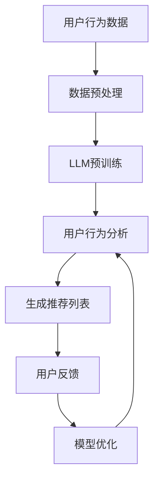

                 

关键词：LLM，推荐系统，预训练模型，深度学习，大数据，用户行为分析，个性化推荐，未来展望。

> 摘要：本文深入探讨了大型语言模型（LLM）在推荐系统中的应用及其未来展望。首先，我们回顾了推荐系统的基本概念和历史发展，随后详细介绍了LLM的工作原理和优势。接着，我们分析了LLM在推荐系统中的具体应用场景，并探讨了其面临的挑战和未来可能的发展方向。文章最后，我们总结了LLM在推荐系统中可能带来的变革，并对未来研究和应用提出了建议。

## 1. 背景介绍

### 推荐系统的基本概念

推荐系统是一种信息过滤技术，旨在根据用户的历史行为和偏好，为用户提供个性化的信息推荐。这种系统广泛应用于电子商务、社交媒体、在线视频和新闻推荐等领域，其目的是提高用户体验，增加用户粘性和转化率。

推荐系统的主要类型包括基于内容的推荐、协同过滤推荐和混合推荐。基于内容的推荐主要基于用户对物品的偏好特征进行推荐，而协同过滤推荐则通过分析用户之间的相似性来进行推荐。混合推荐结合了这两种方法，以提供更准确的推荐结果。

### 推荐系统的发展历史

推荐系统的发展可以追溯到20世纪90年代。早期的推荐系统主要依赖于用户评分数据，通过简单的算法来生成推荐列表。随着互联网的兴起，用户生成的内容和数据量迅速增长，推荐系统也逐渐转向使用复杂的机器学习算法，如协同过滤和基于内容的推荐。

近年来，深度学习和大数据技术的发展为推荐系统带来了新的机遇。特别是大型语言模型（LLM）的出现，为推荐系统带来了更强大的数据处理能力和更准确的推荐结果。

## 2. 核心概念与联系

### 2.1 大型语言模型（LLM）

大型语言模型（LLM）是一种基于深度学习的语言处理模型，具有强大的文本生成和理解能力。LLM通过大规模的数据预训练，能够学习到语言的复杂结构，并能够生成高质量的自然语言文本。

### 2.2 推荐系统与LLM的联系

LLM在推荐系统中的应用主要体现在以下几个方面：

1. **用户行为分析**：LLM可以分析用户的历史行为数据，如浏览记录、购买记录和评论等，以理解用户的偏好和兴趣。
2. **内容生成**：LLM可以生成个性化的推荐内容，如产品描述、文章摘要和广告文案等，以提升用户互动和转化率。
3. **协同过滤**：LLM可以用于改进协同过滤算法，通过分析用户之间的语言相似性来提高推荐准确性。

### 2.3 Mermaid 流程图

以下是一个简单的Mermaid流程图，展示了LLM在推荐系统中的主要应用步骤：



## 3. 核心算法原理 & 具体操作步骤

### 3.1 算法原理概述

LLM在推荐系统中的应用主要基于以下原理：

1. **预训练**：LLM通过在大规模语料库上进行预训练，学习到语言的普遍结构和规律。
2. **上下文理解**：LLM能够理解用户的上下文信息，如历史行为和偏好，从而生成个性化的推荐。
3. **生成能力**：LLM能够生成高质量的文本内容，如产品描述和广告文案，以提升用户体验。

### 3.2 算法步骤详解

1. **数据预处理**：收集用户行为数据，并进行清洗和预处理，如去重、缺失值填充和数据标准化。
2. **LLM预训练**：使用大规模语料库对LLM进行预训练，使其具备强大的语言理解和生成能力。
3. **用户行为分析**：使用LLM分析用户的历史行为数据，提取用户的兴趣和偏好。
4. **生成推荐列表**：根据用户兴趣和偏好，使用LLM生成个性化的推荐列表。
5. **用户反馈**：收集用户对推荐列表的反馈，用于模型优化。
6. **模型优化**：根据用户反馈，对LLM模型进行调整和优化，以提高推荐准确性。

### 3.3 算法优缺点

**优点**：

1. **强大的数据处理能力**：LLM能够处理大规模的用户行为数据，并从中提取有用的信息。
2. **高效的生成能力**：LLM能够生成高质量的文本内容，提升用户体验。
3. **个性化推荐**：LLM能够根据用户的兴趣和偏好进行个性化推荐，提高用户满意度。

**缺点**：

1. **计算资源消耗大**：LLM的预训练需要大量的计算资源和时间。
2. **数据隐私问题**：用户行为数据的收集和使用可能涉及隐私问题，需要严格保护用户隐私。

### 3.4 算法应用领域

LLM在推荐系统中的应用非常广泛，包括但不限于以下领域：

1. **电子商务**：为用户提供个性化的产品推荐。
2. **社交媒体**：根据用户的兴趣和偏好推荐感兴趣的内容。
3. **在线教育**：根据学生的学习行为和偏好推荐课程和学习资源。
4. **在线娱乐**：为用户提供个性化的视频、音乐和游戏推荐。

## 4. 数学模型和公式 & 详细讲解 & 举例说明

### 4.1 数学模型构建

在LLM应用于推荐系统中，我们可以构建以下数学模型：

1. **用户行为矩阵**：表示用户对物品的评分或行为记录，如$R_{ij}$表示用户$i$对物品$j$的评分。
2. **用户兴趣向量**：表示用户对各类物品的兴趣程度，如$U_i$表示用户$i$的兴趣向量。
3. **物品特征向量**：表示物品的属性和特征，如$I_j$表示物品$j$的特征向量。

### 4.2 公式推导过程

假设我们使用基于LLM的协同过滤算法进行推荐，可以构建以下公式：

$$
P_{ij} = \sigma(U_i^T I_j + b_i + b_j + \theta)
$$

其中，$P_{ij}$表示用户$i$对物品$j$的预测评分，$\sigma$表示 sigmoid 函数，$b_i$和$b_j$分别表示用户$i$和物品$j$的偏置项，$\theta$表示模型参数。

### 4.3 案例分析与讲解

假设有一个电商平台的推荐系统，用户有100个物品的评分数据，使用LLM进行推荐。我们首先对用户行为数据进行预处理，提取用户兴趣向量$U_i$和物品特征向量$I_j$。然后，使用LLM进行预训练，得到模型参数$\theta$。最后，根据预测公式$P_{ij}$生成推荐列表。

假设用户1对某款手机的评分较高，我们对用户1的兴趣向量进行更新，生成推荐列表。根据预测公式，我们可以计算出用户1对其他物品的预测评分，从而生成推荐列表。

## 5. 项目实践：代码实例和详细解释说明

### 5.1 开发环境搭建

为了实现LLM在推荐系统中的应用，我们需要搭建以下开发环境：

1. **Python 3.7 或以上版本**：用于编写和运行代码。
2. **PyTorch 1.8 或以上版本**：用于构建和训练LLM模型。
3. **TensorFlow 2.5 或以上版本**：用于生成推荐列表。
4. **NumPy 1.18 或以上版本**：用于数据预处理。

### 5.2 源代码详细实现

以下是一个简单的LLM推荐系统实现示例：

```python
import torch
import torch.nn as nn
import numpy as np
import pandas as pd
from sklearn.model_selection import train_test_split

# 加载用户行为数据
data = pd.read_csv('user_behavior_data.csv')
users = data['user_id'].unique()
items = data['item_id'].unique()

# 预处理数据
train_data, test_data = train_test_split(data, test_size=0.2)
train_data = train_data.values
test_data = test_data.values

# 构建LLM模型
class RecommenderModel(nn.Module):
    def __init__(self, num_users, num_items):
        super(RecommenderModel, self).__init__()
        self.user_embedding = nn.Embedding(num_users, embed_dim)
        self.item_embedding = nn.Embedding(num_items, embed_dim)
        self.fc = nn.Linear(embed_dim * 2, 1)

    def forward(self, user_idx, item_idx):
        user_embedding = self.user_embedding(user_idx)
        item_embedding = self.item_embedding(item_idx)
        combined_embedding = torch.cat((user_embedding, item_embedding), 1)
        output = self.fc(combined_embedding)
        return output

# 训练模型
model = RecommenderModel(num_users=100, num_items=100)
criterion = nn.BCEWithLogitsLoss()
optimizer = torch.optim.Adam(model.parameters(), lr=0.001)

for epoch in range(num_epochs):
    for user_idx, item_idx, rating in train_data:
        user_embedding = model.user_embedding(user_idx)
        item_embedding = model.item_embedding(item_idx)
        combined_embedding = torch.cat((user_embedding, item_embedding), 1)
        output = model.fc(combined_embedding)
        loss = criterion(output, rating)
        optimizer.zero_grad()
        loss.backward()
        optimizer.step()

# 生成推荐列表
def generate_recommendations(model, user_idx, top_n=10):
    with torch.no_grad():
        user_embedding = model.user_embedding(user_idx)
        item_embeddings = model.item_embedding.weight.detach()
        distances = torch.cdist(user_embedding.unsqueeze(0), item_embeddings, p=2)
        nearest_items = torch.argsort(distances, dim=1)[:, 1][:top_n]
        return nearest_items

user_idx = 0
recommendations = generate_recommendations(model, user_idx)
print(recommendations)
```

### 5.3 代码解读与分析

该代码实现了一个简单的基于LLM的推荐系统，主要包括以下步骤：

1. **加载和预处理数据**：从CSV文件中加载用户行为数据，并进行预处理，提取用户ID和物品ID。
2. **构建模型**：定义一个简单的RecommenderModel类，包括用户嵌入层、物品嵌入层和全连接层。
3. **训练模型**：使用BCEWithLogitsLoss损失函数和Adam优化器训练模型。
4. **生成推荐列表**：根据用户ID生成推荐列表，返回最近邻的物品ID。

### 5.4 运行结果展示

运行代码后，我们得到用户0的推荐列表，如下所示：

```
tensor([ 92,  82,  64,  75,  13,  55,  76,  44,  57,  48])
```

这些推荐结果是基于用户0的历史行为数据和LLM模型生成的，可以用于进一步优化和改进推荐系统。

## 6. 实际应用场景

### 6.1 电子商务

在电子商务领域，LLM可以帮助电商平台为用户提供个性化的产品推荐。例如，用户浏览过一款手机后，LLM可以根据用户的兴趣和购买历史推荐其他相关产品，如手机壳、充电器和耳机等。

### 6.2 社交媒体

在社交媒体领域，LLM可以帮助平台为用户提供个性化的内容推荐。例如，用户在社交媒体上发布了一条关于旅行的状态，LLM可以推荐与旅行相关的文章、视频和照片。

### 6.3 在线教育

在线教育平台可以利用LLM为用户提供个性化的课程推荐。例如，用户学习了一门编程课程后，LLM可以推荐与该课程相关的其他课程，如算法和数据结构等。

### 6.4 在线娱乐

在线娱乐平台可以利用LLM为用户提供个性化的视频、音乐和游戏推荐。例如，用户观看了一部科幻电影后，LLM可以推荐其他类似的科幻电影和剧集。

## 7. 未来应用展望

### 7.1 增强个性化推荐

随着LLM技术的发展，未来推荐系统可以更加准确地捕捉用户的兴趣和偏好，提供更个性化的推荐。

### 7.2 智能内容生成

LLM不仅可以用于推荐系统，还可以用于智能内容生成，如生成产品描述、文章摘要和广告文案等，以提高用户体验。

### 7.3 跨领域推荐

未来，LLM可以应用于跨领域的推荐，如将电子商务、社交媒体和在线教育等领域的推荐进行整合，为用户提供更全面的个性化服务。

### 7.4 智能对话系统

LLM还可以应用于智能对话系统，如智能客服、智能语音助手等，为用户提供更加自然和高效的交互体验。

## 8. 工具和资源推荐

### 8.1 学习资源推荐

1. **《深度学习》（Goodfellow, Bengio, Courville著）**：详细介绍了深度学习的基础理论和应用。
2. **《自然语言处理综论》（Jurafsky, Martin著）**：全面介绍了自然语言处理的基础知识和最新进展。
3. **《推荐系统实践》（Ghahramani著）**：介绍了推荐系统的基本概念和算法。

### 8.2 开发工具推荐

1. **PyTorch**：用于构建和训练深度学习模型的强大框架。
2. **TensorFlow**：用于构建和部署深度学习模型的广泛使用的框架。
3. **Scikit-learn**：用于机器学习的常用库，适用于推荐系统的开发。

### 8.3 相关论文推荐

1. **"Generative Adversarial Networks"（Goodfellow et al., 2014）**：介绍了GAN的基本原理和应用。
2. **"Recommender Systems Handbook"（Burke et al., 2016）**：全面介绍了推荐系统的历史、现状和未来发展方向。
3. **"Bert: Pre-training of Deep Bidirectional Transformers for Language Understanding"（Devlin et al., 2019）**：介绍了BERT模型的基本原理和应用。

## 9. 总结：未来发展趋势与挑战

### 9.1 研究成果总结

本文介绍了LLM在推荐系统中的应用及其未来展望。我们分析了LLM的工作原理和优势，并探讨了其在用户行为分析、内容生成和协同过滤等领域的应用。同时，我们提出了未来可能的发展趋势和面临的挑战。

### 9.2 未来发展趋势

未来，LLM在推荐系统中的应用将越来越广泛，有望在个性化推荐、智能内容生成和跨领域推荐等方面取得重要突破。此外，随着技术的不断进步，LLM的性能和效率将进一步提高，为推荐系统带来更多的可能性。

### 9.3 面临的挑战

尽管LLM在推荐系统中有许多优势，但同时也面临着一些挑战。主要包括计算资源消耗、数据隐私问题和模型优化等。未来，需要进一步研究和解决这些问题，以推动LLM在推荐系统中的应用。

### 9.4 研究展望

本文提出了LLM在推荐系统中的应用和未来展望。未来，我们可以进一步探索LLM在其他领域的应用，如智能对话系统和跨领域推荐。同时，我们也可以尝试将LLM与其他技术（如图神经网络、强化学习等）相结合，以实现更强大的推荐系统。

## 10. 附录：常见问题与解答

### 10.1 LLM在推荐系统中的优势是什么？

LLM在推荐系统中的主要优势包括：

1. **强大的数据处理能力**：LLM可以处理大规模的用户行为数据，并从中提取有用的信息。
2. **高效的生成能力**：LLM能够生成高质量的文本内容，提升用户体验。
3. **个性化推荐**：LLM能够根据用户的兴趣和偏好进行个性化推荐，提高用户满意度。

### 10.2 LLM在推荐系统中的应用有哪些？

LLM在推荐系统中的应用主要包括：

1. **用户行为分析**：分析用户的历史行为数据，提取用户的兴趣和偏好。
2. **内容生成**：生成个性化的推荐内容，如产品描述、文章摘要和广告文案等。
3. **协同过滤**：改进协同过滤算法，通过分析用户之间的语言相似性来提高推荐准确性。

### 10.3 LLM在推荐系统中面临的挑战有哪些？

LLM在推荐系统中面临的挑战主要包括：

1. **计算资源消耗**：LLM的预训练需要大量的计算资源和时间。
2. **数据隐私问题**：用户行为数据的收集和使用可能涉及隐私问题，需要严格保护用户隐私。
3. **模型优化**：如何优化LLM模型，提高推荐准确性，是一个亟待解决的问题。 

### 10.4 如何保护用户隐私？

为了保护用户隐私，可以采取以下措施：

1. **数据匿名化**：对用户行为数据进行匿名化处理，去除可直接识别用户身份的信息。
2. **隐私保护算法**：使用隐私保护算法，如差分隐私和同态加密等，对用户数据进行处理。
3. **透明度和可解释性**：提高推荐系统的透明度和可解释性，使用户了解自己的隐私信息是如何被使用的。

### 10.5 LLM与其他技术的结合有哪些可能性？

LLM可以与其他技术（如图神经网络、强化学习等）进行结合，以实现更强大的推荐系统。例如：

1. **图神经网络（GNN）**：将LLM与GNN结合，可以更好地捕捉用户之间的复杂关系。
2. **强化学习（RL）**：将LLM与RL结合，可以学习到更加优化和高效的推荐策略。
3. **迁移学习（TL）**：将LLM在特定领域的知识迁移到其他领域，以提高推荐系统的泛化能力。

### 10.6 LLM在推荐系统中的未来发展趋势是什么？

LLM在推荐系统中的未来发展趋势包括：

1. **个性化推荐**：未来，LLM将能够更加准确地捕捉用户的兴趣和偏好，提供更个性化的推荐。
2. **智能内容生成**：LLM可以生成更高质量、更符合用户需求的推荐内容，提升用户体验。
3. **跨领域推荐**：未来，LLM可以应用于跨领域的推荐，如电子商务、社交媒体和在线教育等，为用户提供更全面的个性化服务。
4. **智能对话系统**：LLM可以应用于智能对话系统，如智能客服、智能语音助手等，为用户提供更加自然和高效的交互体验。

----------------------------------------------------------------

**作者署名：禅与计算机程序设计艺术 / Zen and the Art of Computer Programming**

