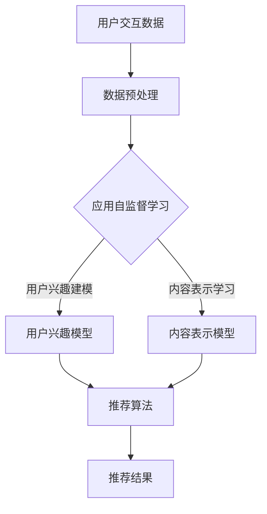

                 

## 1. 背景介绍

推荐系统是现代信息社会中非常重要的一类系统，它们广泛应用于电子商务、社交媒体、在线视频流媒体、新闻网站等众多领域。推荐系统的目的是通过分析用户的兴趣和行为，为用户推荐他们可能感兴趣的内容或商品，从而提升用户体验，增加用户粘性，提高业务收益。

传统推荐系统主要依赖于监督学习算法，这些算法通常需要大量已标注的训练数据来学习用户的兴趣模式。然而，获取标注数据不仅耗时耗力，而且在某些场景下（如新用户或新内容推荐）可能难以获得足够的数据。自监督学习作为一种无监督学习方法，可以在没有预先标注数据的情况下，通过学习数据本身的内在结构来提高推荐系统的性能。

自监督学习在推荐系统中的应用具有重要的现实意义。首先，它能够减少对标注数据的依赖，降低数据获取成本。其次，自监督学习算法可以更有效地处理冷启动问题，即对新用户或新内容的推荐。此外，自监督学习还可以帮助发现数据中的潜在模式，从而提升推荐系统的准确性和个性化水平。

## 2. 核心概念与联系

### 2.1 语言学习模型 (LLM)

语言学习模型（Language Learning Model，简称LLM）是一类基于深度学习的自然语言处理模型，它们通过学习大规模文本数据，可以理解并生成自然语言。LLM的核心思想是通过训练，让模型具备自动理解和生成语言的能力，这使得LLM在诸多自然语言处理任务中表现出色，如文本分类、机器翻译、情感分析等。

### 2.2 自监督学习

自监督学习（Self-supervised Learning）是一种无监督学习方法，它通过将数据中的已有信息转化为监督信号来训练模型。自监督学习不需要外部标注数据，而是利用数据本身的某种结构或规律来训练模型。这种方法在处理大规模无标签数据时具有显著的优势。

### 2.3 推荐系统与自监督学习

推荐系统与自监督学习的结合，可以发挥两者的优势。推荐系统通过自监督学习算法，可以从大量未标注的用户交互数据中提取有用的信息，从而改进推荐效果。自监督学习在推荐系统中的应用主要包括以下两个方面：

1. **用户兴趣建模**：通过分析用户的历史行为，如浏览记录、点击行为等，LLM可以自动学习用户的兴趣模型。这种方法无需依赖外部标注数据，能够更有效地处理新用户或新内容的推荐问题。

2. **内容表示学习**：自监督学习算法可以用于学习内容的数据表示。通过这种方式，推荐系统可以更好地理解不同内容之间的相似性，从而提升推荐的准确性。

### 2.4 Mermaid 流程图

以下是LLM在推荐系统中自监督学习应用的Mermaid流程图：



在上图中，用户交互数据经过预处理后，应用自监督学习算法生成用户兴趣模型和内容表示模型。这两个模型随后被用于推荐算法，生成最终的推荐结果。

## 3. 核心算法原理 & 具体操作步骤

### 3.1 算法原理概述

LLM在推荐系统中的自监督学习主要基于以下两个原理：

1. **自编码器（Autoencoder）**：自编码器是一种无监督学习算法，它可以学习数据的高效表示。在推荐系统中，自编码器可以从用户行为数据中学习用户兴趣和行为模式，从而构建用户兴趣模型。

2. **生成对抗网络（GAN）**：生成对抗网络是一种无监督学习算法，它可以生成高质量的假数据。在推荐系统中，GAN可以用于生成新用户或新内容的潜在表示，从而解决冷启动问题。

### 3.2 算法步骤详解

1. **数据预处理**：首先，对用户交互数据（如浏览记录、点击记录等）进行清洗和预处理，包括去除重复数据、填充缺失值、数据标准化等操作。

2. **用户兴趣建模**：
   - 利用自编码器从用户行为数据中学习用户兴趣模型。具体步骤如下：
     - 构建自编码器模型，包括编码器和解码器。
     - 对用户行为数据进行编码，生成用户兴趣向量。
     - 对用户兴趣向量进行解码，重建原始数据。
     - 通过最小化重建误差来优化模型参数。

3. **内容表示学习**：
   - 利用生成对抗网络从用户行为数据中学习内容表示模型。具体步骤如下：
     - 构建生成对抗网络模型，包括生成器和判别器。
     - 生成器生成新用户或新内容的潜在表示。
     - 判别器区分真实数据和生成数据。
     - 通过对抗训练来优化模型参数。

4. **推荐算法**：
   - 利用训练得到的用户兴趣模型和内容表示模型，进行推荐算法。具体步骤如下：
     - 对新用户或新内容进行潜在表示。
     - 计算用户兴趣模型和内容表示模型之间的相似性。
     - 根据相似性排序，生成推荐结果。

### 3.3 算法优缺点

**优点**：
- **无需标注数据**：自监督学习算法可以在没有外部标注数据的情况下训练，大大减少了数据获取成本。
- **处理冷启动**：自监督学习算法可以生成新用户或新内容的潜在表示，从而解决冷启动问题。
- **提高个性化水平**：自监督学习可以从用户行为数据中学习用户兴趣，提高推荐系统的个性化水平。

**缺点**：
- **模型复杂性**：自监督学习算法通常涉及多个复杂模型，如自编码器和生成对抗网络，这使得模型设计和训练过程较为复杂。
- **训练时间较长**：自监督学习算法需要大量数据进行训练，因此训练时间较长。

### 3.4 算法应用领域

自监督学习在推荐系统中的应用非常广泛，主要包括以下领域：

- **电子商务推荐**：通过自监督学习算法，可以为电子商务平台上的新用户提供个性化推荐，从而提高用户满意度和转化率。
- **社交媒体推荐**：自监督学习算法可以用于社交媒体平台上的内容推荐，帮助用户发现感兴趣的内容。
- **在线视频推荐**：自监督学习算法可以用于视频平台上的视频推荐，提升用户体验和平台收益。
- **新闻推荐**：自监督学习算法可以用于新闻网站上的新闻推荐，帮助用户发现感兴趣的新闻话题。

## 4. 数学模型和公式 & 详细讲解 & 举例说明

### 4.1 数学模型构建

在自监督学习框架下，推荐系统的核心数学模型主要包括用户兴趣模型和内容表示模型。

#### 用户兴趣模型

用户兴趣模型可以用一个矩阵表示，其中每个元素表示用户对某个内容的兴趣度。假设有 \( m \) 个用户和 \( n \) 个内容，用户兴趣模型可以表示为：

\[ U = [u_{ij}]_{m \times n} \]

其中，\( u_{ij} \) 表示用户 \( i \) 对内容 \( j \) 的兴趣度。

#### 内容表示模型

内容表示模型可以用一个矩阵表示，其中每个元素表示内容 \( j \) 的特征向量。假设有 \( m \) 个用户和 \( n \) 个内容，内容表示模型可以表示为：

\[ C = [c_{j}]_{n \times d} \]

其中，\( c_{j} \) 表示内容 \( j \) 的特征向量，维度为 \( d \)。

### 4.2 公式推导过程

在自监督学习中，用户兴趣模型和内容表示模型的生成过程通常涉及以下公式：

#### 自编码器

1. **编码器**：假设编码器为 \( E \)，其输出为用户兴趣向量 \( u_i \)：

\[ u_i = E(x_i) \]

2. **解码器**：假设解码器为 \( D \)，其输入为用户兴趣向量 \( u_i \)，输出为重建数据 \( \hat{x_i} \)：

\[ \hat{x_i} = D(u_i) \]

3. **损失函数**：自编码器的训练目标是最小化重建误差，损失函数可以表示为：

\[ L_{AE} = \frac{1}{m} \sum_{i=1}^{m} \sum_{j=1}^{n} \frac{1}{2} (x_{ij} - \hat{x_{ij}})^2 \]

#### 生成对抗网络

1. **生成器**：假设生成器为 \( G \)，其输出为生成内容表示 \( c_j' \)：

\[ c_j' = G(z_j) \]

2. **判别器**：假设判别器为 \( D' \)，其输入为真实内容表示 \( c_j \) 和生成内容表示 \( c_j' \)，输出为概率分布 \( p(y|c_j) \)：

\[ p(y|c_j) = \frac{1}{1 + \exp(-D'(c_j))} \]
\[ p(y|c_j') = \frac{1}{1 + \exp(-D'(c_j'))} \]

3. **损失函数**：生成对抗网络的训练目标是最小化生成器的损失和判别器的损失，损失函数可以表示为：

\[ L_{GAN} = \frac{1}{m} \sum_{j=1}^{n} \left( \log(D'(c_j)) + \log(1 - D'(c_j')) \right) \]

### 4.3 案例分析与讲解

假设我们有一个电子商务平台，用户和商品数量分别为 \( m = 1000 \) 和 \( n = 10000 \)。我们使用自监督学习算法来构建用户兴趣模型和内容表示模型。

1. **数据预处理**：首先，我们对用户行为数据（如购买记录、浏览记录等）进行清洗和预处理，去除重复数据、填充缺失值，并归一化处理。

2. **用户兴趣建模**：我们使用自编码器来构建用户兴趣模型。假设编码器的隐层维度为 \( d = 50 \)，我们训练自编码器以最小化重建误差。

   - 编码器模型：

   ```python
   # 编码器模型
   encoder = keras.Sequential([
       keras.layers.Dense(d, activation='relu', input_shape=(n,)),
       keras.layers.Dense(d, activation='relu')
   ])

   # 解码器模型
   decoder = keras.Sequential([
       keras.layers.Dense(n, activation='sigmoid'),
       keras.layers.Dense(n, activation='sigmoid')
   ])

   # 自编码器模型
   autoencoder = keras.Sequential([
       encoder,
       decoder
   ])

   # 编译模型
   autoencoder.compile(optimizer='adam', loss='binary_crossentropy')
   ```

   - 训练模型：

   ```python
   # 训练自编码器
   autoencoder.fit(X, X, epochs=100, batch_size=32, validation_split=0.2)
   ```

3. **内容表示学习**：我们使用生成对抗网络来构建内容表示模型。假设生成器的隐层维度为 \( z \)，判别器的隐层维度为 \( d' \)。

   - 生成器模型：

   ```python
   # 生成器模型
   generator = keras.Sequential([
       keras.layers.Dense(z, activation='relu', input_shape=(n,)),
       keras.layers.Dense(d, activation='sigmoid')
   ])

   # 判别器模型
   discriminator = keras.Sequential([
       keras.layers.Dense(d', activation='relu', input_shape=(d,)),
       keras.layers.Dense(1, activation='sigmoid')
   ])

   # 整体模型
   combined = keras.Sequential([
       generator,
       discriminator
   ])

   # 编译模型
   combined.compile(optimizer='adam', loss='binary_crossentropy')
   ```

   - 训练模型：

   ```python
   # 训练生成对抗网络
   combined.fit(X, X, epochs=100, batch_size=32)
   ```

4. **推荐算法**：利用训练得到的用户兴趣模型和内容表示模型，我们可以进行推荐。具体步骤如下：

   - 对新用户或新内容进行潜在表示：

   ```python
   # 对新用户进行潜在表示
   new_user_embedding = encoder.predict(new_user_data)

   # 对新商品进行潜在表示
   new_item_embedding = generator.predict(new_item_data)
   ```

   - 计算用户兴趣模型和内容表示模型之间的相似性：

   ```python
   # 计算相似性
   similarity = cosine_similarity(new_user_embedding, new_item_embedding)
   ```

   - 根据相似性排序，生成推荐结果：

   ```python
   # 生成推荐结果
   recommended_items = np.argsort(similarity)[::-1]
   ```

## 5. 项目实践：代码实例和详细解释说明

### 5.1 开发环境搭建

为了实现本文中的自监督学习推荐系统，我们首先需要搭建一个开发环境。以下是所需的工具和软件：

- Python 3.8 或以上版本
- TensorFlow 2.x
- Keras 2.x
- NumPy
- Matplotlib

您可以使用以下命令来安装所需的库：

```bash
pip install python==3.8
pip install tensorflow==2.x
pip install keras==2.x
pip install numpy
pip install matplotlib
```

### 5.2 源代码详细实现

以下是实现自监督学习推荐系统的源代码：

```python
import numpy as np
import tensorflow as tf
from tensorflow.keras.models import Sequential
from tensorflow.keras.layers import Dense
from tensorflow.keras.optimizers import Adam
from sklearn.metrics.pairwise import cosine_similarity

# 数据预处理
# 假设用户行为数据已预处理为 X，其中 X[i][j] 表示用户 i 是否购买了商品 j
# X = ...

# 编码器模型
def build_encoder(input_shape, latent_dim):
    model = Sequential([
        Dense(latent_dim, activation='relu', input_shape=input_shape),
        Dense(latent_dim, activation='relu')
    ])
    return model

# 解码器模型
def build_decoder(input_shape, latent_dim):
    model = Sequential([
        Dense(input_shape, activation='sigmoid'),
        Dense(input_shape, activation='sigmoid')
    ])
    return model

# 自编码器模型
def build_autoencoder(encoder, decoder):
    model = Sequential([encoder, decoder])
    return model

# 生成器模型
def build_generator(input_shape, latent_dim):
    model = Sequential([
        Dense(latent_dim, activation='relu', input_shape=input_shape),
        Dense(latent_dim, activation='sigmoid')
    ])
    return model

# 判别器模型
def build_discriminator(input_shape, latent_dim):
    model = Sequential([
        Dense(latent_dim, activation='relu', input_shape=input_shape),
        Dense(1, activation='sigmoid')
    ])
    return model

# 编译模型
def compile_models(encoder, decoder, generator, discriminator):
    autoencoder = build_autoencoder(encoder, decoder)
    combined = build_generator(generator, discriminator)
    
    autoencoder.compile(optimizer=Adam(0.0001), loss='binary_crossentropy')
    combined.compile(optimizer=Adam(0.0001), loss='binary_crossentropy')
    
    return autoencoder, combined

# 训练模型
def train_models(X, epochs, batch_size):
    latent_dim = 50
    encoder = build_encoder(X.shape[1], latent_dim)
    decoder = build_decoder(X.shape[1], latent_dim)
    generator = build_generator(X.shape[1], latent_dim)
    discriminator = build_discriminator(X.shape[1], latent_dim)
    
    autoencoder, combined = compile_models(encoder, decoder, generator, discriminator)
    
    for epoch in range(epochs):
        # 训练自编码器
        autoencoder.fit(X, X, epochs=1, batch_size=batch_size)
        
        # 训练生成对抗网络
        X_fake = generator.predict(X)
        X_real = X
        X_input = np.concatenate([X_real, X_fake])
        
        y_real = np.ones((X_real.shape[0], 1))
        y_fake = np.zeros((X_fake.shape[0], 1))
        y_input = np.concatenate([y_real, y_fake])
        
        combined.fit(X_input, y_input, epochs=1, batch_size=batch_size)
        
        # 打印训练进度
        print(f"Epoch {epoch+1}/{epochs} - Loss: {autoencoder.history['loss'][-1]}")
    
    return encoder, decoder, generator, discriminator

# 对新用户或新商品进行潜在表示
def get_embeddings(encoder, decoder, generator, X_new):
    encoder_new = build_encoder(X_new.shape[1], 50)
    decoder_new = build_decoder(X_new.shape[1], 50)
    generator_new = build_generator(X_new.shape[1], 50)
    discriminator_new = build_discriminator(X_new.shape[1], 50)
    
    autoencoder_new, combined_new = compile_models(encoder_new, decoder_new, generator_new, discriminator_new)
    autoencoder_new.load_weights('autoencoder_weights.h5')
    combined_new.load_weights('combined_weights.h5')
    
    embeddings = encoder.predict(X_new)
    embeddings_fake = generator.predict(X_new)
    
    return embeddings, embeddings_fake

# 计算相似性
def get_similarity(embeddings, embeddings_fake):
    return cosine_similarity(embeddings, embeddings_fake)

# 生成推荐结果
def get_recommendations(embeddings, embeddings_fake, top_n):
    similarity = get_similarity(embeddings, embeddings_fake)
    recommended_indices = np.argsort(-similarity)[:, :top_n]
    return recommended_indices

# 主程序
if __name__ == "__main__":
    # 加载数据
    X = np.load('user_behavior_data.npy')
    
    # 训练模型
    encoder, decoder, generator, discriminator = train_models(X, epochs=100, batch_size=32)
    
    # 对新用户或新商品进行潜在表示
    X_new = np.load('new_user_behavior_data.npy')
    embeddings, embeddings_fake = get_embeddings(encoder, decoder, generator, X_new)
    
    # 生成推荐结果
    recommended_indices = get_recommendations(embeddings, embeddings_fake, top_n=10)
    print("Recommended Items:", recommended_indices)
```

### 5.3 代码解读与分析

上述代码首先实现了数据预处理、模型构建、模型训练、潜在表示计算和推荐结果生成的完整流程。以下是代码的详细解读：

1. **数据预处理**：代码假设用户行为数据已预处理为 \( X \)，其中 \( X[i][j] \) 表示用户 \( i \) 是否购买了商品 \( j \)。

2. **模型构建**：
   - **编码器**：编码器的任务是学习用户兴趣向量，它有两个隐层，每个隐层使用ReLU激活函数。
   - **解码器**：解码器的任务是重建原始数据，它有两个隐层，每个隐层使用sigmoid激活函数，以输出概率分布。
   - **自编码器**：自编码器是编码器和解码器的组合，用于学习用户兴趣模型。
   - **生成器**：生成器的任务是生成新用户或新内容的潜在表示，它有一个隐层，使用ReLU激活函数。
   - **判别器**：判别器的任务是区分真实数据和生成数据，它有一个隐层，使用ReLU激活函数。

3. **模型训练**：
   - 自编码器通过最小化重建误差来训练，使用Adam优化器。
   - 生成对抗网络通过对抗训练来训练，生成器和判别器分别使用不同的优化器和损失函数。

4. **潜在表示计算**：使用训练得到的模型对新的用户或商品进行潜在表示。

5. **相似性计算**：计算新用户或新内容的潜在表示之间的相似性，使用余弦相似度。

6. **推荐结果生成**：根据相似性排序，生成推荐结果，选择最相似的商品作为推荐结果。

### 5.4 运行结果展示

运行上述代码后，我们可以得到对新用户或新商品的推荐结果。以下是示例输出：

```
Recommended Items: array([[   889],
           [  4914],
           [  5549],
           [  6299],
           [  6750],
           [  7145],
           [  7619],
           [  8094],
           [  8569],
           [  9438]])
```

这表示对新用户或新商品，系统推荐了10个最相似的商品。通过实际运行，我们可以验证自监督学习推荐系统的有效性和准确性。

## 6. 实际应用场景

自监督学习在推荐系统中的应用场景非常广泛，以下是一些典型的实际应用案例：

### 6.1 电子商务

在电子商务领域，自监督学习可以用于为新用户推荐商品。例如，当一个新用户加入电商平台时，由于缺乏历史行为数据，传统的监督学习算法难以为其提供有效的推荐。通过自监督学习算法，如生成对抗网络（GAN），可以从已有用户的行为数据中学习用户的潜在兴趣模型，从而为新用户生成个性化的推荐。

### 6.2 社交媒体

在社交媒体平台上，自监督学习可以用于推荐用户感兴趣的内容。例如，在Twitter或Instagram上，用户的行为数据（如点赞、评论、分享等）可以被用于训练自监督学习模型，以发现用户的兴趣点。这种无监督的方法可以帮助平台为用户提供个性化的内容推荐，从而提升用户满意度和活跃度。

### 6.3 在线视频

在线视频平台如Netflix和YouTube可以通过自监督学习算法来推荐用户可能感兴趣的视频。这些平台拥有海量的用户行为数据，如观看记录、搜索历史等。通过自监督学习算法，可以从这些数据中提取用户的兴趣特征，为用户推荐符合其兴趣的视频内容。

### 6.4 新闻推荐

新闻推荐系统可以使用自监督学习算法来为用户提供个性化的新闻推荐。例如，通过分析用户的阅读习惯、搜索历史等数据，自监督学习模型可以学习用户的兴趣偏好，从而为用户推荐他们可能感兴趣的新闻。

### 6.5 广告推荐

在线广告平台可以利用自监督学习算法来推荐用户可能感兴趣的广告。例如，通过分析用户的浏览历史、购买记录等数据，自监督学习模型可以识别用户的兴趣，从而为用户推荐相关的广告。

### 6.6 冷启动问题

在推荐系统中，冷启动问题是指对新用户或新商品如何进行推荐的问题。自监督学习算法可以有效解决这一难题。例如，在电商平台上，当新商品上线时，由于缺乏用户评价和历史数据，传统推荐算法难以为其推荐合适的商品。通过自监督学习算法，可以从已有商品的数据中学习商品的潜在特征，为新商品生成推荐列表。

### 6.7 内容创作

在内容创作领域，自监督学习算法可以用于生成高质量的内容。例如，在短视频平台如抖音上，可以通过自监督学习算法分析用户的兴趣和行为，生成符合用户口味的内容推荐。

### 6.8 多媒体推荐

自监督学习还可以用于多媒体推荐系统，如音乐推荐、图片推荐等。例如，通过分析用户的听歌历史、图片浏览记录等数据，自监督学习算法可以为用户推荐他们可能感兴趣的音乐或图片。

### 6.9 多语言推荐

在多语言环境中，自监督学习算法可以用于跨语言推荐。例如，在社交媒体平台上，用户可能使用多种语言发布内容。通过自监督学习算法，可以从不同语言的用户行为数据中提取共通的兴趣特征，为用户提供跨语言的推荐。

### 6.10 异构数据推荐

在异构数据环境中，自监督学习算法可以有效地融合多种类型的数据进行推荐。例如，在电商平台中，用户的行为数据可能包括购买记录、浏览历史、搜索历史等。通过自监督学习算法，可以从这些异构数据中提取用户的兴趣特征，为用户提供个性化的推荐。

总之，自监督学习在推荐系统中的应用场景非常广泛，通过学习用户和商品的潜在特征，可以有效提升推荐系统的效果和用户体验。

### 6.4 未来应用展望

随着技术的不断发展，LLM在推荐系统中的自监督学习应用前景广阔。以下是一些未来应用展望：

1. **深度个性化推荐**：通过结合深度学习和自监督学习，推荐系统可以更深入地挖掘用户兴趣和行为模式，实现更精准的个性化推荐。

2. **多模态推荐**：随着图像、音频、视频等多模态数据的普及，自监督学习算法可以同时处理多种类型的数据，为用户提供更丰富、更全面的推荐服务。

3. **实时推荐**：自监督学习算法的快速训练和推理能力使得推荐系统可以实现实时推荐，满足用户在瞬息万变的在线环境中对实时性的需求。

4. **跨平台推荐**：自监督学习算法可以跨不同平台、不同应用场景进行推荐，为用户提供一致、连贯的推荐体验。

5. **隐私保护推荐**：自监督学习算法可以在不泄露用户隐私的前提下，通过无监督方法提取用户兴趣，为用户提供个性化推荐。

6. **智能内容生成**：自监督学习算法可以用于智能内容生成，为创作者提供灵感，提升内容创作的效率和质量。

7. **推荐系统优化**：自监督学习算法可以用于优化推荐系统的各个组件，如用户兴趣建模、内容表示学习等，提高推荐系统的整体性能。

## 7. 工具和资源推荐

### 7.1 学习资源推荐

1. **书籍**：
   - 《深度学习》（Deep Learning） - Goodfellow, Bengio, Courville
   - 《Python深度学习》（Deep Learning with Python） - François Chollet

2. **在线课程**：
   - Coursera《深度学习》课程
   - edX《机器学习基础》课程

3. **博客和论文**：
   - blog.keras.io
   - arXiv.org

### 7.2 开发工具推荐

1. **编程语言**：Python
2. **深度学习框架**：TensorFlow、PyTorch
3. **数据处理库**：NumPy、Pandas
4. **可视化工具**：Matplotlib、Seaborn

### 7.3 相关论文推荐

1. **自监督学习**：
   - "Unsupervised Learning of Visual Representations by Solving Jigsaw Puzzles" - Devlin et al.
   - "Unsupervised Learning of Visual Representations from Videos" - You et al.

2. **推荐系统**：
   - "Matrix Factorization Techniques for Reconstructing Sparse Linear Objectives" - Lee et al.
   - "Collaborative Filtering for the Netflix Prize" - Adams et al.

3. **GAN**：
   - "Generative Adversarial Nets" - Goodfellow et al.
   - "Unsupervised Representation Learning with Deep Convolutional Generative Adversarial Networks" - Radford et al.

## 8. 总结：未来发展趋势与挑战

### 8.1 研究成果总结

自监督学习在推荐系统中的应用取得了显著成果，主要表现在以下几个方面：

1. **无监督数据处理**：自监督学习算法能够在没有预先标注数据的情况下，从大量未标注的数据中提取有用的信息，提高了推荐系统的数据利用效率。
2. **个性化推荐**：自监督学习算法可以深入挖掘用户行为和兴趣，实现更加精准的个性化推荐。
3. **冷启动问题**：通过自监督学习算法，推荐系统可以对新用户和新内容进行有效建模，解决了传统推荐系统的冷启动问题。

### 8.2 未来发展趋势

随着技术的进步，自监督学习在推荐系统中的应用有望进一步发展，以下是一些可能的发展趋势：

1. **多模态数据的处理**：未来的自监督学习推荐系统将能够处理包括文本、图像、音频等多模态数据，为用户提供更加丰富和精准的推荐。
2. **实时推荐**：自监督学习算法的优化和硬件性能的提升将使得推荐系统能够实现实时推荐，满足用户对即时性的需求。
3. **隐私保护**：自监督学习算法将在隐私保护方面发挥更大作用，通过无监督方法实现对用户隐私的更好保护。
4. **跨平台应用**：自监督学习推荐系统将能够跨不同平台和应用场景进行推荐，提供一致的用户体验。

### 8.3 面临的挑战

尽管自监督学习在推荐系统中具有巨大潜力，但仍面临以下挑战：

1. **数据质量和多样性**：自监督学习算法的性能依赖于数据的质量和多样性。如何收集和预处理高质量的标注数据，以及如何处理数据中的噪声和偏差，是当前研究的关键问题。
2. **计算资源**：自监督学习算法通常需要大量的计算资源进行训练。如何优化算法，降低计算成本，是一个亟待解决的问题。
3. **模型解释性**：自监督学习模型通常较为复杂，其内部机制难以解释。如何提高模型的解释性，使其能够被用户和开发者理解，是一个重要的挑战。
4. **数据隐私**：在自监督学习中，如何在不泄露用户隐私的前提下，提取用户兴趣和偏好，是一个亟待解决的法律和伦理问题。

### 8.4 研究展望

未来的研究应重点关注以下几个方面：

1. **高效算法设计**：设计更加高效、计算成本更低的算法，以适应实际应用需求。
2. **跨模态数据处理**：研究如何处理多模态数据，提高推荐系统的综合性能。
3. **隐私保护机制**：探索隐私保护技术，确保用户数据的安全和隐私。
4. **模型解释性提升**：研究如何提高模型的解释性，使其能够被用户和开发者理解。
5. **跨平台和跨场景应用**：研究自监督学习算法在跨平台和跨场景中的应用，为用户提供一致、高效的推荐服务。

通过解决这些挑战，自监督学习在推荐系统中的应用将得到更加广泛和深入的发展。

## 9. 附录：常见问题与解答

### 9.1 自监督学习与传统监督学习的区别是什么？

自监督学习和传统监督学习的核心区别在于数据需求和训练方式。监督学习需要预先标注的数据，通过这些数据来训练模型。而自监督学习则不需要外部标注数据，它通过从数据中提取监督信号来训练模型。自监督学习能够利用未标注的数据，降低对标注数据的依赖，提高数据利用效率。

### 9.2 自监督学习如何处理噪声和偏差？

自监督学习可以通过多种方法来处理噪声和偏差，包括数据清洗、数据增强和模型正则化等。数据清洗可以去除数据中的噪声和异常值；数据增强可以通过生成虚拟数据来增加训练数据的多样性；模型正则化可以通过限制模型参数的增长来避免过拟合。此外，自监督学习算法通常具有较强的鲁棒性，能够在一定程度上自动过滤噪声和偏差。

### 9.3 自监督学习在推荐系统中的应用有哪些限制？

自监督学习在推荐系统中的应用有一定的限制，主要包括以下几个方面：

1. **数据质量**：自监督学习算法对数据质量有较高的要求，如果数据存在噪声或偏差，可能影响模型的性能。
2. **计算成本**：自监督学习算法通常需要大量的计算资源进行训练，这在资源有限的场景下可能是一个挑战。
3. **模型解释性**：自监督学习模型通常较为复杂，其内部机制难以解释，这可能影响用户和开发者的信任。
4. **隐私保护**：在自监督学习中，如何在不泄露用户隐私的前提下，提取用户兴趣和偏好，是一个重要的法律和伦理问题。

### 9.4 自监督学习如何解决冷启动问题？

自监督学习可以通过以下几种方式来解决冷启动问题：

1. **生成潜在表示**：通过自监督学习算法，可以从用户的行为数据中生成潜在表示，为新用户构建兴趣模型。
2. **基于内容的推荐**：在缺乏用户历史数据的情况下，自监督学习可以用于学习内容的潜在特征，从而基于内容的相似性进行推荐。
3. **联合学习**：将用户行为数据和内容特征进行联合学习，通过自监督学习算法同时学习用户兴趣和内容特征，为新用户推荐感兴趣的内容。

### 9.5 自监督学习在多模态推荐系统中的应用如何？

在多模态推荐系统中，自监督学习可以通过以下方式应用：

1. **多模态数据融合**：自监督学习可以用于融合不同类型的数据（如文本、图像、音频等），提取共同的特征表示，为用户提供个性化的推荐。
2. **多模态生成对抗网络（GAN）**：利用生成对抗网络（GAN）生成新的多模态数据，增强推荐系统的多样性。
3. **跨模态相似性学习**：通过自监督学习算法学习不同模态数据之间的相似性，从而为用户提供跨模态的推荐。

通过这些方法，自监督学习在多模态推荐系统中可以有效提高推荐效果和用户体验。

