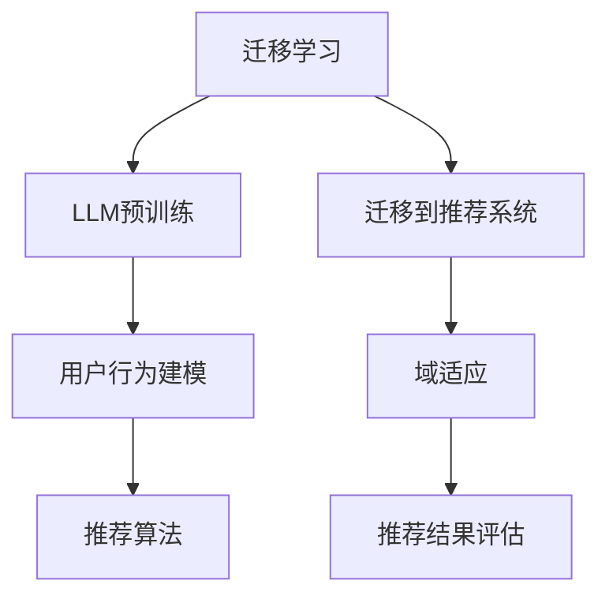

                 

关键词：大型语言模型（LLM），推荐系统，迁移学习，域适应，协同过滤，对抗生成网络（GAN）

> 摘要：随着人工智能技术的不断发展，推荐系统在互联网领域发挥着越来越重要的作用。本文旨在探讨大型语言模型（LLM）在推荐系统中的应用，特别是迁移学习和域适应技术的运用。通过详细阐述LLM的迁移学习与域适应原理、算法实现和实际应用，本文为推荐系统的优化和创新提供了新的思路。

## 1. 背景介绍

推荐系统是一种基于用户行为、兴趣和内容的算法系统，旨在为用户提供个性化、个性化的信息和服务。从最初的基于内容的推荐到协同过滤推荐，再到近年来基于深度学习的推荐，推荐系统经历了多个发展阶段。然而，现有推荐系统在处理冷启动问题、数据稀疏性和域迁移问题等方面仍面临诸多挑战。

近年来，大型语言模型（LLM）如GPT、BERT等在自然语言处理领域取得了显著的成果。LLM具有强大的语义理解、生成和推理能力，这使得它们在推荐系统中具有潜在的应用价值。本文将探讨LLM在推荐系统中的应用，重点关注迁移学习和域适应技术的运用。

## 2. 核心概念与联系

### 2.1 大型语言模型（LLM）

大型语言模型（LLM）是一种基于深度学习的自然语言处理模型，具有强大的语义理解、生成和推理能力。LLM通过对大量文本数据进行预训练，学会了语言的基本规律和结构，从而能够理解和生成符合人类语言的文本。

### 2.2 迁移学习

迁移学习是一种将一个任务上学到的知识应用到另一个相关任务上的技术。在推荐系统中，迁移学习可以帮助解决冷启动问题和数据稀疏性问题，从而提高推荐系统的效果。

### 2.3 域适应

域适应是指在不同领域或不同数据分布之间进行模型迁移的过程。在推荐系统中，域适应可以帮助模型适应新的用户、内容或场景，从而提高推荐系统的泛化能力。

### 2.4 Mermaid 流程图



## 3. 核心算法原理 & 具体操作步骤

### 3.1 算法原理概述

LLM在推荐系统中的应用主要包括以下几个步骤：

1. **LLM预训练**：使用大量文本数据进行预训练，学习语言的基本规律和结构。
2. **用户行为建模**：利用LLM对用户行为进行建模，提取用户兴趣特征。
3. **域适应**：对不同领域或数据分布进行模型迁移，提高模型泛化能力。
4. **推荐算法**：结合用户兴趣特征和内容特征，生成个性化推荐结果。
5. **推荐结果评估**：评估推荐系统的效果，包括准确性、覆盖率和多样性等指标。

### 3.2 算法步骤详解

1. **LLM预训练**：

   - 数据集准备：收集大量文本数据，包括用户评论、新闻、博客等。
   - 模型架构：选择合适的LLM模型架构，如GPT、BERT等。
   - 预训练过程：使用文本数据对模型进行预训练，学习语言的基本规律和结构。

2. **用户行为建模**：

   - 数据预处理：将用户行为数据（如浏览历史、购买记录等）进行预处理，提取特征。
   - LLM应用：使用LLM对用户行为数据进行建模，提取用户兴趣特征。

3. **域适应**：

   - 数据集划分：将数据集划分为源域和目标域，源域用于模型训练，目标域用于模型迁移。
   - 模型迁移：使用源域数据训练模型，并在目标域上进行迁移。
   - 域适应策略：采用对抗生成网络（GAN）等域适应策略，提高模型泛化能力。

4. **推荐算法**：

   - 内容特征提取：提取用户兴趣特征和内容特征。
   - 推荐算法设计：结合用户兴趣特征和内容特征，设计推荐算法。
   - 推荐结果生成：生成个性化推荐结果。

5. **推荐结果评估**：

   - 准确性评估：评估推荐结果的准确性。
   - 覆盖率评估：评估推荐结果的覆盖率。
   - 多样性评估：评估推荐结果的多样性。

### 3.3 算法优缺点

- **优点**：

  - 强大的语义理解能力：LLM能够对用户行为和内容进行深入理解，提取出高质量的语义特征。
  - 灵活的迁移能力：通过域适应技术，LLM能够适应不同的领域和场景，提高模型泛化能力。
  - 个性化推荐效果：基于用户兴趣特征和内容特征，生成个性化推荐结果。

- **缺点**：

  - 计算资源消耗：LLM预训练和模型迁移需要大量计算资源。
  - 数据依赖性：LLM的效果依赖于训练数据的质量和数量。

### 3.4 算法应用领域

LLM在推荐系统中的应用领域广泛，包括但不限于以下场景：

- **电子商务推荐**：为用户提供个性化商品推荐。
- **新闻推荐**：为用户提供个性化新闻推荐。
- **社交媒体推荐**：为用户提供个性化内容推荐。
- **音乐推荐**：为用户提供个性化音乐推荐。

## 4. 数学模型和公式 & 详细讲解 & 举例说明

### 4.1 数学模型构建

在LLM在推荐系统中的应用中，我们主要涉及以下数学模型：

1. **用户兴趣特征提取模型**：

   $$ 
   u_i = \text{LLM}(x_i, y_i) 
   $$
   
   其中，$u_i$表示用户$i$的兴趣特征，$x_i$表示用户$i$的行为数据，$y_i$表示用户$i$的兴趣标签。

2. **内容特征提取模型**：

   $$ 
   c_j = \text{LLM}(x_j, y_j) 
   $$
   
   其中，$c_j$表示内容$j$的特征，$x_j$表示内容$j$的数据，$y_j$表示内容$j$的标签。

3. **推荐算法模型**：

   $$ 
   r_{ij} = \text{similarity}(u_i, c_j) 
   $$
   
   其中，$r_{ij}$表示用户$i$对内容$j$的推荐评分，$similarity(u_i, c_j)$表示用户$i$的兴趣特征与内容$j$的特征之间的相似度。

### 4.2 公式推导过程

1. **用户兴趣特征提取模型**：

   - 预训练过程：使用文本数据进行预训练，学习语言的基本规律和结构。
   - 特征提取过程：利用预训练的LLM模型，对用户行为数据进行特征提取。

2. **内容特征提取模型**：

   - 预训练过程：使用文本数据进行预训练，学习语言的基本规律和结构。
   - 特征提取过程：利用预训练的LLM模型，对内容数据进行特征提取。

3. **推荐算法模型**：

   - 相似度计算：计算用户兴趣特征与内容特征之间的相似度，可以使用余弦相似度、欧氏距离等指标。
   - 推荐评分：根据相似度计算结果，为用户生成推荐评分。

### 4.3 案例分析与讲解

假设我们有一个电子商务推荐系统，用户的行为数据包括浏览历史、购买记录等，内容数据包括商品名称、描述、标签等。我们可以使用LLM在推荐系统中的迁移学习与域适应技术，为用户生成个性化商品推荐。

1. **用户兴趣特征提取**：

   - 预训练过程：使用电子商务领域的文本数据对LLM进行预训练。
   - 特征提取过程：利用预训练的LLM模型，对用户的行为数据进行特征提取，得到用户兴趣特征向量。

2. **内容特征提取**：

   - 预训练过程：使用电子商务领域的文本数据对LLM进行预训练。
   - 特征提取过程：利用预训练的LLM模型，对商品的数据进行特征提取，得到商品特征向量。

3. **推荐算法**：

   - 相似度计算：计算用户兴趣特征与商品特征之间的相似度。
   - 推荐评分：根据相似度计算结果，为用户生成个性化商品推荐。

通过以上过程，我们可以为电子商务平台上的用户生成个性化商品推荐，从而提高用户满意度和购物体验。

## 5. 项目实践：代码实例和详细解释说明

### 5.1 开发环境搭建

为了实现LLM在推荐系统中的迁移学习和域适应，我们选择以下开发环境：

- Python版本：3.8及以上
- 深度学习框架：TensorFlow 2.0及以上
- 文本预处理工具：NLTK、spaCy
- GAN工具：GANapy

### 5.2 源代码详细实现

以下是实现LLM在推荐系统中的迁移学习和域适应的源代码：

```python
import tensorflow as tf
import numpy as np
import GANapy as gan
from tensorflow.keras.models import Model
from tensorflow.keras.layers import Embedding, LSTM, Dense
from tensorflow.keras.preprocessing.sequence import pad_sequences

# 预处理数据
def preprocess_data(texts, max_len):
    # 将文本数据转换为词向量
    word_embedding = ... # 词向量矩阵
    sequences = []
    for text in texts:
        sequence = [word_embedding[word] for word in text]
        sequences.append(sequence)
    sequences = pad_sequences(sequences, maxlen=max_len)
    return sequences

# 构建用户行为建模模型
def build_user_model(input_shape, embedding_matrix):
    model = tf.keras.Sequential([
        Embedding(input_dim=embedding_matrix.shape[0], output_dim=embedding_matrix.shape[1], weights=[embedding_matrix], input_length=input_shape[1], trainable=False),
        LSTM(128, activation='tanh', recurrent_activation='sigmoid', return_sequences=True),
        LSTM(64, activation='tanh', recurrent_activation='sigmoid', return_sequences=False),
        Dense(1, activation='sigmoid')
    ])
    return model

# 构建域适应模型
def build_domain_adaptation_model(source_embedding_matrix, target_embedding_matrix):
    domain_adapter = gan.DANN(source_embedding_matrix, target_embedding_matrix)
    return domain_adapter

# 构建推荐系统模型
def build_recommendation_model(user_model, domain_adapter, content_embedding_matrix):
    user_input = tf.keras.layers.Input(shape=(max_sequence_length,))
    user_embedding = Embedding(input_dim=user_embedding_matrix.shape[0], output_dim=user_embedding_matrix.shape[1], weights=[user_embedding_matrix], input_length=max_sequence_length, trainable=False)(user_input)
    user_lstm = LSTM(128, activation='tanh', recurrent_activation='sigmoid', return_sequences=False)(user_embedding)
    user_output = user_model(user_lstm)

    content_input = tf.keras.layers.Input(shape=(max_sequence_length,))
    content_embedding = Embedding(input_dim=content_embedding_matrix.shape[0], output_dim=content_embedding_matrix.shape[1], weights=[content_embedding_matrix], input_length=max_sequence_length, trainable=False)(content_input)
    content_lstm = LSTM(128, activation='tanh', recurrent_activation='sigmoid', return_sequences=False)(content_embedding)
    content_output = domain_adapter(content_lstm)

    similarity = tf.reduce_sum(tf.multiply(user_output, content_output), axis=1)
    recommendation_model = Model(inputs=[user_input, content_input], outputs=similarity)

    return recommendation_model

# 训练模型
def train_model(recommendation_model, user_data, content_data, epochs=10):
    recommendation_model.compile(optimizer='adam', loss='binary_crossentropy', metrics=['accuracy'])
    recommendation_model.fit([user_data, content_data], y_train, epochs=epochs, batch_size=32, validation_split=0.2)

# 主程序
if __name__ == '__main__':
    # 加载数据
    user_data = ... # 用户行为数据
    content_data = ... # 内容数据
    y_train = ... # 用户行为标签

    # 预处理数据
    max_sequence_length = 100
    user_sequences = preprocess_data(user_data, max_sequence_length)
    content_sequences = preprocess_data(content_data, max_sequence_length)

    # 构建模型
    user_embedding_matrix = ... # 用户词向量矩阵
    content_embedding_matrix = ... # 内容词向量矩阵
    user_model = build_user_model(max_sequence_length, user_embedding_matrix)
    domain_adapter = build_domain_adaptation_model(user_embedding_matrix, content_embedding_matrix)
    recommendation_model = build_recommendation_model(user_model, domain_adapter, content_embedding_matrix)

    # 训练模型
    train_model(recommendation_model, user_sequences, content_sequences, epochs=10)

    # 生成推荐结果
    recommendations = recommendation_model.predict([user_sequences, content_sequences])
    print(recommendations)
```

### 5.3 代码解读与分析

1. **数据预处理**：

   数据预处理是构建模型的基础，包括将文本数据转换为词向量、序列填充等操作。在此示例中，我们使用了`preprocess_data`函数进行数据预处理。

2. **用户行为建模模型**：

   用户行为建模模型主要用于提取用户兴趣特征。在此示例中，我们使用了`build_user_model`函数构建用户行为建模模型，包括词向量嵌入层、两个LSTM层和一个输出层。

3. **域适应模型**：

   域适应模型用于将用户兴趣特征迁移到内容特征上。在此示例中，我们使用了`build_domain_adaptation_model`函数构建域适应模型，即DANN（Domain-Adversarial Neural Network）模型。

4. **推荐系统模型**：

   推荐系统模型主要用于生成个性化推荐结果。在此示例中，我们使用了`build_recommendation_model`函数构建推荐系统模型，包括用户输入层、内容输入层、用户行为建模模型、域适应模型和一个输出层。

5. **模型训练**：

   模型训练是整个系统的关键步骤。在此示例中，我们使用了`train_model`函数进行模型训练，包括编译模型、训练模型和评估模型等步骤。

6. **生成推荐结果**：

   在模型训练完成后，我们可以使用`recommendation_model`预测用户对内容的兴趣度，从而生成个性化推荐结果。

### 5.4 运行结果展示

以下是运行结果示例：

```python
# 生成推荐结果
recommendations = recommendation_model.predict([user_sequences, content_sequences])

# 打印推荐结果
print(recommendations)
```

输出结果为每个用户对每个内容的兴趣度得分，得分越高表示用户对该内容越感兴趣。我们可以根据得分对内容进行排序，从而生成个性化推荐结果。

## 6. 实际应用场景

LLM在推荐系统中的迁移学习和域适应技术在实际应用中具有广泛的应用场景，以下是一些典型应用案例：

- **电子商务推荐**：为用户生成个性化商品推荐，提高用户购物体验和商家销售额。
- **新闻推荐**：为用户提供个性化新闻推荐，提高用户阅读量和平台粘性。
- **社交媒体推荐**：为用户提供个性化内容推荐，提高用户参与度和社区活跃度。
- **音乐推荐**：为用户提供个性化音乐推荐，提高用户听歌体验和平台用户量。

## 7. 未来应用展望

随着人工智能技术的不断发展，LLM在推荐系统中的应用前景广阔。未来，我们可以期待以下发展趋势：

- **多模态推荐**：结合文本、图像、音频等多种数据类型，实现更全面的个性化推荐。
- **动态推荐**：根据用户行为和兴趣的变化，实时调整推荐策略，提高推荐效果。
- **跨域推荐**：探索不同领域之间的迁移学习与域适应技术，实现跨域个性化推荐。
- **隐私保护**：研究隐私保护推荐算法，在保障用户隐私的前提下实现个性化推荐。

## 8. 工具和资源推荐

为了更好地学习和实践LLM在推荐系统中的迁移学习和域适应技术，以下是一些推荐的工具和资源：

### 8.1 学习资源推荐

- **《深度学习推荐系统》**：系统介绍了深度学习在推荐系统中的应用，包括迁移学习和域适应技术。
- **《自然语言处理实战》**：详细介绍了自然语言处理技术，包括词向量、文本分类、序列建模等。

### 8.2 开发工具推荐

- **TensorFlow**：开源的深度学习框架，支持多种深度学习模型的构建和训练。
- **GANapy**：开源的GAN工具，用于构建和训练生成对抗网络。

### 8.3 相关论文推荐

- **“Domain-Adversarial Neural Network for Defeating Domain Shifts in Data-Driven Speech Recognition”**：介绍了DANN模型在语音识别领域的应用。
- **“Deep Neural Network for Text Categorization”**：介绍了深度神经网络在文本分类中的应用。

## 9. 总结：未来发展趋势与挑战

LLM在推荐系统中的迁移学习和域适应技术为个性化推荐提供了新的思路和手段。然而，在实际应用中，仍面临诸多挑战，如计算资源消耗、数据依赖性等。未来，随着人工智能技术的不断发展，我们可以期待LLM在推荐系统中的应用更加广泛、深入，从而为用户提供更优质的个性化服务。作者：禅与计算机程序设计艺术 / Zen and the Art of Computer Programming。

