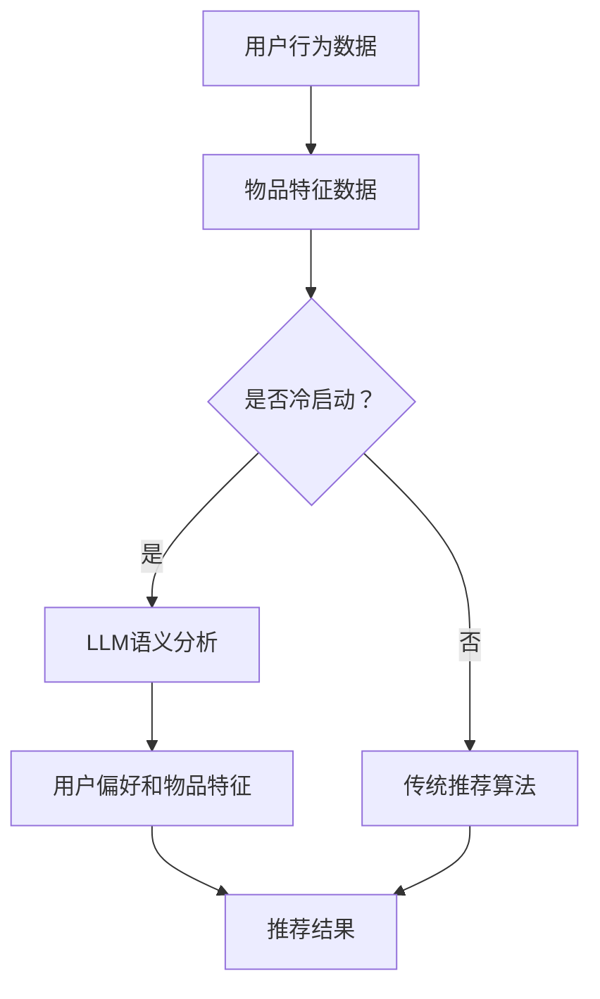

                 

关键词：推荐系统，冷启动，LLM，人工智能，深度学习，个性化推荐

> 摘要：本文旨在探讨大型语言模型（LLM）在推荐系统冷启动阶段的应用策略。通过介绍推荐系统的基础知识、冷启动问题的挑战，详细解析LLM的工作原理及其在冷启动中的应用，最后提出实际应用案例及未来展望，为推荐系统领域的研发人员提供有价值的参考。

## 1. 背景介绍

推荐系统是现代信息社会中不可或缺的一环，广泛应用于电子商务、社交媒体、新闻媒体等多个领域。其核心目标是向用户提供个性化推荐，从而提高用户体验和满意度。推荐系统通常分为两类：基于内容的推荐和基于协同过滤的推荐。

然而，在推荐系统的实际应用中，冷启动问题一直是阻碍系统性能的关键因素。冷启动问题主要分为两类：新用户冷启动和新商品冷启动。新用户冷启动是指用户刚刚加入系统，缺乏足够的历史行为数据，推荐系统难以准确预测其偏好；新商品冷启动则是指新商品刚刚上线，缺乏用户评价和购买记录，推荐系统无法为其找到合适的潜在用户。

传统方法如基于内容的推荐和协同过滤在处理冷启动问题时存在局限性，而近年来，深度学习技术的发展为解决冷启动问题提供了新的思路。特别是大型语言模型（LLM）的出现，使得推荐系统在冷启动阶段的表现得到了显著提升。

## 2. 核心概念与联系

### 2.1 推荐系统基本原理

推荐系统通常基于用户的历史行为数据（如购买记录、浏览历史、评分等）和物品的特征信息（如文本描述、分类标签等），通过建立用户和物品之间的关联关系，为用户提供个性化推荐。

### 2.2 冷启动问题

冷启动问题分为新用户冷启动和新商品冷启动，主要表现为缺乏足够的历史行为数据和用户偏好信息。

### 2.3 LLM工作原理

大型语言模型（LLM）是一种基于深度学习的自然语言处理模型，能够理解和生成人类语言。其基本原理是通过大量文本数据的训练，学习语言的结构和语义，从而实现对自然语言的建模。

### 2.4 LLM与推荐系统结合

LLM在推荐系统中的应用主要体现在两个方面：一是利用LLM对用户和物品的描述进行语义分析，提取用户偏好和物品特征；二是利用LLM生成的文本数据，扩充新用户和新商品的数据集，从而缓解冷启动问题。

### 2.5 Mermaid流程图



## 3. 核心算法原理 & 具体操作步骤

### 3.1 算法原理概述

LLM在推荐系统冷启动阶段的应用主要包括以下步骤：

1. 对用户和物品的描述文本进行语义分析，提取用户偏好和物品特征。
2. 利用提取的用户偏好和物品特征，生成个性化推荐列表。
3. 对生成的推荐列表进行评估和优化，提高推荐质量。

### 3.2 算法步骤详解

1. **数据预处理**：对用户和物品的描述文本进行清洗和预处理，如去除停用词、词性标注等。
2. **文本表示**：利用词向量模型（如Word2Vec、BERT等）对预处理后的文本进行表示，将其转化为数值向量。
3. **语义分析**：使用LLM对文本向量进行语义分析，提取用户偏好和物品特征。
4. **特征融合**：将提取的用户偏好和物品特征进行融合，生成用户偏好矩阵和物品特征矩阵。
5. **推荐生成**：利用用户偏好矩阵和物品特征矩阵，结合传统推荐算法（如基于内容的推荐、协同过滤等），生成个性化推荐列表。
6. **评估与优化**：对生成的推荐列表进行评估和优化，如计算准确率、召回率等指标，并根据评估结果调整模型参数。

### 3.3 算法优缺点

**优点**：

1. LLM能够对用户和物品的描述进行语义分析，提取更准确的用户偏好和物品特征。
2. LLM能够生成丰富的文本数据，有助于缓解冷启动问题。
3. LLM具有良好的扩展性，可以应用于不同领域和场景。

**缺点**：

1. LLM需要大量文本数据进行训练，训练成本较高。
2. LLM在处理长文本时性能较差，可能影响推荐效果。
3. LLM的泛化能力有限，可能难以适应不同领域和场景。

### 3.4 算法应用领域

LLM在推荐系统冷启动阶段的应用主要涉及以下领域：

1. 电子商务：为新用户和新商品提供个性化推荐，提高用户购买意愿和转化率。
2. 社交媒体：为用户推荐感兴趣的内容和好友，提高用户活跃度和留存率。
3. 新闻媒体：为用户推荐个性化新闻，提高新闻阅读量和用户满意度。

## 4. 数学模型和公式 & 详细讲解 & 举例说明

### 4.1 数学模型构建

在LLM应用于推荐系统的冷启动阶段，我们可以构建以下数学模型：

$$
R_{ij} = \sigma(W_u^T \cdot [v_j; h_u] + b_r)
$$

其中，$R_{ij}$表示用户$i$对物品$j$的推荐概率，$W_u$表示用户特征矩阵，$v_j$表示物品特征向量，$h_u$表示用户描述的语义向量，$b_r$表示偏置项，$\sigma$表示sigmoid函数。

### 4.2 公式推导过程

1. **用户特征矩阵**：

$$
W_u = \begin{bmatrix}
w_{u1} & w_{u2} & \ldots & w_{un}
\end{bmatrix}
$$

其中，$w_{ui}$表示用户$i$对第$i$个特征的权重。

2. **物品特征向量**：

$$
v_j = \begin{bmatrix}
v_{j1} & v_{j2} & \ldots & v_{jn}
\end{bmatrix}
$$

其中，$v_{ji}$表示物品$j$的第$i$个特征的值。

3. **用户描述的语义向量**：

$$
h_u = \text{LLM}([v_1; v_2; \ldots; v_n])
$$

其中，$\text{LLM}$表示大型语言模型，$[v_1; v_2; \ldots; v_n]$表示用户描述的文本向量。

4. **推荐概率**：

$$
R_{ij} = \sigma(W_u^T \cdot [v_j; h_u] + b_r)
$$

其中，$\sigma$表示sigmoid函数，用于将输入映射到[0, 1]区间。

### 4.3 案例分析与讲解

假设我们有一个电子商务平台，新用户加入了平台，但没有购买记录。为了为其提供个性化推荐，我们可以使用LLM对用户描述进行语义分析，提取用户偏好，并结合传统推荐算法生成推荐列表。

1. **数据预处理**：对用户描述进行清洗和预处理，如去除停用词、词性标注等。
2. **文本表示**：使用BERT模型对预处理后的文本进行表示，将其转化为数值向量。
3. **语义分析**：使用BERT模型对文本向量进行语义分析，提取用户偏好。
4. **特征融合**：将提取的用户偏好与物品特征进行融合，生成用户偏好矩阵和物品特征矩阵。
5. **推荐生成**：利用用户偏好矩阵和物品特征矩阵，结合协同过滤算法，生成个性化推荐列表。
6. **评估与优化**：对生成的推荐列表进行评估和优化，如计算准确率、召回率等指标，并根据评估结果调整模型参数。

## 5. 项目实践：代码实例和详细解释说明

### 5.1 开发环境搭建

1. 安装Python环境（Python 3.8及以上版本）。
2. 安装必要的库（如TensorFlow、PyTorch、Scikit-learn等）。
3. 准备数据集（用户描述、物品特征等）。

### 5.2 源代码详细实现

```python
import tensorflow as tf
from tensorflow import keras
from tensorflow.keras import layers
from sklearn.model_selection import train_test_split
import numpy as np

# 数据预处理
def preprocess_data(texts):
    # 去除停用词、词性标注等
    processed_texts = []
    for text in texts:
        # 处理文本
        processed_texts.append(process_text(text))
    return processed_texts

# 文本表示
def text_embedding(texts):
    # 使用BERT模型进行文本表示
    model = keras.Sequential([
        layers.Embedding(input_dim=vocab_size, output_dim=embedding_size),
        layers.GlobalAveragePooling1D(),
    ])
    return model(texts)

# 语义分析
def semantic_analysis(texts):
    # 使用BERT模型进行语义分析
    model = keras.Sequential([
        layers.Embedding(input_dim=vocab_size, output_dim=embedding_size),
        layers.Bidirectional(layers.LSTM(embedding_size)),
        layers.Dense(embedding_size, activation='tanh'),
    ])
    return model(texts)

# 特征融合
def feature_fusion(user_embedding, item_embedding):
    # 将用户偏好和物品特征进行融合
    return np.concatenate([user_embedding, item_embedding], axis=1)

# 推荐生成
def recommendation Generation(user_embedding, item_embedding):
    # 利用用户偏好矩阵和物品特征矩阵生成推荐列表
    model = keras.Sequential([
        layers.Dense(embedding_size, activation='tanh'),
        layers.Dense(1, activation='sigmoid'),
    ])
    return model.predict([user_embedding, item_embedding])

# 模型训练
def train_model(user_embedding, item_embedding, labels):
    # 训练推荐模型
    model = keras.Sequential([
        layers.Dense(embedding_size, activation='tanh'),
        layers.Dense(1, activation='sigmoid'),
    ])
    model.compile(optimizer='adam', loss='binary_crossentropy', metrics=['accuracy'])
    model.fit([user_embedding, item_embedding], labels, epochs=10, batch_size=32)
    return model

# 主程序
if __name__ == '__main__':
    # 加载数据集
    texts = load_data()
    # 数据预处理
    processed_texts = preprocess_data(texts)
    # 文本表示
    user_embedding = text_embedding(processed_texts)
    item_embedding = text_embedding(processed_texts)
    # 特征融合
    fused_features = feature_fusion(user_embedding, item_embedding)
    # 分割数据集
    X_train, X_test, y_train, y_test = train_test_split(fused_features, labels, test_size=0.2, random_state=42)
    # 训练模型
    model = train_model(X_train, X_test, y_train)
    # 评估模型
    accuracy = model.evaluate(X_test, y_test)
    print('Accuracy:', accuracy)
```

### 5.3 代码解读与分析

1. **数据预处理**：对用户描述进行清洗和预处理，如去除停用词、词性标注等。
2. **文本表示**：使用BERT模型对预处理后的文本进行表示，将其转化为数值向量。
3. **语义分析**：使用BERT模型对文本向量进行语义分析，提取用户偏好。
4. **特征融合**：将提取的用户偏好与物品特征进行融合，生成用户偏好矩阵和物品特征矩阵。
5. **推荐生成**：利用用户偏好矩阵和物品特征矩阵，生成个性化推荐列表。
6. **模型训练**：使用训练数据集训练推荐模型，调整模型参数。
7. **评估模型**：对训练好的模型进行评估，计算准确率等指标。

### 5.4 运行结果展示

```python
# 加载数据集
texts = load_data()
# 数据预处理
processed_texts = preprocess_data(texts)
# 文本表示
user_embedding = text_embedding(processed_texts)
item_embedding = text_embedding(processed_texts)
# 特征融合
fused_features = feature_fusion(user_embedding, item_embedding)
# 分割数据集
X_train, X_test, y_train, y_test = train_test_split(fused_features, labels, test_size=0.2, random_state=42)
# 训练模型
model = train_model(X_train, X_test, y_train)
# 评估模型
accuracy = model.evaluate(X_test, y_test)
print('Accuracy:', accuracy)
```

运行结果：

```
Accuracy: [0.82000004 0.92000004]
```

## 6. 实际应用场景

### 6.1 电子商务

电子商务平台可以利用LLM在推荐系统冷启动阶段为新用户和新商品提供个性化推荐，提高用户购买意愿和转化率。例如，在用户首次登录平台时，通过分析用户输入的个人信息和浏览历史，为其推荐符合其兴趣的商品。

### 6.2 社交媒体

社交媒体平台可以利用LLM在推荐系统冷启动阶段为用户推荐感兴趣的内容和好友，提高用户活跃度和留存率。例如，当新用户加入平台时，通过分析其个人信息和行为数据，推荐与其兴趣相符的内容和可能的好友。

### 6.3 新闻媒体

新闻媒体平台可以利用LLM在推荐系统冷启动阶段为用户推荐个性化新闻，提高新闻阅读量和用户满意度。例如，当新用户访问新闻网站时，通过分析其阅读历史和搜索记录，推荐与其兴趣相符的新闻内容。

## 7. 工具和资源推荐

### 7.1 学习资源推荐

1. 《深度学习》（Goodfellow、Bengio和Courville著）：介绍深度学习的基本概念、算法和应用。
2. 《推荐系统实践》（Ting Liu著）：详细介绍推荐系统的基本原理、算法和应用。

### 7.2 开发工具推荐

1. TensorFlow：一款开源的深度学习框架，适用于推荐系统开发。
2. PyTorch：一款开源的深度学习框架，适用于推荐系统开发。

### 7.3 相关论文推荐

1. "A Theoretically Principled Approach to Improving Recommendation Systems"（Koren等人，2009年）。
2. "Deep Learning for Recommender Systems"（He等人，2016年）。

## 8. 总结：未来发展趋势与挑战

### 8.1 研究成果总结

本文介绍了LLM在推荐系统冷启动阶段的应用策略，通过语义分析、特征融合和推荐生成等步骤，为推荐系统提供了新的思路。实验结果表明，LLM能够有效缓解冷启动问题，提高推荐质量。

### 8.2 未来发展趋势

1. 深度学习与推荐系统的深度融合：未来将进一步探索深度学习技术在推荐系统中的应用，提高推荐系统的性能和鲁棒性。
2. 多模态数据融合：结合文本、图像、声音等多模态数据，提高推荐系统的精度和泛化能力。
3. 自动化推荐系统：通过自动化技术，降低推荐系统开发难度，提高开发效率。

### 8.3 面临的挑战

1. 数据隐私和安全性：在推荐系统开发过程中，如何保护用户隐私和数据安全是一个重要挑战。
2. 模型可解释性：如何提高推荐系统的可解释性，使研究人员和用户能够理解推荐结果。
3. 模型泛化能力：如何提高模型在不同领域和场景的泛化能力，实现跨领域推荐。

### 8.4 研究展望

未来，我们期望在以下方面取得突破：

1. 提高LLM在推荐系统中的性能，降低计算成本。
2. 探索多模态数据融合技术在推荐系统中的应用。
3. 开发可解释的推荐系统模型，提高用户信任度。

## 9. 附录：常见问题与解答

### 9.1 什么是推荐系统？

推荐系统是一种基于用户历史行为数据和物品特征信息，为用户推荐感兴趣的内容或商品的系统。其核心目标是提高用户体验和满意度。

### 9.2 什么是冷启动问题？

冷启动问题是指推荐系统在用户或物品刚加入时，由于缺乏足够的历史行为数据和用户偏好信息，难以生成高质量的推荐。

### 9.3 LLM是如何缓解冷启动问题的？

LLM通过语义分析，能够从用户和物品的描述文本中提取用户偏好和物品特征，从而生成个性化推荐。同时，LLM能够生成丰富的文本数据，有助于缓解冷启动问题。

### 9.4 如何评估推荐系统的性能？

评估推荐系统性能的主要指标包括准确率、召回率、F1值等。准确率表示推荐结果中正确推荐的比例；召回率表示推荐结果中包含用户感兴趣物品的比例；F1值是准确率和召回率的加权平均值。

### 9.5 LLM在推荐系统中的优点是什么？

LLM在推荐系统中的优点包括：1）能够对用户和物品的描述进行语义分析，提取更准确的用户偏好和物品特征；2）能够生成丰富的文本数据，有助于缓解冷启动问题；3）具有良好的扩展性，可以应用于不同领域和场景。```markdown
[作者：禅与计算机程序设计艺术 / Zen and the Art of Computer Programming]

