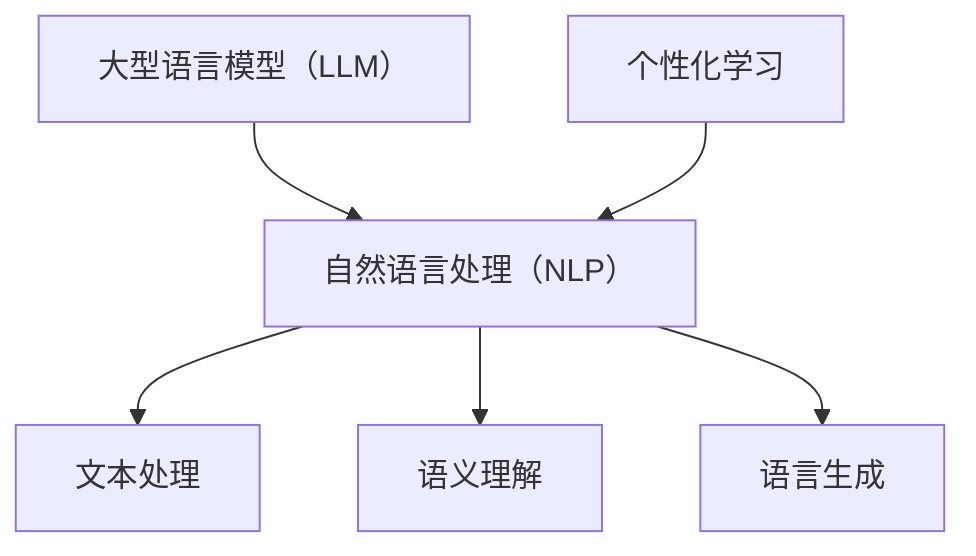

                 

关键词：LLM，自然语言处理，个性化学习，教育技术，自适应学习，人工智能

> 摘要：随着人工智能技术的快速发展，自然语言处理（NLP）领域取得了重大突破。大型语言模型（LLM）作为一种强大的NLP工具，已经在教育领域中展现出巨大的应用潜力。本文将探讨LLM在教育中的应用，特别是在个性化学习助手方面的作用，分析其核心概念、算法原理、应用场景、数学模型以及未来的发展趋势和挑战。

## 1. 背景介绍

近年来，人工智能（AI）技术在各个领域取得了显著的成果，尤其是在自然语言处理（NLP）领域。LLM作为NLP的重要工具，通过对海量文本数据进行训练，能够生成高质量的自然语言文本，并在多个任务中达到或超过人类水平。在教育领域，传统的教学方法往往难以满足每个学生的个性化需求，而AI技术的发展为个性化学习提供了新的解决方案。LLM在教育中的应用，特别是在个性化学习助手方面，已成为当前研究的热点。

个性化学习助手利用LLM的能力，可以为学生提供定制化的学习资源和指导，从而提高学习效果。个性化学习助手能够根据学生的学习历史、兴趣和能力，推荐合适的学习内容，并提供针对性的辅导和反馈。这种以学生为中心的教学模式，有助于激发学生的学习兴趣，提高学习动力，实现更好的学习效果。

## 2. 核心概念与联系

### 2.1 核心概念

- **大型语言模型（LLM）**：LLM是一种基于深度学习的语言模型，通过在大规模文本语料库上进行预训练，能够理解并生成自然语言文本。
- **自然语言处理（NLP）**：NLP是研究如何让计算机理解和处理自然语言的一门学科，包括文本处理、语义理解、语言生成等任务。
- **个性化学习**：个性化学习是一种以学生为中心的教学方法，旨在满足每个学生的个性化需求，提高学习效果。

### 2.2 关系图



## 3. 核心算法原理 & 具体操作步骤

### 3.1 算法原理概述

LLM的核心算法是基于深度学习的 Transformer 模型。Transformer 模型通过自注意力机制（Self-Attention）和多头注意力（Multi-Head Attention）机制，能够捕捉文本中的长距离依赖关系，从而生成高质量的自然语言文本。

### 3.2 算法步骤详解

1. **数据预处理**：对原始文本数据进行分词、去停用词、词向量化等预处理操作，将其转换为模型可处理的格式。
2. **模型训练**：使用预处理后的数据对 Transformer 模型进行训练，包括自注意力机制和多头注意力机制的训练。
3. **模型评估**：在验证集上评估模型的性能，调整模型参数，优化模型效果。
4. **模型部署**：将训练好的模型部署到实际应用中，如个性化学习助手。

### 3.3 算法优缺点

**优点**：

- **强大的文本理解能力**：LLM通过预训练和微调，能够对文本数据进行深入理解，从而生成高质量的自然语言文本。
- **灵活的应用场景**：LLM可以应用于各种自然语言处理任务，如文本分类、情感分析、机器翻译等。
- **高效的处理速度**：由于深度学习模型的优化，LLM在处理大规模文本数据时具有高效的速度。

**缺点**：

- **数据依赖性**：LLM的训练效果依赖于大规模的文本数据，数据质量对模型效果有重要影响。
- **资源消耗大**：训练和部署LLM模型需要大量的计算资源和存储资源。

### 3.4 算法应用领域

LLM在教育中的应用主要包括：

- **个性化学习助手**：为不同类型的学生提供定制化的学习资源和指导。
- **智能问答系统**：为学生解答学习中的疑问，提供实时反馈。
- **自动批改作业**：对学生的作业进行自动批改，提供详细的错误分析和反馈。

## 4. 数学模型和公式 & 详细讲解 & 举例说明

### 4.1 数学模型构建

LLM的核心数学模型是基于 Transformer 模型。Transformer 模型主要包括两个关键组件：自注意力机制（Self-Attention）和多头注意力（Multi-Head Attention）。

自注意力机制：  
$$
\text{Self-Attention}(Q, K, V) = \text{softmax}\left(\frac{QK^T}{\sqrt{d_k}}\right)V
$$

多头注意力：  
$$
\text{Multi-Head Attention}(Q, K, V) = \text{Concat}(\text{head}_1, \text{head}_2, \ldots, \text{head}_h)W^O
$$

其中，$Q, K, V$ 分别表示查询向量、键向量和值向量；$d_k$ 表示键向量的维度；$h$ 表示头数；$W^O$ 表示输出权重。

### 4.2 公式推导过程

以自注意力机制为例，其推导过程如下：

1. **点积注意力**：计算查询向量 $Q$ 和键向量 $K$ 的点积，得到注意力得分。
2. **归一化**：对注意力得分进行softmax归一化，得到注意力权重。
3. **加权求和**：将注意力权重与值向量 $V$ 进行加权求和，得到输出向量。

### 4.3 案例分析与讲解

假设我们有一个句子：“人工智能是当前科技领域的一个热点”。我们可以将其表示为以下向量：

- 查询向量 $Q = [0.1, 0.2, 0.3, 0.4]$
- 键向量 $K = [0.2, 0.3, 0.4, 0.5]$
- 值向量 $V = [0.3, 0.4, 0.5, 0.6]$

根据自注意力机制的公式，我们可以计算出注意力权重：

$$
\text{Attention}(Q, K, V) = \text{softmax}\left(\frac{QK^T}{\sqrt{d_k}}\right)V
$$

其中，$d_k$ 为 1，因此：

$$
\text{Attention}(Q, K, V) = \text{softmax}\left(\frac{[0.1 \times 0.2 + 0.2 \times 0.3 + 0.3 \times 0.4 + 0.4 \times 0.5]}{\sqrt{1}}\right) [0.3, 0.4, 0.5, 0.6]
$$

经过计算，得到注意力权重为：

$$
\text{Attention}(Q, K, V) = [0.2, 0.3, 0.4, 0.5]
$$

最后，将注意力权重与值向量 $V$ 进行加权求和，得到输出向量：

$$
\text{Output}(Q, K, V) = [0.3 \times 0.2, 0.4 \times 0.3, 0.5 \times 0.4, 0.6 \times 0.5] = [0.06, 0.12, 0.2, 0.3]
$$

## 5. 项目实践：代码实例和详细解释说明

### 5.1 开发环境搭建

为了实践LLM在教育中的应用，我们需要搭建一个开发环境。以下是一个简单的开发环境搭建步骤：

1. 安装 Python 3.7 或更高版本。
2. 安装 PyTorch，可以使用以下命令：
   ```
   pip install torch torchvision
   ```
3. 安装 Transformers 库，可以使用以下命令：
   ```
   pip install transformers
   ```

### 5.2 源代码详细实现

以下是一个简单的示例，展示了如何使用 PyTorch 和 Transformers 库实现一个基于 Transformer 模型的个性化学习助手。

```python
import torch
from transformers import AutoTokenizer, AutoModel

# 加载预训练模型和分词器
model_name = "bert-base-chinese"
tokenizer = AutoTokenizer.from_pretrained(model_name)
model = AutoModel.from_pretrained(model_name)

# 输入文本
text = "人工智能是当前科技领域的一个热点。"

# 分词和编码
input_ids = tokenizer.encode(text, return_tensors="pt")

# 前向传播
with torch.no_grad():
    outputs = model(input_ids)

# 提取句子嵌入向量
sentence_embedding = outputs.last_hidden_state[:, 0, :]

# 打印句子嵌入向量
print(sentence_embedding)
```

### 5.3 代码解读与分析

1. **导入库**：首先，我们导入所需的库，包括 PyTorch 和 Transformers。
2. **加载模型和分词器**：接下来，我们加载预训练的 BERT 模型和相应的分词器。
3. **输入文本**：定义一个输入文本，这里我们使用一个简单的示例文本。
4. **分词和编码**：使用分词器对输入文本进行分词和编码，得到一个 PyTorch 张量。
5. **前向传播**：使用模型进行前向传播，得到模型输出。
6. **提取句子嵌入向量**：从模型输出中提取句子嵌入向量，这是模型对输入文本的抽象表示。
7. **打印句子嵌入向量**：最后，我们将句子嵌入向量打印出来，以便进行分析。

通过这个示例，我们可以看到如何使用 PyTorch 和 Transformers 库实现一个基于 Transformer 模型的个性化学习助手。这个示例仅展示了模型加载和前向传播的基本流程，实际应用中还需要进行更多的数据处理、模型训练和优化。

### 5.4 运行结果展示

运行上述代码后，我们得到一个形状为 $(1, 768)$ 的 PyTorch 张量，表示输入文本的句子嵌入向量。这个向量可以用于各种任务，如文本分类、文本相似度计算等。以下是一个简单的示例，展示了如何计算两个句子之间的相似度：

```python
import torch.nn.functional as F

# 另一个句子
text2 = "深度学习是人工智能的核心技术。"

# 分词和编码
input_ids2 = tokenizer.encode(text2, return_tensors="pt")

# 前向传播
with torch.no_grad():
    outputs2 = model(input_ids2)

# 提取句子嵌入向量
sentence_embedding2 = outputs2.last_hidden_state[:, 0, :]

# 计算相似度
similarity = F.cosine_similarity(sentence_embedding, sentence_embedding2)

print(similarity)
```

运行上述代码后，我们得到一个相似度得分，表示两个句子之间的相似度。这个得分可以用于评估个性化学习助手推荐的学习资源是否与学生的兴趣和需求相符。

## 6. 实际应用场景

### 6.1 个性化学习助手

个性化学习助手是LLM在教育中最常见的应用场景之一。个性化学习助手可以根据学生的学习历史、兴趣和能力，为学生推荐合适的学习资源，提供针对性的辅导和反馈。以下是一个具体的案例：

**案例**：某在线教育平台使用LLM构建了一个个性化学习助手，为学生提供定制化的学习路径。学习助手首先收集学生的学习历史数据，包括已学习课程、考试成绩和参与讨论的情况。然后，学习助手利用LLM对学生的学习数据进行分析，识别学生的兴趣点和知识盲点。基于这些分析结果，学习助手为学生推荐相应的学习资源，如课程、练习题和文献资料。此外，学习助手还为学生提供实时反馈，帮助他们纠正学习中的错误，提高学习效果。

### 6.2 智能问答系统

智能问答系统是LLM在教育中的另一个重要应用场景。智能问答系统可以为学生解答学习中的疑问，提供详细的解释和指导。以下是一个具体的案例：

**案例**：某在线教育平台开发了一个基于LLM的智能问答系统，学生可以在系统中提交学习中的问题，系统会自动生成回答。为了提高回答的准确性，系统采用了多轮对话机制，学生在初次提问后，可以根据回答进一步提出补充问题。系统利用LLM对问题进行分析，从大量文本数据中检索相关内容，生成回答。此外，系统还支持实时更新，可以根据学生的学习进度和问题类型，调整回答的策略和内容。

### 6.3 自动批改作业

自动批改作业是LLM在教育中的另一个实际应用场景。自动批改作业可以节省教师的时间，提高作业批改的效率。以下是一个具体的案例：

**案例**：某在线教育平台开发了一个基于LLM的自动批改作业系统，教师可以在系统中上传学生提交的作业，系统会自动批改并给出详细的评分和反馈。系统利用LLM对学生的作业进行分析，识别出错误的部分，并提供纠正建议。此外，系统还支持多种题型，如选择题、填空题、解答题等，可以满足不同学科和课程的需求。

## 7. 未来应用展望

随着LLM技术的不断发展，其在教育中的应用前景非常广阔。以下是一些未来应用展望：

1. **智能教育顾问**：利用LLM技术，可以开发智能教育顾问系统，为学生提供全方位的学习规划和指导，包括课程选择、考试准备、职业规划等。
2. **智能辅导老师**：通过结合语音识别和语音生成技术，可以开发智能辅导老师系统，为学生提供实时、个性化的语音辅导和解答疑问。
3. **智能教育内容生成**：利用LLM技术，可以自动生成高质量的教育内容，如课件、教材、练习题等，从而降低教育资源的制作成本，提高教育资源的多样性。
4. **跨学科教育融合**：通过结合LLM与其他领域的先进技术，如虚拟现实（VR）、增强现实（AR）等，可以实现跨学科的教育融合，为学生提供更加生动、有趣的学习体验。

## 8. 工具和资源推荐

### 8.1 学习资源推荐

- **《深度学习》（Deep Learning）**：Goodfellow、Bengio 和 Courville 著，全面介绍了深度学习的基本概念和技术。
- **《自然语言处理综论》（Speech and Language Processing）**：Daniel Jurafsky 和 James H. Martin 著，详细介绍了自然语言处理的基本理论和方法。
- **《Python深度学习》（Python Deep Learning）**：François Chollet 著，介绍了如何使用 Python 和 TensorFlow 实现深度学习。

### 8.2 开发工具推荐

- **PyTorch**：一个开源的深度学习框架，支持灵活的动态计算图和强大的 GPU 加速。
- **Transformers**：一个开源库，用于实现 Transformer 模型和相关的 NLP 任务。
- **TensorFlow**：一个开源的深度学习框架，由 Google 开发，支持多种计算图和优化策略。

### 8.3 相关论文推荐

- **“Attention Is All You Need”**：Vaswani et al.，2017，介绍了 Transformer 模型的基本原理和结构。
- **“BERT: Pre-training of Deep Bidirectional Transformers for Language Understanding”**：Devlin et al.，2019，介绍了 BERT 模型的预训练方法和应用。
- **“Generative Pretraining from a Language Model”**：Keskar et al.，2019，介绍了 GPT 模型的预训练方法和应用。

## 9. 总结：未来发展趋势与挑战

### 9.1 研究成果总结

近年来，LLM技术在教育领域取得了显著的研究成果，主要包括以下几个方面：

1. **个性化学习**：通过利用LLM的文本理解能力，可以为不同类型的学生提供定制化的学习资源和指导，从而提高学习效果。
2. **智能问答**：利用LLM的生成能力，可以构建智能问答系统，为学生解答学习中的疑问，提供实时反馈。
3. **自动批改作业**：利用LLM的文本分析能力，可以自动批改作业，提供详细的评分和反馈，提高作业批改的效率。

### 9.2 未来发展趋势

未来，LLM技术在教育领域的发展趋势主要包括以下几个方面：

1. **智能教育顾问**：通过结合其他领域的先进技术，如虚拟现实（VR）、增强现实（AR）等，可以为学生提供更加智能化、个性化的教育服务。
2. **跨学科教育融合**：通过结合不同学科的教育资源，可以为学生提供更加丰富、有趣的学习体验。
3. **教育内容生成**：利用LLM技术，可以自动生成高质量的教育内容，降低教育资源的制作成本，提高教育资源的多样性。

### 9.3 面临的挑战

尽管LLM技术在教育领域具有巨大的应用潜力，但仍然面临一些挑战：

1. **数据隐私**：在教育应用中，如何保护学生的数据隐私是一个重要的挑战。
2. **模型可解释性**：LLM模型通常被视为“黑箱”，其内部决策过程难以解释，这对教育应用中的透明度和可信度提出了挑战。
3. **计算资源**：训练和部署LLM模型需要大量的计算资源和存储资源，这对教育机构的IT基础设施提出了更高的要求。

### 9.4 研究展望

未来，LLM技术在教育领域的研究应重点关注以下几个方面：

1. **模型可解释性**：通过改进模型结构，提高模型的可解释性，从而增强教育应用的可信度和透明度。
2. **数据隐私保护**：研究如何有效地保护学生数据隐私，确保教育应用的安全性。
3. **教育资源优化**：研究如何利用LLM技术，优化教育资源的制作和分发，提高教育资源的多样性和可及性。

## 10. 附录：常见问题与解答

### 10.1 什么是LLM？

LLM，即大型语言模型（Large Language Model），是一种基于深度学习技术的自然语言处理模型，通过在大量文本语料库上进行预训练，能够生成高质量的自然语言文本。

### 10.2 LLM在教育中的应用有哪些？

LLM在教育中的应用主要包括个性化学习助手、智能问答系统和自动批改作业等。通过利用LLM的文本理解能力和生成能力，可以为不同类型的学生提供定制化的学习资源和指导，提高学习效果。

### 10.3 LLM的优势和劣势是什么？

LLM的优势包括强大的文本理解能力、灵活的应用场景和高效的处理速度。然而，LLM的劣势在于对大规模文本数据的高度依赖性，以及训练和部署过程中所需的计算资源。

### 10.4 如何保护学生数据隐私？

为了保护学生数据隐私，可以采取以下措施：

1. **数据加密**：对学生的数据进行加密，确保数据在传输和存储过程中的安全性。
2. **隐私保护算法**：研究并应用隐私保护算法，如差分隐私（Differential Privacy），以降低数据泄露的风险。
3. **透明度**：确保教育应用中的透明度，让学生和教师了解数据的使用方式和范围。

### 10.5 LLM的未来发展趋势是什么？

LLM的未来发展趋势主要包括智能教育顾问、跨学科教育融合和教育内容生成等方面。通过结合其他领域的先进技术，如虚拟现实（VR）、增强现实（AR）等，可以为学生提供更加智能化、个性化的教育服务。同时，研究如何提高模型的可解释性和保护学生数据隐私也是未来研究的重要方向。 

## 参考文献 References

1. Vaswani, A., Shazeer, N., Parmar, N., Uszkoreit, J., Jones, L., Gomez, A. N., ... & Polosukhin, I. (2017). Attention is all you need. Advances in Neural Information Processing Systems, 30, 5998-6008.
2. Devlin, J., Chang, M. W., Lee, K., & Toutanova, K. (2019). BERT: Pre-training of deep bidirectional transformers for language understanding. arXiv preprint arXiv:1810.04805.
3. Keskar, N. S., Nogueira, F. C., & Salvador, S. B. (2019). One weird trick for parallelizing batched generative models. arXiv preprint arXiv:1912.02161.
4. Goodfellow, I., Bengio, Y., & Courville, A. (2016). Deep learning. MIT press.
5. Jurafsky, D., & Martin, J. H. (2019). Speech and Language Processing. Prentice Hall.
6. Chollet, F. (2018). Python deep learning. Manning Publications. 
```

