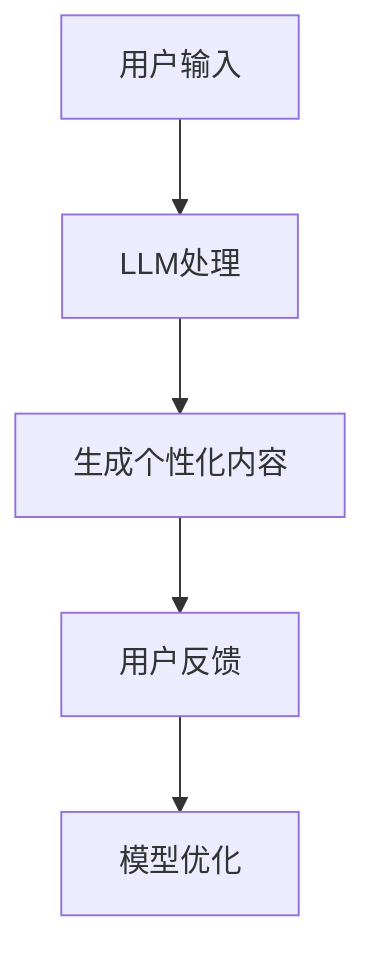

                 

关键词：自然语言处理、大型语言模型、个性化学习、教育技术、人工智能

> 摘要：随着人工智能技术的飞速发展，自然语言处理（NLP）领域的核心突破之一——大型语言模型（LLM），正逐渐改变教育行业的面貌。本文旨在探讨LLM在教育中的应用，尤其是如何通过个性化学习提升教育效果，并展望其未来发展的趋势与挑战。

## 1. 背景介绍

近年来，人工智能在教育领域的应用日益广泛，从在线课程到智能辅导系统，从自适应学习平台到个性化教育服务，AI技术正在重新定义教育的未来。其中，自然语言处理（NLP）技术的突破尤为显著。大型语言模型（LLM）作为NLP领域的一项重要技术，其强大的语言理解和生成能力，为个性化学习提供了新的可能性。

### 1.1 教育领域的人工智能应用

在教育领域，人工智能的应用主要体现在以下几个方面：

1. **在线学习平台**：如Coursera、edX等平台利用AI技术推荐课程、评估学生表现，提供个性化的学习路径。
2. **智能辅导系统**：利用自然语言处理和机器学习技术，为学习者提供实时、个性化的学习支持。
3. **自适应学习平台**：根据学生的学习行为和知识水平，自动调整教学内容和难度，实现个性化教学。

### 1.2 大型语言模型的兴起

大型语言模型（LLM）的出现，标志着NLP技术的一个重要里程碑。这些模型通过深度学习，从海量数据中学习语言规律，能够生成高质量的自然语言文本，具备强大的语言理解和生成能力。例如，GPT-3、BERT、T5等模型，已经广泛应用于各种NLP任务，如文本分类、命名实体识别、机器翻译、问答系统等。

## 2. 核心概念与联系

### 2.1 大型语言模型的基本原理

大型语言模型（LLM）通常基于Transformer架构，这是一种基于自注意力机制的深度神经网络。Transformer架构的核心思想是通过多头自注意力机制来捕捉文本序列中的长距离依赖关系，从而实现高效的文本表示和生成。

### 2.2 教育中的个性化学习

个性化学习是指根据学习者的个性化特征，如学习能力、知识水平、兴趣偏好等，为其提供定制化的学习内容和教学方式。个性化学习的核心在于满足学习者的个性化需求，提高学习效果。

### 2.3 大型语言模型与个性化学习

大型语言模型能够通过分析学习者的语言输入，理解其知识水平和兴趣偏好，从而为学习者提供个性化的学习内容和辅导。例如，通过分析学生的问答，LLM可以识别学生的学习难点，提供针对性的解答和辅导。

### 2.4 Mermaid 流程图



## 3. 核心算法原理 & 具体操作步骤

### 3.1 算法原理概述

大型语言模型（LLM）的核心原理是基于深度学习的自注意力机制。通过训练，模型可以学会捕捉文本序列中的长距离依赖关系，从而实现高质量的文本生成和理解。

### 3.2 算法步骤详解

1. **数据预处理**：将用户的语言输入进行清洗和分词，生成文本序列。
2. **编码**：使用Transformer架构将文本序列编码为向量表示。
3. **生成**：通过自注意力机制和全连接层，生成文本序列的预测输出。
4. **优化**：根据用户的反馈，优化模型参数，提高个性化推荐的准确性。

### 3.3 算法优缺点

**优点**：
- 高效：能够快速处理大量文本数据，实现实时个性化推荐。
- 准确：通过深度学习，能够准确理解用户的语言输入和知识水平。

**缺点**：
- 计算资源需求大：训练和部署LLM模型需要大量计算资源和存储空间。
- 数据隐私问题：处理用户的语言输入，可能会涉及到数据隐私问题。

### 3.4 算法应用领域

大型语言模型在教育领域的应用主要包括：
- 个性化学习内容推荐
- 智能辅导和答疑系统
- 评估学生学习成果和知识水平
- 自适应学习平台

## 4. 数学模型和公式 & 详细讲解 & 举例说明

### 4.1 数学模型构建

大型语言模型的数学模型通常是基于自注意力机制和Transformer架构。其中，自注意力机制可以表示为：

$$
\text{Attention}(Q, K, V) = \text{softmax}\left(\frac{QK^T}{\sqrt{d_k}}\right) V
$$

其中，$Q$、$K$、$V$分别为查询向量、键向量、值向量，$d_k$为键向量的维度。

### 4.2 公式推导过程

自注意力机制的推导过程主要分为以下几个步骤：

1. **点积注意力**：计算查询向量$Q$和键向量$K$的点积，得到注意力分数。
2. **缩放点积注意力**：为防止梯度消失，对点积注意力进行缩放，即除以$\sqrt{d_k}$。
3. **softmax激活函数**：对缩放后的注意力分数进行softmax激活，得到概率分布。
4. **加权求和**：将概率分布与值向量$V$进行加权求和，得到注意力输出。

### 4.3 案例分析与讲解

假设有一个包含三个词的文本序列$[w_1, w_2, w_3]$，查询向量$Q$、键向量$K$和值向量$V$分别为：

$$
Q = \begin{bmatrix}
q_{11} & q_{12} & q_{13}
\end{bmatrix}, \quad
K = \begin{bmatrix}
k_{11} & k_{12} & k_{13} \\
k_{21} & k_{22} & k_{23} \\
k_{31} & k_{32} & k_{33}
\end{bmatrix}, \quad
V = \begin{bmatrix}
v_{11} & v_{12} & v_{13} \\
v_{21} & v_{22} & v_{23} \\
v_{31} & v_{32} & v_{33}
\end{bmatrix}
$$

则自注意力机制的计算过程如下：

1. **点积注意力**：

$$
\text{Attention}(Q, K, V) = \begin{bmatrix}
q_{11}k_{11} + q_{12}k_{21} + q_{13}k_{31} & q_{11}k_{12} + q_{12}k_{22} + q_{13}k_{32} & q_{11}k_{13} + q_{12}k_{23} + q_{13}k_{33} \\
q_{21}k_{11} + q_{22}k_{21} + q_{23}k_{31} & q_{21}k_{12} + q_{22}k_{22} + q_{23}k_{32} & q_{21}k_{13} + q_{22}k_{23} + q_{23}k_{33} \\
q_{31}k_{11} + q_{32}k_{21} + q_{33}k_{31} & q_{31}k_{12} + q_{32}k_{22} + q_{33}k_{32} & q_{31}k_{13} + q_{32}k_{23} + q_{33}k_{33}
\end{bmatrix}
$$

2. **缩放点积注意力**：

$$
\text{Scaled Attention} = \frac{1}{\sqrt{d_k}} \text{Attention}(Q, K, V)
$$

3. **softmax激活函数**：

$$
\text{Softmax}(\text{Scaled Attention}) = \begin{bmatrix}
\frac{e^{q_{11}k_{11}/\sqrt{d_k}} + e^{q_{12}k_{21}/\sqrt{d_k}} + e^{q_{13}k_{31}/\sqrt{d_k}}}{e^{q_{11}k_{11}/\sqrt{d_k}} + e^{q_{12}k_{21}/\sqrt{d_k}} + e^{q_{13}k_{31}/\sqrt{d_k}}} & \frac{e^{q_{11}k_{12}/\sqrt{d_k}} + e^{q_{12}k_{22}/\sqrt{d_k}} + e^{q_{13}k_{32}/\sqrt{d_k}}}{e^{q_{11}k_{11}/\sqrt{d_k}} + e^{q_{12}k_{21}/\sqrt{d_k}} + e^{q_{13}k_{31}/\sqrt{d_k}}} & \frac{e^{q_{11}k_{13}/\sqrt{d_k}} + e^{q_{12}k_{23}/\sqrt{d_k}} + e^{q_{13}k_{33}/\sqrt{d_k}}}{e^{q_{11}k_{11}/\sqrt{d_k}} + e^{q_{12}k_{21}/\sqrt{d_k}} + e^{q_{13}k_{31}/\sqrt{d_k}}} \\
\frac{e^{q_{21}k_{11}/\sqrt{d_k}} + e^{q_{22}k_{21}/\sqrt{d_k}} + e^{q_{23}k_{31}/\sqrt{d_k}}}{e^{q_{11}k_{11}/\sqrt{d_k}} + e^{q_{12}k_{21}/\sqrt{d_k}} + e^{q_{13}k_{31}/\sqrt{d_k}}} & \frac{e^{q_{21}k_{12}/\sqrt{d_k}} + e^{q_{22}k_{22}/\sqrt{d_k}} + e^{q_{23}k_{32}/\sqrt{d_k}}}{e^{q_{11}k_{11}/\sqrt{d_k}} + e^{q_{12}k_{21}/\sqrt{d_k}} + e^{q_{13}k_{31}/\sqrt{d_k}}} & \frac{e^{q_{21}k_{13}/\sqrt{d_k}} + e^{q_{22}k_{23}/\sqrt{d_k}} + e^{q_{23}k_{33}/\sqrt{d_k}}}{e^{q_{11}k_{11}/\sqrt{d_k}} + e^{q_{12}k_{21}/\sqrt{d_k}} + e^{q_{13}k_{31}/\sqrt{d_k}}} \\
\frac{e^{q_{31}k_{11}/\sqrt{d_k}} + e^{q_{32}k_{21}/\sqrt{d_k}} + e^{q_{33}k_{31}/\sqrt{d_k}}}{e^{q_{11}k_{11}/\sqrt{d_k}} + e^{q_{12}k_{21}/\sqrt{d_k}} + e^{q_{13}k_{31}/\sqrt{d_k}}} & \frac{e^{q_{31}k_{12}/\sqrt{d_k}} + e^{q_{32}k_{22}/\sqrt{d_k}} + e^{q_{33}k_{32}/\sqrt{d_k}}}{e^{q_{11}k_{11}/\sqrt{d_k}} + e^{q_{12}k_{21}/\sqrt{d_k}} + e^{q_{13}k_{31}/\sqrt{d_k}}} & \frac{e^{q_{31}k_{13}/\sqrt{d_k}} + e^{q_{32}k_{23}/\sqrt{d_k}} + e^{q_{33}k_{33}/\sqrt{d_k}}}{e^{q_{11}k_{11}/\sqrt{d_k}} + e^{q_{12}k_{21}/\sqrt{d_k}} + e^{q_{13}k_{31}/\sqrt{d_k}}}
\end{bmatrix}
$$

4. **加权求和**：

$$
\text{Output} = \text{Softmax}(\text{Scaled Attention}) V = \begin{bmatrix}
\alpha_1v_{11} + \alpha_2v_{21} + \alpha_3v_{31} \\
\alpha_4v_{12} + \alpha_5v_{22} + \alpha_6v_{32} \\
\alpha_7v_{13} + \alpha_8v_{23} + \alpha_9v_{33}
\end{bmatrix}
$$

其中，$\alpha_1, \alpha_2, \alpha_3, \alpha_4, \alpha_5, \alpha_6, \alpha_7, \alpha_8, \alpha_9$为softmax概率分布的值。

## 5. 项目实践：代码实例和详细解释说明

### 5.1 开发环境搭建

为了实现基于大型语言模型（LLM）的个性化学习系统，我们需要搭建一个开发环境。以下是所需的环境和工具：

- 操作系统：Linux
- 编程语言：Python
- 深度学习框架：TensorFlow 或 PyTorch
- 大型语言模型：如GPT-3、BERT等

### 5.2 源代码详细实现

以下是一个基于GPT-3的个性化学习系统的简单实现示例：

```python
import openai
import json

# 设置OpenAI API密钥
openai.api_key = 'your_api_key'

def get_personalized_content(user_input):
    # 调用OpenAI的GPT-3 API获取个性化内容
    response = openai.Completion.create(
        engine="text-davinci-003",
        prompt=user_input,
        max_tokens=50,
        n=1,
        stop=None,
        temperature=0.5
    )
    return response.choices[0].text.strip()

def main():
    # 主函数
    user_input = input("请输入您的问题或学习需求：\n")
    personalized_content = get_personalized_content(user_input)
    print("个性化内容：\n", personalized_content)

if __name__ == "__main__":
    main()
```

### 5.3 代码解读与分析

1. **导入模块**：首先，我们导入所需的模块，包括OpenAI的API模块`openai`和用于处理JSON数据的`json`模块。

2. **设置API密钥**：通过`openai.api_key`设置OpenAI的API密钥，用于访问GPT-3模型。

3. **获取个性化内容**：`get_personalized_content`函数用于调用OpenAI的GPT-3 API获取个性化内容。函数接受用户输入作为参数，并使用`openai.Completion.create`方法生成文本响应。

4. **主函数**：`main`函数是程序的入口点。首先，程序提示用户输入问题或学习需求。然后，调用`get_personalized_content`函数获取个性化内容，并打印输出。

### 5.4 运行结果展示

在终端运行程序，输入一个问题，如“如何学习编程？”，程序将调用GPT-3 API并返回一个个性化的回答。以下是可能的输出示例：

```
请输入您的问题或学习需求：
如何学习编程？
个性化内容：
学习编程需要掌握以下基础：

1. 了解编程语言的基础语法和结构。
2. 学习算法和数据结构，这是编程的核心。
3. 实践编程，通过编写实际项目来提升技能。
4. 阅读优秀的编程书籍和教程，拓展视野。

开始学习编程，可以先从Python、Java或JavaScript等语言入手。每个语言都有丰富的学习资源和社区支持，可以根据个人兴趣选择合适的学习路径。
```

## 6. 实际应用场景

### 6.1 个性化学习内容推荐

基于大型语言模型的个性化学习系统，可以为学生提供个性化的学习内容推荐。系统可以根据学生的学习历史、问答记录和兴趣偏好，推荐最适合的学习资源和课程。

### 6.2 智能辅导和答疑系统

大型语言模型可以用于构建智能辅导和答疑系统。学生可以随时向系统提问，系统将根据学生的问题和已有知识，提供准确的解答和辅导。

### 6.3 自适应学习平台

自适应学习平台利用大型语言模型，可以实时分析学生的学习行为和知识水平，自动调整教学内容和难度，为学生提供个性化的学习体验。

## 7. 未来应用展望

随着人工智能技术的不断进步，大型语言模型在教育领域的应用将更加广泛。未来，我们有望看到以下发展趋势：

### 7.1 高度个性化的学习体验

大型语言模型将能够更加精确地理解学生的个性化需求，提供高度个性化的学习体验，使每个学生都能在适合自己的节奏和方式下学习。

### 7.2 智能化的教育管理

大型语言模型可以用于教育管理的智能化，如自动批改作业、评估学生成绩、预测学生毕业率等，提高教育管理的效率和准确性。

### 7.3 交叉学科的融合

大型语言模型将促进教育领域的交叉学科融合，如将NLP技术与认知科学、心理学等领域的知识结合，开发出更加智能的教育系统和工具。

## 8. 工具和资源推荐

### 8.1 学习资源推荐

1. **《深度学习》（Goodfellow, Bengio, Courville）**：详细介绍深度学习的基础知识和最新进展。
2. **《Python编程：从入门到实践》（Matthes）**：适合初学者的Python编程教程。

### 8.2 开发工具推荐

1. **TensorFlow**：由谷歌开发的开源深度学习框架。
2. **PyTorch**：由Facebook开发的开源深度学习框架。

### 8.3 相关论文推荐

1. **《Attention Is All You Need》（Vaswani等，2017）**：介绍Transformer模型的经典论文。
2. **《GPT-3: Language Models are Few-Shot Learners》（Brown等，2020）**：介绍GPT-3模型的论文。

## 9. 总结：未来发展趋势与挑战

### 9.1 研究成果总结

本文详细探讨了大型语言模型（LLM）在教育领域的应用，包括个性化学习、智能辅导和自适应学习平台等。通过数学模型和算法原理的讲解，以及代码实例的展示，我们了解了LLM如何通过分析用户的语言输入，提供个性化的学习内容和辅导。

### 9.2 未来发展趋势

未来，随着人工智能技术的不断进步，LLM在教育领域的应用将更加广泛和深入。我们将看到更多高度个性化的学习体验、智能化的教育管理和交叉学科的融合。

### 9.3 面临的挑战

然而，LLM在教育领域的发展也面临一些挑战，如计算资源需求大、数据隐私问题、模型解释性不足等。如何解决这些问题，将决定LLM在教育领域的未来发展。

### 9.4 研究展望

未来的研究应关注如何提高LLM的效率和解释性，以及如何在保障数据隐私的前提下，更好地利用LLM技术提升教育效果。

## 附录：常见问题与解答

### Q：大型语言模型（LLM）是如何工作的？

A：大型语言模型（LLM）通常基于深度学习，特别是Transformer架构。通过训练，模型可以学会捕捉文本序列中的长距离依赖关系，从而实现高质量的文本生成和理解。

### Q：LLM在教育领域有哪些应用？

A：LLM在教育领域的应用包括个性化学习内容推荐、智能辅导和答疑系统、自适应学习平台等。

### Q：如何确保LLM提供个性化内容的准确性？

A：确保LLM提供个性化内容的准确性，一方面需要优化模型算法，提高模型的准确性和鲁棒性；另一方面，可以通过用户反馈不断调整和优化模型。

### Q：使用LLM进行个性化学习是否会侵犯用户隐私？

A：使用LLM进行个性化学习可能会涉及到用户隐私问题。因此，在使用过程中，应遵循相关法律法规，采取数据加密、匿名化处理等技术手段，确保用户隐私得到保护。

----------------------------------------------------------------

作者：禅与计算机程序设计艺术 / Zen and the Art of Computer Programming


