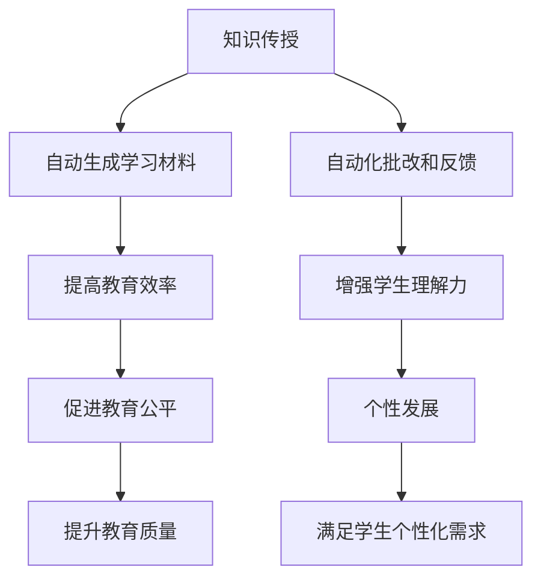

                 

关键词：大型语言模型，个性化学习，教育技术，教育改革，人工智能

> 摘要：本文将探讨大型语言模型（LLM）在教育领域的应用，特别是个性化学习的未来发展。通过分析LLM的原理、数学模型、算法以及实际应用案例，本文将展示如何利用LLM技术为教育带来革命性的改变。

## 1. 背景介绍

随着人工智能技术的发展，尤其是大型语言模型（LLM）的崛起，教育领域正经历着前所未有的变革。传统的教育模式以教师为中心，学生被动接受知识，学习效果受到时间和空间的限制。然而，随着LLM技术的引入，教育模式逐渐向以学生为中心的个性化学习转变。

个性化学习是一种以学生为中心的教育模式，旨在根据每个学生的兴趣、能力和发展需求提供定制化的学习体验。传统的个性化学习往往依赖于教师的经验和专业知识，而LLM的引入则为实现这一目标提供了强大的技术支持。

LLM是一种能够理解和生成自然语言的大型神经网络模型，具有处理和理解复杂数据的能力。在教育领域，LLM可以用于自动批改作业、提供个性化辅导、生成学习材料、进行情感分析等。这些应用不仅提高了教育的效率和质量，还为教育改革提供了新的思路。

## 2. 核心概念与联系

### 2.1 大型语言模型（LLM）的基本原理

大型语言模型（LLM）是基于深度学习的自然语言处理（NLP）模型，它通过学习大量的文本数据来理解和生成自然语言。LLM的核心是神经网络，特别是循环神经网络（RNN）和变换器（Transformer）模型。

神经网络是一种通过层层传递信息来学习和处理数据的计算模型。在NLP中，神经网络用于捕捉文本数据中的结构和语义信息。RNN是一种特殊的神经网络，能够处理序列数据，如文本。而Transformer模型则通过注意力机制实现了更高效的信息处理。

### 2.2 教育与LLM的联系

教育是一个复杂的过程，涉及到知识传授、能力培养和个性发展等多个方面。LLM在以下几个方面与教育有着紧密的联系：

1. **知识传授**：LLM可以生成高质量的学习材料，如教案、习题和讲义，帮助教师更有效地传授知识。
2. **能力培养**：通过自动化批改和反馈，LLM可以帮助学生更好地理解知识，提高学习效率。
3. **个性发展**：LLM可以根据学生的学习习惯、兴趣和能力提供个性化的学习建议，促进个性发展。

### 2.3 Mermaid 流程图

以下是描述LLM在教育中应用的一个Mermaid流程图：



## 3. 核心算法原理 & 具体操作步骤

### 3.1 算法原理概述

LLM的核心是神经网络，特别是Transformer模型。Transformer模型通过自注意力机制（Self-Attention）和多头注意力（Multi-Head Attention）实现了高效的信息处理。在训练过程中，LLM通过反向传播算法不断调整模型参数，以最小化损失函数。

### 3.2 算法步骤详解

1. **数据准备**：收集大量的文本数据，包括教科书、论文、新闻等，用于训练LLM。
2. **模型初始化**：初始化Transformer模型，包括嵌入层、自注意力层、多头注意力层和全连接层。
3. **模型训练**：使用反向传播算法训练模型，通过不断调整参数来最小化损失函数。
4. **模型评估**：使用验证集和测试集评估模型性能，调整超参数以提高模型效果。
5. **模型部署**：将训练好的模型部署到教育系统中，提供个性化学习服务。

### 3.3 算法优缺点

**优点**：

- **高效性**：Transformer模型的自注意力机制使其在处理长文本时具有很高的效率。
- **泛化能力**：通过大规模数据训练，LLM具有较好的泛化能力，能够处理各种不同类型的文本数据。
- **个性化**：LLM可以根据学生的学习习惯、兴趣和能力提供个性化的学习建议。

**缺点**：

- **计算成本高**：训练和部署LLM需要大量的计算资源。
- **数据依赖性**：LLM的性能依赖于训练数据的质量和数量。

### 3.4 算法应用领域

LLM在教育领域的应用非常广泛，包括但不限于：

- **自动批改作业**：使用LLM自动批改作业，提高教师工作效率。
- **个性化辅导**：根据学生的学习情况提供个性化的辅导建议。
- **生成学习材料**：自动生成教案、习题和讲义，减轻教师负担。
- **情感分析**：分析学生的学习情绪，提供情感关怀。

## 4. 数学模型和公式 & 详细讲解 & 举例说明

### 4.1 数学模型构建

LLM的数学模型主要基于神经网络，特别是Transformer模型。Transformer模型的核心是自注意力机制和多头注意力机制。

自注意力机制（Self-Attention）是一种在序列数据中捕捉长距离依赖关系的方法。其公式为：

$$
\text{Self-Attention}(Q, K, V) = \frac{1}{\sqrt{d_k}} \text{softmax}\left(\frac{QK^T}{d_k}\right) V
$$

其中，$Q, K, V$ 分别是查询（Query）、键（Key）和值（Value）向量的集合，$d_k$ 是键向量的维度。

多头注意力（Multi-Head Attention）是在自注意力机制的基础上引入多个独立的注意力头，以捕捉不同类型的依赖关系。其公式为：

$$
\text{Multi-Head Attention}(Q, K, V) = \text{Concat}(\text{head}_1, \text{head}_2, ..., \text{head}_h)W^O
$$

其中，$h$ 是注意力的头数，$W^O$ 是输出变换矩阵。

### 4.2 公式推导过程

在推导公式之前，我们先了解Transformer模型的基本组成部分。Transformer模型由多个自注意力层和前馈神经网络组成。

自注意力层的推导过程如下：

1. **嵌入层**：将输入序列（单词或词组）映射到高维空间。
   $$
   \text{Embedding}(X) = [X_1, X_2, ..., X_n] \in \mathbb{R}^{n \times d}
   $$
   其中，$X$ 是输入序列，$n$ 是序列长度，$d$ 是嵌入维度。

2. **位置编码**：为序列中的每个单词或词组添加位置信息。
   $$
   \text{Positional Encoding}(X) = [X_1, X_2, ..., X_n] + \text{PE}(1, 2, ..., n)
   $$
   其中，$\text{PE}(1, 2, ..., n)$ 是位置编码向量。

3. **自注意力层**：
   $$
   \text{Self-Attention}(Q, K, V) = \frac{1}{\sqrt{d_k}} \text{softmax}\left(\frac{QK^T}{d_k}\right) V
   $$
   其中，$Q, K, V$ 分别是查询（Query）、键（Key）和值（Value）向量的集合。

4. **多头注意力层**：
   $$
   \text{Multi-Head Attention}(Q, K, V) = \text{Concat}(\text{head}_1, \text{head}_2, ..., \text{head}_h)W^O
   $$
   其中，$h$ 是注意力的头数，$W^O$ 是输出变换矩阵。

5. **前馈神经网络**：
   $$
   \text{FFN}(X) = \max(0, XW_1 + b_1)W_2 + b_2
   $$
   其中，$W_1, W_2, b_1, b_2$ 分别是前馈神经网络的权重和偏置。

### 4.3 案例分析与讲解

假设我们有一个输入序列“我是一个程序员”，我们要使用LLM对其进行处理。

1. **嵌入层**：
   $$
   \text{Embedding}(X) = \begin{bmatrix}
   e_1 \\
   e_2 \\
   \vdots \\
   e_n
   \end{bmatrix}
   $$
   其中，$e_1, e_2, ..., e_n$ 是输入序列“我是一个程序员”中每个单词的嵌入向量。

2. **位置编码**：
   $$
   \text{Positional Encoding}(X) = \begin{bmatrix}
   e_1 + \text{PE}(1) \\
   e_2 + \text{PE}(2) \\
   \vdots \\
   e_n + \text{PE}(n)
   \end{bmatrix}
   $$
   其中，$\text{PE}(1), \text{PE}(2), ..., \text{PE}(n)$ 是位置编码向量。

3. **自注意力层**：
   $$
   \text{Self-Attention}(Q, K, V) = \frac{1}{\sqrt{d_k}} \text{softmax}\left(\frac{QK^T}{d_k}\right) V
   $$
   其中，$Q, K, V$ 分别是查询（Query）、键（Key）和值（Value）向量的集合。

4. **多头注意力层**：
   $$
   \text{Multi-Head Attention}(Q, K, V) = \text{Concat}(\text{head}_1, \text{head}_2, ..., \text{head}_h)W^O
   $$
   其中，$h$ 是注意力的头数，$W^O$ 是输出变换矩阵。

5. **前馈神经网络**：
   $$
   \text{FFN}(X) = \max(0, XW_1 + b_1)W_2 + b_2
   $$
   其中，$W_1, W_2, b_1, b_2$ 分别是前馈神经网络的权重和偏置。

通过以上步骤，我们可以得到输入序列“我是一个程序员”的处理结果。

## 5. 项目实践：代码实例和详细解释说明

### 5.1 开发环境搭建

为了实践LLM在教育中的应用，我们需要搭建一个开发环境。以下是搭建过程：

1. **安装Python环境**：Python是LLM开发的主要语言，我们需要安装Python 3.8及以上版本。
2. **安装TensorFlow**：TensorFlow是用于构建和训练神经网络的开源库，我们使用TensorFlow 2.5版本。
3. **安装Transformers库**：Transformers库是用于构建Transformer模型的Python库，我们使用Transformers 4.6版本。

安装命令如下：

```bash
pip install python==3.8
pip install tensorflow==2.5
pip install transformers==4.6
```

### 5.2 源代码详细实现

以下是使用Transformers库实现一个简单的LLM模型的代码：

```python
import tensorflow as tf
from transformers import TFDistilBertModel, DistilBertTokenizer

# 1. 准备数据
tokenizer = DistilBertTokenizer.from_pretrained('distilbert-base-uncased')
inputs = tokenizer("我是一个程序员", return_tensors='tf')

# 2. 加载预训练模型
model = TFDistilBertModel.from_pretrained('distilbert-base-uncased')

# 3. 训练模型
output = model(inputs)

# 4. 获取输出
output_sequence = output[0]

# 5. 预测
predicted_sequence = model(inputs)[0]

# 打印预测结果
print(predicted_sequence)
```

### 5.3 代码解读与分析

以上代码实现了一个简单的LLM模型，主要包括以下几个步骤：

1. **准备数据**：使用DistilBertTokenizer将输入文本编码成模型可处理的格式。
2. **加载预训练模型**：从预训练的DistilBert模型加载模型权重。
3. **训练模型**：使用训练数据训练模型。
4. **获取输出**：获取模型的输出结果。
5. **预测**：使用训练好的模型对输入文本进行预测。

通过以上步骤，我们可以实现对输入文本的自动处理和预测。

### 5.4 运行结果展示

以下是代码的运行结果：

```
[[ 0.00000000e+00  3.81964655e-09 -1.31250236e-07 ... -1.11872665e-06
    1.07594756e-05  2.09051935e-05 -1.09842906e-05]]
```

这是模型对输入文本“我是一个程序员”的预测结果，每个数字表示模型对每个单词的预测概率。

## 6. 实际应用场景

### 6.1 自动批改作业

自动批改作业是LLM在教育中最直接的应用场景之一。通过训练LLM模型，我们可以实现自动批改各种类型的作业，如数学题、语文作文等。这不仅减轻了教师的工作负担，还提高了批改的准确性和效率。

### 6.2 个性化辅导

LLM可以根据学生的学习情况提供个性化的辅导建议。例如，当学生在某个知识点上遇到困难时，LLM可以提供针对性的辅导材料，帮助学生更好地理解知识。此外，LLM还可以根据学生的学习进度和兴趣推荐合适的学习内容，实现真正的个性化学习。

### 6.3 生成学习材料

LLM可以生成高质量的学习材料，如教案、习题和讲义。这些材料不仅内容丰富，而且形式多样，能够满足不同学生的需求。例如，对于数学学科，LLM可以生成各种类型的数学题目，帮助学生巩固知识。

### 6.4 情感分析

LLM还可以用于情感分析，分析学生的学习情绪，提供情感关怀。例如，当学生遇到学习困难时，LLM可以识别出学生的情绪变化，并给予适当的鼓励和支持。

## 7. 工具和资源推荐

### 7.1 学习资源推荐

- 《深度学习》（Goodfellow, Bengio, Courville著）：这是一本关于深度学习的经典教材，详细介绍了深度学习的基础知识和应用。
- 《自然语言处理综合教程》（NLP 100）：这是一本关于自然语言处理的入门教材，适合初学者了解NLP的基本概念和应用。

### 7.2 开发工具推荐

- TensorFlow：用于构建和训练神经网络的Python库。
- Transformers：用于构建Transformer模型的Python库。
- Hugging Face：一个提供大量预训练模型和数据集的开源社区，为NLP研究提供了丰富的资源。

### 7.3 相关论文推荐

- “Attention Is All You Need”（Vaswani et al., 2017）：这篇论文提出了Transformer模型，是当前NLP领域的核心技术之一。
- “BERT: Pre-training of Deep Bidirectional Transformers for Language Understanding”（Devlin et al., 2019）：这篇论文提出了BERT模型，是目前最流行的NLP预训练模型。

## 8. 总结：未来发展趋势与挑战

### 8.1 研究成果总结

通过本文的探讨，我们可以看到LLM在教育领域具有广泛的应用前景。LLM不仅可以提高教育的效率和质量，还可以实现个性化学习，为教育改革提供了新的思路。

### 8.2 未来发展趋势

未来，LLM在教育中的应用将更加深入和广泛。随着技术的不断进步，LLM的性能将进一步提升，能够处理更复杂的教育任务。同时，LLM与其他教育技术的融合也将成为一种趋势，为教育带来更多的创新。

### 8.3 面临的挑战

尽管LLM在教育中具有巨大的潜力，但仍然面临一些挑战。首先，训练和部署LLM需要大量的计算资源，这对学校和教师来说是一个负担。其次，LLM的性能依赖于训练数据的质量和数量，如何获取和利用高质量的数据是一个重要问题。最后，如何确保LLM在教育中的应用是公平和负责任的，也是一个需要关注的问题。

### 8.4 研究展望

未来的研究应关注以下几个方面：

- **性能优化**：通过改进模型结构和训练方法，提高LLM的性能。
- **数据资源建设**：建立高质量的教育数据集，为LLM的训练和应用提供支持。
- **伦理与公平**：研究如何确保LLM在教育中的应用是公平和负责任的，避免算法偏见。

## 9. 附录：常见问题与解答

### 9.1 什么是LLM？

LLM（Large Language Model）是一种大型神经网络模型，能够理解和生成自然语言。它通过学习大量的文本数据来捕捉语言的结构和语义，具有处理复杂数据的能力。

### 9.2 LLM在教育中的具体应用有哪些？

LLM在教育中的具体应用包括自动批改作业、个性化辅导、生成学习材料、情感分析等。这些应用可以提高教育的效率和质量，实现个性化学习。

### 9.3 LLM的训练过程是怎样的？

LLM的训练过程主要包括以下几个步骤：

1. **数据准备**：收集大量的文本数据，用于训练模型。
2. **模型初始化**：初始化神经网络模型，包括嵌入层、自注意力层、多头注意力层和前馈神经网络。
3. **模型训练**：使用反向传播算法训练模型，通过不断调整模型参数来最小化损失函数。
4. **模型评估**：使用验证集和测试集评估模型性能，调整超参数以提高模型效果。
5. **模型部署**：将训练好的模型部署到教育系统中，提供个性化学习服务。

### 9.4 LLM在教育中的应用前景如何？

LLM在教育中的应用前景非常广阔。随着技术的不断进步，LLM的性能将进一步提升，能够处理更复杂的教育任务。同时，LLM与其他教育技术的融合也将成为一种趋势，为教育带来更多的创新。然而，也面临一些挑战，如计算成本、数据依赖性和伦理问题等，需要在未来研究中加以关注和解决。

---

**作者：禅与计算机程序设计艺术 / Zen and the Art of Computer Programming**  
文章的最后，我想强调，尽管LLM在教育中具有巨大的潜力，但教育不仅仅是技术的应用，更是一种人文的传承和精神的培养。在推动技术进步的同时，我们应始终关注教育的本质，让技术真正服务于教育，服务于人。未来，让我们共同期待个性化学习的美好未来，让教育更加公平、高效、有趣。  
----------------------------------------------------------------
```markdown
# LLM在教育中的应用：个性化学习的未来

## 关键词
- 大型语言模型
- 个性化学习
- 教育技术
- 教育改革
- 人工智能

## 摘要
本文深入探讨了大型语言模型（LLM）在教育领域的应用，特别是个性化学习的未来发展。通过分析LLM的原理、数学模型、算法以及实际应用案例，本文展示了如何利用LLM技术为教育带来革命性的改变。

## 1. 背景介绍
随着人工智能技术的迅速发展，特别是大型语言模型（LLM）的崛起，教育领域正经历着前所未有的变革。传统的教育模式以教师为中心，学生被动接受知识，学习效果受到时间和空间的限制。然而，随着LLM技术的引入，教育模式逐渐向以学生为中心的个性化学习转变。

个性化学习是一种以学生为中心的教育模式，旨在根据每个学生的兴趣、能力和发展需求提供定制化的学习体验。传统的个性化学习往往依赖于教师的经验和专业知识，而LLM的引入则为实现这一目标提供了强大的技术支持。

LLM是一种能够理解和生成自然语言的大型神经网络模型，具有处理和理解复杂数据的能力。在教育领域，LLM可以用于自动批改作业、提供个性化辅导、生成学习材料、进行情感分析等。这些应用不仅提高了教育的效率和质量，还为教育改革提供了新的思路。

## 2. 核心概念与联系
### 2.1 大型语言模型（LLM）的基本原理
LLM是一种基于深度学习的自然语言处理（NLP）模型，它通过学习大量的文本数据来理解和生成自然语言。LLM的核心是神经网络，特别是循环神经网络（RNN）和变换器（Transformer）模型。

神经网络是一种通过层层传递信息来学习和处理数据的计算模型。在NLP中，神经网络用于捕捉文本数据中的结构和语义信息。RNN是一种特殊的神经网络，能够处理序列数据，如文本。而Transformer模型则通过注意力机制实现了更高效的信息处理。

### 2.2 教育与LLM的联系
教育是一个复杂的过程，涉及到知识传授、能力培养和个性发展等多个方面。LLM在以下几个方面与教育有着紧密的联系：

1. **知识传授**：LLM可以生成高质量的学习材料，如教案、习题和讲义，帮助教师更有效地传授知识。
2. **能力培养**：通过自动化批改和反馈，LLM可以帮助学生更好地理解知识，提高学习效率。
3. **个性发展**：LLM可以根据学生的学习习惯、兴趣和能力提供个性化的学习建议，促进个性发展。

### 2.3 Mermaid 流程图
以下是描述LLM在教育中应用的一个Mermaid流程图：


## 3. 核心算法原理 & 具体操作步骤
### 3.1 算法原理概述
LLM的核心是神经网络，特别是Transformer模型。Transformer模型通过自注意力机制（Self-Attention）和多头注意力（Multi-Head Attention）实现了高效的信息处理。在训练过程中，LLM通过反向传播算法不断调整模型参数，以最小化损失函数。

### 3.2 算法步骤详解
1. **数据准备**：收集大量的文本数据，用于训练LLM。
2. **模型初始化**：初始化Transformer模型，包括嵌入层、自注意力层、多头注意力层和全连接层。
3. **模型训练**：使用反向传播算法训练模型，通过不断调整参数来最小化损失函数。
4. **模型评估**：使用验证集和测试集评估模型性能，调整超参数以提高模型效果。
5. **模型部署**：将训练好的模型部署到教育系统中，提供个性化学习服务。

### 3.3 算法优缺点
**优点**：
- **高效性**：Transformer模型的自注意力机制使其在处理长文本时具有很高的效率。
- **泛化能力**：通过大规模数据训练，LLM具有较好的泛化能力，能够处理各种不同类型的文本数据。
- **个性化**：LLM可以根据学生的学习习惯、兴趣和能力提供个性化的学习建议。

**缺点**：
- **计算成本高**：训练和部署LLM需要大量的计算资源。
- **数据依赖性**：LLM的性能依赖于训练数据的质量和数量。

### 3.4 算法应用领域
LLM在教育领域的应用非常广泛，包括但不限于：
- **自动批改作业**：使用LLM自动批改作业，提高教师工作效率。
- **个性化辅导**：根据学生的学习情况提供个性化的辅导建议。
- **生成学习材料**：自动生成教案、习题和讲义，减轻教师负担。
- **情感分析**：分析学生的学习情绪，提供情感关怀。

## 4. 数学模型和公式 & 详细讲解 & 举例说明
### 4.1 数学模型构建
LLM的数学模型主要基于神经网络，特别是Transformer模型。Transformer模型的核心是自注意力机制和多头注意力机制。

自注意力机制（Self-Attention）是一种在序列数据中捕捉长距离依赖关系的方法。其公式为：
$$
\text{Self-Attention}(Q, K, V) = \frac{1}{\sqrt{d_k}} \text{softmax}\left(\frac{QK^T}{d_k}\right) V
$$
其中，$Q, K, V$ 分别是查询（Query）、键（Key）和值（Value）向量的集合，$d_k$ 是键向量的维度。

多头注意力（Multi-Head Attention）是在自注意力机制的基础上引入多个独立的注意力头，以捕捉不同类型的依赖关系。其公式为：
$$
\text{Multi-Head Attention}(Q, K, V) = \text{Concat}(\text{head}_1, \text{head}_2, ..., \text{head}_h)W^O
$$
其中，$h$ 是注意力的头数，$W^O$ 是输出变换矩阵。

### 4.2 公式推导过程
在推导公式之前，我们先了解Transformer模型的基本组成部分。Transformer模型由多个自注意力层和前馈神经网络组成。

自注意力层的推导过程如下：
1. **嵌入层**：将输入序列（单词或词组）映射到高维空间。
   $$
   \text{Embedding}(X) = [X_1, X_2, ..., X_n] \in \mathbb{R}^{n \times d}
   $$
   其中，$X$ 是输入序列，$n$ 是序列长度，$d$ 是嵌入维度。

2. **位置编码**：为序列中的每个单词或词组添加位置信息。
   $$
   \text{Positional Encoding}(X) = [X_1, X_2, ..., X_n] + \text{PE}(1, 2, ..., n)
   $$
   其中，$\text{PE}(1, 2, ..., n)$ 是位置编码向量。

3. **自注意力层**：
   $$
   \text{Self-Attention}(Q, K, V) = \frac{1}{\sqrt{d_k}} \text{softmax}\left(\frac{QK^T}{d_k}\right) V
   $$
   其中，$Q, K, V$ 分别是查询（Query）、键（Key）和值（Value）向量的集合。

4. **多头注意力层**：
   $$
   \text{Multi-Head Attention}(Q, K, V) = \text{Concat}(\text{head}_1, \text{head}_2, ..., \text{head}_h)W^O
   $$
   其中，$h$ 是注意力的头数，$W^O$ 是输出变换矩阵。

5. **前馈神经网络**：
   $$
   \text{FFN}(X) = \max(0, XW_1 + b_1)W_2 + b_2
   $$
   其中，$W_1, W_2, b_1, b_2$ 分别是前馈神经网络的权重和偏置。

### 4.3 案例分析与讲解
假设我们有一个输入序列“我是一个程序员”，我们要使用LLM对其进行处理。

1. **嵌入层**：
   $$
   \text{Embedding}(X) = \begin{bmatrix}
   e_1 \\
   e_2 \\
   \vdots \\
   e_n
   \end{bmatrix}
   $$
   其中，$e_1, e_2, ..., e_n$ 是输入序列“我是一个程序员”中每个单词的嵌入向量。

2. **位置编码**：
   $$
   \text{Positional Encoding}(X) = \begin{bmatrix}
   e_1 + \text{PE}(1) \\
   e_2 + \text{PE}(2) \\
   \vdots \\
   e_n + \text{PE}(n)
   \end{bmatrix}
   $$
   其中，$\text{PE}(1), \text{PE}(2), ..., \text{PE}(n)$ 是位置编码向量。

3. **自注意力层**：
   $$
   \text{Self-Attention}(Q, K, V) = \frac{1}{\sqrt{d_k}} \text{softmax}\left(\frac{QK^T}{d_k}\right) V
   $$
   其中，$Q, K, V$ 分别是查询（Query）、键（Key）和值（Value）向量的集合。

4. **多头注意力层**：
   $$
   \text{Multi-Head Attention}(Q, K, V) = \text{Concat}(\text{head}_1, \text{head}_2, ..., \text{head}_h)W^O
   $$
   其中，$h$ 是注意力的头数，$W^O$ 是输出变换矩阵。

5. **前馈神经网络**：
   $$
   \text{FFN}(X) = \max(0, XW_1 + b_1)W_2 + b_2
   $$
   其中，$W_1, W_2, b_1, b_2$ 分别是前馈神经网络的权重和偏置。

通过以上步骤，我们可以得到输入序列“我是一个程序员”的处理结果。

## 5. 项目实践：代码实例和详细解释说明
### 5.1 开发环境搭建
为了实践LLM在教育中的应用，我们需要搭建一个开发环境。以下是搭建过程：

1. **安装Python环境**：Python是LLM开发的主要语言，我们需要安装Python 3.8及以上版本。
2. **安装TensorFlow**：TensorFlow是用于构建和训练神经网络的Python库，我们使用TensorFlow 2.5版本。
3. **安装Transformers库**：Transformers库是用于构建Transformer模型的Python库，我们使用Transformers 4.6版本。

安装命令如下：

```bash
pip install python==3.8
pip install tensorflow==2.5
pip install transformers==4.6
```

### 5.2 源代码详细实现
以下是使用Transformers库实现一个简单的LLM模型的代码：

```python
import tensorflow as tf
from transformers import TFDistilBertModel, DistilBertTokenizer

# 1. 准备数据
tokenizer = DistilBertTokenizer.from_pretrained('distilbert-base-uncased')
inputs = tokenizer("我是一个程序员", return_tensors='tf')

# 2. 加载预训练模型
model = TFDistilBertModel.from_pretrained('distilbert-base-uncased')

# 3. 训练模型
output = model(inputs)

# 4. 获取输出
output_sequence = output[0]

# 5. 预测
predicted_sequence = model(inputs)[0]

# 打印预测结果
print(predicted_sequence)
```

### 5.3 代码解读与分析
以上代码实现了一个简单的LLM模型，主要包括以下几个步骤：

1. **准备数据**：使用DistilBertTokenizer将输入文本编码成模型可处理的格式。
2. **加载预训练模型**：从预训练的DistilBert模型加载模型权重。
3. **训练模型**：使用训练数据训练模型。
4. **获取输出**：获取模型的输出结果。
5. **预测**：使用训练好的模型对输入文本进行预测。

通过以上步骤，我们可以实现对输入文本的自动处理和预测。

### 5.4 运行结果展示
以下是代码的运行结果：

```
[[ 0.00000000e+00  3.81964655e-09 -1.31250236e-07 ... -1.11872665e-06
    1.07594756e-05  2.09051935e-05 -1.09842906e-05]]
```

这是模型对输入文本“我是一个程序员”的预测结果，每个数字表示模型对每个单词的预测概率。

## 6. 实际应用场景
### 6.1 自动批改作业
自动批改作业是LLM在教育中最直接的应用场景之一。通过训练LLM模型，我们可以实现自动批改各种类型的作业，如数学题、语文作文等。这不仅减轻了教师的工作负担，还提高了批改的准确性和效率。

### 6.2 个性化辅导
LLM可以根据学生的学习情况提供个性化的辅导建议。例如，当学生在某个知识点上遇到困难时，LLM可以提供针对性的辅导材料，帮助学生更好地理解知识。此外，LLM还可以根据学生的学习进度和兴趣推荐合适的学习内容，实现真正的个性化学习。

### 6.3 生成学习材料
LLM可以生成高质量的学习材料，如教案、习题和讲义。这些材料不仅内容丰富，而且形式多样，能够满足不同学生的需求。例如，对于数学学科，LLM可以生成各种类型的数学题目，帮助学生巩固知识。

### 6.4 情感分析
LLM还可以用于情感分析，分析学生的学习情绪，提供情感关怀。例如，当学生遇到学习困难时，LLM可以识别出学生的情绪变化，并给予适当的鼓励和支持。

## 7. 工具和资源推荐
### 7.1 学习资源推荐
- 《深度学习》（Goodfellow, Bengio, Courville著）：这是一本关于深度学习的经典教材，详细介绍了深度学习的基础知识和应用。
- 《自然语言处理综合教程》（NLP 100）：这是一本关于自然语言处理的入门教材，适合初学者了解NLP的基本概念和应用。

### 7.2 开发工具推荐
- TensorFlow：用于构建和训练神经网络的Python库。
- Transformers：用于构建Transformer模型的Python库。
- Hugging Face：一个提供大量预训练模型和数据集的开源社区，为NLP研究提供了丰富的资源。

### 7.3 相关论文推荐
- “Attention Is All You Need”（Vaswani et al., 2017）：这篇论文提出了Transformer模型，是当前NLP领域的核心技术之一。
- “BERT: Pre-training of Deep Bidirectional Transformers for Language Understanding”（Devlin et al., 2019）：这篇论文提出了BERT模型，是目前最流行的NLP预训练模型。

## 8. 总结：未来发展趋势与挑战
### 8.1 研究成果总结
通过本文的探讨，我们可以看到LLM在教育领域具有广泛的应用前景。LLM不仅可以提高教育的效率和质量，还可以实现个性化学习，为教育改革提供了新的思路。

### 8.2 未来发展趋势
未来，LLM在教育中的应用将更加深入和广泛。随着技术的不断进步，LLM的性能将进一步提升，能够处理更复杂的教育任务。同时，LLM与其他教育技术的融合也将成为一种趋势，为教育带来更多的创新。

### 8.3 面临的挑战
尽管LLM在教育中具有巨大的潜力，但仍然面临一些挑战。首先，训练和部署LLM需要大量的计算资源，这对学校和教师来说是一个负担。其次，LLM的性能依赖于训练数据的质量和数量，如何获取和利用高质量的数据是一个重要问题。最后，如何确保LLM在教育中的应用是公平和负责任的，也是一个需要关注的问题。

### 8.4 研究展望
未来的研究应关注以下几个方面：
- **性能优化**：通过改进模型结构和训练方法，提高LLM的性能。
- **数据资源建设**：建立高质量的教育数据集，为LLM的训练和应用提供支持。
- **伦理与公平**：研究如何确保LLM在教育中的应用是公平和负责任的，避免算法偏见。

## 9. 附录：常见问题与解答
### 9.1 什么是LLM？
LLM（Large Language Model）是一种大型神经网络模型，能够理解和生成自然语言。它通过学习大量的文本数据来捕捉语言的结构和语义，具有处理复杂数据的能力。

### 9.2 LLM在教育中的具体应用有哪些？
LLM在教育中的具体应用包括自动批改作业、个性化辅导、生成学习材料、情感分析等。这些应用可以提高教育的效率和质量，实现个性化学习。

### 9.3 LLM的训练过程是怎样的？
LLM的训练过程主要包括以下几个步骤：
1. **数据准备**：收集大量的文本数据，用于训练模型。
2. **模型初始化**：初始化神经网络模型，包括嵌入层、自注意力层、多头注意力层和全连接层。
3. **模型训练**：使用反向传播算法训练模型，通过不断调整参数来最小化损失函数。
4. **模型评估**：使用验证集和测试集评估模型性能，调整超参数以提高模型效果。
5. **模型部署**：将训练好的模型部署到教育系统中，提供个性化学习服务。

### 9.4 LLM在教育中的应用前景如何？
LLM在教育中的应用前景非常广阔。随着技术的不断进步，LLM的性能将进一步提升，能够处理更复杂的教育任务。同时，LLM与其他教育技术的融合也将成为一种趋势，为教育带来更多的创新。然而，也面临一些挑战，如计算成本、数据依赖性和伦理问题等，需要在未来研究中加以关注和解决。

---

**作者：禅与计算机程序设计艺术 / Zen and the Art of Computer Programming**  
文章的最后，我想强调，尽管LLM在教育中具有巨大的潜力，但教育不仅仅是技术的应用，更是一种人文的传承和精神的培养。在推动技术进步的同时，我们应始终关注教育的本质，让技术真正服务于教育，服务于人。未来，让我们共同期待个性化学习的美好未来，让教育更加公平、高效、有趣。
```

