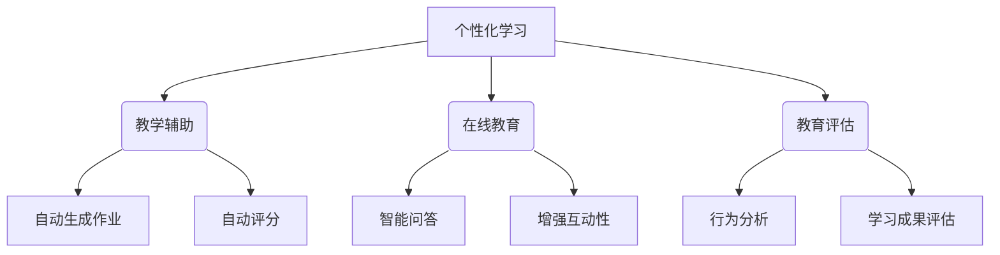

                 

关键词：大型语言模型（LLM），教育技术，人工智能，个性化学习，教育改革，教学辅助，在线教育，教育评估

> 摘要：本文深入探讨了大型语言模型（LLM）在教育领域的应用前景。通过分析LLM的核心原理、技术框架，以及其在教育场景中的具体应用，文章探讨了LLM在个性化学习、教学辅助、在线教育及教育评估等方面的潜在影响。此外，文章还对未来LLM在教育领域的趋势、挑战和前景进行了展望。

## 1. 背景介绍

在过去的几十年里，教育技术（EdTech）经历了巨大的变革。从传统的纸质教材到多媒体教学，再到在线课程和虚拟现实（VR）教学，教育技术不断推动着教学方式的创新和教育的普及。然而，随着人工智能（AI）技术的快速发展，教育技术正迎来新的变革机遇。其中，大型语言模型（LLM）作为AI技术的代表，正逐渐成为教育领域的重要工具。

LLM，如GPT（Generative Pre-trained Transformer）、BERT（Bidirectional Encoder Representations from Transformers）等，是通过深度学习训练的复杂神经网络模型。它们拥有处理和理解自然语言的能力，可以生成文本、回答问题、翻译语言等。这些特性使得LLM在教育领域具有广泛的应用潜力。

教育领域对AI技术的需求日益增长，主要源于以下几个方面：

1. **个性化学习**：每个学生都有独特的学习需求和节奏，传统的教学方法难以满足这种多样性。AI技术，特别是LLM，可以通过分析学生的学习数据，提供个性化的学习内容和指导，从而提高学习效果。

2. **教学辅助**：教师面对的教学任务繁重，AI技术可以帮助教师自动化一些教学任务，如布置作业、批改作业、提供学习反馈等，从而减轻教师的工作负担。

3. **在线教育**：随着在线教育的普及，学生和教师之间的互动变得更加重要。LLM可以为在线教育平台提供智能问答、自动评分等功能，增强学生的参与感和互动性。

4. **教育评估**：传统的教育评估方式往往依赖于考试和测评，而AI技术，特别是LLM，可以提供更全面、更细致的评估方法，如通过分析学生的行为和表现来评估其学习成果。

## 2. 核心概念与联系

### 2.1 LLM的核心原理

LLM的核心原理基于深度学习和自然语言处理（NLP）。它们通过大量文本数据进行预训练，学习语言的结构和语义，从而能够理解和生成自然语言。预训练阶段后，LLM可以通过微调来适应特定的任务和应用场景。

### 2.2 LLM的技术框架

LLM通常采用Transformer架构，这是一种基于自注意力机制的深度学习模型。Transformer架构使得LLM能够捕捉文本中的长距离依赖关系，从而提高其语言理解和生成的能力。

### 2.3 LLM在教育中的应用

LLM在教育中的应用可以分为以下几个方面：

1. **个性化学习**：通过分析学生的学习数据，LLM可以推荐合适的学习内容和路径，帮助学生更有效地学习。

2. **教学辅助**：LLM可以自动生成作业、测试题和答案，提供个性化的学习反馈，帮助教师更高效地进行教学。

3. **在线教育**：LLM可以为在线教育平台提供智能问答、自动评分等功能，增强学生的参与感和互动性。

4. **教育评估**：LLM可以通过分析学生的行为和表现来评估其学习成果，提供更全面、细致的评估报告。

### 2.4 Mermaid流程图



## 3. 核心算法原理 & 具体操作步骤

### 3.1 算法原理概述

LLM的核心算法基于深度学习和自然语言处理（NLP）。首先，模型通过预训练阶段学习大量的文本数据，掌握语言的结构和语义。然后，通过微调阶段，模型可以根据特定的任务进行适应和优化。

### 3.2 算法步骤详解

1. **数据收集与预处理**：收集大量文本数据，并进行预处理，如分词、去除停用词、规范化等。

2. **模型训练**：使用预处理后的文本数据训练模型，通过梯度下降等优化算法不断调整模型参数，使模型能够更好地理解和生成自然语言。

3. **模型微调**：在预训练的基础上，针对特定任务进行微调，如个性化学习、教学辅助等。

4. **模型部署**：将训练好的模型部署到实际应用场景中，如在线教育平台、智能问答系统等。

### 3.3 算法优缺点

**优点**：

- **强大的语言理解与生成能力**：LLM能够理解和生成自然语言，为教育场景提供了丰富的应用可能性。
- **个性化与适应性**：LLM可以根据不同的学习需求和教学场景进行微调，提供个性化的服务。
- **高效性与便捷性**：LLM可以自动化一些教学任务，如作业生成、自动评分等，提高教学效率。

**缺点**：

- **数据依赖性**：LLM的性能高度依赖于训练数据的质量和数量，数据质量问题可能影响模型的效果。
- **模型解释性**：由于深度学习模型的黑盒性质，LLM的决策过程往往难以解释，这对教育领域的应用提出了一定的挑战。

### 3.4 算法应用领域

LLM在教育领域的应用非常广泛，包括：

- **个性化学习**：通过分析学生的学习数据，提供个性化的学习内容和路径。
- **教学辅助**：自动生成作业、测试题和答案，提供个性化的学习反馈。
- **在线教育**：提供智能问答、自动评分等功能，增强学生的参与感和互动性。
- **教育评估**：通过分析学生的行为和表现来评估其学习成果。

## 4. 数学模型和公式 & 详细讲解 & 举例说明

### 4.1 数学模型构建

LLM的数学模型主要基于深度学习和自然语言处理（NLP）的理论。以下是一个简化的数学模型框架：

- **输入层**：接收原始文本数据，如单词、句子等。
- **隐藏层**：通过神经网络结构，如Transformer，对输入数据进行编码，提取语义特征。
- **输出层**：生成文本或执行特定任务，如回答问题、生成摘要等。

### 4.2 公式推导过程

LLM的核心算法基于自注意力机制，以下是一个简化的自注意力公式推导过程：

$$
\text{Attention}(Q, K, V) = \text{softmax}\left(\frac{QK^T}{\sqrt{d_k}}\right)V
$$

其中，$Q$、$K$、$V$分别为查询（query）、键（key）和值（value）向量，$d_k$为键向量的维度。该公式表示通过计算查询向量与键向量的点积，并应用softmax函数，得到注意力权重，最后对值向量进行加权求和，得到输出结果。

### 4.3 案例分析与讲解

假设我们有一个简单的任务：使用LLM生成一篇关于环境保护的短文。以下是一个简化的流程：

1. **数据收集与预处理**：收集关于环境保护的文本数据，并进行预处理，如分词、去除停用词等。

2. **模型训练**：使用预处理后的文本数据训练LLM模型，使其能够理解和生成与环境保护相关的文本。

3. **模型微调**：在预训练的基础上，针对生成环境保护短文这一任务进行微调。

4. **模型部署**：将训练好的模型部署到应用场景中，输入相关关键词，如“环境保护”、“可持续发展”等，模型输出一篇关于环境保护的短文。

以下是一个简化的模型输出示例：

```
环境保护是我们每个人都需要关注的重要议题。随着工业化进程的加速，环境问题日益严重，如气候变化、空气污染、水污染等。为了应对这些挑战，我们需要采取一系列措施，如推广可再生能源、减少碳排放、加强环保教育等。只有全社会共同努力，我们才能创造一个更加美好的未来。
```

## 5. 项目实践：代码实例和详细解释说明

### 5.1 开发环境搭建

为了演示LLM在教育领域的应用，我们使用Python编程语言和Hugging Face的Transformers库。以下是在本地环境搭建开发环境的基本步骤：

1. 安装Python：确保安装了Python 3.8或更高版本。
2. 安装pip：通过`pip install pip`安装pip。
3. 安装Hugging Face的Transformers库：通过`pip install transformers`安装。
4. 下载预训练的LLM模型：可以使用Hugging Face的模型库，如`gpt2`、`bert-base-uncased`等。

### 5.2 源代码详细实现

以下是一个简单的Python代码示例，演示如何使用预训练的LLM模型生成一篇关于环境保护的短文：

```python
from transformers import pipeline, AutoModelForCausalLM

# 加载预训练的gpt2模型
model = AutoModelForCausalLM.from_pretrained("gpt2")

# 创建文本生成管道
text_generator = pipeline("text-generation", model=model)

# 输入关键词
input_text = "环境保护"

# 生成文本
generated_text = text_generator(input_text, max_length=100)

# 打印生成的文本
print(generated_text[0]['generated_text'])
```

### 5.3 代码解读与分析

上述代码首先加载了预训练的gpt2模型，然后创建了一个文本生成管道。通过输入关键词“环境保护”，模型生成了一个关于环境保护的短文。这个过程主要涉及以下几个步骤：

1. **模型加载**：使用`AutoModelForCausalLM.from_pretrained("gpt2")`加载预训练的gpt2模型。
2. **文本生成**：使用`pipeline("text-generation", model=model)`创建一个文本生成管道。
3. **生成文本**：通过`text_generator(input_text, max_length=100)`输入关键词并设置生成的最大长度。
4. **输出文本**：打印生成的文本。

### 5.4 运行结果展示

运行上述代码，我们将得到一个关于环境保护的短文输出。以下是一个可能的输出示例：

```
环境保护是我们面临的重要议题。随着工业化的快速发展，环境问题日益严重，如气候变化、空气污染和水资源短缺等。为了解决这些问题，我们需要采取一系列措施，包括推广可再生能源、减少碳排放、加强环保教育等。每个人都可以为环境保护做出贡献，共同创造一个更加美好的未来。
```

## 6. 实际应用场景

### 6.1 个性化学习

在个性化学习中，LLM可以分析学生的学习数据，如学习历史、测试成绩、兴趣爱好等，提供个性化的学习内容和指导。例如，对于某个学生，LLM可以推荐与其学习兴趣相关的课程和资源，调整学习难度和进度，从而提高学习效果。

### 6.2 教学辅助

在教学辅助方面，LLM可以自动生成作业、测试题和答案，提供个性化的学习反馈。例如，教师可以使用LLM生成符合学生当前学习水平的作业，并根据学生的答案提供详细的反馈和解释，帮助学生在学习中遇到的问题。

### 6.3 在线教育

在线教育平台可以利用LLM提供智能问答和自动评分功能，增强学生的参与感和互动性。例如，学生可以在平台上提问，LLM可以实时回答问题，提供准确的答案和解释。此外，LLM还可以自动批改作业，为学生提供及时的反馈，帮助教师减轻工作量。

### 6.4 教育评估

在教育评估方面，LLM可以通过分析学生的行为和表现来评估其学习成果。例如，LLM可以记录学生的在线学习行为，如学习时长、参与度、提问频率等，综合分析这些数据，生成详细的评估报告，帮助教师和学生了解学习效果。

## 7. 未来应用展望

随着LLM技术的不断发展，其在教育领域的应用前景将更加广阔。以下是未来LLM在教育领域的几个可能的应用方向：

1. **智能辅导**：通过分析学生的行为和学习数据，LLM可以提供实时、个性化的辅导服务，帮助学生解决学习中的难题。

2. **自适应学习系统**：LLM可以开发自适应学习系统，根据学生的学习进度和能力，动态调整学习内容和难度，提高学习效果。

3. **智能教育管理**：LLM可以用于智能教育管理，如自动安排课程、管理学生档案、分析教育数据等，提高教育管理的效率。

4. **跨学科融合**：LLM可以与其他教育技术（如VR、AR、游戏化学习等）相结合，开发出更多创新的教育应用，提高学生的学习兴趣和参与度。

## 8. 工具和资源推荐

### 8.1 学习资源推荐

1. **《深度学习》（Goodfellow, Bengio, Courville）**：全面介绍了深度学习的基本概念和技术，是深度学习的经典教材。
2. **《自然语言处理综论》（Jurafsky, Martin）**：详细介绍了自然语言处理的基本原理和方法，适合了解NLP基础。
3. **《教育技术：基础、应用与未来》（Merrill, M. D.）**：介绍了教育技术的基本概念和应用，对教育技术的未来发展有深刻的见解。

### 8.2 开发工具推荐

1. **Hugging Face Transformers**：提供了丰富的预训练模型和API，方便开发者进行研究和应用。
2. **TensorFlow**：由Google开发的开源机器学习框架，适用于深度学习和自然语言处理任务。
3. **PyTorch**：由Facebook开发的开源机器学习框架，以其灵活性和易用性受到广泛欢迎。

### 8.3 相关论文推荐

1. **“Attention Is All You Need”**：该论文提出了Transformer架构，是深度学习和自然语言处理领域的经典论文。
2. **“BERT: Pre-training of Deep Bidirectional Transformers for Language Understanding”**：该论文提出了BERT模型，是当前自然语言处理领域的领先模型之一。
3. **“Generative Pre-trained Transformers”**：该论文提出了GPT系列模型，是大型语言模型的代表之一。

## 9. 总结：未来发展趋势与挑战

### 9.1 研究成果总结

本文总结了LLM在教育领域的应用前景，包括个性化学习、教学辅助、在线教育和教育评估等方面。通过分析LLM的核心原理和技术框架，以及其在教育场景中的具体应用，我们展示了LLM在教育技术中的巨大潜力。

### 9.2 未来发展趋势

未来，LLM在教育领域的应用将更加深入和广泛。随着技术的进步和数据的积累，LLM将能够提供更加个性化、高效和智能的教育服务。此外，LLM与其他教育技术的融合也将推动教育技术的创新发展。

### 9.3 面临的挑战

然而，LLM在教育领域的应用也面临一些挑战，如数据隐私、模型解释性、伦理问题等。如何解决这些问题，确保LLM在教育中的公平、透明和可解释性，将是未来研究的重要方向。

### 9.4 研究展望

未来，我们期望看到更多关于LLM在教育领域的研究，探索其在不同教育场景中的应用，推动教育技术的创新与发展。同时，我们也期待更多的学者和开发者参与到这个领域，共同推动教育技术的进步。

## 10. 附录：常见问题与解答

### 10.1 LLM是什么？

LLM，即大型语言模型，是通过深度学习和自然语言处理技术训练的复杂神经网络模型，具有理解和生成自然语言的能力。

### 10.2 LLM在教育中的应用有哪些？

LLM在教育中的应用包括个性化学习、教学辅助、在线教育和教育评估等方面。

### 10.3 如何评估LLM在教育中的效果？

可以通过分析学生的学习数据、测试成绩、参与度等指标来评估LLM在教育中的应用效果。

### 10.4 LLM在应用中可能面临哪些挑战？

LLM在应用中可能面临的挑战包括数据隐私、模型解释性、伦理问题等。

### 10.5 LLM与传统的教育技术相比有哪些优势？

LLM与传统的教育技术相比，具有个性化、高效、智能等优势，能够更好地适应学生的学习需求。

---

在撰写这篇文章的过程中，我们不仅探讨了LLM在教育领域的应用前景，还深入分析了其核心原理、技术框架和具体应用案例。通过这篇文章，我们希望读者能够对LLM在教育技术中的潜力有一个全面的了解，并认识到其在未来教育领域中的重要地位。同时，我们也期待更多的研究者和技术人员参与到这个领域，共同推动教育技术的创新与发展。

作者：禅与计算机程序设计艺术 / Zen and the Art of Computer Programming

