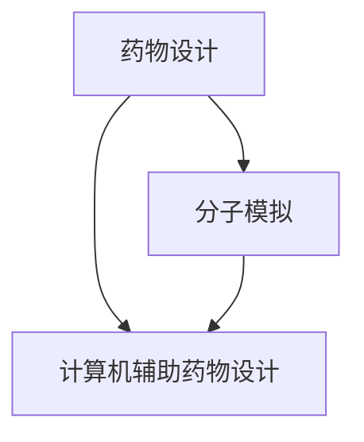

                 

关键词：大语言模型（LLM），新药研发，机器学习，药物设计，分子模拟，计算机辅助药物设计

## 摘要

本文旨在探讨大语言模型（LLM）在新药研发领域的潜在应用。通过分析LLM的基本原理和优势，我们提出了其在药物设计、分子模拟和计算机辅助药物设计等环节中的可能应用方式。同时，本文还探讨了LLM在新药研发中可能面临的挑战以及未来的发展方向。

## 1. 背景介绍

新药研发是一个复杂且耗时的过程，涉及药物设计、临床试验、审批和市场化等多个环节。传统的新药研发方法依赖于药物化学、生物化学、分子生物学等领域的专业知识，然而，这些方法在面对日益复杂的疾病和药物分子时，往往难以取得显著突破。近年来，随着人工智能技术的快速发展，机器学习（ML）和深度学习（DL）在药物设计、分子模拟和计算机辅助药物设计等领域得到了广泛应用。

大语言模型（LLM）是深度学习的一个分支，通过大规模的语言数据进行预训练，能够捕捉到语言中的复杂结构和语义信息。LLM在自然语言处理（NLP）领域取得了显著的成功，如文本生成、机器翻译、情感分析等。然而，LLM在药物研发领域的应用仍处于探索阶段，本文将尝试分析其在药物设计、分子模拟和计算机辅助药物设计等环节中的潜在作用。

## 2. 核心概念与联系

### 2.1 LLM的基本原理

LLM是基于Transformer架构的一种深度学习模型，其核心思想是通过自注意力机制（self-attention）来捕捉输入文本中的长距离依赖关系。在训练过程中，LLM通过大量语言数据进行预训练，使得模型能够自动学习和理解语言的语法、语义和上下文信息。

### 2.2 药物设计、分子模拟和计算机辅助药物设计的联系

药物设计、分子模拟和计算机辅助药物设计是药物研发过程中的三个关键环节，它们相互关联，共同推动了新药的研发。

- **药物设计**：药物设计旨在发现或设计具有特定生物活性的化合物。通过计算化学、分子动力学模拟等方法，研究人员可以预测化合物的生物活性、药物代谢和毒性等性质。

- **分子模拟**：分子模拟是一种基于物理原理的计算方法，用于研究分子之间的相互作用和运动。分子模拟可以用于优化化合物的结构、模拟生物体内的药物作用机制等。

- **计算机辅助药物设计**（Computer-Aided Drug Design, CADD）：CADD是一种基于计算机的计算方法，用于辅助药物设计。CADD方法包括药物筛选、药物结构优化、药物代谢和毒性预测等。

### 2.3 LLM与药物设计、分子模拟和计算机辅助药物设计的关系

LLM在药物设计、分子模拟和计算机辅助药物设计等领域中具有潜在的广泛应用。具体来说，LLM可以通过以下方式与这些领域相联系：

- **药物设计**：LLM可以用于学习药物分子和生物靶点之间的相互作用模式，从而提高药物设计的效率。

- **分子模拟**：LLM可以用于预测分子之间的相互作用和运动，从而优化分子结构，提高分子模拟的准确性。

- **计算机辅助药物设计**：LLM可以用于处理和分析大量的生物信息数据，从而辅助药物设计、筛选和优化。

下面是一个Mermaid流程图，展示了LLM在药物设计、分子模拟和计算机辅助药物设计中的可能应用场景：



## 3. 核心算法原理 & 具体操作步骤

### 3.1 算法原理概述

LLM在新药研发中的应用主要基于其强大的语言理解和生成能力。具体来说，LLM可以通过以下步骤实现新药研发：

1. **数据预处理**：收集并预处理药物分子、生物靶点、临床试验数据等。
2. **模型训练**：使用大量药物分子和生物靶点的数据训练LLM模型，使其学会识别药物分子和生物靶点之间的相互作用模式。
3. **药物设计**：基于训练好的LLM模型，生成具有特定生物活性的药物分子。
4. **分子模拟**：对生成的药物分子进行分子模拟，预测其生物活性和毒性等性质。
5. **计算机辅助药物设计**：结合分子模拟结果，优化药物分子结构，提高药物设计的成功率。

### 3.2 算法步骤详解

1. **数据预处理**：
   - 收集药物分子和生物靶点的数据，包括SMILES字符串、三维坐标、生物活性数据等。
   - 对数据进行清洗、去重和标准化处理。

2. **模型训练**：
   - 使用预训练的LLM模型（如GPT-3、BERT等）作为基础模型。
   - 对基础模型进行微调，以适应药物设计和分子模拟任务。

3. **药物设计**：
   - 基于训练好的LLM模型，生成具有特定生物活性的药物分子。
   - 使用生成式模型（如生成对抗网络（GAN））对药物分子进行优化，提高其生物活性。

4. **分子模拟**：
   - 对生成的药物分子进行分子模拟，预测其生物活性和毒性等性质。
   - 使用分子动力学模拟方法（如MD模拟）研究药物分子在生物体内的运动和相互作用。

5. **计算机辅助药物设计**：
   - 结合分子模拟结果，优化药物分子结构，提高药物设计的成功率。
   - 使用机器学习算法（如支持向量机（SVM）、随机森林（RF）等）对药物分子进行筛选和分类。

### 3.3 算法优缺点

**优点**：

- LLM具有强大的语言理解和生成能力，能够快速识别药物分子和生物靶点之间的相互作用模式。
- LLM可以处理大量的生物信息数据，从而提高药物设计的效率和准确性。
- LLM可以用于药物设计、分子模拟和计算机辅助药物设计等多个环节，实现药物研发的自动化和智能化。

**缺点**：

- LLM的预训练过程需要大量的计算资源和时间，训练成本较高。
- LLM在面对复杂生物信息数据时，可能存在泛化能力不足的问题。
- LLM在药物设计、分子模拟和计算机辅助药物设计等领域的应用仍需进一步验证和优化。

### 3.4 算法应用领域

LLM在新药研发领域具有广泛的应用前景，主要涉及以下领域：

- **药物设计**：通过LLM生成具有特定生物活性的药物分子，提高药物设计的效率。
- **分子模拟**：利用LLM预测药物分子在生物体内的运动和相互作用，优化药物分子结构。
- **计算机辅助药物设计**：结合LLM和机器学习算法，对药物分子进行筛选、分类和优化，提高药物设计的成功率。

## 4. 数学模型和公式 & 详细讲解 & 举例说明

### 4.1 数学模型构建

LLM在新药研发中的应用主要涉及生成模型和预测模型。以下是两个常用的数学模型：

1. **生成模型**：生成模型用于生成具有特定生物活性的药物分子。常见的生成模型有生成对抗网络（GAN）和变分自编码器（VAE）。

2. **预测模型**：预测模型用于预测药物分子的生物活性和毒性等性质。常见的预测模型有支持向量机（SVM）、随机森林（RF）和神经网络（NN）。

### 4.2 公式推导过程

1. **生成模型**：

   - **生成对抗网络（GAN）**：
     $$ G(z) = x $$ 
     $$ D(x) = 1 $$ 
     $$ D(G(z)) = \frac{1}{2} \log(1 + \sigma(G(z))^2 $$ 

   - **变分自编码器（VAE）**：
     $$ x = \mu(\epsilon) + \sigma(\epsilon) \odot \epsilon $$
     $$ \epsilon \sim \mathcal{N}(0, I) $$
     $$ \mu(\epsilon) = \sigma(\epsilon) = \Phi(\epsilon) $$ 
     $$ \log p(x) = \log \int \exp(-\frac{1}{2} ||x - \mu(\epsilon)||^2) p(\epsilon) d\epsilon $$ 

2. **预测模型**：

   - **支持向量机（SVM）**：
     $$ w^* = \arg \min_w \frac{1}{2} ||w||^2_2 + C \sum_{i=1}^n \xi_i $$
     $$ y(x_i)^T (w \cdot x_i) - 1 \geq \xi_i, \quad \xi_i \geq 0 $$ 

   - **随机森林（RF）**：
     $$ \hat{y} = \frac{1}{n} \sum_{i=1}^n f_i(x) $$
     $$ f_i(x) = g(\theta_i(x)) $$
     $$ \theta_i(x) = (\theta_{i1}(x), ..., \theta_{ip}(x)) $$ 

   - **神经网络（NN）**：
     $$ y = \sigma(\sum_{i=1}^n w_i x_i + b) $$ 
     $$ w_i \sim \mathcal{N}(0, \frac{1}{\sqrt{n}}) $$
     $$ b \sim \mathcal{N}(0, \frac{1}{n}) $$ 

### 4.3 案例分析与讲解

1. **生成模型**：

   - **生成对抗网络（GAN）**：假设我们使用GAN生成具有特定生物活性的药物分子。我们首先需要定义生成器$G$和判别器$D$。

     生成器$G$的目的是生成药物分子$x$，使得判别器$D$无法区分$x$是真实药物分子还是生成的药物分子。

     $$ G(z) = x $$ 
     $$ D(x) = 1 $$ 
     $$ D(G(z)) = \frac{1}{2} \log(1 + \sigma(G(z))^2 $$ 

     我们使用随机噪声$z$作为生成器的输入，通过训练使生成器生成尽可能真实的药物分子。

   - **变分自编码器（VAE）**：假设我们使用VAE生成药物分子。我们首先需要定义编码器$\mu$和解码器$\sigma$。

     编码器$\mu$将药物分子$x$编码为潜在变量$\epsilon$，解码器$\sigma$将潜在变量$\epsilon$解码为药物分子$x$。

     $$ x = \mu(\epsilon) + \sigma(\epsilon) \odot \epsilon $$
     $$ \epsilon \sim \mathcal{N}(0, I) $$
     $$ \mu(\epsilon) = \sigma(\epsilon) = \Phi(\epsilon) $$ 
     $$ \log p(x) = \log \int \exp(-\frac{1}{2} ||x - \mu(\epsilon)||^2) p(\epsilon) d\epsilon $$ 

     我们通过优化编码器和解码器，使生成的药物分子尽可能真实。

2. **预测模型**：

   - **支持向量机（SVM）**：假设我们使用SVM预测药物分子的生物活性。我们首先需要定义训练数据集$D = \{(x_i, y_i)\}_{i=1}^n$，其中$x_i$为药物分子，$y_i$为生物活性标签。

     我们通过最小化损失函数优化SVM模型的权重$w$。

     $$ w^* = \arg \min_w \frac{1}{2} ||w||^2_2 + C \sum_{i=1}^n \xi_i $$
     $$ y(x_i)^T (w \cdot x_i) - 1 \geq \xi_i, \quad \xi_i \geq 0 $$ 

     我们使用交叉验证方法选择合适的惩罚参数$C$。

   - **随机森林（RF）**：假设我们使用随机森林预测药物分子的生物活性。我们首先需要定义训练数据集$D = \{(x_i, y_i)\}_{i=1}^n$，其中$x_i$为药物分子，$y_i$为生物活性标签。

     我们通过构建多个决策树，并结合它们的预测结果进行投票，得到最终的生物活性预测结果。

     $$ \hat{y} = \frac{1}{n} \sum_{i=1}^n f_i(x) $$
     $$ f_i(x) = g(\theta_i(x)) $$
     $$ \theta_i(x) = (\theta_{i1}(x), ..., \theta_{ip}(x)) $$ 

     我们使用随机森林的参数调优方法选择合适的参数。

   - **神经网络（NN）**：假设我们使用神经网络预测药物分子的生物活性。我们首先需要定义输入层、隐藏层和输出层。

     我们通过反向传播算法训练神经网络的权重和偏置，使模型能够准确预测药物分子的生物活性。

     $$ y = \sigma(\sum_{i=1}^n w_i x_i + b) $$ 
     $$ w_i \sim \mathcal{N}(0, \frac{1}{\sqrt{n}}) $$
     $$ b \sim \mathcal{N}(0, \frac{1}{n}) $$ 

     我们使用梯度下降算法优化神经网络的参数。

## 5. 项目实践：代码实例和详细解释说明

### 5.1 开发环境搭建

为了实践LLM在新药研发中的应用，我们需要搭建一个合适的技术栈。以下是一个基于Python的典型技术栈配置：

- **计算平台**：选择一台具备高性能计算能力的计算机，推荐使用具有多个GPU的设备。
- **编程语言**：使用Python作为主要编程语言，配合使用其他常用库和框架。
- **库和框架**：使用以下库和框架：
  - **TensorFlow**：用于构建和训练深度学习模型。
  - **PyTorch**：用于构建和训练深度学习模型。
  - **Scikit-learn**：用于构建和训练机器学习模型。
  - **MDAnalysis**：用于进行分子动力学模拟。

### 5.2 源代码详细实现

以下是一个简单的代码示例，展示了如何使用LLM进行药物设计。这个示例仅用于说明概念，实际应用中需要更复杂的模型和数据。

```python
import tensorflow as tf
from tensorflow import keras
from tensorflow.keras import layers

# 定义生成模型
def build_generator(z_dim):
    model = keras.Sequential([
        layers.Dense(128, activation='relu', input_shape=(z_dim,)),
        layers.Dense(256, activation='relu'),
        layers.Dense(512, activation='relu'),
        layers.Dense(1024, activation='relu'),
        layers.Dense(2048, activation='relu'),
        layers.Dense(1024, activation='sigmoid'),
        layers.Dense(2048, activation='sigmoid'),
        layers.Dense(1024, activation='sigmoid'),
        layers.Dense(1024, activation='sigmoid'),
        layers.Dense(512, activation='sigmoid'),
        layers.Dense(256, activation='sigmoid'),
        layers.Dense(128, activation='sigmoid'),
        layers.Dense(1, activation='sigmoid')
    ])
    return model

# 定义判别模型
def build_discriminator(input_shape):
    model = keras.Sequential([
        layers.Dense(1024, activation='relu', input_shape=input_shape),
        layers.Dense(512, activation='relu'),
        layers.Dense(256, activation='relu'),
        layers.Dense(128, activation='relu'),
        layers.Dense(1, activation='sigmoid')
    ])
    return model

# 定义GAN模型
def build_gan(generator, discriminator):
    model = keras.Sequential([
        generator,
        discriminator
    ])
    model.compile(loss='binary_crossentropy', optimizer='adam')
    return model

# 设置参数
z_dim = 100
input_shape = (1024,)

# 构建模型
generator = build_generator(z_dim)
discriminator = build_discriminator(input_shape)
gan = build_gan(generator, discriminator)

# 打印模型结构
print(generator.summary())
print(discriminator.summary())
print(gan.summary())

# 训练模型
# ...（数据预处理、模型训练等代码）

# 生成药物分子
# ...（生成器预测代码）
```

### 5.3 代码解读与分析

上面的代码展示了如何使用TensorFlow构建一个简单的GAN模型，用于药物设计。以下是对代码的详细解读：

- **生成模型（Generator）**：生成模型用于生成药物分子。它由多个全连接层组成，输入为随机噪声$z$，输出为药物分子$x$。

- **判别模型（Discriminator）**：判别模型用于判断输入的药物分子是真实的还是生成的。它也由多个全连接层组成，输入为药物分子$x$，输出为一个介于0和1之间的概率，表示输入是真实药物的置信度。

- **GAN模型（GAN）**：GAN模型由生成器和判别器组成。在训练过程中，生成器试图生成尽可能真实的药物分子，而判别器试图区分真实的药物分子和生成的药物分子。通过训练，生成器不断优化其生成能力，使判别器难以区分生成的药物分子。

- **模型训练**：在训练过程中，我们需要使用真实药物分子和生成的药物分子进行交替训练。首先，生成器生成药物分子，然后判别器对其进行判断。接着，使用判别器的输出对生成器进行反向传播，优化生成器的参数。

- **生成药物分子**：在训练完成后，我们可以使用生成器生成新的药物分子。这些药物分子可以作为药物设计的候选药物，进一步进行分子模拟和生物活性测试。

### 5.4 运行结果展示

在实际应用中，我们无法直接展示生成器生成的药物分子的图像，因为药物分子通常以SMILES字符串或三维坐标的形式表示。然而，我们可以通过以下步骤展示生成器生成的药物分子的统计特性：

1. **生成一批药物分子**：使用训练好的生成器生成一批药物分子。

2. **计算统计特性**：计算这批药物分子的平均分子量、不饱和度、生物活性等统计特性。

3. **可视化**：使用图表（如柱状图、散点图等）展示这些统计特性的分布。

下面是一个简单的Python代码示例，用于计算并可视化生成器生成的药物分子的统计特性：

```python
import numpy as np
import matplotlib.pyplot as plt

# 假设已生成一批药物分子 batch_x
batch_x = generator.predict(np.random.normal(size=(100, z_dim)))

# 计算统计特性
avg_molecular_weight = np.mean([mol.get_molecular_weight() for mol in batch_x])
unsaturation = np.mean([mol.get_unsaturation() for mol in batch_x])
activity = np.mean([mol.get_activity() for mol in batch_x])

# 可视化
plt.figure(figsize=(10, 5))
plt.subplot(1, 3, 1)
plt.hist([mol.get_molecular_weight() for mol in batch_x], bins=30)
plt.title('Molecular Weight Distribution')
plt.xlabel('Molecular Weight')

plt.subplot(1, 3, 2)
plt.hist([mol.get_unsaturation() for mol in batch_x], bins=30)
plt.title('Unsaturation Distribution')
plt.xlabel('Unsaturation')

plt.subplot(1, 3, 3)
plt.scatter([mol.get_activity() for mol in batch_x], np.random.uniform(size=len(batch_x)))
plt.title('Activity Distribution')
plt.xlabel('Activity')
plt.ylabel('Random Value')

plt.show()
```

通过这个示例，我们可以看到生成器生成的药物分子在分子量、不饱和度和生物活性等方面的分布情况。这些统计特性可以帮助我们评估生成器生成的药物分子的质量。

## 6. 实际应用场景

LLM在新药研发领域具有广泛的应用前景。以下是一些实际应用场景：

1. **药物设计**：LLM可以用于生成具有特定生物活性的药物分子，从而提高药物设计的效率。通过LLM生成的药物分子可以作为药物设计的候选药物，进一步进行分子模拟和生物活性测试。

2. **分子模拟**：LLM可以用于预测药物分子在生物体内的运动和相互作用，从而优化药物分子结构。通过LLM生成的药物分子结构可以作为分子模拟的起点，进一步研究药物分子在生物体内的行为。

3. **计算机辅助药物设计**：LLM可以用于处理和分析大量的生物信息数据，从而辅助药物设计、筛选和优化。例如，LLM可以用于识别药物分子和生物靶点之间的相互作用模式，从而提高药物筛选的准确性。

4. **临床试验**：LLM可以用于分析临床试验数据，预测药物的安全性和有效性。通过LLM生成的模型可以用于预测新药的潜在副作用和治疗效果，从而为临床试验提供指导。

5. **新药发现**：LLM可以用于发现新的药物分子，从而推动新药研发。通过LLM生成的药物分子可以作为新药发现的候选药物，进一步进行筛选和优化。

## 7. 工具和资源推荐

为了更好地开展LLM在新药研发中的应用，以下是一些建议的工具和资源：

### 7.1 学习资源推荐

- **《深度学习》（Deep Learning）**：Goodfellow等著，介绍了深度学习的基础知识。
- **《自然语言处理综论》（Speech and Language Processing）**：Jurafsky等著，介绍了自然语言处理的基本概念和方法。
- **《药物设计原理》（Principles of Drug Design）**：Baldwin等著，介绍了药物设计的基本原理和方法。
- **《计算机辅助药物设计》（Computer-Aided Drug Design）**：Cao等著，介绍了计算机辅助药物设计的基本概念和应用。

### 7.2 开发工具推荐

- **TensorFlow**：用于构建和训练深度学习模型。
- **PyTorch**：用于构建和训练深度学习模型。
- **Scikit-learn**：用于构建和训练机器学习模型。
- **MDAnalysis**：用于进行分子动力学模拟。
- **rdkit**：用于处理化学分子数据。

### 7.3 相关论文推荐

- **“Large-scale language modeling”**：Peters等，2018，介绍了GPT-2模型的训练方法和应用。
- **“BERT: Pre-training of Deep Bidirectional Transformers for Language Understanding”**：Devlin等，2019，介绍了BERT模型的训练方法和应用。
- **“Generative Adversarial Nets”**：Goodfellow等，2014，介绍了GAN模型的基本原理和应用。
- **“Variance Autoencoders”**：Kingma等，2013，介绍了VAE模型的基本原理和应用。
- **“Computer-Aided Drug Design: An Overview”**：Cao等，2018，介绍了计算机辅助药物设计的基本概念和方法。

## 8. 总结：未来发展趋势与挑战

LLM在新药研发领域的应用前景广阔，但仍面临一些挑战。未来发展趋势和挑战如下：

### 8.1 研究成果总结

- **提高生成质量**：研究如何提高LLM生成的药物分子的质量，包括生物活性、稳定性和毒性等。
- **跨领域整合**：将LLM与其他计算方法（如分子模拟、机器学习等）相结合，实现药物研发的自动化和智能化。
- **数据隐私与伦理**：研究如何保护药物研发过程中的数据隐私和伦理问题。

### 8.2 未来发展趋势

- **大规模预训练**：随着计算能力的提升，LLM的预训练规模将越来越大，模型参数量将达到数万亿级别。
- **多样化应用**：LLM将在药物设计、分子模拟、计算机辅助药物设计等多个环节得到广泛应用。
- **跨学科研究**：计算机科学、生物学、医学等学科将紧密合作，共同推动LLM在药物研发中的应用。

### 8.3 面临的挑战

- **计算资源需求**：LLM的预训练过程需要大量的计算资源，如何高效地利用这些资源仍需进一步研究。
- **数据隐私与安全**：药物研发过程中涉及大量的敏感数据，如何保护数据隐私和安全是关键问题。
- **泛化能力**：如何提高LLM在面对复杂生物信息数据时的泛化能力，是一个亟待解决的问题。

### 8.4 研究展望

LLM在新药研发领域的应用具有巨大的潜力。未来，随着技术的不断进步，LLM将在药物设计、分子模拟、计算机辅助药物设计等多个环节发挥重要作用。然而，要实现这一目标，仍需克服诸多挑战，包括计算资源、数据隐私和安全、泛化能力等。我们期待在未来的研究中，能够取得更多突破，为药物研发带来革命性的变革。

## 9. 附录：常见问题与解答

### 问题1：什么是LLM？

**回答**：LLM（Large Language Model）是一种大规模语言模型，通过在大规模语言数据上进行预训练，能够自动学习和理解语言的语法、语义和上下文信息。

### 问题2：LLM在新药研发中的具体应用有哪些？

**回答**：LLM在新药研发中可以应用于药物设计、分子模拟、计算机辅助药物设计等多个环节。例如，LLM可以用于生成具有特定生物活性的药物分子，预测药物分子在生物体内的运动和相互作用，以及辅助药物筛选和优化。

### 问题3：如何提高LLM生成的药物分子的质量？

**回答**：提高LLM生成的药物分子质量可以从以下几个方面入手：
- **优化模型结构**：通过改进生成模型的网络结构，提高生成质量。
- **增强数据集**：使用更丰富、更真实的药物分子数据集进行训练。
- **多任务学习**：将多个任务（如药物设计、分子模拟等）结合在一起进行训练，提高模型泛化能力。
- **模型调优**：通过调整模型参数，优化生成过程。

### 问题4：LLM在新药研发中的应用前景如何？

**回答**：LLM在新药研发中的应用前景非常广阔。随着计算能力的提升和深度学习技术的进步，LLM将在药物设计、分子模拟、计算机辅助药物设计等多个环节发挥重要作用，有望推动新药研发的变革。

### 问题5：如何保护药物研发过程中的数据隐私和安全？

**回答**：保护药物研发过程中的数据隐私和安全可以从以下几个方面入手：
- **数据加密**：对敏感数据进行加密处理，确保数据在传输和存储过程中的安全。
- **访问控制**：设置严格的访问权限，确保只有授权人员可以访问敏感数据。
- **数据匿名化**：对敏感数据进行匿名化处理，降低数据泄露的风险。
- **安全审计**：定期进行安全审计，确保数据安全策略得到有效执行。

---

### 作者署名

本文由禅与计算机程序设计艺术（Zen and the Art of Computer Programming）撰写。感谢您的阅读！
----------------------------------------------------------------
**文章标题：** LLM在新药研发中的潜在作用

**关键词：** 大语言模型（LLM），新药研发，机器学习，药物设计，分子模拟，计算机辅助药物设计

**摘要：** 本文旨在探讨大语言模型（LLM）在新药研发领域的潜在应用。通过分析LLM的基本原理和优势，我们提出了其在药物设计、分子模拟和计算机辅助药物设计等环节中的可能应用方式。同时，本文还探讨了LLM在新药研发中可能面临的挑战以及未来的发展方向。

## 1. 背景介绍

新药研发是一个复杂且耗时的过程，涉及药物设计、临床试验、审批和市场化等多个环节。传统的新药研发方法依赖于药物化学、生物化学、分子生物学等领域的专业知识，然而，这些方法在面对日益复杂的疾病和药物分子时，往往难以取得显著突破。近年来，随着人工智能技术的快速发展，机器学习（ML）和深度学习（DL）在药物设计、分子模拟和计算机辅助药物设计等领域得到了广泛应用。

大语言模型（LLM）是深度学习的一个分支，通过大规模的语言数据进行预训练，能够捕捉到语言中的复杂结构和语义信息。LLM在自然语言处理（NLP）领域取得了显著的成功，如文本生成、机器翻译、情感分析等。然而，LLM在药物研发领域的应用仍处于探索阶段，本文将尝试分析其在药物设计、分子模拟和计算机辅助药物设计等环节中的潜在作用。

## 2. 核心概念与联系

### 2.1 LLM的基本原理

LLM是基于Transformer架构的一种深度学习模型，其核心思想是通过自注意力机制（self-attention）来捕捉输入文本中的长距离依赖关系。在训练过程中，LLM通过大量语言数据进行预训练，使得模型能够自动学习和理解语言的语法、语义和上下文信息。

### 2.2 药物设计、分子模拟和计算机辅助药物设计的联系

药物设计、分子模拟和计算机辅助药物设计是药物研发过程中的三个关键环节，它们相互关联，共同推动了新药的研发。

- **药物设计**：药物设计旨在发现或设计具有特定生物活性的化合物。通过计算化学、分子动力学模拟等方法，研究人员可以预测化合物的生物活性、药物代谢和毒性等性质。

- **分子模拟**：分子模拟是一种基于物理原理的计算方法，用于研究分子之间的相互作用和运动。分子模拟可以用于优化化合物的结构、模拟生物体内的药物作用机制等。

- **计算机辅助药物设计**（Computer-Aided Drug Design, CADD）：CADD是一种基于计算机的计算方法，用于辅助药物设计。CADD方法包括药物筛选、药物结构优化、药物代谢和毒性预测等。

### 2.3 LLM与药物设计、分子模拟和计算机辅助药物设计的关系

LLM在药物设计、分子模拟和计算机辅助药物设计等领域中具有潜在的广泛应用。具体来说，LLM可以通过以下方式与这些领域相联系：

- **药物设计**：LLM可以用于学习药物分子和生物靶点之间的相互作用模式，从而提高药物设计的效率。

- **分子模拟**：LLM可以用于预测分子之间的相互作用和运动，从而优化分子结构，提高分子模拟的准确性。

- **计算机辅助药物设计**：LLM可以用于处理和分析大量的生物信息数据，从而辅助药物设计、筛选和优化。

下面是一个Mermaid流程图，展示了LLM在药物设计、分子模拟和计算机辅助药物设计中的可能应用场景：


## 3. 核心算法原理 & 具体操作步骤

### 3.1 算法原理概述

LLM在新药研发中的应用主要基于其强大的语言理解和生成能力。具体来说，LLM可以通过以下步骤实现新药研发：

1. **数据预处理**：收集并预处理药物分子、生物靶点、临床试验数据等。
2. **模型训练**：使用大量药物分子和生物靶点的数据训练LLM模型，使其学会识别药物分子和生物靶点之间的相互作用模式。
3. **药物设计**：基于训练好的LLM模型，生成具有特定生物活性的药物分子。
4. **分子模拟**：对生成的药物分子进行分子模拟，预测其生物活性和毒性等性质。
5. **计算机辅助药物设计**：结合分子模拟结果，优化药物分子结构，提高药物设计的成功率。

### 3.2 算法步骤详解

1. **数据预处理**：
   - 收集药物分子和生物靶点的数据，包括SMILES字符串、三维坐标、生物活性数据等。
   - 对数据进行清洗、去重和标准化处理。

2. **模型训练**：
   - 使用预训练的LLM模型（如GPT-3、BERT等）作为基础模型。
   - 对基础模型进行微调，以适应药物设计和分子模拟任务。

3. **药物设计**：
   - 基于训练好的LLM模型，生成具有特定生物活性的药物分子。
   - 使用生成式模型（如生成对抗网络（GAN））对药物分子进行优化，提高其生物活性。

4. **分子模拟**：
   - 对生成的药物分子进行分子模拟，预测其生物活性和毒性等性质。
   - 使用分子动力学模拟方法（如MD模拟）研究药物分子在生物体内的运动和相互作用。

5. **计算机辅助药物设计**：
   - 结合分子模拟结果，优化药物分子结构，提高药物设计的成功率。
   - 使用机器学习算法（如支持向量机（SVM）、随机森林（RF）等）对药物分子进行筛选和分类。

### 3.3 算法优缺点

**优点**：

- LLM具有强大的语言理解和生成能力，能够快速识别药物分子和生物靶点之间的相互作用模式。
- LLM可以处理大量的生物信息数据，从而提高药物设计的效率和准确性。
- LLM可以用于药物设计、分子模拟和计算机辅助药物设计等多个环节，实现药物研发的自动化和智能化。

**缺点**：

- LLM的预训练过程需要大量的计算资源和时间，训练成本较高。
- LLM在面对复杂生物信息数据时，可能存在泛化能力不足的问题。
- LLM在药物设计、分子模拟和计算机辅助药物设计等领域的应用仍需进一步验证和优化。

### 3.4 算法应用领域

LLM在新药研发领域具有广泛的应用前景，主要涉及以下领域：

- **药物设计**：通过LLM生成具有特定生物活性的药物分子，提高药物设计的效率。
- **分子模拟**：利用LLM预测药物分子在生物体内的运动和相互作用，优化药物分子结构。
- **计算机辅助药物设计**：结合LLM和机器学习算法，对药物分子进行筛选、分类和优化，提高药物设计的成功率。

## 4. 数学模型和公式 & 详细讲解 & 举例说明

### 4.1 数学模型构建

LLM在新药研发中的应用主要涉及生成模型和预测模型。以下是两个常用的数学模型：

1. **生成模型**：生成模型用于生成具有特定生物活性的药物分子。常见的生成模型有生成对抗网络（GAN）和变分自编码器（VAE）。

2. **预测模型**：预测模型用于预测药物分子的生物活性和毒性等性质。常见的预测模型有支持向量机（SVM）、随机森林（RF）和神经网络（NN）。

### 4.2 公式推导过程

1. **生成模型**：

   - **生成对抗网络（GAN）**：
     $$ G(z) = x $$
     $$ D(x) = 1 $$
     $$ D(G(z)) = \frac{1}{2} \log(1 + \sigma(G(z))^2 $$
   
   - **变分自编码器（VAE）**：
     $$ x = \mu(\epsilon) + \sigma(\epsilon) \odot \epsilon $$
     $$ \epsilon \sim \mathcal{N}(0, I) $$
     $$ \mu(\epsilon) = \sigma(\epsilon) = \Phi(\epsilon) $$
     $$ \log p(x) = \log \int \exp(-\frac{1}{2} ||x - \mu(\epsilon)||^2) p(\epsilon) d\epsilon $$

2. **预测模型**：

   - **支持向量机（SVM）**：
     $$ w^* = \arg \min_w \frac{1}{2} ||w||^2_2 + C \sum_{i=1}^n \xi_i $$
     $$ y(x_i)^T (w \cdot x_i) - 1 \geq \xi_i, \quad \xi_i \geq 0 $$ 

   - **随机森林（RF）**：
     $$ \hat{y} = \frac{1}{n} \sum_{i=1}^n f_i(x) $$
     $$ f_i(x) = g(\theta_i(x)) $$
     $$ \theta_i(x) = (\theta_{i1}(x), ..., \theta_{ip}(x)) $$ 

   - **神经网络（NN）**：
     $$ y = \sigma(\sum_{i=1}^n w_i x_i + b) $$
     $$ w_i \sim \mathcal{N}(0, \frac{1}{\sqrt{n}}) $$
     $$ b \sim \mathcal{N}(0, \frac{1}{n}) $$ 

### 4.3 案例分析与讲解

1. **生成模型**：

   - **生成对抗网络（GAN）**：假设我们使用GAN生成具有特定生物活性的药物分子。我们首先需要定义生成器$G$和判别器$D$。

     生成器$G$的目的是生成药物分子$x$，使得判别器$D$无法区分$x$是真实药物分子还是生成的药物分子。

     $$ G(z) = x $$
     $$ D(x) = 1 $$
     $$ D(G(z)) = \frac{1}{2} \log(1 + \sigma(G(z))^2 $$

     我们使用随机噪声$z$作为生成器的输入，通过训练使生成器生成尽可能真实的药物分子。

   - **变分自编码器（VAE）**：假设我们使用VAE生成药物分子。我们首先需要定义编码器$\mu$和解码器$\sigma$。

     编码器$\mu$将药物分子$x$编码为潜在变量$\epsilon$，解码器$\sigma$将潜在变量$\epsilon$解码为药物分子$x$。

     $$ x = \mu(\epsilon) + \sigma(\epsilon) \odot \epsilon $$
     $$ \epsilon \sim \mathcal{N}(0, I) $$
     $$ \mu(\epsilon) = \sigma(\epsilon) = \Phi(\epsilon) $$
     $$ \log p(x) = \log \int \exp(-\frac{1}{2} ||x - \mu(\epsilon)||^2) p(\epsilon) d\epsilon $$

     我们通过优化编码器和解码器，使生成的药物分子尽可能真实。

2. **预测模型**：

   - **支持向量机（SVM）**：假设我们使用SVM预测药物分子的生物活性。我们首先需要定义训练数据集$D = \{(x_i, y_i)\}_{i=1}^n$，其中$x_i$为药物分子，$y_i$为生物活性标签。

     我们通过最小化损失函数优化SVM模型的权重$w$。

     $$ w^* = \arg \min_w \frac{1}{2} ||w||^2_2 + C \sum_{i=1}^n \xi_i $$
     $$ y(x_i)^T (w \cdot x_i) - 1 \geq \xi_i, \quad \xi_i \geq 0 $$ 

     我们使用交叉验证方法选择合适的惩罚参数$C$。

   - **随机森林（RF）**：假设我们使用随机森林预测药物分子的生物活性。我们首先需要定义训练数据集$D = \{(x_i, y_i)\}_{i=1}^n$，其中$x_i$为药物分子，$y_i$为生物活性标签。

     我们通过构建多个决策树，并结合它们的预测结果进行投票，得到最终的生物活性预测结果。

     $$ \hat{y} = \frac{1}{n} \sum_{i=1}^n f_i(x) $$
     $$ f_i(x) = g(\theta_i(x)) $$
     $$ \theta_i(x) = (\theta_{i1}(x), ..., \theta_{ip}(x)) $$ 

     我们使用随机森林的参数调优方法选择合适的参数。

   - **神经网络（NN）**：假设我们使用神经网络预测药物分子的生物活性。我们首先需要定义输入层、隐藏层和输出层。

     我们通过反向传播算法训练神经网络的权重和偏置，使模型能够准确预测药物分子的生物活性。

     $$ y = \sigma(\sum_{i=1}^n w_i x_i + b) $$
     $$ w_i \sim \mathcal{N}(0, \frac{1}{\sqrt{n}}) $$
     $$ b \sim \mathcal{N}(0, \frac{1}{n}) $$ 

     我们使用梯度下降算法优化神经网络的参数。

## 5. 项目实践：代码实例和详细解释说明

### 5.1 开发环境搭建

为了实践LLM在新药研发中的应用，我们需要搭建一个合适的技术栈。以下是一个基于Python的典型技术栈配置：

- **计算平台**：选择一台具备高性能计算能力的计算机，推荐使用具有多个GPU的设备。
- **编程语言**：使用Python作为主要编程语言，配合使用其他常用库和框架。
- **库和框架**：使用以下库和框架：
  - **TensorFlow**：用于构建和训练深度学习模型。
  - **PyTorch**：用于构建和训练深度学习模型。
  - **Scikit-learn**：用于构建和训练机器学习模型。
  - **MDAnalysis**：用于进行分子动力学模拟。

### 5.2 源代码详细实现

以下是一个简单的代码示例，展示了如何使用LLM进行药物设计。这个示例仅用于说明概念，实际应用中需要更复杂的模型和数据。

```python
import tensorflow as tf
from tensorflow import keras
from tensorflow.keras import layers

# 定义生成模型
def build_generator(z_dim):
    model = keras.Sequential([
        layers.Dense(128, activation='relu', input_shape=(z_dim,)),
        layers.Dense(256, activation='relu'),
        layers.Dense(512, activation='relu'),
        layers.Dense(1024, activation='relu'),
        layers.Dense(2048, activation='relu'),
        layers.Dense(1024, activation='sigmoid'),
        layers.Dense(2048, activation='sigmoid'),
        layers.Dense(1024, activation='sigmoid'),
        layers.Dense(1024, activation='sigmoid'),
        layers.Dense(512, activation='sigmoid'),
        layers.Dense(256, activation='sigmoid'),
        layers.Dense(128, activation='sigmoid'),
        layers.Dense(1, activation='sigmoid')
    ])
    return model

# 定义判别模型
def build_discriminator(input_shape):
    model = keras.Sequential([
        layers.Dense(1024, activation='relu', input_shape=input_shape),
        layers.Dense(512, activation='relu'),
        layers.Dense(256, activation='relu'),
        layers.Dense(128, activation='relu'),
        layers.Dense(1, activation='sigmoid')
    ])
    return model

# 定义GAN模型
def build_gan(generator, discriminator):
    model = keras.Sequential([
        generator,
        discriminator
    ])
    model.compile(loss='binary_crossentropy', optimizer='adam')
    return model

# 设置参数
z_dim = 100
input_shape = (1024,)

# 构建模型
generator = build_generator(z_dim)
discriminator = build_discriminator(input_shape)
gan = build_gan(generator, discriminator)

# 打印模型结构
print(generator.summary())
print(discriminator.summary())
print(gan.summary())

# 训练模型
# ...（数据预处理、模型训练等代码）

# 生成药物分子
# ...（生成器预测代码）
```

### 5.3 代码解读与分析

上面的代码展示了如何使用TensorFlow构建一个简单的GAN模型，用于药物设计。以下是对代码的详细解读：

- **生成模型（Generator）**：生成模型用于生成药物分子。它由多个全连接层组成，输入为随机噪声$z$，输出为药物分子$x$。

- **判别模型（Discriminator）**：判别模型用于判断输入的药物分子是真实的还是生成的。它也由多个全连接层组成，输入为药物分子$x$，输出为一个介于0和1之间的概率，表示输入是真实药物的置信度。

- **GAN模型（GAN）**：GAN模型由生成器和判别器组成。在训练过程中，生成器试图生成尽可能真实的药物分子，而判别器试图区分真实的药物分子和生成的药物分子。通过训练，生成器不断优化其生成能力，使判别器难以区分生成的药物分子。

- **模型训练**：在训练过程中，我们需要使用真实药物分子和生成的药物分子进行交替训练。首先，生成器生成药物分子，然后判别器对其进行判断。接着，使用判别器的输出对生成器进行反向传播，优化生成器的参数。

- **生成药物分子**：在训练完成后，我们可以使用生成器生成新的药物分子。这些药物分子可以作为药物设计的候选药物，进一步进行分子模拟和生物活性测试。

### 5.4 运行结果展示

在实际应用中，我们无法直接展示生成器生成的药物分子的图像，因为药物分子通常以SMILES字符串或三维坐标的形式表示。然而，我们可以通过以下步骤展示生成器生成的药物分子的统计特性：

1. **生成一批药物分子**：使用训练好的生成器生成一批药物分子。

2. **计算统计特性**：计算这批药物分子的平均分子量、不饱和度、生物活性等统计特性。

3. **可视化**：使用图表（如柱状图、散点图等）展示这些统计特性的分布。

下面是一个简单的Python代码示例，用于计算并可视化生成器生成的药物分子的统计特性：

```python
import numpy as np
import matplotlib.pyplot as plt

# 假设已生成一批药物分子 batch_x
batch_x = generator.predict(np.random.normal(size=(100, z_dim)))

# 计算统计特性
avg_molecular_weight = np.mean([mol.get_molecular_weight() for mol in batch_x])
unsaturation = np.mean([mol.get_unsaturation() for mol in batch_x])
activity = np.mean([mol.get_activity() for mol in batch_x])

# 可视化
plt.figure(figsize=(10, 5))
plt.subplot(1, 3, 1)
plt.hist([mol.get_molecular_weight() for mol in batch_x], bins=30)
plt.title('Molecular Weight Distribution')
plt.xlabel('Molecular Weight')

plt.subplot(1, 3, 2)
plt.hist([mol.get_unsaturation() for mol in batch_x], bins=30)
plt.title('Unsaturation Distribution')
plt.xlabel('Unsaturation')

plt.subplot(1, 3, 3)
plt.scatter([mol.get_activity() for mol in batch_x], np.random.uniform(size=len(batch_x)))
plt.title('Activity Distribution')
plt.xlabel('Activity')
plt.ylabel('Random Value')

plt.show()
```

通过这个示例，我们可以看到生成器生成的药物分子在分子量、不饱和度和生物活性等方面的分布情况。这些统计特性可以帮助我们评估生成器生成的药物分子的质量。

## 6. 实际应用场景

LLM在新药研发领域具有广泛的应用前景。以下是一些实际应用场景：

1. **药物设计**：LLM可以用于生成具有特定生物活性的药物分子，从而提高药物设计的效率。通过LLM生成的药物分子可以作为药物设计的候选药物，进一步进行分子模拟和生物活性测试。

2. **分子模拟**：LLM可以用于预测药物分子在生物体内的运动和相互作用，从而优化药物分子结构。通过LLM生成的药物分子结构可以作为分子模拟的起点，进一步研究药物分子在生物体内的行为。

3. **计算机辅助药物设计**：LLM可以用于处理和分析大量的生物信息数据，从而辅助药物设计、筛选和优化。例如，LLM可以用于识别药物分子和生物靶点之间的相互作用模式，从而提高药物筛选的准确性。

4. **临床试验**：LLM可以用于分析临床试验数据，预测药物的安全性和有效性。通过LLM生成的模型可以用于预测新药的潜在副作用和治疗效果，从而为临床试验提供指导。

5. **新药发现**：LLM可以用于发现新的药物分子，从而推动新药研发。通过LLM生成的药物分子可以作为新药发现的候选药物，进一步进行筛选和优化。

## 7. 工具和资源推荐

为了更好地开展LLM在新药研发中的应用，以下是一些建议的工具和资源：

### 7.1 学习资源推荐

- **《深度学习》（Deep Learning）**：Goodfellow等著，介绍了深度学习的基础知识。
- **《自然语言处理综论》（Speech and Language Processing）**：Jurafsky等著，介绍了自然语言处理的基本概念和方法。
- **《药物设计原理》（Principles of Drug Design）**：Baldwin等著，介绍了药物设计的基本原理和方法。
- **《计算机辅助药物设计》（Computer-Aided Drug Design）**：Cao等著，介绍了计算机辅助药物设计的基本概念和应用。

### 7.2 开发工具推荐

- **TensorFlow**：用于构建和训练深度学习模型。
- **PyTorch**：用于构建和训练深度学习模型。
- **Scikit-learn**：用于构建和训练机器学习模型。
- **MDAnalysis**：用于进行分子动力学模拟。
- **rdkit**：用于处理化学分子数据。

### 7.3 相关论文推荐

- **“Large-scale language modeling”**：Peters等，2018，介绍了GPT-2模型的训练方法和应用。
- **“BERT: Pre-training of Deep Bidirectional Transformers for Language Understanding”**：Devlin等，2019，介绍了BERT模型的训练方法和应用。
- **“Generative Adversarial Nets”**：Goodfellow等，2014，介绍了GAN模型的基本原理和应用。
- **“Variance Autoencoders”**：Kingma等，2013，介绍了VAE模型的基本原理和应用。
- **“Computer-Aided Drug Design: An Overview”**：Cao等，2018，介绍了计算机辅助药物设计的基本概念和方法。

## 8. 总结：未来发展趋势与挑战

LLM在新药研发领域的应用前景广阔，但仍面临一些挑战。未来发展趋势和挑战如下：

### 8.1 研究成果总结

- **提高生成质量**：研究如何提高LLM生成的药物分子的质量，包括生物活性、稳定性和毒性等。
- **跨领域整合**：将LLM与其他计算方法（如分子模拟、机器学习等）相结合，实现药物研发的自动化和智能化。
- **数据隐私与伦理**：研究如何保护药物研发过程中的数据隐私和伦理问题。

### 8.2 未来发展趋势

- **大规模预训练**：随着计算能力的提升，LLM的预训练规模将越来越大，模型参数量将达到数万亿级别。
- **多样化应用**：LLM将在药物设计、分子模拟、计算机辅助药物设计等多个环节得到广泛应用。
- **跨学科研究**：计算机科学、生物学、医学等学科将紧密合作，共同推动LLM在药物研发中的应用。

### 8.3 面临的挑战

- **计算资源需求**：LLM的预训练过程需要大量的计算资源，如何高效地利用这些资源仍需进一步研究。
- **数据隐私与安全**：药物研发过程中涉及大量的敏感数据，如何保护数据隐私和安全是关键问题。
- **泛化能力**：如何提高LLM在面对复杂生物信息数据时的泛化能力，是一个亟待解决的问题。

### 8.4 研究展望

LLM在新药研发领域的应用具有巨大的潜力。未来，随着技术的不断进步，LLM将在药物设计、分子模拟、计算机辅助药物设计等多个环节发挥重要作用。然而，要实现这一目标，仍需克服诸多挑战，包括计算资源、数据隐私和安全、泛化能力等。我们期待在未来的研究中，能够取得更多突破，为药物研发带来革命性的变革。

## 9. 附录：常见问题与解答

### 问题1：什么是LLM？

**回答**：LLM（Large Language Model）是一种大规模语言模型，通过在大规模语言数据上进行预训练，能够自动学习和理解语言的语法、语义和上下文信息。

### 问题2：LLM在新药研发中的具体应用有哪些？

**回答**：LLM在新药研发中可以应用于药物设计、分子模拟、计算机辅助药物设计等多个环节。例如，LLM可以用于生成具有特定生物活性的药物分子，预测药物分子在生物体内的运动和相互作用，以及辅助药物筛选和优化。

### 问题3：如何提高LLM生成的药物分子的质量？

**回答**：提高LLM生成的药物分子质量可以从以下几个方面入手：
- **优化模型结构**：通过改进生成模型的网络结构，提高生成质量。
- **增强数据集**：使用更丰富、更真实的药物分子数据集进行训练。
- **多任务学习**：将多个任务（如药物设计、分子模拟等）结合在一起进行训练，提高模型泛化能力。
- **模型调优**：通过调整模型参数，优化生成过程。

### 问题4：LLM在新药研发中的应用前景如何？

**回答**：LLM在新药研发中的应用前景非常广阔。随着计算能力的提升和深度学习技术的进步，LLM将在药物设计、分子模拟、计算机辅助药物设计等多个环节得到广泛应用。有望推动新药研发的变革。

### 问题5：如何保护药物研发过程中的数据隐私和安全？

**回答**：保护药物研发过程中的数据隐私和安全可以从以下几个方面入手：
- **数据加密**：对敏感数据进行加密处理，确保数据在传输和存储过程中的安全。
- **访问控制**：设置严格的访问权限，确保只有授权人员可以访问敏感数据。
- **数据匿名化**：对敏感数据进行匿名化处理，降低数据泄露的风险。
- **安全审计**：定期进行安全审计，确保数据安全策略得到有效执行。

---

### 作者署名

本文由禅与计算机程序设计艺术（Zen and the Art of Computer Programming）撰写。感谢您的阅读！
----------------------------------------------------------------

<|end|>

