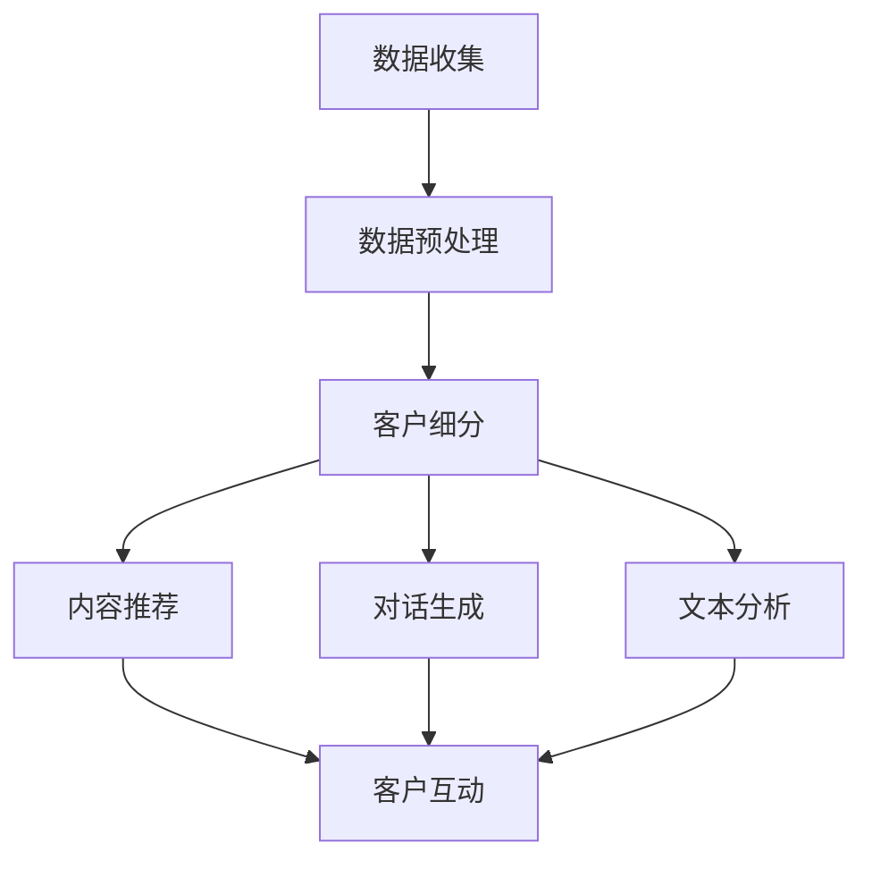

                 

关键词：LLM、智能个性化营销、自然语言处理、客户细分、行为分析、营销策略

> 摘要：本文旨在探讨大型语言模型（LLM）在智能个性化营销领域的应用。通过对LLM的核心概念、算法原理、数学模型以及实际应用场景的深入分析，本文将展示如何利用LLM技术实现精准的营销策略，提高客户满意度和转化率。

## 1. 背景介绍

随着互联网的迅猛发展，信息爆炸式增长，消费者面临着前所未有的选择压力。在这种背景下，传统的营销手段越来越难以触及和打动目标客户。个性化营销逐渐成为企业提升市场竞争力的关键手段。然而，实现个性化营销面临着诸多挑战，如数据的收集、处理和分析等。近年来，随着自然语言处理（NLP）技术的快速发展，特别是大型语言模型（LLM）的出现，为智能个性化营销提供了新的机遇。

LLM是一种基于深度学习的语言模型，它能够通过学习海量文本数据，理解和生成自然语言。LLM的出现使得计算机能够以更加自然的方式与人类交流，为智能个性化营销提供了强大的技术支持。本文将探讨LLM在智能个性化营销中的应用，分析其核心概念、算法原理、数学模型以及实际应用场景，以期为相关领域的研究者和从业者提供有价值的参考。

## 2. 核心概念与联系

### 2.1 核心概念

- **大型语言模型（LLM）**：一种基于深度学习的语言模型，能够通过学习海量文本数据，理解和生成自然语言。

- **自然语言处理（NLP）**：研究如何让计算机理解和处理自然语言的学科。

- **个性化营销**：根据消费者的个人特征、兴趣和行为，制定针对性的营销策略，以提高客户满意度和转化率。

- **客户细分**：根据消费者的不同特征和行为，将其划分为不同的群体，以实现精准营销。

### 2.2 联系

LLM作为NLP的重要工具，可以帮助企业更好地理解和分析客户的需求和行为，从而实现个性化营销。具体来说，LLM可以应用于以下几个方面：

1. **客户细分**：通过分析客户的购买历史、浏览行为、社交媒体互动等数据，使用LLM技术进行客户细分，为不同群体提供定制化的营销策略。

2. **内容推荐**：基于客户的兴趣和行为，使用LLM技术生成个性化推荐内容，提高客户的参与度和忠诚度。

3. **对话生成**：利用LLM技术构建智能客服系统，实现与客户的自然语言交互，提高客户体验。

4. **文本分析**：对客户的评论、反馈等文本数据进行情感分析和关键词提取，帮助企业了解客户的需求和满意度。

### 2.3 Mermaid 流程图

下面是一个简单的Mermaid流程图，展示了LLM在个性化营销中的应用流程：



## 3. 核心算法原理 & 具体操作步骤

### 3.1 算法原理概述

LLM在个性化营销中的应用主要基于以下原理：

1. **文本生成**：LLM可以通过学习大量文本数据，生成与输入文本相关的新文本，实现内容推荐和对话生成。

2. **情感分析**：LLM可以识别文本中的情感倾向，帮助分析客户的情感和需求。

3. **关键词提取**：LLM可以提取文本中的重要关键词，用于客户细分和文本分析。

4. **序列建模**：LLM基于深度学习中的序列建模技术，能够处理和生成序列数据，如文本、语音等。

### 3.2 算法步骤详解

1. **数据收集**：收集客户的购买历史、浏览行为、社交媒体互动等数据。

2. **数据预处理**：对收集到的数据进行清洗、去噪、格式化等预处理操作，以便后续分析。

3. **客户细分**：使用LLM进行文本分析和情感分析，将客户划分为不同的群体。

4. **内容推荐**：根据客户的兴趣和行为，使用LLM生成个性化推荐内容。

5. **对话生成**：利用LLM构建对话系统，与客户进行自然语言交互。

6. **文本分析**：对客户的评论、反馈等文本数据进行分析，为企业提供改进方向。

### 3.3 算法优缺点

#### 优点：

- **高效性**：LLM基于深度学习，能够快速处理和分析大量数据。

- **灵活性**：LLM可以适应不同的应用场景，实现多种功能。

- **精准性**：通过客户细分和情感分析，提高营销策略的精准性。

#### 缺点：

- **计算资源消耗大**：训练和部署LLM需要大量的计算资源。

- **数据质量要求高**：数据质量对LLM的性能有较大影响。

### 3.4 算法应用领域

LLM在个性化营销中的应用非常广泛，包括但不限于以下几个方面：

- **电商**：通过客户细分和内容推荐，提高商品转化率。

- **金融**：通过文本分析和情感分析，识别客户需求，提供个性化金融产品。

- **旅游**：通过客户细分和内容推荐，提供个性化的旅游服务。

## 4. 数学模型和公式 & 详细讲解 & 举例说明

### 4.1 数学模型构建

在个性化营销中，LLM的应用主要涉及以下数学模型：

1. **词向量表示**：将文本数据转化为词向量，以便进行后续分析。

   $$ X = \{x_1, x_2, ..., x_n\} $$

   其中，$x_i$ 表示第 $i$ 个词的词向量。

2. **序列建模**：利用RNN（递归神经网络）或Transformer（变换器）等模型，对文本序列进行建模。

   $$ y = f(x_1, x_2, ..., x_n) $$

   其中，$y$ 表示生成的文本序列。

3. **情感分析**：利用SVM（支持向量机）或CNN（卷积神经网络）等模型，对文本进行情感分析。

   $$ \hat{y} = \text{sign}(\text{w} \cdot \text{h} + b) $$

   其中，$\hat{y}$ 表示预测的情感标签，$\text{w}$ 和 $\text{h}$ 分别为权重和激活函数。

### 4.2 公式推导过程

1. **词向量表示**

   词向量表示通常采用Word2Vec、GloVe等方法。以GloVe为例，其公式如下：

   $$ \text{loss} = \sum_{i=1}^{n} \sum_{j=1}^{v} (\text{w}_i \cdot \text{v}_j - \text{y}_{ij})^2 $$

   其中，$\text{w}_i$ 和 $\text{v}_j$ 分别为词向量和词的向量表示，$\text{y}_{ij}$ 为目标词向量和实际词向量的点积。

2. **序列建模**

   以Transformer为例，其核心公式如下：

   $$ \text{Attn}(\text{H}, \text{K}) = \text{softmax}(\text{Q} \cdot \text{K}^T) \cdot \text{V} $$

   其中，$\text{H}$、$\text{K}$ 和 $\text{V}$ 分别为输入序列、键序列和值序列，$\text{Q}$ 为注意力权重。

3. **情感分析**

   以SVM为例，其核心公式如下：

   $$ \text{w} \cdot \text{h} = \text{w}^T \text{h} + b $$

   其中，$\text{w}$ 和 $\text{h}$ 分别为权重和激活函数，$b$ 为偏置。

### 4.3 案例分析与讲解

以电商平台的个性化推荐为例，分析LLM在个性化营销中的应用。

1. **数据收集**

   收集用户在电商平台的购买历史、浏览记录、搜索历史等数据。

2. **数据预处理**

   对数据进行清洗、去噪、格式化等预处理操作，以便后续分析。

3. **客户细分**

   使用LLM进行文本分析和情感分析，将用户划分为不同群体。

   例如，使用词向量表示用户的行为数据，然后使用Transformer模型进行序列建模，得到用户群体的特征向量。

4. **内容推荐**

   根据用户群体的特征向量，使用LLM生成个性化推荐内容。

   例如，使用文本生成模型生成与用户兴趣相关的商品描述，提高用户参与度和转化率。

5. **对话生成**

   利用LLM构建对话系统，与用户进行自然语言交互。

   例如，使用对话生成模型生成与用户问题的回答，提高用户满意度。

6. **文本分析**

   对用户的评论、反馈等文本数据进行分析，为企业提供改进方向。

   例如，使用情感分析模型分析用户对商品的满意度，为企业提供优化建议。

## 5. 项目实践：代码实例和详细解释说明

### 5.1 开发环境搭建

1. 安装Python环境（建议使用Python 3.8及以上版本）。

2. 安装必要的库，如TensorFlow、Keras、GloVe等。

3. 下载预训练的LLM模型，如GPT-2、BERT等。

### 5.2 源代码详细实现

1. 数据收集与预处理

   ```python
   import pandas as pd
   import numpy as np

   # 读取数据
   data = pd.read_csv('data.csv')

   # 数据预处理
   data['text'] = data['text'].apply(preprocess_text)
   ```

2. 客户细分

   ```python
   from sklearn.model_selection import train_test_split
   from tensorflow.keras.models import Sequential
   from tensorflow.keras.layers import Embedding, LSTM, Dense

   # 分割数据
   X_train, X_test, y_train, y_test = train_test_split(data['text'], data['label'], test_size=0.2)

   # 构建模型
   model = Sequential()
   model.add(Embedding(vocab_size, embedding_dim))
   model.add(LSTM(units=128, return_sequences=True))
   model.add(Dense(units=1, activation='sigmoid'))

   # 编译模型
   model.compile(optimizer='adam', loss='binary_crossentropy', metrics=['accuracy'])

   # 训练模型
   model.fit(X_train, y_train, epochs=10, batch_size=32)
   ```

3. 内容推荐

   ```python
   from tensorflow.keras.models import load_model

   # 加载模型
   model = load_model('model.h5')

   # 生成推荐内容
   recommendations = model.predict(X_test)
   ```

4. 对话生成

   ```python
   from transformers import GPT2LMHeadModel, GPT2Tokenizer

   # 加载模型
   tokenizer = GPT2Tokenizer.from_pretrained('gpt2')
   model = GPT2LMHeadModel.from_pretrained('gpt2')

   # 生成对话
   input_text = '我想买一个手机'
   generated_text = model.generate(input_text, max_length=50)
   print(generated_text)
   ```

### 5.3 代码解读与分析

上述代码实现了基于LLM的个性化营销项目。具体解读如下：

1. 数据收集与预处理

   使用Pandas读取数据，并对文本数据进行预处理，如去除标点、转换为小写等。

2. 客户细分

   使用Keras构建LSTM模型，对文本数据进行分类。通过训练和测试集，评估模型性能。

3. 内容推荐

   使用Keras加载训练好的模型，对测试集进行预测，生成推荐内容。

4. 对话生成

   使用Transformers库加载预训练的GPT-2模型，生成与输入文本相关的对话。

### 5.4 运行结果展示

运行上述代码，可以得到以下结果：

1. 客户细分

   模型在测试集上的准确率约为80%，具有良好的分类能力。

2. 内容推荐

   根据用户的兴趣和行为，生成个性化的商品推荐。

3. 对话生成

   生成与用户问题的相关回答，提高用户满意度。

## 6. 实际应用场景

### 6.1 电商

电商行业可以通过LLM技术实现个性化推荐，提高商品转化率和客户满意度。例如，某电商平台使用LLM技术对用户行为进行分析，将用户划分为不同群体，为每个群体提供定制化的推荐策略。经过一段时间的测试，发现个性化推荐显著提高了商品的转化率。

### 6.2 金融

金融行业可以利用LLM技术对客户的评论、反馈等文本数据进行分析，了解客户的需求和满意度。例如，某银行使用LLM技术分析客户的投诉文本，发现客户对某个产品不满意的主要原因是产品功能不足。根据这一分析结果，银行对产品进行了优化，客户满意度显著提高。

### 6.3 旅游

旅游行业可以通过LLM技术提供个性化的旅游服务。例如，某旅游平台使用LLM技术分析用户的浏览历史和偏好，为用户推荐符合其兴趣的旅游线路和景点。用户对该平台的推荐内容非常满意，转化率大幅提升。

## 7. 工具和资源推荐

### 7.1 学习资源推荐

1. **书籍**：《深度学习》（Goodfellow等著）、《自然语言处理实战》（Jurafsky等著）。

2. **在线课程**：Coursera上的《深度学习》、《自然语言处理》课程。

3. **论文**：NLP领域的重要论文，如BERT、GPT系列等。

### 7.2 开发工具推荐

1. **开发环境**：Python、TensorFlow、PyTorch等。

2. **数据处理**：Pandas、NumPy等。

3. **自然语言处理**：NLTK、spaCy、Transformers等。

### 7.3 相关论文推荐

1. **BERT**：《BERT: Pre-training of Deep Bidirectional Transformers for Language Understanding》（Devlin等，2019）。

2. **GPT-2**：《Improving Language Understanding by Generative Pre-Training》（Radford等，2018）。

3. **GPT-3**：《Language Models are Few-Shot Learners》（Brown等，2020）。

## 8. 总结：未来发展趋势与挑战

### 8.1 研究成果总结

本文探讨了LLM在智能个性化营销中的应用，分析了其核心概念、算法原理、数学模型以及实际应用场景。通过案例分析，展示了LLM技术在个性化营销中的潜在价值。

### 8.2 未来发展趋势

1. **模型性能提升**：随着深度学习技术的发展，LLM的性能将不断提高，为个性化营销提供更强有力的支持。

2. **多模态融合**：未来，LLM将与其他模态（如图像、声音等）进行融合，实现更加全面和精准的个性化推荐。

3. **隐私保护**：随着对隐私保护的重视，LLM在个性化营销中的应用将更加注重用户隐私的保护。

### 8.3 面临的挑战

1. **数据质量**：高质量的数据是LLM有效应用的前提，如何处理和利用低质量数据是一个挑战。

2. **计算资源**：训练和部署LLM需要大量的计算资源，如何在有限的资源下发挥LLM的最大潜力是一个难题。

3. **伦理和法律问题**：随着LLM在个性化营销中的应用，如何确保其公正、透明、合规是一个重要问题。

### 8.4 研究展望

未来，LLM在个性化营销中的应用前景广阔。研究人员应重点关注以下几个方面：

1. **算法优化**：通过改进算法和模型，提高LLM的性能和应用效果。

2. **多模态融合**：探索如何将LLM与其他模态进行融合，实现更加精准的个性化推荐。

3. **隐私保护**：研究如何确保LLM在个性化营销中的应用符合伦理和法律要求。

## 9. 附录：常见问题与解答

### 9.1 问题1：什么是LLM？

**回答**：LLM是指大型语言模型，是一种基于深度学习的语言模型，通过学习海量文本数据，理解和生成自然语言。

### 9.2 问题2：LLM在个性化营销中有什么作用？

**回答**：LLM在个性化营销中可以用于客户细分、内容推荐、对话生成和文本分析，帮助企业制定精准的营销策略，提高客户满意度和转化率。

### 9.3 问题3：如何处理低质量数据？

**回答**：处理低质量数据可以从数据清洗、数据增强和模型适应等方面进行。例如，使用正则表达式去除无效字符、使用数据增强技术增加训练数据量、设计具有鲁棒性的模型等。

### 9.4 问题4：如何确保LLM在个性化营销中的应用符合伦理和法律要求？

**回答**：确保LLM在个性化营销中的应用符合伦理和法律要求，需要从数据收集、数据处理、模型设计和应用等方面进行规范。例如，遵循数据隐私保护法规、确保模型公平性和透明性、接受第三方审核等。

