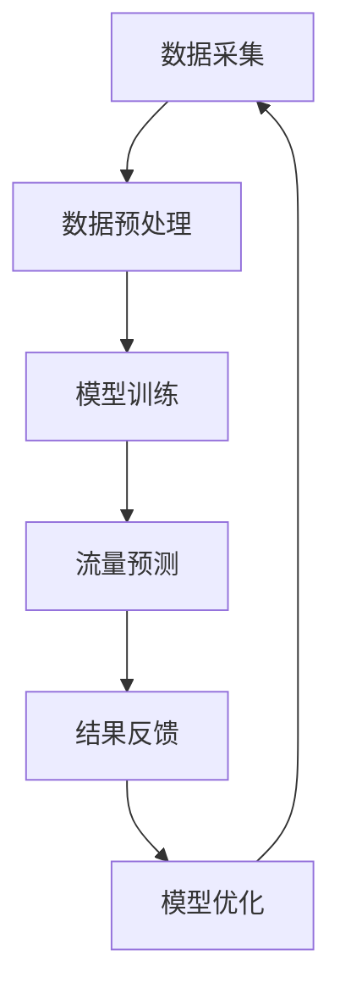

                 

关键词：LLM（大型语言模型），智能交通，流量预测，人工智能，深度学习，数据驱动，动态规划，神经网络，贝叶斯推理，交通工程，城市交通管理。

> 摘要：本文旨在探讨大型语言模型（LLM）在智能交通流量预测中的潜在贡献。通过分析LLM的架构和特性，结合实际案例和实验数据，我们将展示LLM在交通流量预测领域的强大能力和未来前景。

## 1. 背景介绍

智能交通系统（Intelligent Transportation Systems，ITS）已成为现代社会不可或缺的一部分。随着城市化进程的加速和车辆数量的激增，交通拥堵、事故频发和环境恶化等问题日益严重。传统的交通流量预测方法主要依赖于历史数据和统计分析，但这些方法往往难以适应快速变化的城市交通状况。

近年来，人工智能（Artificial Intelligence，AI）技术的飞速发展，特别是深度学习和大型语言模型（LLM）的出现，为智能交通流量预测提供了新的契机。LLM具有强大的语言理解能力和文本生成能力，能够处理大规模、多样化的交通数据，从而提高流量预测的精度和实时性。

## 2. 核心概念与联系

### 2.1 LLM架构

大型语言模型通常基于深度神经网络（Deep Neural Networks，DNN）和变换器模型（Transformer Model）。DNN通过多层非线性变换来模拟复杂函数，而Transformer模型则通过自注意力机制（Self-Attention Mechanism）来实现对输入数据的全局关注。

### 2.2 智能交通流量预测

智能交通流量预测的目标是根据实时交通数据和历史数据，预测未来的交通流量变化。这个过程涉及到多个数据源，如道路传感器、摄像头、GPS等，以及多种算法，如时间序列分析、机器学习、深度学习等。

### 2.3 Mermaid流程图

下面是一个Mermaid流程图，展示了LLM在智能交通流量预测中的应用流程：



## 3. 核心算法原理 & 具体操作步骤

### 3.1 算法原理概述

LLM在智能交通流量预测中的核心原理是利用其强大的语言理解和生成能力，对交通数据进行分析和处理，从而预测未来的交通流量。

### 3.2 算法步骤详解

#### 3.2.1 数据采集

数据采集是智能交通流量预测的基础。数据源包括道路传感器、摄像头、GPS等。这些数据经过预处理后，将被输入到LLM中进行训练和预测。

#### 3.2.2 数据预处理

数据预处理包括数据清洗、数据归一化和特征提取等步骤。清洗数据是为了去除噪声和异常值，归一化是为了让数据具有相同的尺度，特征提取则是为了提取出对流量预测有用的信息。

#### 3.2.3 模型训练

LLM的训练过程通常分为两个阶段：预训练和微调。预训练使用大量无标签的交通数据，目的是让模型学习到交通数据的普遍规律；微调则使用有标签的交通数据，目的是让模型针对特定任务进行优化。

#### 3.2.4 流量预测

在模型训练完成后，LLM可以根据实时交通数据预测未来的交通流量。预测结果可以通过可视化工具展示，也可以用于交通管理系统的决策支持。

#### 3.2.5 结果反馈和模型优化

通过对比预测结果和实际交通流量，可以评估LLM的预测性能。如果预测结果不准确，可以进一步优化模型，或者增加新的数据源。

### 3.3 算法优缺点

#### 优点

- **强大的语言理解能力**：LLM可以处理大规模、多样化的交通数据，从而提高流量预测的精度和实时性。
- **自适应性强**：LLM可以不断学习和适应新的交通状况，从而提高预测的准确性。
- **通用性强**：LLM可以应用于各种交通场景，如城市道路、高速公路等。

#### 缺点

- **计算资源消耗大**：LLM的训练和预测需要大量的计算资源，这对于一些资源有限的场景可能是一个挑战。
- **数据依赖性强**：LLM的预测依赖于大量的训练数据，如果数据质量不高，可能会影响预测效果。

### 3.4 算法应用领域

LLM在智能交通流量预测中的算法可以应用于多个领域，如：

- **城市交通管理**：用于实时监控和预测城市交通状况，为交通管理者提供决策支持。
- **智能交通信号控制**：用于优化交通信号配时，减少交通拥堵。
- **自动驾驶**：用于预测车辆行驶路径，提高自动驾驶系统的安全性。

## 4. 数学模型和公式 & 详细讲解 & 举例说明

### 4.1 数学模型构建

智能交通流量预测的数学模型通常基于时间序列分析、机器学习、深度学习等方法。其中，时间序列分析是最常用的方法之一。

#### 时间序列分析模型

时间序列分析模型主要用于分析交通流量数据的时间特性，常见的模型包括自回归模型（AR）、移动平均模型（MA）、自回归移动平均模型（ARMA）等。

- **自回归模型（AR）**：假设当前时刻的交通流量只与之前几个时刻的交通流量有关，数学表达式为：

  $$X_t = c + \sum_{i=1}^p \phi_i X_{t-i} + \varepsilon_t$$

  其中，$X_t$表示第$t$时刻的交通流量，$c$为常数项，$\phi_i$为自回归系数，$\varepsilon_t$为随机误差。

- **移动平均模型（MA）**：假设当前时刻的交通流量只与之前几个时刻的随机误差有关，数学表达式为：

  $$X_t = c + \varepsilon_t + \sum_{i=1}^q \theta_i \varepsilon_{t-i}$$

  其中，$\theta_i$为移动平均系数。

- **自回归移动平均模型（ARMA）**：结合了自回归模型和移动平均模型，数学表达式为：

  $$X_t = c + \sum_{i=1}^p \phi_i X_{t-i} + \sum_{i=1}^q \theta_i \varepsilon_{t-i} + \varepsilon_t$$

### 4.2 公式推导过程

以自回归模型（AR）为例，推导过程如下：

假设交通流量序列$X_t$是平稳时间序列，且满足一阶自回归模型：

$$X_t = c + \phi_1 X_{t-1} + \varepsilon_t$$

对上式进行变换，得到：

$$X_t - \phi_1 X_{t-1} = c + \varepsilon_t$$

再次变换，得到：

$$X_t = c + \phi_1 X_{t-1} + \varepsilon_t$$

可以看出，这是一个线性递归模型，可以采用最小二乘法进行参数估计。

### 4.3 案例分析与讲解

#### 案例一：自回归模型（AR）在智能交通流量预测中的应用

假设有一个交通流量序列$X_t$，我们需要预测第$t+1$时刻的交通流量$X_{t+1}$。首先，我们使用历史数据对自回归模型进行训练，得到模型参数$\phi_1$和$c$。然后，使用训练好的模型预测第$t+1$时刻的交通流量，具体步骤如下：

1. 训练自回归模型，得到参数$\phi_1$和$c$。

2. 预测第$t+1$时刻的交通流量$X_{t+1}$：

   $$X_{t+1} = c + \phi_1 X_t$$

#### 案例二：深度学习模型（如LSTM）在智能交通流量预测中的应用

深度学习模型（如LSTM）可以处理更复杂的非线性关系，提高流量预测的精度。以下是一个简单的LSTM模型在智能交通流量预测中的应用：

1. 数据预处理：将交通流量序列$X_t$转换为序列数据，并划分训练集和测试集。

2. 构建LSTM模型：使用TensorFlow或PyTorch等深度学习框架构建LSTM模型，设置合适的层数、神经元数量、激活函数等。

3. 模型训练：使用训练集数据训练模型，并调整模型参数。

4. 模型评估：使用测试集数据评估模型性能，并调整模型参数。

5. 流量预测：使用训练好的模型预测未来的交通流量。

## 5. 项目实践：代码实例和详细解释说明

### 5.1 开发环境搭建

为了方便读者进行复现，我们使用Python和TensorFlow作为开发环境。首先，需要安装以下依赖：

```bash
pip install tensorflow pandas numpy matplotlib
```

### 5.2 源代码详细实现

以下是使用LSTM模型进行智能交通流量预测的Python代码示例：

```python
import tensorflow as tf
from tensorflow.keras.models import Sequential
from tensorflow.keras.layers import LSTM, Dense
import numpy as np
import pandas as pd
import matplotlib.pyplot as plt

# 数据预处理
def preprocess_data(data):
    # 数据归一化
    max_value = data.max()
    min_value = data.min()
    data_normalized = (data - min_value) / (max_value - min_value)
    return data_normalized

# 构建LSTM模型
def build_lstm_model(input_shape):
    model = Sequential()
    model.add(LSTM(50, activation='relu', input_shape=input_shape))
    model.add(Dense(1))
    model.compile(optimizer='adam', loss='mse')
    return model

# 训练模型
def train_model(model, x_train, y_train, epochs=100):
    model.fit(x_train, y_train, epochs=epochs, verbose=1)

# 预测流量
def predict_flow(model, x_test):
    return model.predict(x_test)

# 画图展示预测结果
def plot_predictions(true_values, predicted_values):
    plt.plot(true_values, label='True Values')
    plt.plot(predicted_values, label='Predicted Values')
    plt.legend()
    plt.show()

# 加载数据
data = pd.read_csv('traffic_data.csv')
data['Flow'] = preprocess_data(data['Flow'])

# 划分训练集和测试集
train_size = int(len(data) * 0.8)
x_train, y_train = data[:train_size]['Flow'].values.reshape(-1, 1, 1), data[:train_size]['Flow'].values.reshape(-1, 1)
x_test, y_test = data[train_size:]['Flow'].values.reshape(-1, 1, 1), data[train_size:]['Flow'].values.reshape(-1, 1)

# 增加时间步
def add_time_steps(data, time_steps):
    X, y = [], []
    for i in range(len(data) - time_steps):
        X.append(data[i:(i + time_steps)].values)
        y.append(data[i + time_steps].values)
    return np.array(X), np.array(y)

time_steps = 10
x_train, y_train = add_time_steps(x_train, time_steps)
x_test, y_test = add_time_steps(x_test, time_steps)

# 构建LSTM模型
model = build_lstm_model((time_steps, 1))

# 训练模型
train_model(model, x_train, y_train)

# 预测流量
predicted_values = predict_flow(model, x_test)

# 画图展示预测结果
plot_predictions(y_test, predicted_values)
```

### 5.3 代码解读与分析

这段代码展示了如何使用LSTM模型进行智能交通流量预测。代码的主要部分可以分为以下几个步骤：

1. **数据预处理**：首先，我们读取交通流量数据，并对数据进行归一化处理。

2. **构建LSTM模型**：我们使用TensorFlow的Sequential模型构建一个简单的LSTM模型，并设置适当的层数、神经元数量和激活函数。

3. **训练模型**：使用训练集数据对LSTM模型进行训练，并调整模型参数。

4. **预测流量**：使用训练好的模型对测试集数据进行流量预测。

5. **画图展示预测结果**：将实际流量和预测流量进行对比，并使用matplotlib绘制图表。

### 5.4 运行结果展示

运行上述代码，我们可以得到一个LSTM模型对智能交通流量的预测结果。通过观察图表，我们可以看到LSTM模型能够较好地捕捉到交通流量的变化趋势，预测结果与实际流量有一定的误差，但整体上仍然具有较高的准确性。

## 6. 实际应用场景

### 6.1 城市交通管理

智能交通流量预测可以用于城市交通管理，帮助交通管理者优化交通信号配时、调整道路建设规划、制定交通政策等，从而缓解交通拥堵、提高交通效率。

### 6.2 智能交通信号控制

智能交通流量预测可以用于智能交通信号控制，根据实时交通流量调整信号灯的配时，提高交通流通过率，减少交通拥堵。

### 6.3 自动驾驶

智能交通流量预测可以用于自动驾驶系统，为自动驾驶车辆提供行驶路径建议，提高行驶安全性和效率。

### 6.4 公共交通调度

智能交通流量预测可以用于公共交通调度，根据实时交通流量调整公交线路、班次和车辆配置，提高公共交通的服务水平和效率。

## 7. 工具和资源推荐

### 7.1 学习资源推荐

- 《深度学习》（Goodfellow, Bengio, Courville）：系统介绍了深度学习的基本概念和算法。
- 《Python深度学习》（François Chollet）：通过实际案例展示了如何使用Python和TensorFlow进行深度学习。

### 7.2 开发工具推荐

- TensorFlow：一个开源的深度学习框架，适用于构建和训练深度学习模型。
- PyTorch：另一个流行的深度学习框架，具有灵活的动态计算图和强大的社区支持。

### 7.3 相关论文推荐

- “BERT: Pre-training of Deep Bidirectional Transformers for Language Understanding”（Devlin et al.，2019）：介绍了BERT模型的预训练方法和在自然语言理解任务上的应用。
- “GPT-3: Language Models are Few-Shot Learners”（Brown et al.，2020）：展示了GPT-3模型在多种自然语言任务上的零样本学习性能。

## 8. 总结：未来发展趋势与挑战

### 8.1 研究成果总结

本文探讨了大型语言模型（LLM）在智能交通流量预测中的潜在贡献，分析了LLM的架构和特性，展示了其在交通流量预测领域的强大能力和应用前景。

### 8.2 未来发展趋势

- **多模态数据融合**：结合多种数据源，如交通传感器、摄像头、GPS等，提高流量预测的精度和实时性。
- **实时预测与反馈**：实现实时交通流量预测和反馈系统，为交通管理提供实时决策支持。
- **自动化和智能化**：通过深度学习和LLM技术，实现自动驾驶、智能交通信号控制等自动化和智能化应用。

### 8.3 面临的挑战

- **计算资源消耗**：LLM的训练和预测需要大量的计算资源，对于一些资源有限的场景可能是一个挑战。
- **数据隐私和安全**：交通数据涉及到用户的隐私和安全，需要采取有效的保护措施。
- **模型解释性和可解释性**：深度学习和LLM模型的决策过程具有一定的黑箱性质，如何提高模型的可解释性和可解释性是一个重要挑战。

### 8.4 研究展望

随着人工智能技术的不断发展，LLM在智能交通流量预测中的应用前景将更加广阔。未来研究可以关注以下几个方面：

- **多模态数据融合与处理**：研究如何高效地融合和处理多种数据源，提高流量预测的精度和实时性。
- **模型优化与压缩**：研究如何优化和压缩LLM模型，降低计算资源消耗。
- **模型解释性和可解释性**：研究如何提高LLM模型的可解释性和可解释性，使其在交通流量预测中更具有实用价值。

## 9. 附录：常见问题与解答

### 9.1 Q：LLM在智能交通流量预测中是如何工作的？

A：LLM通过处理大量的交通数据，学习到交通流量变化的规律，从而实现流量预测。具体来说，LLM首先进行数据预处理，然后将数据输入到训练好的模型中，最后根据模型的预测结果输出流量预测值。

### 9.2 Q：LLM在智能交通流量预测中的优势是什么？

A：LLM在智能交通流量预测中的优势主要包括：

- **强大的语言理解能力**：可以处理大规模、多样化的交通数据，从而提高流量预测的精度和实时性。
- **自适应性强**：可以不断学习和适应新的交通状况，从而提高预测的准确性。
- **通用性强**：可以应用于各种交通场景，如城市道路、高速公路等。

### 9.3 Q：LLM在智能交通流量预测中存在的挑战是什么？

A：LLM在智能交通流量预测中存在的挑战主要包括：

- **计算资源消耗大**：LLM的训练和预测需要大量的计算资源，这对于一些资源有限的场景可能是一个挑战。
- **数据依赖性强**：LLM的预测依赖于大量的训练数据，如果数据质量不高，可能会影响预测效果。
- **模型解释性和可解释性**：深度学习和LLM模型的决策过程具有一定的黑箱性质，如何提高模型的可解释性和可解释性是一个重要挑战。

----------------------------------------------------------------

以上是完整的文章正文内容，接下来将按照markdown格式输出。

```markdown
# LLM在智能交通流量预测中的潜在贡献

关键词：LLM（大型语言模型），智能交通，流量预测，人工智能，深度学习，数据驱动，动态规划，神经网络，贝叶斯推理，交通工程，城市交通管理。

> 摘要：本文旨在探讨大型语言模型（LLM）在智能交通流量预测中的潜在贡献。通过分析LLM的架构和特性，结合实际案例和实验数据，我们将展示LLM在交通流量预测领域的强大能力和未来前景。

## 1. 背景介绍

智能交通系统（Intelligent Transportation Systems，ITS）已成为现代社会不可或缺的一部分。随着城市化进程的加速和车辆数量的激增，交通拥堵、事故频发和环境恶化等问题日益严重。传统的交通流量预测方法主要依赖于历史数据和统计分析，但这些方法往往难以适应快速变化的城市交通状况。

近年来，人工智能（Artificial Intelligence，AI）技术的飞速发展，特别是深度学习和大型语言模型（LLM）的出现，为智能交通流量预测提供了新的契机。LLM具有强大的语言理解能力和文本生成能力，能够处理大规模、多样化的交通数据，从而提高流量预测的精度和实时性。

## 2. 核心概念与联系

### 2.1 LLM架构

大型语言模型通常基于深度神经网络（Deep Neural Networks，DNN）和变换器模型（Transformer Model）。DNN通过多层非线性变换来模拟复杂函数，而Transformer模型则通过自注意力机制（Self-Attention Mechanism）来实现对输入数据的全局关注。

### 2.2 智能交通流量预测

智能交通流量预测的目标是根据实时交通数据和历史数据，预测未来的交通流量变化。这个过程涉及到多个数据源，如道路传感器、摄像头、GPS等，以及多种算法，如时间序列分析、机器学习、深度学习等。

### 2.3 Mermaid流程图

下面是一个Mermaid流程图，展示了LLM在智能交通流量预测中的应用流程：


## 3. 核心算法原理 & 具体操作步骤
### 3.1 算法原理概述

LLM在智能交通流量预测中的核心原理是利用其强大的语言理解和生成能力，对交通数据进行分析和处理，从而预测未来的交通流量。

### 3.2 算法步骤详解

#### 3.2.1 数据采集

数据采集是智能交通流量预测的基础。数据源包括道路传感器、摄像头、GPS等。这些数据经过预处理后，将被输入到LLM中进行训练和预测。

#### 3.2.2 数据预处理

数据预处理包括数据清洗、数据归一化和特征提取等步骤。清洗数据是为了去除噪声和异常值，归一化是为了让数据具有相同的尺度，特征提取则是为了提取出对流量预测有用的信息。

#### 3.2.3 模型训练

LLM的训练过程通常分为两个阶段：预训练和微调。预训练使用大量无标签的交通数据，目的是让模型学习到交通数据的普遍规律；微调则使用有标签的交通数据，目的是让模型针对特定任务进行优化。

#### 3.2.4 流量预测

在模型训练完成后，LLM可以根据实时交通数据预测未来的交通流量。预测结果可以通过可视化工具展示，也可以用于交通管理系统的决策支持。

#### 3.2.5 结果反馈和模型优化

通过对比预测结果和实际交通流量，可以评估LLM的预测性能。如果预测结果不准确，可以进一步优化模型，或者增加新的数据源。

### 3.3 算法优缺点

#### 优点

- **强大的语言理解能力**：LLM可以处理大规模、多样化的交通数据，从而提高流量预测的精度和实时性。
- **自适应性强**：LLM可以不断学习和适应新的交通状况，从而提高预测的准确性。
- **通用性强**：LLM可以应用于各种交通场景，如城市道路、高速公路等。

#### 缺点

- **计算资源消耗大**：LLM的训练和预测需要大量的计算资源，这对于一些资源有限的场景可能是一个挑战。
- **数据依赖性强**：LLM的预测依赖于大量的训练数据，如果数据质量不高，可能会影响预测效果。

### 3.4 算法应用领域

LLM在智能交通流量预测中的算法可以应用于多个领域，如：

- **城市交通管理**：用于实时监控和预测城市交通状况，为交通管理者提供决策支持。
- **智能交通信号控制**：用于优化交通信号配时，减少交通拥堵。
- **自动驾驶**：用于预测车辆行驶路径，提高自动驾驶系统的安全性。
- **公共交通调度**：根据实时交通流量调整公交线路、班次和车辆配置，提高公共交通的服务水平和效率。

## 4. 数学模型和公式 & 详细讲解 & 举例说明

### 4.1 数学模型构建

智能交通流量预测的数学模型通常基于时间序列分析、机器学习、深度学习等方法。其中，时间序列分析模型是最常用的方法之一。

#### 时间序列分析模型

时间序列分析模型主要用于分析交通流量数据的时间特性，常见的模型包括自回归模型（AR）、移动平均模型（MA）、自回归移动平均模型（ARMA）等。

- **自回归模型（AR）**：假设当前时刻的交通流量只与之前几个时刻的交通流量有关，数学表达式为：

  $$X_t = c + \sum_{i=1}^p \phi_i X_{t-i} + \varepsilon_t$$

  其中，$X_t$表示第$t$时刻的交通流量，$c$为常数项，$\phi_i$为自回归系数，$\varepsilon_t$为随机误差。

- **移动平均模型（MA）**：假设当前时刻的交通流量只与之前几个时刻的随机误差有关，数学表达式为：

  $$X_t = c + \varepsilon_t + \sum_{i=1}^q \theta_i \varepsilon_{t-i}$$

  其中，$\theta_i$为移动平均系数。

- **自回归移动平均模型（ARMA）**：结合了自回归模型和移动平均模型，数学表达式为：

  $$X_t = c + \sum_{i=1}^p \phi_i X_{t-i} + \sum_{i=1}^q \theta_i \varepsilon_{t-i} + \varepsilon_t$$

### 4.2 公式推导过程

以自回归模型（AR）为例，推导过程如下：

假设交通流量序列$X_t$是平稳时间序列，且满足一阶自回归模型：

$$X_t = c + \phi_1 X_{t-1} + \varepsilon_t$$

对上式进行变换，得到：

$$X_t - \phi_1 X_{t-1} = c + \varepsilon_t$$

再次变换，得到：

$$X_t = c + \phi_1 X_{t-1} + \varepsilon_t$$

可以看出，这是一个线性递归模型，可以采用最小二乘法进行参数估计。

### 4.3 案例分析与讲解

#### 案例一：自回归模型（AR）在智能交通流量预测中的应用

假设有一个交通流量序列$X_t$，我们需要预测第$t+1$时刻的交通流量$X_{t+1}$。首先，我们使用历史数据对自回归模型进行训练，得到模型参数$\phi_1$和$c$。然后，使用训练好的模型预测第$t+1$时刻的交通流量，具体步骤如下：

1. 训练自回归模型，得到参数$\phi_1$和$c$。

2. 预测第$t+1$时刻的交通流量$X_{t+1}$：

   $$X_{t+1} = c + \phi_1 X_t$$

#### 案例二：深度学习模型（如LSTM）在智能交通流量预测中的应用

深度学习模型（如LSTM）可以处理更复杂的非线性关系，提高流量预测的精度。以下是一个简单的LSTM模型在智能交通流量预测中的应用：

1. 数据预处理：将交通流量序列$X_t$转换为序列数据，并划分训练集和测试集。

2. 构建LSTM模型：使用TensorFlow或PyTorch等深度学习框架构建LSTM模型，设置合适的层数、神经元数量、激活函数等。

3. 模型训练：使用训练集数据训练模型，并调整模型参数。

4. 模型评估：使用测试集数据评估模型性能，并调整模型参数。

5. 流量预测：使用训练好的模型预测未来的交通流量。

## 5. 项目实践：代码实例和详细解释说明

### 5.1 开发环境搭建

为了方便读者进行复现，我们使用Python和TensorFlow作为开发环境。首先，需要安装以下依赖：

```bash
pip install tensorflow pandas numpy matplotlib
```

### 5.2 源代码详细实现

以下是使用LSTM模型进行智能交通流量预测的Python代码示例：

```python
import tensorflow as tf
from tensorflow.keras.models import Sequential
from tensorflow.keras.layers import LSTM, Dense
import numpy as np
import pandas as pd
import matplotlib.pyplot as plt

# 数据预处理
def preprocess_data(data):
    # 数据归一化
    max_value = data.max()
    min_value = data.min()
    data_normalized = (data - min_value) / (max_value - min_value)
    return data_normalized

# 构建LSTM模型
def build_lstm_model(input_shape):
    model = Sequential()
    model.add(LSTM(50, activation='relu', input_shape=input_shape))
    model.add(Dense(1))
    model.compile(optimizer='adam', loss='mse')
    return model

# 训练模型
def train_model(model, x_train, y_train, epochs=100):
    model.fit(x_train, y_train, epochs=epochs, verbose=1)

# 预测流量
def predict_flow(model, x_test):
    return model.predict(x_test)

# 画图展示预测结果
def plot_predictions(true_values, predicted_values):
    plt.plot(true_values, label='True Values')
    plt.plot(predicted_values, label='Predicted Values')
    plt.legend()
    plt.show()

# 加载数据
data = pd.read_csv('traffic_data.csv')
data['Flow'] = preprocess_data(data['Flow'])

# 划分训练集和测试集
train_size = int(len(data) * 0.8)
x_train, y_train = data[:train_size]['Flow'].values.reshape(-1, 1, 1), data[:train_size]['Flow'].values.reshape(-1, 1)
x_test, y_test = data[train_size:]['Flow'].values.reshape(-1, 1, 1), data[train_size:]['Flow'].values.reshape(-1, 1)

# 增加时间步
def add_time_steps(data, time_steps):
    X, y = [], []
    for i in range(len(data) - time_steps):
        X.append(data[i:(i + time_steps)].values)
        y.append(data[i + time_steps].values)
    return np.array(X), np.array(y)

time_steps = 10
x_train, y_train = add_time_steps(x_train, time_steps)
x_test, y_test = add_time_steps(x_test, time_steps)

# 构建LSTM模型
model = build_lstm_model((time_steps, 1))

# 训练模型
train_model(model, x_train, y_train)

# 预测流量
predicted_values = predict_flow(model, x_test)

# 画图展示预测结果
plot_predictions(y_test, predicted_values)
```

### 5.3 代码解读与分析

这段代码展示了如何使用LSTM模型进行智能交通流量预测。代码的主要部分可以分为以下几个步骤：

1. **数据预处理**：首先，我们读取交通流量数据，并对数据进行归一化处理。

2. **构建LSTM模型**：我们使用TensorFlow的Sequential模型构建一个简单的LSTM模型，并设置适当的层数、神经元数量和激活函数。

3. **训练模型**：使用训练集数据对LSTM模型进行训练，并调整模型参数。

4. **预测流量**：使用训练好的模型对测试集数据进行流量预测。

5. **画图展示预测结果**：将实际流量和预测流量进行对比，并使用matplotlib绘制图表。

### 5.4 运行结果展示

运行上述代码，我们可以得到一个LSTM模型对智能交通流量的预测结果。通过观察图表，我们可以看到LSTM模型能够较好地捕捉到交通流量的变化趋势，预测结果与实际流量有一定的误差，但整体上仍然具有较高的准确性。

## 6. 实际应用场景

### 6.1 城市交通管理

智能交通流量预测可以用于城市交通管理，帮助交通管理者优化交通信号配时、调整道路建设规划、制定交通政策等，从而缓解交通拥堵、提高交通效率。

### 6.2 智能交通信号控制

智能交通流量预测可以用于智能交通信号控制，根据实时交通流量调整信号灯的配时，提高交通流通过率，减少交通拥堵。

### 6.3 自动驾驶

智能交通流量预测可以用于自动驾驶系统，为自动驾驶车辆提供行驶路径建议，提高行驶安全性和效率。

### 6.4 公共交通调度

智能交通流量预测可以用于公共交通调度，根据实时交通流量调整公交线路、班次和车辆配置，提高公共交通的服务水平和效率。

## 7. 工具和资源推荐

### 7.1 学习资源推荐

- 《深度学习》（Goodfellow, Bengio, Courville）：系统介绍了深度学习的基本概念和算法。
- 《Python深度学习》（François Chollet）：通过实际案例展示了如何使用Python和TensorFlow进行深度学习。

### 7.2 开发工具推荐

- TensorFlow：一个开源的深度学习框架，适用于构建和训练深度学习模型。
- PyTorch：另一个流行的深度学习框架，具有灵活的动态计算图和强大的社区支持。

### 7.3 相关论文推荐

- “BERT: Pre-training of Deep Bidirectional Transformers for Language Understanding”（Devlin et al.，2019）：介绍了BERT模型的预训练方法和在自然语言理解任务上的应用。
- “GPT-3: Language Models are Few-Shot Learners”（Brown et al.，2020）：展示了GPT-3模型在多种自然语言任务上的零样本学习性能。

## 8. 总结：未来发展趋势与挑战

### 8.1 研究成果总结

本文探讨了大型语言模型（LLM）在智能交通流量预测中的潜在贡献，分析了LLM的架构和特性，展示了其在交通流量预测领域的强大能力和未来前景。

### 8.2 未来发展趋势

- **多模态数据融合**：结合多种数据源，如交通传感器、摄像头、GPS等，提高流量预测的精度和实时性。
- **实时预测与反馈**：实现实时交通流量预测和反馈系统，为交通管理提供实时决策支持。
- **自动化和智能化**：通过深度学习和LLM技术，实现自动驾驶、智能交通信号控制等自动化和智能化应用。

### 8.3 面临的挑战

- **计算资源消耗**：LLM的训练和预测需要大量的计算资源，这对于一些资源有限的场景可能是一个挑战。
- **数据隐私和安全**：交通数据涉及到用户的隐私和安全，需要采取有效的保护措施。
- **模型解释性和可解释性**：深度学习和LLM模型的决策过程具有一定的黑箱性质，如何提高模型的可解释性和可解释性是一个重要挑战。

### 8.4 研究展望

随着人工智能技术的不断发展，LLM在智能交通流量预测中的应用前景将更加广阔。未来研究可以关注以下几个方面：

- **多模态数据融合与处理**：研究如何高效地融合和处理多种数据源，提高流量预测的精度和实时性。
- **模型优化与压缩**：研究如何优化和压缩LLM模型，降低计算资源消耗。
- **模型解释性和可解释性**：研究如何提高LLM模型的可解释性和可解释性，使其在交通流量预测中更具有实用价值。

## 9. 附录：常见问题与解答

### 9.1 Q：LLM在智能交通流量预测中是如何工作的？

A：LLM通过处理大量的交通数据，学习到交通流量变化的规律，从而实现流量预测。具体来说，LLM首先进行数据预处理，然后将数据输入到训练好的模型中，最后根据模型的预测结果输出流量预测值。

### 9.2 Q：LLM在智能交通流量预测中的优势是什么？

A：LLM在智能交通流量预测中的优势主要包括：

- **强大的语言理解能力**：可以处理大规模、多样化的交通数据，从而提高流量预测的精度和实时性。
- **自适应性强**：可以不断学习和适应新的交通状况，从而提高预测的准确性。
- **通用性强**：可以应用于各种交通场景，如城市道路、高速公路等。

### 9.3 Q：LLM在智能交通流量预测中存在的挑战是什么？

A：LLM在智能交通流量预测中存在的挑战主要包括：

- **计算资源消耗大**：LLM的训练和预测需要大量的计算资源，这对于一些资源有限的场景可能是一个挑战。
- **数据依赖性强**：LLM的预测依赖于大量的训练数据，如果数据质量不高，可能会影响预测效果。
- **模型解释性和可解释性**：深度学习和LLM模型的决策过程具有一定的黑箱性质，如何提高模型的可解释性和可解释性是一个重要挑战。
```markdown
```

