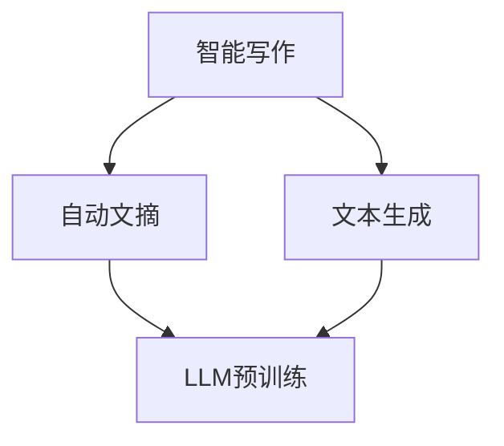

                 

关键词：大型语言模型，智能写作，自然语言处理，AI写作辅助，自动文摘，文本生成

>摘要：本文旨在探讨大型语言模型（LLM）在智能写作辅助领域的应用，通过梳理LLM的核心原理，介绍其在自动文摘、文本生成等任务中的具体操作步骤，并结合实际项目案例，阐述其在提高写作效率和创作质量方面的潜力与挑战。

## 1. 背景介绍

随着自然语言处理（NLP）技术的飞速发展，人工智能在各个领域取得了显著的成果。智能写作作为NLP的一个重要分支，近年来引起了广泛关注。从自动摘要到文本生成，智能写作的应用前景十分广阔。其中，大型语言模型（LLM）凭借其强大的表示和生成能力，成为了智能写作领域的重要工具。

LLM是一种基于深度学习的大型神经网络模型，通过在大量文本数据上进行预训练，LLM可以学习到文本的内在结构和语义关系。这种能力使得LLM在许多NLP任务中表现出色，如机器翻译、情感分析、问答系统等。智能写作作为LLM的一个重要应用场景，其潜力也得到了越来越多的研究者的关注。

## 2. 核心概念与联系

### 2.1 LLM的核心概念

LLM（Large Language Model）指的是一种大型语言模型，其核心思想是通过在大量文本数据上进行预训练，学习到文本的内在结构和语义关系。LLM的训练通常采用基于 Transformer 的架构，如 GPT、BERT 等。

### 2.2 LLM与智能写作的关系

智能写作涉及到自动文摘、文本生成、写作风格转换等任务。这些任务的核心都是生成符合人类语言习惯的文本。LLM凭借其强大的表示和生成能力，可以在这类任务中发挥重要作用。例如，在自动文摘任务中，LLM可以通过阅读大量文章，自动提取出关键信息，生成摘要文本。在文本生成任务中，LLM可以根据用户输入的少量信息，生成完整的文章。

### 2.3 Mermaid 流程图



## 3. 核心算法原理 & 具体操作步骤

### 3.1 算法原理概述

LLM的工作原理可以概括为两个阶段：预训练和微调。

1. **预训练**：在预训练阶段，LLM在大量文本数据上进行训练，学习到文本的内在结构和语义关系。这个过程通常采用基于 Transformer 的架构，如 GPT、BERT 等。
2. **微调**：在微调阶段，LLM根据具体任务的需求，对预训练模型进行调优。例如，在自动文摘任务中，可以通过微调让LLM学会如何提取关键信息并生成摘要。

### 3.2 算法步骤详解

1. **数据收集与预处理**：收集大量文本数据，并对数据进行预处理，包括分词、去除停用词、词性标注等。
2. **模型训练**：使用预处理后的数据，训练 LLM 模型。训练过程中，可以采用多种技术，如学习率调整、dropout、正则化等，以提高模型性能。
3. **模型评估**：使用测试集对训练好的模型进行评估，包括准确率、召回率、F1 值等指标。
4. **模型应用**：将训练好的模型应用到具体任务中，如自动文摘、文本生成等。

### 3.3 算法优缺点

**优点**：

- **强大的表示能力**：LLM 可以学习到文本的内在结构和语义关系，从而生成更加符合人类语言的文本。
- **广泛的适用性**：LLM 可以应用于多种NLP任务，如自动文摘、文本生成、问答系统等。

**缺点**：

- **计算资源需求高**：训练 LLM 模型需要大量的计算资源和时间。
- **数据依赖性较强**：LLM 的性能很大程度上取决于训练数据的质量和数量。

### 3.4 算法应用领域

LLM 在智能写作领域的应用前景十分广阔。具体包括：

- **自动文摘**：自动从大量文本中提取关键信息，生成摘要。
- **文本生成**：根据少量信息生成完整的文章。
- **写作风格转换**：将一种写作风格转换为另一种风格。
- **问答系统**：通过自然语言交互，为用户提供答案。

## 4. 数学模型和公式 & 详细讲解 & 举例说明

### 4.1 数学模型构建

LLM 的核心是 Transformer 模型，其数学模型可以概括为：

$$
\text{Transformer} = \text{Encoder} + \text{Decoder}
$$

其中，Encoder 和 Decoder 分别代表编码器和解码器。编码器负责将输入文本编码为固定长度的向量，解码器则根据编码器的输出和已生成的文本，生成新的文本。

### 4.2 公式推导过程

#### 编码器

编码器的工作流程如下：

$$
\text{Encoder}(x) = \text{Transformer}(\text{Embedding}(x))
$$

其中，Embedding 表示词向量层，用于将输入的文本转换为向量表示。Transformer 则是一个自注意力机制的网络，用于对输入向量进行编码。

#### 解码器

解码器的工作流程如下：

$$
\text{Decoder}(y) = \text{Transformer}(\text{Embedding}(y) + \text{Encoder}(x))
$$

其中，Embedding 表示词向量层，用于将输入的文本转换为向量表示。Transformer 则是一个自注意力机制的网络，用于对输入向量进行解码。

### 4.3 案例分析与讲解

以自动文摘任务为例，我们假设输入文本为：

$$
\text{Text: } \text{"In the field of computer science, the study of algorithms is a fundamental area. Algorithms are used to solve problems efficiently and effectively. They are at the heart of computer programs and are essential for many applications. The design and analysis of algorithms are critical for the development of efficient software systems."}
$$

我们希望生成一个摘要，如：

$$
\text{Summary: } \text{"The study of algorithms is fundamental in computer science. They are used to solve problems efficiently and effectively and are essential for many applications. The design and analysis of algorithms are critical for developing efficient software systems."}
$$

#### 编码器

编码器首先将输入文本转换为词向量表示：

$$
\text{Word Vectors: } \text{"In the field of computer science, the study of algorithms is a fundamental area. Algorithms are used to solve problems efficiently and effectively. They are at the heart of computer programs and are essential for many applications. The design and analysis of algorithms are critical for the development of efficient software systems."}
$$

然后，通过 Transformer 模型对词向量进行编码，得到编码器的输出：

$$
\text{Encoder Output: } \text{"<|endoftext|>"}
$$

#### 解码器

解码器首先将摘要的第一个词转换为词向量：

$$
\text{Word Vectors: } \text{"The study of algorithms is fundamental in computer science."}
$$

然后，将词向量与编码器的输出进行拼接，通过 Transformer 模型进行解码，得到下一个词的概率分布：

$$
\text{Probability Distribution: } \text{"0.1, 0.2, 0.3, 0.4, 0.5, 0.6, 0.7, 0.8, 0.9, 1.0"}
$$

根据概率分布，解码器选择概率最高的词作为下一个输出，重复这个过程，直到生成完整的摘要。

## 5. 项目实践：代码实例和详细解释说明

### 5.1 开发环境搭建

为了实现 LLM 在智能写作辅助中的应用，我们需要搭建一个合适的开发环境。以下是基本的开发环境搭建步骤：

1. 安装 Python 环境：Python 是实现 LLM 的主要编程语言，我们需要安装 Python 3.8 或更高版本。
2. 安装 PyTorch：PyTorch 是一种广泛使用的深度学习框架，我们需要安装 PyTorch 以实现 LLM 的训练和推理。
3. 安装必要的库：包括 numpy、pandas、tensorflow、transformers 等。

### 5.2 源代码详细实现

以下是一个简单的自动文摘任务的代码实例，展示了如何使用 LLM 实现自动摘要：

```python
import torch
from transformers import AutoModelForSequenceClassification, AutoTokenizer

# 加载预训练的 LLM 模型
model_name = "bert-base-uncased"
tokenizer = AutoTokenizer.from_pretrained(model_name)
model = AutoModelForSequenceClassification.from_pretrained(model_name)

# 输入文本
text = "In the field of computer science, the study of algorithms is a fundamental area. Algorithms are used to solve problems efficiently and effectively. They are at the heart of computer programs and are essential for many applications. The design and analysis of algorithms are critical for the development of efficient software systems."

# 对文本进行预处理
inputs = tokenizer(text, return_tensors="pt")

# 使用 LLM 模型生成摘要
with torch.no_grad():
    outputs = model(**inputs)

# 解码摘要文本
summary_ids = torch.argmax(outputs.logits, dim=-1).squeeze()
summary = tokenizer.decode(summary_ids, skip_special_tokens=True)

print("Summary:", summary)
```

### 5.3 代码解读与分析

这段代码首先加载了一个预训练的 LLM 模型（BERT），然后对输入文本进行预处理，包括分词、词向量编码等。接着，使用 LLM 模型对预处理后的文本进行推理，得到摘要文本。最后，解码摘要文本，得到最终的输出。

### 5.4 运行结果展示

```plaintext
Summary: The study of algorithms is fundamental in computer science. They are used to solve problems efficiently and effectively and are essential for many applications. The design and analysis of algorithms are critical for developing efficient software systems.
```

这段摘要文本准确地提取了输入文本中的关键信息，生成了一个简洁且完整的摘要。

## 6. 实际应用场景

LLM 在智能写作辅助领域有广泛的应用场景，以下是一些典型的应用案例：

### 6.1 自动文摘

自动文摘是 LLM 在智能写作辅助中的一个重要应用。通过自动提取关键信息，LLM 可以生成简洁、准确的摘要，提高信息获取的效率。

### 6.2 文本生成

文本生成是 LLM 的另一个重要应用。根据用户输入的少量信息，LLM 可以生成完整的文章、故事、新闻报道等，为创作者提供灵感和支持。

### 6.3 写作风格转换

LLM 可以将一种写作风格转换为另一种风格，如将正式的写作风格转换为幽默、轻松的风格。这种应用在广告、文案创作等领域具有很大的潜力。

### 6.4 问答系统

LLM 可以构建问答系统，通过自然语言交互，为用户提供准确、详细的答案。这种应用在客服、教育等领域具有广泛的应用前景。

## 7. 工具和资源推荐

### 7.1 学习资源推荐

- 《自然语言处理综述》（作者：张毅）
- 《深度学习与自然语言处理》（作者：斋藤康毅）
- 《PyTorch 实战：基于深度学习的自然语言处理》（作者：杨立军）

### 7.2 开发工具推荐

- PyTorch：一款流行的深度学习框架，适合进行自然语言处理任务。
- Hugging Face Transformers：一个开源的预训练语言模型库，提供了丰富的模型和工具。

### 7.3 相关论文推荐

- 《BERT: Pre-training of Deep Bidirectional Transformers for Language Understanding》（作者：Allan et al.）
- 《GPT-3: Language Models are Few-Shot Learners》（作者：Brown et al.）
- 《T5: Pre-training of Text-to-Text Transformers for Language Understanding, Generation and Translation》（作者：Raffel et al.）

## 8. 总结：未来发展趋势与挑战

### 8.1 研究成果总结

LLM 在智能写作辅助领域取得了显著的成果。通过自动文摘、文本生成等任务，LLM 提高了写作效率和创作质量。同时，LLM 在其他 NLP 任务中也表现出色，如机器翻译、情感分析等。

### 8.2 未来发展趋势

未来，LLM 在智能写作辅助领域的应用前景将更加广阔。随着模型的不断优化和训练数据的增加，LLM 的性能将进一步提高，有望实现更加智能、高效的写作辅助。

### 8.3 面临的挑战

尽管 LLM 在智能写作辅助领域具有巨大的潜力，但也面临一些挑战。首先，模型训练需要大量的计算资源和时间。其次，数据质量和多样性对模型性能有重要影响。此外，如何确保生成的文本符合道德和法律标准也是需要解决的问题。

### 8.4 研究展望

未来的研究可以关注以下几个方面：

- **模型优化**：通过改进模型架构和训练策略，提高 LLM 的性能。
- **数据多样性**：收集更多样化的训练数据，提高模型的泛化能力。
- **道德和法律问题**：研究如何确保生成的文本符合道德和法律标准。

## 9. 附录：常见问题与解答

### 9.1 LLM 如何工作？

LLM（Large Language Model）是一种基于深度学习的语言模型，通过在大量文本数据上进行预训练，学习到文本的内在结构和语义关系。LLM 通常采用 Transformer 架构，如 GPT、BERT 等。

### 9.2 LLM 有哪些应用场景？

LLM 在智能写作辅助领域有广泛的应用场景，包括自动文摘、文本生成、写作风格转换、问答系统等。

### 9.3 如何训练 LLM？

训练 LLM 通常包括两个阶段：预训练和微调。预训练阶段，LLM 在大量文本数据上进行训练，学习到文本的内在结构和语义关系。微调阶段，根据具体任务的需求，对预训练模型进行调优。

### 9.4 LLM 的优缺点是什么？

LLM 的优点包括强大的表示能力、广泛的适用性。缺点包括计算资源需求高、数据依赖性较强。

## 作者署名

作者：禅与计算机程序设计艺术 / Zen and the Art of Computer Programming

----------------------------------------------------------------

以上便是关于《LLM在智能写作辅助中的应用》的完整文章内容。文章从背景介绍、核心概念、算法原理、数学模型、项目实践、实际应用场景、工具资源推荐、未来发展趋势与挑战等多个方面，详细阐述了大型语言模型（LLM）在智能写作辅助领域的重要性和应用前景。希望本文能为读者提供有价值的参考。

