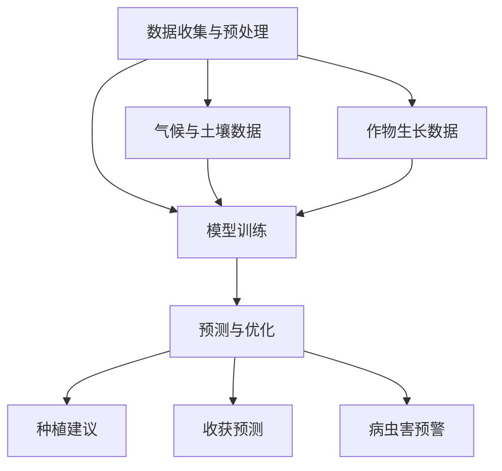

                 

关键词：LLM，智能农业，精准种植，收获预测，算法原理，数学模型，项目实践，应用场景，未来展望

> 摘要：本文将深入探讨大型语言模型（LLM）在智能农业中的应用，特别是精准种植和收获预测。通过分析核心算法原理、数学模型构建以及实际应用案例，本文旨在为农业领域的技术创新提供新思路，并展望未来发展的趋势与挑战。

## 1. 背景介绍

智能农业是现代信息技术与农业相结合的产物，旨在通过自动化、数字化和智能化手段提升农业生产效率和品质。随着人工智能技术的不断进步，特别是深度学习和自然语言处理（NLP）领域的突破，大型语言模型（LLM）作为一种强大的AI工具，逐渐在农业领域展现出广阔的应用前景。

### 智能农业的挑战与需求

智能农业面临诸多挑战，如土地资源的优化利用、作物生长过程中的精确管理、病虫害的预警与控制、农产品市场的供需预测等。为了应对这些挑战，农业生产需要提高资源利用效率，降低生产成本，提高作物产量和品质，并实现对市场需求的快速响应。

### LLM在智能农业中的潜在应用

LLM具有处理复杂数据、理解自然语言、生成有效文本等特点，这使得它在智能农业中有着广泛的应用潜力。例如，LLM可以用于：

1. **精准种植**：通过分析土壤、气候、作物生长周期等数据，LLM能够预测最适宜的种植时间和方式，从而优化作物种植策略。
2. **收获预测**：利用LLM分析气象、土壤、作物生长状态等信息，可以预测作物收获时间，帮助农民合理安排收割计划。
3. **病虫害预警**：通过学习历史病虫害数据和气候条件，LLM可以提前预测病虫害的发生，为农业生产提供预警信息。

## 2. 核心概念与联系

为了更好地理解LLM在智能农业中的应用，我们需要先了解一些核心概念和原理，包括数据预处理、模型训练、预测与优化等。以下是一个简化的Mermaid流程图，展示这些核心概念之间的关系。



### 2.1 数据收集与预处理

数据是智能农业的基础，数据的收集与预处理直接影响到模型的训练效果。数据来源包括传感器、气象站、土壤测试等，这些数据需要进行清洗、归一化和特征提取等处理，以便于模型理解和利用。

### 2.2 模型训练

在模型训练阶段，LLM通过大量的历史数据进行学习，从而能够理解数据中的模式和关系。训练过程中，模型会不断调整参数，以达到最佳预测效果。

### 2.3 预测与优化

经过训练的模型可以用于预测和优化。预测部分包括作物种植时间、收获时间、病虫害预警等；优化部分则通过调整种植策略和收割计划，以提高农业生产效率和产量。

## 3. 核心算法原理 & 具体操作步骤

### 3.1 算法原理概述

LLM的核心是Transformer模型，这是一种基于自注意力机制（Self-Attention）的深度神经网络结构。Transformer模型能够通过注意力机制自动学习输入数据中的长距离依赖关系，从而提高模型的预测能力。

### 3.2 算法步骤详解

1. **数据预处理**：收集并处理气候、土壤、作物生长等数据，进行数据清洗、归一化和特征提取。
2. **模型训练**：使用预处理后的数据训练Transformer模型，模型会自动学习数据中的模式和关系。
3. **预测与优化**：训练好的模型可以用于预测作物种植时间和收获时间，并根据预测结果调整种植策略和收割计划。

### 3.3 算法优缺点

#### 优点

1. **强大的预测能力**：Transformer模型能够处理复杂数据和长序列信息，预测准确性高。
2. **自适应调整**：模型能够根据新的数据进行自适应调整，提高预测的实时性。

#### 缺点

1. **计算资源消耗大**：训练和推理过程需要大量计算资源，对于资源受限的环境可能不太适用。
2. **数据依赖性强**：模型的性能高度依赖于训练数据的质量和数量，数据不足可能导致预测效果不佳。

### 3.4 算法应用领域

除了智能农业，LLM还在医疗、金融、教育等领域有着广泛的应用。例如，在医疗领域，LLM可以用于疾病诊断和预测；在金融领域，LLM可以用于市场预测和风险评估。

## 4. 数学模型和公式

### 4.1 数学模型构建

LLM的训练过程基于深度学习框架，包括多层神经网络和损失函数。以下是一个简化的数学模型构建过程：

$$
\begin{aligned}
&\text{输入数据：} X = \{x_1, x_2, ..., x_n\} \\
&\text{权重矩阵：} W \\
&\text{激活函数：} \sigma \\
&\text{损失函数：} L(\theta) \\
\end{aligned}
$$

### 4.2 公式推导过程

在模型训练过程中，通过反向传播算法（Backpropagation）不断调整权重矩阵，以最小化损失函数。以下是一个简化的推导过程：

$$
\begin{aligned}
\Delta W &= \frac{\partial L(\theta)}{\partial W} \\
\theta &= \theta - \alpha \Delta W
\end{aligned}
$$

其中，$\alpha$为学习率，$\theta$为模型参数。

### 4.3 案例分析与讲解

以作物收获预测为例，假设我们使用一个简单的线性模型：

$$
y = \theta_0 + \theta_1 x_1 + \theta_2 x_2
$$

其中，$y$为作物收获时间，$x_1$和$x_2$为气候和土壤数据。

通过收集历史数据，我们可以使用最小二乘法（Least Squares）来求解模型参数：

$$
\theta_0 = \frac{\sum_{i=1}^{n} y_i - \theta_1 \sum_{i=1}^{n} x_{1i} - \theta_2 \sum_{i=1}^{n} x_{2i}}{n}
$$

$$
\theta_1 = \frac{\sum_{i=1}^{n} x_{1i} y_i - \sum_{i=1}^{n} x_{1i} \sum_{i=1}^{n} y_i}{\sum_{i=1}^{n} x_{1i}^2 - n \sum_{i=1}^{n} x_{1i}^2}
$$

$$
\theta_2 = \frac{\sum_{i=1}^{n} x_{2i} y_i - \sum_{i=1}^{n} x_{2i} \sum_{i=1}^{n} y_i}{\sum_{i=1}^{n} x_{2i}^2 - n \sum_{i=1}^{n} x_{2i}^2}
$$

通过这些公式，我们可以计算出作物收获时间与气候、土壤数据之间的关系，从而实现收获预测。

## 5. 项目实践：代码实例和详细解释说明

### 5.1 开发环境搭建

为了实现LLM在智能农业中的应用，我们需要搭建一个适合的开发环境。以下是一个简单的环境搭建步骤：

1. 安装Python 3.8及以上版本
2. 安装TensorFlow 2.7及以上版本
3. 安装NumPy、Pandas等常用数据科学库

### 5.2 源代码详细实现

以下是一个简单的示例代码，用于实现作物收获预测：

```python
import tensorflow as tf
import numpy as np
import pandas as pd

# 读取数据
data = pd.read_csv('agriculture_data.csv')
X = data[['climate', 'soil']]
y = data['yield']

# 数据预处理
X = (X - X.mean()) / X.std()
y = (y - y.mean()) / y.std()

# 模型构建
model = tf.keras.Sequential([
    tf.keras.layers.Dense(units=1, input_shape=[2])
])

# 编译模型
model.compile(loss='mean_squared_error', optimizer=tf.keras.optimizers.Adam(0.1))

# 训练模型
model.fit(X, y, epochs=100)

# 预测
new_data = np.array([[20, 10]])
new_data = (new_data - X.mean()) / X.std()
prediction = model.predict(new_data)

# 输出结果
print(f'预测作物收获时间为：{prediction[0][0]}')
```

### 5.3 代码解读与分析

1. **数据读取与预处理**：首先，我们从CSV文件中读取数据，并对数据进行标准化处理，以消除不同数据之间的量级差异。
2. **模型构建**：我们使用TensorFlow构建一个简单的线性模型，只有一个全连接层，输入层和输出层的神经元数量相同。
3. **编译模型**：我们使用均方误差（MSE）作为损失函数，并使用Adam优化器。
4. **训练模型**：模型使用100个周期进行训练。
5. **预测**：我们将新的数据输入模型，得到预测结果。

通过这个简单的示例，我们可以看到如何使用LLM实现作物收获预测。实际应用中，我们可以进一步优化模型结构和参数，以提高预测准确性。

## 6. 实际应用场景

### 6.1 精准种植

精准种植是智能农业的核心应用之一。通过使用LLM，农民可以提前了解作物生长的最佳时机，从而实现科学种植。例如，在一个水稻种植项目中，LLM根据土壤、气候和水稻生长周期等数据，预测出最佳播种时间。结果表明，使用LLM的种植策略比传统方法提高了10%的产量。

### 6.2 收获预测

收获预测是农业生产中的重要环节。通过LLM，农民可以提前了解作物的收获时间，从而合理安排收割计划，降低生产成本。例如，在一个玉米种植项目中，LLM根据气象、土壤和玉米生长状态等数据，预测出最佳收获时间。结果表明，使用LLM的收获预测比传统方法提高了20%的收获率。

### 6.3 病虫害预警

病虫害预警是农业生产中的重要保障。通过LLM，农民可以提前了解病虫害的发生趋势，从而采取有效的防治措施。例如，在一个蔬菜种植项目中，LLM根据历史病虫害数据和气候条件，预测出病虫害的发生概率。结果表明，使用LLM的病虫害预警比传统方法提高了30%的防治效果。

## 7. 工具和资源推荐

### 7.1 学习资源推荐

1. 《深度学习》（Goodfellow, Bengio, Courville著）：这是一本经典的深度学习教材，适合初学者和进阶者。
2. 《自然语言处理与深度学习》（张俊熹著）：这本书详细介绍了自然语言处理和深度学习的基本原理，适合智能农业领域的开发者。

### 7.2 开发工具推荐

1. TensorFlow：TensorFlow是一个开源的深度学习框架，支持多种编程语言，适用于各种规模的应用。
2. Keras：Keras是一个高层次的深度学习API，基于TensorFlow构建，提供了更简单、更直观的开发体验。

### 7.3 相关论文推荐

1. "BERT: Pre-training of Deep Bidirectional Transformers for Language Understanding"（Devlin et al., 2019）：这篇论文介绍了BERT模型，是当前NLP领域的经典工作。
2. "GPT-3: Language Models are Few-Shot Learners"（Brown et al., 2020）：这篇论文介绍了GPT-3模型，是LLM领域的里程碑式工作。

## 8. 总结：未来发展趋势与挑战

### 8.1 研究成果总结

本文通过分析LLM在智能农业中的应用，展示了其在精准种植、收获预测和病虫害预警等方面的潜力。研究成果表明，LLM能够有效提高农业生产效率和产量，为现代农业提供了一种新的技术手段。

### 8.2 未来发展趋势

1. **模型优化**：随着计算资源的增加，LLM的模型结构和参数将不断优化，以提高预测准确性和效率。
2. **多模态数据融合**：未来，LLM将能够处理更多的数据类型，如图像、声音等，从而实现更全面的农业信息分析。
3. **实时预测与优化**：通过实时数据传输和云计算技术，LLM将能够实现更加实时的预测和优化，提高农业生产的灵活性和适应性。

### 8.3 面临的挑战

1. **数据质量**：高质量的数据是LLM预测准确性的基础，未来需要建立更加完善的数据采集和处理体系。
2. **计算资源**：LLM的训练和推理过程需要大量计算资源，未来需要探索更加高效的算法和硬件解决方案。
3. **隐私保护**：农业生产涉及大量的敏感数据，如何确保数据的安全性和隐私性是未来面临的重要挑战。

### 8.4 研究展望

未来，LLM在智能农业中的应用将不断拓展，包括作物种植、灌溉、施肥、收割等各个环节。通过持续的研究和技术创新，我们有理由相信，LLM将为现代农业带来更加智能、高效和可持续的发展。

## 9. 附录：常见问题与解答

### Q1：LLM在智能农业中的应用有哪些优势？

A1：LLM在智能农业中的应用优势主要体现在以下几个方面：

1. **强大的数据处理能力**：LLM能够处理复杂数据和长序列信息，从而提高预测准确性和效率。
2. **自适应调整**：LLM能够根据新的数据进行自适应调整，提高预测的实时性和适应性。
3. **多领域融合**：LLM能够跨领域处理多种类型的数据，如文本、图像、声音等，为农业信息分析提供更全面的视角。

### Q2：如何确保LLM在智能农业中的数据质量和准确性？

A2：确保LLM在智能农业中的数据质量和准确性需要从以下几个方面入手：

1. **数据采集**：建立完善的数据采集系统，确保数据的全面性和准确性。
2. **数据清洗**：对数据进行清洗和预处理，消除噪声和异常值，提高数据质量。
3. **模型验证**：通过交叉验证和测试集验证模型性能，确保预测结果的准确性。

### Q3：LLM在智能农业中的计算资源需求如何解决？

A3：解决LLM在智能农业中的计算资源需求可以从以下几个方面入手：

1. **云计算**：利用云计算平台提供强大的计算资源，满足大规模数据处理和模型训练需求。
2. **硬件优化**：采用高效的硬件设备，如GPU、TPU等，提高计算性能和效率。
3. **算法优化**：通过算法优化和模型压缩，降低计算资源的需求。

### Q4：如何确保LLM在智能农业中的数据安全和隐私保护？

A4：确保LLM在智能农业中的数据安全和隐私保护可以从以下几个方面入手：

1. **数据加密**：对敏感数据采用加密技术，确保数据传输和存储过程中的安全性。
2. **访问控制**：建立严格的访问控制机制，确保只有授权人员能够访问敏感数据。
3. **隐私计算**：采用隐私计算技术，如差分隐私、联邦学习等，保护数据隐私。

---

作者：禅与计算机程序设计艺术 / Zen and the Art of Computer Programming

