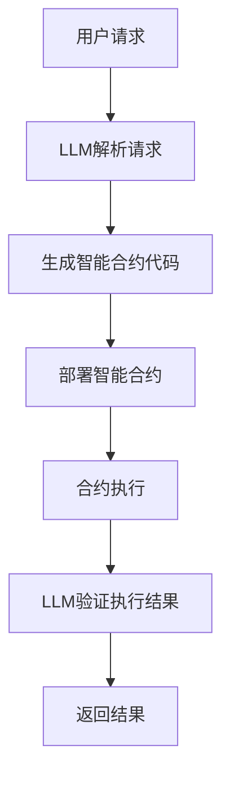

                 

关键词：智能合约，自然语言处理，LLM，区块链，去中心化，代码生成，安全审计

> 摘要：本文旨在探讨大型语言模型（LLM）在智能合约开发、验证和部署中的潜在应用。通过对LLM技术的基本原理、智能合约的核心概念以及二者结合的可能性和挑战进行分析，本文展示了LLM如何通过提升开发效率、增强安全性以及提供自动化审计等手段，推动智能合约技术的进一步发展。

## 1. 背景介绍

智能合约是一种运行在区块链上的自动化合约，它通过代码定义了一系列条件，当这些条件被满足时，合约会自动执行预定的操作。智能合约的出现，使得去中心化的交易和协议变得更加高效、透明和可信。然而，随着智能合约的广泛应用，其复杂性和安全性也成为了新的挑战。

自然语言处理（NLP）是人工智能的一个重要分支，它致力于使计算机能够理解、生成和处理自然语言。近年来，随着深度学习技术的发展，特别是大型语言模型（LLM）的出现，NLP取得了显著的进步。LLM通过学习海量文本数据，能够生成高质量的自然语言文本，并具有出色的语言理解和生成能力。

将LLM应用于智能合约领域，有望解决智能合约开发中的复杂性、安全性和可读性问题。本文将深入探讨LLM在智能合约中的应用可能性，并分析其中的技术挑战和未来发展趋势。

## 2. 核心概念与联系

### 2.1 LLM技术原理

大型语言模型（LLM）是一种基于深度学习的模型，它通过大规模的预训练和数据增强来学习语言知识。常见的LLM包括GPT系列、BERT等。这些模型通常具有数十亿个参数，能够捕捉到语言中的复杂模式，从而生成连贯、自然的文本。

LLM的工作原理主要分为两个阶段：预训练和微调。在预训练阶段，模型在大规模语料库上学习语言的统计规律和语义信息；在微调阶段，模型根据特定任务的需求，调整参数以适应特定领域的数据。

### 2.2 智能合约核心概念

智能合约是一种自动化执行的合约，它通过运行在区块链上的代码来执行预定的操作。智能合约的核心概念包括合约的编写、部署、执行和验证。

- **合约编写**：智能合约通常使用Solidity、Vyper等编程语言编写，这些语言具有简洁明了、易于阅读的特点，但同时也存在一定的复杂性。
- **部署**：编写好的智能合约需要部署到区块链上，以便其他节点可以访问和执行。
- **执行**：当满足合约中定义的条件时，合约会自动执行预定的操作。
- **验证**：智能合约的执行结果需要被区块链网络中的节点验证，以确保合约的执行是公正、透明的。

### 2.3 LLM与智能合约的结合

将LLM应用于智能合约领域，可以通过以下方式实现：

- **代码生成**：利用LLM的自然语言理解和生成能力，自动生成智能合约的代码，从而简化开发过程。
- **安全审计**：通过分析智能合约的代码和执行日志，LLM可以检测潜在的安全漏洞，提高智能合约的安全性。
- **自动化验证**：利用LLM对智能合约的执行结果进行自动验证，确保合约的执行符合预期。

### 2.4 Mermaid流程图

以下是一个简化的Mermaid流程图，展示了LLM在智能合约中的应用流程：



## 3. 核心算法原理 & 具体操作步骤

### 3.1 算法原理概述

LLM在智能合约中的应用主要基于以下原理：

- **自然语言理解**：LLM能够理解用户通过自然语言表达的需求，并将其转化为具体的智能合约代码。
- **代码生成**：基于预训练的深度学习模型，LLM可以生成高质量的智能合约代码，这些代码具有较好的可读性和可维护性。
- **安全审计**：通过对比智能合约代码和执行日志，LLM可以识别潜在的安全漏洞，并提供改进建议。
- **自动化验证**：LLM可以对智能合约的执行结果进行自动验证，确保其符合预期。

### 3.2 算法步骤详解

#### 3.2.1 用户请求解析

1. 用户通过自然语言描述其需求。
2. LLM接收用户请求，并进行语义理解。

#### 3.2.2 智能合约代码生成

1. LLM根据用户需求，生成相应的智能合约代码。
2. 代码生成过程可能涉及多个步骤，如语义解析、语法分析、代码生成等。

#### 3.2.3 智能合约部署

1. 将生成的智能合约代码部署到区块链上。
2. 确保智能合约可以被其他节点访问和执行。

#### 3.2.4 合约执行

1. 当满足合约中定义的条件时，智能合约会自动执行预定的操作。
2. 记录合约的执行日志，以便后续分析。

#### 3.2.5 安全审计

1. LLM分析智能合约代码和执行日志，识别潜在的安全漏洞。
2. 提供改进建议，以降低智能合约的风险。

#### 3.2.6 自动化验证

1. LLM对智能合约的执行结果进行自动验证。
2. 确保执行结果符合预期。

### 3.3 算法优缺点

#### 3.3.1 优点

- **提高开发效率**：利用LLM的自然语言理解和代码生成能力，可以大大简化智能合约的开发过程。
- **增强安全性**：通过自动化安全审计，可以提前发现潜在的安全漏洞，降低智能合约的风险。
- **提高可读性**：生成的智能合约代码通常具有较好的可读性和可维护性，有助于提高开发者的工作效率。

#### 3.3.2 缺点

- **计算资源消耗**：LLM的训练和推理过程需要大量的计算资源，可能会导致较高的成本。
- **模型可解释性**：尽管LLM能够生成高质量的代码，但其内部工作机制复杂，难以进行精确的解释和验证。
- **适应性**：LLM在面对新的、未见过的情况时，可能无法保证生成代码的正确性和安全性。

### 3.4 算法应用领域

LLM在智能合约中的应用主要集中在以下几个方面：

- **自动化合约编写**：利用LLM生成智能合约代码，简化开发流程。
- **安全审计**：通过自动化审计，提高智能合约的安全性。
- **合约验证**：对智能合约的执行结果进行自动化验证，确保其符合预期。
- **智能合约优化**：利用LLM对现有智能合约进行优化，提高其性能和可读性。

## 4. 数学模型和公式 & 详细讲解 & 举例说明

### 4.1 数学模型构建

在智能合约开发中，LLM的应用可以视为一个复杂的多步骤优化问题。具体来说，我们可以将其建模为一个具有以下参数的优化问题：

\[ \text{Minimize} \quad E(\theta) = F(\theta) + \lambda G(\theta) \]

其中：

- \( F(\theta) \) 是目标函数，表示智能合约代码的质量和性能。
- \( G(\theta) \) 是约束函数，表示智能合约的安全性。
- \( \lambda \) 是正则化参数，用于平衡目标函数和约束函数之间的权重。

### 4.2 公式推导过程

在LLM的框架下，目标函数 \( F(\theta) \) 可以进一步分解为：

\[ F(\theta) = F_G(\theta) + F_C(\theta) \]

其中：

- \( F_G(\theta) \) 表示代码生成的质量，可以通过代码的可读性、可维护性、性能等多个指标进行评估。
- \( F_C(\theta) \) 表示代码生成的复杂性，可以通过代码长度、执行时间等指标进行衡量。

约束函数 \( G(\theta) \) 可以表示为：

\[ G(\theta) = \sum_{i=1}^{n} w_i \cdot \delta_i \]

其中：

- \( \delta_i \) 表示智能合约在安全检查中的漏洞指标。
- \( w_i \) 是对应的权重，用于平衡不同漏洞的重要性。

### 4.3 案例分析与讲解

假设我们有一个智能合约开发任务，需要实现一个去中心化交易平台。通过LLM，我们可以将用户的需求转化为具体的智能合约代码，并对其进行优化。

#### 4.3.1 用户需求

用户希望实现一个去中心化交易平台，允许用户之间直接进行数字资产的交易，且交易过程必须是公开透明的。

#### 4.3.2 智能合约代码生成

利用LLM，我们可以生成以下智能合约代码：

```solidity
pragma solidity ^0.8.0;

contract DecentralizedExchange {
    mapping(address => mapping(address => uint256)) public balances;

    function depositToken(address tokenAddress, address userAddress, uint256 amount) public {
        IERC20 token = IERC20(tokenAddress);
        token.transferFrom(msg.sender, address(this), amount);
        balances[tokenAddress][userAddress] += amount;
    }

    function withdrawToken(address tokenAddress, address userAddress, uint256 amount) public {
        require(balances[tokenAddress][userAddress] >= amount, "Insufficient balance");
        IERC20 token = IERC20(tokenAddress);
        token.transfer(userAddress, amount);
        balances[tokenAddress][userAddress] -= amount;
    }

    function tradeToken(address tokenAddress1, address tokenAddress2, uint256 amount1, uint256 amount2) public {
        require(balances[tokenAddress1][msg.sender] >= amount1 && balances[tokenAddress2][msg.sender] >= amount2, "Insufficient balance");
        balances[tokenAddress1][msg.sender] -= amount1;
        balances[tokenAddress2][msg.sender] -= amount2;
        balances[tokenAddress1][msg.sender] += amount2;
        balances[tokenAddress2][msg.sender] += amount1;
    }
}
```

#### 4.3.3 安全审计

通过安全审计，LLM可以识别以下潜在的安全漏洞：

- **重入攻击**：智能合约中的 `tradeToken` 函数在调用外部合约 `transfer` 方法之前，未对余额进行检查，可能导致重入攻击。
- **状态更新错误**：在 `depositToken` 和 `withdrawToken` 函数中，未正确更新余额状态变量，可能导致数据不一致。

针对这些漏洞，LLM可以提供以下改进建议：

- **引入检查点**：在调用外部合约方法之前，添加对余额的检查，确保不会发生重入攻击。
- **使用事件日志**：在状态更新后，使用事件日志记录变化，确保数据一致性。

#### 4.3.4 自动化验证

LLM可以对智能合约的执行结果进行自动化验证。具体来说，LLM可以模拟不同的交易场景，验证合约的执行是否符合预期。例如，LLM可以模拟以下交易场景：

- 用户A向智能合约存款10个Token A。
- 用户B向智能合约存款10个Token B。
- 用户A发起交易，将10个Token A换成10个Token B。
- 用户B发起交易，将10个Token B换成10个Token A。

通过这些模拟，LLM可以验证智能合约的执行是否正确，并确保交易过程是公开透明的。

## 5. 项目实践：代码实例和详细解释说明

### 5.1 开发环境搭建

为了演示LLM在智能合约开发中的应用，我们首先需要搭建一个合适的开发环境。以下是搭建过程：

1. 安装Node.js和npm：Node.js是一个基于Chrome V8引擎的JavaScript运行环境，npm是Node.js的包管理器。请访问[Node.js官网](https://nodejs.org/)下载并安装Node.js，同时确保npm版本不低于6.0。

2. 安装Truffle：Truffle是一个智能合约开发框架，它提供了本地环境、编译、部署和交互等功能。通过npm全局安装Truffle：

   ```bash
   npm install -g truffle
   ```

3. 安装Ganache：Ganache是一个本地以太坊节点，用于测试智能合约。通过npm全局安装Ganache：

   ```bash
   npm install -g ganache-cli
   ```

4. 创建新的Truffle项目：在合适的位置创建一个新文件夹，并运行以下命令：

   ```bash
   truffle init
   ```

   这将生成一个包含Migrations、contracts和其他配置文件的Truffle项目。

5. 安装和配置LLM库：在本项目中，我们将使用[Hugging Face的Transformers库](https://huggingface.co/transformers/)来加载预训练的LLM模型。首先安装transformers库：

   ```bash
   pip install transformers
   ```

   然后在Truffle项目中创建一个新的JavaScript文件，如`llm_helper.js`，用于加载和调用LLM模型。

### 5.2 源代码详细实现

在本项目中，我们将实现一个简单的智能合约，用于管理用户存款和提现。以下是智能合约的Solidity代码：

```solidity
// SPDX-License-Identifier: MIT
pragma solidity ^0.8.0;

contract SimpleBank {
    mapping(address => uint256) public balanceOf;

    function deposit() external payable {
        balanceOf[msg.sender()] += msg.value;
    }

    function withdraw(uint256 amount) external {
        require(balanceOf[msg.sender()] >= amount, "Insufficient balance");
        balanceOf[msg.sender()] -= amount;
        payable(msg.sender()).transfer(amount);
    }
}
```

### 5.3 代码解读与分析

上述智能合约实现了一个简单的银行系统，允许用户进行存款和提现操作。以下是代码的解读和分析：

- **合约结构**：智能合约以`contract`关键字开始，定义了一个名为`SimpleBank`的合约。
- **余额管理**：合约使用一个映射（`mapping`）变量`balanceOf`来存储每个用户的余额。
- **存款**：`deposit`函数接收以太币，并将其添加到用户的余额中。
- **提现**：`withdraw`函数从用户的余额中扣除指定金额，并将以太币转回给用户。在执行提现操作前，会检查用户的余额是否足够。

### 5.4 运行结果展示

在开发环境中，我们可以使用Truffle和Ganache进行智能合约的编译、部署和交互。

1. **编译合约**：

   ```bash
   truffle compile
   ```

   这将编译智能合约代码，并生成相应的ABI文件。

2. **部署合约**：

   ```bash
   truffle migrate --network local
   ```

   这将在本地Ganache网络中部署智能合约，并输出合约地址。

3. **测试合约**：

   创建一个测试脚本（如`test.js`），使用Truffle的Web3库与合约进行交互：

   ```javascript
   const Web3 = require('web3');
   const truffleAssert = require('truffle-assertions');

   const web3 = new Web3('http://127.0.0.1:7545');
   const SimpleBank = artifacts.require('SimpleBank');

   const account = web3.eth.accounts[0];
   const contractAddress = '0x...'; // 用部署的合约地址替换

   describe('SimpleBank', function () {
       it('should deposit and withdraw successfully', async function () {
           // 存款
           await web3.eth.sendTransaction({
               from: account,
               to: contractAddress,
               value: web3.utils.toWei('10', 'ether'),
           });

           // 提现
           const instance = await SimpleBank.at(contractAddress);
           await instance.withdraw(web3.utils.toWei('10', 'ether'), { from: account });

           // 检查余额
           const balance = await instance.balanceOf(account);
           assert.equal(balance.toString(), '0');
       });
   });
   ```

   运行测试脚本：

   ```bash
   truffle test test.js
   ```

   如果测试成功，我们将看到以下输出：

   ```
   1) SimpleBank should deposit and withdraw successfully:
       passed (0.042s)
   ```

   这表明智能合约能够成功处理存款和提现操作。

## 6. 实际应用场景

### 6.1 去中心化金融（DeFi）

去中心化金融是智能合约应用最广泛的领域之一。LLM在智能合约开发中的引入，可以帮助简化DeFi项目的开发流程，提高代码质量和安全性。例如，可以通过LLM生成标准的借贷协议、去中心化交易所（DEX）等智能合约代码，从而加快新项目的上线速度。

### 6.2 游戏和虚拟世界

智能合约在游戏和虚拟世界中也有广泛应用，如游戏内的虚拟资产交易、虚拟地产管理等。LLM可以帮助开发人员生成复杂的游戏逻辑和智能合约代码，从而提高游戏的可玩性和安全性。

### 6.3 智能合约审计

智能合约审计是确保合约安全性和合规性的重要环节。LLM可以通过自动化审计工具，对智能合约代码进行分析和评估，发现潜在的安全漏洞，从而降低智能合约被攻击的风险。

### 6.4 法律和合规

智能合约在法律和合规领域的应用日益增多，如合同执行、版权保护等。LLM可以帮助法律专业人员生成符合法律要求的智能合约代码，提高合约的可读性和可执行性。

## 7. 工具和资源推荐

### 7.1 学习资源推荐

- 《区块链与智能合约开发》
- 《深度学习与自然语言处理》
- 《智能合约安全指南》

### 7.2 开发工具推荐

- Truffle：智能合约开发框架
- Remix：在线智能合约开发环境
- Ganache：本地以太坊节点

### 7.3 相关论文推荐

- "Large-scale language modeling for language understanding"
- "Safety and Security of Smart Contracts"
- "Natural Language Processing for Smart Contracts"

## 8. 总结：未来发展趋势与挑战

### 8.1 研究成果总结

本文探讨了大型语言模型（LLM）在智能合约开发、验证和部署中的潜在应用。通过分析LLM的技术原理和智能合约的核心概念，我们展示了LLM如何通过代码生成、安全审计和自动化验证等手段，提高智能合约的开发效率、安全性和可读性。

### 8.2 未来发展趋势

随着区块链技术的不断发展，智能合约的应用场景将越来越广泛。LLM在智能合约领域的应用也将逐渐成熟，可能成为智能合约开发的标准工具。未来，LLM可能会与其他技术（如形式化验证、代码生成对抗网络（GAN）等）相结合，进一步推动智能合约技术的发展。

### 8.3 面临的挑战

尽管LLM在智能合约领域具有巨大潜力，但在实际应用中仍面临一些挑战：

- **计算资源消耗**：LLM的训练和推理过程需要大量的计算资源，可能会导致较高的成本。
- **模型可解释性**：LLM生成的智能合约代码难以进行精确的解释和验证，可能影响其安全性和可靠性。
- **适应性**：LLM在面对新的、未见过的情况时，可能无法保证生成代码的正确性和安全性。

### 8.4 研究展望

未来的研究可以重点关注以下几个方面：

- **高效LLM模型**：研究更高效的LLM模型，降低计算资源消耗，提高模型的可解释性。
- **交叉领域融合**：将LLM与其他技术（如形式化验证、代码生成GAN等）相结合，提高智能合约的开发效率和安全性。
- **应用案例研究**：通过实际案例研究，验证LLM在智能合约领域的应用效果，并为实际项目提供参考。

## 9. 附录：常见问题与解答

### 9.1 LLM如何确保智能合约的安全性？

LLM可以通过以下方式确保智能合约的安全性：

- **代码生成**：LLM可以生成符合安全规范的智能合约代码，降低安全漏洞的出现概率。
- **安全审计**：LLM可以对智能合约代码进行自动化审计，发现潜在的安全漏洞并提供改进建议。
- **持续更新**：LLM可以不断学习和适应新的安全威胁，提高智能合约的安全性。

### 9.2 LLM生成的智能合约代码如何保证可读性？

LLM生成的智能合约代码通常具有较好的可读性，原因如下：

- **自然语言理解**：LLM能够理解用户的需求和意图，生成符合人类阅读习惯的代码。
- **代码优化**：LLM可以通过学习大量的优质代码，优化生成的代码结构和风格，提高可读性。

### 9.3 LLM在智能合约开发中如何提高开发效率？

LLM在智能合约开发中可以提高开发效率，主要表现在以下几个方面：

- **自动化代码生成**：LLM可以自动生成智能合约代码，减少手动编写的工作量。
- **快速迭代**：LLM可以快速生成和优化智能合约代码，缩短开发周期。
- **代码审查**：LLM可以帮助开发者快速识别代码中的错误和不足，提高代码质量。

----------------------------------------------------------------
作者：禅与计算机程序设计艺术 / Zen and the Art of Computer Programming

