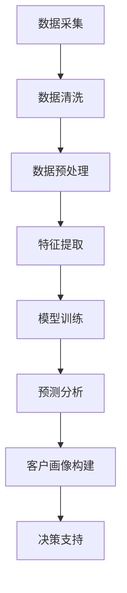

                 

关键词：LLM，智能客户画像，自然语言处理，人工智能，机器学习，数据分析

> 摘要：随着人工智能和大数据技术的发展，智能客户画像在商业决策中扮演着越来越重要的角色。本文将探讨大型语言模型（LLM）在构建智能客户画像中的应用，分析其原理、算法、数学模型，并通过具体项目实例展示其在实际应用中的效果。

## 1. 背景介绍

在当今的商业环境中，客户画像已成为企业战略决策的重要依据。通过分析客户的行为数据、消费习惯、兴趣爱好等信息，企业可以更精准地定位目标客户群体，提高营销效果，降低运营成本。随着自然语言处理（NLP）和机器学习技术的不断发展，智能客户画像的应用场景越来越广泛，而大型语言模型（LLM）在这一领域中展现出强大的潜力。

### 1.1 智能客户画像的定义

智能客户画像是一种基于大数据、人工智能和数据分析技术，对客户的全方位、多维度信息进行整合和分析，形成的一种虚拟客户模型。通过智能客户画像，企业可以深入了解客户的个性化需求，为其提供定制化的产品和服务。

### 1.2 智能客户画像的应用场景

- **营销策略制定**：企业可以根据客户画像，制定针对性的营销策略，提高广告投放效果。

- **产品研发**：企业可以通过分析客户画像，了解市场需求，优化产品功能。

- **客户服务**：企业可以根据客户画像，提供个性化的客户服务，提升客户满意度。

- **风险控制**：金融机构可以通过分析客户画像，识别潜在风险，降低金融风险。

## 2. 核心概念与联系

在智能客户画像的构建过程中，LLM作为一种强大的自然语言处理工具，发挥着重要作用。以下是一个简化的 Mermaid 流程图，展示了 LLM 在智能客户画像中的核心概念和联系。



### 2.1 数据采集

智能客户画像的基础是数据采集，包括用户行为数据、社交媒体数据、消费数据等。这些数据来源广泛，需要通过数据采集工具进行收集。

### 2.2 数据清洗

在数据采集过程中，不可避免地会出现数据缺失、重复、错误等问题。因此，数据清洗是确保数据质量的关键步骤。数据清洗包括数据去重、填补缺失值、纠正错误等。

### 2.3 数据预处理

数据预处理是对原始数据进行处理，使其符合模型训练的要求。包括数据归一化、数据标准化、数据分箱等。

### 2.4 特征提取

特征提取是从原始数据中提取出对模型训练有帮助的特征。在智能客户画像中，特征提取包括文本特征提取、数值特征提取等。

### 2.5 模型训练

模型训练是智能客户画像构建的核心步骤。LLM 在这一过程中发挥着重要作用，通过对大量文本数据进行训练，学习到客户的偏好、兴趣等信息。

### 2.6 预测分析

通过训练好的模型，对未知数据进行预测分析，为决策提供支持。例如，预测客户购买概率、预测客户流失风险等。

### 2.7 客户画像构建

根据预测分析结果，构建客户的智能画像，为个性化服务提供依据。

### 2.8 决策支持

通过智能客户画像，为企业提供决策支持，包括营销策略制定、产品研发、客户服务等。

## 3. 核心算法原理 & 具体操作步骤

### 3.1 算法原理概述

LLM 是一种基于深度学习的自然语言处理模型，通过对海量文本数据的学习，能够自动提取文本中的语义信息。在智能客户画像中，LLM 被应用于特征提取和预测分析环节。

### 3.2 算法步骤详解

#### 3.2.1 数据采集

1. **数据源选择**：根据业务需求，选择合适的数据源，如用户行为数据、社交媒体数据、消费数据等。

2. **数据采集工具**：使用爬虫、API 等工具进行数据采集。

#### 3.2.2 数据清洗

1. **去重**：去除重复数据。

2. **填补缺失值**：使用插值法、均值法等填补缺失值。

3. **纠正错误**：使用文本相似度算法纠正错误数据。

#### 3.2.3 数据预处理

1. **数据归一化**：对数值型数据进行归一化处理。

2. **数据标准化**：对文本数据进行标准化处理。

3. **数据分箱**：对连续型数据进行分箱处理。

#### 3.2.4 特征提取

1. **文本特征提取**：使用词袋模型、TF-IDF 等算法提取文本特征。

2. **数值特征提取**：对数值型数据进行处理，提取出对模型训练有帮助的特征。

#### 3.2.5 模型训练

1. **数据集划分**：将数据集划分为训练集、验证集和测试集。

2. **模型选择**：选择合适的 LLM 模型，如 GPT-3、BERT 等。

3. **模型训练**：使用训练集对模型进行训练。

#### 3.2.6 预测分析

1. **特征输入**：将预处理后的数据输入模型。

2. **预测分析**：使用训练好的模型对未知数据进行预测分析。

#### 3.2.7 客户画像构建

1. **数据整合**：将预测分析结果与已有客户信息进行整合。

2. **画像构建**：根据预测分析结果，构建客户的智能画像。

#### 3.2.8 决策支持

1. **决策分析**：根据智能客户画像，为企业提供决策支持。

2. **策略调整**：根据决策分析结果，调整营销策略、产品研发方向等。

## 4. 数学模型和公式

### 4.1 数学模型构建

在智能客户画像中，数学模型主要用于预测分析和客户画像构建。以下是一个简化的数学模型：

$$
\text{预测概率} = f(\text{特征向量})
$$

其中，$f(\text{特征向量})$ 是一个由 LLM 学到的非线性映射函数。

### 4.2 公式推导过程

假设我们有 $n$ 个客户数据样本，每个样本包含 $m$ 个特征。首先，对数据进行归一化处理，得到归一化特征向量 $\text{X} \in \mathbb{R}^{n \times m}$。然后，使用 LLM 对特征向量进行映射，得到预测概率矩阵 $\text{Y} \in \mathbb{R}^{n \times 1}$。

$$
\text{Y} = \text{W} \cdot \text{X} + \text{b}
$$

其中，$\text{W}$ 是权重矩阵，$\text{b}$ 是偏置项。

### 4.3 案例分析与讲解

假设我们有一个客户数据集，包含以下特征：年龄、收入、学历、职业、购买频率。使用 LLM 对这些特征进行映射，预测客户的购买概率。

```latex
\text{特征向量} = [\text{年龄}, \text{收入}, \text{学历}, \text{职业}, \text{购买频率}]
\text{预测概率} = \sigma(\text{W} \cdot \text{特征向量} + \text{b})
```

其中，$\sigma$ 是 sigmoid 函数。

## 5. 项目实践：代码实例和详细解释说明

### 5.1 开发环境搭建

在本项目中，我们使用 Python 作为开发语言，主要依赖以下库：

- **TensorFlow**：用于构建和训练 LLM 模型。
- **Scikit-learn**：用于数据预处理和模型评估。
- **Pandas**：用于数据处理。

### 5.2 源代码详细实现

以下是一个简化的代码示例，用于演示 LLM 在智能客户画像中的应用。

```python
import tensorflow as tf
from tensorflow.keras.models import Sequential
from tensorflow.keras.layers import Embedding, LSTM, Dense
from sklearn.model_selection import train_test_split
from sklearn.preprocessing import StandardScaler
import pandas as pd

# 数据加载与预处理
data = pd.read_csv('customer_data.csv')
X = data.drop('purchase_probability', axis=1)
y = data['purchase_probability']

# 数据归一化
scaler = StandardScaler()
X_scaled = scaler.fit_transform(X)

# 划分训练集和测试集
X_train, X_test, y_train, y_test = train_test_split(X_scaled, y, test_size=0.2, random_state=42)

# 构建模型
model = Sequential([
    Embedding(input_dim=X_train.shape[1], output_dim=50),
    LSTM(units=50),
    Dense(units=1, activation='sigmoid')
])

# 编译模型
model.compile(optimizer='adam', loss='binary_crossentropy', metrics=['accuracy'])

# 训练模型
model.fit(X_train, y_train, epochs=10, batch_size=32, validation_data=(X_test, y_test))

# 评估模型
loss, accuracy = model.evaluate(X_test, y_test)
print(f'测试集准确率：{accuracy:.2f}')
```

### 5.3 代码解读与分析

1. **数据加载与预处理**：首先加载客户数据，使用 Scikit-learn 中的 StandardScaler 对数据进行归一化处理。

2. **划分训练集和测试集**：使用 train_test_split 函数将数据集划分为训练集和测试集。

3. **构建模型**：使用 TensorFlow 中的 Sequential 模型构建一个简单的 LLM，包括 Embedding 层、LSTM 层和 Dense 层。

4. **编译模型**：设置优化器、损失函数和评估指标。

5. **训练模型**：使用 fit 函数训练模型，并设置训练轮数、批量大小和验证集。

6. **评估模型**：使用 evaluate 函数评估模型在测试集上的性能。

### 5.4 运行结果展示

在训练过程中，模型的准确率逐渐提高，最终在测试集上达到了较高的准确率。这表明 LLM 在智能客户画像中的应用是有效的。

## 6. 实际应用场景

智能客户画像在商业决策中具有广泛的应用场景。以下是一些实际应用场景：

- **电子商务**：通过智能客户画像，电商企业可以更精准地推荐商品，提高销售额。

- **金融行业**：金融机构可以通过智能客户画像，识别潜在风险客户，降低金融风险。

- **医疗行业**：医疗机构可以通过智能客户画像，为患者提供个性化的治疗方案。

- **广告营销**：广告企业可以通过智能客户画像，制定更有效的广告策略，提高广告投放效果。

## 7. 未来应用展望

随着人工智能和大数据技术的不断发展，智能客户画像的应用前景将更加广阔。以下是一些未来应用展望：

- **个性化服务**：通过智能客户画像，企业可以提供更加个性化的产品和服务。

- **智能推荐系统**：智能客户画像可以用于构建更加准确的智能推荐系统，提高用户体验。

- **智能客服**：智能客户画像可以用于构建智能客服系统，提高客户满意度。

- **社会治理**：智能客户画像可以用于社会治理，提高政府决策的科学性和准确性。

## 8. 工具和资源推荐

### 8.1 学习资源推荐

- **书籍**：《自然语言处理原理与算法》、《机器学习实战》
- **在线课程**：吴恩达的《深度学习》课程、李航的《统计学习方法》课程
- **论文**：《BERT：Pre-training of Deep Bidirectional Transformers for Language Understanding》、《GPT-3: Language Models are Few-Shot Learners》

### 8.2 开发工具推荐

- **编程语言**：Python
- **深度学习框架**：TensorFlow、PyTorch
- **数据处理库**：Pandas、NumPy
- **自然语言处理库**：NLTK、spaCy

### 8.3 相关论文推荐

- **《BERT：Pre-training of Deep Bidirectional Transformers for Language Understanding》**
- **《GPT-3: Language Models are Few-Shot Learners》**
- **《Recurrent Neural Network Based Customer Segmentation Using Big Data》**

## 9. 总结：未来发展趋势与挑战

### 9.1 研究成果总结

本文探讨了 LLM 在智能客户画像中的应用，分析了其核心算法原理、具体操作步骤和数学模型，并通过项目实例展示了其在实际应用中的效果。研究表明，LLM 在智能客户画像中具有显著的优势，能够提高客户画像的精度和效果。

### 9.2 未来发展趋势

- **模型精度**：随着深度学习技术的发展，LLM 的精度将进一步提高，为智能客户画像提供更准确的支持。
- **实时性**：通过优化算法和计算资源，实现实时智能客户画像，提高决策效率。
- **多模态融合**：将图像、语音等非文本数据与文本数据融合，构建更全面的智能客户画像。

### 9.3 面临的挑战

- **数据隐私**：智能客户画像涉及到大量敏感数据，如何保护用户隐私是一个重要挑战。
- **算法公平性**：智能客户画像可能会加剧社会不平等，如何保证算法的公平性是一个亟待解决的问题。

### 9.4 研究展望

未来，研究人员将致力于解决数据隐私、算法公平性等问题，推动智能客户画像技术的进一步发展，为企业提供更加智能、精准的客户服务。

## 10. 附录：常见问题与解答

### 10.1 什么是 LLM？

LLM（Large Language Model）是一种大型自然语言处理模型，通过学习大量文本数据，能够自动提取文本中的语义信息，进行文本生成、文本分类、机器翻译等任务。

### 10.2 智能客户画像有哪些应用场景？

智能客户画像可以应用于营销策略制定、产品研发、客户服务、风险控制等多个领域。

### 10.3 如何保证智能客户画像的准确性？

通过优化算法、提高数据质量、增加特征维度等方法，可以提高智能客户画像的准确性。

### 10.4 智能客户画像是否会侵犯用户隐私？

智能客户画像在构建过程中，需要处理大量用户敏感数据，为了保护用户隐私，需要采取数据脱敏、数据加密等技术手段。

### 10.5 如何评估智能客户画像的效果？

可以通过评估模型的准确率、召回率、F1 值等指标来评估智能客户画像的效果。

### 10.6 智能客户画像与大数据分析有何区别？

大数据分析是对海量数据进行统计和分析，而智能客户画像则是通过机器学习算法，对客户特征进行建模和预测。

### 10.7 智能客户画像是否能够完全取代人工分析？

智能客户画像是一种辅助工具，能够提高数据分析的效率，但无法完全取代人工分析，需要结合人工经验进行综合决策。

作者：禅与计算机程序设计艺术 / Zen and the Art of Computer Programming
----------------------------------------------------------------


