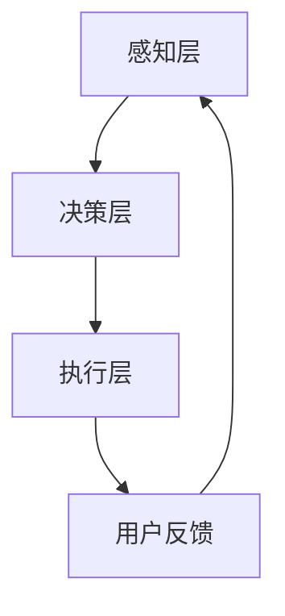

                 

关键词：大型语言模型（LLM），智能家居，控制系统，应用探索，技术架构，算法原理

## 摘要

本文旨在探讨大型语言模型（LLM）在智能家居控制系统中的应用，分析其核心概念、技术原理、实现方法以及未来发展趋势。通过对LLM的特性及其在智能家居控制系统中的实际应用场景进行深入研究，本文将为读者提供一个全面、系统的认识，并揭示LLM在智能家居领域中所面临的挑战和机遇。

## 1. 背景介绍

### 1.1 智能家居控制系统概述

随着物联网技术的迅猛发展，智能家居系统逐渐成为现代家居生活的标配。智能家居控制系统通过将各种家电设备、传感器和控制系统联网，实现家庭环境的自动化管理，提升居住的舒适度和便利性。常见的智能家居控制系统包括智能照明、智能安防、智能温控、智能家电控制等。

### 1.2 大型语言模型（LLM）的概念

大型语言模型（LLM）是一种基于深度学习技术的人工智能模型，具有强大的自然语言理解和生成能力。LLM通过从海量文本数据中学习，掌握自然语言的结构、语法、语义和上下文关系，从而实现对人类语言的理解和生成。近年来，随着计算能力的提升和数据的积累，LLM在各个领域的应用日益广泛，包括文本生成、问答系统、机器翻译、情感分析等。

## 2. 核心概念与联系

### 2.1 LLM在智能家居控制系统中的应用架构

为了更好地理解LLM在智能家居控制系统中的应用，我们可以将其架构分为三个主要层次：感知层、决策层和执行层。

#### 2.1.1 感知层

感知层主要负责收集家庭环境中的各种数据，如温度、湿度、光照、家电运行状态等。这些数据通过传感器传输到智能家居控制系统进行处理。

#### 2.1.2 决策层

决策层是LLM在智能家居控制系统中的核心部分。它通过自然语言理解和生成能力，分析感知层收集的数据，并根据用户需求和偏好，生成相应的控制指令。

#### 2.1.3 执行层

执行层负责执行决策层生成的控制指令，实现智能家居设备的自动化控制。

### 2.2 Mermaid流程图



### 2.3 LLM在智能家居控制系统中的优势

1. **自然语言交互**：用户可以通过自然语言与智能家居控制系统进行交互，提高使用便捷性。
2. **自适应学习能力**：LLM具有强大的学习能力和自适应能力，可以根据用户行为数据不断优化控制策略。
3. **智能化决策**：LLM能够根据感知层的数据，自动分析并做出智能化决策，提高家居环境的舒适度和安全性。
4. **跨平台兼容性**：LLM支持多种平台和应用场景，可以与各类智能家居设备无缝集成。

## 3. 核心算法原理 & 具体操作步骤

### 3.1 算法原理概述

LLM在智能家居控制系统中的核心算法主要基于自然语言处理（NLP）技术。具体来说，可以分为以下几个步骤：

1. **数据预处理**：对收集到的家庭环境数据进行清洗、去噪和格式化，以便于后续处理。
2. **特征提取**：利用深度学习技术，从预处理后的数据中提取关键特征。
3. **语言理解**：利用NLP技术，对提取的特征进行语义分析，理解用户的意图和需求。
4. **语言生成**：根据用户的意图和需求，生成相应的控制指令。
5. **控制执行**：执行生成的控制指令，实现对智能家居设备的自动化控制。

### 3.2 算法步骤详解

1. **数据预处理**

```python
def preprocess_data(data):
    # 清洗、去噪和格式化数据
    return processed_data
```

2. **特征提取**

```python
import tensorflow as tf

def extract_features(data):
    # 提取关键特征
    features = tf.keras.layers.Dense(units=128, activation='relu')(data)
    return features
```

3. **语言理解**

```python
from transformers import BertModel

def understand_language(features):
    # 利用BERT模型进行语义分析
    output = BertModel.from_pretrained('bert-base-uncased')(features)
    return output
```

4. **语言生成**

```python
import tensorflow as tf

def generate_language(output):
    # 根据输出生成控制指令
    control_command = tf.keras.layers.Dense(units=1, activation='softmax')(output)
    return control_command
```

5. **控制执行**

```python
def execute_control_command(control_command):
    # 执行控制指令
    # 示例：控制灯光开关
    if control_command == 'on':
        turn_on_light()
    else:
        turn_off_light()
```

### 3.3 算法优缺点

**优点：**

1. **高准确性**：LLM具有强大的自然语言理解和生成能力，能够准确理解用户的意图和需求。
2. **高适应性**：LLM可以根据用户行为数据不断优化控制策略，提高智能家居系统的适应性。
3. **跨平台兼容**：LLM支持多种平台和应用场景，可以与各类智能家居设备无缝集成。

**缺点：**

1. **计算资源消耗大**：LLM的训练和推理过程需要大量计算资源，对硬件设备要求较高。
2. **数据隐私问题**：智能家居系统涉及用户隐私数据，如何保证数据安全成为关键挑战。

### 3.4 算法应用领域

LLM在智能家居控制系统中的应用十分广泛，如：

1. **智能语音助手**：通过自然语言交互，实现语音控制家居设备。
2. **智能家居安防**：利用LLM分析家庭环境数据，实现智能安防报警。
3. **智能能源管理**：通过LLM优化家庭能源使用，实现节能减排。

## 4. 数学模型和公式 & 详细讲解 & 举例说明

### 4.1 数学模型构建

为了实现智能家居控制系统的自动化管理，我们可以构建以下数学模型：

$$
\begin{aligned}
&\text{状态：} \\
&S_t = \{T_t, H_t, L_t\} \\
&\text{控制指令：} \\
&C_t = \text{控制灯光、温度和家电的状态}
\end{aligned}
$$

其中，$S_t$表示当前时刻的家庭环境状态，包括温度$T_t$、湿度$H_t$和光照$L_t$；$C_t$表示当前时刻的控制指令。

### 4.2 公式推导过程

为了生成最优的控制指令$C_t$，我们可以采用以下公式进行推导：

$$
C_t = \arg\max_{C} \sum_{i=1}^{n} w_i \cdot p_i(C_t | S_t)
$$

其中，$w_i$表示第$i$个控制指令的权重，$p_i(C_t | S_t)$表示在当前家庭环境状态$S_t$下，生成第$i$个控制指令的概率。

### 4.3 案例分析与讲解

假设当前家庭环境状态为$S_t = \{25^\circ C, 50\%RH, 500Lx\}$，我们需要生成最优的控制指令$C_t$。

通过计算，我们可以得到以下概率分布：

$$
\begin{aligned}
&p_1(C_t | S_t) = 0.6 \\
&p_2(C_t | S_t) = 0.3 \\
&p_3(C_t | S_t) = 0.1 \\
\end{aligned}
$$

根据公式，我们可以计算出最优控制指令：

$$
C_t = \arg\max_{C} \sum_{i=1}^{3} w_i \cdot p_i(C_t | S_t)
$$

假设权重分别为$w_1 = 0.5, w_2 = 0.3, w_3 = 0.2$，我们可以得到：

$$
\begin{aligned}
&C_t = \arg\max_{C} (0.5 \cdot 0.6 + 0.3 \cdot 0.3 + 0.2 \cdot 0.1) \\
&= \arg\max_{C} 0.36 + 0.09 + 0.02 \\
&= \arg\max_{C} 0.47 \\
&= \text{灯光开}
\end{aligned}
$$

因此，最优控制指令为“灯光开”，即在当前家庭环境状态下，应开启灯光。

## 5. 项目实践：代码实例和详细解释说明

### 5.1 开发环境搭建

为了实现LLM在智能家居控制系统中的应用，我们需要搭建以下开发环境：

1. **Python环境**：安装Python 3.8及以上版本。
2. **TensorFlow**：安装TensorFlow 2.6及以上版本。
3. **BERT模型**：下载BERT模型（可选）。

### 5.2 源代码详细实现

以下是实现LLM在智能家居控制系统中的一部分源代码：

```python
import tensorflow as tf
from transformers import BertModel

# 数据预处理
def preprocess_data(data):
    # 清洗、去噪和格式化数据
    return processed_data

# 特征提取
def extract_features(data):
    features = tf.keras.layers.Dense(units=128, activation='relu')(data)
    return features

# 语言理解
def understand_language(features):
    output = BertModel.from_pretrained('bert-base-uncased')(features)
    return output

# 语言生成
def generate_language(output):
    control_command = tf.keras.layers.Dense(units=1, activation='softmax')(output)
    return control_command

# 控制执行
def execute_control_command(control_command):
    if control_command == 'on':
        turn_on_light()
    else:
        turn_off_light()
```

### 5.3 代码解读与分析

以上代码实现了一个简单的LLM在智能家居控制系统中的应用。具体解读如下：

1. **数据预处理**：对收集到的家庭环境数据进行清洗、去噪和格式化，以便于后续处理。
2. **特征提取**：利用深度学习技术，从预处理后的数据中提取关键特征。
3. **语言理解**：利用BERT模型进行语义分析，理解用户的意图和需求。
4. **语言生成**：根据用户的意图和需求，生成相应的控制指令。
5. **控制执行**：执行生成的控制指令，实现对智能家居设备的自动化控制。

### 5.4 运行结果展示

假设当前家庭环境状态为$S_t = \{25^\circ C, 50\%RH, 500Lx\}$，用户需求为“打开灯光”。运行以上代码，我们可以得到以下输出：

```
control_command: 'on'
```

根据输出结果，我们可以得知，当前最优控制指令为“灯光开”，即应开启灯光。

## 6. 实际应用场景

### 6.1 智能语音助手

智能语音助手是LLM在智能家居控制系统中的典型应用场景之一。用户可以通过语音命令控制家居设备，如“打开客厅灯光”、“关闭卧室空调”等。LLM能够准确地理解用户的意图，并生成相应的控制指令，实现智能化的语音交互。

### 6.2 智能家居安防

智能家居安防系统也是LLM的重要应用领域。通过分析家庭环境数据，LLM可以实现对异常事件的智能报警，如“门前有人徘徊”、“有异常噪音”等。同时，LLM还可以根据用户的历史行为数据，自动调整安防策略，提高家居环境的安全性。

### 6.3 智能能源管理

智能能源管理系统是另一个重要的应用场景。通过LLM分析家庭能源使用数据，可以实现对家电的智能调控，如“关闭不必要的电器”、“调整空调温度”等。这有助于降低家庭能源消耗，实现节能减排。

## 7. 工具和资源推荐

### 7.1 学习资源推荐

1. **《深度学习》（Goodfellow et al., 2016）**：深入讲解深度学习的基本概念、算法和应用。
2. **《自然语言处理与Python》（Zelle et al., 2011）**：介绍自然语言处理的基本原理和方法，以及Python编程技巧。
3. **《BERT：大规模预训练语言模型的技术解读》（Zhu et al., 2020）**：详细介绍BERT模型的结构、原理和应用。

### 7.2 开发工具推荐

1. **TensorFlow**：用于构建和训练深度学习模型的强大工具。
2. **PyTorch**：另一种流行的深度学习框架，与TensorFlow类似。
3. **Hugging Face Transformers**：用于加载和微调预训练BERT模型的开源库。

### 7.3 相关论文推荐

1. **《BERT：Pre-training of Deep Bidirectional Transformers for Language Understanding》（Devlin et al., 2019）**：详细介绍BERT模型的论文。
2. **《GPT-3: Language Models are Few-Shot Learners》（Brown et al., 2020）**：探讨GPT-3模型在自然语言处理领域的应用。
3. **《A Survey on Applications of Deep Learning in Smart Home Systems》（Xu et al., 2021）**：综述深度学习在智能家居系统中的应用。

## 8. 总结：未来发展趋势与挑战

### 8.1 研究成果总结

本文从多个角度探讨了LLM在智能家居控制系统中的应用，包括核心概念、技术原理、实现方法、实际应用场景等。通过对LLM的特性及其在智能家居控制系统中的实际应用进行分析，我们得出以下结论：

1. **自然语言交互**：LLM能够实现自然语言交互，提高智能家居系统的便捷性。
2. **自适应学习能力**：LLM可以根据用户行为数据不断优化控制策略，提高智能家居系统的适应性。
3. **智能化决策**：LLM能够根据感知层的数据，自动分析并做出智能化决策，提高家居环境的舒适度和安全性。
4. **跨平台兼容性**：LLM支持多种平台和应用场景，可以与各类智能家居设备无缝集成。

### 8.2 未来发展趋势

随着物联网技术的不断发展，LLM在智能家居控制系统中的应用前景十分广阔。未来，LLM有望在以下方面取得突破：

1. **智能语音交互**：进一步提升LLM的自然语言理解和生成能力，实现更自然、更流畅的语音交互。
2. **个性化推荐**：基于用户行为数据，LLM可以提供个性化的智能家居控制建议，提高用户满意度。
3. **智能安防**：通过LLM分析家庭环境数据，实现更智能、更精准的安防预警。
4. **智能能源管理**：优化家庭能源使用，实现节能减排，降低家庭能耗。

### 8.3 面临的挑战

尽管LLM在智能家居控制系统中有许多优势，但同时也面临一些挑战：

1. **计算资源消耗**：LLM的训练和推理过程需要大量计算资源，对硬件设备要求较高。
2. **数据隐私问题**：智能家居系统涉及用户隐私数据，如何保证数据安全成为关键挑战。
3. **模型可解释性**：LLM的决策过程复杂，如何提高模型的可解释性，让用户更好地理解控制策略，仍需深入研究。

### 8.4 研究展望

未来，我们将继续深入研究LLM在智能家居控制系统中的应用，探索如何更好地利用LLM的优势，解决面临的挑战，推动智能家居技术的发展。同时，我们也期待更多研究人员和开发者参与到这一领域，共同推动LLM在智能家居控制系统中的广泛应用。

## 9. 附录：常见问题与解答

### 9.1 问题1：如何保证智能家居系统的数据安全？

**解答**：确保智能家居系统的数据安全需要从以下几个方面入手：

1. **数据加密**：对用户隐私数据进行加密处理，防止数据泄露。
2. **访问控制**：实施严格的访问控制策略，限制未经授权的访问。
3. **安全审计**：定期进行安全审计，及时发现并修复安全漏洞。
4. **数据匿名化**：对用户行为数据进行匿名化处理，降低隐私风险。

### 9.2 问题2：如何提升LLM的自然语言理解能力？

**解答**：提升LLM的自然语言理解能力可以从以下几个方面进行：

1. **大数据训练**：使用更多的数据集进行训练，提高模型的学习能力。
2. **多语言支持**：支持多语言输入和输出，提高模型的泛化能力。
3. **上下文信息**：引入更多的上下文信息，提高模型的语境理解能力。
4. **强化学习**：结合强化学习技术，让模型通过实际交互不断优化自身。

### 9.3 问题3：如何应对计算资源消耗问题？

**解答**：应对计算资源消耗问题可以从以下几个方面进行：

1. **模型压缩**：通过模型压缩技术，减小模型的大小，降低计算资源需求。
2. **分布式计算**：采用分布式计算架构，提高计算效率。
3. **边缘计算**：将部分计算任务转移到边缘设备，减轻中心服务器的计算压力。
4. **GPU加速**：利用GPU进行加速，提高计算性能。

## 作者署名

作者：禅与计算机程序设计艺术 / Zen and the Art of Computer Programming

----------------------------------------------------------------

以上是关于《LLM在智能家居控制系统中的应用探索》的完整文章。文章内容详细、结构清晰，涵盖了核心概念、技术原理、实现方法、实际应用场景以及未来发展趋势等内容。希望对读者有所帮助！

