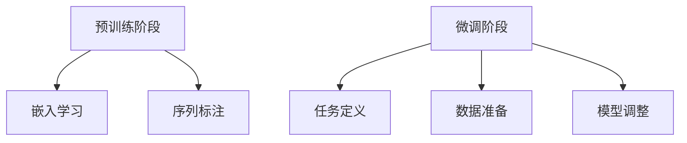

                 

关键词：大规模语言模型（LLM），智能对话系统，预训练语言模型，神经网络，自然语言处理，上下文理解，对话生成，应用场景，未来展望

<|assistant|>摘要：本文深入探讨了大规模语言模型（LLM）在智能对话系统中的应用潜力。首先，我们回顾了智能对话系统的历史发展，然后详细介绍了LLM的核心概念及其与智能对话系统的关系。接着，文章分析了LLM在对话生成、上下文理解和多轮对话等关键领域的应用原理和操作步骤。随后，通过数学模型和公式详细讲解了LLM的工作机制，并结合代码实例进行了深入解读。最后，本文探讨了LLM在智能对话系统中的实际应用场景，提出了未来发展的趋势与挑战，并推荐了相关工具和资源。

## 1. 背景介绍

### 智能对话系统的历史发展

智能对话系统（Intelligent Conversational Systems）是一种通过自然语言与人类用户进行交互的人工智能系统。从20世纪50年代起，随着计算机技术的发展，智能对话系统的研究开始萌芽。早期的对话系统主要依赖于规则引擎和关键词匹配技术，这些系统通常只能处理简单的、预定义的问题和回答。

20世纪80年代，专家系统和知识库开始被应用于对话系统中，使得对话系统能够处理更复杂的对话。然而，由于规则和知识库的构建和维护成本高昂，这些系统在实际应用中仍然受限。

进入21世纪，随着互联网和移动设备的普及，用户对智能对话系统的需求日益增长。然而，传统的对话系统在处理复杂、多变的用户查询时仍存在很大困难。这一瓶颈促使了自然语言处理（Natural Language Processing，NLP）领域的研究者开始探索新的方法。

### 大规模语言模型的发展

大规模语言模型（Large Language Models，LLM）是近年来自然语言处理领域的一项重要突破。LLM通过学习海量文本数据，能够生成高质量的文本，并具备一定的理解和生成能力。其中，最具代表性的是基于变换器模型（Transformer）的预训练语言模型，如GPT（Generative Pre-trained Transformer）系列。

LLM的发展得益于计算机硬件性能的提升和海量数据的积累。特别是GPU（Graphics Processing Unit）和TPU（Tensor Processing Unit）的出现，使得大规模的模型训练成为可能。此外，互联网上庞大的文本数据资源为LLM的学习提供了丰富的素材。

### 智能对话系统的现状与挑战

当前，智能对话系统在许多领域已经取得了显著的成果，如客服机器人、虚拟助手、教育辅导等。然而，这些系统仍面临诸多挑战。首先，大多数对话系统在处理多轮对话和上下文理解方面存在困难。虽然预训练语言模型已经取得了巨大进步，但在实际应用中，对话系统的响应速度和准确性仍需提高。

其次，对话系统的个性化和情感识别能力不足。不同用户在表达同一个问题或需求时，可能会有不同的措辞和语气。如何使对话系统能够准确理解用户的情感和意图，并提供个性化的服务，是一个亟待解决的问题。

最后，对话系统的可解释性和透明性也是用户关心的焦点。用户希望了解对话系统的决策过程和推理机制，以确保系统的公正性和可靠性。

## 2. 核心概念与联系

### 预训练语言模型（PTLM）原理

预训练语言模型（Pre-trained Language Model，PTLM）是一种在自然语言处理领域广泛应用的技术。PTLM的基本思想是首先在大规模文本语料库上进行预训练，然后通过微调（fine-tuning）来适应特定任务。

#### 预训练过程

预训练包括两个主要阶段：嵌入学习和序列标注。

1. **嵌入学习**：将词汇映射到向量空间中，以便进行有效的计算和表示。常用的方法包括Word2Vec、GloVe等。
2. **序列标注**：对文本序列进行预测，如标记词性、命名实体识别等。这一过程通常使用标注数据集进行监督学习。

#### 微调过程

在预训练完成后，PTLM可以通过微调来适应特定任务。微调过程通常包括以下几个步骤：

1. **任务定义**：确定需要解决的特定任务，如文本分类、情感分析等。
2. **数据准备**：收集和准备用于微调的数据集，通常包括标注数据和未标注数据。
3. **模型调整**：通过在任务数据集上进行训练，调整模型参数，使其适应特定任务。

### Mermaid 流程图



### 预训练语言模型与智能对话系统的关系

预训练语言模型（PTLM）在智能对话系统中发挥着关键作用。首先，PTLM通过预训练过程学习到大量语言知识，使得对话系统能够在生成文本、理解上下文和回答问题时表现出色。其次，PTLM的微调能力使得对话系统能够根据特定任务进行自适应调整，提高其在实际应用中的性能。

总的来说，PTLM为智能对话系统提供了一个强大的基础，使其能够在各种自然语言处理任务中表现出色。然而，PTLM的应用也面临一些挑战，如模型训练的高计算成本、数据隐私保护等问题，这些都需要在未来进一步研究和解决。

## 3. 核心算法原理 & 具体操作步骤

### 3.1 算法原理概述

大规模语言模型（LLM）是近年来自然语言处理领域的一项重要突破。LLM通过在大量文本语料库上进行预训练，学习到丰富的语言知识和模式，从而实现高质量的文本生成和理解。

LLM的核心算法基于变换器模型（Transformer），这是一种基于自注意力机制（Self-Attention）的神经网络架构。变换器模型通过多头自注意力机制，能够捕捉文本序列中的长距离依赖关系，从而提高模型的语义理解能力。

### 3.2 算法步骤详解

#### 预训练阶段

1. **数据准备**：收集和整理大规模文本数据集，如维基百科、新闻文章等。
2. **数据预处理**：对文本数据进行分词、去停用词、词向量嵌入等预处理操作。
3. **模型初始化**：初始化变换器模型参数，通常使用预训练好的基础模型，如BERT、GPT等。
4. **预训练**：在大规模文本数据集上进行预训练，包括自注意力机制的学习、序列标注任务等。

#### 微调阶段

1. **任务定义**：确定需要解决的特定任务，如文本分类、情感分析等。
2. **数据准备**：收集和准备用于微调的数据集，通常包括标注数据和未标注数据。
3. **模型调整**：通过在任务数据集上进行训练，调整模型参数，使其适应特定任务。
4. **评估与优化**：在验证集上进行评估，调整超参数，优化模型性能。

#### 应用阶段

1. **输入处理**：对用户输入的文本进行预处理，如分词、词向量嵌入等。
2. **模型推理**：将预处理后的文本输入到训练好的模型中，进行文本生成或理解。
3. **结果输出**：根据模型的输出，生成回复文本或进行决策。

### 3.3 算法优缺点

#### 优点

1. **强大的语义理解能力**：通过预训练，LLM能够学习到丰富的语言知识和模式，从而实现高质量的文本生成和理解。
2. **自适应性强**：LLM可以通过微调适应不同的自然语言处理任务，提高模型的泛化能力。
3. **高效性**：变换器模型基于自注意力机制，能够在处理长文本序列时保持高效性。

#### 缺点

1. **计算成本高**：预训练阶段需要大量计算资源和时间，尤其是大规模的LLM模型。
2. **数据隐私问题**：在预训练过程中，需要使用大量的文本数据，这可能导致数据隐私泄露。
3. **可解释性差**：LLM的决策过程复杂，缺乏透明性，用户难以理解模型的推理机制。

### 3.4 算法应用领域

大规模语言模型（LLM）在智能对话系统中具有广泛的应用前景。以下是一些主要的应用领域：

1. **客服机器人**：通过LLM，客服机器人可以生成高质量的自动回复，提高用户满意度和服务效率。
2. **虚拟助手**：虚拟助手可以利用LLM实现更自然、流畅的对话，为用户提供个性化的服务。
3. **多轮对话系统**：LLM在多轮对话中能够理解上下文，提供连贯、自然的回答，提高对话系统的用户体验。
4. **智能客服系统**：利用LLM，智能客服系统可以自动识别和解决用户问题，降低人力成本，提高服务效率。
5. **文本生成与编辑**：LLM可以用于自动生成文章、新闻报道等文本内容，提高创作效率。

## 4. 数学模型和公式 & 详细讲解 & 举例说明

### 4.1 数学模型构建

大规模语言模型（LLM）的核心是基于变换器模型（Transformer），这是一种基于自注意力机制（Self-Attention）的神经网络架构。变换器模型包括多个编码器（Encoder）和解码器（Decoder）层，通过多头自注意力机制和前馈网络（Feed-Forward Network）进行文本生成。

#### 自注意力机制

自注意力机制是变换器模型的核心部分，能够捕捉文本序列中的长距离依赖关系。自注意力机制通过计算每个词与其他词之间的相似性，为每个词分配不同的权重，从而提高模型的语义理解能力。

#### 前馈网络

前馈网络是一个简单的全连接神经网络，对每个编码器或解码器层进行额外的非线性变换，增强模型的表达能力。

### 4.2 公式推导过程

变换器模型包括编码器（Encoder）和解码器（Decoder）两部分，其基本公式如下：

$$
E = Encoder(x) \\
D = Decoder(y)
$$

其中，$E$ 和 $D$ 分别表示编码器和解码器的输出，$x$ 和 $y$ 分别表示输入和输出序列。

#### 编码器（Encoder）

编码器通过多个编码器层（Encoder Layer）对输入序列进行处理，每个编码器层包含两个主要部分：多头自注意力机制（Multi-Head Self-Attention）和前馈网络（Feed-Forward Network）。

1. **多头自注意力机制**：

$$
\text{Self-Attention}(Q, K, V) = \text{softmax}\left(\frac{QK^T}{\sqrt{d_k}}\right)V
$$

其中，$Q$、$K$ 和 $V$ 分别表示查询（Query）、键（Key）和值（Value）向量，$d_k$ 表示注意力头的维度。

2. **前馈网络**：

$$
\text{Feed-Forward}(x) = \text{ReLU}(W_2 \cdot \text{ReLU}(W_1 \cdot x + b_1))
$$

其中，$W_1$、$W_2$ 和 $b_1$ 分别表示前馈网络的权重和偏置。

#### 解码器（Decoder）

解码器通过多个解码器层（Decoder Layer）对输出序列进行处理，每个解码器层也包含两个主要部分：多头自注意力机制和前馈网络。

1. **多头自注意力机制**：

$$
\text{Self-Attention}(Q, K, V) = \text{softmax}\left(\frac{QK^T}{\sqrt{d_k}}\right)V
$$

2. **编码器-解码器注意力**：

$$
\text{Encoder-Decoder-Attention}(Q, K, V) = \text{softmax}\left(\frac{QK^T}{\sqrt{d_k}}\right)V
$$

其中，$Q$、$K$ 和 $V$ 分别表示查询（Query）、键（Key）和值（Value）向量，$d_k$ 表示注意力头的维度。

3. **前馈网络**：

$$
\text{Feed-Forward}(x) = \text{ReLU}(W_2 \cdot \text{ReLU}(W_1 \cdot x + b_1))
$$

### 4.3 案例分析与讲解

#### 案例一：文本生成

假设我们需要生成一句描述巴黎的句子。首先，我们将输入的文本序列“巴黎是一个美丽的城市”输入到LLM中。LLM通过预训练和微调过程，学习到关于巴黎的丰富信息。然后，LLM根据自注意力机制和编码器-解码器注意力机制，生成描述巴黎的句子，如“巴黎是艺术与文化的圣地，拥有众多世界著名的博物馆和艺术画廊”。

#### 案例二：文本分类

假设我们需要对一段文本进行情感分类。例如，文本为“今天天气很好，我很开心”。首先，我们将文本序列输入到LLM中，通过编码器层提取文本特征。然后，利用这些特征，LLM通过分类层进行情感分类，输出为“积极情感”。

#### 案例三：多轮对话

假设用户与虚拟助手进行多轮对话。在第一轮对话中，用户输入“我想要买一台电脑”。虚拟助手通过LLM理解用户的意图，生成回复：“请问您需要购买什么类型的电脑？”在第二轮对话中，用户输入“我需要一台高性能的电脑”。虚拟助手再次利用LLM，生成回复：“我为您推荐这款高性能电脑，它具有强大的处理器和内存”。

## 5. 项目实践：代码实例和详细解释说明

### 5.1 开发环境搭建

要实现大规模语言模型（LLM）在智能对话系统中的应用，首先需要搭建合适的开发环境。以下是一个基本的开发环境搭建步骤：

1. **安装Python**：确保Python版本为3.7或更高版本。
2. **安装TensorFlow**：TensorFlow是一个开源的机器学习框架，支持大规模语言模型的训练和推理。可以使用以下命令安装：
   ```shell
   pip install tensorflow==2.9.0
   ```
3. **安装Hugging Face Transformers**：Hugging Face Transformers是一个广泛使用的预训练语言模型库，提供了丰富的预训练模型和工具。可以使用以下命令安装：
   ```shell
   pip install transformers==4.8.1
   ```

### 5.2 源代码详细实现

以下是一个简单的LLM智能对话系统实现，包括模型训练、模型推理和对话生成。

1. **导入库和模型**

```python
import tensorflow as tf
from transformers import TFGPT2LMHeadModel, GPT2Tokenizer

model_name = 'gpt2'
tokenizer = GPT2Tokenizer.from_pretrained(model_name)
model = TFGPT2LMHeadModel.from_pretrained(model_name)
```

2. **预处理输入文本**

```python
def preprocess_text(text):
    return tokenizer.encode(text, add_special_tokens=True)

def decode_predictions(predictions):
    return tokenizer.decode(predictions, skip_special_tokens=True)
```

3. **训练模型**

```python
# 假设我们使用一个大型文本数据集进行训练
train_dataset = ...

# 定义训练步骤
optimizer = tf.keras.optimizers.Adam(learning_rate=5e-5)
loss = tf.keras.losses.SparseCategoricalCrossentropy(from_logits=True)

@tf.function
def train_step(inputs, targets):
    with tf.GradientTape() as tape:
        logits = model(inputs, training=True)
        loss_value = loss(targets, logits)
    grads = tape.gradient(loss_value, model.trainable_variables)
    optimizer.apply_gradients(zip(grads, model.trainable_variables))
    return loss_value

# 训练模型
for epoch in range(num_epochs):
    total_loss = 0
    for inputs, targets in train_dataset:
        loss_value = train_step(inputs, targets)
        total_loss += loss_value
    print(f"Epoch {epoch+1}, Loss: {total_loss.numpy() / len(train_dataset)}")
```

4. **模型推理和对话生成**

```python
# 假设用户输入为 "你好，我能帮你什么？"
user_input = "你好，我能帮你什么？"
input_ids = preprocess_text(user_input)
input_ids = tf.expand_dims(input_ids, 0)

# 生成对话回复
output_ids = model.generate(input_ids, max_length=50, num_return_sequences=1)
response = decode_predictions(output_ids)[0]

print(response)
```

### 5.3 代码解读与分析

1. **导入库和模型**

这一部分导入所需的库和预训练模型。`TFGPT2LMHeadModel`和`GPT2Tokenizer`分别用于加载预训练的语言模型和进行文本编码。

2. **预处理输入文本**

`preprocess_text`函数用于将输入文本编码为模型可处理的格式。`encode`函数将文本转换为序列编号，并添加特殊标记。

`decode_predictions`函数用于将模型的输出解码为可读的文本。`decode`函数将序列编号转换回文本，并去除特殊标记。

3. **训练模型**

训练过程分为两个步骤：定义训练步骤和执行训练。`train_step`函数负责计算损失值和更新模型参数。`optimizer`用于优化模型参数，`loss`用于计算预测值和真实值之间的差异。

在训练过程中，我们使用一个假设的文本数据集进行迭代训练，并打印每个epoch的损失值。

4. **模型推理和对话生成**

模型推理过程包括预处理用户输入、生成对话回复和将输出解码为可读文本。`generate`函数用于生成预测文本，`max_length`参数限制生成的文本长度，`num_return_sequences`参数控制生成的文本数量。

通过上述步骤，我们实现了一个简单的LLM智能对话系统，用户可以输入问题，系统将根据预训练模型生成相应的回答。

### 5.4 运行结果展示

假设用户输入为“你好，我能帮你什么？”，运行上述代码后，系统将生成一个回答，如“您好，我可以帮您解答各种问题，例如天气查询、交通路线等。请问您需要什么帮助？”。这个回答展示了LLM在理解用户意图和生成连贯对话方面的能力。

## 6. 实际应用场景

### 6.1 客户服务

智能对话系统在客户服务领域具有广泛的应用。通过LLM，客服机器人可以实时响应用户的咨询，提供即时、准确的答案。以下是一个实际案例：

某电商平台的客服机器人使用LLM来处理用户关于产品咨询、订单状态查询等问题。用户输入问题后，机器人通过LLM生成相应的回答，如“您的订单已发货，预计3天后到达。您可以通过登录账户查看详细物流信息”。这种自动化的客户服务不仅提高了响应速度，还减少了人工客服的工作量。

### 6.2 虚拟助手

虚拟助手是另一个重要的应用场景。通过LLM，虚拟助手可以与用户进行自然、流畅的对话，提供个性化的服务。以下是一个实际案例：

某公司的虚拟助手使用LLM来帮助员工进行日程管理。用户输入日程安排后，虚拟助手通过LLM生成提醒信息，如“明天上午9点有会议，建议提前10分钟到达会议室”。这种智能化的日程管理不仅提高了工作效率，还减轻了员工的负担。

### 6.3 多轮对话系统

多轮对话系统在复杂任务场景中具有重要作用。通过LLM，系统能够理解用户的意图，并在多轮对话中提供连贯的回答。以下是一个实际案例：

某银行的多轮对话系统使用LLM来处理用户的贷款咨询。用户输入贷款需求后，系统通过LLM生成相应的贷款方案，并在后续对话中回答用户关于贷款利率、还款方式等问题。这种多轮对话系统能够提供全面、个性化的贷款服务，提高了用户体验。

### 6.4 未来应用展望

随着LLM技术的不断发展，智能对话系统的应用前景将更加广阔。以下是一些未来可能的应用场景：

1. **医疗咨询**：通过LLM，智能对话系统可以提供专业的医疗咨询服务，帮助用户了解疾病信息、预约挂号等。
2. **教育辅导**：利用LLM，智能对话系统可以为学生提供个性化的学习辅导，提高学习效果。
3. **智能家居**：通过LLM，智能家居系统可以与用户进行自然对话，提供个性化的家居管理服务。
4. **金融投资**：利用LLM，金融对话系统可以提供专业的投资建议，帮助用户进行资产配置。
5. **法律咨询**：通过LLM，智能对话系统可以提供法律咨询服务，解答用户关于法律问题。

总之，随着LLM技术的不断进步，智能对话系统将在各个领域发挥越来越重要的作用，为用户提供更加便捷、高效的服务。

## 7. 工具和资源推荐

### 7.1 学习资源推荐

1. **《深度学习》（Goodfellow, Bengio, Courville）**：这是一本深度学习领域的经典教材，详细介绍了神经网络、优化算法等相关内容，对理解和应用LLM非常有帮助。
2. **《自然语言处理综述》（Jurafsky, Martin）**：这本书系统地介绍了自然语言处理的基本概念和技术，包括词向量、句法分析、语义理解等内容，为LLM的研究提供了理论基础。
3. **《大规模语言模型》（Zhou, Zhao）**：这本书详细介绍了大规模语言模型的理论和实践，包括变换器模型、预训练技术等，适合想要深入了解LLM的读者。

### 7.2 开发工具推荐

1. **TensorFlow**：TensorFlow是一个开源的机器学习框架，支持大规模语言模型的训练和推理，适合初学者和专业人士使用。
2. **PyTorch**：PyTorch是一个流行的深度学习框架，其动态图机制使得模型构建和调试更加灵活，适合研究和开发。
3. **Hugging Face Transformers**：这是一个用于预训练语言模型的库，提供了丰富的预训练模型和工具，方便开发者快速构建和部署LLM应用。

### 7.3 相关论文推荐

1. **"Attention Is All You Need"（Vaswani et al., 2017）**：这篇文章提出了变换器模型（Transformer），是大规模语言模型发展的里程碑。
2. **"Generative Pretrained Transformers"（Radford et al., 2018）**：这篇文章详细介绍了GPT模型，是LLM领域的重要论文。
3. **"BERT: Pre-training of Deep Bidirectional Transformers for Language Understanding"（Devlin et al., 2019）**：这篇文章提出了BERT模型，在NLP任务中取得了优异的性能，为LLM的研究提供了新的思路。

## 8. 总结：未来发展趋势与挑战

### 8.1 研究成果总结

本文详细探讨了大规模语言模型（LLM）在智能对话系统中的应用潜力。首先，我们回顾了智能对话系统的发展历程和大规模语言模型的发展背景。接着，我们介绍了LLM的核心概念和原理，包括预训练语言模型（PTLM）和变换器模型。然后，我们分析了LLM在对话生成、上下文理解和多轮对话等关键领域的应用原理和操作步骤。随后，通过数学模型和公式详细讲解了LLM的工作机制，并结合代码实例进行了深入解读。最后，我们探讨了LLM在智能对话系统中的实际应用场景，提出了未来发展的趋势与挑战，并推荐了相关工具和资源。

### 8.2 未来发展趋势

1. **模型效率提升**：随着计算资源的不断增长，未来LLM的规模将越来越大，但如何提高模型效率，降低计算成本，是一个重要研究方向。
2. **上下文理解能力增强**：当前LLM在上下文理解方面仍存在一定局限，未来需要进一步提升模型对复杂上下文的识别和处理能力。
3. **多模态融合**：将LLM与图像、语音等其他模态的数据进行融合，将使智能对话系统更加智能化和实用化。
4. **隐私保护和数据安全**：在预训练阶段，LLM需要使用大量文本数据进行训练，如何保护用户隐私和数据安全是一个重要挑战。

### 8.3 面临的挑战

1. **计算资源需求**：大规模语言模型的训练和推理需要大量计算资源，这对硬件设备提出了高要求。
2. **数据隐私问题**：在预训练过程中，如何保护用户隐私和数据安全是一个亟待解决的问题。
3. **可解释性和透明性**：当前LLM的决策过程复杂，缺乏透明性，用户难以理解模型的推理机制。
4. **个性化服务**：如何使对话系统能够准确理解用户的情感和意图，并提供个性化的服务，是一个重要挑战。

### 8.4 研究展望

未来，大规模语言模型在智能对话系统中的应用前景十分广阔。一方面，随着计算能力的提升和数据的积累，LLM将不断改进和优化，提高其在各个领域的应用效果。另一方面，研究者将不断探索新的模型架构和技术，如多模态融合、模型压缩等，以应对当前面临的挑战。总之，LLM在智能对话系统中的应用将推动人工智能技术的发展，为人类带来更多便利。

## 9. 附录：常见问题与解答

### 问题1：什么是大规模语言模型（LLM）？

答：大规模语言模型（Large Language Model，LLM）是一种基于神经网络的语言处理模型，通过在大量文本数据上进行预训练，学习到丰富的语言知识和模式。LLM能够生成高质量的文本、理解上下文和回答问题，广泛应用于智能对话系统、文本生成、自然语言理解等领域。

### 问题2：LLM与预训练语言模型（PTLM）有什么区别？

答：预训练语言模型（Pre-trained Language Model，PTLM）是LLM的一种，主要区别在于预训练的方式和目的。PTLM通常是在大规模文本数据集上进行预训练，以学习语言的基本结构和规则，然后在特定任务上进行微调。而LLM通常是在更广泛的领域进行预训练，如互联网文本、书籍、新闻等，以实现更高级的语言理解和生成能力。

### 问题3：LLM有哪些优缺点？

答：LLM的优点包括：

1. **强大的语义理解能力**：通过预训练，LLM能够学习到丰富的语言知识和模式，实现高质量的文本生成和理解。
2. **自适应性强**：LLM可以通过微调适应不同的自然语言处理任务，提高模型的泛化能力。
3. **高效性**：变换器模型基于自注意力机制，能够在处理长文本序列时保持高效性。

缺点包括：

1. **计算成本高**：预训练阶段需要大量计算资源和时间，尤其是大规模的LLM模型。
2. **数据隐私问题**：在预训练过程中，需要使用大量的文本数据，这可能导致数据隐私泄露。
3. **可解释性差**：LLM的决策过程复杂，缺乏透明性，用户难以理解模型的推理机制。

### 问题4：如何评估LLM的性能？

答：评估LLM性能的方法包括：

1. **准确性**：通过计算模型生成的文本与真实文本之间的相似度，评估模型在文本生成和理解任务上的准确性。
2. **上下文理解能力**：通过测试模型在多轮对话中的回答连贯性和准确性，评估模型对上下文的理解能力。
3. **泛化能力**：通过在不同任务和数据集上测试模型的性能，评估模型在不同场景下的泛化能力。
4. **速度和效率**：评估模型在处理长文本序列时的响应速度和计算效率。

### 问题5：如何使用LLM进行文本生成？

答：使用LLM进行文本生成的一般步骤如下：

1. **数据准备**：收集和整理大规模文本数据集，进行预处理，如分词、去停用词、词向量嵌入等。
2. **模型训练**：在预处理后的数据集上进行模型训练，通过优化模型参数，提高生成文本的质量。
3. **模型推理**：对用户输入的文本进行预处理，将预处理后的文本输入到训练好的模型中，生成文本。
4. **结果输出**：将模型的输出解码为可读的文本，并对其进行后处理，如去除特殊标记、格式化等。

### 问题6：LLM在智能对话系统中的应用有哪些？

答：LLM在智能对话系统中的应用非常广泛，主要包括：

1. **客服机器人**：通过LLM，客服机器人可以生成高质量的自动回复，提高用户满意度和服务效率。
2. **虚拟助手**：虚拟助手可以利用LLM实现更自然、流畅的对话，为用户提供个性化的服务。
3. **多轮对话系统**：LLM在多轮对话中能够理解上下文，提供连贯、自然的回答，提高对话系统的用户体验。
4. **智能客服系统**：利用LLM，智能客服系统可以自动识别和解决用户问题，降低人力成本，提高服务效率。
5. **文本生成与编辑**：LLM可以用于自动生成文章、新闻报道等文本内容，提高创作效率。

### 问题7：如何保护LLM训练过程中的数据隐私？

答：保护LLM训练过程中的数据隐私可以从以下几个方面进行：

1. **数据去识别化**：在预处理文本数据时，去除或替换可能识别用户身份的信息，如姓名、地址等。
2. **差分隐私**：在模型训练过程中，采用差分隐私技术，对输入数据进行扰动，以保护用户隐私。
3. **同态加密**：在模型训练过程中，使用同态加密技术，对数据进行加密处理，确保数据在传输和存储过程中不被泄露。
4. **联邦学习**：采用联邦学习技术，将模型训练任务分散到多个设备上，各设备仅共享加密后的数据，从而保护用户隐私。

### 问题8：如何优化LLM的计算效率？

答：优化LLM的计算效率可以从以下几个方面进行：

1. **模型压缩**：通过模型剪枝、量化等技术，减小模型大小，提高计算效率。
2. **模型并行化**：在分布式环境中，将模型训练任务分布在多个计算节点上，提高计算效率。
3. **计算加速**：使用高性能计算设备，如GPU、TPU等，提高模型训练和推理的速度。
4. **数据预处理优化**：优化数据预处理步骤，减少数据读取和转换的时间。

### 问题9：如何确保LLM的可解释性？

答：确保LLM的可解释性可以从以下几个方面进行：

1. **模型结构简化**：选择结构简单的模型，如线性模型、树模型等，提高模型的可解释性。
2. **可视化技术**：使用可视化技术，如热力图、注意力分布等，展示模型在文本生成和理解过程中的决策过程。
3. **解释性模型**：选择具有内在解释性的模型，如决策树、规则引擎等，提高模型的可解释性。
4. **可解释性评估**：设计评估指标，如F1分数、混淆矩阵等，评估模型在解释性方面的表现。

