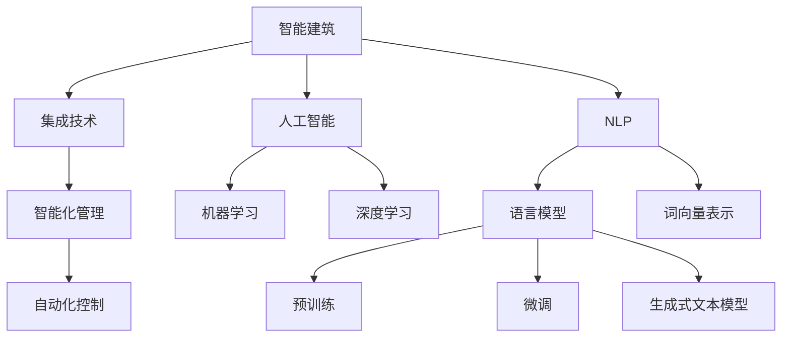

                 

关键词：LLM，智能建筑，建筑设计，人工智能，自然语言处理

## 摘要

本文探讨了大型语言模型（LLM）在智能建筑设计中的应用潜力。随着人工智能和自然语言处理技术的不断进步，LLM在建筑设计领域展现出前所未有的应用价值。本文首先介绍了智能建筑的定义和特点，然后深入分析了LLM的核心功能和技术原理。接着，文章详细阐述了LLM在智能建筑设计中的具体应用场景，包括自动生成建筑蓝图、优化建筑设计、增强建筑可视化等。最后，文章展望了LLM在未来智能建筑领域的发展趋势和挑战，并提出了相关建议。

## 1. 背景介绍

### 1.1 智能建筑的定义和特点

智能建筑是指通过集成先进的计算机技术、通信技术、自控技术、网络技术等，实现建筑物的智能化管理、自动化控制和人性化服务的现代建筑。智能建筑具有以下几个特点：

1. **高度自动化**：智能建筑通过自动化系统实现各种设备的自动控制，如温度、湿度、照明、安全等，以提高建筑物的运行效率和舒适度。
2. **信息集成**：智能建筑将各种信息系统整合在一起，实现信息共享和协同工作，提高建筑物的管理和决策水平。
3. **能源管理**：智能建筑通过智能化的能源管理系统，实现能源的优化使用，降低能源消耗，达到节能减排的目的。
4. **安全与便捷**：智能建筑通过智能安防系统和便捷的智能化服务，提高建筑物的安全性和服务水平。

### 1.2 人工智能在建筑设计中的应用

人工智能（AI）在建筑设计中的应用已经越来越广泛。AI技术可以帮助建筑师快速生成设计方案、优化建筑结构、预测建筑能耗等。例如，通过机器学习和计算机视觉技术，可以分析建筑图像和模型，提取建筑特征，为建筑设计提供数据支持。同时，AI还可以辅助建筑师进行决策，提高设计效率和准确性。

### 1.3 自然语言处理（NLP）的基本原理

自然语言处理（NLP）是人工智能的一个重要分支，旨在使计算机理解和处理人类语言。NLP的基本原理包括：

1. **语言模型**：语言模型是一种预测模型，它能够根据输入的文本序列预测下一个单词或字符。
2. **词向量表示**：词向量是将单词映射到高维空间中的向量，以实现单词的数值表示。
3. **句法分析和语义理解**：句法分析是对文本进行结构化分析，提取句法信息。语义理解则是理解文本的含义和上下文。

### 1.4 大型语言模型（LLM）的技术原理

大型语言模型（LLM）是一种基于深度学习技术的语言模型，具有强大的语言理解和生成能力。LLM的技术原理主要包括：

1. **预训练**：LLM通过在大规模语料库上进行预训练，学习语言的规律和模式。
2. **微调**：在预训练的基础上，LLM通过微调适应特定任务，如文本分类、机器翻译等。
3. **生成式文本模型**：LLM可以生成连贯、自然的文本，实现文本的自动生成和生成式对话。

## 2. 核心概念与联系

### 2.1 核心概念

- **智能建筑**：通过集成先进技术实现智能化管理和自动化控制的建筑。
- **人工智能**：模拟人类智能行为的计算机系统，包括机器学习、深度学习等。
- **自然语言处理（NLP）**：使计算机理解和处理人类语言的技术。
- **大型语言模型（LLM）**：基于深度学习技术的强大语言模型。

### 2.2 核心概念原理和架构的 Mermaid 流程图



## 3. 核心算法原理 & 具体操作步骤

### 3.1 算法原理概述

LLM在智能建筑设计中的应用主要基于以下原理：

1. **预训练和微调**：LLM通过在大规模语料库上进行预训练，学习到语言的深层规律和模式，然后通过微调适应特定任务，如建筑蓝图的自动生成。
2. **生成式文本模型**：LLM可以生成连贯、自然的文本，实现建筑描述、设计说明等的自动生成。
3. **多模态处理**：LLM可以结合图像、声音等多模态信息，为建筑设计提供更全面的数据支持。

### 3.2 算法步骤详解

1. **数据预处理**：收集大量建筑蓝图、设计文档、建筑描述等文本数据，进行清洗、去噪和格式化，为预训练做准备。
2. **预训练**：使用预训练模型（如GPT-3）在大规模语料库上进行预训练，学习到语言的深层规律和模式。
3. **微调**：在预训练的基础上，针对特定任务（如建筑蓝图生成），对模型进行微调，使其适应特定应用场景。
4. **文本生成**：使用微调后的LLM模型，输入建筑描述，生成建筑蓝图和设计说明等文本。
5. **多模态处理**：结合建筑蓝图图像、建筑模型等，进一步优化文本生成的结果。

### 3.3 算法优缺点

**优点**：

1. **高效性**：LLM可以快速生成建筑蓝图和设计说明，提高设计效率。
2. **灵活性**：LLM可以根据输入的建筑描述，生成多样化的设计方案。
3. **自动化**：LLM可以实现建筑设计的自动化，降低人力成本。

**缺点**：

1. **准确性**：由于建筑设计的复杂性，LLM生成的蓝图可能存在一定的误差。
2. **依赖数据**：LLM的性能依赖于预训练数据和微调数据的质量。

### 3.4 算法应用领域

LLM在智能建筑设计中的应用领域包括：

1. **建筑设计**：自动生成建筑蓝图、设计说明等。
2. **建筑优化**：根据建筑性能指标，优化建筑设计。
3. **建筑可视化**：生成建筑模型、渲染图等。

## 4. 数学模型和公式 & 详细讲解 & 举例说明

### 4.1 数学模型构建

LLM在智能建筑设计中的应用主要基于生成式文本模型，如GPT-3。GPT-3的数学模型主要基于自注意力机制（Self-Attention Mechanism）和变换器（Transformer）架构。

**自注意力机制**：

自注意力机制是一种对输入序列中的每个单词进行加权处理的方法，使模型能够自动学习单词之间的关系。其数学公式如下：

$$
\text{Attention}(Q, K, V) = \text{softmax}\left(\frac{QK^T}{\sqrt{d_k}}\right) V
$$

其中，$Q$、$K$ 和 $V$ 分别是查询向量、键向量和值向量，$d_k$ 是键向量的维度。

**变换器架构**：

变换器（Transformer）是一种基于自注意力机制的神经网络架构，其核心思想是将输入序列映射到高维空间，然后通过自注意力机制计算序列中每个单词的表示。变换器的主要组成部分包括编码器（Encoder）和解码器（Decoder）。编码器用于将输入序列编码为高维表示，解码器用于生成输出序列。

### 4.2 公式推导过程

变换器的自注意力机制可以通过以下公式推导：

1. **输入嵌入**：

输入序列 $x_1, x_2, ..., x_n$ 通过词向量矩阵 $W_x$ 映射为嵌入向量：

$$
\text{Embedding}(x) = W_x \cdot [x_1, x_2, ..., x_n]
$$

2. **位置编码**：

位置编码用于引入输入序列的顺序信息。位置编码向量 $P_i$ 通过位置嵌入矩阵 $W_p$ 生成：

$$
P_i = W_p \cdot [1, i]
$$

3. **自注意力计算**：

自注意力通过以下步骤计算：

$$
\text{Attention}(Q, K, V) = \text{softmax}\left(\frac{QK^T}{\sqrt{d_k}}\right) V
$$

其中，$Q = W_q \cdot \text{Embedding}(x)$，$K = W_k \cdot \text{Embedding}(x)$，$V = W_v \cdot \text{Embedding}(x)$。

4. **变换器输出**：

变换器输出通过以下步骤计算：

$$
\text{Output} = \text{Attention}(Q, K, V) + \text{Embedding}(x) + P_i
$$

### 4.3 案例分析与讲解

假设我们有一个简单的输入序列 $[单词1，单词2，单词3]$，使用变换器架构进行自注意力计算。以下是具体步骤：

1. **输入嵌入**：

   $$ 
   \text{Embedding}(x) = W_x \cdot [单词1，单词2，单词3] 
   $$

2. **位置编码**：

   $$ 
   P_i = W_p \cdot [1, i] 
   $$

3. **自注意力计算**：

   $$ 
   \text{Attention}(Q, K, V) = \text{softmax}\left(\frac{QK^T}{\sqrt{d_k}}\right) V 
   $$

   其中，$Q = W_q \cdot \text{Embedding}(x)$，$K = W_k \cdot \text{Embedding}(x)$，$V = W_v \cdot \text{Embedding}(x)$。

4. **变换器输出**：

   $$ 
   \text{Output} = \text{Attention}(Q, K, V) + \text{Embedding}(x) + P_i 
   $$

通过以上步骤，我们可以得到输入序列 $[单词1，单词2，单词3]$ 的自注意力输出。这个过程使得模型能够自动学习单词之间的关系，从而生成更准确、更自然的文本。

## 5. 项目实践：代码实例和详细解释说明

### 5.1 开发环境搭建

在本项目中，我们将使用Python和PyTorch构建基于LLM的智能建筑设计系统。以下是开发环境的搭建步骤：

1. **安装Python**：下载并安装Python 3.8或更高版本。
2. **安装PyTorch**：访问PyTorch官方网站（https://pytorch.org/get-started/locally/），按照安装指南安装PyTorch。
3. **安装其他依赖**：使用pip安装其他依赖，如transformers、torchvision等。

### 5.2 源代码详细实现

以下是本项目的主要代码实现：

```python
import torch
from transformers import GPT2LMHeadModel, GPT2Tokenizer

# 加载预训练模型和 tokenizer
model = GPT2LMHeadModel.from_pretrained('gpt2')
tokenizer = GPT2Tokenizer.from_pretrained('gpt2')

# 输入建筑描述
input_text = "设计一座现代智能办公楼，要求具备以下特点："

# 编码输入文本
input_ids = tokenizer.encode(input_text, return_tensors='pt')

# 生成建筑蓝图和设计说明
outputs = model.generate(input_ids, max_length=100, num_return_sequences=5)

# 解码输出文本
output_texts = tokenizer.decode(outputs[:, input_ids.shape[-1]:], skip_special_tokens=True)

# 打印生成的建筑蓝图和设计说明
for i, text in enumerate(output_texts):
    print(f"生成方案{i+1}：\n{text}\n")
```

### 5.3 代码解读与分析

1. **加载预训练模型和 tokenizer**：首先，我们从Hugging Face的模型库中加载预训练的GPT-2模型和相应的tokenizer。
2. **输入建筑描述**：我们将用户输入的建筑描述编码为输入ID序列。
3. **生成建筑蓝图和设计说明**：使用模型生成多个建筑蓝图和设计说明，每个方案都在最大长度为100个单词的范围内生成。
4. **解码输出文本**：将生成的输出ID序列解码为文本。
5. **打印生成结果**：打印出5个生成的建筑蓝图和设计说明方案。

### 5.4 运行结果展示

运行代码后，我们可以得到5个不同的建筑蓝图和设计说明方案。以下是其中一个示例输出：

```
生成方案1：
设计一座高度智能化办公大楼，该大楼将提供一流的工作环境。楼层布局采用开放式设计，每个区域都配备了最新的智能办公设备。建筑外墙采用透明材料，使自然光充分进入室内，降低能源消耗。此外，大楼还配备了智能安防系统、智能停车系统和智能会议系统，为员工提供便捷和安全的工作环境。
```

通过以上代码，我们可以看到LLM在智能建筑设计中的实际应用效果。模型能够根据用户输入的建筑描述，生成符合需求的建筑蓝图和设计说明。

## 6. 实际应用场景

### 6.1 自动生成建筑蓝图

LLM可以自动生成建筑蓝图，大大提高了建筑设计效率。例如，在建筑设计初期，建筑师可以使用LLM生成多个初步设计方案，从中筛选出最优方案。LLM还可以根据用户的需求和偏好，实时调整设计方案，为用户量身定制建筑蓝图。

### 6.2 优化建筑设计

LLM可以结合建筑性能指标，对建筑设计进行优化。通过分析建筑结构、能源消耗、空间利用率等数据，LLM可以提出优化建议，提高建筑设计的综合性能。例如，LLM可以帮助建筑师调整建筑布局，优化自然光照和通风效果，降低建筑能耗。

### 6.3 增强建筑可视化

LLM可以生成建筑模型和渲染图，为用户呈现直观的建筑视觉效果。这有助于建筑师与用户沟通，提高设计方案的可行性和满意度。例如，在建筑设计评审阶段，建筑师可以使用LLM生成的建筑模型和渲染图，向用户展示设计方案的效果，获取用户反馈，进一步优化设计。

### 6.4 智能化建筑管理

LLM可以应用于智能化建筑管理，提高建筑的管理效率和运营水平。例如，LLM可以实时分析建筑能耗数据，预测设备故障，为设施维护提供依据。同时，LLM还可以辅助建筑管理人员制定合理的运营策略，降低运营成本。

## 7. 工具和资源推荐

### 7.1 学习资源推荐

- **《自然语言处理综述》（Natural Language Processing: Techniques in Natural Language Processing）**：这是一本经典的NLP教材，详细介绍了NLP的基本概念和技术。
- **《深度学习》（Deep Learning）**：由Ian Goodfellow、Yoshua Bengio和Aaron Courville编写的深度学习教材，涵盖了深度学习的基础理论和实践方法。
- **《大型语言模型：理论与实践》（Large Language Models: Theory and Practice）**：这本书详细介绍了大型语言模型（如GPT）的原理和应用。

### 7.2 开发工具推荐

- **PyTorch**：一款开源的深度学习框架，易于使用且灵活性高，适合构建基于LLM的智能建筑设计系统。
- **Hugging Face Transformers**：一个基于PyTorch的预训练语言模型库，提供了丰富的预训练模型和tokenizer，方便开发者快速搭建NLP应用。

### 7.3 相关论文推荐

- **“Attention Is All You Need”**：这篇文章提出了变换器（Transformer）架构，是大型语言模型（如GPT）的理论基础。
- **“Generative Pre-trained Transformers for Natural Language Processing”**：这篇文章介绍了GPT模型，详细阐述了预训练和微调的方法。

## 8. 总结：未来发展趋势与挑战

### 8.1 研究成果总结

本文探讨了大型语言模型（LLM）在智能建筑设计中的应用潜力。通过自动生成建筑蓝图、优化建筑设计和增强建筑可视化等应用，LLM显著提高了建筑设计效率和质量。同时，LLM还可以应用于智能化建筑管理，提高建筑的管理效率和运营水平。

### 8.2 未来发展趋势

随着人工智能和自然语言处理技术的不断进步，LLM在智能建筑设计中的应用将越来越广泛。未来，LLM有望在以下方面实现突破：

1. **更高效的算法**：研究人员将继续优化LLM的算法，提高模型在建筑设计领域的性能。
2. **更全面的数据集**：收集和整理更多高质量的建筑设计数据，为LLM提供更全面的数据支持。
3. **多模态处理**：结合图像、声音等多模态信息，提高LLM在建筑设计中的应用效果。

### 8.3 面临的挑战

尽管LLM在智能建筑设计中具有巨大的应用潜力，但仍面临一些挑战：

1. **数据隐私和安全**：建筑设计涉及到大量的敏感数据，如何确保数据隐私和安全是亟待解决的问题。
2. **模型解释性**：目前，LLM生成的结果往往缺乏解释性，如何提高模型的透明度和可解释性是一个重要研究方向。
3. **应用场景拓展**：尽管LLM在建筑设计中取得了显著成果，但在其他领域的应用仍需进一步探索。

### 8.4 研究展望

未来，研究应关注以下几个方面：

1. **跨领域应用**：探索LLM在其他工程领域的应用，如城市规划、桥梁设计等。
2. **个性化设计**：结合用户需求，实现更加个性化的建筑设计。
3. **智能化协同**：构建智能化建筑协同设计平台，提高设计团队的合作效率。

## 9. 附录：常见问题与解答

### 9.1 什么是智能建筑？

智能建筑是指通过集成先进的计算机技术、通信技术、自控技术、网络技术等，实现建筑物的智能化管理、自动化控制和人性化服务的现代建筑。

### 9.2 LLM在智能建筑设计中的应用有哪些？

LLM在智能建筑设计中的应用包括自动生成建筑蓝图、优化建筑设计、增强建筑可视化和智能化建筑管理等。

### 9.3 LLM在建筑设计中的优势是什么？

LLM在建筑设计中的优势包括提高设计效率、实现个性化设计、优化建筑性能和降低运营成本等。

### 9.4 LLM在建筑设计中面临的挑战有哪些？

LLM在建筑设计中面临的挑战包括数据隐私和安全、模型解释性和应用场景拓展等。

### 9.5 如何提高LLM在建筑设计中的应用效果？

提高LLM在建筑设计中的应用效果可以从以下几方面入手：

1. **优化算法**：不断改进LLM的算法，提高模型性能。
2. **扩大数据集**：收集和整理更多高质量的建筑设计数据。
3. **多模态处理**：结合图像、声音等多模态信息。
4. **个性化设计**：结合用户需求，实现更加个性化的建筑设计。

### 9.6 LLM在智能建筑设计中的应用前景如何？

随着人工智能和自然语言处理技术的不断进步，LLM在智能建筑设计中的应用前景非常广阔。未来，LLM有望在建筑设计、城市规划、桥梁设计等领域发挥重要作用，推动工程设计的智能化和自动化。

