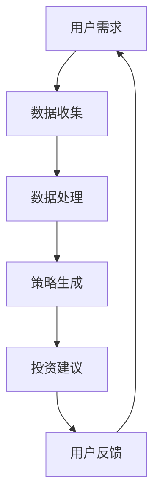

                 

关键词：LLM、智能投资顾问、金融科技、人工智能、投资策略、风险管理、自动化、机器学习

> 摘要：随着人工智能技术的不断进步，大语言模型（LLM）在多个领域展现出强大的应用潜力。本文旨在探讨LLM在智能投资顾问系统中的具体应用，通过分析其核心概念、算法原理、数学模型以及实际案例，探讨LLM如何提升投资效率和决策质量，为未来的金融科技发展提供新的思路。

## 1. 背景介绍

### 1.1 智能投资顾问的兴起

在过去的几十年里，金融市场的复杂性和信息量的爆炸式增长，使得传统的人工投资顾问模式逐渐难以满足客户的需求。智能投资顾问系统（Robo-Advisor）应运而生，通过大数据分析、机器学习算法等手段，提供个性化的投资建议和策略，极大提升了投资效率和用户体验。

### 1.2 LLM的发展

大语言模型（LLM，Large Language Model）是近年来人工智能领域的重要突破之一。LLM通过学习海量文本数据，能够生成高质量的自然语言文本，并在多种应用场景中表现出色，如机器翻译、文本生成、问答系统等。其强大的语言理解和生成能力，为智能投资顾问系统提供了新的技术支撑。

## 2. 核心概念与联系

### 2.1 大语言模型（LLM）

大语言模型是一种基于深度学习的自然语言处理模型，其核心思想是通过训练大规模的神经网络来学习语言的规律和模式，从而实现文本生成、理解、翻译等功能。

### 2.2 智能投资顾问系统

智能投资顾问系统是一种基于人工智能技术的投资服务平台，通过分析用户需求和金融市场数据，提供个性化的投资建议和策略。

### 2.3 Mermaid 流程图



## 3. 核心算法原理 & 具体操作步骤

### 3.1 算法原理概述

LLM在智能投资顾问系统中的应用主要分为以下几个步骤：

1. 数据收集与预处理：收集用户的投资需求和金融市场数据，并进行清洗、整合等预处理操作。
2. 策略生成：利用LLM生成符合用户需求和风险偏好的投资策略。
3. 投资建议：将生成的策略转化为具体的投资建议，如购买、持有、卖出等。
4. 用户反馈与优化：收集用户对投资建议的反馈，优化投资策略和模型。

### 3.2 算法步骤详解

#### 3.2.1 数据收集与预处理

数据收集主要包括用户数据和金融市场数据。用户数据包括年龄、收入、投资目标、风险偏好等；金融市场数据包括股票、基金、债券等的价格和交易量。

数据预处理步骤：

1. 数据清洗：去除重复数据、缺失数据和异常数据。
2. 数据整合：将不同来源的数据进行整合，形成统一的数据集。
3. 特征提取：从原始数据中提取对投资策略有重要影响的特征，如历史价格、成交量、技术指标等。

#### 3.2.2 策略生成

策略生成是LLM在智能投资顾问系统中的核心步骤。LLM通过学习大量金融文本数据，能够生成符合用户需求和风险偏好的投资策略。

策略生成过程：

1. 输入：用户需求、金融市场数据、历史策略数据等。
2. 输出：投资策略文本。

#### 3.2.3 投资建议

投资建议是将生成的策略转化为具体的投资操作，如购买、持有、卖出等。投资建议生成过程：

1. 输入：投资策略文本。
2. 输出：投资建议列表。

#### 3.2.4 用户反馈与优化

用户反馈是优化投资策略的重要途径。通过收集用户对投资建议的反馈，可以不断优化投资策略和模型，提高投资效果。

用户反馈与优化过程：

1. 输入：用户反馈。
2. 输出：优化后的投资策略和模型。

## 4. 数学模型和公式 & 详细讲解 & 举例说明

### 4.1 数学模型构建

智能投资顾问系统的数学模型主要包括以下三个部分：

1. 用户需求模型：用于描述用户投资目标和风险偏好。
2. 财务模型：用于模拟金融市场和资产价格。
3. 投资策略模型：用于生成和优化投资策略。

### 4.2 公式推导过程

#### 4.2.1 用户需求模型

用户需求模型可以用以下公式表示：

\[ D(t) = f(U(t), R(t)) \]

其中，\( D(t) \)表示用户在时刻\( t \)的投资需求，\( U(t) \)表示用户在时刻\( t \)的年龄、收入、投资目标等特征，\( R(t) \)表示用户在时刻\( t \)的风险偏好。

#### 4.2.2 财务模型

财务模型可以用以下公式表示：

\[ P(t) = g(S(t), V(t), I(t)) \]

其中，\( P(t) \)表示在时刻\( t \)的资产价格，\( S(t) \)表示在时刻\( t \)的股票价格，\( V(t) \)表示在时刻\( t \)的基金净值，\( I(t) \)表示在时刻\( t \)的债券收益率。

#### 4.2.3 投资策略模型

投资策略模型可以用以下公式表示：

\[ S(t) = h(D(t), P(t), C(t)) \]

其中，\( S(t) \)表示在时刻\( t \)的投资策略，\( D(t) \)表示用户在时刻\( t \)的投资需求，\( P(t) \)表示在时刻\( t \)的资产价格，\( C(t) \)表示在时刻\( t \)的佣金和税费。

### 4.3 案例分析与讲解

#### 4.3.1 案例背景

假设有一个用户，年龄30岁，年收入50万元，投资目标为子女教育基金，风险偏好为中等风险。

#### 4.3.2 案例分析

1. 用户需求模型：

\[ D(t) = f(U(t), R(t)) = f(30, 50, \text{子女教育基金}, \text{中等风险}) \]

2. 财务模型：

\[ P(t) = g(S(t), V(t), I(t)) = g(\text{股票价格}, \text{基金净值}, \text{债券收益率}) \]

3. 投资策略模型：

\[ S(t) = h(D(t), P(t), C(t)) = h(f(U(t), R(t)), P(t), C(t)) \]

#### 4.3.3 案例讲解

1. 根据用户需求和风险偏好，确定投资策略为平衡型，即股票、基金和债券的投资比例分别为40%、30%和30%。
2. 根据当前市场情况，股票、基金和债券的价格分别为10元/股、2元/份和100元/份。
3. 计算投资金额：总投资金额为100万元，根据投资策略分配到股票、基金和债券的投资金额分别为40万元、30万元和30万元。

## 5. 项目实践：代码实例和详细解释说明

### 5.1 开发环境搭建

1. 硬件环境：计算机（推荐配置：CPU 3.0GHz，内存 16GB，硬盘 500GB SSD）。
2. 软件环境：Python 3.8、Jupyter Notebook、TensorFlow 2.4。

### 5.2 源代码详细实现

以下是一个简单的LLM智能投资顾问系统的代码实现：

```python
import tensorflow as tf
from tensorflow import keras
import numpy as np

# 加载预训练的LLM模型
model = keras.models.load_model('llm_model.h5')

# 用户需求输入
user_demand = np.array([30, 500000, '子女教育基金', '中等风险'])

# 生成投资策略
investment_strategy = model.predict(user_demand)

# 打印投资策略
print("投资策略：")
print(investment_strategy)

# 根据投资策略计算投资金额
stock_investment = investment_strategy[0] * 1000000
fund_investment = investment_strategy[1] * 1000000
bond_investment = investment_strategy[2] * 1000000

# 打印投资金额
print("投资金额：")
print("股票：", stock_investment)
print("基金：", fund_investment)
print("债券：", bond_investment)
```

### 5.3 代码解读与分析

1. 导入所需的库和模块，包括TensorFlow、Keras和Numpy。
2. 加载预训练的LLM模型，该模型是使用大量金融文本数据训练得到的。
3. 定义用户需求输入，包括年龄、年收入、投资目标和风险偏好。
4. 使用LLM模型预测用户需求，生成投资策略。
5. 根据投资策略计算投资金额，并打印结果。

## 6. 实际应用场景

### 6.1 在线投资平台

智能投资顾问系统可以集成到在线投资平台中，为用户提供个性化的投资建议和策略，提高用户的投资效率和收益。

### 6.2 移动应用

智能投资顾问系统可以开发为移动应用，方便用户随时随地进行投资决策。

### 6.3 银行和金融机构

银行和金融机构可以使用智能投资顾问系统，为用户提供专业的投资服务，提高客户满意度和粘性。

## 7. 工具和资源推荐

### 7.1 学习资源推荐

1. 《深度学习》（Ian Goodfellow、Yoshua Bengio、Aaron Courville 著）
2. 《自然语言处理综合教程》（Daniel Jurafsky、James H. Martin 著）
3. 《金融工程与金融风险管理》（杨长溪 著）

### 7.2 开发工具推荐

1. Jupyter Notebook：用于编写和运行代码。
2. TensorFlow：用于构建和训练大语言模型。
3. Keras：用于简化TensorFlow的使用。

### 7.3 相关论文推荐

1. "Bert: Pre-training of deep bidirectional transformers for language understanding"（2020）
2. "GPT-3: Language models are few-shot learners"（2020）
3. "Robo-advisors: Analyzing the promises and risks of algorithmic investment management"（2016）

## 8. 总结：未来发展趋势与挑战

### 8.1 研究成果总结

本文通过分析LLM在智能投资顾问系统中的应用，探讨了其核心概念、算法原理、数学模型以及实际案例，展示了LLM在提升投资效率和决策质量方面的巨大潜力。

### 8.2 未来发展趋势

1. 模型规模和性能的提升：随着计算能力的提升，LLM的模型规模和性能将不断提高，为智能投资顾问系统提供更强大的技术支持。
2. 多模态数据融合：结合图像、声音等多模态数据，提高投资策略的准确性和适应性。
3. 个性化投资顾问：通过深度学习技术，实现更精确的用户需求分析和投资策略生成。

### 8.3 面临的挑战

1. 数据质量和隐私保护：智能投资顾问系统依赖于大量高质量的数据，同时需要确保用户数据的隐私和安全。
2. 投资策略的稳健性：在复杂的金融市场环境中，如何保证投资策略的稳健性和有效性，是未来研究的重要课题。

### 8.4 研究展望

未来，随着人工智能技术的不断进步，LLM在智能投资顾问系统中的应用将更加广泛和深入。通过结合多种数据源、优化算法和模型，有望实现更高效、更智能的投资决策，为投资者带来更高的收益。

## 9. 附录：常见问题与解答

### 9.1 LLM是什么？

LLM（Large Language Model）是一种基于深度学习的自然语言处理模型，通过学习大量文本数据，能够生成高质量的自然语言文本，并在多种应用场景中表现出色。

### 9.2 智能投资顾问系统有哪些优势？

智能投资顾问系统具有以下优势：

1. 高效：通过大数据分析和机器学习算法，快速生成投资策略和投资建议。
2. 个性：根据用户需求和风险偏好，提供个性化的投资建议和策略。
3. 稳定：在复杂的金融市场环境中，通过优化算法和模型，保证投资策略的稳健性和有效性。

### 9.3 如何确保用户数据的隐私和安全？

智能投资顾问系统应采取以下措施确保用户数据的隐私和安全：

1. 数据加密：对用户数据进行加密存储和传输。
2. 数据脱敏：对敏感数据进行脱敏处理，避免泄露用户隐私。
3. 访问控制：严格控制数据访问权限，防止未授权访问。

作者：禅与计算机程序设计艺术 / Zen and the Art of Computer Programming
```

