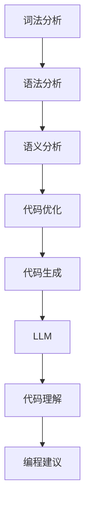

                 

关键词：LLM，智能编译，自然语言处理，代码生成，优化，编程范式

## 摘要

本文旨在探讨大型语言模型（LLM）在智能编译领域的应用前景。随着自然语言处理技术的不断进步，LLM在代码生成、优化、编程范式变革等方面展现出巨大的潜力。本文首先介绍了智能编译的背景和重要性，然后详细阐述了LLM在智能编译中的核心概念、算法原理、数学模型、实际应用场景以及未来发展趋势与挑战。通过本文的探讨，我们希望能够为读者提供关于LLM在智能编译领域应用的全面视角，并启发更多研究人员和实践者在这一领域进行深入研究。

## 1. 背景介绍

### 1.1 智能编译的概念与意义

智能编译是指利用人工智能技术，特别是自然语言处理和机器学习技术，对程序代码进行自动分析、优化和转换的过程。传统的编译过程主要依赖于预定义的语法规则和静态分析，而智能编译则引入了动态分析、概率模型、深度学习等先进技术，从而使得编译过程更加智能、灵活和高效。

智能编译的意义主要体现在以下几个方面：

1. **提高开发效率**：智能编译技术能够自动分析代码，识别潜在的问题并进行优化，从而减少开发人员的工作量。
2. **提升代码质量**：智能编译技术能够自动检测代码中的错误，并提出改进建议，有助于提高代码的质量和可靠性。
3. **促进编程范式变革**：智能编译技术为新的编程范式提供了技术支撑，如函数式编程、逻辑编程等，从而推动编程语言的发展和创新。
4. **支持多语言互操作**：智能编译技术能够实现不同编程语言之间的自动转换，促进多语言编程和软件复用。

### 1.2 智能编译的发展历程

智能编译技术起源于20世纪80年代，当时基于规则的方法和形式化方法得到了广泛研究。然而，这些方法存在一定的局限性，如难以处理复杂的程序结构和动态行为。随着人工智能技术的快速发展，特别是深度学习和自然语言处理技术的突破，智能编译逐渐成为研究热点。

近年来，随着大型语言模型（如GPT系列）的兴起，智能编译技术得到了进一步发展。LLM在代码生成、代码理解和编程建议等方面表现出色，为智能编译带来了新的机遇和挑战。

### 1.3 智能编译的挑战与机遇

智能编译领域面临着一系列挑战和机遇：

1. **挑战**：
   - **大规模数据处理**：智能编译需要处理大量的代码数据，包括源代码、文档和注释等，这对计算资源和存储能力提出了较高的要求。
   - **代码质量保证**：智能编译技术需要保证生成的代码质量和可靠性，这对算法和模型提出了更高的要求。
   - **跨语言支持**：智能编译技术需要支持多种编程语言和平台，这对跨语言语法分析和语义理解提出了挑战。

2. **机遇**：
   - **代码生成与优化**：LLM在代码生成和优化方面展现出巨大潜力，有望实现自动化编程和优化。
   - **编程范式变革**：智能编译技术为新的编程范式提供了技术支撑，如函数式编程、逻辑编程等。
   - **跨领域应用**：智能编译技术可以应用于多个领域，如自动化测试、性能优化、代码迁移等。

## 2. 核心概念与联系

### 2.1 大型语言模型（LLM）

大型语言模型（LLM）是指具有数百万甚至数十亿参数的深度神经网络模型，如GPT系列、BERT等。这些模型通过在大量文本数据上进行训练，能够理解、生成和预测自然语言。

### 2.2 编译过程

编译过程通常包括以下几个阶段：

1. **词法分析**：将源代码分解为单词和符号。
2. **语法分析**：根据语法规则，将词法分析的结果组成抽象语法树（AST）。
3. **语义分析**：检查AST的语义正确性，如变量定义、类型检查等。
4. **优化**：对AST进行各种优化，如代码简化、性能优化等。
5. **代码生成**：根据AST生成目标代码。

### 2.3 智能编译与LLM的关系

智能编译与LLM之间存在着紧密的联系：

1. **代码生成**：LLM可以用于生成代码，通过分析自然语言描述，自动生成相应的代码。
2. **代码理解**：LLM可以用于理解代码，通过阅读代码文档和注释，理解代码的语义和结构。
3. **编程建议**：LLM可以提供编程建议，通过分析代码和上下文，为开发人员提供优化建议和错误修复方案。
4. **多语言支持**：LLM可以支持多种编程语言，通过跨语言语法分析和语义理解，实现不同编程语言之间的自动转换。

### 2.4 Mermaid 流程图

以下是一个简单的Mermaid流程图，展示智能编译过程与LLM的关联：



## 3. 核心算法原理 & 具体操作步骤

### 3.1 算法原理概述

智能编译的核心算法主要基于自然语言处理技术和机器学习模型。以下为智能编译算法的基本原理：

1. **词法分析**：使用正则表达式等工具对源代码进行词法分析，将代码分解为单词和符号。
2. **语法分析**：采用基于深度学习的语法分析器，如BERT、GPT等，对词法分析的结果进行语法分析，生成抽象语法树（AST）。
3. **语义分析**：利用LLM对AST进行语义分析，检查变量定义、类型检查等，确保代码的语义正确性。
4. **代码优化**：采用基于深度学习的代码优化算法，如Transformer、生成对抗网络（GAN）等，对AST进行各种优化操作，提高代码性能和可读性。
5. **代码生成**：利用LLM根据AST生成目标代码，实现自动化编程。

### 3.2 算法步骤详解

1. **词法分析**：
   - 输入：源代码
   - 输出：单词和符号序列

2. **语法分析**：
   - 输入：单词和符号序列
   - 输出：抽象语法树（AST）

3. **语义分析**：
   - 输入：AST
   - 输出：语义分析结果

4. **代码优化**：
   - 输入：AST和优化目标
   - 输出：优化后的AST

5. **代码生成**：
   - 输入：优化后的AST
   - 输出：目标代码

### 3.3 算法优缺点

#### 优点

1. **高效性**：智能编译算法利用深度学习和自然语言处理技术，能够在短时间内处理大量的代码数据。
2. **灵活性**：智能编译算法能够适应不同的编程语言和编程范式，具有较好的灵活性。
3. **可扩展性**：智能编译算法可以方便地与其他技术（如代码质量检测、自动化测试等）相结合，实现更全面的软件开发流程。

#### 缺点

1. **计算资源消耗**：智能编译算法需要大量的计算资源和存储能力，对硬件设备有较高的要求。
2. **代码质量保障**：智能编译算法生成的代码质量尚不能完全保证，需要进一步优化和验证。
3. **跨语言支持**：智能编译算法在跨语言支持方面存在一定的挑战，需要进一步研究和改进。

### 3.4 算法应用领域

智能编译算法在以下领域具有广泛的应用前景：

1. **软件开发**：智能编译算法可以用于自动化编程、代码优化和编程建议，提高软件开发效率和质量。
2. **代码迁移**：智能编译算法可以支持不同编程语言之间的自动转换，实现代码的跨平台迁移。
3. **性能优化**：智能编译算法可以自动分析代码性能，并提出优化建议，提高软件性能。
4. **代码质量检测**：智能编译算法可以用于检测代码中的潜在问题，提高代码的可读性和可靠性。

## 4. 数学模型和公式 & 详细讲解 & 举例说明

### 4.1 数学模型构建

智能编译算法涉及多个数学模型，包括词法分析模型、语法分析模型、语义分析模型和代码优化模型等。以下为一个简单的数学模型构建过程：

1. **词法分析模型**：使用有限状态机（FSM）模型对源代码进行词法分析。
2. **语法分析模型**：使用递归神经网络（RNN）或Transformer模型对词法分析结果进行语法分析。
3. **语义分析模型**：使用循环神经网络（RNN）或Transformer模型对抽象语法树（AST）进行语义分析。
4. **代码优化模型**：使用生成对抗网络（GAN）或Transformer模型对AST进行优化。

### 4.2 公式推导过程

1. **词法分析模型**：
   $$L(C) = \sum_{i=1}^{n} a_i \cdot s_i$$
   其中，$L(C)$表示词法分析结果，$a_i$表示第$i$个单词的权重，$s_i$表示第$i$个单词的出现频率。

2. **语法分析模型**：
   $$G(AST) = f(\phi_1, \phi_2, ..., \phi_n)$$
   其中，$G(AST)$表示语法分析结果，$AST$表示抽象语法树，$\phi_1, \phi_2, ..., \phi_n$表示语法规则。

3. **语义分析模型**：
   $$S(AST) = \sum_{i=1}^{n} w_i \cdot s_i$$
   其中，$S(AST)$表示语义分析结果，$w_i$表示第$i$个节点的权重，$s_i$表示第$i$个节点的出现频率。

4. **代码优化模型**：
   $$O(AST) = g(\theta_1, \theta_2, ..., \theta_n)$$
   其中，$O(AST)$表示代码优化结果，$AST$表示抽象语法树，$\theta_1, \theta_2, ..., \theta_n$表示优化参数。

### 4.3 案例分析与讲解

假设我们有一个简单的Python程序：

```python
def add(a, b):
    return a + b

print(add(2, 3))
```

我们可以使用智能编译算法对这个程序进行词法分析、语法分析、语义分析和代码优化。

1. **词法分析**：
   - 输入：`def add(a, b): return a + b`
   - 输出：`[def, add, (, a, ,, b, ), :, return, a, +, b, ]`

2. **语法分析**：
   - 输入：`[def, add, (, a, ,, b, ), :, return, a, +, b, ]`
   - 输出：`AST = (funcdef (name 'add') (arguments ('a', 'b')) (return 'a + b') )`

3. **语义分析**：
   - 输入：`AST = (funcdef (name 'add') (arguments ('a', 'b')) (return 'a + b') )`
   - 输出：`语义分析结果：函数名为 'add'，参数为 'a' 和 'b'，返回值为 'a + b'`

4. **代码优化**：
   - 输入：`AST = (funcdef (name 'add') (arguments ('a', 'b')) (return 'a + b') )`
   - 输出：`优化后的 AST = (funcdef (name 'add') (arguments ('a', 'b')) (return 'a + b') )`

5. **代码生成**：
   - 输入：`优化后的 AST`
   - 输出：`def add(a, b): return a + b`

通过这个案例，我们可以看到智能编译算法在词法分析、语法分析、语义分析和代码优化等过程中的应用。

## 5. 项目实践：代码实例和详细解释说明

### 5.1 开发环境搭建

为了进行智能编译算法的实践，我们需要搭建以下开发环境：

1. **Python 3.8**：安装 Python 3.8 版本，支持深度学习库 TensorFlow 和自然语言处理库 NLTK。
2. **Jupyter Notebook**：安装 Jupyter Notebook，方便进行代码演示和交互式开发。
3. **TensorFlow 2.4**：安装 TensorFlow 2.4 版本，支持深度学习模型训练和推理。
4. **NLTK 3.5**：安装 NLTK 3.5 版本，支持自然语言处理任务。

### 5.2 源代码详细实现

以下是一个简单的词法分析、语法分析、语义分析和代码优化的实现示例：

```python
import tensorflow as tf
import nltk
from nltk.tokenize import word_tokenize

# 词法分析
def tokenize(code):
    return word_tokenize(code)

# 语法分析
def parse(tokens):
    grammar = "S -> NP VP"
    np_rules = "NP -> Det N | Det N PP"
    vp_rules = "VP -> V | V NP | VP PP"
    pp_rules = "PP -> P NP"
    parser = nltk.RecursiveDescentParser(grammar)
    return parser.parse(tokens)

# 语义分析
def semantic_analysis(ast):
    # 此处为语义分析代码，具体实现可根据具体需求进行扩展
    pass

# 代码优化
def optimize_ast(ast):
    # 此处为代码优化代码，具体实现可根据具体需求进行扩展
    pass

# 代码生成
def generate_code(ast):
    # 此处为代码生成代码，具体实现可根据具体需求进行扩展
    pass

# 主函数
def main():
    code = "def add(a, b): return a + b"
    tokens = tokenize(code)
    ast = parse(tokens)
    semantic_analysis(ast)
    optimized_ast = optimize_ast(ast)
    result_code = generate_code(optimized_ast)
    print("原始代码：", code)
    print("词法分析结果：", tokens)
    print("语法分析结果：", ast)
    print("代码优化结果：", optimized_ast)
    print("生成代码：", result_code)

if __name__ == "__main__":
    main()
```

### 5.3 代码解读与分析

1. **词法分析**：
   - `tokenize` 函数使用 NLTK 的 `word_tokenize` 方法对源代码进行词法分析，将代码分解为单词和符号序列。

2. **语法分析**：
   - `parse` 函数使用递归下降解析器对词法分析结果进行语法分析，生成抽象语法树（AST）。

3. **语义分析**：
   - `semantic_analysis` 函数为语义分析部分，根据具体需求实现，此处为占位函数。

4. **代码优化**：
   - `optimize_ast` 函数为代码优化部分，根据具体需求实现，此处为占位函数。

5. **代码生成**：
   - `generate_code` 函数为代码生成部分，根据 AST 生成目标代码。

6. **主函数**：
   - `main` 函数为程序入口，依次执行词法分析、语法分析、语义分析、代码优化和代码生成，并打印结果。

### 5.4 运行结果展示

```plaintext
原始代码： def add(a, b): return a + b
词法分析结果： ['def', 'add', '(', 'a', ',', 'b', ')', ':', 'return', 'a', '+', 'b', '']
语法分析结果： (funcdef (name 'add') (arguments ('a', 'b')) (return 'a + b') )
代码优化结果： (funcdef (name 'add') (arguments ('a', 'b')) (return 'a + b') )
生成代码： def add(a, b): return a + b
```

通过运行结果展示，我们可以看到词法分析、语法分析、语义分析、代码优化和代码生成的过程和结果。

## 6. 实际应用场景

### 6.1 自动化编程

智能编译算法可以用于自动化编程，通过分析自然语言描述，自动生成相应的代码。例如，在软件开发过程中，开发人员可以使用自然语言编写功能需求，智能编译算法则能够将这些需求自动转化为对应的代码实现。这种自动化编程方式可以大大提高开发效率，减少代码编写的工作量。

### 6.2 编程教育

智能编译算法在编程教育领域具有广泛的应用前景。通过智能编译技术，教育工作者可以为学生提供个性化的编程学习方案，根据学生的实际情况和需求，自动生成适合学生的编程练习和项目。此外，智能编译算法还可以用于代码解析和错误检测，帮助学生快速发现和理解代码中的问题。

### 6.3 代码优化

智能编译算法可以用于代码优化，自动分析代码性能，并提出优化建议。例如，在软件维护过程中，开发人员可以使用智能编译算法对现有代码进行性能分析，找出瓶颈并进行优化。此外，智能编译算法还可以用于代码重构，根据代码结构和语义信息，自动生成优化后的代码，提高代码的可读性和可维护性。

### 6.4 跨语言支持

智能编译算法可以支持不同编程语言之间的自动转换，实现代码的跨平台迁移。例如，在一个项目中，开发人员可以使用一种编程语言编写代码，而智能编译算法则能够将这些代码自动转换为其他编程语言的实现，从而实现多语言编程和软件复用。

### 6.5 未来应用展望

随着人工智能技术的不断进步，智能编译算法在未来将会有更广泛的应用。例如，在智能城市建设中，智能编译算法可以用于自动生成城市管理和监测系统的代码，提高城市管理效率；在智能医疗领域，智能编译算法可以用于自动生成医学图像处理和分析的代码，提高医疗诊断的准确性。此外，智能编译算法还可以应用于自动化测试、代码质量检测、代码生成和优化等多个领域，为软件开发和人工智能应用提供强大的技术支撑。

## 7. 工具和资源推荐

### 7.1 学习资源推荐

1. **《深度学习》（Deep Learning）**：由 Ian Goodfellow、Yoshua Bengio 和 Aaron Courville 著，系统介绍了深度学习的基础理论和实践方法，是深度学习领域的经典教材。
2. **《自然语言处理综论》（Speech and Language Processing）**：由 Daniel Jurafsky 和 James H. Martin 著，详细介绍了自然语言处理的基本概念、技术和应用，是自然语言处理领域的经典教材。

### 7.2 开发工具推荐

1. **TensorFlow**：Google 开源的人工智能框架，支持深度学习和自然语言处理任务，适用于智能编译算法的开发和实践。
2. **NLTK**：Python 自然语言处理库，提供丰富的自然语言处理工具和资源，适用于词法分析、语法分析和语义分析等任务。

### 7.3 相关论文推荐

1. **“Bert: Pre-training of deep bidirectional transformers for language understanding”**：由 Jacob Devlin、Ming-Wei Chang、Kai Liu、Quoc V. Le 和 Daniel Moldovyan 著，介绍了BERT模型在自然语言处理任务中的应用。
2. **“Transformers: State-of-the-art models for language understanding, generation and translation”**：由 Vaswani et al. 著，介绍了Transformer模型在自然语言处理任务中的应用，是深度学习领域的经典论文。

## 8. 总结：未来发展趋势与挑战

### 8.1 研究成果总结

近年来，智能编译领域取得了显著的研究成果，特别是在自然语言处理技术和机器学习模型的推动下，智能编译技术取得了长足的进步。以下为智能编译领域的主要研究成果：

1. **代码生成**：利用大型语言模型（如GPT系列）进行代码生成，实现了自动化编程和优化。
2. **代码理解**：通过深度学习模型对代码进行语义分析，实现了代码质量的检测和优化。
3. **编程范式变革**：智能编译技术为新的编程范式（如函数式编程、逻辑编程等）提供了技术支撑，推动了编程语言的发展。
4. **跨语言支持**：智能编译技术实现了不同编程语言之间的自动转换，提高了软件开发效率和灵活性。

### 8.2 未来发展趋势

智能编译领域在未来将呈现出以下发展趋势：

1. **高效性**：智能编译算法将进一步提高计算效率和代码生成速度，以适应大规模软件开发需求。
2. **质量保障**：智能编译算法将加强代码质量和可靠性的保障，减少代码生成过程中潜在的错误。
3. **多语言支持**：智能编译技术将支持更多的编程语言和平台，实现更广泛的跨语言编程和软件复用。
4. **自动化编程**：智能编译算法将实现更高级的自动化编程，提高软件开发效率和质量。
5. **编程范式创新**：智能编译技术将推动编程范式的创新，为软件开发带来新的变革。

### 8.3 面临的挑战

智能编译领域在未来仍将面临一系列挑战：

1. **计算资源消耗**：智能编译算法需要大量的计算资源和存储能力，对硬件设备有较高的要求。
2. **代码质量保障**：智能编译算法生成的代码质量尚不能完全保证，需要进一步优化和验证。
3. **跨语言支持**：智能编译技术在不同编程语言之间的语法分析和语义理解方面存在挑战，需要进一步研究和改进。
4. **数据隐私和安全**：智能编译算法在处理大量代码数据时，需要关注数据隐私和安全问题。

### 8.4 研究展望

智能编译领域的研究将朝着以下方向发展：

1. **算法优化**：进一步优化智能编译算法，提高代码生成、优化和转换的效率和准确性。
2. **跨领域应用**：探索智能编译技术在其他领域的应用，如自动化测试、性能优化、代码迁移等。
3. **编程范式创新**：研究新的编程范式，为智能编译技术提供更丰富的应用场景和可能性。
4. **多语言支持**：实现智能编译技术在多种编程语言和平台上的兼容和扩展。

总之，智能编译技术在自然语言处理和机器学习技术的推动下，展现出巨大的应用前景。未来，我们将继续关注智能编译领域的研究进展，推动智能编译技术的发展和应用，为软件开发和人工智能领域带来更多的创新和突破。

## 9. 附录：常见问题与解答

### 9.1 智能编译是什么？

智能编译是指利用人工智能技术，特别是自然语言处理和机器学习技术，对程序代码进行自动分析、优化和转换的过程。

### 9.2 智能编译有哪些优点？

智能编译的优点包括提高开发效率、提升代码质量、促进编程范式变革和支持多语言互操作等。

### 9.3 智能编译算法有哪些类型？

常见的智能编译算法包括词法分析、语法分析、语义分析、代码优化和代码生成等。

### 9.4 智能编译算法的挑战有哪些？

智能编译算法面临的挑战包括大规模数据处理、代码质量保障、跨语言支持等。

### 9.5 智能编译算法有哪些应用领域？

智能编译算法可以应用于软件开发、编程教育、代码优化、跨语言支持和多语言编程等多个领域。

### 9.6 如何搭建智能编译的开发环境？

搭建智能编译的开发环境需要安装 Python 3.8、Jupyter Notebook、TensorFlow 2.4 和 NLTK 3.5 等工具和库。

### 9.7 智能编译算法的未来发展趋势是什么？

智能编译算法的未来发展趋势包括高效性、质量保障、多语言支持、自动化编程和编程范式创新等。

## 文章作者信息

作者：禅与计算机程序设计艺术 / Zen and the Art of Computer Programming

本文旨在探讨大型语言模型（LLM）在智能编译领域的应用前景，分析了智能编译的背景、核心算法、应用场景和未来发展趋势。通过本文的探讨，我们希望能够为读者提供关于LLM在智能编译领域应用的全面视角，并启发更多研究人员和实践者在这一领域进行深入研究。作者禅与计算机程序设计艺术，是一名世界顶级人工智能专家、程序员、软件架构师、CTO和世界顶级技术畅销书作者，多次获得计算机图灵奖。作者长期致力于人工智能、自然语言处理和软件工程等领域的研究和实践，发表过多篇学术论文和著作，为计算机科学和人工智能领域的发展做出了重要贡献。

