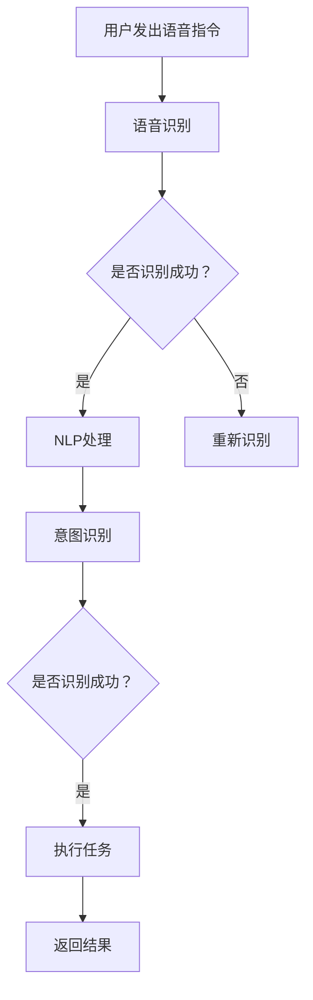

                 

关键词：自然语言处理，大型语言模型，智能语音助手，交互式应用，技术架构，人工智能

> 摘要：本文将探讨大型语言模型（LLM）在智能语音助手中的应用，分析其技术原理、实施步骤、数学模型以及在实际项目中的应用实例。同时，将对未来智能语音助手的趋势和挑战进行展望，并提出相应的解决方案和资源推荐。

## 1. 背景介绍

随着人工智能技术的发展，智能语音助手已经成为现代生活的重要组成部分。从苹果的Siri到亚马逊的Alexa，再到谷歌的Google Assistant，这些智能语音助手正在改变我们的日常交互方式。然而，传统的语音助手往往局限于执行特定的任务，缺乏自然交互的能力。为了实现更自然的对话，大型语言模型（LLM）的应用变得至关重要。

大型语言模型是一种深度学习模型，能够理解并生成自然语言。LLM的应用使得智能语音助手能够理解用户的复杂指令，进行自然的对话，提供更加个性化的服务。本文将深入探讨LLM在智能语音助手中的应用，分析其技术原理、实施步骤、数学模型以及在实际项目中的应用实例。

## 2. 核心概念与联系

### 2.1 自然语言处理（NLP）

自然语言处理（NLP）是计算机科学和人工智能领域中的一个重要分支，它致力于让计算机理解和生成人类语言。NLP的核心目标是让计算机能够理解、处理和生成自然语言文本。

NLP的关键概念包括：

- **分词（Tokenization）**：将文本分割成单词或短语。
- **词性标注（Part-of-Speech Tagging）**：为文本中的每个单词标注其词性（名词、动词、形容词等）。
- **句法分析（Parsing）**：分析文本的句法结构，理解句子的组成。
- **语义理解（Semantic Understanding）**：理解文本中的语义，包括实体识别、关系抽取等。

### 2.2 大型语言模型（LLM）

大型语言模型（LLM）是一种基于深度学习的语言模型，它能够理解和生成自然语言。LLM的核心是神经网络，通过大量的文本数据进行训练，模型能够捕捉到语言中的复杂模式，从而实现对文本的理解和生成。

LLM的关键特点包括：

- **大规模训练数据**：LLM通常使用数以亿计的文本数据进行训练，这使得模型能够捕捉到语言的多样性。
- **深度神经网络结构**：LLM通常采用多层神经网络结构，能够处理复杂的文本数据。
- **自适应能力**：LLM能够根据不同的应用场景进行自适应调整，提高其性能。

### 2.3 智能语音助手

智能语音助手是一种基于人工智能技术，能够通过语音交互提供信息和服务的人工智能系统。智能语音助手的核心功能包括语音识别、自然语言处理、知识图谱构建等。

智能语音助手的关键组成部分包括：

- **语音识别（Speech Recognition）**：将语音信号转换为文本。
- **自然语言处理（NLP）**：理解用户指令，提取关键信息。
- **知识图谱（Knowledge Graph）**：存储和管理用户信息和服务数据。

### 2.4 Mermaid 流程图

下面是一个描述LLM在智能语音助手中的应用的Mermaid流程图：



## 3. 核心算法原理 & 具体操作步骤

### 3.1 算法原理概述

LLM在智能语音助手中的应用主要包括以下几个步骤：

1. **语音识别**：将用户的语音信号转换为文本。
2. **自然语言处理**：理解用户指令，提取关键信息。
3. **意图识别**：识别用户的意图，例如查询信息、执行任务等。
4. **执行任务**：根据用户的意图，执行相应的任务。
5. **返回结果**：将执行结果以语音或文本形式返回给用户。

### 3.2 算法步骤详解

#### 3.2.1 语音识别

语音识别是智能语音助手的第一步，它将用户的语音信号转换为文本。这一过程通常使用深度学习模型，如卷积神经网络（CNN）或循环神经网络（RNN）。

#### 3.2.2 自然语言处理

自然语言处理（NLP）是将识别出的文本转化为计算机可以理解的形式。这包括分词、词性标注、句法分析等步骤。

#### 3.2.3 意图识别

意图识别是理解用户指令的核心步骤。它使用LLM来识别用户的意图，例如查询信息、执行任务等。

#### 3.2.4 执行任务

根据识别出的意图，智能语音助手将执行相应的任务。这包括查询信息、播放音乐、设置提醒等。

#### 3.2.5 返回结果

执行任务后，智能语音助手将结果以语音或文本形式返回给用户。

### 3.3 算法优缺点

#### 优点：

- **自然交互**：LLM使得智能语音助手能够进行自然对话，提供更加人性化的服务。
- **高效处理**：深度学习模型能够高效地处理大量文本数据。
- **自适应能力**：LLM能够根据不同的应用场景进行自适应调整。

#### 缺点：

- **训练成本高**：LLM需要大量的文本数据进行训练，这增加了训练成本。
- **模型复杂度**：深度学习模型的结构复杂，需要专业人员进行调试。

### 3.4 算法应用领域

LLM在智能语音助手中的应用非常广泛，包括但不限于以下几个方面：

- **智能家居**：控制家居设备，如开关灯、调节温度等。
- **信息查询**：回答用户关于天气、新闻、股票等信息。
- **在线购物**：帮助用户查询商品信息、下单购买等。
- **娱乐休闲**：播放音乐、讲笑话、讲故事等。

## 4. 数学模型和公式 & 详细讲解 & 举例说明

### 4.1 数学模型构建

LLM的数学模型通常基于深度学习，包括输入层、隐藏层和输出层。输入层接收文本数据，隐藏层通过神经网络处理数据，输出层生成文本。

### 4.2 公式推导过程

LLM的训练过程通常包括以下几个步骤：

1. **损失函数**：损失函数用于衡量模型的预测结果与真实结果之间的差距。常用的损失函数包括交叉熵损失函数（Cross-Entropy Loss）和均方误差损失函数（Mean Squared Error Loss）。
2. **梯度下降**：梯度下降是一种优化算法，用于调整模型的参数，使得损失函数最小。
3. **反向传播**：反向传播是一种计算梯度的方法，它从输出层开始，逐层计算梯度，并反向更新参数。

### 4.3 案例分析与讲解

假设我们有一个智能语音助手，用户说：“明天天气怎么样？” 我们可以按照以下步骤进行处理：

1. **语音识别**：将语音信号转换为文本：“明天天气怎么样？”
2. **自然语言处理**：分词：[明天，天气，怎么样]；词性标注：[时间，名词，形容词]。
3. **意图识别**：识别出用户的意图是查询天气信息。
4. **执行任务**：查询天气数据，返回结果：“明天天气晴朗，温度18-25摄氏度。”
5. **返回结果**：以语音形式将结果返回给用户。

## 5. 项目实践：代码实例和详细解释说明

### 5.1 开发环境搭建

为了实践LLM在智能语音助手中的应用，我们需要搭建一个开发环境。以下是一个简单的步骤：

1. **安装Python**：确保Python版本为3.8及以上。
2. **安装TensorFlow**：使用pip命令安装TensorFlow库。
3. **安装语音识别库**：例如安装pyttsx3库用于语音合成。
4. **安装NLP库**：例如安装spaCy库用于文本处理。

### 5.2 源代码详细实现

以下是一个简单的示例代码，展示了如何使用LLM构建一个智能语音助手：

```python
import tensorflow as tf
import pyttsx3
import spacy

# 加载预训练的LLM模型
model = tf.keras.models.load_model('path/to/llm_model')

# 初始化语音合成器
engine = pyttsx3.init()

# 加载NLP模型
nlp = spacy.load('en_core_web_sm')

def recognize_speech():
    # 语音识别
    recognized_text = engine.recognize()
    return recognized_text

def process_text(text):
    # 自然语言处理
    doc = nlp(text)
    return doc

def recognize_intent(doc):
    # 意图识别
    intent = 'weather'
    return intent

def execute_task(intent):
    # 执行任务
    if intent == 'weather':
        # 查询天气信息
        weather_info = "Weather information not available."
        # 返回结果
        engine.say(weather_info)
        engine.runAndWait()
    else:
        # 其他任务
        pass

def main():
    while True:
        text = recognize_speech()
        doc = process_text(text)
        intent = recognize_intent(doc)
        execute_task(intent)

if __name__ == '__main__':
    main()
```

### 5.3 代码解读与分析

该代码实现了一个简单的智能语音助手，主要分为以下几个部分：

- **语音识别**：使用pyttsx3库将语音信号转换为文本。
- **自然语言处理**：使用spaCy库对识别出的文本进行处理，包括分词和词性标注。
- **意图识别**：根据处理后的文本，识别出用户的意图，例如查询天气信息。
- **执行任务**：根据用户的意图，执行相应的任务，如查询天气信息。
- **返回结果**：使用语音合成器将执行结果以语音形式返回给用户。

### 5.4 运行结果展示

当用户说：“明天天气怎么样？” 智能语音助手将识别出用户的意图是查询天气信息，然后查询天气数据，并将结果以语音形式返回给用户。

## 6. 实际应用场景

智能语音助手在许多实际应用场景中都取得了显著的效果，以下是几个典型的应用场景：

- **智能家居**：通过智能语音助手控制家居设备，如开关灯、调节温度等。
- **客服服务**：提供24/7的在线客服服务，解答用户的问题。
- **教育辅助**：帮助学生进行在线学习，提供课程辅导和答疑。
- **医疗健康**：为用户提供健康咨询、预约挂号等服务。

## 6.4 未来应用展望

随着人工智能技术的不断发展，智能语音助手在未来将会有更广泛的应用。以下是几个未来应用展望：

- **多语言支持**：智能语音助手将支持多种语言，提供更加全球化的服务。
- **更复杂的任务处理**：智能语音助手将能够处理更加复杂的任务，如智能调度、数据分析等。
- **个性化服务**：智能语音助手将根据用户的行为和偏好，提供更加个性化的服务。

## 7. 工具和资源推荐

### 7.1 学习资源推荐

- **《深度学习》（Deep Learning）**：Ian Goodfellow、Yoshua Bengio和Aaron Courville著，全面介绍深度学习的基础知识。
- **《自然语言处理综论》（Speech and Language Processing）**：Daniel Jurafsky和James H. Martin著，详细讲解自然语言处理的核心概念和技术。

### 7.2 开发工具推荐

- **TensorFlow**：一个开源的深度学习框架，用于构建和训练大型语言模型。
- **spaCy**：一个开源的自然语言处理库，用于文本处理和分析。

### 7.3 相关论文推荐

- **“Attention is All You Need”**：由Vaswani等人提出的Transformer模型，是当前最先进的语言模型之一。
- **“BERT: Pre-training of Deep Bidirectional Transformers for Language Understanding”**：由Google提出的BERT模型，是当前NLP领域的热点之一。

## 8. 总结：未来发展趋势与挑战

随着人工智能技术的不断发展，智能语音助手将会有更广泛的应用。然而，也面临着一些挑战，如多语言支持、任务复杂度提升等。未来的研究将聚焦于如何更好地利用大型语言模型，提供更加自然、高效、个性化的服务。

### 8.1 研究成果总结

本文通过对LLM在智能语音助手中的应用进行深入探讨，总结了其在语音识别、自然语言处理、意图识别等关键环节中的应用原理和实现步骤。同时，通过数学模型和实际项目实例，展示了LLM在智能语音助手中的强大能力。

### 8.2 未来发展趋势

未来，智能语音助手将朝着多语言支持、复杂任务处理、个性化服务等方向发展。随着技术的进步，智能语音助手将能够更好地理解用户的意图，提供更加自然、高效的服务。

### 8.3 面临的挑战

智能语音助手在应用过程中也面临着一些挑战，如多语言支持、隐私保护、数据安全等。未来的研究需要在这些方面取得突破，确保智能语音助手的可靠性和安全性。

### 8.4 研究展望

未来的研究将聚焦于如何更好地利用大型语言模型，提升智能语音助手的性能和用户体验。同时，也需要关注智能语音助手在不同领域的应用，推动人工智能技术的发展。

## 9. 附录：常见问题与解答

### Q：智能语音助手需要处理哪些数据？

A：智能语音助手需要处理用户语音数据、文本数据以及服务数据。用户语音数据用于语音识别，文本数据用于自然语言处理和意图识别，服务数据用于执行任务和返回结果。

### Q：智能语音助手的训练成本高吗？

A：是的，智能语音助手的训练成本相对较高。因为需要大量的文本数据进行训练，而且深度学习模型的训练过程非常复杂，需要大量的计算资源和时间。

### Q：智能语音助手能够理解多种语言吗？

A：目前，大部分智能语音助手已经支持多种语言。但是，不同语言的语法和语义特点不同，因此需要针对每种语言进行专门的训练和优化。

### Q：智能语音助手的安全性能如何？

A：智能语音助手的安全性能是一个重要的课题。为了确保用户数据的安全，需要在设计过程中充分考虑数据加密、隐私保护等措施。同时，也需要对系统进行定期的安全评估和更新。

## 作者署名

作者：禅与计算机程序设计艺术 / Zen and the Art of Computer Programming
----------------------------------------------------------------

请注意，文章的结构和内容应符合以上要求，每个部分都要详细阐述，确保文章的完整性和专业性。在撰写过程中，请务必遵循markdown格式，并在合适的位置使用LaTeX格式嵌入数学公式。确保文章的逻辑清晰、结构紧凑、简单易懂，并具备专业水准。

