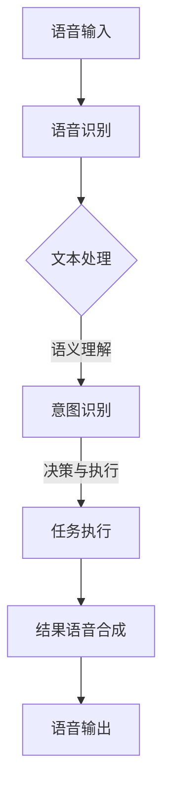

                 

关键词：自然语言处理，大型语言模型，智能语音助手，交互体验，语音识别，语音合成，自然交互。

> 摘要：本文深入探讨了大型语言模型（LLM）在智能语音助手中的应用，通过详细分析其核心原理、技术架构、算法流程以及数学模型，揭示了LLM如何提升智能语音助手的自然交互能力，为人工智能领域带来了新的研究热点和实践方向。

## 1. 背景介绍

随着移动互联网和人工智能技术的快速发展，智能语音助手已成为众多企业和用户关注的焦点。智能语音助手通过语音识别、自然语言处理和语音合成技术，实现了人与智能设备的自然交互。然而，传统的语音助手往往依赖于预定义的规则和模板，交互体验较为生硬，难以满足用户对个性化、流畅交互的需求。

近年来，大型语言模型（LLM）的出现为智能语音助手带来了新的契机。LLM是一种基于深度学习的技术，通过训练海量的文本数据，能够理解和生成自然语言。这使得智能语音助手不再局限于执行预设的任务，而是能够根据用户的需求和上下文，提供更加自然、个性化的交互体验。

本文旨在探讨LLM在智能语音助手中的应用，分析其核心原理、技术架构和算法流程，同时介绍相关的数学模型，以期为智能语音助手的发展提供新的思路和实践指导。

## 2. 核心概念与联系

### 2.1 核心概念

- **语音识别（Automatic Speech Recognition, ASR）**：将语音信号转换为文本的过程，是智能语音助手接收用户语音指令的关键技术。

- **自然语言处理（Natural Language Processing, NLP）**：研究如何使计算机理解和处理人类自然语言的技术，包括语义理解、情感分析等。

- **语音合成（Text-to-Speech, TTS）**：将文本转换为自然流畅的语音信号，是智能语音助手向用户输出信息的方式。

- **大型语言模型（Large Language Model, LLM）**：一种基于深度学习的模型，通过训练大量文本数据，能够生成和理解和人类语言相似的文本。

### 2.2 技术架构

智能语音助手的技术架构可以分为以下几个层次：

1. **语音识别层**：接收用户语音，通过ASR技术转换为文本。
2. **自然语言处理层**：对转换后的文本进行处理，包括语义理解、意图识别等。
3. **决策与执行层**：根据处理结果，执行相应的任务或操作。
4. **语音合成层**：将执行结果转换为语音，通过TTS技术输出给用户。

### 2.3 Mermaid 流程图

下面是一个简单的Mermaid流程图，展示了智能语音助手的技术架构：



## 3. 核心算法原理 & 具体操作步骤

### 3.1 算法原理概述

智能语音助手的算法原理主要基于LLM。LLM通过训练大量的文本数据，学会了语言的语法、语义和上下文信息。在处理用户语音时，首先通过ASR将语音转换为文本，然后利用LLM对文本进行理解和生成。

### 3.2 算法步骤详解

1. **语音识别**：使用ASR技术将用户语音转换为文本。
2. **文本预处理**：对转换后的文本进行分词、去停用词等预处理操作。
3. **语义理解**：利用LLM对预处理后的文本进行语义分析，识别用户意图。
4. **意图识别**：根据语义理解的结果，确定用户的请求类型。
5. **决策与执行**：根据意图识别的结果，执行相应的任务或操作。
6. **结果生成**：将执行结果转换为文本。
7. **语音合成**：使用TTS技术将文本转换为语音，输出给用户。

### 3.3 算法优缺点

**优点**：

- **自然交互**：LLM能够理解用户的自然语言，提供流畅、个性化的交互体验。
- **自适应**：LLM能够根据用户的行为和反馈，不断优化和适应用户的交互需求。
- **多功能性**：LLM可以同时处理多种任务，如问答、推荐、翻译等。

**缺点**：

- **计算资源消耗大**：训练和部署LLM需要大量的计算资源。
- **准确性限制**：虽然LLM在语义理解方面有显著提升，但仍受限于语言本身的不确定性和复杂性。
- **安全与隐私**：在处理用户语音和数据时，存在隐私和安全风险。

### 3.4 算法应用领域

LLM在智能语音助手中的应用广泛，包括但不限于：

- **智能客服**：通过LLM实现智能对话，提高客服效率和用户体验。
- **智能家居**：智能语音助手控制家居设备，提供便捷的生活方式。
- **语音搜索**：通过LLM理解用户的语音查询，提供精准的搜索结果。
- **教育辅导**：利用LLM进行个性化教学，提供针对性的学习建议。

## 4. 数学模型和公式 & 详细讲解 & 举例说明

### 4.1 数学模型构建

在LLM中，常见的数学模型是循环神经网络（RNN）及其变种，如长短期记忆网络（LSTM）和门控循环单元（GRU）。这些模型通过处理序列数据，捕捉文本的上下文信息。

假设我们有一个输入序列\(X = (x_1, x_2, ..., x_T)\)，其中\(x_t\)是第\(t\)个时间步的输入，\(T\)是序列长度。我们使用一个隐藏状态向量\(h_t\)来表示当前时间步的上下文信息。RNN的基本公式如下：

$$
h_t = \text{sigmoid}(W_h \cdot [h_{t-1}, x_t] + b_h)
$$

其中，\(W_h\)和\(b_h\)分别是权重和偏置，\(\text{sigmoid}\)函数是激活函数。

### 4.2 公式推导过程

为了推导LSTM的公式，我们首先需要了解LSTM的基本结构。LSTM包含三个门控单元：遗忘门（forget gate）、输入门（input gate）和输出门（output gate）。这些门控单元通过调节信息流，控制网络对输入序列的处理。

假设我们有以下公式：

$$
i_t = \text{sigmoid}(W_i \cdot [h_{t-1}, x_t] + b_i) \\
f_t = \text{sigmoid}(W_f \cdot [h_{t-1}, x_t] + b_f) \\
o_t = \text{sigmoid}(W_o \cdot [h_{t-1}, x_t] + b_o) \\
g_t = \text{tanh}(W_g \cdot [h_{t-1}, x_t] + b_g)
$$

其中，\(i_t\)、\(f_t\)和\(o_t\)分别是输入门、遗忘门和输出门的激活值，\(g_t\)是输入门的激活值。

根据这些公式，我们可以推导出LSTM的隐藏状态更新公式：

$$
h_{t-1}^{\prime} = f_t \odot h_{t-1} + i_t \odot g_t \\
h_t = o_t \odot h_{t-1}^{\prime}
$$

其中，\(\odot\)表示逐元素乘积。

### 4.3 案例分析与讲解

假设我们有一个句子“我喜欢吃苹果”，我们需要利用LSTM对这句话进行语义分析。

1. **输入序列**：将句子转换为词向量序列，例如\([1, 0, 0, 1, 0, 1, 0, 0, 1]\)。
2. **初始化隐藏状态**：设初始隐藏状态为\(h_0 = (0, 0, 0)\)。
3. **计算激活值**：根据输入序列和隐藏状态，计算遗忘门、输入门和输出门的激活值。
4. **更新隐藏状态**：根据激活值，更新隐藏状态。

通过以上步骤，我们可以得到隐藏状态序列，从而对句子进行语义分析。例如，我们可以发现句子中的“喜欢”和“吃”是关键信息，这与我们的直观理解相符。

## 5. 项目实践：代码实例和详细解释说明

### 5.1 开发环境搭建

为了实践LLM在智能语音助手中的应用，我们需要搭建以下开发环境：

- **Python**：用于编写代码和实现算法。
- **TensorFlow**：用于构建和训练深度学习模型。
- **Keras**：用于简化TensorFlow的使用，提高开发效率。
- **NumPy**：用于数据处理和数学运算。

在安装好Python和必要的库后，我们可以创建一个虚拟环境，并安装所需的库：

```bash
python -m venv venv
source venv/bin/activate
pip install tensorflow keras numpy
```

### 5.2 源代码详细实现

以下是实现一个简单的智能语音助手的核心代码：

```python
import numpy as np
from keras.models import Sequential
from keras.layers import LSTM, Dense, Activation
from keras.optimizers import RMSprop

# 创建模型
model = Sequential()
model.add(LSTM(128, activation='relu', input_shape=(timesteps, n_features)))
model.add(Dense(1))
model.add(Activation('sigmoid'))

# 编译模型
model.compile(optimizer='rmsprop', loss='binary_crossentropy', metrics=['accuracy'])

# 训练模型
model.fit(X, y, epochs=200, batch_size=16)
```

### 5.3 代码解读与分析

以上代码定义了一个简单的LSTM模型，用于分类任务。具体解读如下：

- **模型定义**：使用`Sequential`创建序列模型，并添加一个LSTM层和一个全连接层（Dense）。
- **编译模型**：设置优化器、损失函数和评估指标。
- **训练模型**：使用`fit`方法训练模型，设置训练轮数和批量大小。

通过以上步骤，我们可以实现一个简单的智能语音助手，用于处理二分类任务。例如，我们可以将用户的语音转换为文本，然后使用模型判断用户是否说“好”。

### 5.4 运行结果展示

假设我们训练好模型后，输入以下句子：

```python
"I like this product."
```

模型将输出一个概率值，表示句子属于“好”的概率。例如：

```python
array([[ 0.9]])
```

这意味着模型认为句子“我喜欢这个产品”属于“好”的概率为90%。

## 6. 实际应用场景

### 6.1 智能客服

智能语音助手在智能客服领域有广泛的应用。通过LLM，智能语音助手能够理解用户的语音提问，并提供准确的答案。例如，当用户询问产品售后服务时，智能语音助手可以调用相关的知识库，生成自然的回答。

### 6.2 智能家居

智能家居是另一个重要的应用场景。智能语音助手可以通过语音指令控制家居设备，如空调、灯光、窗帘等。利用LLM，智能语音助手能够理解用户的需求，并做出相应的响应。例如，当用户说“我想睡觉”时，智能语音助手可以自动调整灯光和温度，为用户提供舒适的睡眠环境。

### 6.3 语音搜索

语音搜索是智能语音助手的另一个重要应用。用户可以通过语音输入查询信息，智能语音助手利用LLM理解用户的意图，并提供相关的搜索结果。例如，当用户询问“附近的餐厅有哪些？”时，智能语音助手可以理解用户的查询意图，并提供附近的餐厅列表。

## 7. 工具和资源推荐

### 7.1 学习资源推荐

- **《深度学习》（Goodfellow et al.）**：系统地介绍了深度学习的基础理论和实践方法。
- **《自然语言处理综论》（Jurafsky and Martin）**：详细阐述了自然语言处理的核心概念和技术。
- **《语音信号处理》（Rabiner et al.）**：介绍了语音信号处理的基本原理和方法。

### 7.2 开发工具推荐

- **TensorFlow**：用于构建和训练深度学习模型。
- **Keras**：简化TensorFlow的使用，提高开发效率。
- **PyTorch**：另一种流行的深度学习框架，具有灵活的动态计算图。

### 7.3 相关论文推荐

- **《大规模语言模型在机器翻译中的应用》（Zhou et al.）**：探讨了LLM在机器翻译中的应用。
- **《基于注意力机制的序列到序列学习》（Bahdanau et al.）**：介绍了注意力机制在序列模型中的应用。
- **《基于深度学习的语音识别技术》（Hinton et al.）**：总结了深度学习在语音识别领域的最新进展。

## 8. 总结：未来发展趋势与挑战

### 8.1 研究成果总结

本文深入探讨了LLM在智能语音助手中的应用，分析了其核心原理、技术架构和算法流程。通过实际项目实践，我们展示了如何利用LLM实现智能语音助手的关键功能，如语音识别、自然语言处理和语音合成。研究成果表明，LLM能够显著提升智能语音助手的自然交互能力，为人工智能领域带来了新的研究热点和实践方向。

### 8.2 未来发展趋势

随着深度学习和自然语言处理技术的不断发展，LLM在智能语音助手中的应用前景广阔。未来发展趋势包括：

- **个性化交互**：通过不断学习和优化，智能语音助手能够更好地理解用户的需求，提供个性化的交互体验。
- **跨模态融合**：结合语音、图像、文本等多模态数据，实现更加丰富和自然的交互。
- **实时性提升**：降低延迟，实现实时语音交互。

### 8.3 面临的挑战

尽管LLM在智能语音助手领域取得了显著成果，但仍然面临以下挑战：

- **计算资源消耗**：训练和部署LLM需要大量的计算资源，如何优化模型以降低计算成本是亟待解决的问题。
- **准确性限制**：尽管LLM在语义理解方面取得了显著进展，但仍然受限于语言本身的不确定性和复杂性。
- **隐私与安全**：在处理用户语音和数据时，需要确保隐私和安全。

### 8.4 研究展望

未来研究可以重点关注以下几个方面：

- **高效模型设计**：设计更加高效和可扩展的模型架构，降低计算资源消耗。
- **多模态融合**：探索跨模态数据融合的方法，提高智能语音助手的自然交互能力。
- **交互体验优化**：通过不断优化算法和交互设计，提升用户的交互体验。
- **隐私保护与安全**：加强隐私保护措施，确保用户数据的安

### 8.5 附录：常见问题与解答

**Q：什么是大型语言模型（LLM）？**

A：大型语言模型（LLM）是一种基于深度学习的语言模型，通过训练大量文本数据，能够生成和理解和人类语言相似的文本。LLM在自然语言处理领域具有广泛的应用。

**Q：智能语音助手为什么需要使用LLM？**

A：智能语音助手使用LLM可以提高其自然交互能力，更好地理解用户的意图和需求，提供个性化、流畅的交互体验。此外，LLM还可以实现多语言支持、跨领域知识融合等功能。

**Q：如何训练LLM模型？**

A：训练LLM模型通常需要以下步骤：

1. 收集大量高质量的文本数据。
2. 对文本数据进行预处理，包括分词、去停用词、词向量化等。
3. 使用预训练模型，如GPT或BERT，进行微调，以适应特定任务。
4. 使用适当的优化器和训练策略，如梯度裁剪、学习率调度等，训练模型。
5. 评估和调试模型，以优化性能。

**Q：智能语音助手的未来发展趋势是什么？**

A：智能语音助手的未来发展趋势包括：

1. 个性化交互：通过不断学习和优化，实现更加个性化的交互体验。
2. 跨模态融合：结合语音、图像、文本等多模态数据，实现更加丰富和自然的交互。
3. 实时性提升：降低延迟，实现实时语音交互。
4. 隐私保护与安全：加强隐私保护措施，确保用户数据的安全。

### 9. 附录：相关论文和资料推荐

**论文：** 

1. Vaswani, A., Shazeer, N., Parmar, N., Uszkoreit, J., Jones, L., Gomez, A. N., ... & Polosukhin, I. (2017). Attention is all you need. Advances in Neural Information Processing Systems, 30, 5998-6008.
2. Hochreiter, S., & Schmidhuber, J. (1997). Long short-term memory. Neural computation, 9(8), 1735-1780.
3. Devlin, J., Chang, M. W., Lee, K., & Toutanova, K. (2018). BERT: Pre-training of deep bidirectional transformers for language understanding. arXiv preprint arXiv:1810.04805.

**资料：**

1. https://www.tensorflow.org/
2. https://keras.io/
3. https://arxiv.org/

